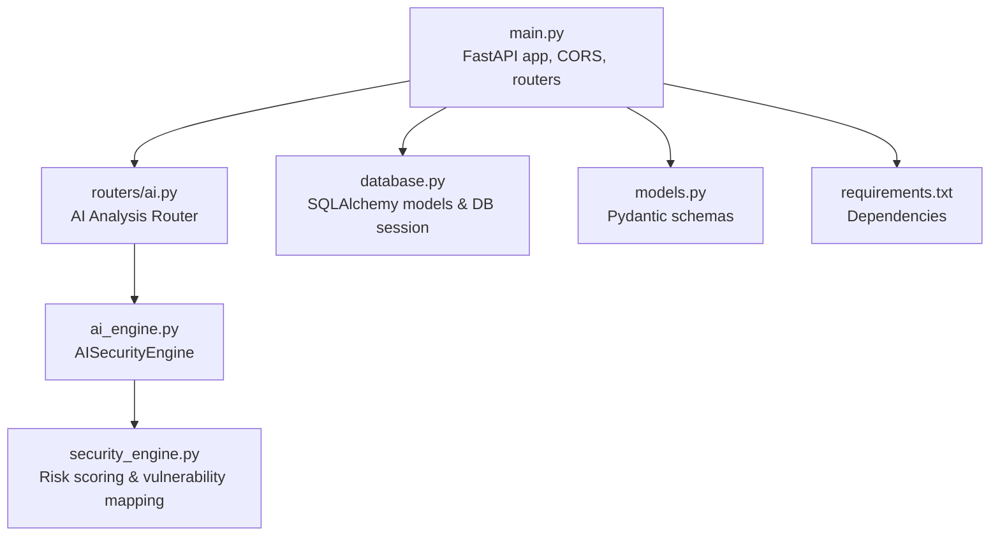
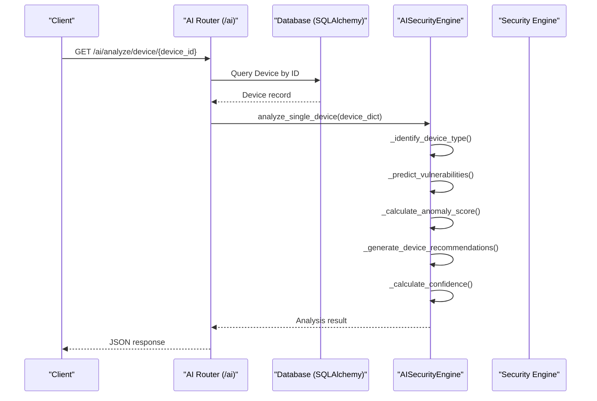
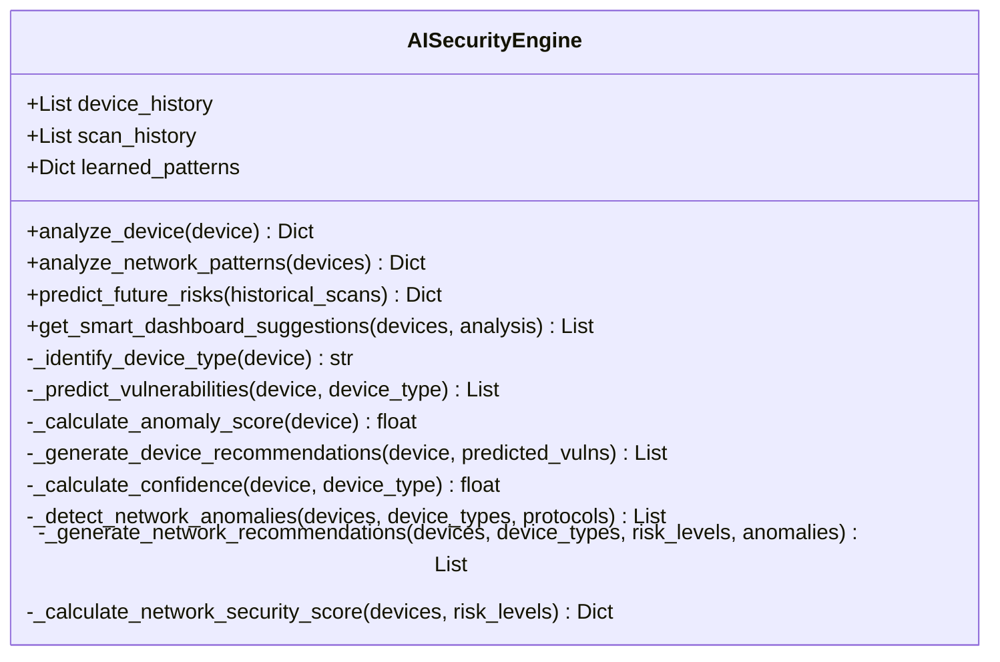
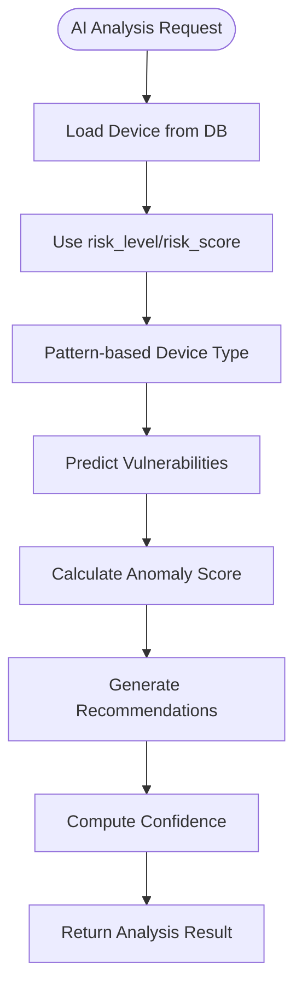
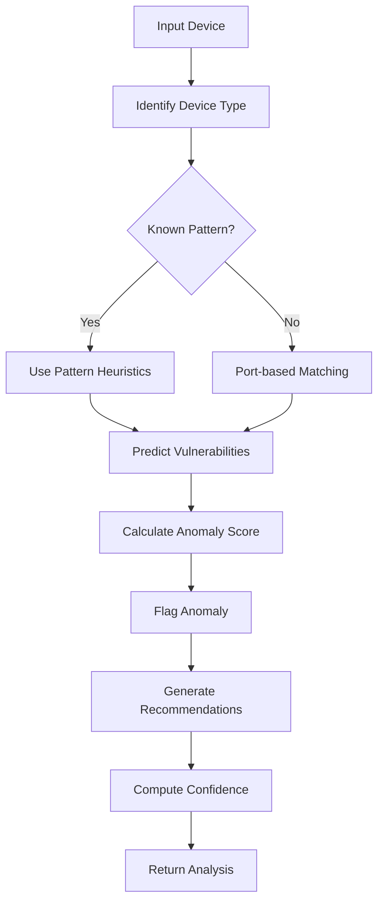
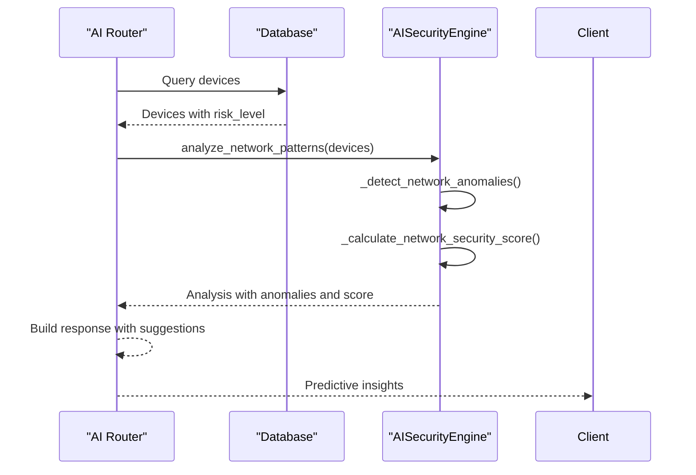
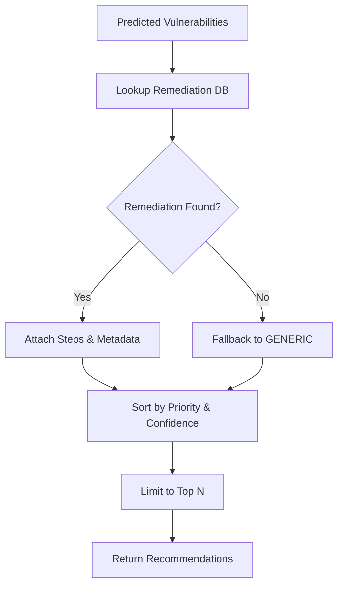
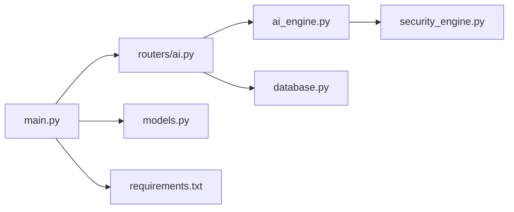

# AI Analysis API

<cite>
**Referenced Files in This Document**
- [main.py](file://backend/main.py)
- [ai.py](file://backend/routers/ai.py)
- [ai_engine.py](file://backend/ai_engine.py)
- [security_engine.py](file://backend/security_engine.py)
- [database.py](file://backend/database.py)
- [models.py](file://backend/models.py)
- [README.md](file://backend/README.md)
- [requirements.txt](file://backend/requirements.txt)
</cite>

## Table of Contents
1. [Introduction](#introduction)
2. [Project Structure](#project-structure)
3. [Core Components](#core-components)
4. [Architecture Overview](#architecture-overview)
5. [Detailed Component Analysis](#detailed-component-analysis)
6. [Dependency Analysis](#dependency-analysis)
7. [Performance Considerations](#performance-considerations)
8. [Troubleshooting Guide](#troubleshooting-guide)
9. [Conclusion](#conclusion)
10. [Appendices](#appendices)

## Introduction
This document provides comprehensive API documentation for PentexOne’s AI-powered security analysis endpoints. It covers machine learning–based vulnerability prediction, risk scoring algorithms, and intelligent security recommendations. The AI Analysis API integrates with the security engine to deliver:
- Device pattern recognition and anomaly detection
- Network-wide pattern analysis and anomaly detection
- Predictive security assessment
- Smart recommendation generation
- Confidence scoring mechanisms
- Real-time analysis capabilities

The endpoints are implemented as part of the FastAPI application and exposed under the /ai route prefix.

## Project Structure
The AI Analysis API resides in the backend module and is composed of:
- FastAPI application entry and router registration
- AI analysis router exposing endpoints
- AI engine implementing ML-free pattern matching and rule-based scoring
- Security engine providing risk scoring and vulnerability mapping
- Database models and ORM for device and vulnerability persistence
- Pydantic models for request/response schemas

**Diagram sources**
- [main.py:1-106](file://backend/main.py#L1-L106)
- [ai.py:1-330](file://backend/routers/ai.py#L1-L330)
- [ai_engine.py:1-766](file://backend/ai_engine.py#L1-L766)
- [security_engine.py:1-425](file://backend/security_engine.py#L1-L425)
- [database.py:1-80](file://backend/database.py#L1-L80)
- [models.py:1-71](file://backend/models.py#L1-L71)
- [requirements.txt:1-21](file://backend/requirements.txt#L1-L21)

**Section sources**
- [main.py:14-49](file://backend/main.py#L14-L49)
- [README.md:272-297](file://backend/README.md#L272-L297)

## Core Components
- AI Analysis Router: Exposes endpoints for single-device analysis, network-wide analysis, dashboard suggestions, remediation retrieval, risk prediction, device classification, and security score calculation.
- AI Engine: Implements device pattern recognition, anomaly detection, vulnerability prediction, recommendation generation, and confidence scoring using statistical heuristics and predefined pattern databases.
- Security Engine: Computes risk levels and scores based on open ports, protocols, default credentials, firmware/CVE checks, and TLS/SSL validation.
- Database Layer: Provides ORM models for devices and vulnerabilities, with relationships and CRUD operations.
- Pydantic Models: Define request/response schemas for API payloads and outputs.

**Section sources**
- [ai.py:20-330](file://backend/routers/ai.py#L20-L330)
- [ai_engine.py:236-766](file://backend/ai_engine.py#L236-L766)
- [security_engine.py:202-339](file://backend/security_engine.py#L202-L339)
- [database.py:12-42](file://backend/database.py#L12-L42)
- [models.py:6-71](file://backend/models.py#L6-L71)

## Architecture Overview
The AI Analysis API orchestrates requests through FastAPI, delegates analysis to the AI engine, and enriches results with data from the database and security engine.

**Diagram sources**
- [ai.py:26-64](file://backend/routers/ai.py#L26-L64)
- [ai_engine.py:247-275](file://backend/ai_engine.py#L247-L275)
- [database.py:12-27](file://backend/database.py#L12-L27)

## Detailed Component Analysis

### AI Analysis Router Endpoints
The AI router exposes the following endpoints under /ai:

- GET /ai/analyze/device/{device_id}
  - Purpose: AI-powered analysis for a single device.
  - Input: Path parameter device_id.
  - Output: Status, device_id, and analysis object containing device_type, predicted_vulnerabilities, anomaly_score, is_anomaly, recommendations, confidence, and timestamp.
  - Behavior: Queries the device, converts to dict, calls analyze_single_device, and returns structured JSON.

- GET /ai/analyze/network
  - Purpose: Network-wide AI analysis.
  - Input: None.
  - Output: Status, device_count, and analysis object including distributions, anomalies, recommendations, and security_score.

- GET /ai/suggestions
  - Purpose: Dashboard suggestions combining device-level and network-level insights.
  - Input: None.
  - Output: Status, suggestions, network_score, and timestamp.

- GET /ai/remediation/{vuln_type}
  - Purpose: Retrieve remediation steps for a specific vulnerability type.
  - Input: Path parameter vuln_type.
  - Output: Status, vulnerability type, and remediation object.

- GET /ai/remediations
  - Purpose: Retrieve all available remediation guides.
  - Input: None.
  - Output: Status and remediations dictionary.

- GET /ai/predict/risks
  - Purpose: Predict future risks based on current device state.
  - Input: None.
  - Output: Status, current_state counts, potential_escalations, and recommendation.

- GET /ai/classify/devices
  - Purpose: Classify all devices by type using AI pattern matching.
  - Input: None.
  - Output: Status, total_devices, device_types grouping, and classifications.

- GET /ai/security-score
  - Purpose: Calculate AI-derived security score for the network.
  - Input: None.
  - Output: Status, score object (score, grade, description), breakdown, improvement_suggestions, max_possible_score, and potential_improvement.

**Section sources**
- [ai.py:26-330](file://backend/routers/ai.py#L26-L330)

### AI Engine: AISecurityEngine
The AI engine encapsulates:
- Pattern-based device classification using keyword and port heuristics.
- Vulnerability prediction leveraging predefined pattern databases and port mappings.
- Anomaly detection scoring based on deviations from normal patterns.
- Recommendation generation from a remediation knowledge base.
- Confidence scoring derived from available metadata.

Key methods:
- analyze_device(): Orchestrates classification, prediction, anomaly scoring, recommendations, and confidence.
- _identify_device_type(): Matches hostname/vendor to known patterns and validates via common ports.
- _predict_vulnerabilities(): Builds a ranked list of predicted vulnerabilities using port-based, vendor-specific, and protocol-specific rules.
- _calculate_anomaly_score(): Computes anomaly score based on unusual ports, unknown vendor, high risk_score, and other signals.
- _generate_device_recommendations(): Retrieves remediation entries and sorts by priority and confidence.
- _calculate_confidence(): Estimates confidence based on presence of vendor, open ports, and protocol.
- analyze_network_patterns(): Aggregates distributions, detects anomalies, generates network recommendations, and computes a security score.
- _detect_network_anomalies(): Identifies high-risk ratios, unencrypted protocols, and unknown device types.
- _generate_network_recommendations(): Produces prioritized recommendations based on risk levels, device types, and anomalies.
- _calculate_network_security_score(): Computes weighted score and assigns letter grade.
- predict_future_risks(): Analyzes historical scan trends to predict risk changes.
- get_smart_dashboard_suggestions(): Generates actionable suggestions for dashboard and hardware checks.

**Diagram sources**
- [ai_engine.py:236-766](file://backend/ai_engine.py#L236-L766)

**Section sources**
- [ai_engine.py:236-766](file://backend/ai_engine.py#L236-L766)

### Security Engine Integration
The AI Analysis API complements the security engine by:
- Using device risk_level and risk_score from the database to inform AI predictions and confidence.
- Enriching vulnerability predictions with protocol-specific risk factors and remediation steps.
- Providing network-level risk insights that feed into the AI security score.

**Diagram sources**
- [ai_engine.py:247-275](file://backend/ai_engine.py#L247-L275)
- [database.py:12-27](file://backend/database.py#L12-L27)

**Section sources**
- [security_engine.py:202-339](file://backend/security_engine.py#L202-L339)
- [ai_engine.py:247-275](file://backend/ai_engine.py#L247-L275)

### Request and Response Schemas
- Device Analysis Endpoint
  - Request: Path parameter device_id (integer).
  - Response: Object with status, device_id, and analysis containing:
    - device_type (string)
    - predicted_vulnerabilities (array of objects with vuln_type, confidence, source, optional port/details)
    - anomaly_score (float), is_anomaly (boolean)
    - recommendations (array of objects with priority, vulnerability, severity, title, steps, estimated_time, impact, confidence)
    - confidence (float), analysis_timestamp (ISO string)

- Network Analysis Endpoint
  - Request: None.
  - Response: Object with status, device_count, and analysis containing:
    - device_type_distribution (object)
    - protocol_distribution (object)
    - risk_distribution (object)
    - top_vendors (object)
    - anomalies (array of objects with type, message, severity, optional protocol/recommendation)
    - recommendations (array of objects with priority, title, description, action, category)
    - security_score (object with score, grade, description, breakdown)

- Suggestions Endpoint
  - Request: None.
  - Response: Object with status, suggestions (array of suggestion objects), network_score (object), timestamp (ISO string).

- Remediation Endpoints
  - Request: Path parameter vuln_type (string).
  - Response: Object with status, vulnerability (string), remediation (object with severity, title, steps, priority, estimated_time, impact).

- Risk Prediction Endpoint
  - Request: None.
  - Response: Object with status, current_state (counts for risk, medium, safe, total), potential_escalations (array of device risk escalations), recommendation (string).

- Device Classification Endpoint
  - Request: None.
  - Response: Object with status, total_devices (integer), device_types (grouped by classified_type), classifications (array of device classification objects with device_id, ip, hostname, classified_type, confidence, is_anomaly).

- Security Score Endpoint
  - Request: None.
  - Response: Object with status, score (object with score, grade, description), breakdown (risk counts), improvement_suggestions (array of impact/action), max_possible_score (100), potential_improvement (integer).

**Section sources**
- [ai.py:26-330](file://backend/routers/ai.py#L26-L330)
- [ai_engine.py:247-275](file://backend/ai_engine.py#L247-L275)
- [ai_engine.py:464-513](file://backend/ai_engine.py#L464-L513)
- [ai_engine.py:650-687](file://backend/ai_engine.py#L650-L687)
- [ai_engine.py:689-739](file://backend/ai_engine.py#L689-L739)

### AI Processing Workflows

#### Device Pattern Recognition and Anomaly Detection

**Diagram sources**
- [ai_engine.py:277-298](file://backend/ai_engine.py#L277-L298)
- [ai_engine.py:300-371](file://backend/ai_engine.py#L300-L371)
- [ai_engine.py:373-405](file://backend/ai_engine.py#L373-L405)
- [ai_engine.py:407-438](file://backend/ai_engine.py#L407-L438)
- [ai_engine.py:440-462](file://backend/ai_engine.py#L440-L462)

#### Predictive Security Assessment

**Diagram sources**
- [ai.py:70-100](file://backend/routers/ai.py#L70-L100)
- [ai_engine.py:464-513](file://backend/ai_engine.py#L464-L513)
- [ai_engine.py:515-553](file://backend/ai_engine.py#L515-L553)
- [ai_engine.py:605-648](file://backend/ai_engine.py#L605-L648)

#### Smart Recommendation Generation

**Diagram sources**
- [ai_engine.py:407-438](file://backend/ai_engine.py#L407-L438)
- [ai_engine.py:99-233](file://backend/ai_engine.py#L99-L233)

## Dependency Analysis
- FastAPI application registers the AI router and includes other routers.
- AI router depends on database session and the AI engine.
- AI engine depends on pattern databases, remediation knowledge base, and configuration constants.
- Security engine provides risk scoring and vulnerability mapping used by the AI engine.
- Database models define relationships between devices and vulnerabilities.

**Diagram sources**
- [main.py:14-49](file://backend/main.py#L14-L49)
- [ai.py:10-18](file://backend/routers/ai.py#L10-L18)
- [ai_engine.py:15-29](file://backend/ai_engine.py#L15-L29)
- [security_engine.py:12-14](file://backend/security_engine.py#L12-L14)
- [database.py:1-9](file://backend/database.py#L1-L9)
- [models.py:1-3](file://backend/models.py#L1-L3)
- [requirements.txt:1-21](file://backend/requirements.txt#L1-L21)

**Section sources**
- [main.py:14-49](file://backend/main.py#L14-L49)
- [ai.py:10-18](file://backend/routers/ai.py#L10-L18)
- [ai_engine.py:15-29](file://backend/ai_engine.py#L15-L29)
- [security_engine.py:12-14](file://backend/security_engine.py#L12-L14)
- [database.py:1-9](file://backend/database.py#L1-L9)
- [models.py:1-3](file://backend/models.py#L1-L3)
- [requirements.txt:1-21](file://backend/requirements.txt#L1-L21)

## Performance Considerations
- AI Engine uses rule-based heuristics and statistical thresholds, avoiding heavy ML libraries. This keeps CPU usage moderate and suitable for resource-constrained environments like Raspberry Pi.
- Network analysis requires a minimum number of devices to establish meaningful patterns; otherwise, it returns an insufficient data status.
- Confidence scoring and anomaly detection are lightweight computations that scale linearly with device count.
- Recommendations are limited to top-N results to reduce payload size and improve responsiveness.
- For large networks, consider batching requests and caching frequent queries to minimize repeated computation.

[No sources needed since this section provides general guidance]

## Troubleshooting Guide
Common issues and resolutions:
- Endpoint returns insufficient data for pattern analysis: Ensure the network has at least the minimum number of devices required for pattern establishment.
- No devices found: Confirm that scanning has been performed and devices are persisted in the database.
- Remediation not found: The vulnerability type may be unknown; fallback to generic remediation is applied.
- High CPU usage during AI analysis: Reduce concurrent scans or limit the number of devices processed in a single request.
- Authentication failures: Verify credentials and ensure the login endpoint is used before accessing protected routes.

**Section sources**
- [ai_engine.py:468-472](file://backend/ai_engine.py#L468-L472)
- [ai.py:32-35](file://backend/routers/ai.py#L32-L35)
- [ai_engine.py:763-765](file://backend/ai_engine.py#L763-L765)
- [README.md:349-381](file://backend/README.md#L349-L381)

## Conclusion
The AI Analysis API delivers practical, rule-based AI insights for IoT security, enabling intelligent vulnerability prediction, anomaly detection, and actionable recommendations. Its integration with the security engine and database ensures robust, real-time analysis suitable for diverse environments, including Raspberry Pi deployments.

[No sources needed since this section summarizes without analyzing specific files]

## Appendices

### API Reference Summary
- GET /ai/analyze/device/{device_id}: Single-device AI analysis.
- GET /ai/analyze/network: Network-wide analysis.
- GET /ai/suggestions: Dashboard suggestions.
- GET /ai/remediation/{vuln_type}: Remediation steps for a vulnerability type.
- GET /ai/remediations: All remediation guides.
- GET /ai/predict/risks: Predictive risk assessment.
- GET /ai/classify/devices: Device classification by type.
- GET /ai/security-score: Network security score.

**Section sources**
- [ai.py:26-330](file://backend/routers/ai.py#L26-L330)