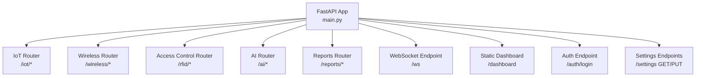
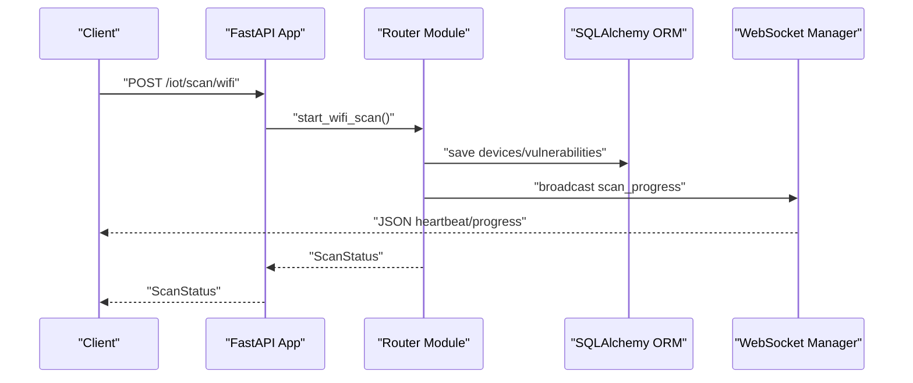
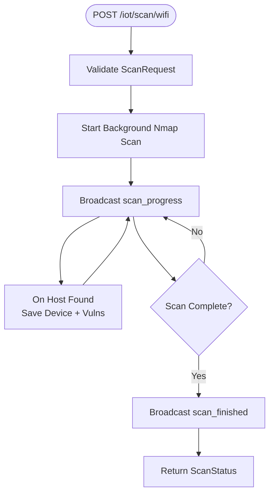
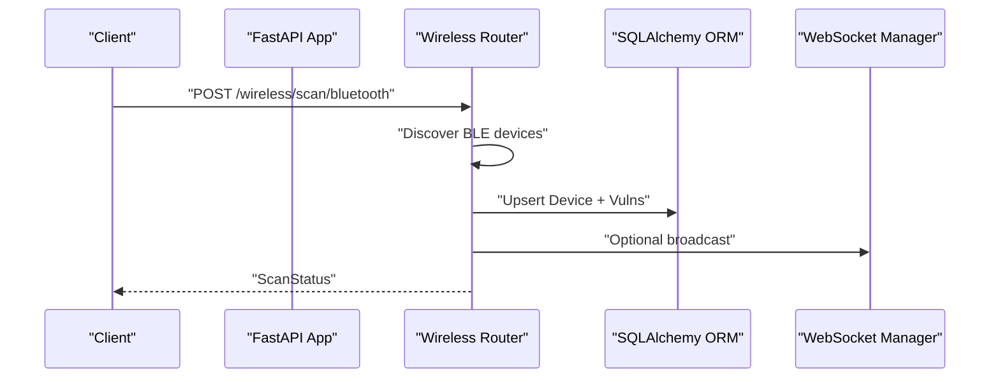
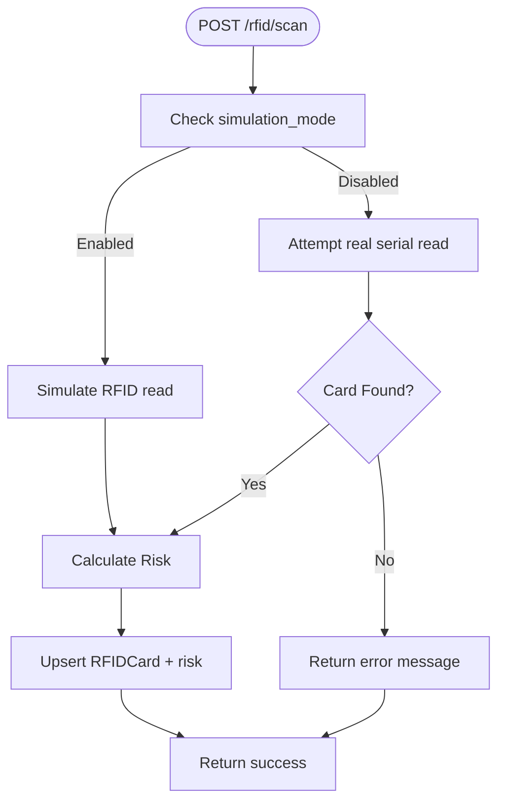
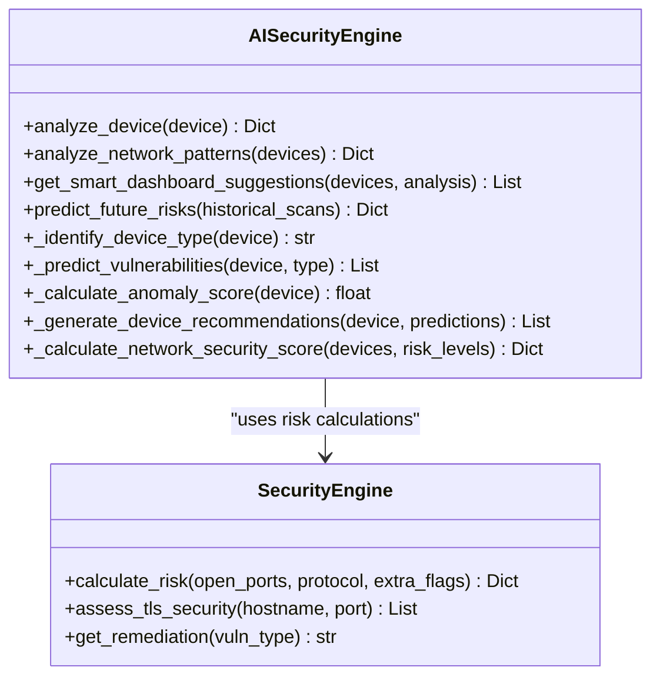
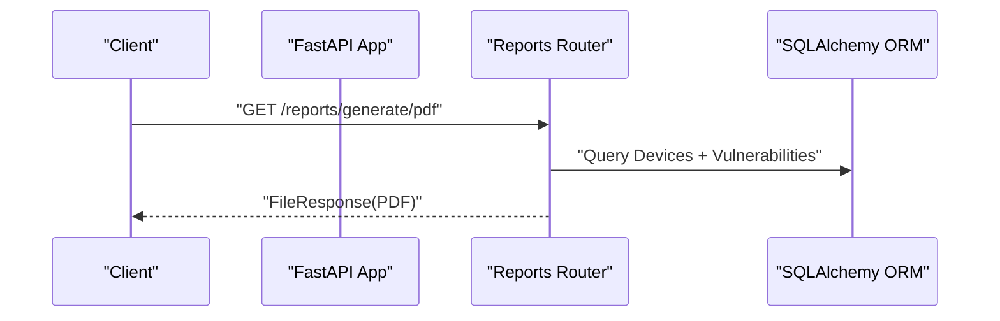
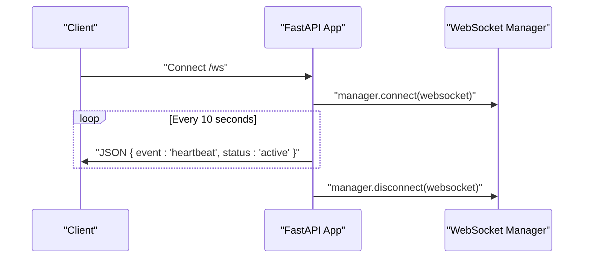
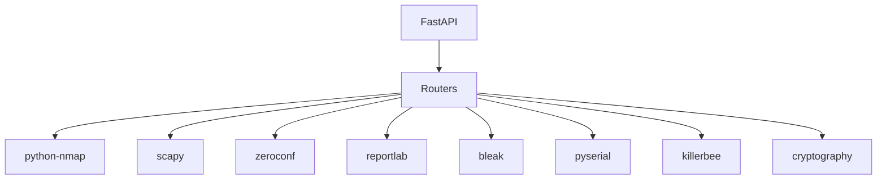

# API Reference

<cite>
**Referenced Files in This Document**
- [main.py](file://backend/main.py)
- [iot.py](file://backend/routers/iot.py)
- [access_control.py](file://backend/routers/access_control.py)
- [wifi_bt.py](file://backend/routers/wifi_bt.py)
- [ai.py](file://backend/routers/ai.py)
- [reports.py](file://backend/routers/reports.py)
- [models.py](file://backend/models.py)
- [database.py](file://backend/database.py)
- [security_engine.py](file://backend/security_engine.py)
- [websocket_manager.py](file://backend/websocket_manager.py)
- [ai_engine.py](file://backend/ai_engine.py)
- [requirements.txt](file://backend/requirements.txt)
</cite>

## Table of Contents
1. [Introduction](#introduction)
2. [Project Structure](#project-structure)
3. [Core Components](#core-components)
4. [Architecture Overview](#architecture-overview)
5. [Detailed Component Analysis](#detailed-component-analysis)
6. [Dependency Analysis](#dependency-analysis)
7. [Performance Considerations](#performance-considerations)
8. [Troubleshooting Guide](#troubleshooting-guide)
9. [Conclusion](#conclusion)
10. [Appendices](#appendices)

## Introduction
This document provides comprehensive API documentation for the PentexOne IoT Security Platform. It covers all REST endpoints grouped by router modules, including IoT scanning, AI analysis, access control, wireless security, and reporting. It also documents WebSocket endpoints for real-time communication, authentication requirements, request/response schemas, error handling, rate limiting, security considerations, and API versioning.

## Project Structure
The backend is organized around a FastAPI application that mounts multiple routers under distinct prefixes. Each router encapsulates a functional domain:
- IoT scanning and discovery
- Wireless security (Wi-Fi, Bluetooth)
- Access control (RFID/NFC)
- AI-powered analysis
- Reporting and PDF generation
- Real-time WebSocket communication

**Diagram sources**
- [main.py:44-48](file://backend/main.py#L44-L48)
- [main.py:85-101](file://backend/main.py#L85-L101)
- [main.py:50-64](file://backend/main.py#L50-L64)

**Section sources**
- [main.py:14-48](file://backend/main.py#L14-L48)

## Core Components
- Authentication: Basic login endpoint with username/password validation.
- Settings: CRUD-like endpoints to manage runtime settings (simulation mode, timeouts).
- WebSocket: Heartbeat-based real-time notifications for scan progress and events.
- Data Models: Pydantic models for request/response schemas and database entities.
- Security Engine: Centralized risk calculation and remediation mapping.
- AI Engine: Pattern-based vulnerability prediction and recommendations.

**Section sources**
- [main.py:29-31](file://backend/main.py#L29-L31)
- [main.py:70-74](file://backend/main.py#L70-L74)
- [models.py:6-71](file://backend/models.py#L6-L71)
- [database.py:12-61](file://backend/database.py#L12-L61)
- [security_engine.py:202-339](file://backend/security_engine.py#L202-L339)
- [ai_engine.py:236-766](file://backend/ai_engine.py#L236-L766)

## Architecture Overview
The system integrates hardware detection, network scanning, protocol-specific discovery, and AI-driven analysis. Real-time updates are delivered via WebSocket broadcasts from background tasks.

**Diagram sources**
- [iot.py:291-298](file://backend/routers/iot.py#L291-L298)
- [iot.py:300-413](file://backend/routers/iot.py#L300-L413)
- [websocket_manager.py:21-45](file://backend/websocket_manager.py#L21-L45)

## Detailed Component Analysis

### Authentication and Settings
- POST /auth/login
  - Request body: LoginRequest { username, password }
  - Response: JSON { status: "ok" } or 401 Unauthorized
  - Notes: Username and password are environment-backed constants.

- GET /settings
  - Response: JSON { key: value } for all settings.

- PUT /settings
  - Request body: SettingUpdate { simulation_mode?, nmap_timeout? }
  - Response: JSON { status: "success" }

**Section sources**
- [main.py:29-31](file://backend/main.py#L29-L31)
- [main.py:70-74](file://backend/main.py#L70-L74)
- [main.py:50-64](file://backend/main.py#L50-L64)
- [models.py:68-71](file://backend/models.py#L68-L71)
- [database.py:56-61](file://backend/database.py#L56-L61)

### IoT Security Endpoints (/iot)
- GET /networks/discover
  - Response: JSON { networks: [{ network, interface, type }], count }
  - Notes: OS-specific discovery using system tools.

- POST /scan/wifi
  - Request body: ScanRequest { network, timeout }
  - Response: ScanStatus { status, message, devices_found }
  - Behavior: Background Nmap scan; emits progress and completion events via WebSocket.

- GET /scan/status
  - Response: JSON { running, progress, message, devices_found }

- GET /devices
  - Response: Array of DeviceOut sorted by risk_score desc.

- GET /devices/{device_id}
  - Response: DeviceOut or 404 Not Found.

- DELETE /devices
  - Response: JSON { message }

- POST /scan/matter
  - Response: ScanStatus; discovers Matter devices via mDNS.

- POST /scan/zigbee
  - Response: ScanStatus; uses KillerBee if available, otherwise simulated.

- POST /scan/thread
  - Response: ScanStatus; uses hardware if available, otherwise simulated.

- POST /scan/zwave
  - Response: ScanStatus; simulated with serial port detection.

- POST /scan/lora
  - Response: ScanStatus; simulated LoRaWAN discovery.

- GET /devices/{device_id}
  - Response: DeviceOut or 404 Not Found.

- DELETE /devices
  - Response: JSON { message }

**Diagram sources**
- [iot.py:291-298](file://backend/routers/iot.py#L291-L298)
- [iot.py:300-413](file://backend/routers/iot.py#L300-L413)
- [websocket_manager.py:21-45](file://backend/websocket_manager.py#L21-L45)

**Section sources**
- [iot.py:194-283](file://backend/routers/iot.py#L194-L283)
- [iot.py:291-413](file://backend/routers/iot.py#L291-L413)
- [iot.py:418-477](file://backend/routers/iot.py#L418-L477)
- [iot.py:483-586](file://backend/routers/iot.py#L483-L586)
- [iot.py:625-721](file://backend/routers/iot.py#L625-L721)
- [iot.py:727-777](file://backend/routers/iot.py#L727-L777)
- [iot.py:783-800](file://backend/routers/iot.py#L783-L800)
- [iot.py:591-593](file://backend/routers/iot.py#L591-L593)
- [iot.py:599-619](file://backend/routers/iot.py#L599-L619)

### Wireless Security Endpoints (/wireless)
- GET /interfaces
  - Response: JSON { interfaces: [string] }

- POST /test/ports/{ip}
  - Response: JSON { status, message }

- POST /test/credentials/{ip}
  - Response: JSON { status, message }

- POST /scan/full/{ip}
  - Response: JSON { status, message }

- POST /scan/bluetooth
  - Response: ScanStatus; BLE discovery via Bleak if available.

- GET /scan/ssids
  - Response: JSON { status, ssids[], count } or partial/error variants.

- POST /tls/check/{host}
  - Query params: port (default 443)
  - Response: JSON { status, host, port, issues[], secure }

- POST /deauth/start
  - Query params: interface (default wlan0mon)
  - Response: JSON { status, message }

- POST /deauth/stop
  - Response: JSON { status, message }

- GET /deauth/status
  - Response: JSON { monitoring, packets_detected, last_alert? }

- POST /discover/devices
  - Response: JSON { status, network, message }

**Diagram sources**
- [wifi_bt.py:182-187](file://backend/routers/wifi_bt.py#L182-L187)
- [wifi_bt.py:190-240](file://backend/routers/wifi_bt.py#L190-L240)

**Section sources**
- [wifi_bt.py:39-53](file://backend/routers/wifi_bt.py#L39-L53)
- [wifi_bt.py:59-96](file://backend/routers/wifi_bt.py#L59-L96)
- [wifi_bt.py:101-167](file://backend/routers/wifi_bt.py#L101-L167)
- [wifi_bt.py:172-176](file://backend/routers/wifi_bt.py#L172-L176)
- [wifi_bt.py:182-240](file://backend/routers/wifi_bt.py#L182-L240)
- [wifi_bt.py:245-441](file://backend/routers/wifi_bt.py#L245-L441)
- [wifi_bt.py:447-549](file://backend/routers/wifi_bt.py#L447-L549)
- [wifi_bt.py:555-579](file://backend/routers/wifi_bt.py#L555-L579)
- [wifi_bt.py:582-631](file://backend/routers/wifi_bt.py#L582-L631)
- [wifi_bt.py:636-766](file://backend/routers/wifi_bt.py#L636-L766)

### Access Control Endpoints (/rfid)
- POST /scan
  - Response: JSON { status, message }
  - Behavior: Attempts real RFID/NFC read via serial; falls back to simulated mode if disabled or hardware unavailable.

- GET /cards
  - Response: Array of RFIDCardOut ordered by last_seen desc.

- DELETE /cards
  - Response: JSON { status, message }

**Diagram sources**
- [access_control.py:47-84](file://backend/routers/access_control.py#L47-L84)
- [access_control.py:15-27](file://backend/routers/access_control.py#L15-L27)
- [access_control.py:29-45](file://backend/routers/access_control.py#L29-L45)

**Section sources**
- [access_control.py:47-84](file://backend/routers/access_control.py#L47-L84)
- [access_control.py:86-94](file://backend/routers/access_control.py#L86-L94)

### AI Analysis Endpoints (/ai)
- GET /analyze/device/{device_id}
  - Response: JSON { status, device_id, analysis }

- GET /analyze/network
  - Response: JSON { status, device_count, analysis }

- GET /suggestions
  - Response: JSON { status, suggestions, network_score, timestamp }

- GET /remediation/{vuln_type}
  - Response: JSON { status, vulnerability, remediation }

- GET /remediations
  - Response: JSON { status, remediations }

- GET /predict/risks
  - Response: JSON { status, current_state, potential_escalations[], recommendation }

- GET /classify/devices
  - Response: JSON { status, total_devices, device_types{}, classifications[] }

- GET /security-score
  - Response: JSON { status, score, breakdown, improvement_suggestions[], max_possible_score, potential_improvement }

**Diagram sources**
- [ai_engine.py:236-766](file://backend/ai_engine.py#L236-L766)
- [security_engine.py:202-339](file://backend/security_engine.py#L202-L339)

**Section sources**
- [ai.py:26-64](file://backend/routers/ai.py#L26-L64)
- [ai.py:70-100](file://backend/routers/ai.py#L70-L100)
- [ai.py:106-138](file://backend/routers/ai.py#L106-L138)
- [ai.py:144-155](file://backend/routers/ai.py#L144-L155)
- [ai.py:161-169](file://backend/routers/ai.py#L161-L169)
- [ai.py:175-220](file://backend/routers/ai.py#L175-L220)
- [ai.py:226-264](file://backend/routers/ai.py#L226-L264)
- [ai.py:270-329](file://backend/routers/ai.py#L270-L329)

### Reporting Endpoints (/reports)
- GET /summary
  - Response: ReportSummary { total_devices, safe_count, medium_count, risk_count, unknown_count, scan_time }

- GET /generate/pdf
  - Response: FileResponse (PDF) with generated filename

**Diagram sources**
- [reports.py:37-157](file://backend/routers/reports.py#L37-L157)

**Section sources**
- [reports.py:18-34](file://backend/routers/reports.py#L18-L34)
- [reports.py:37-157](file://backend/routers/reports.py#L37-L157)

### WebSocket Endpoints
- GET /ws
  - Behavior: Accepts WebSocket connection and sends periodic heartbeat messages. Broadcasts scan progress and events from background tasks.

**Diagram sources**
- [main.py:90-101](file://backend/main.py#L90-L101)
- [websocket_manager.py:11-19](file://backend/websocket_manager.py#L11-L19)

**Section sources**
- [main.py:90-101](file://backend/main.py#L90-L101)
- [websocket_manager.py:7-47](file://backend/websocket_manager.py#L7-L47)

## Dependency Analysis
Key dependencies and their roles:
- FastAPI: Application framework and routing.
- python-nmap: Network discovery and port scanning.
- scapy: Deauthentication frame detection.
- zeroconf: mDNS discovery for Matter devices.
- reportlab: PDF report generation.
- bleak: BLE device discovery (optional).
- pyserial: RFID/NFC serial communication.
- killerbee: Zigbee sniffing (optional).
- cryptography: TLS certificate parsing.

**Diagram sources**
- [requirements.txt:1-21](file://backend/requirements.txt#L1-L21)

**Section sources**
- [requirements.txt:1-21](file://backend/requirements.txt#L1-L21)

## Performance Considerations
- Background scanning tasks prevent blocking the main event loop; use ScanStatus to poll progress.
- Nmap scans can be resource-intensive; tune network ranges and timeouts.
- WebSocket broadcasting uses thread-safe coroutine scheduling; ensure minimal payload sizes for frequent events.
- AI analysis relies on rule-based heuristics; results are deterministic and fast.

[No sources needed since this section provides general guidance]

## Troubleshooting Guide
- Authentication failures: Ensure username/password match environment-backed constants.
- No devices found during scans: Verify network connectivity, permissions, and hardware dongles.
- BLE scanning errors: Install bleak and ensure OS-level Bluetooth support.
- TLS checks fail: Confirm target hosts expose HTTPS on the specified port and certificates are valid.
- WebSocket disconnections: Check server logs for exceptions and ensure client reconnect logic.

**Section sources**
- [main.py:23-32](file://backend/main.py#L23-L32)
- [wifi_bt.py:184-186](file://backend/routers/wifi_bt.py#L184-L186)
- [wifi_bt.py:582-631](file://backend/routers/wifi_bt.py#L582-L631)
- [websocket_manager.py:16-19](file://backend/websocket_manager.py#L16-L19)

## Conclusion
The PentexOne API provides a comprehensive toolkit for IoT security scanning, AI-driven analysis, access control auditing, and reporting. Real-time updates via WebSocket enhance operational visibility. Adhering to the documented schemas, authentication, and security considerations ensures reliable operation across diverse environments.

[No sources needed since this section summarizes without analyzing specific files]

## Appendices

### Request/Response Schemas
- LoginRequest
  - Fields: username (string), password (string)

- ScanRequest
  - Fields: network (string, default "192.168.1.0/24"), timeout (integer)

- ScanStatus
  - Fields: status (string), message (string), devices_found (integer)

- DeviceOut
  - Fields: id, ip, mac, hostname, vendor, protocol, os_guess, risk_level, risk_score, open_ports, last_seen, vulnerabilities

- VulnerabilityOut
  - Fields: id, vuln_type, severity, description, port, protocol

- ReportSummary
  - Fields: total_devices, safe_count, medium_count, risk_count, unknown_count, scan_time

- RFIDCardOut
  - Fields: id, uid, card_type, sak, data, risk_level, risk_score, last_seen

- SettingUpdate
  - Fields: simulation_mode (optional), nmap_timeout (optional)

**Section sources**
- [models.py:6-71](file://backend/models.py#L6-L71)

### Error Codes
- 401 Unauthorized: Invalid credentials on /auth/login.
- 404 Not Found: Device not found on /iot/devices/{device_id}.
- 500 Internal Server Error: Exceptions raised by background tasks or system commands.

**Section sources**
- [main.py:70-74](file://backend/main.py#L70-L74)
- [iot.py:605-611](file://backend/routers/iot.py#L605-L611)

### Rate Limiting and Security Considerations
- Rate limiting: Not implemented at the API level; consider adding middleware for production deployments.
- Transport security: Use HTTPS in production; enforce TLS for WebSocket upgrades.
- Authentication: Enforce JWT or session-based auth for sensitive endpoints.
- Input validation: All endpoints validate request bodies using Pydantic models.
- Permissions: Restrict administrative endpoints (settings, device deletion) to authorized users.

[No sources needed since this section provides general guidance]

### API Versioning
- No explicit versioning scheme is implemented. Consider adding a version prefix (e.g., /api/v1) or Accept-Version header for future-proofing.

[No sources needed since this section provides general guidance]