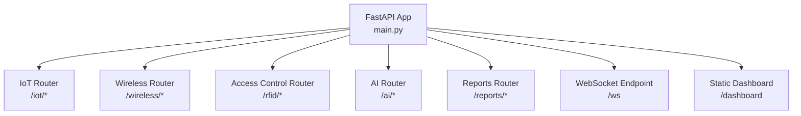
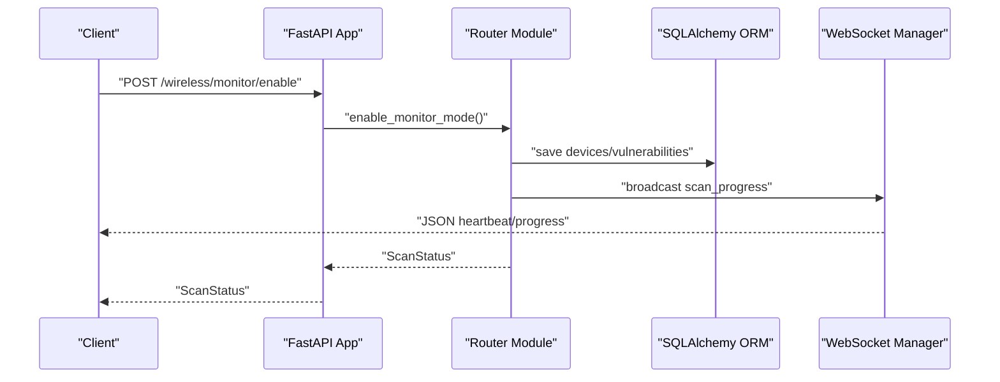
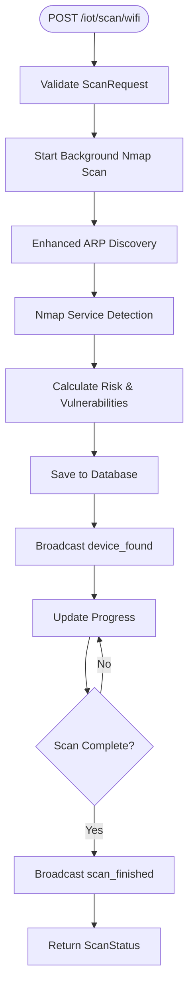
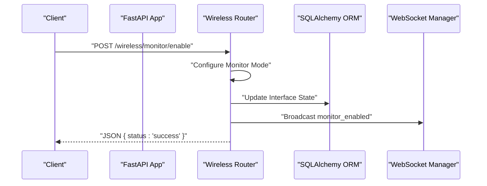
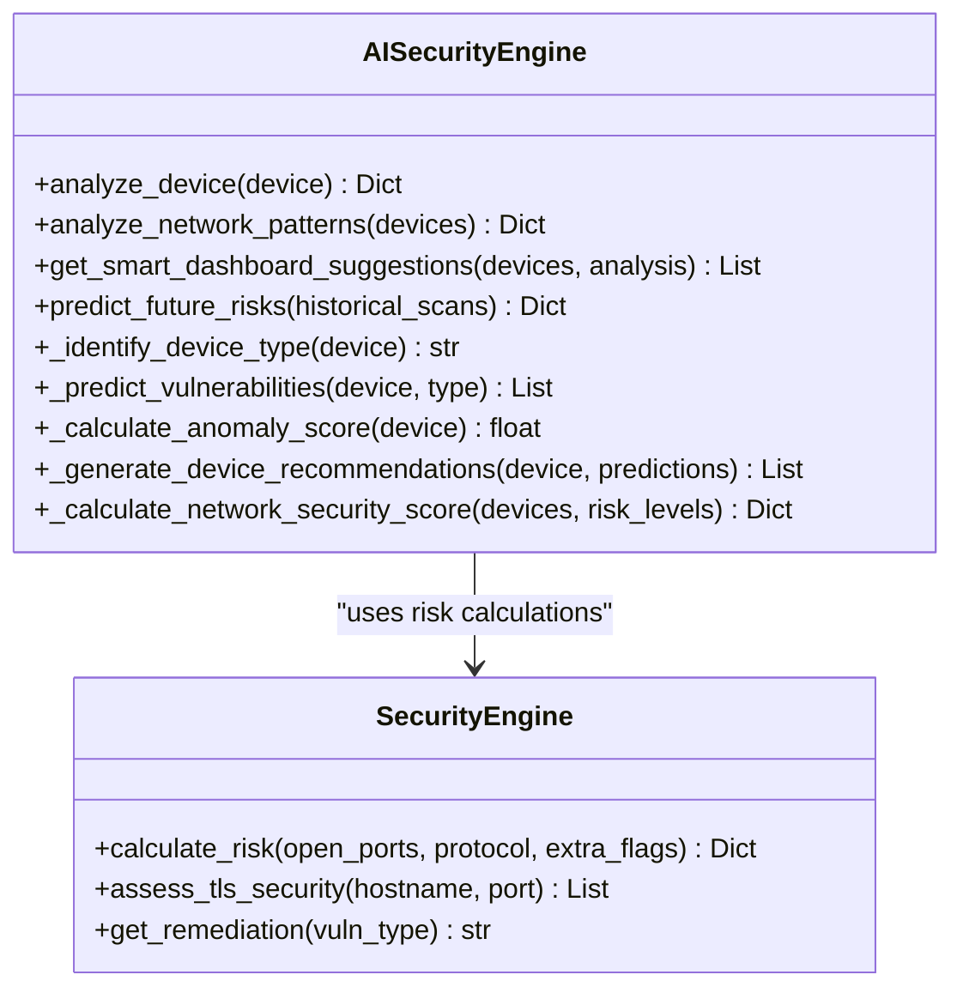
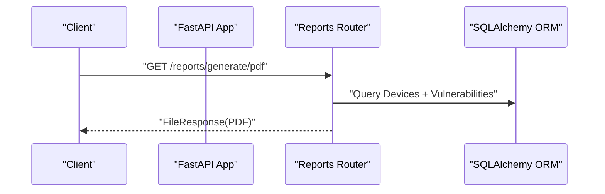
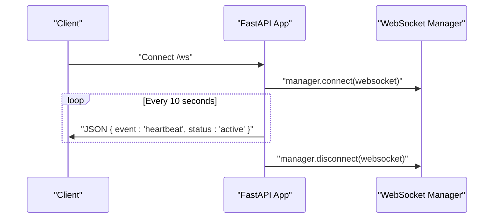
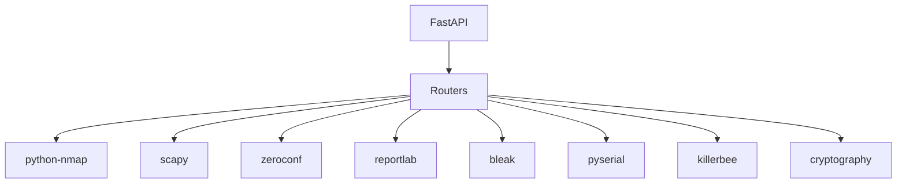

# API Reference

<cite>
**Referenced Files in This Document**
- [main.py](file://backend/main.py)
- [iot.py](file://backend/routers/iot.py)
- [access_control.py](file://backend/routers/access_control.py)
- [wifi_bt.py](file://backend/routers/wifi_bt.py)
- [ai.py](file://backend/routers/ai.py)
- [reports.py](file://backend/routers/reports.py)
- [models.py](file://backend/models.py)
- [database.py](file://backend/database.py)
- [websocket_manager.py](file://backend/websocket_manager.py)
- [requirements.txt](file://backend/requirements.txt)
</cite>

## Update Summary
**Changes Made**
- Removed deprecated authentication endpoints and login page references
- Enhanced WiFi/Bluetooth monitoring with comprehensive security testing capabilities
- Improved IoT scanning with enhanced hardware detection and device discovery
- Updated WebSocket communication with new event types for advanced monitoring
- Added new WiFi security testing endpoints including monitor mode, client sniffing, and handshake capture
- Enhanced access control with improved RFID/NFC card analysis

## Table of Contents
1. [Introduction](#introduction)
2. [Project Structure](#project-structure)
3. [Core Components](#core-components)
4. [Architecture Overview](#architecture-overview)
5. [Detailed Component Analysis](#detailed-component-analysis)
6. [Dependency Analysis](#dependency-analysis)
7. [Performance Considerations](#performance-considerations)
8. [Troubleshooting Guide](#troubleshooting-guide)
9. [Conclusion](#conclusion)
10. [Appendices](#appendices)

## Introduction
This document provides comprehensive API documentation for the PentexOne IoT Security Platform. It covers all REST endpoints grouped by router modules, including IoT scanning, AI analysis, access control, wireless security, and reporting. It also documents WebSocket endpoints for real-time communication, request/response schemas, error handling, rate limiting, security considerations, and API versioning.

**Updated** Enhanced with new WiFi/Bluetooth monitoring capabilities, improved IoT scanning functionality, and updated WebSocket communication features. Authentication endpoints have been removed for development purposes.

## Project Structure
The backend is organized around a FastAPI application that mounts multiple routers under distinct prefixes. Each router encapsulates a functional domain:
- IoT scanning and discovery with advanced hardware detection
- Wireless security (Wi-Fi, Bluetooth) with comprehensive monitoring capabilities
- Access control (RFID/NFC)
- AI-powered analysis
- Reporting and PDF generation
- Real-time WebSocket communication

**Diagram sources**
- [main.py:68-72](file://backend/main.py#L68-L72)
- [main.py:103-126](file://backend/main.py#L103-L126)
- [main.py:94-101](file://backend/main.py#L94-L101)

**Section sources**
- [main.py:46-72](file://backend/main.py#L46-L72)

## Core Components
- Settings: CRUD-like endpoints to manage runtime settings (simulation mode, timeouts).
- WebSocket: Heartbeat-based real-time notifications for scan progress and events.
- Data Models: Pydantic models for request/response schemas and database entities.
- Security Engine: Centralized risk calculation and remediation mapping.
- AI Engine: Pattern-based vulnerability prediction and recommendations.

**Section sources**
- [main.py:78-92](file://backend/main.py#L78-L92)
- [models.py:6-71](file://backend/models.py#L6-L71)
- [database.py:12-80](file://backend/database.py#L12-L80)

## Architecture Overview
The system integrates hardware detection, network scanning, protocol-specific discovery, and AI-driven analysis. Real-time updates are delivered via WebSocket broadcasts from background tasks.

**Diagram sources**
- [wifi_bt.py:923-1028](file://backend/routers/wifi_bt.py#L923-L1028)
- [websocket_manager.py:21-53](file://backend/websocket_manager.py#L21-L53)

## Detailed Component Analysis

### Settings Endpoints
- GET /settings
  - Response: JSON { key: value } for all settings.

- PUT /settings
  - Request body: SettingUpdate { simulation_mode?, nmap_timeout? }
  - Response: JSON { status: "success" }

**Section sources**
- [main.py:78-92](file://backend/main.py#L78-L92)
- [models.py:68-71](file://backend/models.py#L68-L71)
- [database.py:72-80](file://backend/database.py#L72-L80)

### IoT Security Endpoints (/iot)
**Updated** Enhanced with comprehensive hardware detection and improved device discovery capabilities.

- GET /networks/discover
  - Response: JSON { networks: [{ network, interface, type }], count }
  - Notes: OS-specific discovery using system tools.

- POST /scan/wifi
  - Request body: ScanRequest { network, timeout }
  - Response: ScanStatus { status, message, devices_found }
  - Behavior: Background Nmap scan with enhanced ARP integration; emits progress and completion events via WebSocket.

- GET /scan/status
  - Response: JSON { running, progress, message, devices_found }

- GET /devices
  - Response: Array of DeviceOut sorted by risk_score desc.

- GET /devices/{device_id}
  - Response: DeviceOut or 404 Not Found.

- DELETE /devices
  - Response: JSON { message }

- POST /scan/matter
  - Response: ScanStatus; discovers Matter devices via mDNS with enhanced risk assessment.

- POST /scan/zigbee
  - Response: ScanStatus; uses KillerBee if available, otherwise simulated with improved device detection.

- POST /scan/thread
  - Response: ScanStatus; uses hardware if available, otherwise simulated with enhanced discovery.

- POST /scan/zwave
  - Response: ScanStatus; simulated with serial port detection and improved risk scoring.

- POST /scan/lora
  - Response: ScanStatus; simulated LoRaWAN discovery with comprehensive vulnerability assessment.

- GET /hardware/status
  - Response: JSON { status, dongles, summary, killerbee_available, total_connected }
  - Notes: Comprehensive hardware detection showing all connected dongles and their status.

**Diagram sources**
- [iot.py:465-708](file://backend/routers/iot.py#L465-L708)
- [websocket_manager.py:21-53](file://backend/websocket_manager.py#L21-L53)

**Section sources**
- [iot.py:368-457](file://backend/routers/iot.py#L368-L457)
- [iot.py:465-708](file://backend/routers/iot.py#L465-L708)
- [iot.py:714-777](file://backend/routers/iot.py#L714-L777)
- [iot.py:783-800](file://backend/routers/iot.py#L783-L800)
- [iot.py:201-330](file://backend/routers/iot.py#L201-L330)

### Wireless Security Endpoints (/wireless)
**Updated** Enhanced with comprehensive WiFi security testing capabilities including monitor mode, client sniffing, handshake capture, and advanced threat detection.

- GET /interfaces
  - Response: JSON { interfaces: [string] }

- POST /test/ports/{ip}
  - Response: JSON { status, message }

- POST /test/credentials/{ip}
  - Response: JSON { status, message }

- POST /scan/full/{ip}
  - Response: JSON { status, message }

- POST /scan/bluetooth
  - Response: ScanStatus; BLE discovery via Bleak if available with enhanced device classification.

- GET /scan/ssids
  - Response: JSON { status, ssids[], count } or partial/error variants with improved macOS compatibility.

- POST /tls/check/{host}
  - Query params: port (default 443)
  - Response: JSON { status, host, port, issues[], secure }

- POST /discover/devices
  - Response: JSON { status, network, message }
  - Notes: One-click discovery of all devices on current network with enhanced detection.

- POST /monitor/enable
  - Response: JSON { status, message, interface, original_interface, channel }
  - Notes: Enable monitor mode on Wi-Fi interface with RPi 5 built-in WiFi support.

- POST /monitor/disable
  - Response: JSON { status, message }

- GET /monitor/status
  - Response: JSON { active, interface, original_interface, mode, channel, started_at, actual_mode, actual_channel, platform }

- POST /monitor/channel
  - Response: JSON { status, message, channel }

- POST /sniffer/start
  - Response: JSON { status, message, interface, duration, clients_found: 0, probe_requests: 0 }

- POST /sniffer/stop
  - Response: JSON { status, clients_found, probe_requests }

- GET /sniffer/status
  - Response: JSON { active, clients: [], probe_requests: [], packets_captured, started_at }

- GET /sniffer/clients
  - Response: JSON { clients: [], count }

- POST /handshake/start
  - Response: JSON { status, message, bssid, channel, timeout }

- POST /handshake/stop
  - Response: JSON { status, handshake_captured, capture_file }

- GET /handshake/status
  - Response: JSON { active, target_ssid, target_bssid, channel, handshake_captured, capture_file, packets_captured, started_at }

- POST /deauth/test
  - Response: JSON { status, message, target, ap, count }

- GET /deauth/test/status
  - Response: JSON { active, target_mac, ap_bssid, packets_sent, client_disconnected, protected, started_at }

- POST /rogue/start
  - Response: JSON { status, message, duration }

- POST /rogue/stop
  - Response: JSON { status, alerts }

- GET /rogue/status
  - Response: JSON { active, alerts: [], known_aps: [], started_at }

- POST /signal/map
  - Response: JSON { status, networks: [], channel_usage: {}, best_channels: [], recommended_channel }

**Diagram sources**
- [wifi_bt.py:923-1028](file://backend/routers/wifi_bt.py#L923-L1028)
- [websocket_manager.py:21-53](file://backend/websocket_manager.py#L21-L53)

**Section sources**
- [wifi_bt.py:100-123](file://backend/routers/wifi_bt.py#L100-L123)
- [wifi_bt.py:128-201](file://backend/routers/wifi_bt.py#L128-L201)
- [wifi_bt.py:207-317](file://backend/routers/wifi_bt.py#L207-L317)
- [wifi_bt.py:323-381](file://backend/routers/wifi_bt.py#L323-L381)
- [wifi_bt.py:386-582](file://backend/routers/wifi_bt.py#L386-L582)
- [wifi_bt.py:588-690](file://backend/routers/wifi_bt.py#L588-L690)
- [wifi_bt.py:777-913](file://backend/routers/wifi_bt.py#L777-L913)
- [wifi_bt.py:923-1028](file://backend/routers/wifi_bt.py#L923-L1028)
- [wifi_bt.py:1031-1088](file://backend/routers/wifi_bt.py#L1031-L1088)
- [wifi_bt.py:1091-1116](file://backend/routers/wifi_bt.py#L1091-L1116)
- [wifi_bt.py:1119-1133](file://backend/routers/wifi_bt.py#L1119-L1133)
- [wifi_bt.py:1140-1190](file://backend/routers/wifi_bt.py#L1140-L1190)
- [wifi_bt.py:1193-1332](file://backend/routers/wifi_bt.py#L1193-L1332)
- [wifi_bt.py:1339-1411](file://backend/routers/wifi_bt.py#L1339-L1411)
- [wifi_bt.py:1414-1497](file://backend/routers/wifi_bt.py#L1414-L1497)
- [wifi_bt.py:1504-1655](file://backend/routers/wifi_bt.py#L1504-L1655)
- [wifi_bt.py:1662-1707](file://backend/routers/wifi_bt.py#L1662-L1707)
- [wifi_bt.py:1710-1863](file://backend/routers/wifi_bt.py#L1710-L1863)
- [wifi_bt.py:1869-2077](file://backend/routers/wifi_bt.py#L1869-L2077)

### Access Control Endpoints (/rfid)
- POST /scan
  - Response: JSON { status, message }
  - Behavior: Attempts real RFID/NFC read via serial; falls back to simulated mode if disabled or hardware unavailable.

- GET /cards
  - Response: Array of RFIDCardOut ordered by last_seen desc.

- DELETE /cards
  - Response: JSON { status, message }

**Diagram sources**
- [access_control.py:47-84](file://backend/routers/access_control.py#L47-L84)

**Section sources**
- [access_control.py:47-84](file://backend/routers/access_control.py#L47-L84)
- [access_control.py:86-95](file://backend/routers/access_control.py#L86-L95)

### AI Analysis Endpoints (/ai)
- GET /analyze/device/{device_id}
  - Response: JSON { status, device_id, analysis }

- GET /analyze/network
  - Response: JSON { status, device_count, analysis }

- GET /suggestions
  - Response: JSON { status, suggestions, network_score, timestamp }

- GET /remediation/{vuln_type}
  - Response: JSON { status, vulnerability, remediation }

- GET /remediations
  - Response: JSON { status, remediations }

- GET /predict/risks
  - Response: JSON { status, current_state, potential_escalations[], recommendation }

- GET /classify/devices
  - Response: JSON { status, total_devices, device_types{}, classifications[] }

- GET /security-score
  - Response: JSON { status, score, breakdown, improvement_suggestions[], max_possible_score, potential_improvement }

**Diagram sources**
- [ai.py:26-330](file://backend/routers/ai.py#L26-L330)

**Section sources**
- [ai.py:26-64](file://backend/routers/ai.py#L26-L64)
- [ai.py:70-100](file://backend/routers/ai.py#L70-L100)
- [ai.py:106-138](file://backend/routers/ai.py#L106-L138)
- [ai.py:144-155](file://backend/routers/ai.py#L144-L155)
- [ai.py:161-169](file://backend/routers/ai.py#L161-L169)
- [ai.py:175-220](file://backend/routers/ai.py#L175-L220)
- [ai.py:226-264](file://backend/routers/ai.py#L226-L264)
- [ai.py:270-330](file://backend/routers/ai.py#L270-L330)

### Reporting Endpoints (/reports)
- GET /summary
  - Response: ReportSummary { total_devices, safe_count, medium_count, risk_count, unknown_count, scan_time }

- GET /generate/pdf
  - Response: FileResponse (PDF) with generated filename

**Diagram sources**
- [reports.py:37-158](file://backend/routers/reports.py#L37-L158)

**Section sources**
- [reports.py:18-34](file://backend/routers/reports.py#L18-L34)
- [reports.py:37-158](file://backend/routers/reports.py#L37-L158)

### WebSocket Endpoints
- GET /ws
  - Behavior: Accepts WebSocket connection and sends periodic heartbeat messages. Broadcasts scan progress and events from background tasks including device_found, scan_progress, scan_finished, wifi_client_found, handshake_progress, deauth_test_progress, rogue_ap_alert, and others.

**Diagram sources**
- [main.py:114-126](file://backend/main.py#L114-L126)
- [websocket_manager.py:11-55](file://backend/websocket_manager.py#L11-L55)

**Section sources**
- [main.py:114-126](file://backend/main.py#L114-L126)
- [websocket_manager.py:7-56](file://backend/websocket_manager.py#L7-L56)

## Dependency Analysis
Key dependencies and their roles:
- FastAPI: Application framework and routing.
- python-nmap: Network discovery and port scanning.
- scapy: Deauthentication frame detection and packet analysis.
- zeroconf: mDNS discovery for Matter devices.
- reportlab: PDF report generation.
- bleak: BLE device discovery (optional).
- pyserial: RFID/NFC serial communication.
- killerbee: Zigbee sniffing (optional).
- cryptography: TLS certificate parsing.

**Diagram sources**
- [requirements.txt:1-21](file://backend/requirements.txt#L1-L21)

**Section sources**
- [requirements.txt:1-21](file://backend/requirements.txt#L1-L21)

## Performance Considerations
- Background scanning tasks prevent blocking the main event loop; use ScanStatus to poll progress.
- Nmap scans can be resource-intensive; tune network ranges and timeouts.
- WebSocket broadcasting uses thread-safe coroutine scheduling; ensure minimal payload sizes for frequent events.
- Enhanced hardware detection provides comprehensive dongle status monitoring.
- Monitor mode operations require elevated privileges and careful resource management.

## Troubleshooting Guide
- No devices found during scans: Verify network connectivity, permissions, and hardware dongles.
- BLE scanning errors: Install bleak and ensure OS-level Bluetooth support.
- TLS checks fail: Confirm target hosts expose HTTPS on the specified port and certificates are valid.
- WebSocket disconnections: Check server logs for exceptions and ensure client reconnect logic.
- Hardware detection issues: Use /iot/hardware/status endpoint to verify dongle connectivity.
- Monitor mode failures: Ensure proper privileges and compatible hardware for monitor mode operations.
- WiFi security testing errors: Verify monitor mode is enabled and required tools (aircrack-ng, iw) are installed.

**Section sources**
- [wifi_bt.py:923-1028](file://backend/routers/wifi_bt.py#L923-L1028)
- [websocket_manager.py:16-19](file://backend/websocket_manager.py#L16-L19)
- [iot.py:201-330](file://backend/routers/iot.py#L201-L330)

## Conclusion
The PentexOne API provides a comprehensive toolkit for IoT security scanning, AI-driven analysis, access control auditing, and advanced WiFi security testing. Real-time updates via WebSocket enhance operational visibility with enhanced event types for comprehensive monitoring. The enhanced hardware detection capabilities, improved scanning functionality, and comprehensive WiFi security testing make it a powerful solution for modern IoT security assessment across multiple wireless protocols.

## Appendices

### Request/Response Schemas
- ScanRequest
  - Fields: network (string, default "192.168.1.0/24"), timeout (integer)

- ScanStatus
  - Fields: status (string), message (string), devices_found (integer)

- DeviceOut
  - Fields: id, ip, mac, hostname, vendor, protocol, os_guess, risk_level, risk_score, open_ports, last_seen, vulnerabilities

- VulnerabilityOut
  - Fields: id, vuln_type, severity, description, port, protocol

- ReportSummary
  - Fields: total_devices, safe_count, medium_count, risk_count, unknown_count, scan_time

- RFIDCardOut
  - Fields: id, uid, card_type, sak, data, risk_level, risk_score, last_seen

- SettingUpdate
  - Fields: simulation_mode (optional), nmap_timeout (optional)

**Section sources**
- [models.py:6-71](file://backend/models.py#L6-L71)

### Error Codes
- 404 Not Found: Device not found on /iot/devices/{device_id}.
- 500 Internal Server Error: Exceptions raised by background tasks or system commands.

**Section sources**
- [iot.py:605-611](file://backend/routers/iot.py#L605-L611)

### Rate Limiting and Security Considerations
- Rate limiting: Not implemented at the API level; consider adding middleware for production deployments.
- Transport security: Use HTTPS in production; enforce TLS for WebSocket upgrades.
- Authentication: Authentication endpoints have been removed for development purposes; all endpoints are currently public.
- Input validation: All endpoints validate request bodies using Pydantic models.
- Permissions: Monitor mode operations require elevated privileges; restrict administrative endpoints to authorized users.

### API Versioning
- No explicit versioning scheme is implemented. Consider adding a version prefix (e.g., /api/v1) or Accept-Version header for future-proofing.

### WebSocket Event Types
- scan_progress: Progress updates during scans
- scan_finished: Completion notification
- device_found: New device discovery
- wifi_client_found: WiFi client detection
- handshake_progress: WPA handshake capture progress
- deauth_test_progress: Deauthentication test progress
- deauth_test_complete: Deauthentication test completion
- rogue_ap_alert: Rogue AP detection alert
- sniffer_finished: Client sniffer completion
- heartbeat: Connection health check

**Section sources**
- [websocket_manager.py:21-53](file://backend/websocket_manager.py#L21-L53)
- [wifi_bt.py:1259-1321](file://backend/routers/wifi_bt.py#L1259-L1321)
- [wifi_bt.py:1443-1468](file://backend/routers/wifi_bt.py#L1443-L1468)
- [wifi_bt.py:1637-1645](file://backend/routers/wifi_bt.py#L1637-L1645)