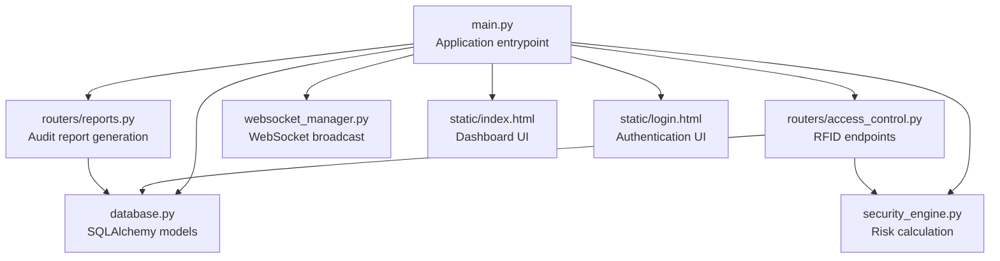
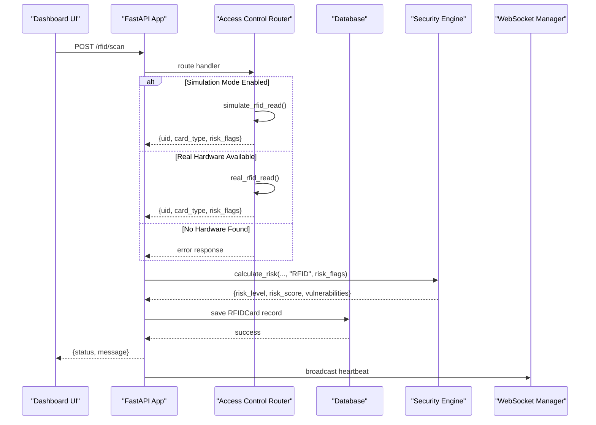
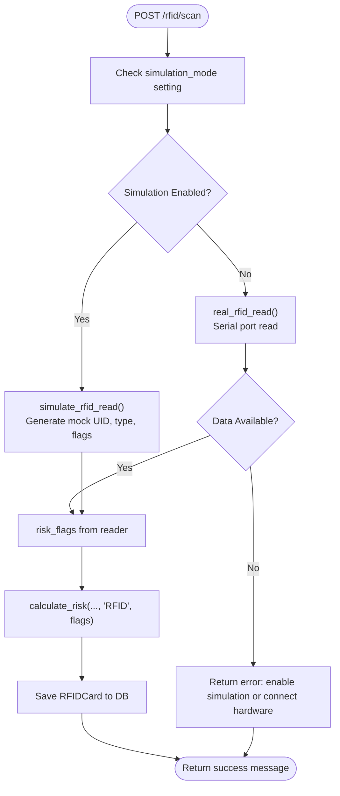
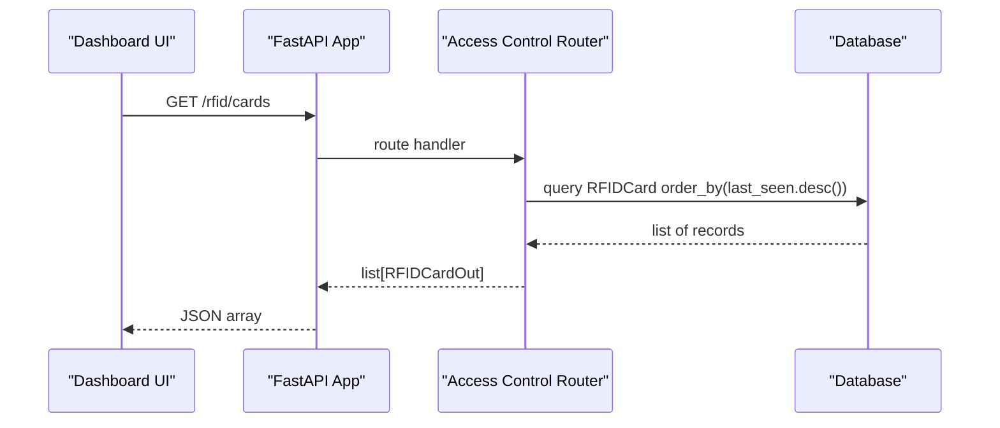
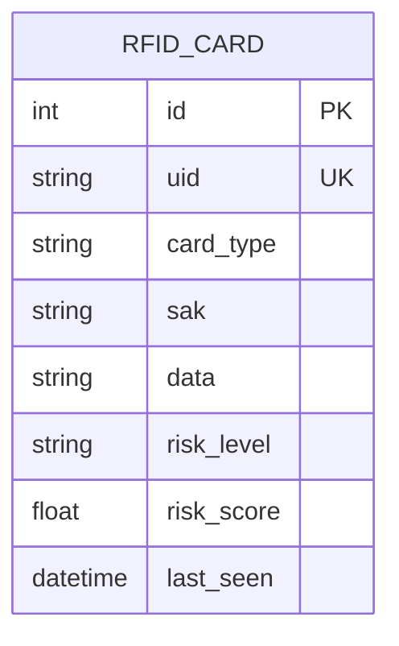
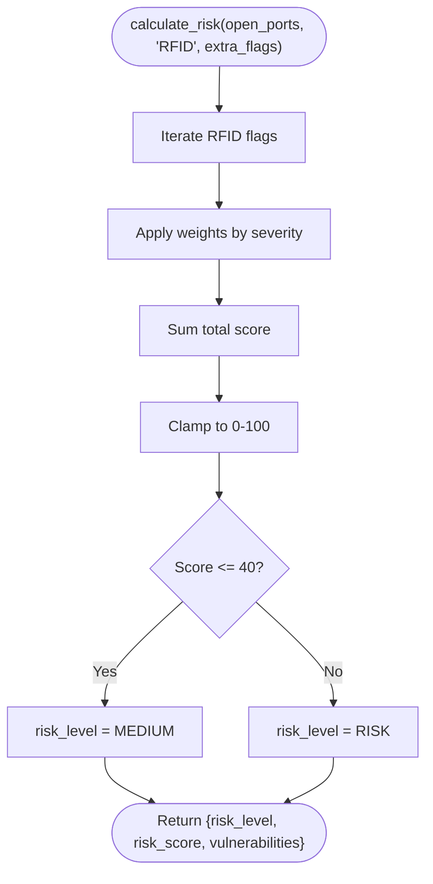
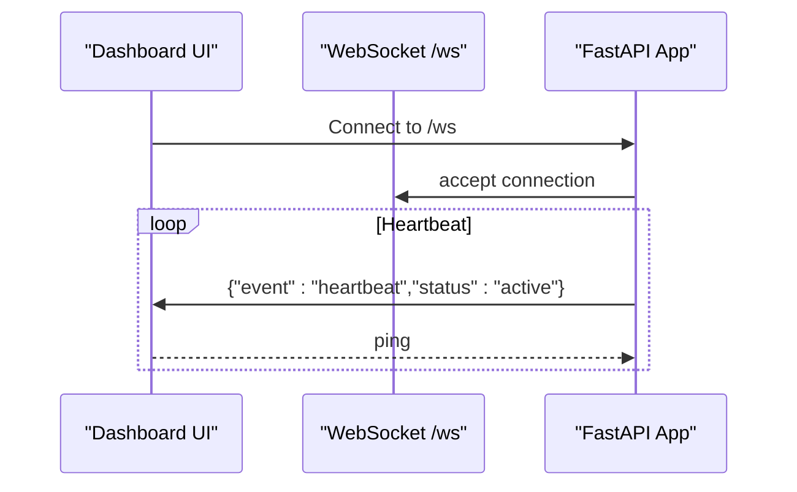
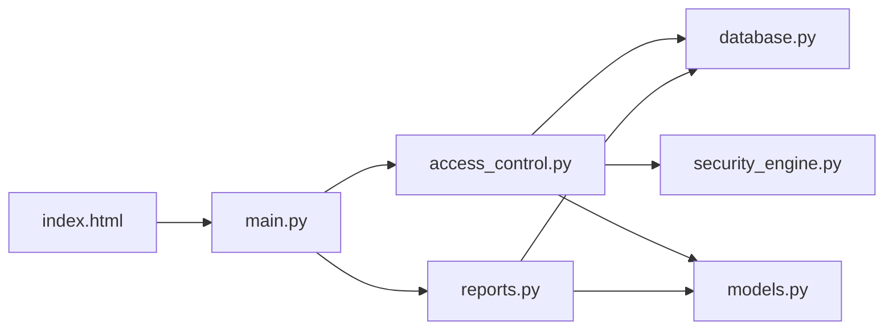

# Access Control API

<cite>
**Referenced Files in This Document**
- [main.py](file://backend/main.py)
- [access_control.py](file://backend/routers/access_control.py)
- [models.py](file://backend/models.py)
- [database.py](file://backend/database.py)
- [security_engine.py](file://backend/security_engine.py)
- [reports.py](file://backend/routers/reports.py)
- [index.html](file://backend/static/index.html)
- [login.html](file://backend/static/login.html)
- [websocket_manager.py](file://backend/websocket_manager.py)
- [README.md](file://backend/README.md)
</cite>

## Table of Contents
1. [Introduction](#introduction)
2. [Project Structure](#project-structure)
3. [Core Components](#core-components)
4. [Architecture Overview](#architecture-overview)
5. [Detailed Component Analysis](#detailed-component-analysis)
6. [Dependency Analysis](#dependency-analysis)
7. [Performance Considerations](#performance-considerations)
8. [Troubleshooting Guide](#troubleshooting-guide)
9. [Conclusion](#conclusion)
10. [Appendices](#appendices)

## Introduction
This document provides comprehensive API documentation for the PentexOne RFID/NFC access control scanning and analysis endpoints. It covers RFID card scanning operations, NFC tag analysis, access control system auditing, and security risk assessment for credential-based systems. The documentation includes endpoint definitions, request/response schemas, integration patterns, and practical workflows for security analysis and reporting.

## Project Structure
The backend is organized around a FastAPI application with modular routers. The access control module resides under the routers package and integrates with the database and security engine to evaluate risk and persist results.

**Diagram sources**
- [main.py:1-106](file://backend/main.py#L1-L106)
- [access_control.py:1-95](file://backend/routers/access_control.py#L1-L95)
- [database.py:1-80](file://backend/database.py#L1-L80)
- [security_engine.py:1-425](file://backend/security_engine.py#L1-L425)
- [reports.py:1-158](file://backend/routers/reports.py#L1-L158)
- [websocket_manager.py:1-48](file://backend/websocket_manager.py#L1-L48)
- [index.html:1-413](file://backend/static/index.html#L1-L413)
- [login.html:1-209](file://backend/static/login.html#L1-L209)

**Section sources**
- [main.py:14-48](file://backend/main.py#L14-L48)
- [README.md:276-297](file://backend/README.md#L276-L297)

## Core Components
- Access Control Router: Implements RFID scanning, card listing, and cleanup endpoints.
- Database Layer: Defines RFIDCard model and settings storage.
- Security Engine: Computes risk scores and flags for RFID/NFC vulnerabilities.
- Reports Router: Generates PDF audit reports including RFID/NFC findings.
- Frontend Integration: Dashboard UI triggers RFID scans and displays results.

**Section sources**
- [access_control.py:13-95](file://backend/routers/access_control.py#L13-L95)
- [database.py:44-55](file://backend/database.py#L44-L55)
- [security_engine.py:156-163](file://backend/security_engine.py#L156-L163)
- [reports.py:138-154](file://backend/routers/reports.py#L138-L154)
- [index.html:318-344](file://backend/static/index.html#L318-L344)

## Architecture Overview
The RFID access control flow integrates hardware or simulated input, risk evaluation, persistence, and reporting.

**Diagram sources**
- [access_control.py:47-84](file://backend/routers/access_control.py#L47-L84)
- [security_engine.py:202-339](file://backend/security_engine.py#L202-L339)
- [database.py:44-55](file://backend/database.py#L44-L55)
- [main.py:90-101](file://backend/main.py#L90-L101)

## Detailed Component Analysis

### RFID Scanning Endpoint
- Path: POST /rfid/scan
- Purpose: Trigger RFID/NFC card scanning and evaluate security risk.
- Behavior:
  - Reads simulation mode setting from the database.
  - If simulation mode is true, generates mock card data with risk flags.
  - Otherwise attempts to read from a real serial RFID reader.
  - Calculates risk using the security engine with protocol "RFID".
  - Persists the card record with computed risk metrics.
  - Returns a success or error message.

**Diagram sources**
- [access_control.py:47-84](file://backend/routers/access_control.py#L47-L84)
- [access_control.py:15-27](file://backend/routers/access_control.py#L15-L27)
- [access_control.py:29-45](file://backend/routers/access_control.py#L29-L45)
- [security_engine.py:268-273](file://backend/security_engine.py#L268-L273)
- [database.py:44-55](file://backend/database.py#L44-L55)

**Section sources**
- [access_control.py:47-84](file://backend/routers/access_control.py#L47-L84)

### Card Listing Endpoint
- Path: GET /rfid/cards
- Purpose: Retrieve all scanned RFID cards ordered by last seen time.
- Response: Array of RFIDCardOut objects.

**Diagram sources**
- [access_control.py:86-88](file://backend/routers/access_control.py#L86-L88)
- [models.py:55-66](file://backend/models.py#L55-L66)
- [database.py:44-55](file://backend/database.py#L44-L55)

**Section sources**
- [access_control.py:86-88](file://backend/routers/access_control.py#L86-L88)
- [models.py:55-66](file://backend/models.py#L55-L66)

### Card Cleanup Endpoint
- Path: DELETE /rfid/cards
- Purpose: Remove all stored RFID card records.
- Response: Standard success message.

**Section sources**
- [access_control.py:90-94](file://backend/routers/access_control.py#L90-L94)

### RFID Data Model and Risk Schema
- RFIDCardOut: Defines the serialized representation of RFID card records for API responses.
- RFIDCard: SQLAlchemy model persisted to the database with fields for UID, card type, SAK, raw data, risk level, risk score, and timestamps.

**Diagram sources**
- [database.py:44-55](file://backend/database.py#L44-L55)
- [models.py:55-66](file://backend/models.py#L55-L66)

**Section sources**
- [database.py:44-55](file://backend/database.py#L44-L55)
- [models.py:55-66](file://backend/models.py#L55-L66)

### Security Risk Assessment for RFID/NFC
- Risk calculation considers RFID-specific vulnerability flags such as default keys, cloneability, legacy crypto, and mutual authentication.
- Risk level is derived from aggregated score thresholds.

**Diagram sources**
- [security_engine.py:268-273](file://backend/security_engine.py#L268-L273)
- [security_engine.py:325-339](file://backend/security_engine.py#L325-L339)

**Section sources**
- [security_engine.py:156-163](file://backend/security_engine.py#L156-L163)
- [security_engine.py:202-339](file://backend/security_engine.py#L202-L339)

### Access Control System Integration
- The dashboard UI triggers RFID scans and displays results, enabling operators to review risk levels and take remediation actions.
- The WebSocket endpoint maintains persistent connections for heartbeat messages.

**Diagram sources**
- [main.py:90-101](file://backend/main.py#L90-L101)
- [websocket_manager.py:7-47](file://backend/websocket_manager.py#L7-L47)

**Section sources**
- [index.html:318-344](file://backend/static/index.html#L318-L344)
- [main.py:90-101](file://backend/main.py#L90-L101)
- [websocket_manager.py:7-47](file://backend/websocket_manager.py#L7-L47)

## Dependency Analysis
- Access Control Router depends on:
  - Database session for CRUD operations.
  - Security Engine for risk computation.
  - Settings model to toggle simulation mode.
- Reports Router depends on RFIDCard model for inclusion in PDF reports.
- Frontend depends on API endpoints for data and actions.

**Diagram sources**
- [access_control.py:9-11](file://backend/routers/access_control.py#L9-L11)
- [database.py:1-80](file://backend/database.py#L1-L80)
- [security_engine.py:1-425](file://backend/security_engine.py#L1-L425)
- [models.py:1-71](file://backend/models.py#L1-L71)
- [reports.py:12-13](file://backend/routers/reports.py#L12-L13)
- [index.html:1-413](file://backend/static/index.html#L1-L413)
- [main.py:14-48](file://backend/main.py#L14-L48)

**Section sources**
- [access_control.py:9-11](file://backend/routers/access_control.py#L9-L11)
- [reports.py:138-154](file://backend/routers/reports.py#L138-L154)

## Performance Considerations
- Simulation mode reduces hardware dependencies and latency for development/testing.
- Risk calculation is lightweight and suitable for real-time feedback.
- Database writes are minimal per scan; batching operations can reduce overhead if scaling.

## Troubleshooting Guide
- RFID scan returns error indicating no hardware found:
  - Enable simulation mode in settings or connect a compatible RFID reader.
- Serial communication failures:
  - Verify permissions and port availability; ensure the reader is compatible and powered.
- Risk assessment appears inconsistent:
  - Confirm the presence of RFID-specific flags and adjust simulation/test data accordingly.

**Section sources**
- [access_control.py:57-64](file://backend/routers/access_control.py#L57-L64)
- [access_control.py:29-45](file://backend/routers/access_control.py#L29-L45)
- [README.md:349-381](file://backend/README.md#L349-L381)

## Conclusion
The Access Control API provides a focused set of endpoints for RFID/NFC scanning, risk evaluation, and auditing. It integrates seamlessly with the broader PentexOne platform, enabling operators to assess credential-based access systems, track card inventories, and generate comprehensive security reports.

## Appendices

### API Definitions

- POST /rfid/scan
  - Description: Initiates RFID/NFC card scanning.
  - Request: None (uses settings to determine simulation vs. real hardware).
  - Response: JSON object with status and message; on success includes card identifier.
  - Example response:
    - {"status":"success","message":"Card scanned: AA:BB:CC:DD:EE:FF"}

- GET /rfid/cards
  - Description: Lists all scanned RFID cards.
  - Response: Array of RFIDCardOut objects.
  - Example response:
    - [{"id":1,"uid":"AA:BB:CC:DD:EE:FF","card_type":"Mifare Classic 1K","sak":"","data":"","risk_level":"RISK","risk_score":85.0,"last_seen":"2025-01-01T12:00:00Z"}]

- DELETE /rfid/cards
  - Description: Clears all stored RFID card records.
  - Response: JSON object with status and message.

- GET /settings
  - Description: Retrieves system settings (including simulation_mode).
  - Response: JSON object mapping setting keys to values.

- PUT /settings
  - Description: Updates system settings.
  - Request: SettingUpdate with optional fields simulation_mode and nmap_timeout.
  - Response: {"status":"success"}

- GET /reports/generate/pdf
  - Description: Generates a PDF security audit report including RFID/NFC findings.
  - Response: File download (application/pdf).

- WebSocket /ws
  - Description: Maintains persistent connection for heartbeat messages.
  - Messages: {"event":"heartbeat","status":"active"}

**Section sources**
- [access_control.py:47-94](file://backend/routers/access_control.py#L47-L94)
- [models.py:55-66](file://backend/models.py#L55-L66)
- [main.py:50-64](file://backend/main.py#L50-L64)
- [reports.py:37-157](file://backend/routers/reports.py#L37-L157)
- [main.py:90-101](file://backend/main.py#L90-L101)

### Request/Response Schemas

- RFIDCardOut
  - Fields: id, uid, card_type, sak, data, risk_level, risk_score, last_seen
  - Used by GET /rfid/cards

- SettingUpdate
  - Fields: simulation_mode (optional), nmap_timeout (optional)
  - Used by PUT /settings

**Section sources**
- [models.py:55-66](file://backend/models.py#L55-L66)
- [models.py:68-71](file://backend/models.py#L68-L71)

### Access Control Analysis Workflows

- RFID Card Emulation Detection
  - Use risk flags such as RFID_EASILY_CLONABLE to identify cards relying solely on UID without encryption.
  - Combine with card type classification to prioritize remediation.

- Access Pattern Analysis
  - Track last_seen timestamps to identify frequent access patterns.
  - Integrate with broader device analytics for correlation.

- Security Recommendation Generation
  - Leverage security engine’s vulnerability mapping to suggest remediation steps.
  - Use AI engine recommendations for protocol-specific improvements.

- Integration with Physical Security Systems
  - Export RFID/NFC findings via PDF reports for compliance and audits.
  - Use dashboard UI to monitor and act on high-risk cards.

**Section sources**
- [security_engine.py:156-163](file://backend/security_engine.py#L156-L163)
- [reports.py:138-154](file://backend/routers/reports.py#L138-L154)
- [index.html:318-344](file://backend/static/index.html#L318-L344)