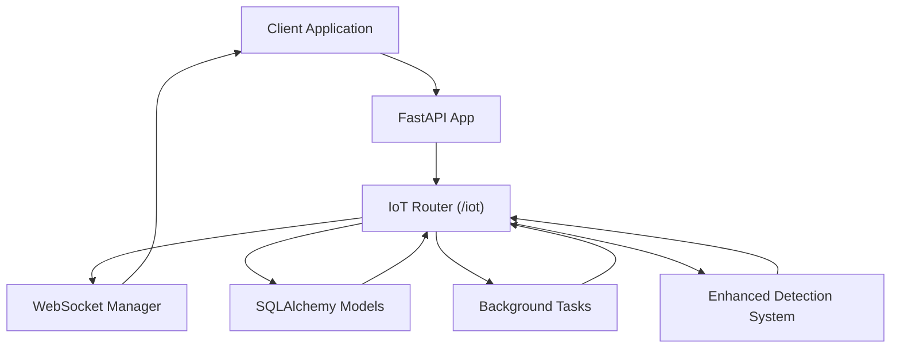
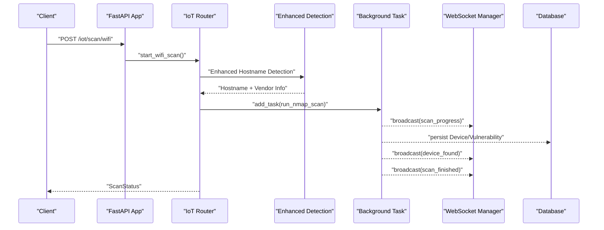
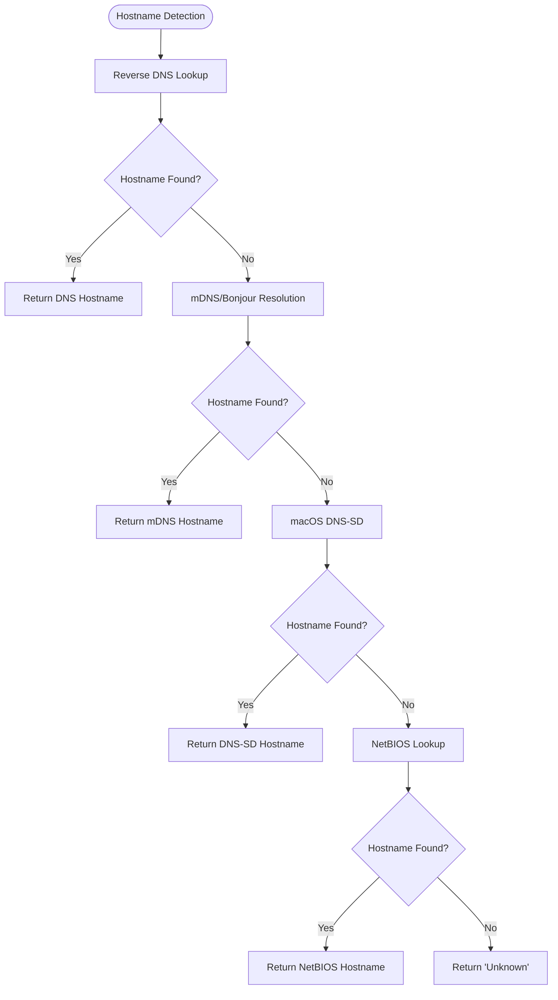
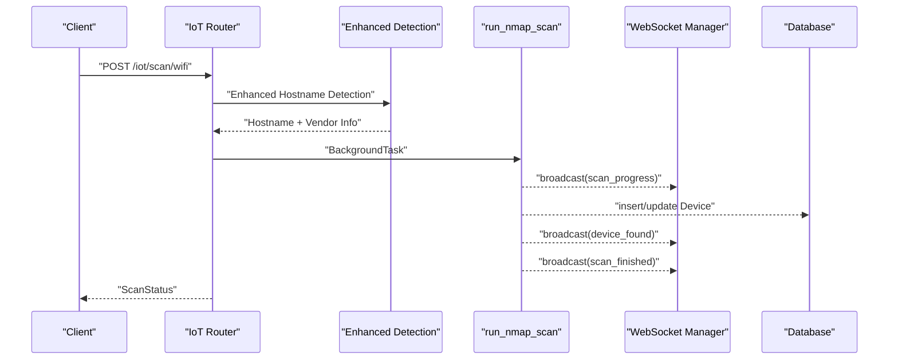
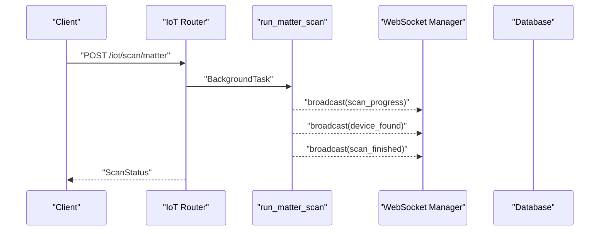
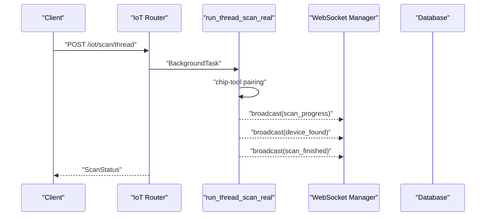
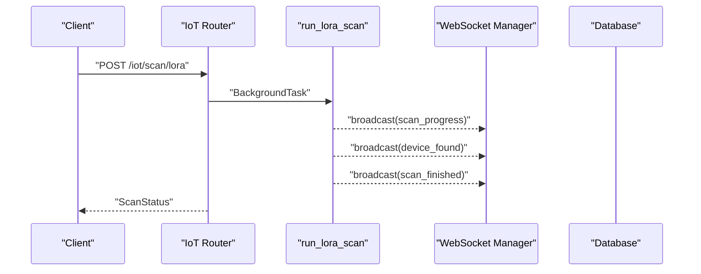
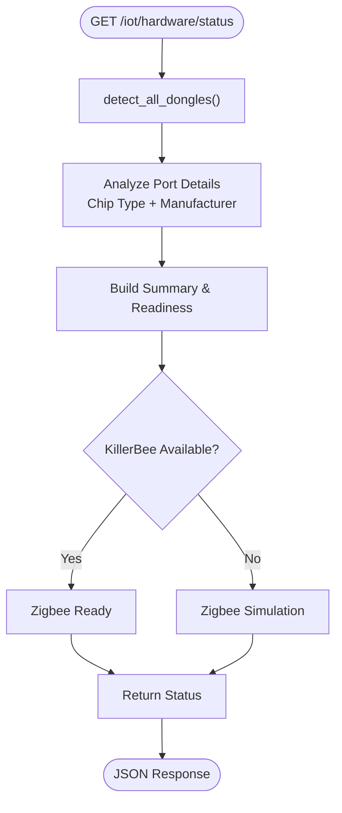
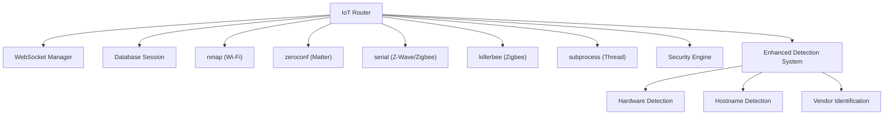

# IoT Scanning API

<cite>
**Referenced Files in This Document**
- [main.py](file://backend/main.py)
- [iot.py](file://backend/routers/iot.py)
- [websocket_manager.py](file://backend/websocket_manager.py)
- [models.py](file://backend/models.py)
- [database.py](file://backend/database.py)
- [security_engine.py](file://backend/security_engine.py)
- [wifi_bt.py](file://backend/routers/wifi_bt.py)
</cite>

## Update Summary
**Changes Made**
- Enhanced hostname detection methods with multiple fallback mechanisms
- Comprehensive vendor identification from MAC addresses using OUI database
- Advanced hardware detection capabilities with detailed dongle information
- Improved device identification accuracy through enhanced MAC vendor detection
- Expanded hardware detection beyond basic port scanning to detailed device information

## Table of Contents
1. [Introduction](#introduction)
2. [Project Structure](#project-structure)
3. [Core Components](#core-components)
4. [Architecture Overview](#architecture-overview)
5. [Enhanced Device Detection System](#enhanced-device-detection-system)
6. [Detailed Component Analysis](#detailed-component-analysis)
7. [Dependency Analysis](#dependency-analysis)
8. [Performance Considerations](#performance-considerations)
9. [Troubleshooting Guide](#troubleshooting-guide)
10. [Conclusion](#conclusion)

## Introduction
This document provides comprehensive API documentation for PentexOne's IoT Scanning endpoints. It covers network discovery and scanning operations for Wi-Fi, Matter, Zigbee, Thread/Matter, Z-Wave, and LoRaWAN, along with advanced hardware detection capabilities. The documentation includes request/response schemas, background task execution, real-time progress updates via WebSocket, scan status management, parameter specifications, error handling, and integration patterns for each scanning protocol.

**Updated** Enhanced with significant improvements to IoT device detection and identification including advanced hostname detection methods, comprehensive vendor identification from MAC addresses, and detailed hardware detection capabilities.

## Project Structure
The IoT scanning functionality is implemented as a FastAPI router module under the `/iot` prefix. Supporting components include:
- WebSocket manager for real-time updates
- Pydantic models for request/response schemas
- SQLAlchemy models for persistent storage
- Application entrypoint wiring the router and WebSocket endpoints
- Enhanced security engine with improved risk assessment

**Diagram sources**
- [main.py:68](file://backend/main.py#L68)
- [iot.py:27](file://backend/routers/iot.py#L27)
- [websocket_manager.py:7](file://backend/websocket_manager.py#L7)
- [database.py:12](file://backend/database.py#L12)

**Section sources**
- [main.py:68](file://backend/main.py#L68)
- [iot.py:27](file://backend/routers/iot.py#L27)

## Core Components
- IoT Router: Defines all scanning endpoints under `/iot`, including Wi-Fi Nmap scans, Matter discovery, Zigbee/Z-Wave/Thread/Lora scans, device listing, and scan status retrieval.
- WebSocket Manager: Provides thread-safe broadcasting of scan progress, device discoveries, and completion events to connected clients.
- Pydantic Models: Define request/response schemas for scan requests, status, and device/vulnerability outputs.
- Database Models: Persist discovered devices and associated vulnerabilities with risk scoring.
- Enhanced Detection System: Advanced hostname detection and vendor identification capabilities.

Key schemas:
- ScanRequest: Network scanning parameters
- ScanStatus: Standardized scan lifecycle response
- DeviceOut: Complete device record with vulnerabilities
- VulnerabilityOut: Individual vulnerability entries

**Section sources**
- [models.py:36](file://backend/models.py#L36)
- [models.py:41](file://backend/models.py#L41)
- [models.py:18](file://backend/models.py#L18)
- [models.py:6](file://backend/models.py#L6)
- [database.py:12](file://backend/database.py#L12)
- [database.py:30](file://backend/database.py#L30)

## Architecture Overview
The scanning architecture leverages FastAPI background tasks to execute long-running operations while maintaining responsiveness. Real-time updates are delivered via WebSocket connections. Results are persisted to a local SQLite database with enhanced device identification capabilities.

**Diagram sources**
- [iot.py:291](file://backend/routers/iot.py#L291)
- [iot.py:300](file://backend/routers/iot.py#L300)
- [websocket_manager.py:21](file://backend/websocket_manager.py#L21)
- [database.py:12](file://backend/database.py#L12)

## Enhanced Device Detection System

### Advanced Hostname Detection
The system now employs a multi-layered approach to hostname detection:

1. **Reverse DNS Lookup**: Primary method using standard socket operations
2. **mDNS/Bonjour Resolution**: Uses avahi-resolve for .local hostnames
3. **macOS DNS-SD**: Specialized Apple DNS-SD for macOS systems
4. **NetBIOS Lookup**: Uses nmblookup for Windows device identification

**Diagram sources**
- [iot.py:33](file://backend/routers/iot.py#L33)
- [iot.py:56](file://backend/routers/iot.py#L56)
- [iot.py:76](file://backend/routers/iot.py#L76)
- [iot.py:95](file://backend/routers/iot.py#L95)

### Comprehensive MAC Vendor Identification
Enhanced vendor identification system using OUI (Organizationally Unique Identifier) database:

- **OUI Database**: Comprehensive database covering major vendors and IoT devices
- **Multi-format Support**: Handles various MAC address formats (xx:xx:xx, xx-xx-xx, xxxxxxxxxxxx)
- **Fallback Mechanisms**: Graceful degradation when OUI not found
- **Extended IoT Coverage**: Specific vendors for smart home and IoT devices

**Section sources**
- [iot.py:117](file://backend/routers/iot.py#L117)
- [iot.py:129](file://backend/routers/iot.py#L129)
- [iot.py:163](file://backend/routers/iot.py#L163)

### Advanced Hardware Detection
Comprehensive hardware detection system providing detailed dongle information:

- **Multi-Protocol Support**: Zigbee, Thread/Matter, Z-Wave, Bluetooth detection
- **Detailed Information**: Chip type, manufacturer, port information
- **Status Tracking**: Connection status and readiness indicators
- **Serial Port Analysis**: Comprehensive port enumeration and identification

**Section sources**
- [iot.py:201](file://backend/routers/iot.py#L201)
- [iot.py:332](file://backend/routers/iot.py#L332)
- [iot.py:340](file://backend/routers/iot.py#L340)

## Detailed Component Analysis

### Wi-Fi Nmap Scan Endpoint
- Path: `POST /iot/scan/wifi`
- Request Schema: ScanRequest
  - network: CIDR notation string (default: "192.168.1.0/24")
  - timeout: integer seconds (default: 60)
- Response Schema: ScanStatus
  - status: "started" | "busy"
  - message: human-readable status
  - devices_found: count of discovered devices
- Behavior:
  - Starts a background Nmap scan of the specified network
  - Emits periodic progress updates and device_found events
  - Persists discovered devices and associated vulnerabilities
  - Broadcasts scan_finished upon completion
  - Utilizes enhanced hostname detection and vendor identification
- Real-time Events:
  - scan_progress: progress percentage and message
  - device_found: device details with enhanced hostname and vendor info
  - scan_finished: completion summary
- Error Handling:
  - On exceptions, emits scan_error and sets scan_state.running=false

**Diagram sources**
- [iot.py:474](file://backend/routers/iot.py#L474)
- [iot.py:578](file://backend/routers/iot.py#L578)
- [websocket_manager.py:21](file://backend/websocket_manager.py#L21)
- [database.py:12](file://backend/database.py#L12)

**Section sources**
- [iot.py:465](file://backend/routers/iot.py#L465)
- [iot.py:474](file://backend/routers/iot.py#L474)
- [models.py:36](file://backend/models.py#L36)
- [models.py:41](file://backend/models.py#L41)

### Matter Device Discovery via mDNS
- Path: `POST /iot/scan/matter`
- Request: No body required
- Response: ScanStatus
- Behavior:
  - Starts background mDNS discovery for "_matter._tcp.local." services
  - Discovers devices and persists them with risk assessment
  - Emits device_found and scan_finished events
- Real-time Events:
  - scan_progress: initial progress
  - device_found: discovered Matter device details
  - scan_finished: completion summary

**Diagram sources**
- [iot.py:714](file://backend/routers/iot.py#L714)
- [iot.py:720](file://backend/routers/iot.py#L720)
- [websocket_manager.py:21](file://backend/websocket_manager.py#L21)
- [database.py:12](file://backend/database.py#L12)

**Section sources**
- [iot.py:714](file://backend/routers/iot.py#L714)
- [iot.py:720](file://backend/routers/iot.py#L720)

### Zigbee Protocol Scanning
- Path: `POST /iot/scan/zigbee`
- Request: No body required
- Response: ScanStatus
- Behavior:
  - Detects hardware availability and KillerBee library presence
  - Real mode: Uses KillerBee with CC2652/CC2531 dongle to sniff Zigbee traffic
  - Simulated mode: Generates mock Zigbee devices when hardware unavailable
  - Emits device_found and scan_finished events
- Hardware Detection:
  - detect_zigbee_dongle(): identifies CC2652/CC2531/Zigbee-compatible ports
  - check_killerbee_available(): verifies library installation

**Diagram sources**
- [iot.py:783](file://backend/routers/iot.py#L783)
- [iot.py:796](file://backend/routers/iot.py#L796)
- [iot.py:854](file://backend/routers/iot.py#L854)

**Section sources**
- [iot.py:783](file://backend/routers/iot.py#L783)
- [iot.py:796](file://backend/routers/iot.py#L796)
- [iot.py:854](file://backend/routers/iot.py#L854)

### Thread/Matter Network Analysis
- Path: `POST /iot/scan/thread`
- Request: No body required
- Response: ScanStatus
- Behavior:
  - Detects hardware availability for nRF52840-based dongles
  - Real mode: Attempts Matter pairing via chip-tool to discover Thread devices
  - Simulated mode: Generates mock Thread devices when hardware unavailable
  - Emits device_found and scan_finished events
- Hardware Detection:
  - detect_thread_dongle(): identifies Nordic/nRF-based Thread/Matter dongles

**Diagram sources**
- [iot.py:931](file://backend/routers/iot.py#L931)
- [iot.py:943](file://backend/routers/iot.py#L943)
- [websocket_manager.py:21](file://backend/websocket_manager.py#L21)
- [database.py:12](file://backend/database.py#L12)

**Section sources**
- [iot.py:931](file://backend/routers/iot.py#L931)
- [iot.py:943](file://backend/routers/iot.py#L943)

### Z-Wave Device Enumeration
- Path: `POST /iot/scan/zwave`
- Request: No body required
- Response: ScanStatus
- Behavior:
  - Detects Z-Wave stick via serial ports
  - Sends Z-Wave commands to probe network (when available)
  - Generates mock Z-Wave devices when hardware unavailable
  - Emits device_found and scan_finished events

**Diagram sources**
- [iot.py:1042](file://backend/routers/iot.py#L1042)
- [iot.py:1048](file://backend/routers/iot.py#L1048)

**Section sources**
- [iot.py:1042](file://backend/routers/iot.py#L1042)
- [iot.py:1048](file://backend/routers/iot.py#L1048)

### LoRaWAN Frequency Scanning
- Path: `POST /iot/scan/lora`
- Request: No body required
- Response: ScanStatus
- Behavior:
  - Simulated LoRaWAN device discovery
  - Generates mock LoRaWAN devices with MAC addresses
  - Emits device_found events and scan_finished

**Diagram sources**
- [iot.py:1102](file://backend/routers/iot.py#L1102)
- [iot.py:1108](file://backend/routers/iot.py#L1108)
- [websocket_manager.py:21](file://backend/websocket_manager.py#L21)
- [database.py:12](file://backend/database.py#L12)

**Section sources**
- [iot.py:1102](file://backend/routers/iot.py#L1102)
- [iot.py:1108](file://backend/routers/iot.py#L1108)

### Enhanced Hardware Detection Endpoints
- Path: `GET /iot/hardware/status`
- Purpose: Returns detailed status of connected hardware dongles (Zigbee, Thread/Matter, Z-Wave, Bluetooth) and readiness indicators
- Response Fields:
  - status: "success"
  - dongles: detailed dictionary of detected dongles with chip information
  - summary: per-protocol connectivity and readiness
  - killerbee_available: boolean indicating KillerBee library presence
  - total_connected: count of detected dongles

**Updated** Enhanced hardware detection now provides comprehensive information including chip types, manufacturers, and detailed port information for all detected dongles.

**Diagram sources**
- [iot.py:1163](file://backend/routers/iot.py#L1163)
- [iot.py:201](file://backend/routers/iot.py#L201)
- [iot.py:332](file://backend/routers/iot.py#L332)

**Section sources**
- [iot.py:1163](file://backend/routers/iot.py#L1163)
- [iot.py:201](file://backend/routers/iot.py#L201)

### Additional Device Management Endpoints
- List all devices: `GET /iot/devices` → List[DeviceOut]
- Retrieve specific device: `GET /iot/devices/{device_id}` → DeviceOut
- Clear all devices: `DELETE /iot/devices` → {"message": "..."}
- Current scan status: `GET /iot/scan/status` → ScanStatus

**Section sources**
- [iot.py:905](file://backend/routers/iot.py#L905)
- [iot.py:911](file://backend/routers/iot.py#L911)
- [iot.py:920](file://backend/routers/iot.py#L920)
- [iot.py:897](file://backend/routers/iot.py#L897)

## Dependency Analysis
The IoT router depends on:
- WebSocket manager for real-time updates
- Database session for persistence
- External libraries for protocol-specific scanning (nmap, zeroconf, serial, killerbee, subprocess)
- Security engine for risk calculation
- Enhanced detection system for hostname and vendor identification

**Diagram sources**
- [iot.py:8](file://backend/routers/iot.py#L8)
- [websocket_manager.py:7](file://backend/websocket_manager.py#L7)
- [database.py:62](file://backend/database.py#L62)

**Section sources**
- [iot.py:8](file://backend/routers/iot.py#L8)
- [websocket_manager.py:7](file://backend/websocket_manager.py#L7)
- [database.py:62](file://backend/database.py#L62)

## Performance Considerations
- Background Task Execution: All scanning operations run asynchronously to prevent blocking the main API thread.
- WebSocket Broadcasting: Thread-safe broadcasting ensures real-time updates without blocking the scanning loop.
- Database Persistence: Batched commits minimize overhead during device insertion.
- Enhanced Detection Optimization: Multi-layered hostname detection with progressive fallback reduces unnecessary system calls.
- Hardware Detection: Efficient serial port enumeration and pattern matching reduce startup latency.
- Timeout Controls: Nmap scan timeouts and subprocess limits prevent indefinite waits.
- ARP Cache Integration: Uses system ARP cache for faster MAC-to-hostname correlation.

## Troubleshooting Guide
Common issues and resolutions:
- Busy Scan State: If a previous scan is still running, the API returns status "busy". Wait for completion or cancel the current scan before starting a new one.
- Hardware Not Detected:
  - Verify dongle connectivity and drivers
  - Confirm KillerBee installation for Zigbee real scans
  - Use hardware/status endpoint to confirm detection
  - Check that detect_all_dongles() shows proper chip information
- Enhanced Detection Issues:
  - Hostname detection failures: Verify system tools (avahi-resolve, nmblookup, dns-sd) are available
  - Vendor identification problems: Check MAC address format and OUI database coverage
- WebSocket Updates Missing:
  - Ensure client connects to /ws endpoint
  - Check for heartbeat messages indicating connection health
- Database Errors:
  - Confirm database initialization and permissions
  - Validate unique constraints for device IP addresses

**Section sources**
- [iot.py:474](file://backend/routers/iot.py#L474)
- [websocket_manager.py:21](file://backend/websocket_manager.py#L21)
- [database.py:69](file://backend/database.py#L69)

## Conclusion
The PentexOne IoT Scanning API provides a comprehensive, extensible framework for discovering and assessing IoT devices across multiple protocols. Its asynchronous design, real-time WebSocket updates, and robust hardware detection enable efficient and reliable security assessments. The enhanced device detection system significantly improves accuracy through advanced hostname detection methods and comprehensive vendor identification from MAC addresses. The modular architecture supports both hardware-accelerated and simulated scanning modes, ensuring functionality across diverse deployment environments while maintaining high-quality device identification and classification.

**Updated** The recent enhancements to hostname detection, vendor identification, and hardware detection capabilities make this system particularly valuable for comprehensive IoT security assessments, providing detailed insights into device characteristics and potential vulnerabilities.