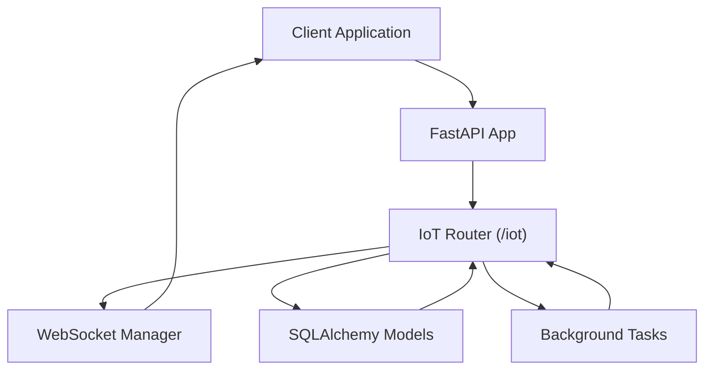
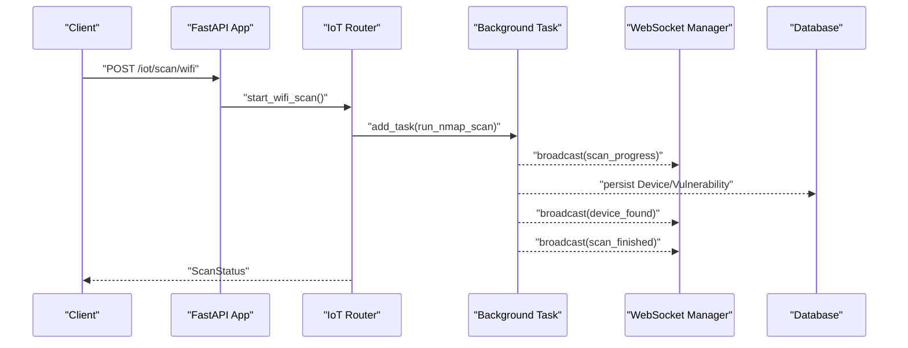
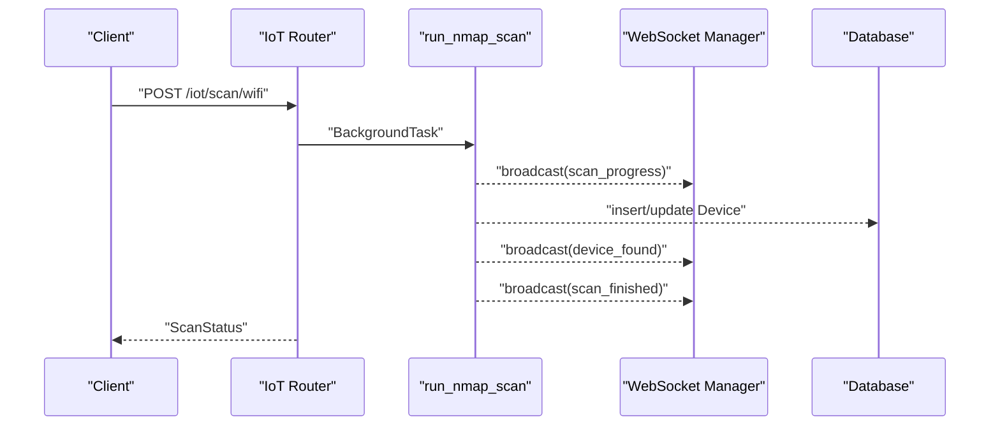
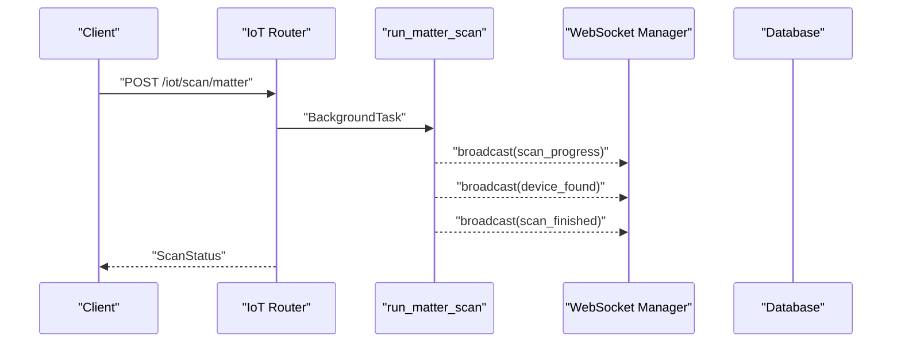
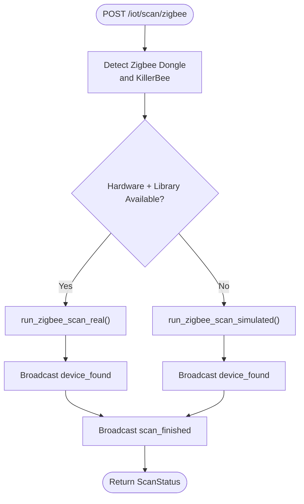
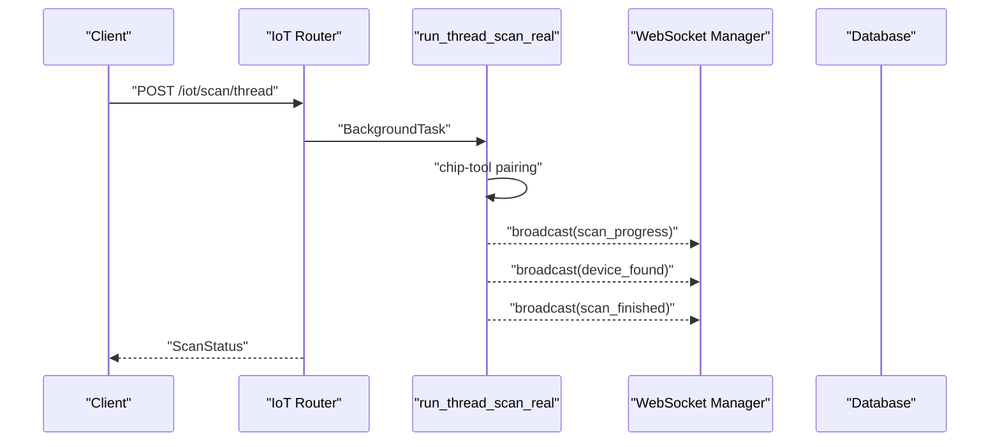
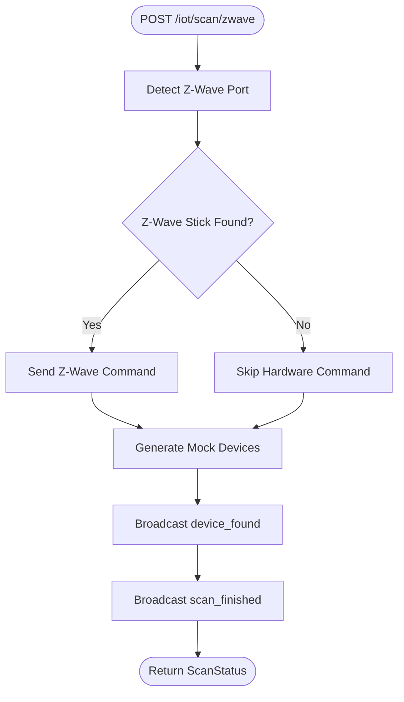
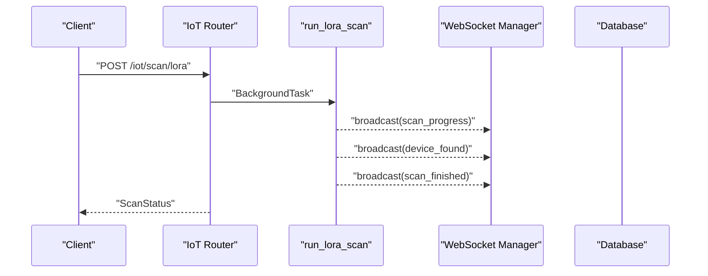
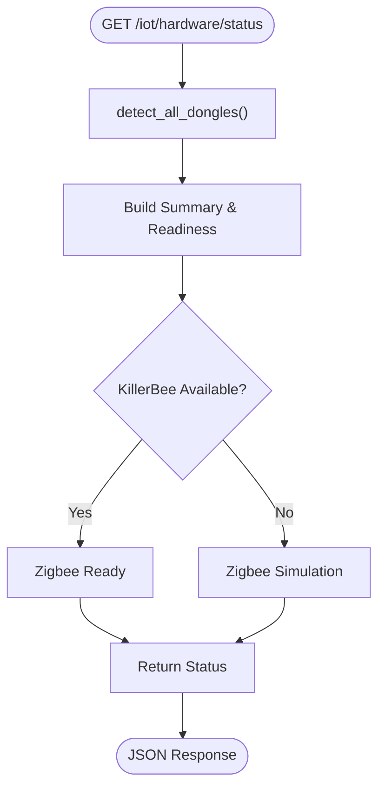
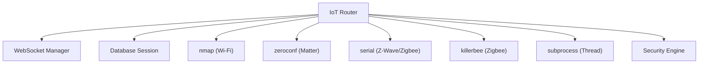

# IoT Scanning API

<cite>
**Referenced Files in This Document**
- [main.py](file://backend/main.py)
- [iot.py](file://backend/routers/iot.py)
- [websocket_manager.py](file://backend/websocket_manager.py)
- [models.py](file://backend/models.py)
- [database.py](file://backend/database.py)
</cite>

## Table of Contents
1. [Introduction](#introduction)
2. [Project Structure](#project-structure)
3. [Core Components](#core-components)
4. [Architecture Overview](#architecture-overview)
5. [Detailed Component Analysis](#detailed-component-analysis)
6. [Dependency Analysis](#dependency-analysis)
7. [Performance Considerations](#performance-considerations)
8. [Troubleshooting Guide](#troubleshooting-guide)
9. [Conclusion](#conclusion)

## Introduction
This document provides comprehensive API documentation for PentexOne's IoT Scanning endpoints. It covers network discovery and scanning operations for Wi-Fi, Matter, Zigbee, Thread/Matter, Z-Wave, and LoRaWAN, along with hardware detection capabilities. The documentation includes request/response schemas, background task execution, real-time progress updates via WebSocket, scan status management, parameter specifications, error handling, and integration patterns for each scanning protocol.

## Project Structure
The IoT scanning functionality is implemented as a FastAPI router module under the `/iot` prefix. Supporting components include:
- WebSocket manager for real-time updates
- Pydantic models for request/response schemas
- SQLAlchemy models for persistent storage
- Application entrypoint wiring the router and WebSocket endpoints

**Diagram sources**
- [main.py:44](file://backend/main.py#L44)
- [iot.py:24](file://backend/routers/iot.py#L24)
- [websocket_manager.py:7](file://backend/websocket_manager.py#L7)
- [database.py:12](file://backend/database.py#L12)

**Section sources**
- [main.py:44](file://backend/main.py#L44)
- [iot.py:24](file://backend/routers/iot.py#L24)

## Core Components
- IoT Router: Defines all scanning endpoints under `/iot`, including Wi-Fi Nmap scans, Matter discovery, Zigbee/Z-Wave/Thread/Lora scans, device listing, and scan status retrieval.
- WebSocket Manager: Provides thread-safe broadcasting of scan progress, device discoveries, and completion events to connected clients.
- Pydantic Models: Define request/response schemas for scan requests, status, and device/vulnerability outputs.
- Database Models: Persist discovered devices and associated vulnerabilities with risk scoring.

Key schemas:
- ScanRequest: Network scanning parameters
- ScanStatus: Standardized scan lifecycle response
- DeviceOut: Complete device record with vulnerabilities
- VulnerabilityOut: Individual vulnerability entries

**Section sources**
- [models.py:36](file://backend/models.py#L36)
- [models.py:41](file://backend/models.py#L41)
- [models.py:18](file://backend/models.py#L18)
- [models.py:6](file://backend/models.py#L6)
- [database.py:12](file://backend/database.py#L12)
- [database.py:30](file://backend/database.py#L30)

## Architecture Overview
The scanning architecture leverages FastAPI background tasks to execute long-running operations while maintaining responsiveness. Real-time updates are delivered via WebSocket connections. Results are persisted to a local SQLite database.

**Diagram sources**
- [iot.py:291](file://backend/routers/iot.py#L291)
- [iot.py:300](file://backend/routers/iot.py#L300)
- [websocket_manager.py:21](file://backend/websocket_manager.py#L21)
- [database.py:12](file://backend/database.py#L12)

## Detailed Component Analysis

### Wi-Fi Nmap Scan Endpoint
- Path: `POST /iot/scan/wifi`
- Request Schema: ScanRequest
  - network: CIDR notation string (default: "192.168.1.0/24")
  - timeout: integer seconds (default: 60)
- Response Schema: ScanStatus
  - status: "started" | "busy"
  - message: human-readable status
  - devices_found: count of discovered devices
- Behavior:
  - Starts a background Nmap scan of the specified network
  - Emits periodic progress updates and device_found events
  - Persists discovered devices and associated vulnerabilities
  - Broadcasts scan_finished upon completion
- Real-time Events:
  - scan_progress: progress percentage and message
  - device_found: device details
  - scan_finished: completion summary
- Error Handling:
  - On exceptions, emits scan_error and sets scan_state.running=false

**Diagram sources**
- [iot.py:291](file://backend/routers/iot.py#L291)
- [iot.py:300](file://backend/routers/iot.py#L300)
- [websocket_manager.py:21](file://backend/websocket_manager.py#L21)
- [database.py:12](file://backend/database.py#L12)

**Section sources**
- [iot.py:291](file://backend/routers/iot.py#L291)
- [iot.py:300](file://backend/routers/iot.py#L300)
- [models.py:36](file://backend/models.py#L36)
- [models.py:41](file://backend/models.py#L41)

### Matter Device Discovery via mDNS
- Path: `POST /iot/scan/matter`
- Request: No body required
- Response: ScanStatus
- Behavior:
  - Starts background mDNS discovery for "_matter._tcp.local." services
  - Discovers devices and persists them with risk assessment
  - Emits device_found and scan_finished events
- Real-time Events:
  - scan_progress: initial progress
  - device_found: discovered Matter device details
  - scan_finished: completion summary

**Diagram sources**
- [iot.py:418](file://backend/routers/iot.py#L418)
- [iot.py:424](file://backend/routers/iot.py#L424)
- [websocket_manager.py:21](file://backend/websocket_manager.py#L21)
- [database.py:12](file://backend/database.py#L12)

**Section sources**
- [iot.py:418](file://backend/routers/iot.py#L418)
- [iot.py:424](file://backend/routers/iot.py#L424)

### Zigbee Protocol Scanning
- Path: `POST /iot/scan/zigbee`
- Request: No body required
- Response: ScanStatus
- Behavior:
  - Detects hardware availability and KillerBee library presence
  - Real mode: Uses KillerBee with CC2652/CC2531 dongle to sniff Zigbee traffic
  - Simulated mode: Generates mock Zigbee devices when hardware unavailable
  - Emits device_found and scan_finished events
- Hardware Detection:
  - detect_zigbee_dongle(): identifies CC2652/CC2531/Zigbee-compatible ports
  - check_killerbee_available(): verifies library installation

**Diagram sources**
- [iot.py:483](file://backend/routers/iot.py#L483)
- [iot.py:496](file://backend/routers/iot.py#L496)
- [iot.py:552](file://backend/routers/iot.py#L552)

**Section sources**
- [iot.py:483](file://backend/routers/iot.py#L483)
- [iot.py:496](file://backend/routers/iot.py#L496)
- [iot.py:552](file://backend/routers/iot.py#L552)

### Thread/Matter Network Analysis
- Path: `POST /iot/scan/thread`
- Request: No body required
- Response: ScanStatus
- Behavior:
  - Detects hardware availability for nRF52840-based dongles
  - Real mode: Attempts Matter pairing via chip-tool to discover Thread devices
  - Simulated mode: Generates mock Thread devices when hardware unavailable
  - Emits device_found and scan_finished events
- Hardware Detection:
  - detect_thread_dongle(): identifies Nordic/nRF-based Thread/Matter dongles

**Diagram sources**
- [iot.py:625](file://backend/routers/iot.py#L625)
- [iot.py:637](file://backend/routers/iot.py#L637)
- [websocket_manager.py:21](file://backend/websocket_manager.py#L21)
- [database.py:12](file://backend/database.py#L12)

**Section sources**
- [iot.py:625](file://backend/routers/iot.py#L625)
- [iot.py:637](file://backend/routers/iot.py#L637)

### Z-Wave Device Enumeration
- Path: `POST /iot/scan/zwave`
- Request: No body required
- Response: ScanStatus
- Behavior:
  - Detects Z-Wave stick via serial ports
  - Sends Z-Wave commands to probe network (when available)
  - Generates mock Z-Wave devices when hardware unavailable
  - Emits device_found and scan_finished events

**Diagram sources**
- [iot.py:727](file://backend/routers/iot.py#L727)
- [iot.py:733](file://backend/routers/iot.py#L733)

**Section sources**
- [iot.py:727](file://backend/routers/iot.py#L727)
- [iot.py:733](file://backend/routers/iot.py#L733)

### LoRaWAN Frequency Scanning
- Path: `POST /iot/scan/lora`
- Request: No body required
- Response: ScanStatus
- Behavior:
  - Simulated LoRaWAN device discovery
  - Generates mock LoRaWAN devices with MAC addresses
  - Emits device_found events and scan_finished

**Diagram sources**
- [iot.py:783](file://backend/routers/iot.py#L783)
- [iot.py:789](file://backend/routers/iot.py#L789)
- [websocket_manager.py:21](file://backend/websocket_manager.py#L21)
- [database.py:12](file://backend/database.py#L12)

**Section sources**
- [iot.py:783](file://backend/routers/iot.py#L783)
- [iot.py:789](file://backend/routers/iot.py#L789)

### Hardware Detection Endpoints
- Path: `GET /iot/hardware/status`
- Purpose: Returns detailed status of connected hardware dongles (Zigbee, Thread/Matter, Z-Wave, Bluetooth) and readiness indicators
- Response Fields:
  - status: "success"
  - dongles: detailed dictionary of detected dongles
  - summary: per-protocol connectivity and readiness
  - killerbee_available: boolean indicating KillerBee library presence
  - total_connected: count of detected dongles

**Diagram sources**
- [iot.py:841](file://backend/routers/iot.py#L841)
- [iot.py:27](file://backend/routers/iot.py#L27)
- [iot.py:174](file://backend/routers/iot.py#L174)

**Section sources**
- [iot.py:841](file://backend/routers/iot.py#L841)
- [iot.py:27](file://backend/routers/iot.py#L27)

### Additional Device Management Endpoints
- List all devices: `GET /iot/devices` → List[DeviceOut]
- Retrieve specific device: `GET /iot/devices/{device_id}` → DeviceOut
- Clear all devices: `DELETE /iot/devices` → {"message": "..."}
- Current scan status: `GET /iot/scan/status` → ScanStatus

**Section sources**
- [iot.py:599](file://backend/routers/iot.py#L599)
- [iot.py:605](file://backend/routers/iot.py#L605)
- [iot.py:614](file://backend/routers/iot.py#L614)
- [iot.py:591](file://backend/routers/iot.py#L591)

## Dependency Analysis
The IoT router depends on:
- WebSocket manager for real-time updates
- Database session for persistence
- External libraries for protocol-specific scanning (nmap, zeroconf, serial, killerbee, subprocess)
- Security engine for risk calculation (referenced via calculate_risk)

**Diagram sources**
- [iot.py:8](file://backend/routers/iot.py#L8)
- [websocket_manager.py:7](file://backend/websocket_manager.py#L7)
- [database.py:62](file://backend/database.py#L62)

**Section sources**
- [iot.py:8](file://backend/routers/iot.py#L8)
- [websocket_manager.py:7](file://backend/websocket_manager.py#L7)
- [database.py:62](file://backend/database.py#L62)

## Performance Considerations
- Background Task Execution: All scanning operations run asynchronously to prevent blocking the main API thread.
- WebSocket Broadcasting: Thread-safe broadcasting ensures real-time updates without blocking the scanning loop.
- Database Persistence: Batched commits minimize overhead during device insertion.
- Hardware Detection: Efficient serial port enumeration and pattern matching reduce startup latency.
- Timeout Controls: Nmap scan timeouts and subprocess limits prevent indefinite waits.

## Troubleshooting Guide
Common issues and resolutions:
- Busy Scan State: If a previous scan is still running, the API returns status "busy". Wait for completion or cancel the current scan before starting a new one.
- Hardware Not Detected:
  - Verify dongle connectivity and drivers
  - Confirm KillerBee installation for Zigbee real scans
  - Use hardware/status endpoint to confirm detection
- WebSocket Updates Missing:
  - Ensure client connects to /ws endpoint
  - Check for heartbeat messages indicating connection health
- Database Errors:
  - Confirm database initialization and permissions
  - Validate unique constraints for device IP addresses

**Section sources**
- [iot.py:293](file://backend/routers/iot.py#L293)
- [websocket_manager.py:21](file://backend/websocket_manager.py#L21)
- [database.py:69](file://backend/database.py#L69)

## Conclusion
The PentexOne IoT Scanning API provides a comprehensive, extensible framework for discovering and assessing IoT devices across multiple protocols. Its asynchronous design, real-time WebSocket updates, and robust hardware detection enable efficient and reliable security assessments. The modular architecture supports both hardware-accelerated and simulated scanning modes, ensuring functionality across diverse deployment environments.