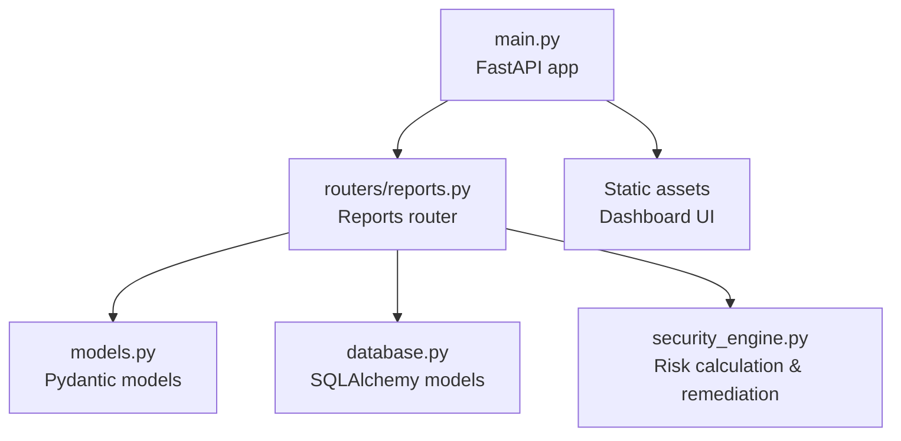
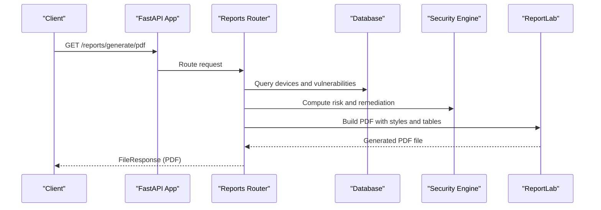
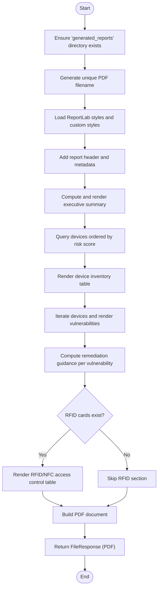
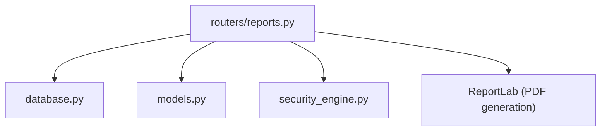

# Reporting API

<cite>
**Referenced Files in This Document**
- [backend/main.py](file://backend/main.py)
- [backend/routers/reports.py](file://backend/routers/reports.py)
- [backend/models.py](file://backend/models.py)
- [backend/database.py](file://backend/database.py)
- [backend/security_engine.py](file://backend/security_engine.py)
- [backend/README.md](file://backend/README.md)
</cite>

## Table of Contents
1. [Introduction](#introduction)
2. [Project Structure](#project-structure)
3. [Core Components](#core-components)
4. [Architecture Overview](#architecture-overview)
5. [Detailed Component Analysis](#detailed-component-analysis)
6. [Dependency Analysis](#dependency-analysis)
7. [Performance Considerations](#performance-considerations)
8. [Troubleshooting Guide](#troubleshooting-guide)
9. [Conclusion](#conclusion)
10. [Appendices](#appendices)

## Introduction
This document describes the Reporting API for PentexOne, focusing on automated security report generation, executive summary creation, compliance documentation export, and data visualization reporting. It covers the PDF report generation endpoint, report customization options, template management, and batch reporting operations. It also documents request/response schemas for report configuration, data filtering, and export formats, along with examples of report generation workflows, custom report templates, and integration with compliance requirements.

## Project Structure
The Reporting API is implemented as part of the FastAPI backend. The reports module exposes endpoints for generating a PDF security report and retrieving a dashboard summary. Data is sourced from the SQL database and rendered into a PDF using ReportLab. The application entrypoint wires the reports router into the main application.

**Diagram sources**
- [backend/main.py:44-48](file://backend/main.py#L44-L48)
- [backend/routers/reports.py:15](file://backend/routers/reports.py#L15)
- [backend/models.py:47-53](file://backend/models.py#L47-L53)
- [backend/database.py:12-54](file://backend/database.py#L12-L54)
- [backend/security_engine.py:202-339](file://backend/security_engine.py#L202-L339)

**Section sources**
- [backend/main.py:44-48](file://backend/main.py#L44-L48)
- [backend/routers/reports.py:15](file://backend/routers/reports.py#L15)
- [backend/models.py:47-53](file://backend/models.py#L47-L53)
- [backend/database.py:12-54](file://backend/database.py#L12-L54)
- [backend/security_engine.py:202-339](file://backend/security_engine.py#L202-L339)

## Core Components
- Reports router: Provides endpoints for dashboard summary and PDF report generation.
- Database models: Define the Device, Vulnerability, RFIDCard, and Setting entities used by the reporting pipeline.
- Pydantic models: Define request/response schemas for API clients.
- Security engine: Computes risk levels and remediation guidance used in reports.

Key responsibilities:
- Generate a PDF report containing executive summary, device inventory, vulnerability analysis, and RFID audit.
- Provide a lightweight dashboard summary endpoint for quick risk metrics.
- Support customization via database-backed settings and remediation logic.

**Section sources**
- [backend/routers/reports.py:18-34](file://backend/routers/reports.py#L18-L34)
- [backend/routers/reports.py:37-157](file://backend/routers/reports.py#L37-L157)
- [backend/database.py:12-54](file://backend/database.py#L12-L54)
- [backend/models.py:47-53](file://backend/models.py#L47-L53)
- [backend/security_engine.py:202-339](file://backend/security_engine.py#L202-L339)

## Architecture Overview
The Reporting API integrates with the database and security engine to produce a comprehensive PDF report. The process involves:
- Querying devices and vulnerabilities from the database.
- Computing risk summaries and remediation guidance.
- Rendering content into a structured PDF using ReportLab.
- Returning the generated PDF as a file response.

**Diagram sources**
- [backend/routers/reports.py:37-157](file://backend/routers/reports.py#L37-L157)
- [backend/database.py:12-54](file://backend/database.py#L12-L54)
- [backend/security_engine.py:202-339](file://backend/security_engine.py#L202-L339)

## Detailed Component Analysis

### Endpoint: GET /reports/summary
Purpose:
- Returns a dashboard summary with counts of devices grouped by risk level and scan time.

Behavior:
- Queries the Device table to compute totals and counts per risk category.
- Returns a structured response model containing counts and timestamp.

Response schema:
- total_devices: integer
- safe_count: integer
- medium_count: integer
- risk_count: integer
- unknown_count: integer
- scan_time: datetime (UTC)

Example usage:
- Call the endpoint to retrieve current risk distribution for dashboard widgets.

Notes:
- This endpoint supports executive summary creation by providing aggregated counts.

**Section sources**
- [backend/routers/reports.py:18-34](file://backend/routers/reports.py#L18-L34)
- [backend/models.py:47-53](file://backend/models.py#L47-L53)

### Endpoint: GET /reports/generate/pdf
Purpose:
- Generates a comprehensive PDF security report including executive summary, device inventory, vulnerability analysis, and RFID audit.

Behavior:
- Creates a dedicated folder for generated reports.
- Builds a PDF with custom styles and sections.
- Populates sections with:
  - Executive summary based on device counts.
  - Device inventory table ordered by risk score.
  - Vulnerability analysis and remediation guidance per device.
  - RFID/NFC access control audit table if cards are present.
- Returns the PDF as a file response.

Request parameters:
- None (no query parameters or body required).

Response:
- FileResponse pointing to the generated PDF file.

Customization options:
- Template management:
  - Styles and layout are defined programmatically in the endpoint.
  - Remediation guidance is computed dynamically from the security engine.
- Data filtering:
  - Device ordering by risk score.
  - Conditional coloring for risk levels in the device table.
- Batch operations:
  - The endpoint processes all devices and vulnerabilities in a single run.

Compliance integration:
- Remediation guidance is embedded directly in the report to support compliance documentation.
- Risk levels and scores are derived from the security engine, enabling repeatable assessments.

**Section sources**
- [backend/routers/reports.py:37-157](file://backend/routers/reports.py#L37-L157)
- [backend/security_engine.py:392-423](file://backend/security_engine.py#L392-L423)

### Data Models and Schemas
- ReportSummary: Used by the summary endpoint to return risk counts and scan time.
- DeviceOut and VulnerabilityOut: Represent device and vulnerability records for broader API usage.
- RFIDCardOut: Represents RFID/NFC card records for access control audit.

These models define the shape of data returned by endpoints and consumed by the reporting pipeline.

**Section sources**
- [backend/models.py:47-66](file://backend/models.py#L47-L66)

### Database Schema for Reporting
The reporting pipeline consumes the following entities:
- Device: IP/MAC/hostname, protocol, OS guess, risk level/score, open ports, last seen, and associated vulnerabilities.
- Vulnerability: Type, severity, description, optional port/protocol linkage to a device.
- RFIDCard: UID, card type, SAK/data, risk level/score, last seen.

These tables are queried to populate the report’s device inventory, vulnerability analysis, and RFID audit sections.

**Section sources**
- [backend/database.py:12-54](file://backend/database.py#L12-L54)

### Security Engine Integration
The security engine contributes:
- Risk computation: Converts open ports, protocols, default credentials, firmware versions, and TLS issues into risk levels and scores.
- Remediation guidance: Provides tailored remediation advice for each vulnerability type.

This integration ensures the report reflects accurate risk assessments and actionable recommendations.

**Section sources**
- [backend/security_engine.py:202-339](file://backend/security_engine.py#L202-L339)
- [backend/security_engine.py:392-423](file://backend/security_engine.py#L392-L423)

### Report Generation Workflow

**Diagram sources**
- [backend/routers/reports.py:37-157](file://backend/routers/reports.py#L37-L157)

## Dependency Analysis
The reporting module depends on:
- Database models for querying devices, vulnerabilities, and RFID cards.
- Pydantic models for response schemas.
- Security engine for risk calculations and remediation guidance.
- ReportLab for PDF rendering.

**Diagram sources**
- [backend/routers/reports.py:12-13](file://backend/routers/reports.py#L12-L13)
- [backend/database.py:12-54](file://backend/database.py#L12-L54)
- [backend/models.py:47-53](file://backend/models.py#L47-L53)
- [backend/security_engine.py:202-339](file://backend/security_engine.py#L202-L339)

**Section sources**
- [backend/routers/reports.py:12-13](file://backend/routers/reports.py#L12-L13)
- [backend/database.py:12-54](file://backend/database.py#L12-L54)
- [backend/models.py:47-53](file://backend/models.py#L47-L53)
- [backend/security_engine.py:202-339](file://backend/security_engine.py#L202-L339)

## Performance Considerations
- Large-scale report generation:
  - The PDF generation builds tables and iterates through devices and vulnerabilities. For very large datasets, consider pagination or streaming to reduce memory usage.
  - Offload PDF generation to a background job queue (e.g., Celery) to avoid blocking the API thread.
- Export optimization:
  - Cache computed risk summaries and remediation guidance to minimize repeated computations.
  - Compress the generated PDF if storage or bandwidth is constrained.
- Database queries:
  - Ensure indexes exist on frequently filtered columns (e.g., risk_level, last_seen).
  - Limit result sets when appropriate to reduce payload sizes.

[No sources needed since this section provides general guidance]

## Troubleshooting Guide
Common issues and resolutions:
- PDF not generated:
  - Verify the generated_reports directory exists and is writable.
  - Confirm ReportLab dependencies are installed.
- Empty report sections:
  - Ensure the database contains devices, vulnerabilities, and/or RFID cards as applicable.
- Incorrect risk levels:
  - Validate that the security engine’s risk calculation logic is functioning and that the database contains expected open ports and firmware data.
- Endpoint returns unexpected errors:
  - Check application logs for exceptions during PDF generation or database queries.

**Section sources**
- [backend/routers/reports.py:40-42](file://backend/routers/reports.py#L40-L42)
- [backend/security_engine.py:202-339](file://backend/security_engine.py#L202-L339)

## Conclusion
The Reporting API provides automated, customizable security reporting for PentexOne. It generates a comprehensive PDF report with executive summaries, device inventories, vulnerability analysis, and RFID audits. While the current implementation focuses on PDF generation, future enhancements could include additional export formats (JSON, CSV), templating systems, and batch/report scheduling capabilities.

[No sources needed since this section summarizes without analyzing specific files]

## Appendices

### API Reference

- GET /reports/summary
  - Description: Returns a dashboard summary with risk counts and scan time.
  - Response: ReportSummary
  - Example fields: total_devices, safe_count, medium_count, risk_count, unknown_count, scan_time

- GET /reports/generate/pdf
  - Description: Generates a PDF security report including executive summary, device inventory, vulnerability analysis, and RFID audit.
  - Response: FileResponse (application/pdf)
  - Notes: No request parameters or body required.

**Section sources**
- [backend/routers/reports.py:18-34](file://backend/routers/reports.py#L18-L34)
- [backend/routers/reports.py:37-157](file://backend/routers/reports.py#L37-L157)
- [backend/models.py:47-53](file://backend/models.py#L47-L53)

### Compliance and Reporting Guidance
- Use the embedded remediation guidance to support compliance documentation.
- Leverage risk levels and scores to demonstrate due diligence and risk mitigation.
- Integrate with organizational policies by exporting reports and archiving them in the generated_reports directory.

**Section sources**
- [backend/security_engine.py:392-423](file://backend/security_engine.py#L392-L423)
- [backend/README.md:237-240](file://backend/README.md#L237-L240)