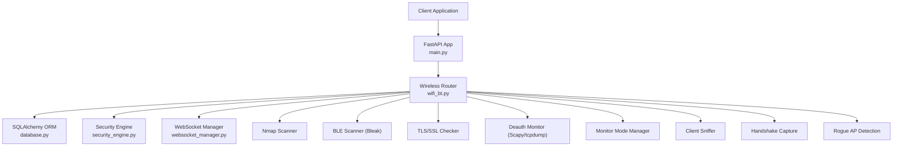
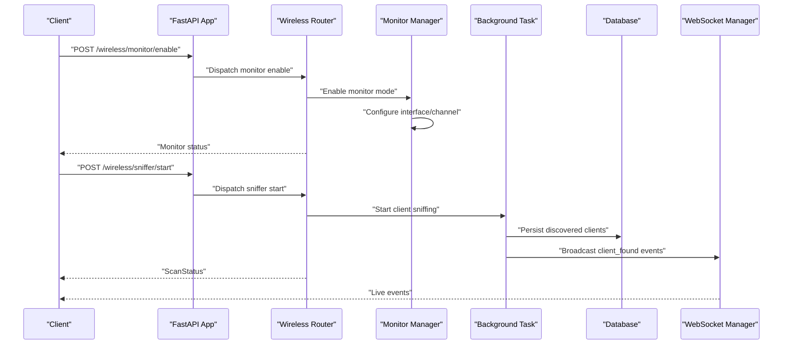
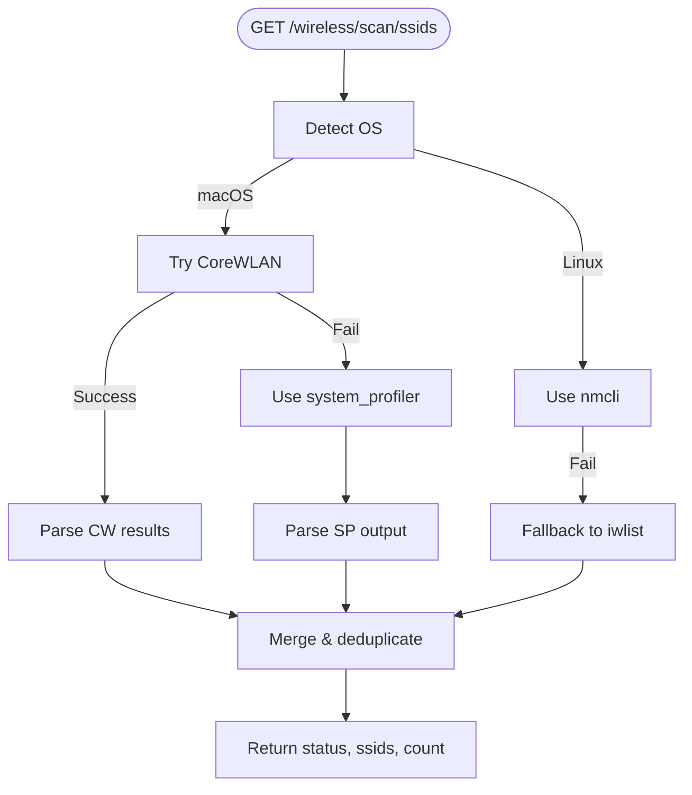
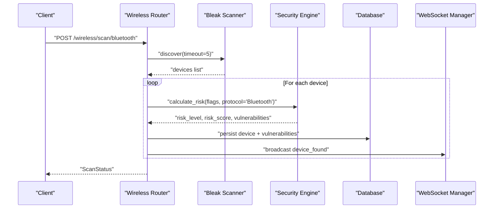
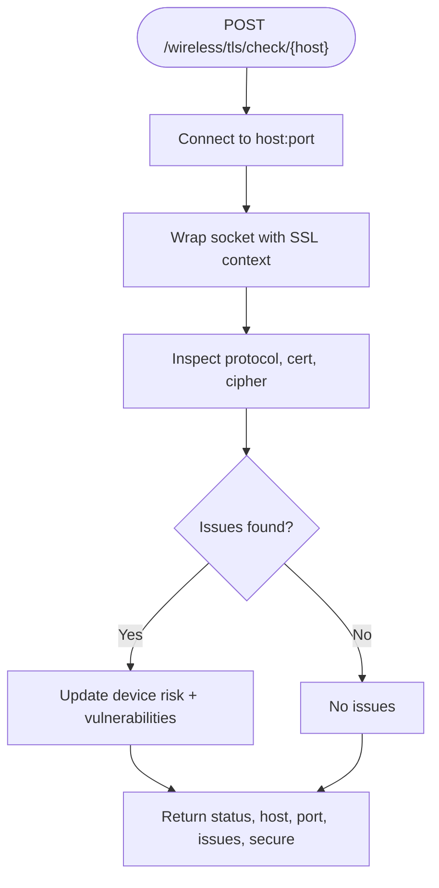
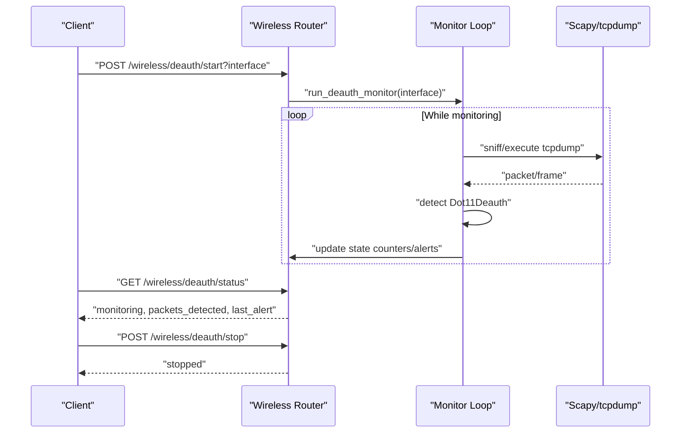
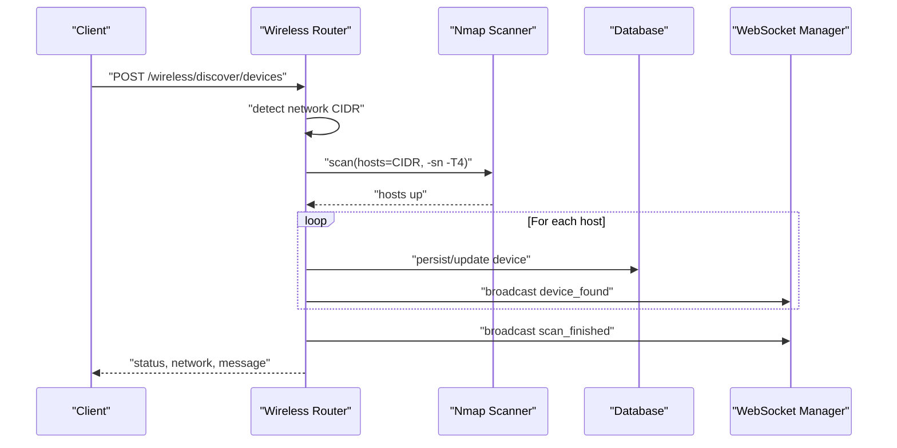
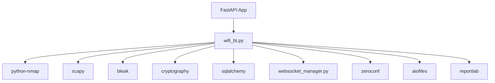

# WiFi & Bluetooth API

<cite>
**Referenced Files in This Document**
- [wifi_bt.py](file://backend/routers/wifi_bt.py)
- [main.py](file://backend/main.py)
- [models.py](file://backend/models.py)
- [database.py](file://backend/database.py)
- [security_engine.py](file://backend/security_engine.py)
- [websocket_manager.py](file://backend/websocket_manager.py)
- [requirements.txt](file://backend/requirements.txt)
- [README.md](file://backend/README.md)
</cite>

## Update Summary
**Changes Made**
- Added comprehensive advanced WiFi monitoring capabilities including monitor mode management
- Integrated packet capture functionality for client discovery and signal analysis
- Implemented WPA handshake capture for security testing
- Enhanced deauthentication attack testing with MFP detection
- Added rogue access point and evil twin detection
- Expanded wireless security testing features with signal mapping and channel analysis

## Table of Contents
1. [Introduction](#introduction)
2. [Project Structure](#project-structure)
3. [Core Components](#core-components)
4. [Architecture Overview](#architecture-overview)
5. [Detailed Component Analysis](#detailed-component-analysis)
6. [Advanced WiFi Monitoring Capabilities](#advanced-wifi-monitoring-capabilities)
7. [Dependency Analysis](#dependency-analysis)
8. [Performance Considerations](#performance-considerations)
9. [Troubleshooting Guide](#troubleshooting-guide)
10. [Conclusion](#conclusion)
11. [Appendices](#appendices)

## Introduction
This document provides comprehensive API documentation for the PentexOne WiFi and Bluetooth protocol-specific scanning and analysis endpoints. The API has been significantly expanded with advanced WiFi monitoring capabilities including monitor mode functionality, packet capture, handshake capture, deauthentication attacks, and rogue access point detection. It covers:

- WiFi network analysis (signal analysis, SSID discovery, device discovery)
- Advanced WiFi monitoring (monitor mode, client sniffing, handshake capture)
- Bluetooth device enumeration and BLE scanning
- Wireless protocol security assessment (TLS/SSL validation, deauthentication attack detection)
- Rogue access point detection and evil twin identification
- Signal mapping and channel analysis for wireless optimization
- Request/response schemas, signal strength measurement, device classification, and security risk scoring
- Example workflows for wireless network analysis, Bluetooth device profiling, and IoT security monitoring
- Performance considerations for concurrent wireless scanning and optimization strategies

The API is implemented as a FastAPI application with background tasks for non-blocking operations, WebSocket broadcasting for real-time updates, and a SQLite-backed ORM for persistent storage.

## Project Structure
The WiFi & Bluetooth API resides in the dedicated router module and integrates with the broader application via dependency injection and shared managers.

**Diagram sources**
- [main.py:14-48](file://backend/main.py#L14-L48)
- [wifi_bt.py:27-27](file://backend/routers/wifi_bt.py#L27-L27)
- [database.py:12-41](file://backend/database.py#L12-L41)
- [security_engine.py:202-339](file://backend/security_engine.py#L202-L339)
- [websocket_manager.py:7-47](file://backend/websocket_manager.py#L7-L47)

**Section sources**
- [main.py:14-48](file://backend/main.py#L14-L48)
- [wifi_bt.py:27-27](file://backend/routers/wifi_bt.py#L27-L27)
- [database.py:12-41](file://backend/database.py#L12-L41)
- [websocket_manager.py:7-47](file://backend/websocket_manager.py#L7-L47)

## Core Components
- Wireless Router: Exposes endpoints for WiFi scanning, Bluetooth enumeration, TLS checks, deauthentication monitoring, and comprehensive wireless security testing.
- Security Engine: Computes risk scores and vulnerability classifications based on open ports, protocol specifics, and TLS issues.
- Database: Stores discovered devices, vulnerabilities, and settings.
- WebSocket Manager: Broadcasts live events (device found, scan finished, errors) to connected clients.
- Background Tasks: Runs long-running operations (scans, monitors) without blocking the API.
- Monitor Mode Manager: Controls WiFi interface monitor mode activation and channel selection.
- Client Sniffer: Captures WiFi packets to discover devices without connection.
- Handshake Capture: Records WPA/WPA2 authentication exchanges for security testing.
- Rogue AP Detection: Identifies duplicate SSIDs with different BSSIDs indicating potential attacks.

Key schemas:
- ScanStatus: Standardized status messages for asynchronous operations.
- DeviceOut/VulnerabilityOut: Output models for device and vulnerability details.
- SettingUpdate: Settings update model for runtime configuration.
- Advanced WiFi states: Monitor, sniffer, handshake, deauth attack, and rogue AP detection states.

**Section sources**
- [wifi_bt.py:40-53](file://backend/routers/wifi_bt.py#L40-L53)
- [wifi_bt.py:182-187](file://backend/routers/wifi_bt.py#L182-L187)
- [models.py:6-33](file://backend/models.py#L6-L33)
- [models.py:41-44](file://backend/models.py#L41-L44)
- [database.py:12-41](file://backend/database.py#L12-L41)

## Architecture Overview
The API follows a layered architecture with enhanced WiFi monitoring capabilities:
- Presentation Layer: FastAPI routes in the wireless router.
- Domain Layer: Security scoring and vulnerability mapping.
- Persistence Layer: SQLAlchemy models and SQLite.
- Communication Layer: WebSocket broadcasts for real-time updates.
- Advanced Monitoring Layer: Monitor mode management, packet capture, and wireless security testing.

**Diagram sources**
- [wifi_bt.py:182-187](file://backend/routers/wifi_bt.py#L182-L187)
- [wifi_bt.py:190-239](file://backend/routers/wifi_bt.py#L190-L239)
- [database.py:12-41](file://backend/database.py#L12-L41)
- [websocket_manager.py:21-45](file://backend/websocket_manager.py#L21-L45)

## Detailed Component Analysis

### Endpoint Catalog
All endpoints are prefixed with /wireless and grouped by functionality.

#### WiFi Interfaces and Monitor Mode
- GET /wireless/interfaces
  - Purpose: List available network interfaces.
  - Response: JSON with interfaces array.

- POST /wireless/monitor/enable
  - Purpose: Enable monitor mode on WiFi interface with automatic channel selection.
  - Response: JSON with status, interface, original_interface, and channel.

- POST /wireless/monitor/disable
  - Purpose: Disable monitor mode and restore managed mode.
  - Response: JSON with status and message.

- GET /wireless/monitor/status
  - Purpose: Get current monitor mode status and interface information.
  - Response: JSON with monitor state and actual system mode.

- POST /wireless/monitor/channel
  - Purpose: Set channel for monitor interface.
  - Response: JSON with status and channel.

#### Client Sniffing and Packet Capture
- POST /wireless/sniffer/start
  - Purpose: Start Wi-Fi client sniffer to discover devices without connecting.
  - Response: JSON with status, interface, and duration.

- POST /wireless/sniffer/stop
  - Purpose: Stop client sniffer.
  - Response: JSON with status and client count.

- GET /wireless/sniffer/status
  - Purpose: Get current sniffer status and discovered clients.
  - Response: JSON with sniffer state.

- GET /wireless/sniffer/clients
  - Purpose: Retrieve all clients discovered by the sniffer.
  - Response: JSON with clients array and count.

#### WPA Handshake Capture
- POST /wireless/handshake/start
  - Purpose: Start capturing WPA/WPA2 4-way handshakes for target AP.
  - Response: JSON with status, BSSID, channel, and timeout.

- POST /wireless/handshake/stop
  - Purpose: Stop handshake capture.
  - Response: JSON with status and capture file information.

- GET /wireless/handshake/status
  - Purpose: Get current handshake capture status.
  - Response: JSON with handshake state.

#### Deauthentication Attack Testing
- POST /wireless/deauth/test
  - Purpose: Test connection resilience by sending deauthentication frames.
  - Response: JSON with status, target, AP, and count.

- GET /wireless/deauth/test/status
  - Purpose: Get current deauth test status.
  - Response: JSON with attack state including MFP detection.

#### Rogue Access Point Detection
- POST /wireless/rogue/start
  - Purpose: Start Rogue AP/Evil Twin detection.
  - Response: JSON with status and duration.

- POST /wireless/rogue/stop
  - Purpose: Stop Rogue AP detection.
  - Response: JSON with status and alert count.

- GET /wireless/rogue/status
  - Purpose: Get current Rogue AP detection status and alerts.
  - Response: JSON with detection state and alerts.

#### Signal Mapping and Channel Analysis
- POST /wireless/signal/map
  - Purpose: Scan all channels and map signal strengths for interference analysis.
  - Response: JSON with networks, channel usage, best channels, and recommendations.

#### Traditional WiFi Functions
- GET /wireless/scan/ssids
  - Purpose: Discover nearby Wi-Fi networks (SSIDs) with RSSI, security, and channel metadata.
  - Response: JSON with status, ssids array, and count.

- Network Device Discovery (One-Click)
  - POST /wireless/discover/devices
  - Purpose: Auto-detect current network and scan for devices.
  - Response: JSON with status, network CIDR, and message.

- Port Scanning (Background)
  - POST /wireless/test/ports/{ip}
  - Purpose: Asynchronously scan TCP ports for an IP.
  - Response: JSON with status and message.

- Default Credential Testing (Background)
  - POST /wireless/test/credentials/{ip}
  - Purpose: Asynchronously test default credentials for HTTP/Telnet.
  - Response: JSON with status and message.

- Full Device Scan (Background)
  - POST /wireless/scan/full/{ip}
  - Purpose: Start both port scan and credential test concurrently.
  - Response: JSON with status and message.

#### Bluetooth BLE Enumeration (Background)
- POST /wireless/scan/bluetooth
  - Purpose: Discover nearby BLE devices and classify risk.
  - Response: ScanStatus.

#### TLS/SSL Certificate Validation
- POST /wireless/tls/check/{host}?port=443
  - Purpose: Validate TLS/SSL certificate and security for a host.
  - Response: JSON with status, host, port, issues, and secure flag.

- Deauthentication Attack Detection
- POST /wireless/deauth/start?interface=wlan0mon
- POST /wireless/deauth/stop
- GET /wireless/deauth/status
  - Purpose: Monitor for deauthentication frames on a wireless interface.
  - Response: JSON with status and monitoring state.

**Section sources**
- [wifi_bt.py:39-53](file://backend/routers/wifi_bt.py#L39-L53)
- [wifi_bt.py:245-441](file://backend/routers/wifi_bt.py#L245-L441)
- [wifi_bt.py:636-766](file://backend/routers/wifi_bt.py#L636-L766)
- [wifi_bt.py:59-104](file://backend/routers/wifi_bt.py#L59-L104)
- [wifi_bt.py:172-176](file://backend/routers/wifi_bt.py#L172-L176)
- [wifi_bt.py:182-187](file://backend/routers/wifi_bt.py#L182-L187)
- [wifi_bt.py:447-549](file://backend/routers/wifi_bt.py#L447-L549)
- [wifi_bt.py:555-579](file://backend/routers/wifi_bt.py#L555-L579)

### Request/Response Schemas
- ScanStatus
  - Fields: status, message, devices_found
  - Typical values: status "started"|"error"|"already_running"|"stopped"; message human-readable; devices_found integer

- DeviceOut
  - Fields: id, ip, mac, hostname, vendor, protocol, os_guess, risk_level, risk_score, open_ports, last_seen, vulnerabilities
  - Used for device listings and detailed views

- VulnerabilityOut
  - Fields: id, vuln_type, severity, description, port, protocol
  - Used for vulnerability details attached to devices

- SettingUpdate
  - Fields: simulation_mode, nmap_timeout
  - Used to update runtime settings

- Advanced WiFi States
  - Monitor State: active, interface, original_interface, mode, channel, started_at
  - Sniffer State: active, clients, probe_requests, packets_captured, started_at
  - Handshake State: active, target_ssid, target_bssid, channel, handshake_captured, capture_file, packets_captured, started_at
  - Deauth Attack State: active, target_mac, ap_bssid, packets_sent, client_disconnected, protected, started_at
  - Rogue AP State: active, alerts, known_aps, started_at

**Section sources**
- [models.py:41-44](file://backend/models.py#L41-L44)
- [models.py:18-33](file://backend/models.py#L18-L33)
- [models.py:6-15](file://backend/models.py#L6-L15)
- [models.py:68-71](file://backend/models.py#L68-L71)

### WiFi Signal Analysis and SSID Discovery
- Implementation details:
  - Cross-platform SSID discovery using system-specific tools (macOS via CoreWLAN/system_profiler/networksetup; Linux via nmcli/iwlist).
  - Deduplication and filtering of SSIDs, handling redacted values on macOS.
  - RSSI extraction and channel/security inference where available.

- Response schema highlights:
  - ssids: array of objects with ssid, rssi, security, channel (and status on macOS).
  - count: number of unique networks found.
  - status: success|partial|error with message guidance.

**Diagram sources**
- [wifi_bt.py:245-441](file://backend/routers/wifi_bt.py#L245-L441)

**Section sources**
- [wifi_bt.py:245-441](file://backend/routers/wifi_bt.py#L245-L441)

### Bluetooth Device Enumeration and BLE Scanning
- Implementation details:
  - Uses Bleak for cross-platform BLE scanning.
  - Heuristic risk flags based on device name patterns (e.g., Smart/Lock indicates exposed characteristics; Unknown indicates no pairing).
  - Persists devices with mock IP, vendor, and protocol metadata.
  - Emits WebSocket events for live updates.

- Response schema highlights:
  - ScanStatus for start/stop/status.
  - Device persistence includes risk_level and risk_score derived from security engine.

**Diagram sources**
- [wifi_bt.py:182-187](file://backend/routers/wifi_bt.py#L182-L187)
- [wifi_bt.py:190-239](file://backend/routers/wifi_bt.py#L190-L239)
- [security_engine.py:202-339](file://backend/security_engine.py#L202-L339)
- [websocket_manager.py:21-45](file://backend/websocket_manager.py#L21-L45)

**Section sources**
- [wifi_bt.py:182-187](file://backend/routers/wifi_bt.py#L182-L187)
- [wifi_bt.py:190-239](file://backend/routers/wifi_bt.py#L190-L239)
- [security_engine.py:202-339](file://backend/security_engine.py#L202-L339)

### TLS/SSL Certificate Validation
- Implementation details:
  - Establishes TLS connection and inspects protocol version, certificate issuer/subject, expiration, and cipher strength.
  - Flags issues such as SSLv3/TLS 1.0/1.1 enabled, self-signed/expired certificates, weak ciphers, and CN mismatch.
  - Updates device risk and persists vulnerability records.

- Response schema highlights:
  - host, port, issues (array of identifiers), secure (boolean), status.

**Diagram sources**
- [wifi_bt.py:447-549](file://backend/routers/wifi_bt.py#L447-L549)

**Section sources**
- [wifi_bt.py:447-549](file://backend/routers/wifi_bt.py#L447-L549)

### Deauthentication Attack Detection
- Implementation details:
  - Starts/stops monitoring for 802.11 deauthentication frames on a specified interface.
  - Uses Scapy for packet parsing or tcpdump fallback.
  - Tracks packets_detected and last_alert with source/target or raw frame details.

- Response schema highlights:
  - Start/stop/status endpoints return standardized status messages.

**Diagram sources**
- [wifi_bt.py:555-579](file://backend/routers/wifi_bt.py#L555-L579)
- [wifi_bt.py:582-631](file://backend/routers/wifi_bt.py#L582-L631)

**Section sources**
- [wifi_bt.py:555-579](file://backend/routers/wifi_bt.py#L555-L579)
- [wifi_bt.py:582-631](file://backend/routers/wifi_bt.py#L582-L631)

### Network Device Discovery (One-Click)
- Implementation details:
  - Detects current network CIDR via OS-specific routing and interface inspection.
  - Performs a fast ping-sweep with nmap (-sn -T4) to discover hosts.
  - Persists new devices, updates existing ones, and emits WebSocket notifications.

- Response schema highlights:
  - status, network, message; background task returns scan_finished with devices_found.

**Diagram sources**
- [wifi_bt.py:636-766](file://backend/routers/wifi_bt.py#L636-L766)

**Section sources**
- [wifi_bt.py:636-766](file://backend/routers/wifi_bt.py#L636-L766)

### Security Risk Scoring and Classification
- Implementation details:
  - calculate_risk aggregates risk from:
    - Critical/Medium port mappings
    - Default credentials compromise
    - Protocol-specific flags (e.g., BLE_NO_PAIRING)
    - TLS issues (SSLv3/TLS 1.x, self-signed, expired, weak cipher)
    - Firmware/CVE matches
    - WiFi security flags (WIFI_NO_MFP)
  - Returns risk_level (SAFE/MEDIUM/RISK), risk_score (0–100), and vulnerability list.

- Example risk factors:
  - OPEN_TELNET, OPEN_FTP, SMB_OPEN, RDP_OPEN, VNC_OPEN, RTSP_OPEN, MQTT_OPEN, COAP_OPEN
  - DEFAULT_CREDENTIALS
  - BLE_NO_PAIRING, BLE_WEAK_AUTH, BLE_EXPOSED_CHARACTERISTICS
  - TLSV1_ENABLED, TLSV1_1_ENABLED, SELF_SIGNED_CERT, EXPIRED_CERT, WEAK_CIPHER
  - WIFI_NO_MFP (detected during deauth testing)

**Section sources**
- [security_engine.py:202-339](file://backend/security_engine.py#L202-L339)
- [security_engine.py:16-100](file://backend/security_engine.py#L16-L100)
- [security_engine.py:149-154](file://backend/security_engine.py#L149-L154)
- [security_engine.py:190-199](file://backend/security_engine.py#L190-L199)

## Advanced WiFi Monitoring Capabilities

### Monitor Mode Management
The API provides comprehensive monitor mode control for advanced WiFi analysis:

- **Interface Management**: Automatic detection and configuration of WiFi interfaces including RPi built-in WiFi (BCM43455) and USB adapters.
- **Channel Selection**: Dynamic channel hopping for comprehensive spectrum analysis.
- **State Tracking**: Complete monitor mode lifecycle management with automatic cleanup.
- **Platform Optimization**: Special handling for Raspberry Pi 5 built-in WiFi using native `iw` commands.

**Section sources**
- [wifi_bt.py:923-1028](file://backend/routers/wifi_bt.py#L923-L1028)
- [wifi_bt.py:1031-1088](file://backend/routers/wifi_bt.py#L1031-L1088)
- [wifi_bt.py:1091-1133](file://backend/routers/wifi_bt.py#L1119-L1133)

### Client Sniffing and Packet Capture
Advanced packet capture capabilities for device discovery:

- **Probe Request Analysis**: Captures and analyzes WiFi probe requests to identify devices searching for networks.
- **Data Frame Monitoring**: Detects connected devices through data frame analysis.
- **Signal Strength Measurement**: Extracts RSSI values for device proximity analysis.
- **Real-time Processing**: Live packet processing with WebSocket notifications for immediate insights.

**Section sources**
- [wifi_bt.py:1140-1191](file://backend/routers/wifi_bt.py#L1140-L1191)
- [wifi_bt.py:1193-1332](file://backend/routers/wifi_bt.py#L1193-L1332)

### WPA Handshake Capture
Comprehensive WPA/WPA2 handshake capture for security testing:

- **Targeted Capture**: Captures 4-way handshakes for specific access points.
- **EAPOL Frame Detection**: Identifies and extracts EAPOL frames from captured packets.
- **Automatic Saving**: Generates PCAP files for later analysis and password cracking attempts.
- **Progress Monitoring**: Real-time progress updates with WebSocket notifications.

**Section sources**
- [wifi_bt.py:1339-1406](file://backend/routers/wifi_bt.py#L1339-L1406)
- [wifi_bt.py:1414-1497](file://backend/routers/wifi_bt.py#L1414-L1497)

### Deauthentication Attack Testing
Enhanced deauthentication testing with MFP detection:

- **Resilience Testing**: Sends deauthentication frames to test client connection stability.
- **MFP Detection**: Automatically detects 802.11w Management Frame Protection.
- **Response Analysis**: Monitors client responses to determine attack effectiveness.
- **Risk Assessment**: Updates device risk profiles based on attack results.

**Section sources**
- [wifi_bt.py:1504-1557](file://backend/routers/wifi_bt.py#L1504-L1557)
- [wifi_bt.py:1566-1655](file://backend/routers/wifi_bt.py#L1566-L1655)

### Rogue Access Point and Evil Twin Detection
Advanced threat detection capabilities:

- **Duplicate SSID Monitoring**: Identifies multiple access points advertising the same SSID.
- **BSSID Comparison**: Compares BSSIDs to detect identical SSIDs with different MAC addresses.
- **Encryption Analysis**: Detects encryption differences indicating potential evil twins.
- **Signal Comparison**: Analyzes signal strength variations between legitimate and rogue APs.

**Section sources**
- [wifi_bt.py:1662-1694](file://backend/routers/wifi_bt.py#L1662-L1694)
- [wifi_bt.py:1710-1863](file://backend/routers/wifi_bt.py#L1710-L1863)

### Signal Mapping and Channel Analysis
Comprehensive wireless environment analysis:

- **Channel Scanning**: Systematic scanning of all WiFi channels for interference analysis.
- **Signal Strength Mapping**: Creates detailed signal strength maps for optimal channel selection.
- **Interference Detection**: Identifies overlapping channels and potential interference sources.
- **Optimization Recommendations**: Provides channel selection recommendations based on congestion analysis.

**Section sources**
- [wifi_bt.py:1869-1999](file://backend/routers/wifi_bt.py#L1869-L1999)
- [wifi_bt.py:2000-2077](file://backend/routers/wifi_bt.py#L2000-L2077)

## Dependency Analysis
External dependencies and their roles:
- fastapi: Web framework and routing
- python-nmap: Network scanning (ping-sweep, port scan)
- scapy: Packet manipulation and advanced WiFi monitoring
- zeroconf: Network service discovery
- bleak: Cross-platform BLE scanning
- cryptography: TLS certificate parsing
- sqlalchemy: ORM and database persistence
- websockets: WebSocket communication
- aiofiles: Asynchronous file operations
- reportlab: PDF report generation

**Diagram sources**
- [requirements.txt:1-19](file://backend/requirements.txt#L1-L19)
- [main.py:14-48](file://backend/main.py#L14-L48)
- [wifi_bt.py:4-25](file://backend/routers/wifi_bt.py#L4-L25)

**Section sources**
- [requirements.txt:1-19](file://backend/requirements.txt#L1-L19)
- [main.py:14-48](file://backend/main.py#L14-L48)

## Performance Considerations
- Concurrency and Background Tasks:
  - Use BackgroundTasks for port scans, credential tests, BLE discovery, and advanced WiFi monitoring to prevent blocking the API.
  - Combine multiple background tasks (e.g., full device scan) to overlap operations.

- Scanning Strategies:
  - Prefer fast ping-sweep (-sn -T4) for initial network discovery.
  - Limit port scan scope (e.g., top 10000) and tune timeouts to balance speed and completeness.
  - Optimize monitor mode operations by using channel-specific scanning rather than global channel hopping.

- Real-Time Updates:
  - WebSocket broadcasting occurs from background tasks; ensure thread-safe dispatch to the main event loop.
  - Implement rate limiting for high-frequency events like packet capture to prevent UI overload.

- Platform-Specific Optimizations:
  - macOS: CoreWLAN provides efficient SSID scanning; fallback to system_profiler/iwlist as needed.
  - Linux: nmcli is preferred; fallback to iwlist if unavailable.
  - Raspberry Pi: Special handling for built-in WiFi (BCM43455) using native `iw` commands for better reliability.

- Hardware Considerations:
  - Use Ethernet for stability; powered USB hubs for multiple dongles.
  - Disable unused desktop services and consider swap space for constrained devices.
  - Ensure proper cooling for continuous WiFi monitoring operations.

## Troubleshooting Guide
Common issues and resolutions:
- No SSIDs Found on macOS:
  - SSIDs may be redacted for privacy; use device discovery or BLE scanning as alternatives.
- BLE Not Available:
  - Ensure bleak is installed and the system supports Bluetooth; check platform availability.
- Deauth Monitoring Fails:
  - Requires scapy or tcpdump; ensure proper permissions and monitor interface availability.
- TLS Validation Errors:
  - Self-signed/expired certificates are flagged; verify hostnames and certificate chains.
- WebSocket Events Not Received:
  - Confirm WebSocket endpoint is reachable and the client maintains a stable connection.
- Monitor Mode Issues:
  - Ensure proper permissions (sudo) and required tools (aircrack-ng, iw) are installed.
  - Check interface availability and conflicts with NetworkManager.
- Packet Capture Failures:
  - Verify monitor mode is active and interface is configured correctly.
  - Ensure scapy is installed for advanced packet processing.
- Handshake Capture Problems:
  - Confirm monitor mode is active on the correct channel.
  - Ensure sufficient client activity for successful handshake capture.

**Section sources**
- [wifi_bt.py:430-435](file://backend/routers/wifi_bt.py#L430-L435)
- [wifi_bt.py:184-185](file://backend/routers/wifi_bt.py#L184-L185)
- [wifi_bt.py:606-631](file://backend/routers/wifi_bt.py#L606-L631)
- [wifi_bt.py:498-513](file://backend/routers/wifi_bt.py#L498-L513)
- [websocket_manager.py:21-45](file://backend/websocket_manager.py#L21-L45)

## Conclusion
The PentexOne WiFi & Bluetooth API provides a comprehensive foundation for wireless protocol analysis, device enumeration, and advanced security assessment. The major expansion with monitor mode functionality, packet capture, handshake capture, deauthentication testing, and rogue access point detection enables sophisticated wireless security testing and monitoring. Its modular design, background task execution, and WebSocket integration enable scalable, real-time monitoring suitable for IoT security auditing, wireless network optimization, and penetration testing scenarios. Proper configuration of dependencies, platform-specific scanning methods, and hardware setups ensures reliable operation across diverse environments.

## Appendices

### Example Workflows

#### Advanced WiFi Security Assessment
- Step 1: Enable monitor mode with `POST /wireless/monitor/enable` and select optimal channel.
- Step 2: Start client sniffing with `POST /wireless/sniffer/start` to discover nearby devices.
- Step 3: Monitor for rogue access points with `POST /wireless/rogue/start` for duration analysis.
- Step 4: Test deauthentication resilience with `POST /wireless/deauth/test` targeting specific clients.
- Step 5: Capture WPA handshakes with `POST /wireless/handshake/start` for security testing.
- Step 6: Analyze signal mapping with `POST /wireless/signal/map` for channel optimization.
- Step 7: Subscribe to WebSocket events for real-time monitoring updates.

#### WiFi Network Analysis
- Step 1: GET `/wireless/interfaces` to confirm interface availability.
- Step 2: GET `/wireless/scan/ssids` to discover nearby networks and RSSI.
- Step 3: POST `/wireless/discover/devices` to scan the current network CIDR.
- Step 4: Enable monitor mode and start client sniffing for comprehensive device discovery.
- Step 5: Subscribe to WebSocket events for live device updates.

#### Bluetooth Device Profiling
- Step 1: POST `/wireless/scan/bluetooth` to start BLE discovery.
- Step 2: Poll ScanStatus until completion.
- Step 3: Retrieve devices and vulnerabilities via device listing APIs.

#### IoT Security Monitoring Integration
- Step 1: POST `/wireless/test/ports/{ip}` and POST `/wireless/test/credentials/{ip}` to assess a target device.
- Step 2: POST `/wireless/tls/check/{host}` to validate TLS security.
- Step 3: Monitor deauth status via GET `/wireless/deauth/status` for ongoing threats.
- Step 4: Use signal mapping for wireless network optimization and interference analysis.

#### Wireless Penetration Testing
- Step 1: Enable monitor mode and configure channel selection.
- Step 2: Capture WPA handshakes for offline password cracking attempts.
- Step 3: Test deauthentication attacks to evaluate network resilience.
- Step 4: Monitor for rogue access points and evil twins.
- Step 5: Analyze signal strength and channel overlap for optimal deployment.