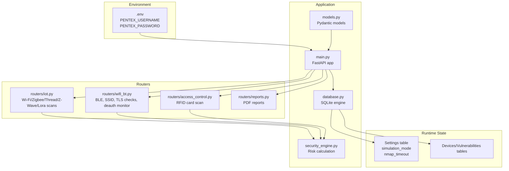
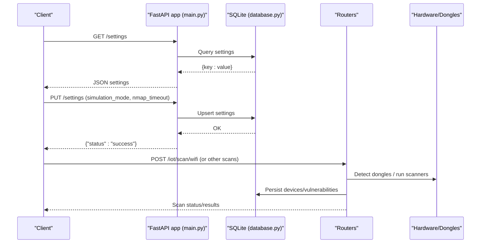
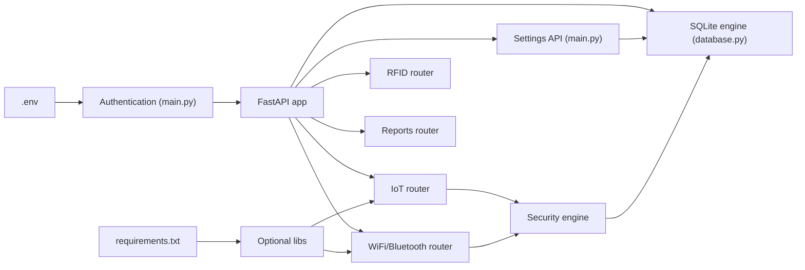

# Configuration Management

<cite>
**Referenced Files in This Document**
- [main.py](file://backend/main.py)
- [database.py](file://backend/database.py)
- [models.py](file://backend/models.py)
- [security_engine.py](file://backend/security_engine.py)
- [routers/iot.py](file://backend/routers/iot.py)
- [routers/wifi_bt.py](file://backend/routers/wifi_bt.py)
- [routers/access_control.py](file://backend/routers/access_control.py)
- [routers/reports.py](file://backend/routers/reports.py)
- [setup.sh](file://backend/setup.sh)
- [start.sh](file://backend/start.sh)
- [requirements.txt](file://backend/requirements.txt)
- [HARDWARE_GUIDE.md](file://backend/HARDWARE_GUIDE.md)
- [RASPBERRY_PI_GUIDE.md](file://backend/RASPBERRY_PI_GUIDE.md)
</cite>

## Table of Contents
1. [Introduction](#introduction)
2. [Project Structure](#project-structure)
3. [Core Components](#core-components)
4. [Architecture Overview](#architecture-overview)
5. [Detailed Component Analysis](#detailed-component-analysis)
6. [Dependency Analysis](#dependency-analysis)
7. [Performance Considerations](#performance-considerations)
8. [Troubleshooting Guide](#troubleshooting-guide)
9. [Conclusion](#conclusion)
10. [Appendices](#appendices)

## Introduction
This document describes the configuration management for PentexOne, covering environment variables, database settings, security configurations, hardware preferences, and operational parameters. It explains the .env file structure, default values, validation, and security best practices for credential management. It also documents system settings for scan parameters, timeouts, logging, and performance tuning, along with backup and restore procedures, migration strategies, and troubleshooting guidance tailored for production deployments.

## Project Structure
PentexOne’s configuration surface spans environment variables, a local SQLite database, per-device and per-session runtime state, and optional hardware dongles. The backend is a FastAPI application that reads environment variables for authentication and stores system settings in the database. Hardware detection and scanning behavior are influenced by environment variables and optional libraries.

**Diagram sources**
- [main.py:24-28](file://backend/main.py#L24-L28)
- [database.py:5-10](file://backend/database.py#L5-L10)
- [models.py:68-71](file://backend/models.py#L68-L71)
- [security_engine.py:202-340](file://backend/security_engine.py#L202-L340)
- [routers/iot.py:292-413](file://backend/routers/iot.py#L292-L413)
- [routers/wifi_bt.py:447-550](file://backend/routers/wifi_bt.py#L447-L550)
- [routers/access_control.py:47-84](file://backend/routers/access_control.py#L47-L84)
- [routers/reports.py:37-158](file://backend/routers/reports.py#L37-L158)

**Section sources**
- [main.py:1-106](file://backend/main.py#L1-L106)
- [database.py:1-80](file://backend/database.py#L1-L80)
- [models.py:1-71](file://backend/models.py#L1-L71)

## Core Components
- Environment variables
  - Authentication credentials are loaded from environment variables with defaults embedded in code. The setup scripts create a .env file with defaults and prompt to change the password.
  - Example keys: PENTEX_USERNAME, PENTEX_PASSWORD.
- Database
  - SQLite database file path is configured in the engine URL. The database initializes tables and default settings on startup.
- Settings persistence
  - System settings are stored in a dedicated settings table and can be queried and updated via API endpoints.
- Hardware and optional libraries
  - Optional hardware support (e.g., Zigbee via KillerBee, TLS validation via cryptography) is detected at runtime and influences scanning behavior.

**Section sources**
- [main.py:24-28](file://backend/main.py#L24-L28)
- [setup.sh:74-82](file://backend/setup.sh#L74-L82)
- [database.py:5-10](file://backend/database.py#L5-L10)
- [database.py:69-80](file://backend/database.py#L69-L80)
- [models.py:68-71](file://backend/models.py#L68-L71)

## Architecture Overview
The configuration architecture integrates environment-driven authentication, database-backed system settings, and hardware-dependent scanning capabilities. The application validates environment variables at startup, initializes the database, and exposes endpoints to manage settings and trigger scans.

**Diagram sources**
- [main.py:50-64](file://backend/main.py#L50-L64)
- [database.py:69-80](file://backend/database.py#L69-L80)
- [routers/iot.py:292-413](file://backend/routers/iot.py#L292-L413)
- [routers/wifi_bt.py:65-96](file://backend/routers/wifi_bt.py#L65-L96)

## Detailed Component Analysis

### Environment Variables and .env Management
- Purpose
  - Store authentication credentials for the web application.
- Keys
  - PENTEX_USERNAME: default “admin”
  - PENTEX_PASSWORD: default “pentex2024” (change immediately)
- Behavior
  - Loaded at startup; login endpoint compares incoming credentials to environment variables.
  - Setup script creates .env with defaults if missing and prints a prominent warning to change the password.
  - Start script ensures .env exists before launching the server.
- Validation
  - No explicit validation in code; rely on external scripts and manual verification.
- Security best practices
  - Change PENTEX_PASSWORD in .env before deployment.
  - Restrict .env file permissions to the application user.
  - Consider rotating secrets periodically and using a secret manager in production.

**Section sources**
- [main.py:24-28](file://backend/main.py#L24-L28)
- [setup.sh:74-82](file://backend/setup.sh#L74-L82)
- [start.sh:20-27](file://backend/start.sh#L20-L27)

### Database Configuration and Initialization
- Database URL
  - SQLite file path configured in the engine URL.
- Initialization
  - On startup, tables are created and default settings are inserted if missing.
- Settings table
  - Holds key-value pairs for system configuration (e.g., simulation_mode, nmap_timeout).
- Data model
  - Devices and Vulnerabilities tables persist scan results and risk assessments.

**Section sources**
- [database.py:5-10](file://backend/database.py#L5-L10)
- [database.py:69-80](file://backend/database.py#L69-L80)

### Settings API and Runtime Configuration
- Endpoints
  - GET /settings: returns current settings as a dictionary.
  - PUT /settings: updates provided settings (simulation_mode, nmap_timeout).
- Validation
  - Updates are applied only if the provided fields are not null; the application queries and updates existing records.
- Defaults
  - simulation_mode defaults to “true”.
  - nmap_timeout defaults to “60”.

**Section sources**
- [main.py:50-64](file://backend/main.py#L50-L64)
- [database.py:72-78](file://backend/database.py#L72-L78)
- [models.py:68-71](file://backend/models.py#L68-L71)

### Scan Parameters and Timeout Configuration
- Wi-Fi scan
  - Uses nmap with predefined ports and timing arguments; the scan progress and results are broadcast via WebSocket.
- Timeout configuration
  - Global timeout for scans is controlled by the nmap_timeout setting in the settings table.
  - Default value is initialized to 60 seconds.
- Hardware detection
  - Optional hardware support is detected at runtime; absence triggers simulated scans.

**Section sources**
- [routers/iot.py:292-413](file://backend/routers/iot.py#L292-L413)
- [database.py:72-78](file://backend/database.py#L72-L78)
- [models.py:36-39](file://backend/models.py#L36-L39)

### Logging and Diagnostics
- Logging level
  - Application-level logging is configured at INFO level.
- WebSocket diagnostics
  - Scans broadcast progress and completion events; errors are broadcast as well.
- TLS validation
  - TLS checks leverage cryptography to detect weak protocols, self-signed certs, and expiration.

**Section sources**
- [main.py:10-12](file://backend/main.py#L10-L12)
- [routers/iot.py:307-406](file://backend/routers/iot.py#L307-L406)
- [routers/wifi_bt.py:447-550](file://backend/routers/wifi_bt.py#L447-L550)

### Security Configuration and Best Practices
- Authentication
  - Enforce changing default credentials via .env.
- HTTPS
  - The deployment guide outlines enabling HTTPS via a reverse proxy (nginx) and Let’s Encrypt.
- Firewall
  - Allowlist only necessary ports (SSH, application port).
- Secrets management
  - Avoid committing .env to version control; use a secret manager or OS keychain in production.

**Section sources**
- [main.py:24-28](file://backend/main.py#L24-L28)
- [RASPBERRY_PI_GUIDE.md:550-578](file://backend/RASPBERRY_PI_GUIDE.md#L550-L578)

### Hardware Preferences and Optional Libraries
- Optional dependencies
  - KillerBee: enables real Zigbee scanning; otherwise simulated.
  - cryptography: enables robust TLS certificate validation.
- Hardware detection
  - The IoT router includes detection routines for Zigbee, Thread/Matter, Z-Wave, and Bluetooth adapters.
- Permissions
  - USB serial devices may require group membership (e.g., dialout, tty).

**Section sources**
- [requirements.txt:14-16](file://backend/requirements.txt#L14-L16)
- [routers/iot.py:158-181](file://backend/routers/iot.py#L158-L181)
- [HARDWARE_GUIDE.md:252-282](file://backend/HARDWARE_GUIDE.md#L252-L282)

### Backup and Restore Procedures
- Data to back up
  - SQLite database file (pentex.db)
  - Generated reports directory
  - .env file (contains secrets)
- Backup script
  - The deployment guide includes a sample backup script that archives the database, reports, and .env.
- Restore process
  - Stop the service, restore files, fix ownership, and restart the service.

**Section sources**
- [RASPBERRY_PI_GUIDE.md:360-400](file://backend/RASPBERRY_PI_GUIDE.md#L360-L400)
- [RASPBERRY_PI_GUIDE.md:299-311](file://backend/RASPBERRY_PI_GUIDE.md#L299-L311)

### Migration Strategies for Configuration Changes
- Versioned settings
  - Introduce new keys in the settings table with safe defaults; initialize on first run.
- Backward compatibility
  - Avoid removing keys; deprecate gracefully and map old values to new keys.
- Rollback
  - Keep previous .env and database backups; revert to last known good state.

[No sources needed since this section provides general guidance]

### Troubleshooting Common Configuration Issues
- Service won’t start
  - Check logs, port conflicts, and dependencies.
- Cannot access dashboard
  - Verify service status, firewall rules, and local connectivity.
- USB dongle not detected
  - Confirm permissions, kernel messages, and user groups.
- Bluetooth issues
  - Restart services, rescan, and unblock interfaces.
- Wi-Fi scanning problems
  - Ensure interface availability and avoid conflicts with managed mode.
- Database issues
  - Backup before resetting; recreate tables if necessary.

**Section sources**
- [RASPBERRY_PI_GUIDE.md:402-526](file://backend/RASPBERRY_PI_GUIDE.md#L402-L526)

## Dependency Analysis
The configuration dependencies center around environment variables, the database, and optional libraries. The following diagram shows how components depend on each other.

**Diagram sources**
- [main.py:24-28](file://backend/main.py#L24-L28)
- [database.py:5-10](file://backend/database.py#L5-L10)
- [requirements.txt:14-16](file://backend/requirements.txt#L14-L16)
- [routers/iot.py:300-413](file://backend/routers/iot.py#L300-L413)
- [routers/wifi_bt.py:447-550](file://backend/routers/wifi_bt.py#L447-L550)

**Section sources**
- [requirements.txt:1-21](file://backend/requirements.txt#L1-L21)
- [main.py:1-106](file://backend/main.py#L1-L106)

## Performance Considerations
- SQLite scalability
  - Suitable for small to medium deployments; consider migrating to a server-based database for high concurrency.
- Scan performance
  - Adjust nmap arguments and timeouts for larger networks; reduce port lists if needed.
- Hardware bottlenecks
  - Use a powered USB hub; disable unused services on Raspberry Pi; tune GPU memory and swap.
- Monitoring
  - Use htop, journalctl, and nethogs to track resource usage.

[No sources needed since this section provides general guidance]

## Troubleshooting Guide
- Authentication failures
  - Ensure PENTEX_USERNAME/PENTEX_PASSWORD are set in .env and match login attempts.
- Missing environment file
  - Use setup.sh or start.sh to create .env automatically.
- Database initialization errors
  - Verify file permissions and path; recreate tables if corrupted.
- Hardware detection failures
  - Check dmesg, lsusb, and serial port listings; adjust group memberships.

**Section sources**
- [setup.sh:74-82](file://backend/setup.sh#L74-L82)
- [start.sh:20-27](file://backend/start.sh#L20-L27)
- [HARDWARE_GUIDE.md:252-309](file://backend/HARDWARE_GUIDE.md#L252-L309)

## Conclusion
PentexOne’s configuration model centers on a simple .env for credentials, a SQLite-backed settings store for system parameters, and optional hardware libraries that influence scanning behavior. By following the documented best practices—changing defaults, backing up configuration and data, validating environment variables, and securing production deployments—you can operate PentexOne reliably across development, staging, and production environments.

## Appendices

### A. .env File Structure and Defaults
- Keys
  - PENTEX_USERNAME: default “admin”
  - PENTEX_PASSWORD: default “pentex2024”
- Creation
  - setup.sh creates .env with defaults and warns to change the password.
  - start.sh ensures .env exists before launching the server.

**Section sources**
- [setup.sh:74-82](file://backend/setup.sh#L74-L82)
- [start.sh:20-27](file://backend/start.sh#L20-L27)

### B. Settings Reference
- Keys
  - simulation_mode: toggles simulated vs. real hardware scans.
  - nmap_timeout: global timeout for scans (seconds).
- Defaults
  - simulation_mode: true
  - nmap_timeout: 60

**Section sources**
- [database.py:72-78](file://backend/database.py#L72-L78)
- [models.py:68-71](file://backend/models.py#L68-L71)

### C. Hardware and Optional Dependencies
- Optional libraries
  - KillerBee: real Zigbee scanning.
  - cryptography: TLS certificate validation.
- Detection
  - Hardware detection helpers in the IoT router detect dongles and adapt behavior.

**Section sources**
- [requirements.txt:14-16](file://backend/requirements.txt#L14-L16)
- [routers/iot.py:158-181](file://backend/routers/iot.py#L158-L181)

### D. Backup and Restore Checklist
- Backup
  - Archive pentex.db, generated_reports/, and .env.
- Restore
  - Stop service, restore files, fix ownership, restart service.

**Section sources**
- [RASPBERRY_PI_GUIDE.md:360-400](file://backend/RASPBERRY_PI_GUIDE.md#L360-L400)
- [RASPBERRY_PI_GUIDE.md:299-311](file://backend/RASPBERRY_PI_GUIDE.md#L299-L311)