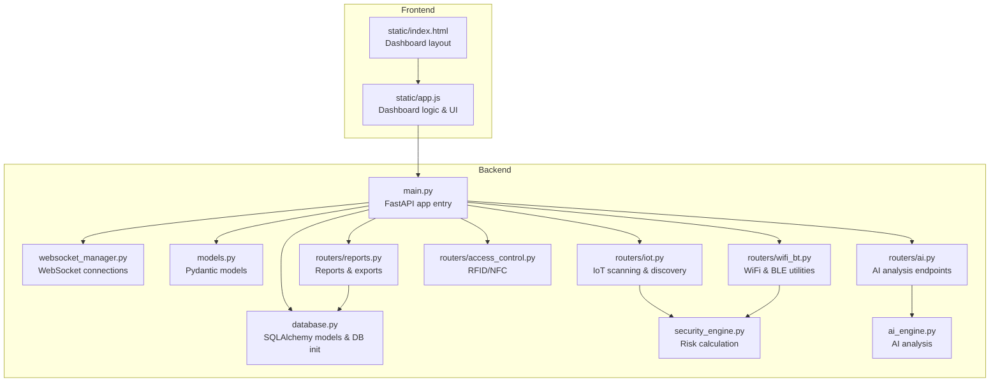
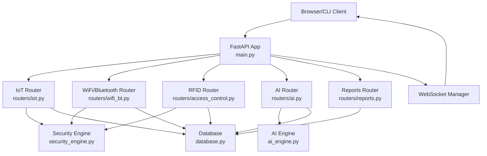
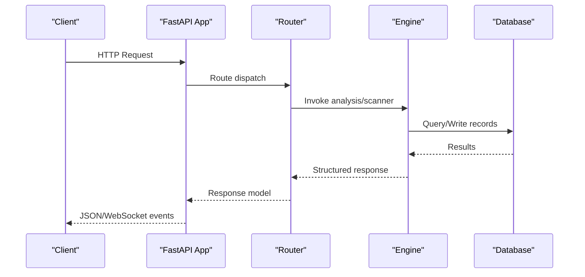
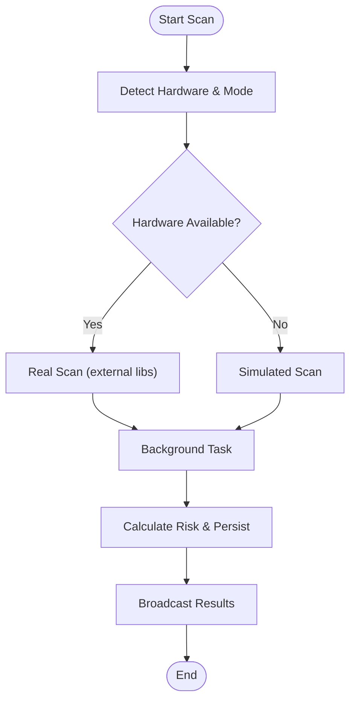
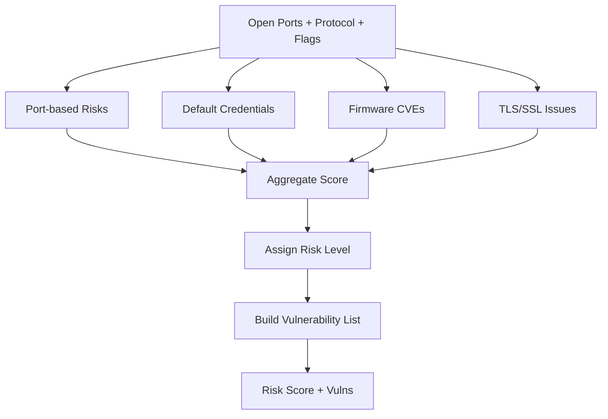
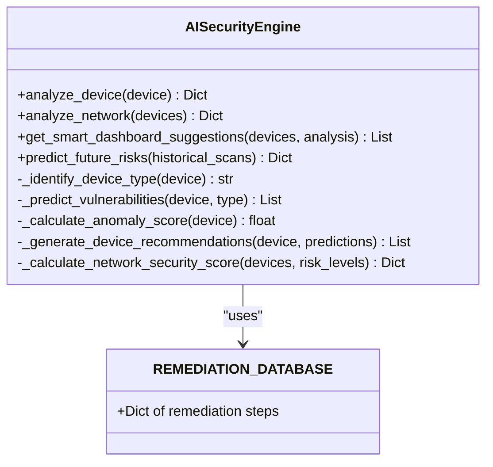
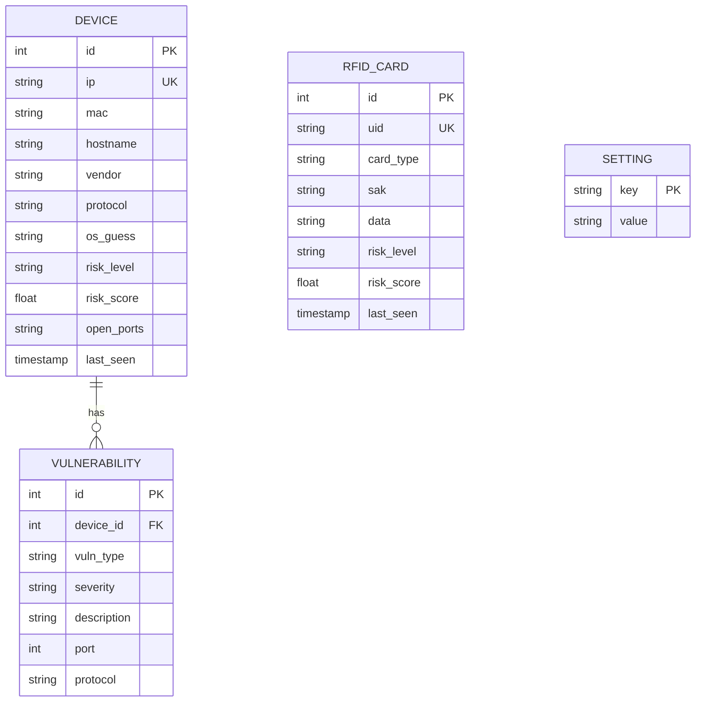
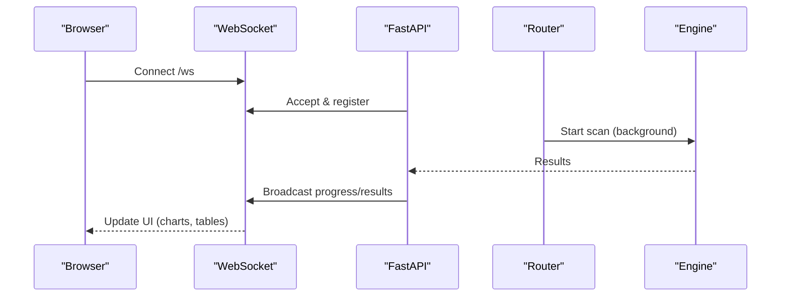
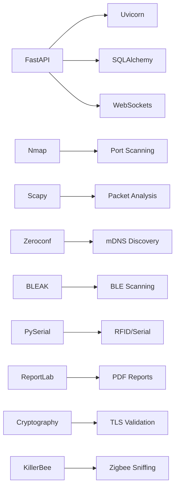
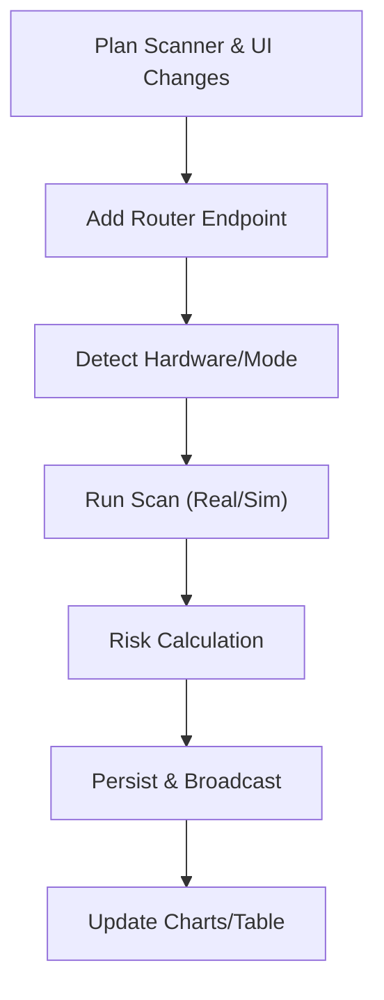

# Contributing & Development

<cite>
**Referenced Files in This Document**
- [backend/README.md](file://backend/README.md)
- [backend/main.py](file://backend/main.py)
- [backend/models.py](file://backend/models.py)
- [backend/requirements.txt](file://backend/requirements.txt)
- [backend/DEPLOYMENT_CHECKLIST.md](file://backend/DEPLOYMENT_CHECKLIST.md)
- [backend/database.py](file://backend/database.py)
- [backend/websocket_manager.py](file://backend/websocket_manager.py)
- [backend/security_engine.py](file://backend/security_engine.py)
- [backend/ai_engine.py](file://backend/ai_engine.py)
- [backend/routers/iot.py](file://backend/routers/iot.py)
- [backend/routers/wifi_bt.py](file://backend/routers/wifi_bt.py)
- [backend/routers/access_control.py](file://backend/routers/access_control.py)
- [backend/routers/reports.py](file://backend/routers/reports.py)
- [backend/routers/ai.py](file://backend/routers/ai.py)
- [backend/static/index.html](file://backend/static/index.html)
- [backend/static/app.js](file://backend/static/app.js)
- [backend/test_dongles.py](file://backend/test_dongles.py)
- [backend/setup.sh](file://backend/setup.sh)
</cite>

## Table of Contents
1. [Introduction](#introduction)
2. [Project Structure](#project-structure)
3. [Core Components](#core-components)
4. [Architecture Overview](#architecture-overview)
5. [Detailed Component Analysis](#detailed-component-analysis)
6. [Dependency Analysis](#dependency-analysis)
7. [Performance Considerations](#performance-considerations)
8. [Troubleshooting Guide](#troubleshooting-guide)
9. [Development Workflow](#development-workflow)
10. [Testing Framework](#testing-framework)
11. [Adding New Protocol Support](#adding-new-protocol-support)
12. [Extending Security Analysis](#extending-security-analysis)
13. [Contributing to the Frontend](#contributing-to-the-frontend)
14. [Development Environment Setup](#development-environment-setup)
15. [Documentation Contributions](#documentation-contributions)
16. [Bug Reporting and Feature Requests](#bug-reporting-and-feature-requests)
17. [Code Review Standards](#code-review-standards)
18. [Quality Assurance Practices](#quality-assurance-practices)
19. [Release Procedures](#release-procedures)
20. [Conclusion](#conclusion)

## Introduction
This document provides comprehensive contributing and development guidance for PentexOne, a professional-grade IoT security auditing platform. It covers development workflow, codebase structure, architectural patterns, coding conventions, testing strategies, and contribution procedures for protocols, security analysis, and the frontend interface. It also includes environment setup, dependency management, build processes, documentation contributions, bug reporting, feature requests, code review standards, quality assurance practices, and release procedures.

## Project Structure
PentexOne follows a modular backend architecture with a FastAPI application, organized routers for distinct functional domains, a shared AI and security engines, a SQL-based persistence layer, and a modern web dashboard.

**Diagram sources**
- [backend/main.py:1-106](file://backend/main.py#L1-L106)
- [backend/websocket_manager.py:1-48](file://backend/websocket_manager.py#L1-L48)
- [backend/database.py:1-80](file://backend/database.py#L1-L80)
- [backend/models.py:1-71](file://backend/models.py#L1-L71)
- [backend/routers/iot.py:1-880](file://backend/routers/iot.py#L1-L880)
- [backend/routers/wifi_bt.py:1-766](file://backend/routers/wifi_bt.py#L1-L766)
- [backend/routers/access_control.py:1-95](file://backend/routers/access_control.py#L1-L95)
- [backend/routers/ai.py:1-330](file://backend/routers/ai.py#L1-L330)
- [backend/routers/reports.py:1-158](file://backend/routers/reports.py#L1-L158)
- [backend/security_engine.py:1-425](file://backend/security_engine.py#L1-L425)
- [backend/ai_engine.py:1-766](file://backend/ai_engine.py#L1-L766)
- [backend/static/index.html:1-413](file://backend/static/index.html#L1-L413)
- [backend/static/app.js:1-1099](file://backend/static/app.js#L1-L1099)

**Section sources**
- [backend/README.md:273-306](file://backend/README.md#L273-L306)
- [backend/main.py:14-48](file://backend/main.py#L14-L48)

## Core Components
- FastAPI Application: Central entrypoint initializes CORS, routes, database, authentication, and WebSocket manager.
- Routers: Feature-based API groups for IoT scanning, WiFi/Bluetooth utilities, RFID/NFC, AI analysis, and reports.
- Engines: Security engine computes risk scores and vulnerability flags; AI engine performs pattern analysis and recommendations.
- Database: SQLAlchemy models define Device, Vulnerability, RFIDCard, and Setting tables with initialization and defaults.
- WebSocket Manager: Broadcasts scan progress, device discoveries, and errors to the dashboard in real-time.
- Frontend: Single-page dashboard with charts, device tables, and interactive controls.

**Section sources**
- [backend/main.py:14-106](file://backend/main.py#L14-L106)
- [backend/database.py:12-80](file://backend/database.py#L12-L80)
- [backend/websocket_manager.py:7-48](file://backend/websocket_manager.py#L7-L48)
- [backend/security_engine.py:202-340](file://backend/security_engine.py#L202-L340)
- [backend/ai_engine.py:236-766](file://backend/ai_engine.py#L236-L766)

## Architecture Overview
PentexOne uses a layered architecture:
- Presentation Layer: FastAPI routes and WebSocket endpoints serve the dashboard and API clients.
- Business Logic Layer: Routers orchestrate scans, integrate engines, and persist results.
- Data Access Layer: SQLAlchemy models and session management.
- External Integrations: Nmap, Scapy, BLEAK, KillerBee, ReportLab, cryptography.

**Diagram sources**
- [backend/main.py:14-106](file://backend/main.py#L14-L106)
- [backend/routers/iot.py:24-620](file://backend/routers/iot.py#L24-L620)
- [backend/routers/wifi_bt.py:27-766](file://backend/routers/wifi_bt.py#L27-L766)
- [backend/routers/access_control.py:13-95](file://backend/routers/access_control.py#L13-L95)
- [backend/routers/ai.py:20-330](file://backend/routers/ai.py#L20-L330)
- [backend/routers/reports.py:15-158](file://backend/routers/reports.py#L15-L158)
- [backend/security_engine.py:202-425](file://backend/security_engine.py#L202-L425)
- [backend/ai_engine.py:236-766](file://backend/ai_engine.py#L236-L766)
- [backend/database.py:12-80](file://backend/database.py#L12-L80)

## Detailed Component Analysis

### Backend Entry Point and Routing
- Initializes database, middleware, static files, and WebSocket manager.
- Exposes authentication, settings, and routing for all feature routers.

**Diagram sources**
- [backend/main.py:14-106](file://backend/main.py#L14-L106)
- [backend/routers/iot.py:291-413](file://backend/routers/iot.py#L291-L413)
- [backend/security_engine.py:202-340](file://backend/security_engine.py#L202-L340)
- [backend/database.py:62-80](file://backend/database.py#L62-L80)

**Section sources**
- [backend/main.py:14-106](file://backend/main.py#L14-L106)

### IoT Scanning and Hardware Detection
- Implements Wi-Fi, Matter, Zigbee, Thread, Z-Wave, LoRaWAN, and Bluetooth scanning.
- Uses background tasks and WebSocket broadcasts for progress and results.
- Detects hardware dongles and toggles simulation vs. real scans.

**Diagram sources**
- [backend/routers/iot.py:27-156](file://backend/routers/iot.py#L27-L156)
- [backend/routers/iot.py:483-586](file://backend/routers/iot.py#L483-L586)
- [backend/security_engine.py:202-340](file://backend/security_engine.py#L202-L340)
- [backend/websocket_manager.py:21-46](file://backend/websocket_manager.py#L21-L46)

**Section sources**
- [backend/routers/iot.py:291-413](file://backend/routers/iot.py#L291-L413)
- [backend/routers/iot.py:483-586](file://backend/routers/iot.py#L483-L586)

### Security Engine
- Computes risk scores from open ports, protocol-specific flags, default credentials, firmware CVEs, TLS issues, and protocol weaknesses.
- Provides remediation guidance per vulnerability type.

**Diagram sources**
- [backend/security_engine.py:202-340](file://backend/security_engine.py#L202-L340)

**Section sources**
- [backend/security_engine.py:202-425](file://backend/security_engine.py#L202-L425)

### AI Engine
- Performs device classification, anomaly detection, network pattern analysis, and recommendation generation.
- Provides dashboard suggestions and remediation guides.

**Diagram sources**
- [backend/ai_engine.py:236-766](file://backend/ai_engine.py#L236-L766)

**Section sources**
- [backend/ai_engine.py:236-766](file://backend/ai_engine.py#L236-L766)

### Database Schema
- Device, Vulnerability, RFIDCard, and Setting tables with relationships and defaults.

**Diagram sources**
- [backend/database.py:12-61](file://backend/database.py#L12-L61)

**Section sources**
- [backend/database.py:12-80](file://backend/database.py#L12-L80)

### Frontend Dashboard
- Single-page application with charts, device tables, and real-time updates via WebSocket.
- Controls for quick scans, advanced options, hardware status, AI suggestions, and report exports.

**Diagram sources**
- [backend/static/index.html:1-413](file://backend/static/index.html#L1-L413)
- [backend/static/app.js:113-155](file://backend/static/app.js#L113-L155)
- [backend/websocket_manager.py:7-48](file://backend/websocket_manager.py#L7-L48)
- [backend/routers/iot.py:291-413](file://backend/routers/iot.py#L291-L413)

**Section sources**
- [backend/static/index.html:52-316](file://backend/static/index.html#L52-L316)
- [backend/static/app.js:113-155](file://backend/static/app.js#L113-L155)

## Dependency Analysis
- Python dependencies managed via requirements.txt; includes FastAPI, Uvicorn, Nmap, Scapy, Zeroconf, ReportLab, SQLAlchemy, BLEAK, PySerial, and optional KillerBee and cryptography.
- Optional hardware support is gated by runtime checks in routers and engines.

**Diagram sources**
- [backend/requirements.txt:1-21](file://backend/requirements.txt#L1-L21)

**Section sources**
- [backend/requirements.txt:1-21](file://backend/requirements.txt#L1-L21)

## Performance Considerations
- Scans use background tasks and WebSocket broadcasts to avoid blocking the API.
- SQLite is used for simplicity; consider migration to PostgreSQL for high-volume deployments.
- Recommendations include headless mode, powered USB hubs, and Ethernet for stability.

[No sources needed since this section provides general guidance]

## Troubleshooting Guide
Common issues and resolutions:
- Dashboard not accessible: verify service status, port binding, and firewall rules.
- USB dongles not detected: check permissions and reboot after adding user to dialout group.
- Bluetooth not working: restart Bluetooth service and unblock via rfkill.

**Section sources**
- [backend/README.md:349-381](file://backend/README.md#L349-L381)

## Development Workflow
Recommended Git workflow:
- Fork the repository.
- Create a feature branch: git checkout -b feature/your-feature-name.
- Commit with clear messages: git commit -m "feat: add new protocol support".
- Push to origin: git push origin feature/your-feature-name.
- Open a Pull Request with a clear description and related issue number.

**Section sources**
- [backend/README.md:404-413](file://backend/README.md#L404-L413)

## Testing Framework
- Unit tests: Use pytest to test routers, engines, and models.
- Integration tests: Validate end-to-end flows for scans, WebSocket updates, and report generation.
- Hardware validation: Use test_dongles.py to verify dongle detection and simulation modes.

**Section sources**
- [backend/test_dongles.py:1-152](file://backend/test_dongles.py#L1-L152)

## Adding New Protocol Support
Steps to add a new protocol:
1. Create or extend a scanner in routers/iot.py with hardware detection and background scan logic.
2. Add protocol icon and chart updates in static/index.html and static/app.js.
3. Integrate risk calculations in security_engine.py and update vulnerability flags.
4. Test with test_dongles.py and verify WebSocket broadcasts.

**Diagram sources**
- [backend/routers/iot.py:27-156](file://backend/routers/iot.py#L27-L156)
- [backend/security_engine.py:202-340](file://backend/security_engine.py#L202-L340)
- [backend/static/index.html:52-118](file://backend/static/index.html#L52-L118)
- [backend/static/app.js:296-329](file://backend/static/app.js#L296-L329)

**Section sources**
- [backend/README.md:299-306](file://backend/README.md#L299-L306)

## Extending Security Analysis
Enhance risk scoring and vulnerability detection:
- Add new port mappings or protocol-specific flags in security_engine.py.
- Extend remediation database in ai_engine.py for new vulnerability types.
- Update WebSocket events to surface new analysis results.

**Section sources**
- [backend/security_engine.py:16-340](file://backend/security_engine.py#L16-L340)
- [backend/ai_engine.py:99-233](file://backend/ai_engine.py#L99-L233)

## Contributing to the Frontend
Frontend improvements:
- Update static/index.html for new UI elements and icons.
- Modify static/app.js for new scan flows, charts, and WebSocket handlers.
- Ensure responsive design and accessibility.

**Section sources**
- [backend/static/index.html:1-413](file://backend/static/index.html#L1-L413)
- [backend/static/app.js:1-1099](file://backend/static/app.js#L1-L1099)

## Development Environment Setup
- Install prerequisites: Python 3.8+, pip, nmap.
- Run setup script to create virtual environment, install dependencies, and initialize directories.
- Configure .env with secure credentials.
- Start with ./start.sh or manual activation and python3 main.py.

**Section sources**
- [backend/README.md:69-110](file://backend/README.md#L69-L110)
- [backend/setup.sh:1-142](file://backend/setup.sh#L1-L142)

## Documentation Contributions
- Improve backend/README.md for new features or workflows.
- Update inline comments and docstrings for clarity.
- Add usage examples and troubleshooting notes.

**Section sources**
- [backend/README.md:162-179](file://backend/README.md#L162-L179)

## Bug Reporting and Feature Requests
- Use GitHub Issues for bugs and feature requests.
- Include environment details, reproduction steps, and expected vs. actual behavior.

**Section sources**
- [backend/README.md:435-438](file://backend/README.md#L435-L438)

## Code Review Standards
- Ensure new routers follow consistent patterns (response models, background tasks, WebSocket events).
- Validate database migrations and relationships.
- Confirm security-related changes (authentication, TLS, permissions) are reviewed.
- Verify frontend changes are responsive and accessible.

**Section sources**
- [backend/main.py:24-32](file://backend/main.py#L24-L32)
- [backend/database.py:62-80](file://backend/database.py#L62-L80)

## Quality Assurance Practices
- Linting and formatting: Use black and flake8.
- Type hints: Maintain pydantic models and router signatures.
- Logging: Add structured logs for scans and errors.
- Tests: Cover critical paths in routers, engines, and WebSocket flows.

**Section sources**
- [backend/models.py:1-71](file://backend/models.py#L1-L71)
- [backend/routers/iot.py:17-18](file://backend/routers/iot.py#L17-L18)

## Release Procedures
- Update version in badges and changelog.
- Run deployment checklist for production readiness.
- Verify service startup, dashboard access, and hardware detection.
- Document breaking changes and migration steps.

**Section sources**
- [backend/DEPLOYMENT_CHECKLIST.md:1-312](file://backend/DEPLOYMENT_CHECKLIST.md#L1-L312)

## Conclusion
This guide consolidates PentexOne’s development practices, architecture, and contribution workflows. By following the outlined procedures—feature branching, commit standards, testing, code review, and release practices—you can confidently extend protocol support, enhance security analysis, and improve the frontend while maintaining high-quality, secure, and reliable code.