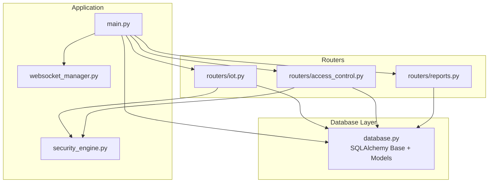
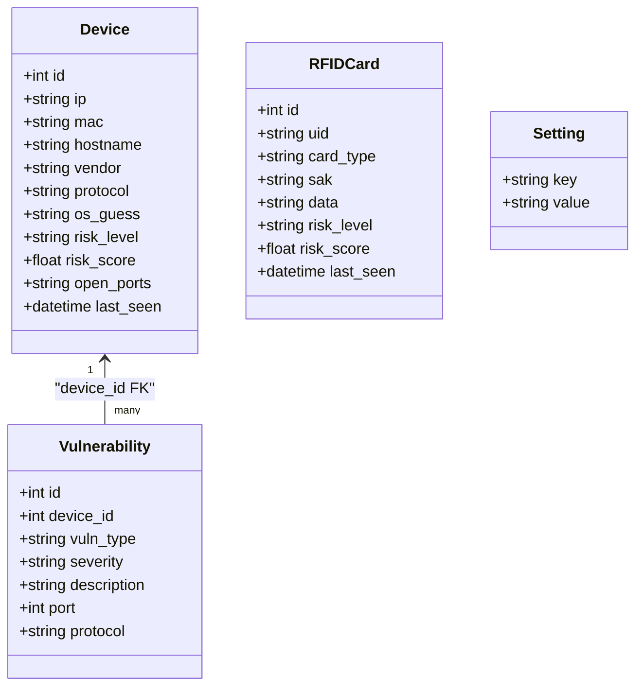
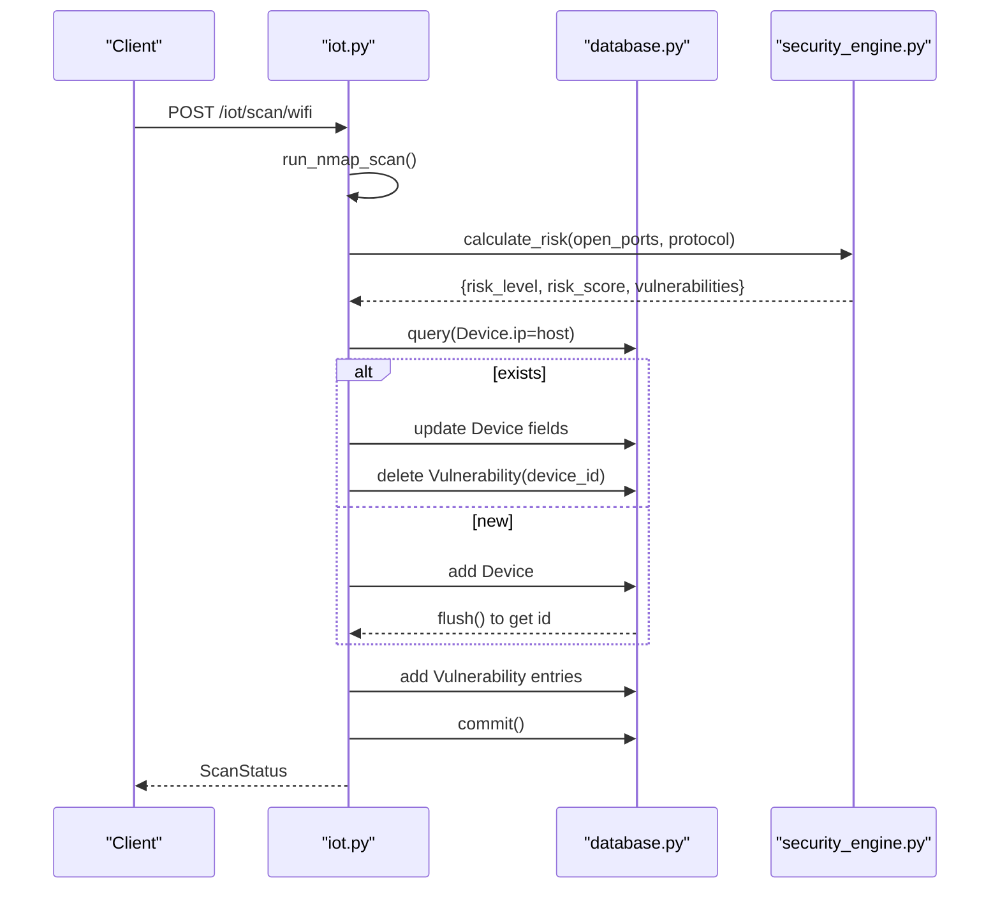
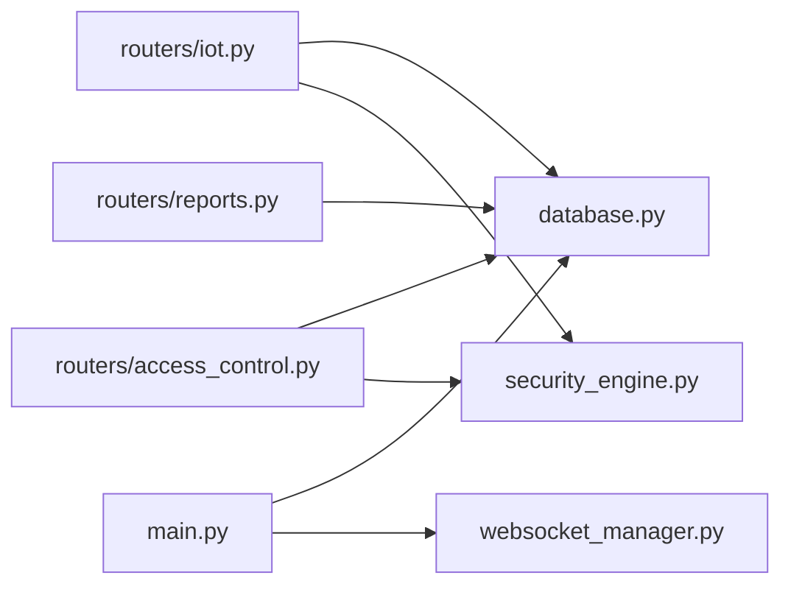

# Database Schema

<cite>
**Referenced Files in This Document**
- [database.py](file://backend/database.py)
- [models.py](file://backend/models.py)
- [main.py](file://backend/main.py)
- [iot.py](file://backend/routers/iot.py)
- [access_control.py](file://backend/routers/access_control.py)
- [reports.py](file://backend/routers/reports.py)
- [websocket_manager.py](file://backend/websocket_manager.py)
- [security_engine.py](file://backend/security_engine.py)
- [requirements.txt](file://backend/requirements.txt)
</cite>

## Table of Contents
1. [Introduction](#introduction)
2. [Project Structure](#project-structure)
3. [Core Components](#core-components)
4. [Architecture Overview](#architecture-overview)
5. [Detailed Component Analysis](#detailed-component-analysis)
6. [Dependency Analysis](#dependency-analysis)
7. [Performance Considerations](#performance-considerations)
8. [Troubleshooting Guide](#troubleshooting-guide)
9. [Conclusion](#conclusion)
10. [Appendices](#appendices)

## Introduction
This document provides comprehensive data model documentation for PentexOne’s SQLite-backed database schema. It covers entity definitions, relationships, indexes, constraints, validation rules, and business logic enforcement. It also documents data access patterns using SQLAlchemy ORM, query optimization strategies, performance considerations, lifecycle management, migration and backup strategies, and security and privacy controls.

## Project Structure
The database schema is defined in a single module and consumed by multiple routers and services:
- Database models and engine initialization are defined centrally.
- Routers orchestrate scans, persist data, and expose read APIs.
- Security and AI engines compute risk and enrich data.
- Reports consume persisted data to generate summaries and PDFs.

**Diagram sources**
- [main.py:14-48](file://backend/main.py#L14-L48)
- [database.py:1-80](file://backend/database.py#L1-L80)
- [iot.py:1-80](file://backend/routers/iot.py#L1-L80)
- [access_control.py:1-95](file://backend/routers/access_control.py#L1-L95)
- [reports.py:1-158](file://backend/routers/reports.py#L1-L158)
- [websocket_manager.py:1-48](file://backend/websocket_manager.py#L1-L48)

**Section sources**
- [main.py:14-48](file://backend/main.py#L14-L48)
- [database.py:1-80](file://backend/database.py#L1-L80)

## Core Components
This section documents the four core entities and their relationships.

- Device
  - Purpose: Represents an IoT device discovered on the network.
  - Fields: id (primary key), ip (unique), mac, hostname, vendor, protocol, os_guess, risk_level, risk_score, open_ports, last_seen.
  - Indexes: id, ip.
  - Constraints: ip is unique; defaults applied for several fields; risk_level constrained to a small set by business logic.
  - Relationship: One-to-many with Vulnerability via device_id foreign key.

- Vulnerability
  - Purpose: Stores discovered vulnerabilities per device.
  - Fields: id (primary key), device_id (foreign key to Device), vuln_type, severity, description, port (nullable), protocol (nullable).
  - Indexes: id.
  - Constraints: severity constrained by business logic; port and protocol optional.
  - Relationship: Many-to-one with Device.

- RFIDCard
  - Purpose: Stores RFID/NFC tag data and risk assessment.
  - Fields: id (primary key), uid (unique), card_type, sak, data, risk_level, risk_score, last_seen.
  - Indexes: id, uid.
  - Constraints: uid is unique; defaults applied; risk_level constrained by business logic.
  - No foreign key relationships.

- Setting
  - Purpose: Stores runtime configuration key-value pairs.
  - Fields: key (primary key), value.
  - Indexes: key.
  - Constraints: key is primary key; used to store flags like simulation_mode and nmap_timeout.

Entity relationships and ownership:
- Device has a collection of Vulnerability entries (one-to-many).
- RFIDCard and Setting are standalone entities.

**Section sources**
- [database.py:12-61](file://backend/database.py#L12-L61)

## Architecture Overview
The database layer is initialized at startup and exposed to routers via a shared engine and session factory. Routers perform CRUD operations, enforce business rules, and broadcast live updates via WebSockets.

**Diagram sources**
- [database.py:12-61](file://backend/database.py#L12-L61)

**Section sources**
- [database.py:12-61](file://backend/database.py#L12-L61)

## Detailed Component Analysis

### Device Entity
- Data types and defaults:
  - ip: String (unique), default Unknown.
  - mac, hostname, vendor, protocol, os_guess: String (defaults).
  - risk_level: String (default UNKNOWN), constrained to SAFE/MEDIUM/RISK/UNKNOWN by business logic.
  - risk_score: Float (default 0.0).
  - open_ports: String (comma-separated list), default empty.
  - last_seen: DateTime (default current UTC).
- Indexes: id, ip.
- Constraints: ip uniqueness enforced at DB level.
- Business logic:
  - Risk level and score computed by security engine and updated on each discovery/update.
  - open_ports normalized as a comma-separated string.

**Section sources**
- [database.py:12-27](file://backend/database.py#L12-L27)
- [security_engine.py:202-339](file://backend/security_engine.py#L202-L339)

### Vulnerability Entity
- Data types and defaults:
  - device_id: Integer (foreign key to Device).
  - vuln_type, severity, description: String.
  - port: Integer (nullable), protocol: String (nullable).
- Indexes: id.
- Constraints: severity constrained to LOW/MEDIUM/HIGH/CRITICAL by business logic; port/protocol optional.
- Ownership: Vulnerability belongs to a Device; cascades with deletion on device removal.

**Section sources**
- [database.py:30-41](file://backend/database.py#L30-L41)
- [security_engine.py:202-339](file://backend/security_engine.py#L202-L339)

### RFIDCard Entity
- Data types and defaults:
  - uid: String (unique), card_type, sak, data: String (defaults), risk_level: String (default UNKNOWN), risk_score: Float (default 0.0), last_seen: DateTime (default current UTC).
- Indexes: id, uid.
- Constraints: uid uniqueness enforced at DB level; risk_level constrained by business logic.

**Section sources**
- [database.py:44-55](file://backend/database.py#L44-L55)

### Setting Entity
- Data types and defaults:
  - key: String (primary key), value: String.
- Indexes: key.
- Constraints: key uniqueness enforced at DB level.
- Initialization: On first run, default settings are inserted if missing.

**Section sources**
- [database.py:56-80](file://backend/database.py#L56-L80)

### Data Access Patterns and ORM Usage
- Engine and session:
  - SQLite engine configured with a URL pointing to a local file.
  - Session factory bound to the engine; dependency injection supplies sessions to endpoints.
- CRUD patterns:
  - Create: Insert new records (e.g., Device, Vulnerability, RFIDCard).
  - Read: Query by filters (e.g., Device.ip, RFIDCard.uid), order by last_seen or risk_score.
  - Update: Upsert-like behavior (find-or-create) followed by commit.
  - Delete: Clear all records for bulk cleanup.
- Relationships:
  - Device.vulnerabilities is a relationship populated by SQLAlchemy.
- Example flows:
  - Wi-Fi scan: Discover hosts, compute risk, upsert Device, delete old Vulnerabilities, insert new ones, commit.
  - RFID scan: Compute risk, upsert RFIDCard, commit.

**Diagram sources**
- [iot.py:291-413](file://backend/routers/iot.py#L291-L413)
- [database.py:12-41](file://backend/database.py#L12-L41)
- [security_engine.py:202-339](file://backend/security_engine.py#L202-L339)

**Section sources**
- [database.py:62-80](file://backend/database.py#L62-L80)
- [iot.py:291-413](file://backend/routers/iot.py#L291-L413)
- [access_control.py:47-84](file://backend/routers/access_control.py#L47-L84)

### Data Validation Rules and Business Logic Enforcement
- Risk calculation:
  - Port-based risk mapped to critical/medium/high/critical weights.
  - Default credentials, firmware CVEs, TLS issues, and protocol-specific flags contribute to score.
  - Final risk_level capped at SAFE/MEDIUM/RISK based on thresholds.
- Data normalization:
  - open_ports stored as comma-separated integers.
  - last_seen updated on each discovery.
- Constraint enforcement:
  - Unique constraints on ip (Device) and uid (RFIDCard).
  - Foreign key constraint on Vulnerability.device_id.
  - String enums for risk_level and severity constrained by business logic.

**Section sources**
- [security_engine.py:16-339](file://backend/security_engine.py#L16-L339)
- [database.py:12-55](file://backend/database.py#L12-L55)

### Sample Data Structures
Representative rows for each table (descriptive only):
- Device: id=1, ip="192.168.1.100", mac="AA:BB:CC:DD:EE:FF", hostname="printer", vendor="HP", protocol="Wi-Fi", os_guess="Linux", risk_level="RISK", risk_score=85.5, open_ports="22,80,443", last_seen="2025-01-01T12:00:00Z".
- Vulnerability: id=101, device_id=1, vuln_type="OPEN_TELNET", severity="CRITICAL", description="Telnet open", port=23, protocol="TCP".
- RFIDCard: id=201, uid="04:A1:B2:C3:D4:E5:F6", card_type="Mifare Classic 1K", sak="", data="", risk_level="RISK", risk_score=92.0, last_seen="2025-01-01T12:05:00Z".
- Setting: key="simulation_mode", value="true".

[No sources needed since this subsection describes representative structures conceptually]

## Dependency Analysis
- Internal dependencies:
  - Routers depend on database models and the session factory.
  - Security engine computes risk used by routers to populate Device and Vulnerability.
  - Reports depend on Device and Vulnerability for summaries and PDF generation.
- External dependencies:
  - SQLAlchemy ORM for database abstraction.
  - python-nmap for Wi-Fi scanning.
  - Optional hardware libraries for Zigbee/Thread/Z-Wave/LoRaWAN.

**Diagram sources**
- [iot.py:1-24](file://backend/routers/iot.py#L1-L24)
- [access_control.py:1-13](file://backend/routers/access_control.py#L1-L13)
- [reports.py:1-15](file://backend/routers/reports.py#L1-L15)
- [database.py:1-9](file://backend/database.py#L1-L9)
- [main.py:14-18](file://backend/main.py#L14-L18)
- [websocket_manager.py:1-48](file://backend/websocket_manager.py#L1-L48)

**Section sources**
- [requirements.txt:1-21](file://backend/requirements.txt#L1-L21)
- [database.py:1-9](file://backend/database.py#L1-L9)

## Performance Considerations
- Indexing strategy:
  - Primary key indexes on id are implicit.
  - Explicit indexes on ip (Device) and uid (RFIDCard) optimize lookups.
- Query patterns:
  - Frequent lookups by ip/uid and ordering by last_seen/risk_score benefit from indexes.
  - Bulk deletes before inserts reduce orphan rows and improve consistency.
- Concurrency:
  - SQLite used with a single-threaded engine; avoid heavy concurrent writes.
  - Use short-lived sessions per request and commit promptly.
- Scanning pipeline:
  - Batch commits after inserting/updating multiple rows to minimize overhead.
  - Use flush() to obtain generated ids when needed.

[No sources needed since this section provides general guidance]

## Troubleshooting Guide
- Database initialization:
  - Ensure init_db() runs at startup to create tables and seed default settings.
- Session lifecycle:
  - Always close sessions after use; dependency injection ensures proper teardown.
- Integrity errors:
  - Unique violations on ip or uid indicate conflicting data; handle gracefully in routers.
- Live updates:
  - WebSocket broadcasts occur during scans; verify manager is attached to app and connections are accepted.

**Section sources**
- [database.py:62-80](file://backend/database.py#L62-L80)
- [main.py:20-21](file://backend/main.py#L20-L21)
- [websocket_manager.py:7-47](file://backend/websocket_manager.py#L7-L47)

## Conclusion
PentexOne’s SQLite schema is intentionally simple and aligned with the application’s scanning and reporting workflows. The Device-Vulnerability relationship captures per-device risk and vulnerability details, while RFIDCard and Setting support complementary features. Business logic is centralized in the security engine and enforced at write-time. With appropriate indexing and careful session management, the schema supports efficient reads and writes for typical usage patterns.

[No sources needed since this section summarizes without analyzing specific files]

## Appendices

### A. Field Reference and Constraints
- Device
  - id: Integer, PK, indexed.
  - ip: String, unique, indexed.
  - mac, hostname, vendor, protocol, os_guess: String, defaults.
  - risk_level: String, default UNKNOWN; constrained by business logic.
  - risk_score: Float, default 0.0.
  - open_ports: String, default "".
  - last_seen: DateTime, default current UTC.
- Vulnerability
  - id: Integer, PK, indexed.
  - device_id: Integer, FK(Device.id).
  - vuln_type, severity, description: String.
  - port: Integer, nullable.
  - protocol: String, nullable.
- RFIDCard
  - id: Integer, PK, indexed.
  - uid: String, unique, indexed.
  - card_type, sak, data: String, defaults.
  - risk_level: String, default UNKNOWN; constrained by business logic.
  - risk_score: Float, default 0.0.
  - last_seen: DateTime, default current UTC.
- Setting
  - key: String, PK, indexed.
  - value: String.

**Section sources**
- [database.py:12-61](file://backend/database.py#L12-L61)

### B. Data Lifecycle Management
- Retention:
  - No automatic retention policies are implemented; data persists until explicitly cleared.
- Archival:
  - Not implemented; consider exporting reports and periodically backing up the SQLite file.
- Cleanup:
  - Bulk delete endpoints exist for devices and RFID cards.

**Section sources**
- [iot.py:614-619](file://backend/routers/iot.py#L614-L619)
- [access_control.py:90-94](file://backend/routers/access_control.py#L90-L94)

### C. Migration and Version Management
- Current state:
  - Single SQLite file; no formal migrations.
- Recommended approach:
  - Introduce Alembic for migrations.
  - Maintain a version table or use metadata versioning.
  - Backward-compatible schema changes only.

[No sources needed since this section provides general guidance]

### D. Backup Strategies
- File-level backup:
  - Copy pentex.db regularly; ensure application is idle or stopped during backup.
- Hot backup:
  - Use SQLite online backup API for minimal downtime.
- Offsite storage:
  - Store backups in secure, offsite locations.

[No sources needed since this section provides general guidance]

### E. Security and Privacy Controls
- Authentication:
  - Basic credential check endpoint exists; configure strong credentials via environment variables.
- Authorization:
  - No role-based access control; protect endpoints behind a reverse proxy with HTTPS and authentication.
- Data protection:
  - Restrict filesystem access to pentex.db.
  - Sanitize exported reports; avoid embedding sensitive device details unless required.
- Transport:
  - Use HTTPS in production; consider a reverse proxy with TLS termination.

**Section sources**
- [main.py:23-32](file://backend/main.py#L23-L32)
- [README.md:308-335](file://backend/README.md#L308-L335)