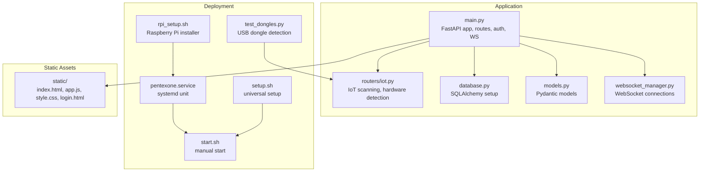
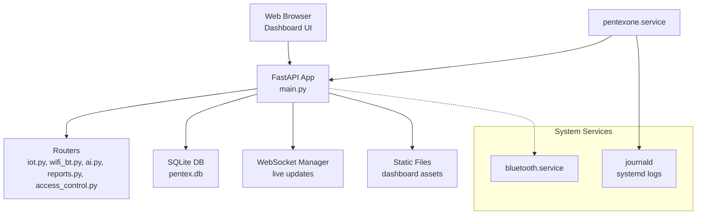
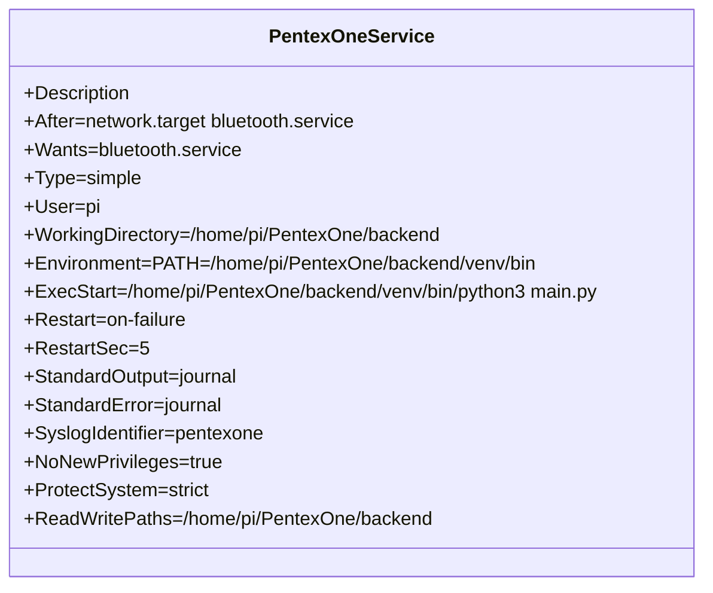
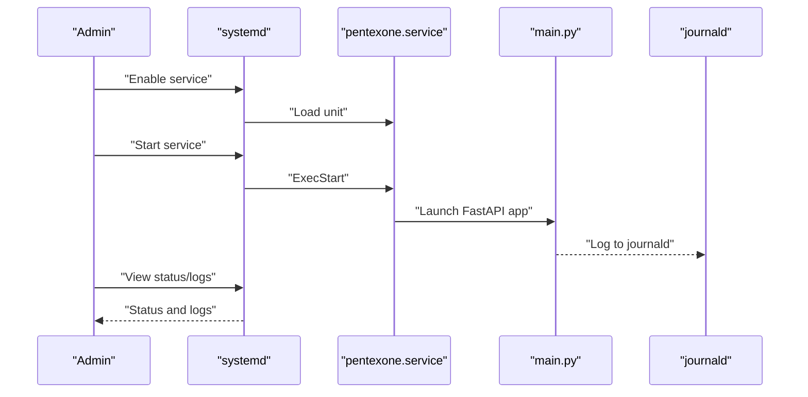
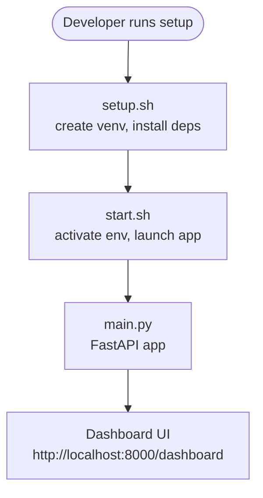
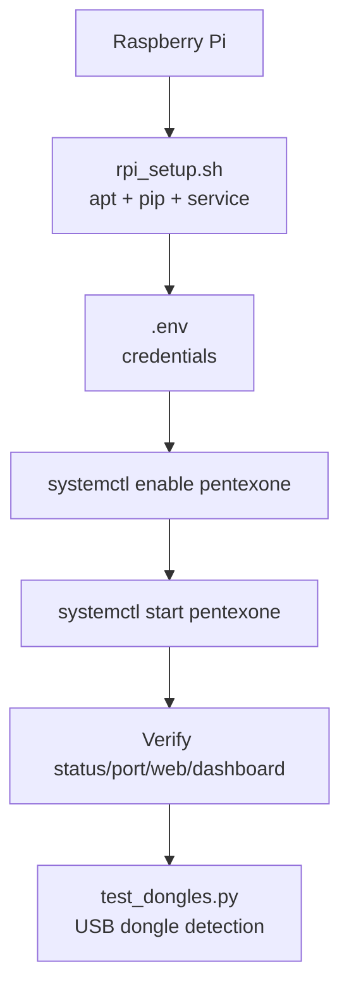
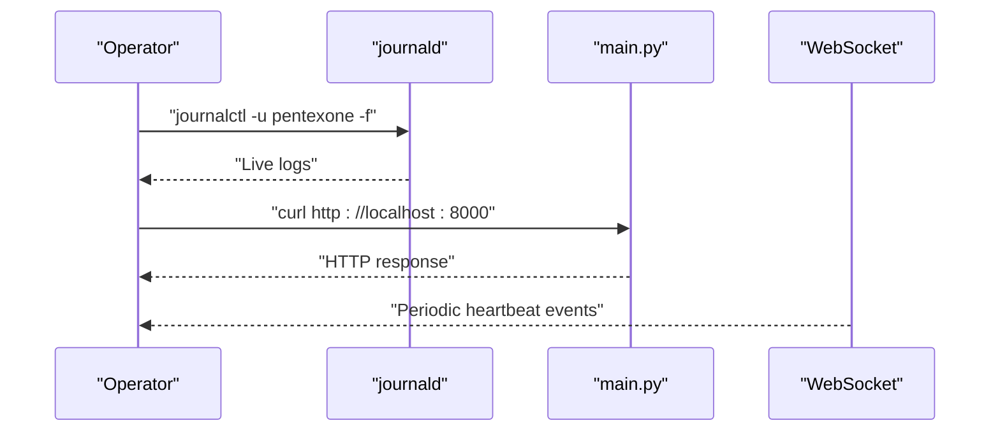
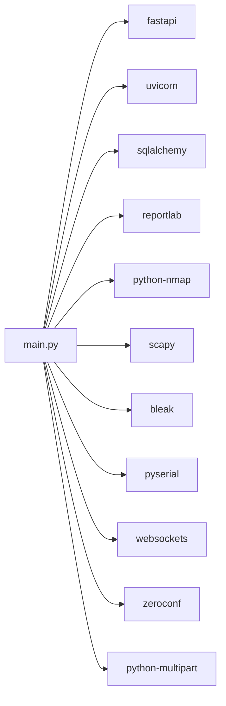

# Deployment Guide

<cite>
**Referenced Files in This Document**
- [backend/README.md](file://backend/README.md)
- [backend/DEPLOYMENT_CHECKLIST.md](file://backend/DEPLOYMENT_CHECKLIST.md)
- [backend/RASPBERRY_PI_GUIDE.md](file://backend/RASPBERRY_PI_GUIDE.md)
- [backend/HARDWARE_GUIDE.md](file://backend/HARDWARE_GUIDE.md)
- [backend/QUICK_REFERENCE.md](file://backend/QUICK_REFERENCE.md)
- [backend/pentexone.service](file://backend/pentexone.service)
- [backend/setup.sh](file://backend/setup.sh)
- [backend/rpi_setup.sh](file://backend/rpi_setup.sh)
- [backend/start.sh](file://backend/start.sh)
- [backend/test_dongles.py](file://backend/test_dongles.py)
- [backend/main.py](file://backend/main.py)
- [backend/requirements.txt](file://backend/requirements.txt)
- [backend/routers/iot.py](file://backend/routers/iot.py)
</cite>

## Table of Contents
1. [Introduction](#introduction)
2. [Project Structure](#project-structure)
3. [Core Components](#core-components)
4. [Architecture Overview](#architecture-overview)
5. [Detailed Component Analysis](#detailed-component-analysis)
6. [Dependency Analysis](#dependency-analysis)
7. [Performance Considerations](#performance-considerations)
8. [Troubleshooting Guide](#troubleshooting-guide)
9. [Conclusion](#conclusion)
10. [Appendices](#appendices)

## Introduction
This document provides a comprehensive deployment guide for the PentexOne IoT Security Platform across development and production environments. It covers local development, Raspberry Pi deployment, and cloud-based installations. It also documents systemd service configuration, process management, auto-start setup, security hardening, firewall configuration, monitoring, logging, health checks, scaling, load balancing, high availability, backup and disaster recovery, and maintenance schedules.

## Project Structure
The backend is organized around a FastAPI application with modular routers, a database layer, and supporting scripts for setup and deployment. Key elements include:
- Application entry point and routing
- Environment configuration and authentication
- Hardware detection and dongle testing
- Systemd service definition for production
- Setup and deployment automation scripts

**Diagram sources**
- [backend/main.py:1-106](file://backend/main.py#L1-L106)
- [backend/routers/iot.py:1-200](file://backend/routers/iot.py#L1-L200)
- [backend/pentexone.service:1-25](file://backend/pentexone.service#L1-L25)
- [backend/setup.sh:1-142](file://backend/setup.sh#L1-L142)
- [backend/rpi_setup.sh:1-139](file://backend/rpi_setup.sh#L1-L139)
- [backend/start.sh:1-38](file://backend/start.sh#L1-L38)
- [backend/test_dongles.py:1-152](file://backend/test_dongles.py#L1-L152)

**Section sources**
- [backend/README.md:273-306](file://backend/README.md#L273-L306)
- [backend/main.py:1-106](file://backend/main.py#L1-L106)
- [backend/routers/iot.py:1-200](file://backend/routers/iot.py#L1-L200)

## Core Components
- FastAPI application with CORS middleware and static file serving for the dashboard
- Modular routers for IoT scanning, AI analysis, Wi-Fi/Bluetooth, access control, and reports
- Authentication via environment variables for username and password
- WebSocket endpoint for live updates
- Database initialization and settings management
- Hardware detection utilities for Zigbee, Thread/Matter, Z-Wave, and Bluetooth adapters

Key deployment artifacts:
- Systemd service unit for production auto-start and logging
- Setup scripts for universal and Raspberry Pi environments
- Utility script for dongle detection and validation

**Section sources**
- [backend/main.py:1-106](file://backend/main.py#L1-L106)
- [backend/requirements.txt:1-21](file://backend/requirements.txt#L1-L21)
- [backend/pentexone.service:1-25](file://backend/pentexone.service#L1-L25)
- [backend/setup.sh:1-142](file://backend/setup.sh#L1-L142)
- [backend/rpi_setup.sh:1-139](file://backend/rpi_setup.sh#L1-L139)
- [backend/start.sh:1-38](file://backend/start.sh#L1-L38)
- [backend/test_dongles.py:1-152](file://backend/test_dongles.py#L1-L152)

## Architecture Overview
PentexOne runs as a FastAPI application exposing REST endpoints and a WebSocket for live updates. It integrates with system services for Bluetooth and hardware scanning, and uses a SQLite database for persistence. The systemd service ensures reliable startup and logging.

**Diagram sources**
- [backend/main.py:1-106](file://backend/main.py#L1-L106)
- [backend/routers/iot.py:1-200](file://backend/routers/iot.py#L1-L200)
- [backend/pentexone.service:1-25](file://backend/pentexone.service#L1-L25)

## Detailed Component Analysis

### Systemd Service Configuration
The systemd unit defines:
- Startup after network and Bluetooth services
- Simple service type with a dedicated user and working directory
- Environment isolation and restricted paths
- Logging to journald with syslog identifier
- Automatic restart on failure

**Diagram sources**
- [backend/pentexone.service:1-25](file://backend/pentexone.service#L1-L25)

**Section sources**
- [backend/pentexone.service:1-25](file://backend/pentexone.service#L1-L25)
- [backend/RASPBERRY_PI_GUIDE.md:215-237](file://backend/RASPBERRY_PI_GUIDE.md#L215-L237)

### Process Management and Auto-Start
- Manual start for development/testing
- Systemd service for production auto-start
- Status and log viewing via journalctl
- Enabling/disabling auto-start

**Diagram sources**
- [backend/pentexone.service:1-25](file://backend/pentexone.service#L1-L25)
- [backend/start.sh:1-38](file://backend/start.sh#L1-L38)
- [backend/RASPBERRY_PI_GUIDE.md:267-281](file://backend/RASPBERRY_PI_GUIDE.md#L267-L281)

**Section sources**
- [backend/start.sh:1-38](file://backend/start.sh#L1-L38)
- [backend/RASPBERRY_PI_GUIDE.md:215-237](file://backend/RASPBERRY_PI_GUIDE.md#L215-L237)
- [backend/QUICK_REFERENCE.md:37-61](file://backend/QUICK_REFERENCE.md#L37-L61)

### Local Development Setup
- Universal setup script creates a virtual environment, installs dependencies, verifies Python files, and prepares directories
- Raspberry Pi installer additionally configures system packages, Bluetooth, and systemd service
- Quick start script activates the environment and launches the app

**Diagram sources**
- [backend/setup.sh:1-142](file://backend/setup.sh#L1-L142)
- [backend/start.sh:1-38](file://backend/start.sh#L1-L38)
- [backend/main.py:103-106](file://backend/main.py#L103-L106)

**Section sources**
- [backend/README.md:67-117](file://backend/README.md#L67-L117)
- [backend/README.md:120-149](file://backend/README.md#L120-L149)
- [backend/setup.sh:1-142](file://backend/setup.sh#L1-L142)
- [backend/start.sh:1-38](file://backend/start.sh#L1-L38)

### Raspberry Pi Deployment
- One-command installer for Raspberry Pi sets up system dependencies, Python virtual environment, Bluetooth, and systemd service
- Post-install verification includes service status, port listening, web access, and hardware detection
- Optional HTTPS via reverse proxy and SSL/TLS

**Diagram sources**
- [backend/rpi_setup.sh:1-139](file://backend/rpi_setup.sh#L1-L139)
- [backend/test_dongles.py:1-152](file://backend/test_dongles.py#L1-L152)
- [backend/RASPBERRY_PI_GUIDE.md:44-83](file://backend/RASPBERRY_PI_GUIDE.md#L44-L83)

**Section sources**
- [backend/RASPBERRY_PI_GUIDE.md:44-83](file://backend/RASPBERRY_PI_GUIDE.md#L44-L83)
- [backend/RASPBERRY_PI_GUIDE.md:87-213](file://backend/RASPBERRY_PI_GUIDE.md#L87-L213)
- [backend/RASPBERRY_PI_GUIDE.md:215-262](file://backend/RASPBERRY_PI_GUIDE.md#L215-L262)
- [backend/RASPBERRY_PI_GUIDE.md:531-578](file://backend/RASPBERRY_PI_GUIDE.md#L531-L578)

### Cloud-Based Installations
- Use the universal setup script for non-Raspberry Pi systems
- Ensure system dependencies (nmap, bluez) are installed
- Deploy behind a reverse proxy (nginx) with HTTPS termination
- Configure environment variables for credentials and runtime settings

**Section sources**
- [backend/README.md:318-328](file://backend/README.md#L318-L328)
- [backend/RASPBERRY_PI_GUIDE.md:550-578](file://backend/RASPBERRY_PI_GUIDE.md#L550-L578)

### Security Hardening and Firewall
- Change default credentials immediately
- Enable UFW and allow only necessary ports (SSH, application)
- Prefer SSH key-based authentication and disable password login
- Keep the system updated and apply security patches regularly

**Section sources**
- [backend/README.md:308-328](file://backend/README.md#L308-L328)
- [backend/HARDWARE_GUIDE.md:343-376](file://backend/HARDWARE_GUIDE.md#L343-L376)
- [backend/DEPLOYMENT_CHECKLIST.md:115-138](file://backend/DEPLOYMENT_CHECKLIST.md#L115-L138)

### Monitoring, Logs, and Health Checks
- View logs with journalctl for the service
- Monitor system resources (CPU, memory, disk, temperature)
- Health check via local curl to the dashboard endpoint
- WebSocket heartbeat for connection stability

**Diagram sources**
- [backend/RASPBERRY_PI_GUIDE.md:267-281](file://backend/RASPBERRY_PI_GUIDE.md#L267-L281)
- [backend/main.py:90-102](file://backend/main.py#L90-L102)

**Section sources**
- [backend/RASPBERRY_PI_GUIDE.md:267-297](file://backend/RASPBERRY_PI_GUIDE.md#L267-L297)
- [backend/QUICK_REFERENCE.md:63-89](file://backend/QUICK_REFERENCE.md#L63-L89)
- [backend/main.py:90-102](file://backend/main.py#L90-L102)

### Scaling, Load Balancing, and High Availability
- Horizontal scaling: deploy multiple instances behind a reverse proxy
- Use sticky sessions if stateful sessions are required; otherwise rely on shared database
- Implement health checks at the reverse proxy level
- For high availability, pair with a load balancer and shared storage for reports

[No sources needed since this section provides general guidance]

### Backup and Disaster Recovery
- Schedule regular backups of the database, environment file, and generated reports
- Automate backups with cron or systemd timers
- Test restore procedures periodically
- Store backups offsite or in a secure remote location

**Section sources**
- [backend/DEPLOYMENT_CHECKLIST.md:163-175](file://backend/DEPLOYMENT_CHECKLIST.md#L163-L175)
- [backend/RASPBERRY_PI_GUIDE.md:360-400](file://backend/RASPBERRY_PI_GUIDE.md#L360-L400)

### Maintenance Schedule
- Weekly: review logs for errors
- Monthly: update system packages and application
- Quarterly: rotate credentials and test backup restoration
- Annually: inspect hardware and clean dust from heat sinks/fans

**Section sources**
- [backend/DEPLOYMENT_CHECKLIST.md:242-248](file://backend/DEPLOYMENT_CHECKLIST.md#L242-L248)

## Dependency Analysis
The application depends on FastAPI, Uvicorn, Nmap, Scapy, Bleak, PySerial, SQLAlchemy, ReportLab, and optional libraries for Zigbee and TLS validation. The setup scripts ensure these dependencies are installed in a virtual environment and on Raspberry Pi systems.

**Diagram sources**
- [backend/requirements.txt:1-21](file://backend/requirements.txt#L1-L21)
- [backend/main.py:1-106](file://backend/main.py#L1-L106)

**Section sources**
- [backend/requirements.txt:1-21](file://backend/requirements.txt#L1-L21)
- [backend/setup.sh:27-52](file://backend/setup.sh#L27-L52)

## Performance Considerations
- Use Ethernet over Wi-Fi for stability and throughput
- Disable unused services and desktop components for headless operation
- Add swap space for systems with limited RAM
- Use a powered USB hub for multiple dongles
- Optimize GPU memory allocation for Raspberry Pi models

**Section sources**
- [backend/HARDWARE_GUIDE.md:312-340](file://backend/HARDWARE_GUIDE.md#L312-L340)
- [backend/README.md:385-401](file://backend/README.md#L385-L401)

## Troubleshooting Guide
Common issues and resolutions:
- Service won’t start: check logs, verify port availability, reinstall dependencies, fix permissions
- Cannot access dashboard: confirm service status, firewall rules, and local connectivity
- USB dongle not detected: list devices, check kernel messages, adjust permissions, reboot
- Bluetooth issues: restart service, unblock hardware, reinstall BlueZ if needed
- Wi-Fi scanning problems: ensure interface is free, toggle Wi-Fi via network manager
- Database issues: backup before reset, recreate database with initialization routine
- Performance issues: monitor resources, add swap, reduce GPU memory on Raspberry Pi

**Section sources**
- [backend/RASPBERRY_PI_GUIDE.md:402-526](file://backend/RASPBERRY_PI_GUIDE.md#L402-L526)
- [backend/QUICK_REFERENCE.md:63-89](file://backend/QUICK_REFERENCE.md#L63-L89)

## Conclusion
This guide outlines a robust deployment strategy for PentexOne across development and production environments. By leveraging systemd for process management, following security hardening practices, implementing monitoring and backups, and applying performance optimizations, operators can maintain a reliable and secure IoT security auditing platform.

[No sources needed since this section summarizes without analyzing specific files]

## Appendices

### A. Hardware Preparation and Optimization
- Recommended hardware configurations and dongle compatibility
- Physical setup steps and performance tuning for Raspberry Pi
- Security recommendations for headless deployments

**Section sources**
- [backend/HARDWARE_GUIDE.md:1-399](file://backend/HARDWARE_GUIDE.md#L1-L399)

### B. Quick Reference
- One-line setup and service management commands
- Access points and default credentials reminder
- Essential files and directories

**Section sources**
- [backend/QUICK_REFERENCE.md:1-180](file://backend/QUICK_REFERENCE.md#L1-L180)

### C. Deployment Checklist
- Pre-installation, installation, post-installation, security, performance, backup, and readiness checklists

**Section sources**
- [backend/DEPLOYMENT_CHECKLIST.md:1-312](file://backend/DEPLOYMENT_CHECKLIST.md#L1-L312)