# Frontend Dashboard

<cite>
**Referenced Files in This Document**
- [index.html](file://backend/static/index.html)
- [app.js](file://backend/static/app.js)
- [style.css](file://backend/static/style.css)
- [login.html](file://backend/static/login.html)
- [main.py](file://backend/main.py)
- [websocket_manager.py](file://backend/websocket_manager.py)
- [ai.py](file://backend/routers/ai.py)
- [ai_engine.py](file://backend/ai_engine.py)
- [iot.py](file://backend/routers/iot.py)
- [wifi_bt.py](file://backend/routers/wifi_bt.py)
- [access_control.py](file://backend/routers/access_control.py)
- [reports.py](file://backend/routers/reports.py)
</cite>

## Update Summary
**Changes Made**
- Enhanced responsive design with mobile menu system featuring off-canvas drawer and overlay
- Implemented touch screen optimizations with larger touch targets and gesture support
- Added lightweight mode performance adaptations for Raspberry Pi and low-power devices
- Updated statistics grid layouts with responsive breakpoints for all screen sizes
- Improved device table responsiveness with horizontal scrolling and touch-friendly interactions
- Optimized chart performance with reduced animations and visual effects for lightweight mode
- Added landscape phone optimization for better vertical space utilization

## Table of Contents
1. [Introduction](#introduction)
2. [Project Structure](#project-structure)
3. [Core Components](#core-components)
4. [Architecture Overview](#architecture-overview)
5. [Detailed Component Analysis](#detailed-component-analysis)
6. [Dependency Analysis](#dependency-analysis)
7. [Performance Considerations](#performance-considerations)
8. [Troubleshooting Guide](#troubleshooting-guide)
9. [Conclusion](#conclusion)
10. [Appendices](#appendices)

## Introduction
This document describes the modern web dashboard interface for PentexOne, a security auditing platform for IoT ecosystems. The dashboard features enhanced responsive design with mobile-first approach, touch screen optimizations, and lightweight mode performance adaptations. It covers the dark theme design, adaptive layouts across all device types, real-time updates via WebSocket, and analytics powered by Chart.js. The implementation includes AI-powered security analysis, collapsible navigation, toast notifications, and performance-optimized visualizations.

## Project Structure
The dashboard is a progressive web application served by the backend FastAPI application. The frontend assets (HTML, JS, CSS) are served under the `/dashboard` route, while the backend exposes REST APIs and a WebSocket endpoint for live events. The AI engine provides intelligent security analysis and recommendations with performance optimizations for resource-constrained devices.

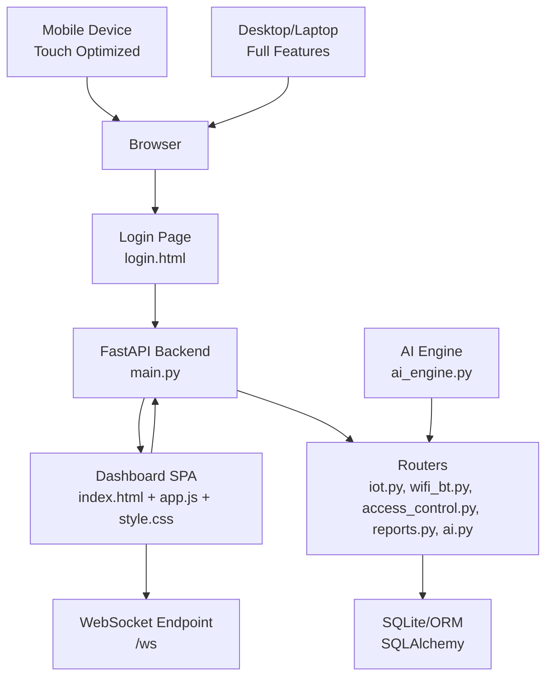
```mermaid
graph TB
Browser["Browser"]
Mobile["Mobile Device<br/>Touch Optimized"]
Desktop["Desktop/Laptop<br/>Full Features"]
Login["Login Page<br/>login.html"]
Dashboard["Dashboard SPA<br/>index.html + app.js + style.css"]
AIEngine["AI Engine<br/>ai_engine.py"]
API["FastAPI Backend<br/>main.py"]
WS["WebSocket Endpoint<br/>/ws"]
Routers["Routers<br/>iot.py, wifi_bt.py, access_control.py, reports.py, ai.py"]
DB["SQLite/ORM<br/>SQLAlchemy"]
Mobile --> Browser
Desktop --> Browser
Browser --> Login
Login --> API
API --> Dashboard
Dashboard --> API
Dashboard --> WS
API --> Routers
Routers --> DB
AIEngine --> Routers
```

**Diagram sources**
- [main.py:68](file://backend/main.py#L68)
- [index.html:1](file://backend/static/index.html#L1)
- [app.js:1](file://backend/static/app.js#L1)
- [style.css:1](file://backend/static/style.css#L1)
- [ai_engine.py:1](file://backend/ai_engine.py#L1)
- [iot.py:24](file://backend/routers/iot.py#L24)
- [wifi_bt.py:27](file://backend/routers/wifi_bt.py#L27)
- [access_control.py:13](file://backend/routers/access_control.py#L13)
- [reports.py:15](file://backend/routers/reports.py#L15)

**Section sources**
- [main.py:68](file://backend/main.py#L68)
- [index.html:1](file://backend/static/index.html#L1)
- [app.js:1](file://backend/static/app.js#L1)
- [style.css:1](file://backend/static/style.css#L1)

## Core Components
- **Enhanced Responsive Design**: Mobile-first approach with off-canvas sidebar, touch-optimized layouts, and adaptive breakpoints
- **Mobile Menu System**: Hamburger menu with overlay, smooth animations, and automatic closing on navigation
- **Touch Screen Optimizations**: Large touch targets, gesture support, and visual feedback for mobile users
- **Lightweight Mode**: Automatic performance adaptation for Raspberry Pi and low-power devices with reduced animations
- **Adaptive Statistics Grid**: Responsive grid layout that adapts from 4 columns on desktop to single column on phones
- **Optimized Device Tables**: Horizontal scrolling for narrow screens, touch-friendly row selection, and reduced visual complexity
- **Performance-Optimized Charts**: Reduced animations and visual effects in lightweight mode for better performance
- **Real-time Updates**: WebSocket integration with heartbeat mechanism and automatic reconnection
- **AI-Powered Features**: Intelligent security recommendations with performance-conscious rendering
- **Glass Morphism Design**: Modern dark theme with backdrop filters and glass-like panels

**Section sources**
- [style.css:1](file://backend/static/style.css#L1)
- [index.html:22](file://backend/static/index.html#L22)
- [app.js:421](file://backend/static/app.js#L421)
- [style.css:1264](file://backend/static/style.css#L1264)
- [style.css:1317](file://backend/static/style.css#L1317)

## Architecture Overview
The dashboard initializes on DOMContentLoaded, detects device capabilities for lightweight mode, sets up Chart.js instances, connects to the WebSocket, and loads initial data including AI recommendations. Background scans emit events over WebSocket, which the client consumes to update UI state and toast notifications. The AI engine provides intelligent analysis and recommendations based on device characteristics and network patterns with performance optimizations.

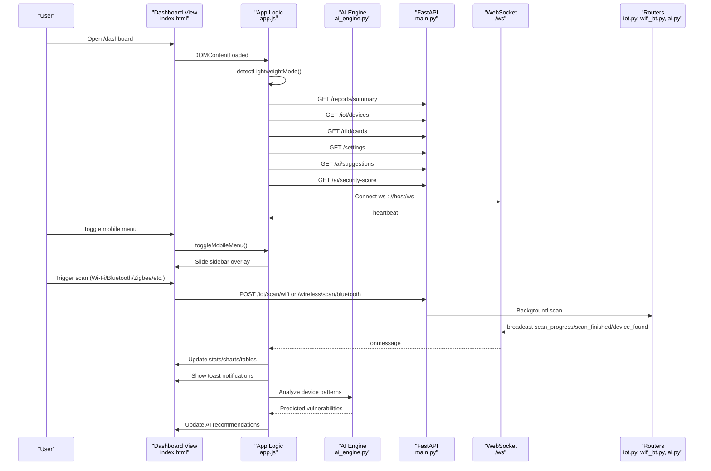
```mermaid
sequenceDiagram
participant U as "User"
participant V as "Dashboard View<br/>index.html"
participant JS as "App Logic<br/>app.js"
participant AI as "AI Engine<br/>ai_engine.py"
participant API as "FastAPI<br/>main.py"
participant WS as "WebSocket<br/>/ws"
participant RT as "Routers<br/>iot.py, wifi_bt.py, ai.py"
U->>V : Open /dashboard
V->>JS : DOMContentLoaded
JS->>JS : detectLightweightMode()
JS->>API : GET /reports/summary
JS->>API : GET /iot/devices
JS->>API : GET /rfid/cards
JS->>API : GET /settings
JS->>API : GET /ai/suggestions
JS->>API : GET /ai/security-score
JS->>WS : Connect ws : //host/ws
WS-->>JS : heartbeat
U->>V : Toggle mobile menu
V->>JS : toggleMobileMenu()
JS->>V : Slide sidebar overlay
U->>V : Trigger scan (Wi-Fi/Bluetooth/Zigbee/etc.)
V->>API : POST /iot/scan/wifi or /wireless/scan/bluetooth
API->>RT : Background scan
RT-->>WS : broadcast scan_progress/scan_finished/device_found
WS-->>JS : onmessage
JS->>V : Update stats/charts/tables
JS->>V : Show toast notifications
JS->>AI : Analyze device patterns
AI-->>JS : Predicted vulnerabilities
JS->>V : Update AI recommendations
```

**Diagram sources**
- [app.js:14](file://backend/static/app.js#L14)
- [app.js:421](file://backend/static/app.js#L421)
- [app.js:113](file://backend/static/app.js#L113)
- [app.js:989](file://backend/static/app.js#L989)
- [app.js:1050](file://backend/static/app.js#L1050)
- [main.py:90](file://backend/main.py#L90)
- [ai_engine.py:247](file://backend/ai_engine.py#L247)
- [iot.py:291](file://backend/routers/iot.py#L291)
- [wifi_bt.py:182](file://backend/routers/wifi_bt.py#L182)

## Detailed Component Analysis

### Enhanced Responsive Design System
- **Mobile-First Approach**: Designed for mobile devices first with progressive enhancement for larger screens
- **Off-Canvas Navigation**: Sidebar transforms into slide-out drawer with overlay on mobile devices
- **Adaptive Grid System**: Statistics grid adapts from 4 columns on desktop to single column on phones
- **Touch-Friendly Elements**: Minimum 44px touch targets, visual feedback, and gesture support
- **Performance Detection**: Automatic lightweight mode activation for Raspberry Pi and low-power devices

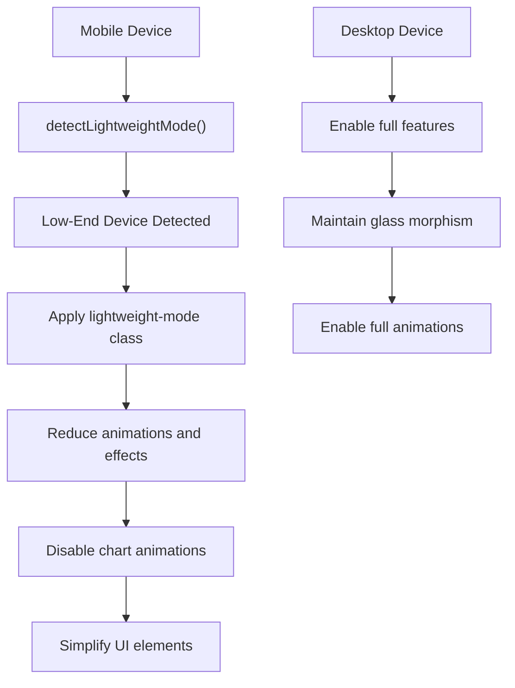
```mermaid
flowchart TD
Mobile["Mobile Device"] --> Detect["detectLightweightMode()"]
Detect --> LowEnd["Low-End Device Detected"]
LowEnd --> Lightweight["Apply lightweight-mode class"]
Lightweight --> ReduceEffects["Reduce animations and effects"]
ReduceEffects --> OptimizeCharts["Disable chart animations"]
OptimizeCharts --> SimplifyUI["Simplify UI elements"]
Desktop["Desktop Device"] --> FullFeatures["Enable full features"]
FullFeatures --> GlassPanels["Maintain glass morphism"]
GlassPanels --> FullAnimations["Enable full animations"]
```

**Diagram sources**
- [index.html:463](file://backend/static/index.html#L463)
- [style.css:1264](file://backend/static/style.css#L1264)
- [style.css:1273](file://backend/static/style.css#L1273)

**Section sources**
- [index.html:463](file://backend/static/index.html#L463)
- [style.css:1264](file://backend/static/style.css#L1264)
- [style.css:1273](file://backend/static/style.css#L1273)

### Mobile Menu System and Navigation
- **Hamburger Menu**: Fixed position button with smooth animations and overlay effect
- **Off-Canvas Drawer**: Sidebar slides in from left with shadow and backdrop blur
- **Automatic Closing**: Closes automatically when navigating on mobile devices
- **Responsive Overlay**: Semi-transparent overlay that dims main content during sidebar visibility
- **Smooth Transitions**: CSS transforms with hardware acceleration for buttery-smooth animations

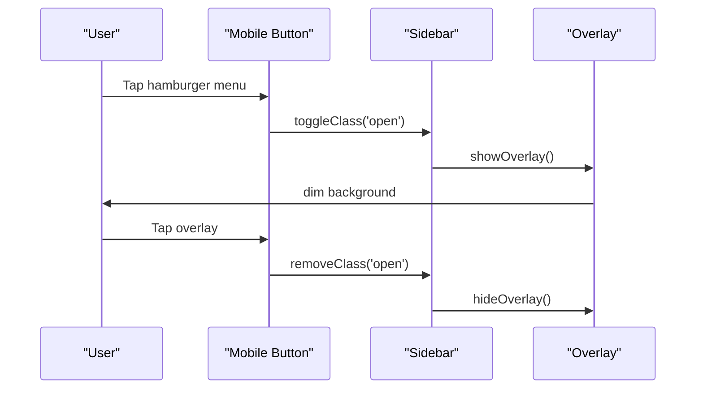
```mermaid
sequenceDiagram
participant U as "User"
participant MB as "Mobile Button"
participant SB as "Sidebar"
participant OL as "Overlay"
U->>MB : Tap hamburger menu
MB->>SB : toggleClass('open')
SB->>OL : showOverlay()
OL->>U : dim background
U->>MB : Tap overlay
MB->>SB : removeClass('open')
SB->>OL : hideOverlay()
```

**Diagram sources**
- [index.html:22](file://backend/static/index.html#L22)
- [index.html:421](file://backend/static/index.html#L421)
- [style.css:1001](file://backend/static/style.css#L1001)
- [style.css:1016](file://backend/static/style.css#L1016)

**Section sources**
- [index.html:22](file://backend/static/index.html#L22)
- [index.html:421](file://backend/static/index.html#L421)
- [style.css:1001](file://backend/static/style.css#L1001)
- [style.css:1016](file://backend/static/style.css#L1016)

### Touch Screen Optimizations
- **Large Touch Targets**: Minimum 44px height for all interactive elements
- **Visual Feedback**: Hover states disabled on touch devices, active states for tactile feedback
- **Gesture Support**: Touch scrolling, pinch-to-zoom prevention, and double-tap zoom control
- **Input Optimization**: Prevents auto-zoom on iOS Safari, larger form controls for mobile
- **Scroll Performance**: `-webkit-overflow-scrolling: touch` for native-like scrolling

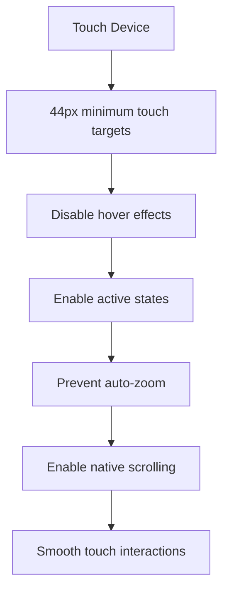
```mermaid
flowchart TD
Touch["Touch Device"] --> LargeTargets["44px minimum touch targets"]
LargeTargets --> NoHover["Disable hover effects"]
NoHover --> ActiveStates["Enable active states"]
ActiveStates --> PreventZoom["Prevent auto-zoom"]
PreventZoom --> NativeScroll["Enable native scrolling"]
NativeScroll --> SmoothTouch["Smooth touch interactions"]
```

**Diagram sources**
- [style.css:20](file://backend/static/style.css#L20)
- [style.css:1317](file://backend/static/style.css#L1317)
- [style.css:1336](file://backend/static/style.css#L1336)

**Section sources**
- [style.css:20](file://backend/static/style.css#L20)
- [style.css:1317](file://backend/static/style.css#L1317)
- [style.css:1336](file://backend/static/style.css#L1336)

### Lightweight Mode Performance Adaptations
- **Automatic Detection**: Based on hardware concurrency, device memory, and user agent strings
- **Reduced Animations**: Prefers-reduced-motion media query support and manual lightweight mode
- **Simplified Effects**: Removes backdrop filters, gradients, and complex animations
- **Optimized Rendering**: Disables expensive visual effects for Raspberry Pi and embedded systems
- **Manual Override**: URL parameter support for forcing lightweight mode

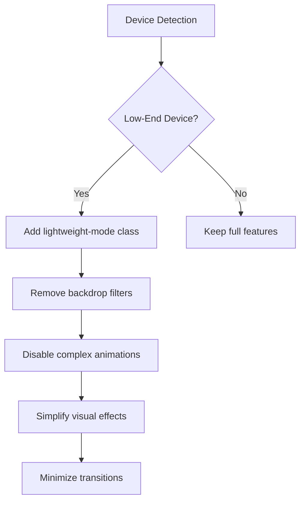
```mermaid
flowchart TD
Detection["Device Detection"] --> LowEnd{"Low-End Device?"}
LowEnd --> |Yes| Lightweight["Add lightweight-mode class"]
LowEnd --> |No| FullFeatures["Keep full features"]
Lightweight --> RemoveFilters["Remove backdrop filters"]
RemoveFilters --> DisableAnimations["Disable complex animations"]
DisableAnimations --> SimplifyEffects["Simplify visual effects"]
SimplifyEffects --> ReduceTransitions["Minimize transitions"]
```

**Diagram sources**
- [index.html:463](file://backend/static/index.html#L463)
- [style.css:1273](file://backend/static/style.css#L1273)
- [style.css:1301](file://backend/static/style.css#L1301)

**Section sources**
- [index.html:463](file://backend/static/index.html#L463)
- [style.css:1273](file://backend/static/style.css#L1273)
- [style.css:1301](file://backend/static/style.css#L1301)

### Adaptive Statistics Grid Layouts
- **Desktop**: 4-column grid with full card details and icons
- **Tablet**: 2-column grid with reduced spacing and simplified cards
- **Phone Landscape**: 4-column grid optimized for horizontal orientation
- **Phone Portrait**: Single column with stacked cards and minimal spacing
- **Very Small Screens**: Single column with compact cards and minimal padding

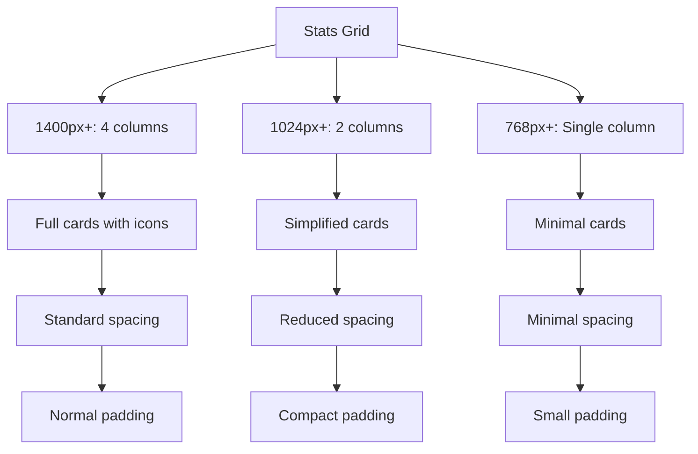
```mermaid
flowchart TD
Grid["Stats Grid"] --> Desktop["1400px+: 4 columns"]
Desktop --> DesktopCards["Full cards with icons"]
DesktopCards --> DesktopSpacing["Standard spacing"]
DesktopSpacing --> DesktopPadding["Normal padding"]
Grid --> Tablet["1024px+: 2 columns"]
Tablet --> TabletCards["Simplified cards"]
TabletCards --> TabletSpacing["Reduced spacing"]
TabletSpacing --> TabletPadding["Compact padding"]
Grid --> Phone["768px+: Single column"]
Phone --> PhoneCards["Minimal cards"]
PhoneCards --> PhoneSpacing["Minimal spacing"]
PhoneSpacing --> PhonePadding["Small padding"]
```

**Diagram sources**
- [style.css:962](file://backend/static/style.css#L962)
- [style.css:974](file://backend/static/style.css#L974)
- [style.css:994](file://backend/static/style.css#L994)
- [style.css:1140](file://backend/static/style.css#L1140)
- [style.css:1246](file://backend/static/style.css#L1246)

**Section sources**
- [style.css:962](file://backend/static/style.css#L962)
- [style.css:974](file://backend/static/style.css#L974)
- [style.css:994](file://backend/static/style.css#L994)
- [style.css:1140](file://backend/static/style.css#L1140)
- [style.css:1246](file://backend/static/style.css#L1246)

### Device Table Responsiveness and Touch Interactions
- **Horizontal Scrolling**: Table container with overflow-x for narrow screens
- **Touch-Friendly Rows**: Minimum 44px height with visual selection feedback
- **Reduced Visual Complexity**: Simplified badges and icons on mobile
- **Font Scaling**: Smaller text sizes for better readability on small screens
- **Selection Feedback**: Active state highlighting with subtle animations

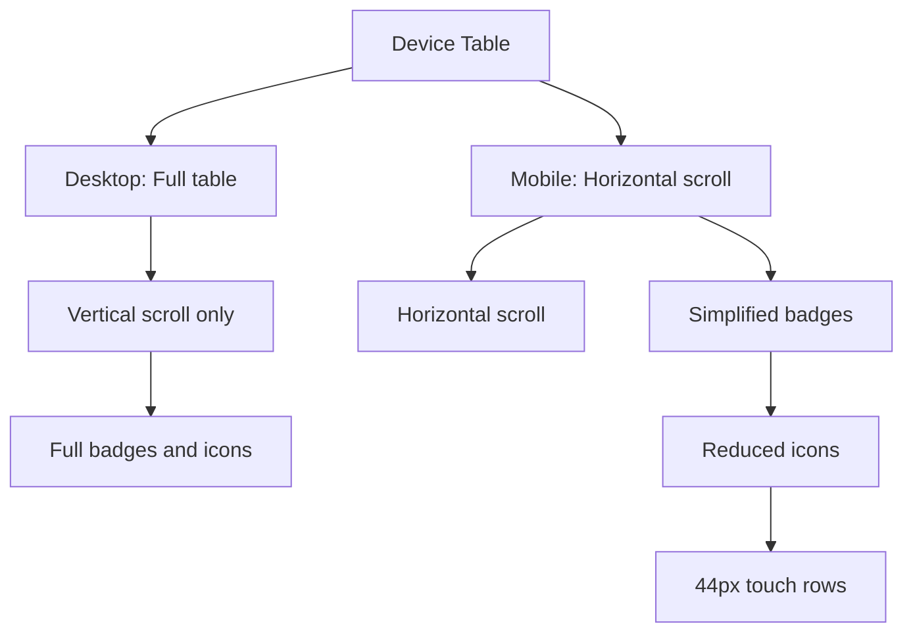
```mermaid
flowchart TD
Table["Device Table"] --> Desktop["Desktop: Full table"]
Desktop --> DesktopScroll["Vertical scroll only"]
DesktopScroll --> DesktopBadges["Full badges and icons"]
Table --> Mobile["Mobile: Horizontal scroll"]
Mobile --> MobileScroll["Horizontal scroll"]
Mobile --> MobileBadges["Simplified badges"]
MobileBadges --> MobileIcons["Reduced icons"]
MobileIcons --> TouchRows["44px touch rows"]
```

**Diagram sources**
- [style.css:1092](file://backend/static/style.css#L1092)
- [style.css:1213](file://backend/static/style.css#L1213)
- [style.css:649](file://backend/static/style.css#L649)

**Section sources**
- [style.css:1092](file://backend/static/style.css#L1092)
- [style.css:1213](file://backend/static/style.css#L1213)
- [style.css:649](file://backend/static/style.css#L649)

### Performance-Optimized Chart Implementation
- **Conditional Animations**: Disabled animations in lightweight mode for better performance
- **Reduced Visual Effects**: No box shadows or complex gradients on progress bars
- **Hardware Acceleration**: CSS transforms with will-change property for smooth animations
- **Responsive Sizing**: Charts adapt to container size with maintainAspectRatio disabled
- **Animation Control**: Configurable animation duration and easing for different devices

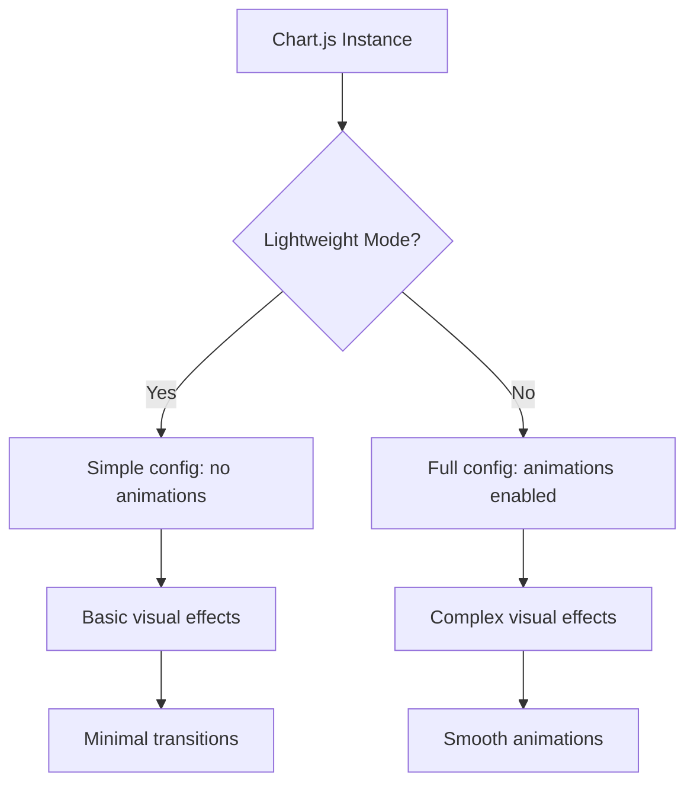
```mermaid
flowchart TD
Chart["Chart.js Instance"] --> Lightweight{"Lightweight Mode?"}
Lightweight --> |Yes| SimpleConfig["Simple config: no animations"]
SimpleConfig --> BasicEffects["Basic visual effects"]
BasicEffects --> MinimalTransitions["Minimal transitions"]
Lightweight --> |No| FullConfig["Full config: animations enabled"]
FullConfig --> ComplexEffects["Complex visual effects"]
ComplexEffects --> SmoothTransitions["Smooth animations"]
```

**Diagram sources**
- [app.js:59](file://backend/static/app.js#L59)
- [app.js:64](file://backend/static/app.js#L64)
- [app.js:90](file://backend/static/app.js#L90)
- [style.css:1310](file://backend/static/style.css#L1310)

**Section sources**
- [app.js:59](file://backend/static/app.js#L59)
- [app.js:64](file://backend/static/app.js#L64)
- [app.js:90](file://backend/static/app.js#L90)
- [style.css:1310](file://backend/static/style.css#L1310)

### Real-Time Updates via WebSocket
- **Connection Management**: Establishes ws or wss depending on origin protocol; reconnects on close
- **Heartbeat Mechanism**: Regular heartbeat messages maintain connection health
- **Event Handling**: Handles heartbeat, device_found, vulnerability_found, scan_progress, scan_finished, scan_error
- **UI Synchronization**: Updates stats, charts, tables, and AI recommendations in real-time
- **Toast Notifications**: Visual and audio feedback for critical events

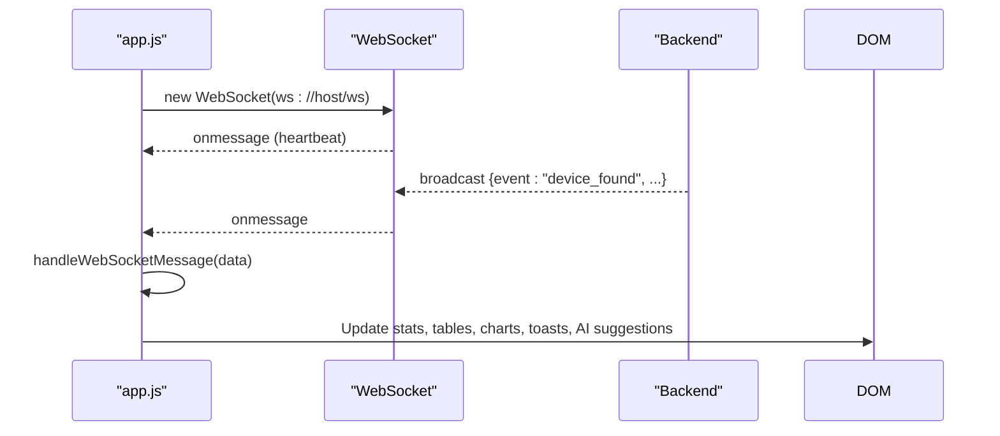
```mermaid
sequenceDiagram
participant JS as "app.js"
participant WS as "WebSocket"
participant BE as "Backend"
JS->>WS : new WebSocket(ws : //host/ws)
WS-->>JS : onmessage (heartbeat)
BE-->>WS : broadcast {event : "device_found", ...}
WS-->>JS : onmessage
JS->>JS : handleWebSocketMessage(data)
JS->>DOM : Update stats, tables, charts, toasts, AI suggestions
```

**Diagram sources**
- [app.js:113](file://backend/static/app.js#L113)
- [app.js:128](file://backend/static/app.js#L128)
- [main.py:90](file://backend/main.py#L90)

**Section sources**
- [app.js:113](file://backend/static/app.js#L113)
- [app.js:128](file://backend/static/app.js#L128)
- [main.py:90](file://backend/main.py#L90)

### Analytics with Chart.js
- **Risk Distribution**: Doughnut chart (Safe, Medium, Risk) with conditional animations
- **Protocol Distribution**: Vertical bar chart (Wi-Fi, Bluetooth, Zigbee, Thread, Z-Wave, LoRaWAN, RFID)
- **Performance Optimization**: Reduced animations and visual effects in lightweight mode
- **Responsive Updates**: Charts automatically resize with window changes

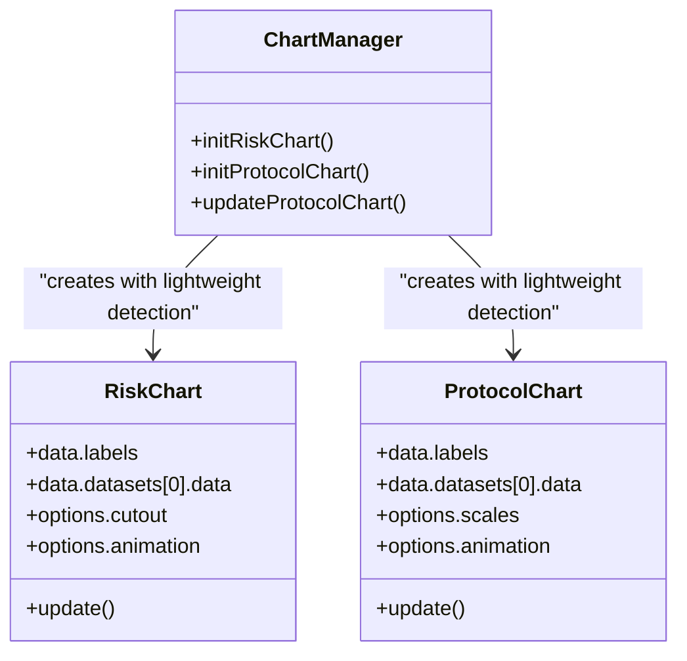
```mermaid
classDiagram
class ChartManager {
+initRiskChart()
+initProtocolChart()
+updateProtocolChart()
}
class RiskChart {
+data.labels
+data.datasets[0].data
+options.cutout
+options.animation
+update()
}
class ProtocolChart {
+data.labels
+data.datasets[0].data
+options.scales
+options.animation
+update()
}
ChartManager --> RiskChart : "creates with lightweight detection"
ChartManager --> ProtocolChart : "creates with lightweight detection"
```

**Diagram sources**
- [app.js:40](file://backend/static/app.js#L40)
- [app.js:45](file://backend/static/app.js#L45)
- [app.js:70](file://backend/static/app.js#L70)

**Section sources**
- [app.js:40](file://backend/static/app.js#L40)
- [app.js:45](file://backend/static/app.js#L45)
- [app.js:70](file://backend/static/app.js#L70)

### Device Discovery and Live Scanning
- **Multi-Protocol Scanning**: Wi-Fi, Bluetooth, Zigbee, Thread, Z-Wave, LoRaWAN, Matter support
- **Network Discovery**: Automatic network detection and nearby SSID scanning
- **Progress Tracking**: Animated progress bar with status updates and completion handling
- **Real-time Updates**: WebSocket integration for immediate scan progress and results

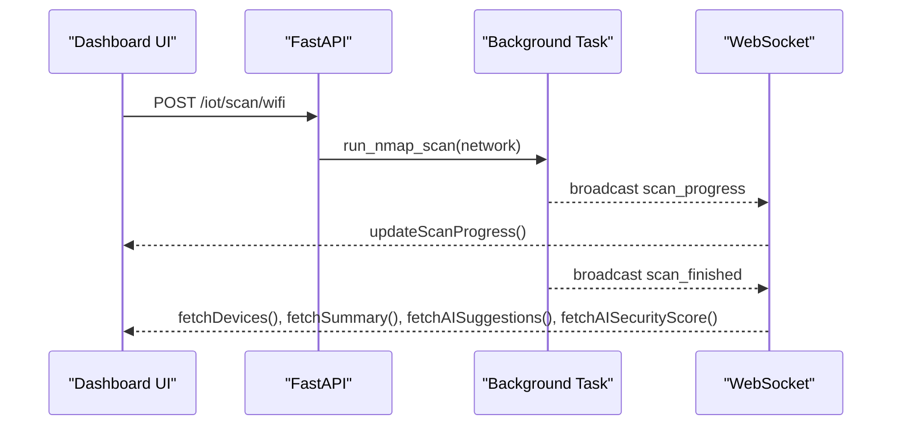
```mermaid
sequenceDiagram
participant UI as "Dashboard UI"
participant API as "FastAPI"
participant BG as "Background Task"
participant WS as "WebSocket"
UI->>API : POST /iot/scan/wifi
API->>BG : run_nmap_scan(network)
BG-->>WS : broadcast scan_progress
WS-->>UI : updateScanProgress()
BG-->>WS : broadcast scan_finished
WS-->>UI : fetchDevices(), fetchSummary(), fetchAISuggestions(), fetchAISecurityScore()
```

**Diagram sources**
- [app.js:840](file://backend/static/app.js#L840)
- [iot.py:291](file://backend/routers/iot.py#L291)
- [iot.py:300](file://backend/routers/iot.py#L300)

**Section sources**
- [app.js:840](file://backend/static/app.js#L840)
- [iot.py:291](file://backend/routers/iot.py#L291)
- [wifi_bt.py:182](file://backend/routers/wifi_bt.py#L182)

### Device Table and Detail Panel
- **Responsive Design**: Adapts layout and content based on screen size and device type
- **Touch-Friendly Interface**: Large touch targets, visual feedback, and simplified interactions
- **Performance Optimization**: Reduced visual complexity and animations for mobile devices
- **Accessibility**: Proper focus management and screen reader support

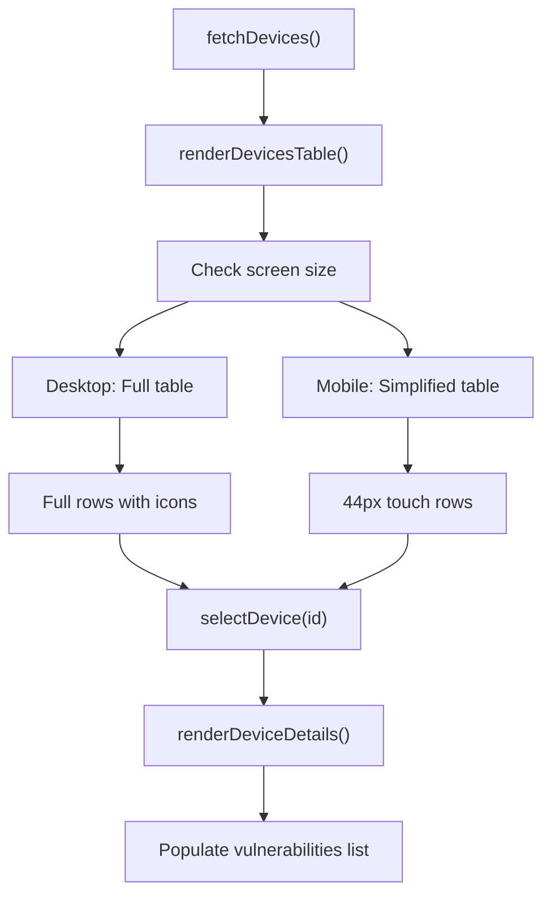
```mermaid
flowchart TD
Load["fetchDevices()"] --> Render["renderDevicesTable()"]
Render --> ResponsiveCheck["Check screen size"]
ResponsiveCheck --> Desktop["Desktop: Full table"]
ResponsiveCheck --> Mobile["Mobile: Simplified table"]
Desktop --> FullRows["Full rows with icons"]
Mobile --> TouchRows["44px touch rows"]
FullRows --> Select["selectDevice(id)"]
TouchRows --> Select
Select --> Details["renderDeviceDetails()"]
Details --> Vulns["Populate vulnerabilities list"]
```

**Diagram sources**
- [app.js:331](file://backend/static/app.js#L331)
- [app.js:344](file://backend/static/app.js#L344)
- [app.js:380](file://backend/static/app.js#L380)
- [app.js:386](file://backend/static/app.js#L386)

**Section sources**
- [app.js:331](file://backend/static/app.js#L331)
- [app.js:344](file://backend/static/app.js#L344)
- [app.js:380](file://backend/static/app.js#L380)
- [app.js:386](file://backend/static/app.js#L386)

### AI Security Score and Recommendations
- **Adaptive Display**: Simplified layout for mobile devices with reduced visual complexity
- **Performance Optimization**: Lightweight mode reduces AI analysis overhead
- **Context-Aware Suggestions**: Device-specific recommendations based on network analysis
- **Real-time Updates**: AI data refreshes automatically with scan progress

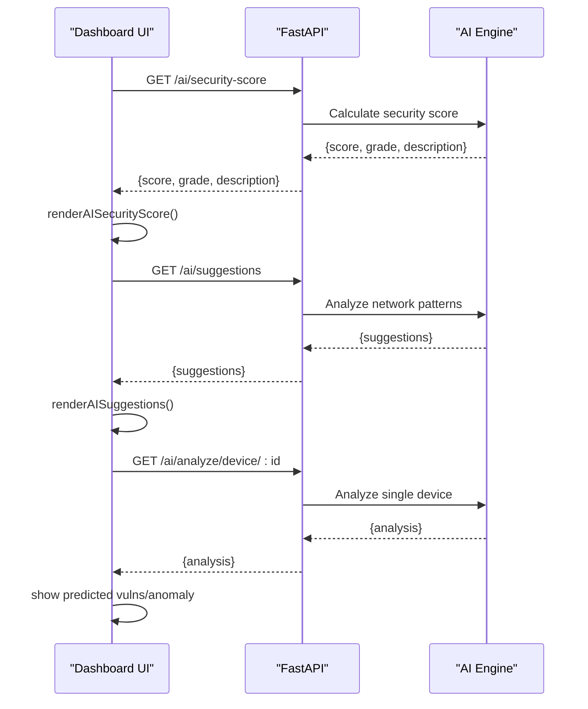
```mermaid
sequenceDiagram
participant UI as "Dashboard UI"
participant API as "FastAPI"
participant AI as "AI Engine"
UI->>API : GET /ai/security-score
API->>AI : Calculate security score
AI-->>API : {score, grade, description}
API-->>UI : {score, grade, description}
UI->>UI : renderAISecurityScore()
UI->>API : GET /ai/suggestions
API->>AI : Analyze network patterns
AI-->>API : {suggestions}
API-->>UI : {suggestions}
UI->>UI : renderAISuggestions()
UI->>API : GET /ai/analyze/device/ : id
API->>AI : Analyze single device
AI-->>API : {analysis}
API-->>UI : {analysis}
UI->>UI : show predicted vulns/anomaly
```

**Diagram sources**
- [app.js:930](file://backend/static/app.js#L930)
- [app.js:992](file://backend/static/app.js#L992)
- [app.js:1025](file://backend/static/app.js#L1025)
- [ai_engine.py:247](file://backend/ai_engine.py#L247)

**Section sources**
- [app.js:930](file://backend/static/app.js#L930)
- [app.js:992](file://backend/static/app.js#L992)
- [app.js:1025](file://backend/static/app.js#L1025)
- [ai_engine.py:236](file://backend/ai_engine.py#L236)

### Authentication and Settings
- **Mobile-Optimized Login**: Touch-friendly form controls and responsive layout
- **Session Management**: Secure authentication with session storage and redirect handling
- **Settings Persistence**: User preferences saved locally with automatic loading
- **Touch-Optimized Controls**: Large buttons and form elements for mobile devices

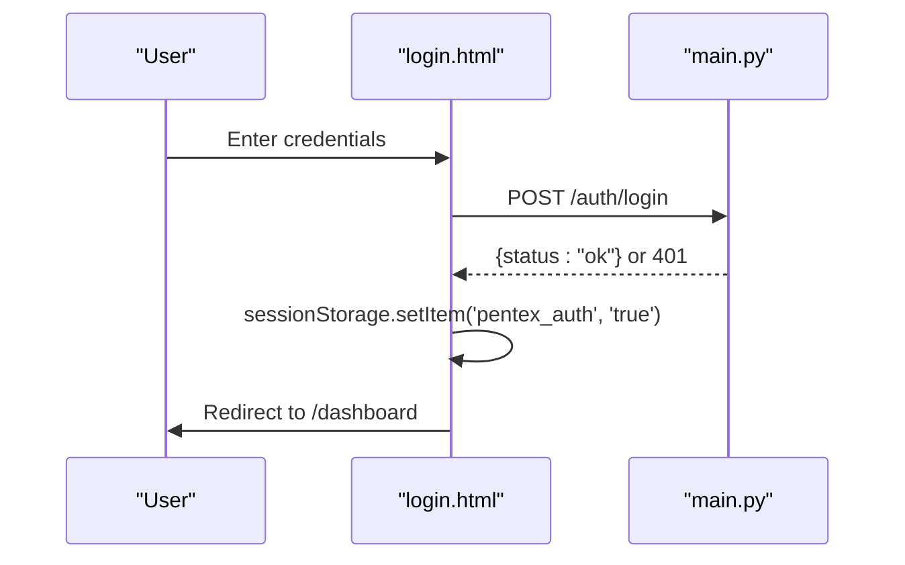
```mermaid
sequenceDiagram
participant U as "User"
participant L as "login.html"
participant API as "main.py"
U->>L : Enter credentials
L->>API : POST /auth/login
API-->>L : {status : "ok"} or 401
L->>L : sessionStorage.setItem('pentex_auth', 'true')
L->>U : Redirect to /dashboard
```

**Diagram sources**
- [login.html:189](file://backend/static/login.html#L189)
- [main.py:70](file://backend/main.py#L70)

**Section sources**
- [login.html:189](file://backend/static/login.html#L189)
- [main.py:50](file://backend/main.py#L50)

## Dependency Analysis
- **Frontend Dependencies**: Chart.js CDN for analytics, FontAwesome for icons, local CSS/JS with responsive design
- **Backend Integration**: REST endpoints grouped by routers with WebSocket broadcasting for real-time updates
- **Performance Monitoring**: Lightweight mode detection and automatic performance adaptation
- **Device Optimization**: Hardware capability detection for Raspberry Pi and embedded systems

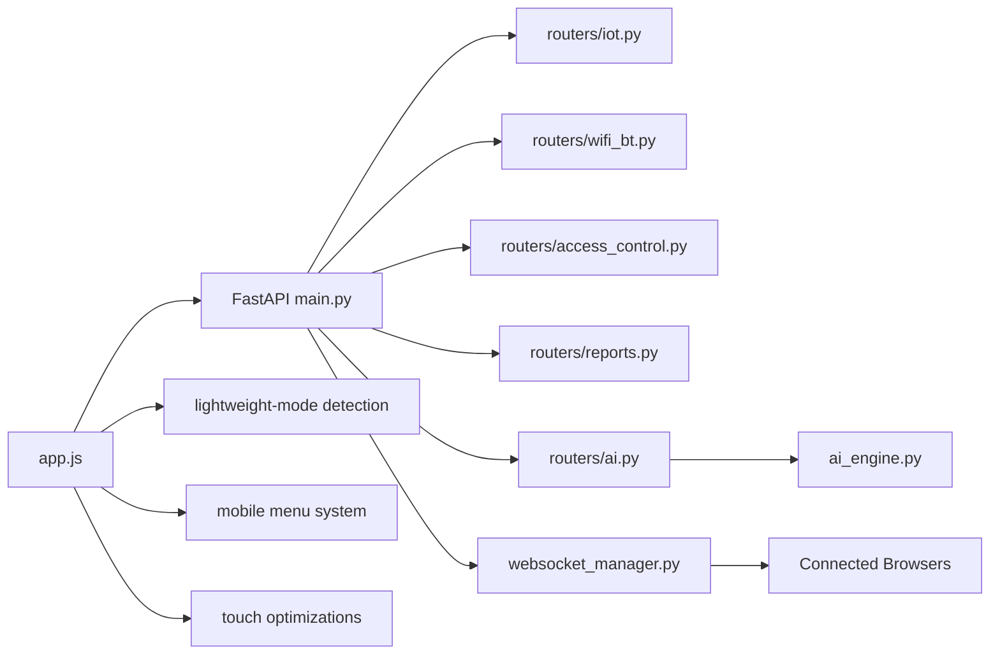
```mermaid
graph LR
JS["app.js"] --> API["FastAPI main.py"]
API --> IOT["routers/iot.py"]
API --> WIFI["routers/wifi_bt.py"]
API --> RFID["routers/access_control.py"]
API --> REP["routers/reports.py"]
API --> AI["routers/ai.py"]
API --> WS["websocket_manager.py"]
WS --> Clients["Connected Browsers"]
AI --> Engine["ai_engine.py"]
JS --> Lightweight["lightweight-mode detection"]
JS --> Mobile["mobile menu system"]
JS --> Touch["touch optimizations"]
```

**Diagram sources**
- [app.js:1](file://backend/static/app.js#L1)
- [main.py:14](file://backend/main.py#L14)
- [ai_engine.py:1](file://backend/ai_engine.py#L1)
- [iot.py:24](file://backend/routers/iot.py#L24)
- [wifi_bt.py:27](file://backend/routers/wifi_bt.py#L27)
- [access_control.py:13](file://backend/routers/access_control.py#L13)
- [reports.py:15](file://backend/routers/reports.py#L15)
- [websocket_manager.py:7](file://backend/websocket_manager.py#L7)

**Section sources**
- [main.py:14](file://backend/main.py#L14)
- [websocket_manager.py:7](file://backend/websocket_manager.py#L7)

## Performance Considerations
- **Device Detection**: Automatic lightweight mode activation for Raspberry Pi and low-power devices
- **Chart Optimization**: Conditional animations and visual effects based on device capabilities
- **Memory Management**: Cleanup of intervals and timeouts when views change to prevent memory leaks
- **Touch Performance**: Hardware-accelerated animations and smooth scrolling for mobile devices
- **Asset Optimization**: CDN-hosted Chart.js and FontAwesome reduce local bandwidth usage
- **WebSocket Efficiency**: Heartbeat mechanism maintains connection health with minimal overhead
- **Rendering Optimization**: Virtualization techniques for large datasets, reduced DOM complexity on mobile
- **Animation Control**: Prefers-reduced-motion media query support for accessibility and performance

[No sources needed since this section provides general guidance]

## Troubleshooting Guide
- **Mobile Menu Not Working**: Verify JavaScript execution and CSS classes for mobile menu toggle
- **Touch Targets Too Small**: Check CSS touch-min variables and ensure proper viewport meta tag
- **Lightweight Mode Issues**: Verify device detection logic and CSS class application
- **Chart Performance Problems**: Ensure lightweight mode is properly detected and animations disabled
- **WebSocket Connection Failures**: Check CORS settings and WebSocket endpoint accessibility
- **Touch Scrolling Issues**: Verify `-webkit-overflow-scrolling: touch` is applied to scrollable containers
- **Responsive Layout Problems**: Check media query breakpoints and CSS grid/flex properties
- **AI Analysis Slowdown**: Confirm lightweight mode is active on resource-constrained devices

**Section sources**
- [index.html:421](file://backend/static/index.html#L421)
- [style.css:1264](file://backend/static/style.css#L1264)
- [style.css:1317](file://backend/static/style.css#L1317)
- [app.js:113](file://backend/static/app.js#L113)

## Conclusion
The PentexOne dashboard represents a modern, responsive web application designed for both desktop and mobile environments. The enhanced responsive design system provides seamless experiences across all device types, from desktop browsers to Raspberry Pi installations. The mobile menu system, touch screen optimizations, and lightweight mode performance adaptations ensure optimal usability and performance regardless of the device. The combination of real-time updates, AI-powered security analysis, and performance-conscious design creates a robust platform for IoT security auditing that scales effectively from powerful desktop systems to embedded devices.

[No sources needed since this section summarizes without analyzing specific files]

## Appendices

### Usage Examples and Code Snippet Paths
- **Mobile Menu Implementation**:
  - [index.html:22](file://backend/static/index.html#L22)
  - [index.html:421](file://backend/static/index.html#L421)
- **Lightweight Mode Detection**:
  - [index.html:463](file://backend/static/index.html#L463)
  - [style.css:1273](file://backend/static/style.css#L1273)
- **Touch Screen Optimizations**:
  - [style.css:20](file://backend/static/style.css#L20)
  - [style.css:1317](file://backend/static/style.css#L1317)
- **Responsive Grid Layouts**:
  - [style.css:962](file://backend/static/style.css#L962)
  - [style.css:974](file://backend/static/style.css#L974)
- **Device Table Responsiveness**:
  - [style.css:1092](file://backend/static/style.css#L1092)
  - [style.css:1213](file://backend/static/style.css#L1213)
- **Chart Performance Optimization**:
  - [app.js:59](file://backend/static/app.js#L59)
  - [app.js:90](file://backend/static/app.js#L90)
- **Real-time WebSocket Integration**:
  - [app.js:113](file://backend/static/app.js#L113)
  - [main.py:90](file://backend/main.py#L90)
- **AI Recommendations and Security Scoring**:
  - [app.js:989](file://backend/static/app.js#L989)
  - [app.js:1050](file://backend/static/app.js#L1050)
  - [app.js:1083](file://backend/static/app.js#L1083)

### Customization Guidelines
- **Responsive Breakpoints**: Modify media query values in style.css to adjust breakpoint thresholds
- **Mobile Menu Styling**: Customize sidebar width, overlay colors, and animation timing in CSS
- **Touch Target Sizing**: Adjust --touch-min variable to change minimum touch target sizes
- **Lightweight Mode**: Modify CSS rules in lightweight-mode class to customize performance adaptations
- **Grid Layouts**: Update CSS grid properties to change responsive column counts and spacing
- **Chart Customization**: Configure animation settings and visual effects based on device capabilities
- **Device Detection**: Modify JavaScript detection logic to add custom device type support

**Section sources**
- [style.css:958](file://backend/static/style.css#L958)
- [style.css:1264](file://backend/static/style.css#L1264)
- [style.css:1317](file://backend/static/style.css#L1317)

### Accessibility Considerations
- **Touch Accessibility**: Ensure all interactive elements meet 44px minimum touch target size
- **Motion Sensitivity**: Support prefers-reduced-motion media query for motion-sensitive users
- **Screen Reader Support**: Maintain proper ARIA attributes and semantic HTML structure
- **Keyboard Navigation**: Ensure full keyboard accessibility for desktop users
- **Color Contrast**: Verify sufficient contrast ratios for text and interactive elements
- **Responsive Testing**: Test all features across different screen sizes and orientations

[No sources needed since this section provides general guidance]

### Cross-Browser Compatibility
- **Modern Browsers**: Full support for Chrome, Firefox, Safari, and Edge with progressive enhancement
- **Mobile Browsers**: Optimized touch interactions and responsive layouts for iOS Safari and Android Chrome
- **Legacy Support**: Graceful degradation for older browsers with essential functionality preserved
- **WebSocket Support**: Automatic fallback for environments without WebSocket support
- **CSS Feature Detection**: Use of modern CSS features with appropriate fallbacks

[No sources needed since this section provides general guidance]

### Integration Patterns with Backend Endpoints
- **Authentication**:
  - POST /auth/login
  - Redirect to /dashboard on success
- **Dashboard Data**:
  - GET /reports/summary
  - GET /iot/devices
  - GET /rfid/cards
  - GET /settings
  - PUT /settings
- **Scanning Operations**:
  - POST /iot/scan/wifi
  - POST /wireless/scan/bluetooth
  - POST /iot/scan/zigbee
  - POST /iot/scan/thread
  - POST /iot/scan/zwave
  - POST /iot/scan/lora
  - GET /iot/scan/status
- **Wireless Utilities**:
  - POST /wireless/test/ports/{ip}
  - POST /wireless/test/credentials/{ip}
  - GET /wireless/scan/ssids
  - POST /wireless/tls/check/{host}
- **Reports**:
  - GET /reports/generate/pdf
- **AI Analysis**:
  - GET /ai/security-score
  - GET /ai/suggestions
  - GET /ai/analyze/device/{id}
  - GET /ai/analyze/network
  - GET /ai/remediation/{vuln_type}
  - GET /ai/remediations
  - GET /ai/predict/risks
  - GET /ai/classify/devices

**Section sources**
- [main.py:50](file://backend/main.py#L50)
- [ai.py:26](file://backend/routers/ai.py#L26)
- [ai.py:106](file://backend/routers/ai.py#L106)
- [ai.py:270](file://backend/routers/ai.py#L270)
- [iot.py:591](file://backend/routers/iot.py#L591)
- [wifi_bt.py:59](file://backend/routers/wifi_bt.py#L59)
- [wifi_bt.py:182](file://backend/routers/wifi_bt.py#L182)
- [reports.py:37](file://backend/routers/reports.py#L37)