# Frontend Dashboard

<cite>
**Referenced Files in This Document**
- [index.html](file://backend/static/index.html)
- [app.js](file://backend/static/app.js)
- [style.css](file://backend/static/style.css)
- [login.html](file://backend/static/login.html)
- [main.py](file://backend/main.py)
- [websocket_manager.py](file://backend/websocket_manager.py)
- [iot.py](file://backend/routers/iot.py)
- [wifi_bt.py](file://backend/routers/wifi_bt.py)
- [access_control.py](file://backend/routers/access_control.py)
- [reports.py](file://backend/routers/reports.py)
</cite>

## Table of Contents
1. [Introduction](#introduction)
2. [Project Structure](#project-structure)
3. [Core Components](#core-components)
4. [Architecture Overview](#architecture-overview)
5. [Detailed Component Analysis](#detailed-component-analysis)
6. [Dependency Analysis](#dependency-analysis)
7. [Performance Considerations](#performance-considerations)
8. [Troubleshooting Guide](#troubleshooting-guide)
9. [Conclusion](#conclusion)
10. [Appendices](#appendices)

## Introduction
This document describes the modern web dashboard interface for PentexOne, a security auditing platform for IoT ecosystems. It covers the dark theme design, responsive layout, real-time updates via WebSocket, and analytics powered by Chart.js. It documents the JavaScript implementation, user interaction patterns, and integration with backend endpoints. It also provides customization guidelines, accessibility considerations, cross-browser compatibility notes, and performance optimization recommendations.

## Project Structure
The dashboard is a client-side SPA served by the backend FastAPI application. The frontend assets (HTML, JS, CSS) are served under the `/dashboard` route, while the backend exposes REST APIs and a WebSocket endpoint for live events.

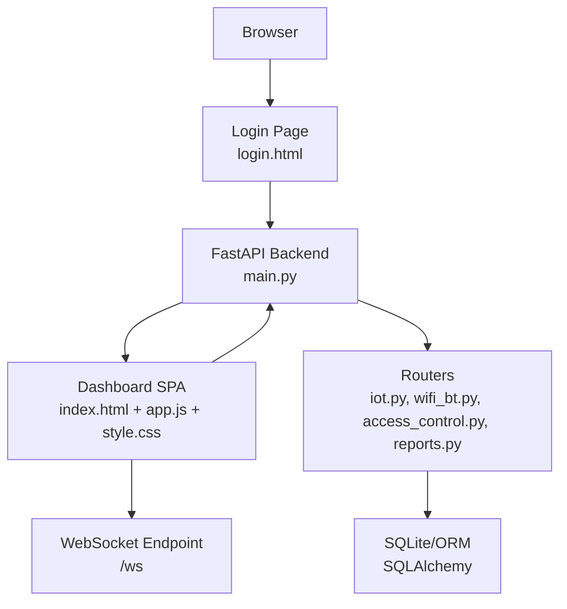

**Diagram sources**
- [main.py:68](file://backend/main.py#L68)
- [index.html:1](file://backend/static/index.html#L1)
- [app.js:1](file://backend/static/app.js#L1)
- [style.css:1](file://backend/static/style.css#L1)
- [iot.py:24](file://backend/routers/iot.py#L24)
- [wifi_bt.py:27](file://backend/routers/wifi_bt.py#L27)
- [access_control.py:13](file://backend/routers/access_control.py#L13)
- [reports.py:15](file://backend/routers/reports.py#L15)

**Section sources**
- [main.py:68](file://backend/main.py#L68)
- [index.html:1](file://backend/static/index.html#L1)
- [app.js:1](file://backend/static/app.js#L1)
- [style.css:1](file://backend/static/style.css#L1)

## Core Components
- Dark theme with glass panels, subtle gradients, and vibrant accent colors.
- Responsive layout with collapsible sidebar and adaptive grid/table layouts.
- Real-time updates via WebSocket for live device discovery and scan progress.
- Analytics dashboards using Chart.js doughnut and bar charts.
- Interactive navigation, toast notifications, and collapsible advanced options.
- Authentication flow with session storage and protected routes.

**Section sources**
- [style.css:1](file://backend/static/style.css#L1)
- [index.html:17](file://backend/static/index.html#L17)
- [app.js:113](file://backend/static/app.js#L113)
- [app.js:40](file://backend/static/app.js#L40)

## Architecture Overview
The dashboard initializes on DOMContentLoaded, sets up Chart.js instances, connects to the WebSocket, and loads initial data. Background scans emit events over WebSocket, which the client consumes to update UI state and toast notifications.

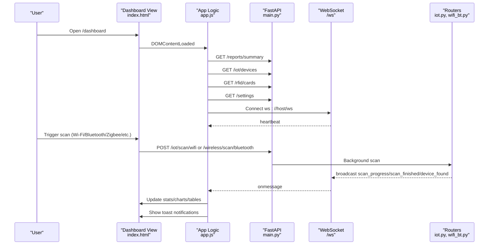

**Diagram sources**
- [app.js:14](file://backend/static/app.js#L14)
- [app.js:113](file://backend/static/app.js#L113)
- [main.py:90](file://backend/main.py#L90)
- [iot.py:291](file://backend/routers/iot.py#L291)
- [wifi_bt.py:182](file://backend/routers/wifi_bt.py#L182)

## Detailed Component Analysis

### Dashboard Layout and Theming
- Layout: Flexbox-based app container with a fixed sidebar and scrollable main content.
- Dark theme: CSS variables define backgrounds, borders, and accents; glass panels use backdrop-filter blur.
- Typography: Inter for UI, Outfit for login; consistent spacing and typography scales.
- Responsive breakpoints: Sidebar collapses to icons-only; grid stacks to single column on small screens.

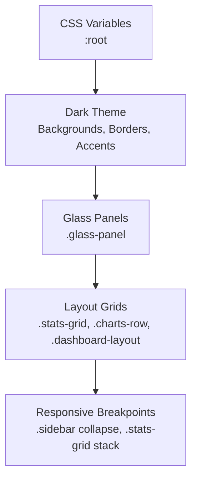

**Diagram sources**
- [style.css:1](file://backend/static/style.css#L1)
- [style.css:39](file://backend/static/style.css#L39)
- [style.css:423](file://backend/static/style.css#L423)
- [style.css:843](file://backend/static/style.css#L843)

**Section sources**
- [style.css:1](file://backend/static/style.css#L1)
- [style.css:39](file://backend/static/style.css#L39)
- [style.css:843](file://backend/static/style.css#L843)

### Navigation and Views
- Sidebar navigation toggles active view and updates page title/subtitle.
- Views: Dashboard, RFID, Reports, Settings.
- Navigation uses in-page click handlers to switch views and update active state.

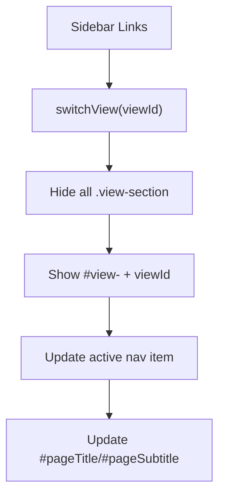

**Diagram sources**
- [index.html:25](file://backend/static/index.html#L25)
- [app.js:215](file://backend/static/app.js#L215)

**Section sources**
- [index.html:25](file://backend/static/index.html#L25)
- [app.js:215](file://backend/static/app.js#L215)

### Real-Time Updates via WebSocket
- Connection: Establishes ws or wss depending on origin protocol; reconnects on close.
- Events: Handles heartbeat, device_found, vulnerability_found, scan_progress, scan_finished, scan_error.
- UI updates: Progress bar, toast notifications, device lists, summaries, charts.

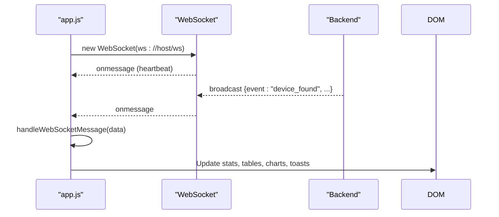

**Diagram sources**
- [app.js:113](file://backend/static/app.js#L113)
- [app.js:128](file://backend/static/app.js#L128)
- [main.py:90](file://backend/main.py#L90)

**Section sources**
- [app.js:113](file://backend/static/app.js#L113)
- [app.js:128](file://backend/static/app.js#L128)
- [main.py:90](file://backend/main.py#L90)

### Analytics with Chart.js
- Risk distribution: Doughnut chart (Safe, Medium, Risk).
- Protocol distribution: Vertical bar chart (Wi-Fi, Bluetooth, Zigbee, Thread, Z-Wave, LoRaWAN, RFID).
- Initialization: Creates Chart instances and updates datasets on summary/device changes.

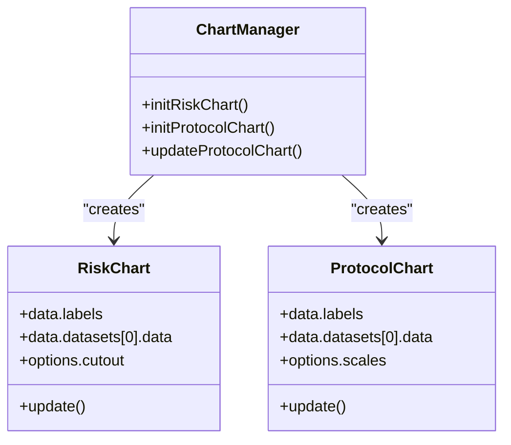

**Diagram sources**
- [app.js:40](file://backend/static/app.js#L40)
- [app.js:45](file://backend/static/app.js#L45)
- [app.js:70](file://backend/static/app.js#L70)

**Section sources**
- [app.js:40](file://backend/static/app.js#L40)
- [app.js:45](file://backend/static/app.js#L45)
- [app.js:70](file://backend/static/app.js#L70)

### Device Discovery and Live Scanning
- Wi-Fi scan: Starts background Nmap scan; polls status; broadcasts progress and completion.
- BLE scan: Uses BleakScanner if available; otherwise falls back to simulated.
- Zigbee/Thread/Z-Wave/Lora scans: Hardware detection and simulated fallbacks.
- Scan progress UI: Progress container with animated progress bar and status text.

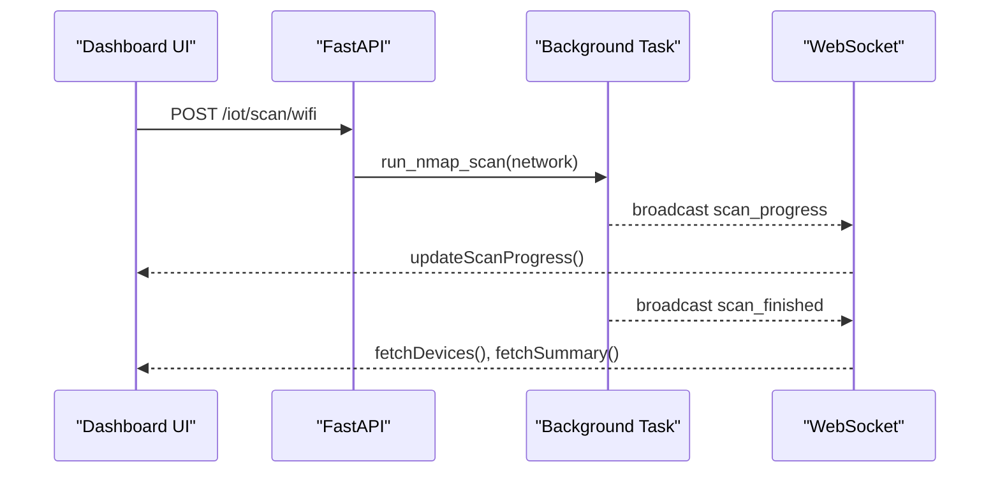

**Diagram sources**
- [app.js:840](file://backend/static/app.js#L840)
- [iot.py:291](file://backend/routers/iot.py#L291)
- [iot.py:300](file://backend/routers/iot.py#L300)

**Section sources**
- [app.js:840](file://backend/static/app.js#L840)
- [iot.py:291](file://backend/routers/iot.py#L291)
- [wifi_bt.py:182](file://backend/routers/wifi_bt.py#L182)

### Device Table and Detail Panel
- Table rendering: Dynamically builds rows with protocol icons, IP/MAC, hostname/vendor, risk badges.
- Selection: Click row to select device; detail panel shows vendor, OS guess, open ports, and vulnerabilities.
- Actions: Deep port scan, default credential test, AI analysis.

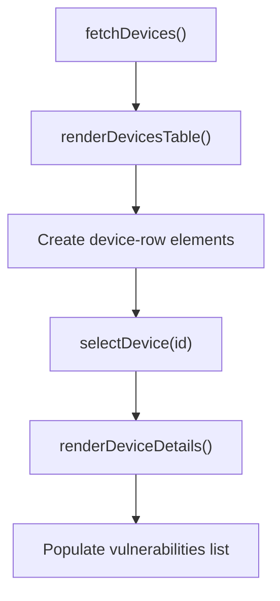

**Diagram sources**
- [app.js:331](file://backend/static/app.js#L331)
- [app.js:344](file://backend/static/app.js#L344)
- [app.js:380](file://backend/static/app.js#L380)
- [app.js:386](file://backend/static/app.js#L386)

**Section sources**
- [app.js:331](file://backend/static/app.js#L331)
- [app.js:344](file://backend/static/app.js#L344)
- [app.js:380](file://backend/static/app.js#L380)
- [app.js:386](file://backend/static/app.js#L386)

### AI Security Score and Recommendations
- AI Security Score: Circular progress indicator with grade and description.
- AI Suggestions: Dynamic list with actionable items; clicking “Take Action” triggers scans or selections.
- Device AI Analysis: Predicted vulnerabilities and anomaly warnings.

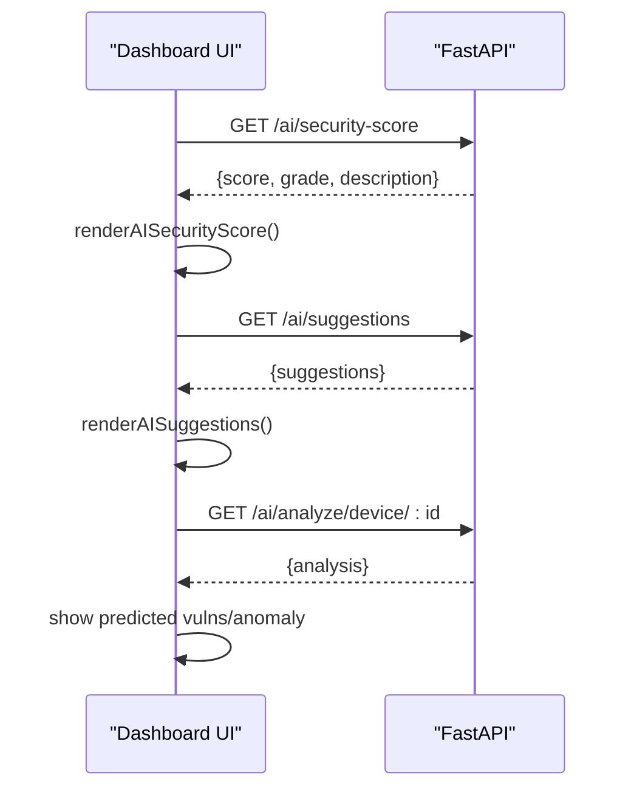

**Diagram sources**
- [app.js:930](file://backend/static/app.js#L930)
- [app.js:992](file://backend/static/app.js#L992)
- [app.js:1025](file://backend/static/app.js#L1025)

**Section sources**
- [app.js:930](file://backend/static/app.js#L930)
- [app.js:992](file://backend/static/app.js#L992)
- [app.js:1025](file://backend/static/app.js#L1025)

### Authentication and Settings
- Login page validates credentials against backend and stores session flag.
- Settings endpoint allows toggling simulation mode and adjusting Nmap timeout.

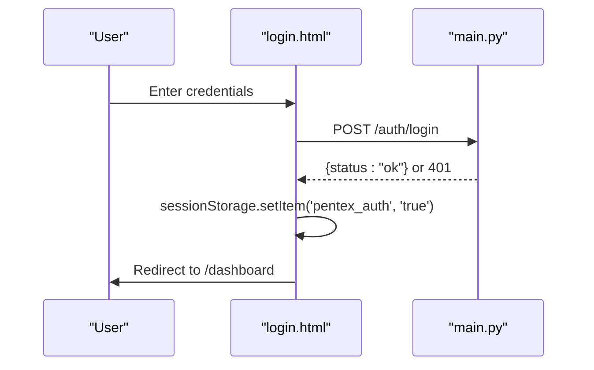

**Diagram sources**
- [login.html:189](file://backend/static/login.html#L189)
- [main.py:70](file://backend/main.py#L70)

**Section sources**
- [login.html:189](file://backend/static/login.html#L189)
- [main.py:50](file://backend/main.py#L50)

## Dependency Analysis
- Frontend depends on Chart.js CDN for analytics, FontAwesome for icons, and local CSS/JS.
- Backend exposes REST endpoints grouped by routers: IoT, Wireless/BLE, Access Control (RFID), Reports, AI.
- WebSocket is centralized via ConnectionManager and broadcast to clients.

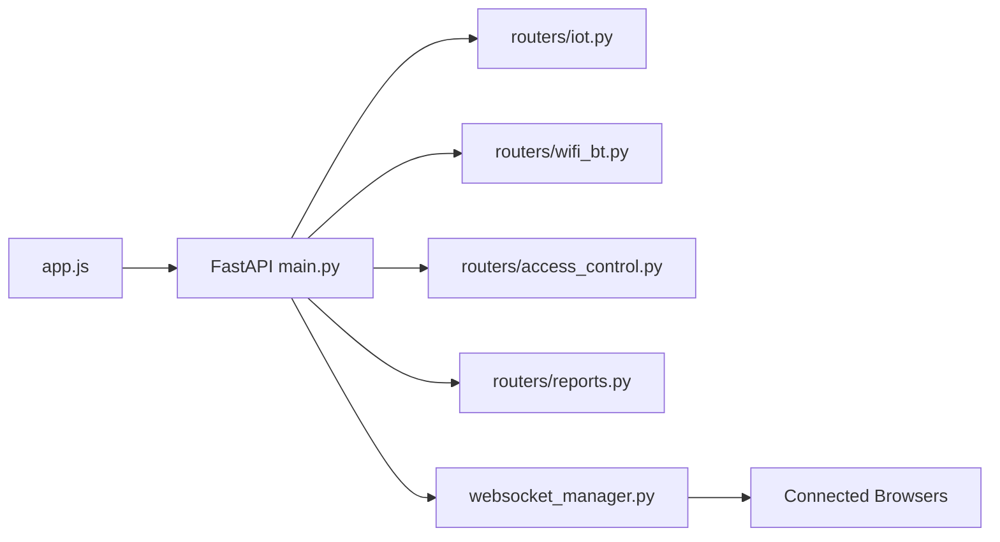

**Diagram sources**
- [app.js:1](file://backend/static/app.js#L1)
- [main.py:14](file://backend/main.py#L14)
- [iot.py:24](file://backend/routers/iot.py#L24)
- [wifi_bt.py:27](file://backend/routers/wifi_bt.py#L27)
- [access_control.py:13](file://backend/routers/access_control.py#L13)
- [reports.py:15](file://backend/routers/reports.py#L15)
- [websocket_manager.py:7](file://backend/websocket_manager.py#L7)

**Section sources**
- [main.py:14](file://backend/main.py#L14)
- [websocket_manager.py:7](file://backend/websocket_manager.py#L7)

## Performance Considerations
- Chart updates: Batch updates and avoid frequent re-creation; reuse Chart instances.
- WebSocket: Heartbeat keeps connections alive; automatic reconnect on close.
- Polling: Scan status polling interval is reasonable; consider debouncing rapid UI updates.
- Rendering: Virtualize large tables if device counts grow significantly.
- Assets: CDN-hosted Chart.js and FontAwesome reduce local bandwidth; cache aggressively.

[No sources needed since this section provides general guidance]

## Troubleshooting Guide
- WebSocket not connecting: Verify backend is running and CORS allows connections; check browser console for errors.
- Charts not rendering: Ensure Chart.js is loaded and canvas contexts are available.
- Scans stuck at 0%: Confirm background tasks are running and WebSocket broadcast is active.
- Authentication failures: Check credentials and ensure session storage flag is set post-login.
- Toast audio: Some browsers block autoplay; user gesture required for audio playback.

**Section sources**
- [app.js:113](file://backend/static/app.js#L113)
- [app.js:164](file://backend/static/app.js#L164)
- [login.html:189](file://backend/static/login.html#L189)

## Conclusion
The PentexOne dashboard combines a modern dark theme with responsive design, real-time updates, and robust analytics. Its modular architecture integrates seamlessly with backend routers and WebSocket broadcasting, enabling live device discovery and actionable insights. The UI emphasizes clarity and safety with risk-based badges, animated feedback, and accessible controls.

[No sources needed since this section summarizes without analyzing specific files]

## Appendices

### Usage Examples and Code Snippet Paths
- Dashboard initialization and real-time updates:
  - [app.js:14](file://backend/static/app.js#L14)
  - [app.js:113](file://backend/static/app.js#L113)
- Real-time data binding and toast notifications:
  - [app.js:128](file://backend/static/app.js#L128)
  - [app.js:164](file://backend/static/app.js#L164)
- User interaction handling (navigation, scans, actions):
  - [index.html:26](file://backend/static/index.html#L26)
  - [app.js:840](file://backend/static/app.js#L840)
  - [app.js:380](file://backend/static/app.js#L380)
- Analytics with Chart.js:
  - [app.js:40](file://backend/static/app.js#L40)
  - [app.js:70](file://backend/static/app.js#L70)
- Backend WebSocket integration:
  - [main.py:90](file://backend/main.py#L90)
  - [websocket_manager.py:21](file://backend/websocket_manager.py#L21)

### Customization Guidelines
- Theming: Adjust CSS variables in :root to change accents, backgrounds, and status colors.
- Layout: Modify grid and flex properties in .stats-grid, .charts-row, .dashboard-layout for different screen sizes.
- Animations: Toast animations and transitions are defined in CSS; adjust timing and easing as needed.
- Components: Extend .glass-panel styles for additional panels; reuse button variants for consistency.

**Section sources**
- [style.css:1](file://backend/static/style.css#L1)
- [style.css:423](file://backend/static/style.css#L423)
- [style.css:922](file://backend/static/style.css#L922)

### Accessibility Considerations
- Keyboard navigation: Ensure focus order follows visual layout; buttons and links are keyboard accessible.
- Color contrast: Verify sufficient contrast for text and status badges against dark backgrounds.
- ARIA roles: Add roles and labels for dynamic regions updated by WebSocket messages.
- Screen readers: Announce toast messages and critical alerts; provide skip links to main content.

[No sources needed since this section provides general guidance]

### Cross-Browser Compatibility
- Chart.js: Tested on modern browsers; ensure Canvas support and ES6 availability.
- WebSocket: Use wss on HTTPS; gracefully degrade on unsupported environments.
- CSS: Backdrop-filter requires Safari 14+; provide fallbacks for older browsers.
- Fetch API: Polyfill if targeting legacy browsers; promises are widely supported.

[No sources needed since this section provides general guidance]

### Integration Patterns with Backend Endpoints
- Authentication:
  - POST /auth/login
  - Redirect to /dashboard on success
- Dashboard data:
  - GET /reports/summary
  - GET /iot/devices
  - GET /rfid/cards
  - GET /settings
  - PUT /settings
- Scanning:
  - POST /iot/scan/wifi
  - POST /wireless/scan/bluetooth
  - POST /iot/scan/zigbee
  - POST /iot/scan/thread
  - POST /iot/scan/zwave
  - POST /iot/scan/lora
  - GET /iot/scan/status
- Wireless utilities:
  - POST /wireless/test/ports/{ip}
  - POST /wireless/test/credentials/{ip}
  - GET /wireless/scan/ssids
  - POST /wireless/tls/check/{host}
- Reports:
  - GET /reports/generate/pdf
- AI:
  - GET /ai/security-score
  - GET /ai/suggestions
  - GET /ai/analyze/device/{id}

**Section sources**
- [main.py:50](file://backend/main.py#L50)
- [iot.py:591](file://backend/routers/iot.py#L591)
- [wifi_bt.py:59](file://backend/routers/wifi_bt.py#L59)
- [wifi_bt.py:182](file://backend/routers/wifi_bt.py#L182)
- [reports.py:37](file://backend/routers/reports.py#L37)