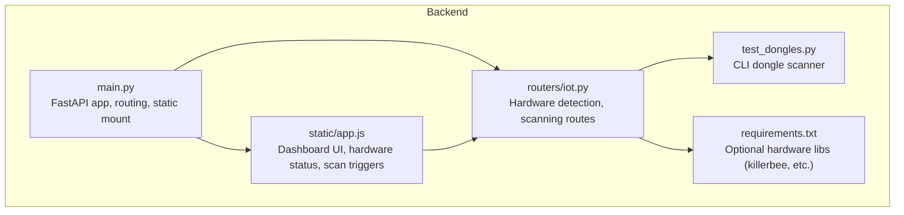
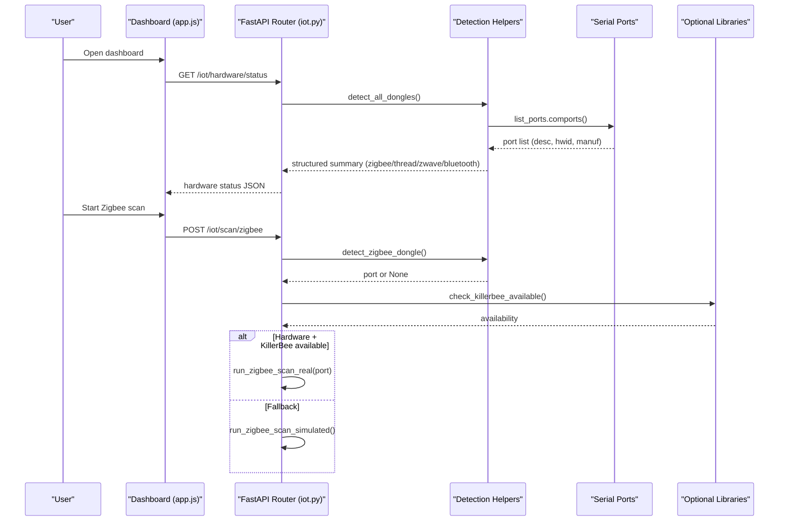
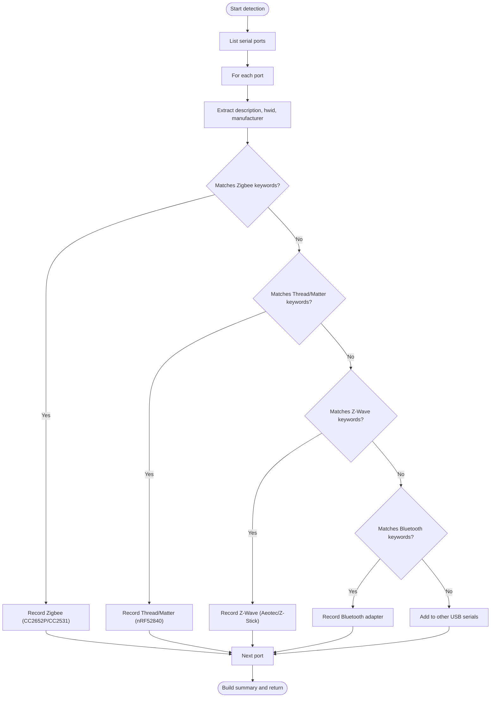
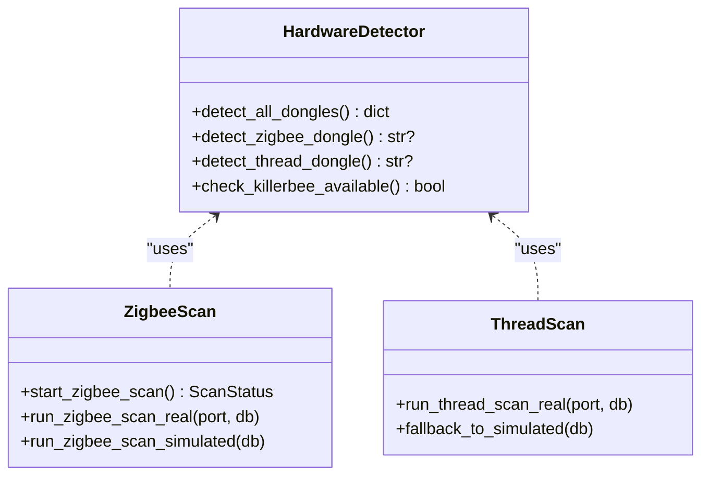
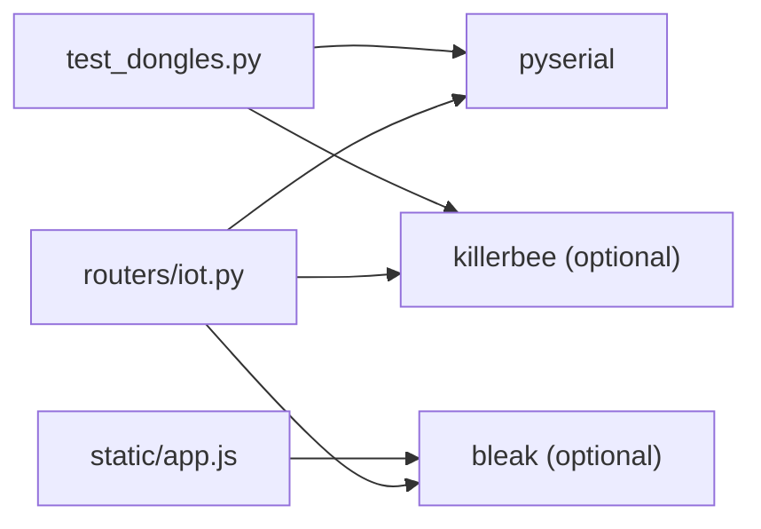

# Hardware Detection and Compatibility

<cite>
**Referenced Files in This Document**
- [HARDWARE_GUIDE.md](file://backend/HARDWARE_GUIDE.md)
- [test_dongles.py](file://backend/test_dongles.py)
- [iot.py](file://backend/routers/iot.py)
- [main.py](file://backend/main.py)
- [requirements.txt](file://backend/requirements.txt)
- [app.js](file://backend/static/app.js)
</cite>

## Table of Contents
1. [Introduction](#introduction)
2. [Project Structure](#project-structure)
3. [Core Components](#core-components)
4. [Architecture Overview](#architecture-overview)
5. [Detailed Component Analysis](#detailed-component-analysis)
6. [Dependency Analysis](#dependency-analysis)
7. [Performance Considerations](#performance-considerations)
8. [Troubleshooting Guide](#troubleshooting-guide)
9. [Conclusion](#conclusion)
10. [Appendices](#appendices)

## Introduction
This document explains PentexOne’s universal hardware compatibility system for detecting and interacting with USB-based IoT protocol dongles. It details the automatic detection algorithm that inspects serial ports for Zigbee (CC2652P/CC2531), Thread/Matter (nRF52840), Z-Wave (Aeotec Z-Stick 7), and Bluetooth adapters. It also documents the hardware abstraction layer that provides unified interfaces regardless of specific dongle models, the detection summary format and status indicators, fallback mechanisms when hardware is not detected, and the impact on scanning capabilities. Finally, it presents compatibility matrices for supported dongle variants and their features.

## Project Structure
The hardware detection and compatibility logic spans several backend modules:
- A CLI utility to quickly scan and summarize connected dongles
- A FastAPI router module that exposes hardware detection and scanning endpoints
- A main application module that wires routers and serves the dashboard
- A frontend JavaScript module that consumes hardware status and triggers scans
- A requirements file that declares optional hardware libraries

**Diagram sources**
- [main.py:1-106](file://backend/main.py#L1-L106)
- [iot.py:26-156](file://backend/routers/iot.py#L26-L156)
- [test_dongles.py:14-132](file://backend/test_dongles.py#L14-L132)
- [app.js:811-849](file://backend/static/app.js#L811-L849)
- [requirements.txt:14-21](file://backend/requirements.txt#L14-L21)

**Section sources**
- [main.py:1-106](file://backend/main.py#L1-L106)
- [iot.py:26-156](file://backend/routers/iot.py#L26-L156)
- [test_dongles.py:1-152](file://backend/test_dongles.py#L1-L152)
- [app.js:811-849](file://backend/static/app.js#L811-L849)
- [requirements.txt:1-21](file://backend/requirements.txt#L1-L21)

## Core Components
- Automatic hardware detection algorithm:
  - Scans serial ports and matches against keywords in description and hardware ID fields
  - Identifies Zigbee (CC2652P/CC2531), Thread/Matter (nRF52840), Z-Wave (Aeotec Z-Stick 7), and Bluetooth adapters
  - Aggregates results into a structured summary with status indicators
- Hardware abstraction layer:
  - Unified detection functions return standardized identifiers (port, chip, type)
  - Scanning routes branch to real hardware scans (when available) or simulated scans
- Fallback mechanisms:
  - When hardware is not detected or required libraries are missing, the system falls back to simulated scans
- Dashboard integration:
  - Frontend displays hardware status and allows initiating scans per protocol

**Section sources**
- [iot.py:26-156](file://backend/routers/iot.py#L26-L156)
- [test_dongles.py:14-132](file://backend/test_dongles.py#L14-L132)
- [iot.py:483-585](file://backend/routers/iot.py#L483-L585)
- [iot.py:841-879](file://backend/routers/iot.py#L841-L879)
- [app.js:811-849](file://backend/static/app.js#L811-L849)

## Architecture Overview
The hardware detection pipeline integrates the CLI scanner, the FastAPI router, and the frontend dashboard. The router exposes endpoints to query hardware status and initiate scans. When hardware is present and properly configured, real scans are executed; otherwise, simulated scans are used.

**Diagram sources**
- [iot.py:26-156](file://backend/routers/iot.py#L26-L156)
- [iot.py:483-585](file://backend/routers/iot.py#L483-L585)
- [iot.py:841-879](file://backend/routers/iot.py#L841-L879)
- [app.js:811-849](file://backend/static/app.js#L811-L849)

## Detailed Component Analysis

### Automatic Hardware Detection Algorithm
The detection algorithm scans serial ports and applies keyword-based matching across:
- Port description
- Hardware ID
- Manufacturer and serial number (for diagnostics)

It categorizes devices into Zigbee, Thread/Matter, Z-Wave, and Bluetooth, and records:
- Port path
- Chip/model identifier
- Type and status
- Manufacturer (where available)

**Diagram sources**
- [iot.py:26-156](file://backend/routers/iot.py#L26-L156)
- [test_dongles.py:14-132](file://backend/test_dongles.py#L14-L132)

**Section sources**
- [iot.py:26-156](file://backend/routers/iot.py#L26-L156)
- [test_dongles.py:14-132](file://backend/test_dongles.py#L14-L132)

### Hardware Abstraction Layer
The abstraction layer provides:
- Unified detection functions returning standardized identifiers
- Ready-state checks for protocol-specific libraries (e.g., KillerBee for Zigbee)
- Routing endpoints that encapsulate detection and scanning logic

Key functions:
- detect_all_dongles(): comprehensive detection and summary
- detect_zigbee_dongle(): returns Zigbee port or None
- detect_thread_dongle(): returns Thread/Matter port or None
- check_killerbee_available(): availability gate for real Zigbee scans

**Diagram sources**
- [iot.py:26-156](file://backend/routers/iot.py#L26-L156)
- [iot.py:483-585](file://backend/routers/iot.py#L483-L585)
- [iot.py:637-666](file://backend/routers/iot.py#L637-L666)

**Section sources**
- [iot.py:26-156](file://backend/routers/iot.py#L26-L156)
- [iot.py:483-585](file://backend/routers/iot.py#L483-L585)
- [iot.py:637-666](file://backend/routers/iot.py#L637-L666)

### Detection Summary Format and Status Indicators
Both the CLI and router expose a consistent summary:
- Zigbee: connected/not connected; port; chip (CC2652P/CC2531)
- Thread/Matter: connected/not connected; port; chip (nRF52840)
- Z-Wave: connected/not connected; port
- Bluetooth: connected/not connected; port
- Other USB serial devices: count and descriptors
- Total dongles connected
- Ready indicators per protocol (e.g., KillerBee availability for Zigbee)

Status indicators:
- ✅ CONNECTED or CONNECTED ✅
- ❌ NOT CONNECTED
- ℹ️ Using built-in (if applicable)

**Section sources**
- [test_dongles.py:93-132](file://backend/test_dongles.py#L93-L132)
- [iot.py:118-155](file://backend/routers/iot.py#L118-L155)
- [iot.py:841-879](file://backend/routers/iot.py#L841-L879)

### Fallback Mechanisms and Impact on Scanning Capabilities
- Zigbee:
  - Real scan requires a Zigbee dongle and KillerBee library
  - Without hardware or library, the system runs a simulated Zigbee scan
- Thread/Matter:
  - Real scan uses external tools; if none found, falls back to simulated discovery
- Z-Wave and Bluetooth:
  - No external library dependency; scanning proceeds with detected ports
- Impact:
  - Real scans provide deeper protocol insights; simulated scans offer baseline coverage for development and testing

**Section sources**
- [iot.py:483-493](file://backend/routers/iot.py#L483-L493)
- [iot.py:552-585](file://backend/routers/iot.py#L552-L585)
- [iot.py:637-666](file://backend/routers/iot.py#L637-L666)
- [requirements.txt:14-16](file://backend/requirements.txt#L14-L16)

### Compatibility Matrix
Supported dongle families and chips:
- Zigbee
  - CC2652P (recommended)
  - CC2531 (older)
- Thread/Matter
  - nRF52840 dongle (recommended)
  - Alternative: SkyConnect (supports Zigbee and Thread)
- Z-Wave
  - Aeotec Z-Stick 7 (recommended)
  - Zooz Z-Wave Plus S2 Stick (alternative)
- Bluetooth
  - Built-in on Raspberry Pi (BLE 4.0+)
  - USB Bluetooth adapters (CSR, Broadcom, Intel)

Notes:
- The detection algorithm matches keywords in port descriptions and hardware IDs
- Some dongles may require firmware or drivers depending on the host OS

**Section sources**
- [HARDWARE_GUIDE.md:46-123](file://backend/HARDWARE_GUIDE.md#L46-L123)
- [iot.py:56-92](file://backend/routers/iot.py#L56-L92)
- [test_dongles.py:41-80](file://backend/test_dongles.py#L41-L80)

## Dependency Analysis
External dependencies relevant to hardware detection and scanning:
- pyserial: enumerates serial ports
- killerbee: optional Zigbee sniffing
- bleak: optional Bluetooth scanning (referenced in frontend usage)
- Additional IoT libraries (optional)

**Diagram sources**
- [requirements.txt:11-16](file://backend/requirements.txt#L11-L16)
- [iot.py:505-505](file://backend/routers/iot.py#L505-L505)
- [app.js:655-672](file://backend/static/app.js#L655-L672)

**Section sources**
- [requirements.txt:1-21](file://backend/requirements.txt#L1-L21)
- [iot.py:505-505](file://backend/routers/iot.py#L505-L505)
- [app.js:655-672](file://backend/static/app.js#L655-L672)

## Performance Considerations
- Use a powered USB hub for multiple dongles to avoid power-related enumeration issues
- On Raspberry Pi 3, reduce memory usage and disable unused services to maintain responsiveness
- Prefer CC2652P for Zigbee and nRF52840 for Thread/Matter for optimal performance and reliability

[No sources needed since this section provides general guidance]

## Troubleshooting Guide
Common issues and resolutions:
- USB dongle not detected
  - Verify permissions and reboot
  - Check kernel messages for USB/TTY errors
- Bluetooth not working
  - Restart the Bluetooth service or reinstall BlueZ
- Wi-Fi scanning fails
  - Ensure interface is not busy; temporarily disable network manager Wi-Fi during scan
- Service won’t start
  - Check systemd logs and port conflicts; try manual startup

**Section sources**
- [HARDWARE_GUIDE.md:252-309](file://backend/HARDWARE_GUIDE.md#L252-L309)

## Conclusion
PentexOne’s hardware detection system automatically identifies Zigbee, Thread/Matter, Z-Wave, and Bluetooth adapters by inspecting serial port metadata. The hardware abstraction layer provides unified interfaces and graceful fallbacks when hardware or libraries are unavailable. The result is a robust, compatible platform that adapts scanning capabilities to the installed hardware while maintaining a consistent user experience across protocols.

[No sources needed since this section summarizes without analyzing specific files]

## Appendices

### Detection Keyword Reference
- Zigbee: CC2652, CC2531, ZIGBEE, TI, CP210, SILICON LABS
- Thread/Matter: NRF, NORDIC, THREAD, MATTER, JLINK, 52840
- Z-Wave: ZWAVE, Z-WAVE, AEOTEC, Z-STICK, SIGMA
- Bluetooth: BLUETOOTH, CSR, BROADCOM, INTEL BT

**Section sources**
- [iot.py:56-104](file://backend/routers/iot.py#L56-L104)
- [test_dongles.py:41-80](file://backend/test_dongles.py#L41-L80)