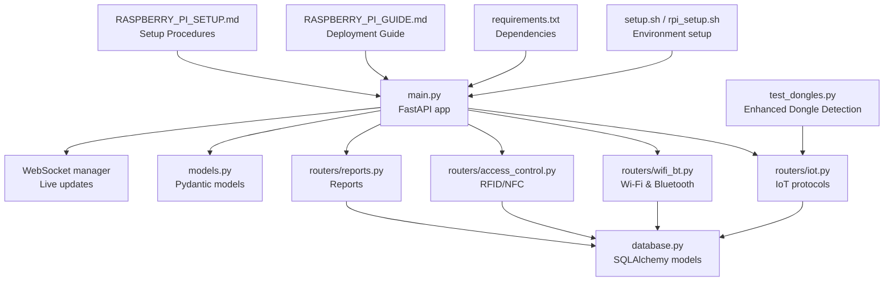
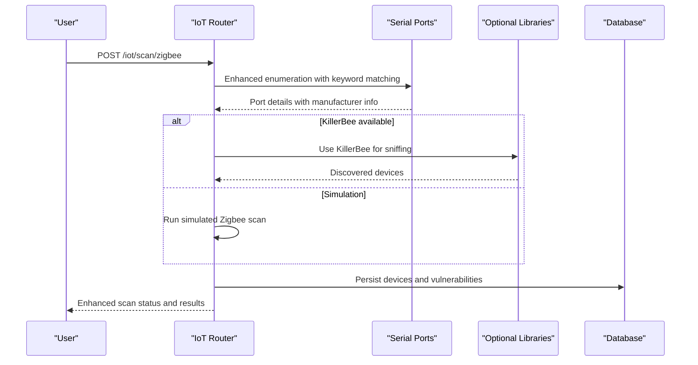
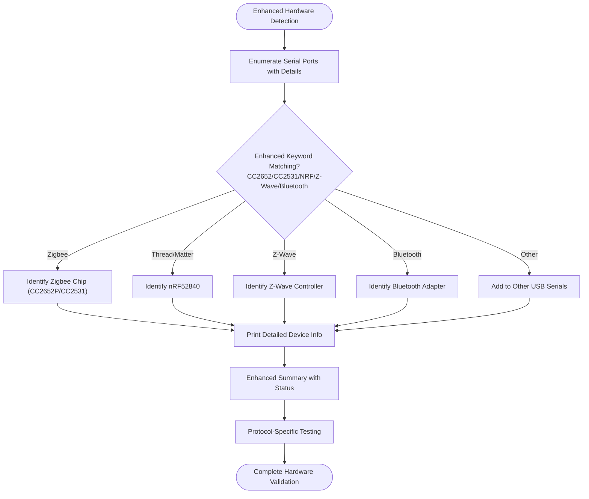
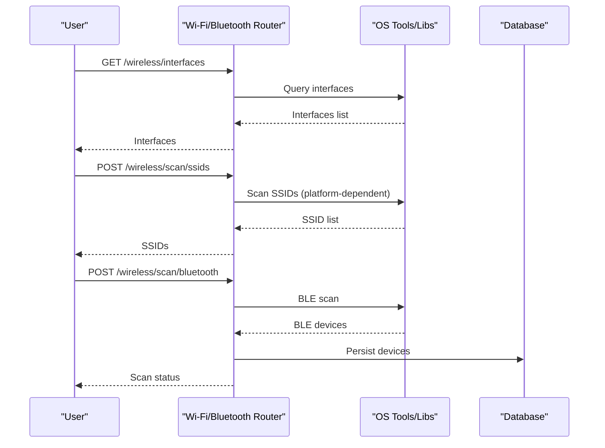
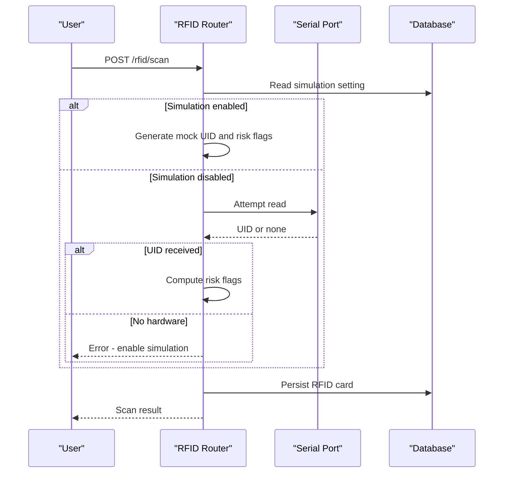
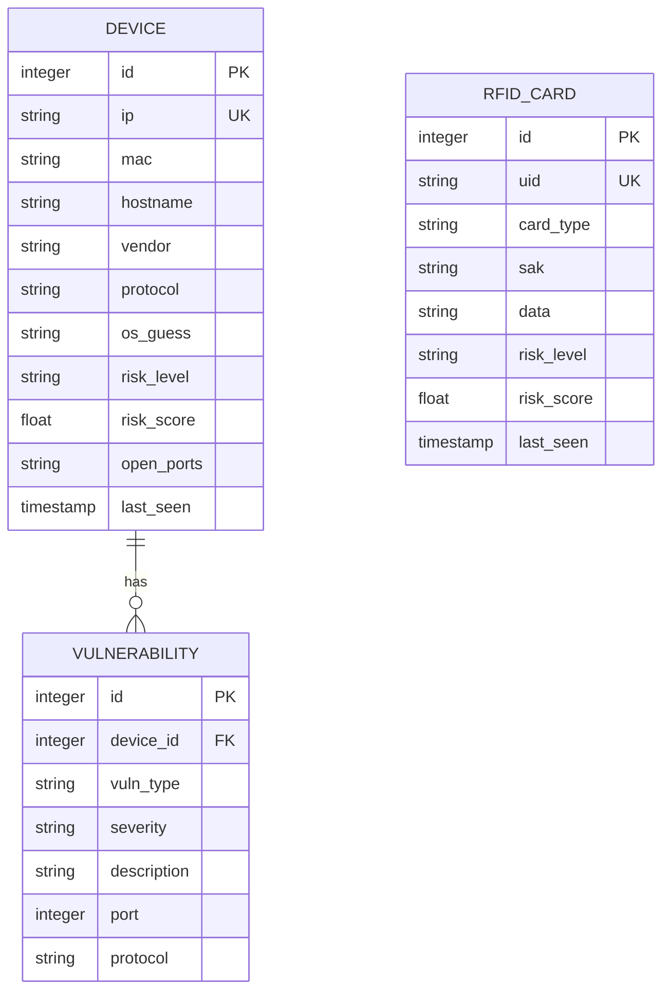
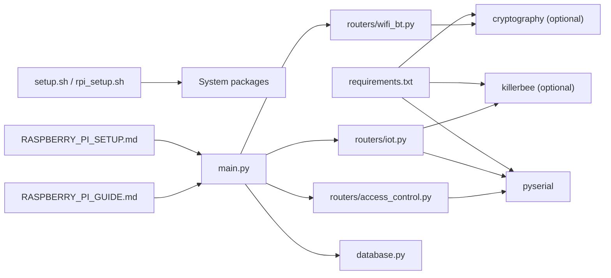

# Hardware Integration

<cite>
**Referenced Files in This Document**
- [HARDWARE_GUIDE.md](file://backend/HARDWARE_GUIDE.md)
- [README.md](file://backend/README.md)
- [RASPBERRY_PI_GUIDE.md](file://backend/RASPBERRY_PI_GUIDE.md)
- [RASPBERRY_PI_SETUP.md](file://RASPBERRY_PI_SETUP.md)
- [DEPLOYMENT_CHECKLIST.md](file://backend/DEPLOYMENT_CHECKLIST.md)
- [test_dongles.py](file://backend/test_dongles.py)
- [main.py](file://backend/main.py)
- [database.py](file://backend/database.py)
- [models.py](file://backend/models.py)
- [routers/iot.py](file://backend/routers/iot.py)
- [routers/wifi_bt.py](file://backend/routers/wifi_bt.py)
- [routers/access_control.py](file://backend/routers/access_control.py)
- [routers/reports.py](file://backend/routers/reports.py)
- [setup.sh](file://backend/setup.sh)
- [rpi_setup.sh](file://backend/rpi_setup.sh)
- [requirements.txt](file://backend/requirements.txt)
</cite>

## Update Summary
**Changes Made**
- Added comprehensive Raspberry Pi setup documentation coverage
- Enhanced hardware testing procedures section with new testing methodologies
- Updated deployment guidelines to include both English and Arabic documentation
- Expanded troubleshooting guides with Raspberry Pi-specific solutions
- Added new hardware compatibility matrices and setup instructions

## Table of Contents
1. [Introduction](#introduction)
2. [Project Structure](#project-structure)
3. [Core Components](#core-components)
4. [Architecture Overview](#architecture-overview)
5. [Detailed Component Analysis](#detailed-component-analysis)
6. [Dependency Analysis](#dependency-analysis)
7. [Performance Considerations](#performance-considerations)
8. [Troubleshooting Guide](#troubleshooting-guide)
9. [Conclusion](#conclusion)
10. [Appendices](#appendices)

## Introduction
This document provides comprehensive hardware integration guidance for PentexOne's IoT protocol support. It explains how the system detects and interacts with USB dongles and serial-based devices, documents supported hardware (Zigbee, Thread/Matter, Z-Wave, LoRaWAN, RFID readers), and outlines the hardware abstraction layer, driver requirements, and permission configurations. The documentation now includes extensive Raspberry Pi setup procedures, dual-language support (English and Arabic), and enhanced hardware testing methodologies. It also covers dongle testing procedures, compatibility matrices, setup instructions, power and deployment considerations, and troubleshooting guidance.

## Project Structure
PentexOne organizes hardware-related capabilities across several backend modules with comprehensive Raspberry Pi support:
- Hardware detection and dongle testing utilities with enhanced testing procedures
- Protocol-specific routers for Wi-Fi, Bluetooth, Zigbee, Thread/Matter, Z-Wave, LoRaWAN, and RFID
- Database models for persistent storage of discovered devices and RFID cards
- Setup and Raspberry Pi deployment scripts that prepare the environment for hardware access
- Comprehensive documentation covering both English and Arabic setups

**Diagram sources**
- [main.py:1-106](file://backend/main.py#L1-L106)
- [routers/iot.py:1-880](file://backend/routers/iot.py#L1-L880)
- [routers/wifi_bt.py:1-766](file://backend/routers/wifi_bt.py#L1-L766)
- [routers/access_control.py:1-95](file://backend/routers/access_control.py#L1-L95)
- [routers/reports.py:1-158](file://backend/routers/reports.py#L1-L158)
- [database.py:1-80](file://backend/database.py#L1-L80)
- [models.py:1-71](file://backend/models.py#L1-L71)
- [test_dongles.py:1-152](file://backend/test_dongles.py#L1-L152)
- [setup.sh:1-142](file://backend/setup.sh#L1-L142)
- [rpi_setup.sh:1-163](file://backend/rpi_setup.sh#L1-L163)
- [requirements.txt:1-21](file://backend/requirements.txt#L1-L21)
- [RASPBERRY_PI_GUIDE.md:1-639](file://backend/RASPBERRY_PI_GUIDE.md#L1-L639)
- [RASPBERRY_PI_SETUP.md:1-294](file://RASPBERRY_PI_SETUP.md#L1-L294)

**Section sources**
- [main.py:1-106](file://backend/main.py#L1-L106)
- [README.md:272-297](file://backend/README.md#L272-L297)

## Core Components
- Hardware detection and dongle testing:
  - A dedicated script enumerates serial ports and identifies Zigbee, Thread/Matter, Z-Wave, and Bluetooth adapters with enhanced detection algorithms.
  - The IoT router includes a detection routine that mirrors the script's logic for runtime checks.
  - New hardware testing procedures include comprehensive validation steps for each protocol type.
- Protocol routers:
  - Wi-Fi and Bluetooth: Wi-Fi scanning and SSID discovery; BLE scanning via a cross-platform library.
  - Zigbee: Real hardware scanning using KillerBee when available; otherwise simulated.
  - Thread/Matter: mDNS discovery and fallback to simulated scans.
  - Z-Wave: Uses serial communication to probe a Z-Wave controller.
  - LoRaWAN: Simulated scanning with a note that hardware support is experimental.
  - RFID/NFC: Serial-based reader detection and simulated reads controlled by settings.
- Database models:
  - Persistent storage for discovered devices and RFID cards, enabling historical tracking and reporting.
- Setup and deployment:
  - Scripts install system and Python dependencies, configure Bluetooth, and set up a systemd service for Raspberry Pi.
  - Comprehensive dual-language documentation supporting both English and Arabic users.

**Section sources**
- [test_dongles.py:14-152](file://backend/test_dongles.py#L14-L152)
- [routers/iot.py:27-156](file://backend/routers/iot.py#L27-L156)
- [routers/wifi_bt.py:17-27](file://backend/routers/wifi_bt.py#L17-L27)
- [routers/access_control.py:29-45](file://backend/routers/access_control.py#L29-L45)
- [database.py:12-55](file://backend/database.py#L12-L55)
- [setup.sh:84-120](file://backend/setup.sh#L84-L120)
- [rpi_setup.sh:41-110](file://backend/rpi_setup.sh#L41-L110)
- [RASPBERRY_PI_GUIDE.md:16-26](file://backend/RASPBERRY_PI_GUIDE.md#L16-L26)
- [RASPBERRY_PI_SETUP.md:1-294](file://RASPBERRY_PI_SETUP.md#L1-L294)

## Architecture Overview
The hardware integration architecture centers on serial and USB-based device enumeration and protocol-specific scanning backends. The system distinguishes between:
- Built-in protocols (Wi-Fi and Bluetooth) handled by the operating system and libraries
- Optional external dongles accessed via serial ports and specialized libraries
- Comprehensive Raspberry Pi deployment with systemd service management

```mermaid
graph TB
subgraph "Host OS"
OS["Linux/macOS"]
USB["USB Controllers"]
BL["Bluetooth Stack"]
NET["Network Stack"]
RPi["Raspberry Pi OS"]
ENDUSER["Dual-Language Users"]
end
subgraph "PentexOne Backend"
API["FastAPI App"]
WS["WebSocket Manager"]
DB["SQLite via SQLAlchemy"]
DET["Enhanced Dongle Detection"]
WIFI["Wi-Fi/Bluetooth Router"]
IOT["IoT Protocols Router"]
RFID["RFID Router"]
REP["Reports Router"]
SETUP["Raspberry Pi Setup"]
TEST["Hardware Testing"]
ENDUSER --> SETUP
ENDUSER --> TEST
ENDUSER --> API
ENDUSER --> DET
ENDUSER --> WIFI
ENDUSER --> IOT
ENDUSER --> RFID
ENDUSER --> REP
ENDUSER --> WS
ENDUSER --> DB
ENDUSER --> RPi
ENDUSER --> OS
ENDUSER --> USB
ENDUSER --> BL
ENDUSER --> NET
ENDUSER --> DET
ENDUSER --> WIFI
ENDUSER --> IOT
ENDUSER --> RFID
ENDUSER --> REP
ENDUSER --> WS
ENDUSER --> DB
ENDUSER --> SETUP
ENDUSER --> TEST
end
```

**Diagram sources**
- [main.py:14-48](file://backend/main.py#L14-L48)
- [routers/iot.py:27-156](file://backend/routers/iot.py#L27-L156)
- [routers/wifi_bt.py:17-27](file://backend/routers/wifi_bt.py#L17-L27)
- [routers/access_control.py:13-13](file://backend/routers/access_control.py#L13-L13)
- [database.py:69-80](file://backend/database.py#L69-L80)
- [RASPBERRY_PI_GUIDE.md:16-26](file://backend/RASPBERRY_PI_GUIDE.md#L16-L26)
- [RASPBERRY_PI_SETUP.md:1-294](file://RASPBERRY_PI_SETUP.md#L1-L294)

## Detailed Component Analysis

### Hardware Abstraction Layer and Serial Communication
- Serial port enumeration:
  - Both the standalone script and the IoT router use the same serial port enumeration mechanism to detect dongles by description and hardware ID keywords.
  - Enhanced detection algorithm includes comprehensive keyword matching for Zigbee (CC2652, CC2531), Thread/Matter (NRF, Nordic), Z-Wave (Z-Wave, Aeotec), and Bluetooth adapters.
- Zigbee:
  - Real scanning uses a specialized library when available; otherwise, simulated scans are performed.
  - Channel selection and packet sniffing are part of the real scan path.
- Thread/Matter:
  - mDNS discovery is used to locate devices; a fallback to simulated scans occurs when hardware is unavailable.
- Z-Wave:
  - Serial communication is used to send commands to a Z-Wave controller when detected.
- LoRaWAN:
  - Scanning is currently simulated; hardware support is noted as experimental.
- RFID/NFC:
  - Serial-based reader probing attempts to read UIDs; a simulation mode is available when no hardware is detected.

**Diagram sources**
- [routers/iot.py:483-550](file://backend/routers/iot.py#L483-L550)
- [routers/iot.py:552-586](file://backend/routers/iot.py#L552-L586)
- [test_dongles.py:41-80](file://backend/test_dongles.py#L41-L80)

**Section sources**
- [test_dongles.py:14-152](file://backend/test_dongles.py#L14-L152)
- [routers/iot.py:27-156](file://backend/routers/iot.py#L27-L156)
- [routers/iot.py:483-586](file://backend/routers/iot.py#L483-L586)
- [test_dongles.py:41-80](file://backend/test_dongles.py#L41-L80)

### Enhanced Dongle Detection and Testing
- The detection script now includes comprehensive hardware identification with detailed manufacturer and chip information.
- It categorizes devices by type with enhanced keyword matching and provides detailed status reporting.
- The IoT router exposes a detection routine for runtime checks with improved error handling.
- New hardware testing procedures include protocol-specific validation steps and troubleshooting guidance.

**Diagram sources**
- [test_dongles.py:14-152](file://backend/test_dongles.py#L14-L152)
- [routers/iot.py:27-156](file://backend/routers/iot.py#L27-L156)
- [RASPBERRY_PI_SETUP.md:166-194](file://RASPBERRY_PI_SETUP.md#L166-L194)

**Section sources**
- [test_dongles.py:14-152](file://backend/test_dongles.py#L14-L152)
- [routers/iot.py:27-156](file://backend/routers/iot.py#L27-L156)
- [RASPBERRY_PI_SETUP.md:166-194](file://RASPBERRY_PI_SETUP.md#L166-L194)

### Wi-Fi and Bluetooth Integration
- Wi-Fi:
  - Network discovery and SSID scanning leverage system tools and libraries depending on the platform.
  - A quick network device discovery endpoint performs a ping sweep and broadcasts results.
- Bluetooth:
  - BLE scanning uses a cross-platform library; SSID scanning and TLS validation are also available.

**Diagram sources**
- [routers/wifi_bt.py:39-53](file://backend/routers/wifi_bt.py#L39-L53)
- [routers/wifi_bt.py:245-442](file://backend/routers/wifi_bt.py#L245-L442)
- [routers/wifi_bt.py:182-240](file://backend/routers/wifi_bt.py#L182-L240)

**Section sources**
- [routers/wifi_bt.py:39-53](file://backend/routers/wifi_bt.py#L39-L53)
- [routers/wifi_bt.py:245-442](file://backend/routers/wifi_bt.py#L245-L442)
- [routers/wifi_bt.py:182-240](file://backend/routers/wifi_bt.py#L182-L240)

### RFID/NFC Reader Support
- The RFID router attempts to read from a serial RFID/NFC reader on the first detected serial port.
- If no hardware is found, it falls back to simulated card reads controlled by a simulation setting.
- Risk flags are computed and persisted.

**Diagram sources**
- [routers/access_control.py:47-84](file://backend/routers/access_control.py#L47-L84)

**Section sources**
- [routers/access_control.py:29-45](file://backend/routers/access_control.py#L29-L45)
- [routers/access_control.py:47-84](file://backend/routers/access_control.py#L47-L84)
- [database.py:44-55](file://backend/database.py#L44-L55)

### Database Schema for Hardware-Aware Entities

**Diagram sources**
- [database.py:12-55](file://backend/database.py#L12-L55)

**Section sources**
- [database.py:12-55](file://backend/database.py#L12-L55)

## Dependency Analysis
- External libraries:
  - Serial communication and port enumeration rely on a serial library.
  - Optional hardware support includes a Zigbee sniffer library and cryptography for TLS validation.
- System-level dependencies:
  - Raspberry Pi setup installs Bluetooth stack and related development libraries.
  - Enhanced setup procedures include comprehensive system package management.
- Inter-module dependencies:
  - The IoT router depends on the serial enumeration logic used by the detection script.
  - All routers persist results to the database via SQLAlchemy models.
  - Dual-language documentation supports both English and Arabic user bases.

**Diagram sources**
- [requirements.txt:14-21](file://backend/requirements.txt#L14-L21)
- [setup.sh:105-118](file://backend/setup.sh#L105-L118)
- [rpi_setup.sh:42-62](file://backend/rpi_setup.sh#L42-L62)
- [routers/iot.py:5-6](file://backend/routers/iot.py#L5-L6)
- [routers/wifi_bt.py:17-21](file://backend/routers/wifi_bt.py#L17-L21)
- [routers/access_control.py:4-5](file://backend/routers/access_control.py#L4-L5)
- [main.py:14-48](file://backend/main.py#L14-L48)
- [database.py:1-9](file://backend/database.py#L1-L9)
- [RASPBERRY_PI_SETUP.md:1-294](file://RASPBERRY_PI_SETUP.md#L1-L294)
- [RASPBERRY_PI_GUIDE.md:1-639](file://backend/RASPBERRY_PI_GUIDE.md#L1-L639)

**Section sources**
- [requirements.txt:14-21](file://backend/requirements.txt#L14-L21)
- [setup.sh:105-118](file://backend/setup.sh#L105-L118)
- [rpi_setup.sh:42-62](file://backend/rpi_setup.sh#L42-L62)
- [routers/iot.py:5-6](file://backend/routers/iot.py#L5-L6)
- [routers/wifi_bt.py:17-21](file://backend/routers/wifi_bt.py#L17-L21)
- [routers/access_control.py:4-5](file://backend/routers/access_control.py#L4-L5)
- [main.py:14-48](file://backend/main.py#L14-L48)
- [database.py:1-9](file://backend/database.py#L1-L9)
- [RASPBERRY_PI_SETUP.md:1-294](file://RASPBERRY_PI_SETUP.md#L1-L294)
- [RASPBERRY_PI_GUIDE.md:1-639](file://backend/RASPBERRY_PI_GUIDE.md#L1-L639)

## Performance Considerations
- CPU and memory usage varies by workload; scanning and AI analysis increase resource consumption.
- Recommendations include using Ethernet over Wi-Fi, disabling unused services, and adding swap on lower-RAM devices.
- For multiple USB dongles, use a powered USB hub to avoid power-related detection failures.
- Raspberry Pi-specific optimizations include CPU governor settings and memory management for optimal performance.

## Troubleshooting Guide
Common issues and resolutions with enhanced Raspberry Pi support:
- USB dongle not detected:
  - Verify permissions and reboot after adding the user to required groups.
  - Check kernel messages for USB/tty errors.
  - Use enhanced hardware testing procedures for detailed diagnosis.
- Bluetooth not working:
  - Restart the Bluetooth service and unblock Bluetooth if blocked.
  - Raspberry Pi-specific Bluetooth configuration issues are addressed in the deployment guide.
- Wi-Fi scanning problems:
  - Ensure the interface is not busy; temporarily disable Wi-Fi if needed.
- Service won't start:
  - Check logs, verify port availability, and confirm dependencies are installed.
  - Use systemd service management for reliable startup.
- General diagnostics:
  - Use the deployment checklist to verify service status, port binding, and dashboard accessibility.
  - Enhanced hardware testing procedures provide comprehensive validation steps.

**Section sources**
- [HARDWARE_GUIDE.md:252-309](file://backend/HARDWARE_GUIDE.md#L252-L309)
- [RASPBERRY_PI_GUIDE.md:402-494](file://backend/RASPBERRY_PI_GUIDE.md#L402-L494)
- [RASPBERRY_PI_SETUP.md:197-226](file://RASPBERRY_PI_SETUP.md#L197-L226)
- [DEPLOYMENT_CHECKLIST.md:55-112](file://backend/DEPLOYMENT_CHECKLIST.md#L55-L112)

## Conclusion
PentexOne integrates hardware support through a robust abstraction layer that leverages serial and USB communications, optional specialized libraries, and cross-platform OS tools. The system provides both real hardware scanning (where supported) and simulated modes for environments without physical dongles. With comprehensive Raspberry Pi deployment support, dual-language documentation, and enhanced hardware testing procedures, the system ensures reliable operation across Zigbee, Thread/Matter, Z-Wave, LoRaWAN, and RFID/NFC protocols. The addition of systematic testing procedures and deployment guides makes hardware integration more accessible to users worldwide.

## Appendices

### Supported Hardware and Compatibility Matrix
- Built-in protocols:
  - Wi-Fi and Bluetooth are supported out-of-the-box on Raspberry Pi and compatible systems.
- Optional USB dongles:
  - Zigbee: CC2652P or CC2531; recommended dongle provided.
  - Thread/Matter: Nordic nRF52840 or SkyConnect.
  - Z-Wave: Aeotec Z-Stick 7 or Zooz S2.
  - LoRaWAN: Dragino USB LoRa adapter (experimental).
  - RFID/NFC: RC522/PN532 readers via serial.

**Section sources**
- [README.md:35-46](file://backend/README.md#L35-L46)
- [HARDWARE_GUIDE.md:26-124](file://backend/HARDWARE_GUIDE.md#L26-L124)

### Setup Instructions by Protocol
- Wi-Fi and Bluetooth:
  - Use built-in capabilities; ensure OS tools are available.
- Zigbee:
  - Plug in the dongle; verify detection via serial ports and run the enhanced dongle test script.
- Thread/Matter:
  - Plug in the nRF52840 dongle; detection uses serial enumeration with enhanced keyword matching.
- Z-Wave:
  - Plug in the Z-Wave stick; detection uses serial enumeration with detailed manufacturer identification.
- LoRaWAN:
  - Dragino adapter is supported; scanning is experimental.
- RFID/NFC:
  - Connect the reader; if no hardware is detected, enable simulation mode in settings.

**Section sources**
- [HARDWARE_GUIDE.md:46-124](file://backend/HARDWARE_GUIDE.md#L46-L124)
- [routers/iot.py:483-586](file://backend/routers/iot.py#L483-L586)
- [routers/iot.py:727-778](file://backend/routers/iot.py#L727-L778)
- [routers/access_control.py:47-84](file://backend/routers/access_control.py#L47-L84)
- [RASPBERRY_PI_SETUP.md:166-194](file://RASPBERRY_PI_SETUP.md#L166-L194)

### Driver Requirements and Permissions
- Drivers:
  - KillerBee for Zigbee real scanning.
  - BlueZ for Bluetooth.
  - Optional cryptography for TLS validation.
- Permissions:
  - Add the user to dialout and tty groups to access serial devices.
  - On Raspberry Pi, system packages are installed via the enhanced setup scripts.
  - Enhanced udev rules for proper device access.

**Section sources**
- [requirements.txt:14-21](file://backend/requirements.txt#L14-L21)
- [setup.sh:105-118](file://backend/setup.sh#L105-L118)
- [HARDWARE_GUIDE.md:263-269](file://backend/HARDWARE_GUIDE.md#L263-L269)
- [RASPBERRY_PI_SETUP.md:63-84](file://RASPBERRY_PI_SETUP.md#L63-L84)

### Power Requirements and Optimal Deployment
- Use a quality power supply; multiple dongles increase power draw.
- Prefer a powered USB hub for three or more dongles.
- Consider heat mitigation for Pi 4/5 with cases and heatsinks/fans.
- For best Wi-Fi scanning, use an Ethernet connection and keep Wi-Fi interface free.
- Raspberry Pi-specific power optimization and thermal management.

**Section sources**
- [HARDWARE_GUIDE.md:389-393](file://backend/HARDWARE_GUIDE.md#L389-L393)
- [RASPBERRY_PI_GUIDE.md:346-406](file://backend/RASPBERRY_PI_GUIDE.md#L346-L406)

### Cost-Benefit Analysis for Hardware Combinations
- Basic setup (Wi-Fi + Bluetooth) is minimal in cost and suitable for light use.
- Full setup adds dongles for Zigbee, Thread/Matter, and Z-Wave, increasing cost but enabling comprehensive multi-protocol scanning.
- LoRaWAN support is experimental and may require additional configuration.
- Comprehensive hardware pricing and compatibility matrix for informed decision-making.

**Section sources**
- [README.md:182-212](file://backend/README.md#L182-L212)
- [HARDWARE_GUIDE.md:126-152](file://backend/HARDWARE_GUIDE.md#L126-L152)
- [RASPBERRY_PI_SETUP.md:10-17](file://RASPBERRY_PI_SETUP.md#L10-L17)

### Enhanced Hardware Testing Procedures
- Comprehensive dongle detection with detailed manufacturer and chip identification
- Protocol-specific testing for Zigbee, Thread/Matter, Z-Wave, and Bluetooth
- Systematic validation of hardware functionality and driver compatibility
- Troubleshooting workflows for common hardware integration issues
- Performance optimization recommendations for different Raspberry Pi models

**Section sources**
- [test_dongles.py:14-152](file://backend/test_dongles.py#L14-L152)
- [RASPBERRY_PI_SETUP.md:166-194](file://RASPBERRY_PI_SETUP.md#L166-L194)
- [RASPBERRY_PI_GUIDE.md:402-494](file://backend/RASPBERRY_PI_GUIDE.md#L402-L494)

### Dual-Language Documentation Support
- Comprehensive English documentation for international users
- Detailed Arabic documentation for regional accessibility
- Parallel setup procedures and troubleshooting guides
- Enhanced user experience through language localization

**Section sources**
- [RASPBERRY_PI_GUIDE.md:1-639](file://backend/RASPBERRY_PI_GUIDE.md#L1-L639)
- [RASPBERRY_PI_SETUP.md:1-294](file://RASPBERRY_PI_SETUP.md#L1-L294)