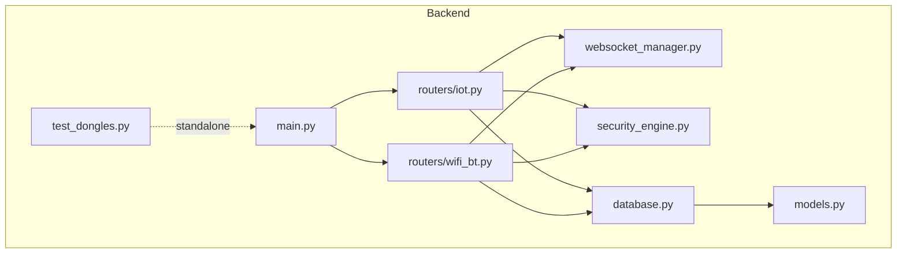
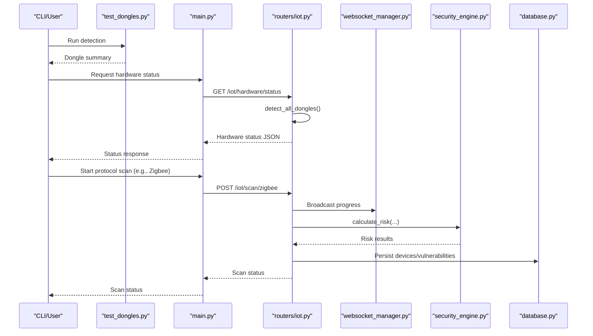
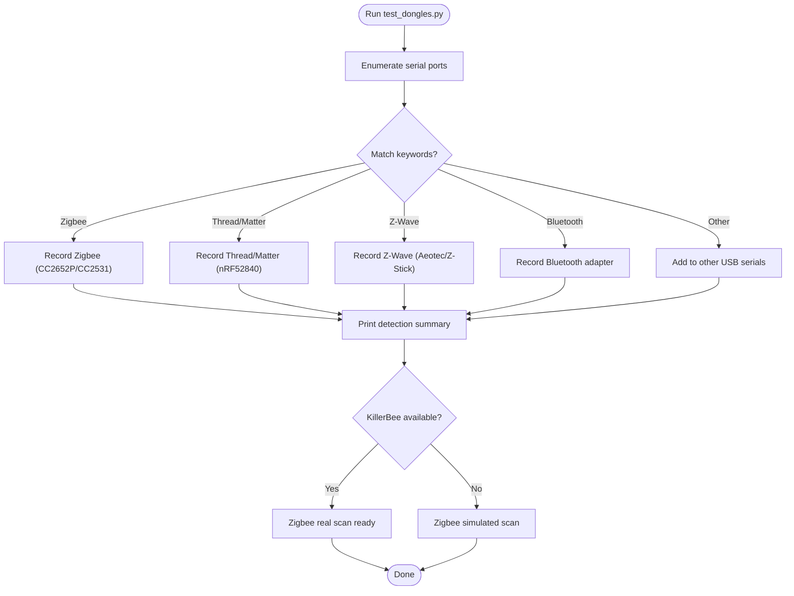
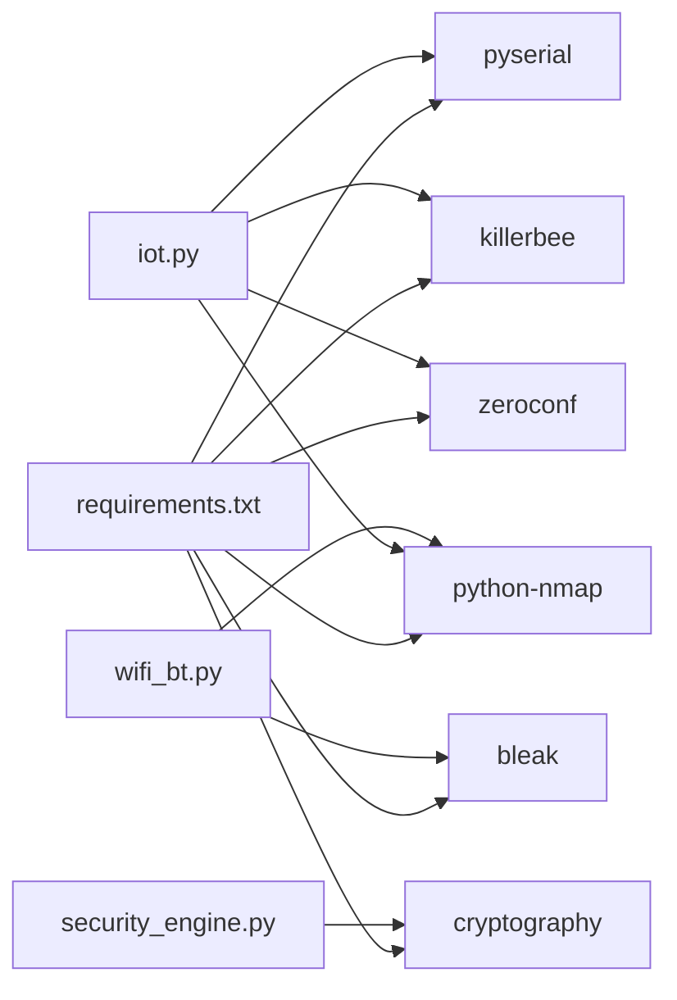

# Hardware Testing and Validation

<cite>
**Referenced Files in This Document**
- [test_dongles.py](file://backend/test_dongles.py)
- [HARDWARE_GUIDE.md](file://backend/HARDWARE_GUIDE.md)
- [QUICK_REFERENCE.md](file://backend/QUICK_REFERENCE.md)
- [RASPBERRY_PI_GUIDE.md](file://backend/RASPBERRY_PI_GUIDE.md)
- [DEPLOYMENT_CHECKLIST.md](file://backend/DEPLOYMENT_CHECKLIST.md)
- [main.py](file://backend/main.py)
- [requirements.txt](file://backend/requirements.txt)
- [iot.py](file://backend/routers/iot.py)
- [wifi_bt.py](file://backend/routers/wifi_bt.py)
- [models.py](file://backend/models.py)
- [database.py](file://backend/database.py)
- [websocket_manager.py](file://backend/websocket_manager.py)
- [security_engine.py](file://backend/security_engine.py)
</cite>

## Table of Contents
1. [Introduction](#introduction)
2. [Project Structure](#project-structure)
3. [Core Components](#core-components)
4. [Architecture Overview](#architecture-overview)
5. [Detailed Component Analysis](#detailed-component-analysis)
6. [Dependency Analysis](#dependency-analysis)
7. [Performance Considerations](#performance-considerations)
8. [Troubleshooting Guide](#troubleshooting-guide)
9. [Conclusion](#conclusion)
10. [Appendices](#appendices)

## Introduction
This document provides comprehensive hardware testing and validation guidance for PentexOne. It focuses on:
- Automated dongle detection and communication validation using the test_dongles.py script
- Hardware compatibility matrix for supported dongle models, firmware considerations, and driver requirements
- Testing workflows per protocol (Wi-Fi, Bluetooth/BLE, Zigbee, Thread/Matter, Z-Wave, LoRaWAN)
- Manual testing procedures for initialization, serial communication, and protocol-specific functionality
- Validation criteria, performance benchmarks, and failure diagnosis techniques
- Common hardware issues, replacement and upgrade guidelines, and safety considerations

## Project Structure
The hardware testing and validation capabilities are centered around:
- A dedicated detection script for USB dongles
- Router endpoints that orchestrate protocol scans and hardware readiness
- A WebSocket manager for live status updates
- A security engine that evaluates risks and vulnerabilities
- Database models for persistent device and vulnerability records

**Diagram sources**
- [main.py:1-106](file://backend/main.py#L1-L106)
- [iot.py:1-880](file://backend/routers/iot.py#L1-L880)
- [wifi_bt.py:1-766](file://backend/routers/wifi_bt.py#L1-L766)
- [websocket_manager.py:1-48](file://backend/websocket_manager.py#L1-L48)
- [security_engine.py:1-425](file://backend/security_engine.py#L1-L425)
- [database.py:1-80](file://backend/database.py#L1-L80)
- [models.py:1-71](file://backend/models.py#L1-L71)
- [test_dongles.py:1-152](file://backend/test_dongles.py#L1-L152)

**Section sources**
- [main.py:1-106](file://backend/main.py#L1-L106)
- [iot.py:1-880](file://backend/routers/iot.py#L1-L880)
- [wifi_bt.py:1-766](file://backend/routers/wifi_bt.py#L1-L766)
- [websocket_manager.py:1-48](file://backend/websocket_manager.py#L1-L48)
- [security_engine.py:1-425](file://backend/security_engine.py#L1-L425)
- [database.py:1-80](file://backend/database.py#L1-L80)
- [models.py:1-71](file://backend/models.py#L1-L71)
- [test_dongles.py:1-152](file://backend/test_dongles.py#L1-L152)

## Core Components
- Hardware detection and compatibility:
  - Automated detection of Zigbee, Thread/Matter, Z-Wave, and Bluetooth adapters via serial port enumeration
  - Optional KillerBee availability check for real Zigbee scanning
- Protocol testing:
  - Wi-Fi scanning via nmap
  - BLE scanning via bleak
  - Matter discovery via mDNS (Zeroconf)
  - Zigbee/Z-Wave/Thread/LoraWAN scanning with real hardware or simulated fallbacks
- Live status and diagnostics:
  - WebSocket broadcasts for scan progress, device discovery, and completion
  - Hardware status endpoint aggregating dongle readiness
- Data persistence:
  - Device and vulnerability records with risk scores and severity levels

**Section sources**
- [test_dongles.py:14-132](file://backend/test_dongles.py#L14-L132)
- [iot.py:27-156](file://backend/routers/iot.py#L27-L156)
- [iot.py:483-586](file://backend/routers/iot.py#L483-L586)
- [iot.py:625-722](file://backend/routers/iot.py#L625-L722)
- [iot.py:727-778](file://backend/routers/iot.py#L727-L778)
- [iot.py:839-880](file://backend/routers/iot.py#L839-L880)
- [wifi_bt.py:282-442](file://backend/routers/wifi_bt.py#L282-L442)
- [websocket_manager.py:7-47](file://backend/websocket_manager.py#L7-L47)
- [database.py:12-55](file://backend/database.py#L12-L55)
- [models.py:18-45](file://backend/models.py#L18-L45)

## Architecture Overview
The hardware testing pipeline integrates detection, scanning, evaluation, and reporting:
- Detection: test_dongles.py enumerates serial ports and identifies dongles
- Orchestration: routers/iots.py and routers/wifi_bt.py coordinate scans per protocol
- Evaluation: security_engine.py computes risk scores and vulnerability lists
- Persistence: database.py stores devices and vulnerabilities
- UX: WebSocket broadcasts provide real-time feedback

**Diagram sources**
- [test_dongles.py:14-132](file://backend/test_dongles.py#L14-L132)
- [main.py:14-49](file://backend/main.py#L14-L49)
- [iot.py:483-586](file://backend/routers/iot.py#L483-L586)
- [websocket_manager.py:21-45](file://backend/websocket_manager.py#L21-L45)
- [security_engine.py:202-339](file://backend/security_engine.py#L202-L339)
- [database.py:12-55](file://backend/database.py#L12-L55)

## Detailed Component Analysis

### Automated Dongle Detection (test_dongles.py)
Purpose:
- Quickly enumerate and classify connected USB serial dongles
- Provide a human-readable summary and readiness indicators

Key behaviors:
- Enumerates serial ports and inspects description/hwid for keywords
- Classifies dongles into Zigbee, Thread/Matter, Z-Wave, and Bluetooth categories
- Reports other USB serial devices
- Checks optional KillerBee presence for Zigbee scanning

Validation steps:
- Connect each dongle individually and run the script
- Confirm classification matches the physical device
- Verify “CONNECTED” status and port assignment
- If KillerBee is unavailable, expect simulated Zigbee scans

**Diagram sources**
- [test_dongles.py:14-132](file://backend/test_dongles.py#L14-L132)

**Section sources**
- [test_dongles.py:14-132](file://backend/test_dongles.py#L14-L132)

### Hardware Compatibility Matrix
Supported dongles and drivers:
- Zigbee
  - Models: CC2652P, CC2531
  - Drivers: Silicon Labs CP210x, Silicon Labs CP210x-compatible chips
  - Availability: KillerBee for real sniffing; otherwise simulated
- Thread/Matter
  - Models: Nordic nRF52840 Dongle, SkyConnect
  - Drivers: CDC ACM (ttyACM*)
  - Availability: Real scanning via external tools or simulated
- Z-Wave
  - Models: Aeotec Z-Stick 7, Zooz Z-Wave Plus S2 Stick
  - Drivers: FTDI/CP210x (ttyUSB*)
  - Availability: Simulated fallback available
- Bluetooth
  - Models: CSR, Broadcom, Intel BT adapters
  - Drivers: CDC ACM or vendor-specific
  - Availability: Built-in Pi Bluetooth supported; external adapters usable

Driver and library requirements:
- pyserial for serial communication
- KillerBee for real Zigbee sniffing
- bleak for BLE scanning
- nmap for Wi-Fi scanning
- zeroconf for Matter discovery

Notes:
- Firmware versions are not hard-coded; compatibility depends on dongle chipsets and drivers
- Use a powered USB hub when connecting multiple dongles

**Section sources**
- [HARDWARE_GUIDE.md:46-113](file://backend/HARDWARE_GUIDE.md#L46-L113)
- [iot.py:27-156](file://backend/routers/iot.py#L27-L156)
- [requirements.txt:14-21](file://backend/requirements.txt#L14-L21)

### Testing Workflow by Protocol

#### Wi-Fi
- Signal strength verification:
  - Use built-in SSID scanning APIs; RSSI/channel info returned
- Scanning range validation:
  - Perform network discovery and device scans; compare device counts across locations
- Data transmission quality checks:
  - Validate open ports and service banners via nmap
  - Assess TLS certificate health and cipher suites

Validation criteria:
- SSID list populated; RSSI present
- Network discovery completes without errors
- Device count increases with proximity
- TLS issues reported and remediation suggested

**Section sources**
- [wifi_bt.py:245-442](file://backend/routers/wifi_bt.py#L245-L442)
- [wifi_bt.py:636-766](file://backend/routers/wifi_bt.py#L636-L766)
- [security_engine.py:342-389](file://backend/security_engine.py#L342-L389)

#### Bluetooth/BLE
- Initialization:
  - Ensure bleak is available; Pi’s built-in BT supported
- Communication verification:
  - Discover nearby BLE devices; confirm MAC and hostname resolution
- Functionality tests:
  - Evaluate risk flags (no pairing, weak auth, exposed characteristics)

Validation criteria:
- Device discovery returns entries
- Risk flags align with device behavior
- No exceptions thrown during scanning

**Section sources**
- [wifi_bt.py:182-240](file://backend/routers/wifi_bt.py#L182-L240)
- [security_engine.py:149-154](file://backend/security_engine.py#L149-L154)

#### Zigbee
- Initialization:
  - Detect Zigbee dongle; verify KillerBee availability
- Communication verification:
  - Real sniffing via KillerBee or simulated fallback
- Functionality tests:
  - Identify devices on channel 11; evaluate default key exposure

Validation criteria:
- Devices discovered (real or simulated)
- Risk flags for default keys and lack of encryption
- Scan progress and completion events broadcast

**Section sources**
- [iot.py:483-586](file://backend/routers/iot.py#L483-L586)
- [security_engine.py:129-137](file://backend/security_engine.py#L129-L137)

#### Thread/Matter
- Initialization:
  - Detect Thread dongle; attempt external tool-based discovery
- Communication verification:
  - Discover devices via mDNS; validate commissioning posture
- Functionality tests:
  - Evaluate open commissioner and network key strength

Validation criteria:
- Devices discovered (real or simulated)
- Risk flags for open commissioning and weak keys
- Scan progress and completion events broadcast

**Section sources**
- [iot.py:625-722](file://backend/routers/iot.py#L625-L722)
- [security_engine.py:181-187](file://backend/security_engine.py#L181-L187)

#### Z-Wave
- Initialization:
  - Detect Z-Wave stick; prepare serial communication
- Communication verification:
  - Send basic controller commands; parse responses
- Functionality tests:
  - Evaluate encryption posture and inclusion risks

Validation criteria:
- Devices discovered (simulated)
- Risk flags for lack of encryption and replay attacks
- Scan progress and completion events broadcast

**Section sources**
- [iot.py:727-778](file://backend/routers/iot.py#L727-L778)
- [security_engine.py:165-171](file://backend/security_engine.py#L165-L171)

#### LoRaWAN
- Initialization:
  - Simulated scanning for LoRaWAN devices
- Communication verification:
  - Validate beacon fraud and nonce weaknesses
- Functionality tests:
  - Evaluate downlink confirmation and ADR limits

Validation criteria:
- Devices discovered (simulated)
- Risk flags for ABF and weak DevNonce
- Scan progress and completion events broadcast

**Section sources**
- [iot.py:783-837](file://backend/routers/iot.py#L783-L837)
- [security_engine.py:173-179](file://backend/security_engine.py#L173-L179)

### Manual Testing Procedures
- Hardware initialization:
  - Power cycle the Raspberry Pi and dongles
  - Verify serial ports appear under /dev/ttyUSB* or /dev/ttyACM*
- Serial communication verification:
  - Use ls -la /dev/ttyUSB* and /dev/ttyACM* to confirm device nodes
  - Check permissions: ensure user belongs to dialout and tty groups
- Protocol-specific functionality tests:
  - Start scans via API endpoints and monitor WebSocket events
  - Inspect database for persisted devices and vulnerabilities

**Section sources**
- [HARDWARE_GUIDE.md:208-222](file://backend/HARDWARE_GUIDE.md#L208-L222)
- [QUICK_REFERENCE.md:77-88](file://backend/QUICK_REFERENCE.md#L77-L88)
- [RASPBERRY_PI_GUIDE.md:441-461](file://backend/RASPBERRY_PI_GUIDE.md#L441-L461)

### Hardware Validation Criteria and Benchmarks
- Detection:
  - All dongles must be enumerated with correct ports and types
  - KillerBee presence indicated for Zigbee
- Scanning:
  - Progress events broadcast; scans complete within expected timeframes
  - Device counts correlate with environment
- Risk assessment:
  - Risk levels (SAFE/MEDIUM/RISK) computed consistently
  - Vulnerability list includes protocol-appropriate issues
- Reporting:
  - Device and vulnerability records persisted with timestamps

**Section sources**
- [iot.py:839-880](file://backend/routers/iot.py#L839-L880)
- [security_engine.py:202-339](file://backend/security_engine.py#L202-L339)
- [database.py:12-55](file://backend/database.py#L12-L55)

### Failure Diagnosis Techniques
Common symptoms and resolutions:
- USB dongle not detected:
  - Check lsusb and dmesg for errors; adjust permissions; reboot
- Bluetooth not working:
  - Restart Bluetooth service; reinstall BlueZ if necessary
- Wi-Fi scanning failures:
  - Ensure interface is free; temporarily disable managed mode networking
- Service startup issues:
  - Review logs; check port conflicts; reinstall dependencies

**Section sources**
- [HARDWARE_GUIDE.md:252-294](file://backend/HARDWARE_GUIDE.md#L252-L294)
- [RASPBERRY_PI_GUIDE.md:402-493](file://backend/RASPBERRY_PI_GUIDE.md#L402-L493)

### Safety Considerations
- ESD protection:
  - Wear an anti-static wrist strap when handling dongles and Raspberry Pi
- Electrical specifications:
  - Use a quality 5V power supply; multiple dongles may require a powered USB hub
- Environmental:
  - Maintain adequate ventilation; avoid overheating
- Network hygiene:
  - Prefer wired Ethernet for initial setup; keep Wi-Fi interface free during scans

**Section sources**
- [HARDWARE_GUIDE.md:387-393](file://backend/HARDWARE_GUIDE.md#L387-L393)
- [RASPBERRY_PI_GUIDE.md:507-525](file://backend/RASPBERRY_PI_GUIDE.md#L507-L525)

## Dependency Analysis
External libraries and their roles:
- pyserial: serial port enumeration and communication
- KillerBee: real Zigbee sniffing
- bleak: BLE scanning
- nmap: Wi-Fi device discovery and port scanning
- zeroconf: Matter discovery
- cryptography: TLS certificate parsing

**Diagram sources**
- [requirements.txt:14-21](file://backend/requirements.txt#L14-L21)
- [iot.py:5-6](file://backend/routers/iot.py#L5-L6)
- [wifi_bt.py:17-21](file://backend/routers/wifi_bt.py#L17-L21)
- [security_engine.py:347-389](file://backend/security_engine.py#L347-L389)

**Section sources**
- [requirements.txt:14-21](file://backend/requirements.txt#L14-L21)
- [iot.py:5-6](file://backend/routers/iot.py#L5-L6)
- [wifi_bt.py:17-21](file://backend/routers/wifi_bt.py#L17-L21)
- [security_engine.py:347-389](file://backend/security_engine.py#L347-L389)

## Performance Considerations
- Use a powered USB hub for multiple dongles
- Disable unused services to reduce overhead
- Optimize swap and GPU memory on Pi 3
- Minimize concurrent scans to prevent resource contention

**Section sources**
- [HARDWARE_GUIDE.md:326-339](file://backend/HARDWARE_GUIDE.md#L326-L339)
- [RASPBERRY_PI_GUIDE.md:507-525](file://backend/RASPBERRY_PI_GUIDE.md#L507-L525)

## Troubleshooting Guide
- USB dongle not detected:
  - lsusb, dmesg, check permissions, reboot
- Bluetooth issues:
  - Restart service, reinstall BlueZ, unblock rfkill
- Wi-Fi scanning problems:
  - Free managed interface, retry scan
- Service won’t start:
  - Check logs, resolve port conflicts, reinstall dependencies

**Section sources**
- [HARDWARE_GUIDE.md:252-294](file://backend/HARDWARE_GUIDE.md#L252-L294)
- [RASPBERRY_PI_GUIDE.md:402-493](file://backend/RASPBERRY_PI_GUIDE.md#L402-L493)

## Conclusion
PentexOne provides robust hardware testing and validation through automated dongle detection, protocol-specific scanning, and live diagnostics. By following the outlined workflows, compatibility matrix, and troubleshooting steps, operators can reliably validate hardware compatibility, ensure communication integrity, and maintain secure deployments.

## Appendices

### A. Hardware Replacement and Upgrade Guidelines
- Replace incompatible dongles with supported models (CC2652P, nRF52840, Aeotec Z-Stick)
- Upgrade firmware where applicable; verify driver compatibility
- Use a powered USB hub for multiple dongles; ensure adequate power delivery

**Section sources**
- [HARDWARE_GUIDE.md:46-113](file://backend/HARDWARE_GUIDE.md#L46-L113)

### B. Deployment and Validation Checklist
- Pre-installation: hardware and software prerequisites
- Installation: service setup and configuration
- Post-installation: service status, port listening, web access, hardware detection, protocol testing, AI features, and reports
- Security: credentials, firewall, system, and application hardening
- Performance: resource usage, network performance, and scan times
- Backup: database and reports backup and restore
- Functional testing: multi-protocol test and stress test

**Section sources**
- [DEPLOYMENT_CHECKLIST.md:7-312](file://backend/DEPLOYMENT_CHECKLIST.md#L7-L312)