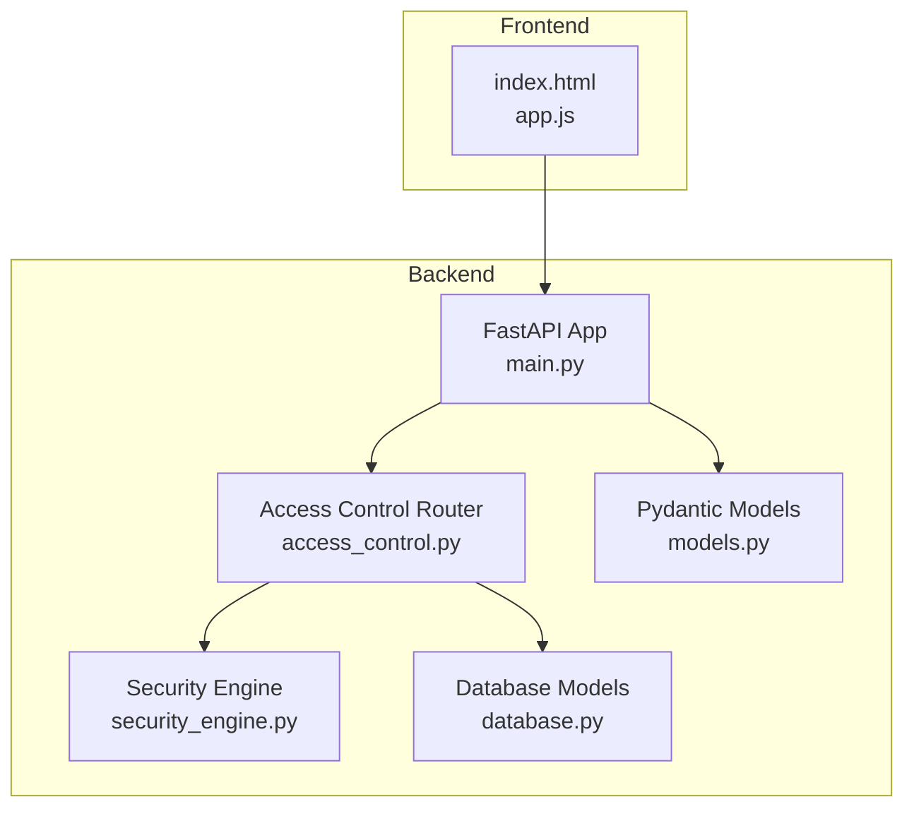
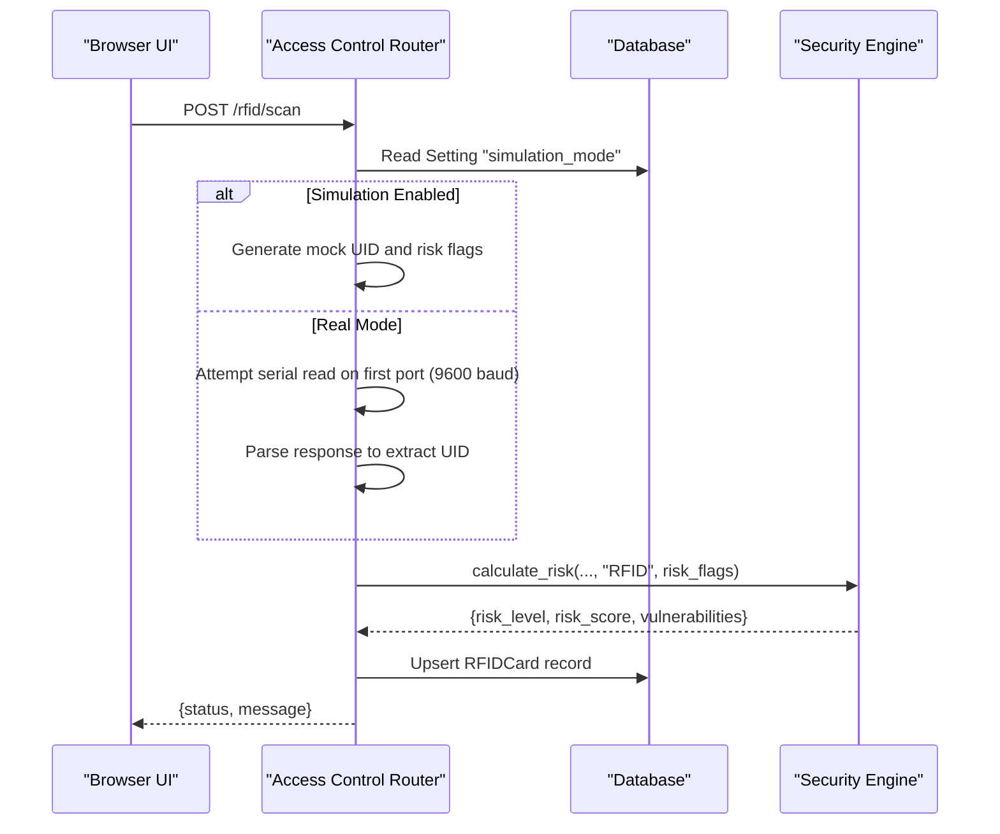
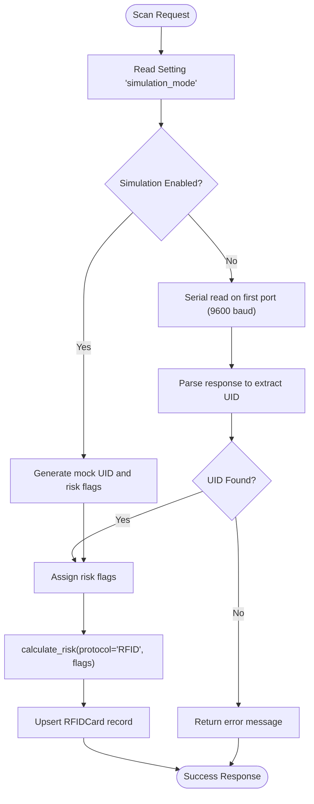
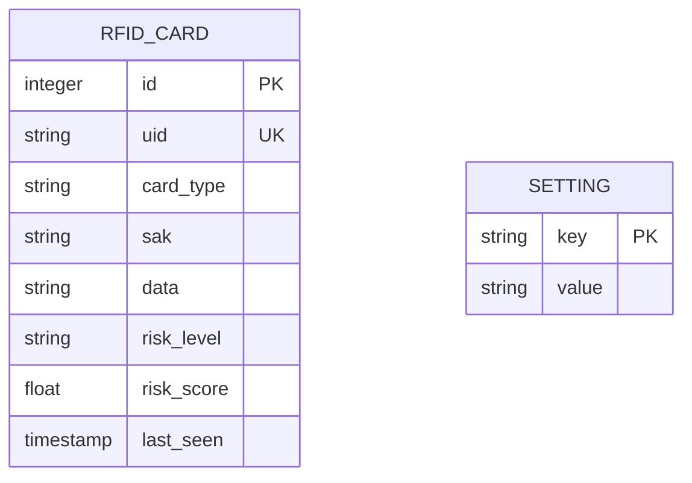
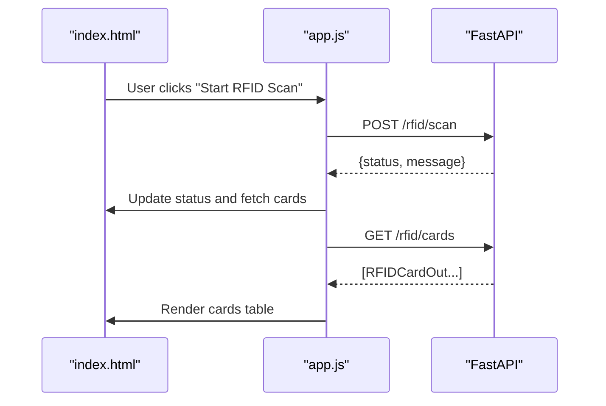
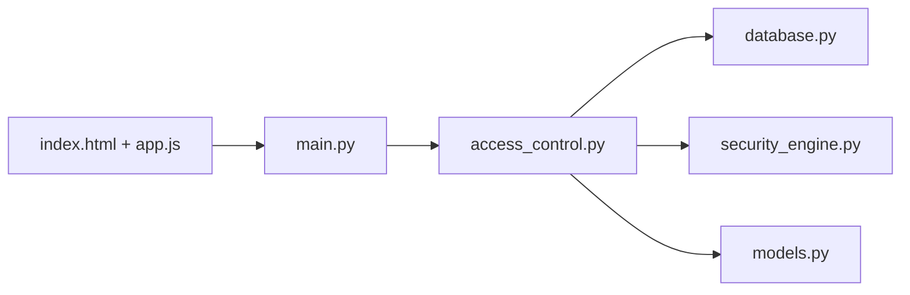

# RFID/NFC Access Control Integration

<cite>
**Referenced Files in This Document**
- [README.md](file://backend/README.md)
- [HARDWARE_GUIDE.md](file://backend/HARDWARE_GUIDE.md)
- [RASPBERRY_PI_GUIDE.md](file://backend/RASPBERRY_PI_GUIDE.md)
- [access_control.py](file://backend/routers/access_control.py)
- [security_engine.py](file://backend/security_engine.py)
- [database.py](file://backend/database.py)
- [models.py](file://backend/models.py)
- [main.py](file://backend/main.py)
- [test_dongles.py](file://backend/test_dongles.py)
- [index.html](file://backend/static/index.html)
- [app.js](file://backend/static/app.js)
</cite>

## Table of Contents
1. [Introduction](#introduction)
2. [Project Structure](#project-structure)
3. [Core Components](#core-components)
4. [Architecture Overview](#architecture-overview)
5. [Detailed Component Analysis](#detailed-component-analysis)
6. [Dependency Analysis](#dependency-analysis)
7. [Performance Considerations](#performance-considerations)
8. [Troubleshooting Guide](#troubleshooting-guide)
9. [Conclusion](#conclusion)
10. [Appendices](#appendices)

## Introduction
This document provides comprehensive RFID/NFC integration documentation for PentexOne's access control card analysis capabilities. It explains how the system detects and analyzes RFID/NFC cards, the simulated and real-world scanning paths, risk scoring, and integration with the broader security platform. It also outlines the current implementation limitations regarding physical reader integration and provides guidance for extending the system to support real RC522/PN532 readers.

## Project Structure
The RFID/NFC functionality is implemented as part of the backend FastAPI application with dedicated router endpoints, database models, and frontend UI integration. The system supports:
- Simulated RFID card scanning for development and testing
- Real RFID card scanning via serial communication (placeholder for actual reader integration)
- Risk scoring using the security engine
- Persistent storage of scanned cards and settings



**Diagram sources**
- [main.py:14-48](file://backend/main.py#L14-L48)
- [access_control.py:13-11](file://backend/routers/access_control.py#L13-L11)
- [security_engine.py:202-339](file://backend/security_engine.py#L202-L339)
- [database.py:44-61](file://backend/database.py#L44-L61)
- [models.py:55-66](file://backend/models.py#L55-L66)
- [index.html:28-34](file://backend/static/index.html#L28-L34)
- [app.js:694-743](file://backend/static/app.js#L694-L743)

**Section sources**
- [README.md:29-45](file://backend/README.md#L29-L45)
- [main.py:14-48](file://backend/main.py#L14-L48)
- [access_control.py:13-11](file://backend/routers/access_control.py#L13-L11)
- [database.py:44-61](file://backend/database.py#L44-L61)
- [models.py:55-66](file://backend/models.py#L55-L66)
- [index.html:318-344](file://backend/static/index.html#L318-L344)
- [app.js:694-743](file://backend/static/app.js#L694-L743)

## Core Components
- Access Control Router: Provides endpoints for scanning RFID cards, listing stored cards, and clearing the card database. It supports both simulated and real card reads.
- Security Engine: Calculates risk scores and levels for RFID cards based on predefined vulnerability flags.
- Database Models: Persist RFID card data and global settings (e.g., simulation mode).
- Frontend Integration: UI controls for initiating scans, displaying results, and managing settings.

Key implementation highlights:
- Simulated scanning generates mock UIDs and assigns risk flags for demonstration.
- Real scanning attempts serial communication on the first detected serial port at 9600 baud with a placeholder command.
- Risk calculation considers RFID-specific vulnerabilities mapped to severity levels.

**Section sources**
- [access_control.py:15-27](file://backend/routers/access_control.py#L15-L27)
- [access_control.py:29-45](file://backend/routers/access_control.py#L29-L45)
- [access_control.py:47-84](file://backend/routers/access_control.py#L47-L84)
- [security_engine.py:156-163](file://backend/security_engine.py#L156-L163)
- [security_engine.py:267-273](file://backend/security_engine.py#L267-L273)
- [database.py:44-61](file://backend/database.py#L44-L61)
- [models.py:55-66](file://backend/models.py#L55-L66)

## Architecture Overview
The RFID/NFC scanning flow integrates the frontend, backend router, security engine, and database. The flow supports switching between simulated and real modes controlled by a global setting.



**Diagram sources**
- [access_control.py:47-84](file://backend/routers/access_control.py#L47-L84)
- [security_engine.py:202-339](file://backend/security_engine.py#L202-L339)
- [database.py:44-61](file://backend/database.py#L44-L61)

**Section sources**
- [access_control.py:47-84](file://backend/routers/access_control.py#L47-L84)
- [security_engine.py:267-273](file://backend/security_engine.py#L267-L273)
- [database.py:44-61](file://backend/database.py#L44-L61)

## Detailed Component Analysis

### Access Control Router (RFID)
Responsibilities:
- Handle RFID scanning requests
- Toggle between simulated and real scanning modes
- Persist scanned cards and update last-seen timestamps
- Expose endpoints for listing and clearing cards

Implementation patterns:
- Uses SQLAlchemy session management for database operations
- Reads a global setting to decide scanning mode
- Applies risk scoring via the security engine
- Stores minimal card metadata (UID, type, risk level, score)



**Diagram sources**
- [access_control.py:47-84](file://backend/routers/access_control.py#L47-L84)
- [security_engine.py:267-273](file://backend/security_engine.py#L267-L273)

**Section sources**
- [access_control.py:13-11](file://backend/routers/access_control.py#L13-L11)
- [access_control.py:47-84](file://backend/routers/access_control.py#L47-L84)

### Security Engine (RFID Risk Scoring)
The security engine evaluates RFID cards by mapping risk flags to predefined vulnerabilities and computing a normalized risk score and level.

RFID-specific vulnerabilities considered:
- RFID_MIFARE_DEFAULT_KEY: Critical
- RFID_EASILY_CLONABLE: High
- RFID_LEGACY_CRYPTO: High
- RFID_NO_MUTUAL_AUTH: Medium
- RFID_DESWEET_ATTACK: High

Scoring logic:
- Each matched vulnerability contributes a weighted score based on severity
- Final risk level is SAFE/MEDIUM/RISK derived from cumulative score

```mermaid
flowchart TD
Start([Calculate Risk]) --> Init["Initialize score=0, vulns=[]"]
Init --> CheckFlags["Iterate RFID_VULNS"]
CheckFlags --> Match{"Flag present?"}
Match --> |Yes| AddScore["Add weighted score by severity"]
AddScore --> Record["Record vulnerability with protocol='RFID'"]
Record --> NextFlag["Next flag"]
Match --> |No| NextFlag
NextFlag --> DoneFlags{"More flags?"}
DoneFlags --> |Yes| CheckFlags
DoneFlags --> |No| Normalize["Clamp score <= 100 and compute level"]
Normalize --> End([Return {risk_level, risk_score, vulnerabilities}])
```

**Diagram sources**
- [security_engine.py:156-163](file://backend/security_engine.py#L156-L163)
- [security_engine.py:267-273](file://backend/security_engine.py#L267-L273)
- [security_engine.py:325-339](file://backend/security_engine.py#L325-L339)

**Section sources**
- [security_engine.py:156-163](file://backend/security_engine.py#L156-L163)
- [security_engine.py:267-273](file://backend/security_engine.py#L267-L273)
- [security_engine.py:325-339](file://backend/security_engine.py#L325-L339)

### Database Models and Settings
RFID card persistence:
- Unique UID, card type, optional SAK/data fields, risk level/score, and last seen timestamp
- Upsert behavior ensures updated timestamps on subsequent scans

Global settings:
- simulation_mode: Controls whether simulated or real scanning is used
- nmap_timeout: Used for other protocol scanning (not RFID)



**Diagram sources**
- [database.py:44-61](file://backend/database.py#L44-L61)
- [database.py:56-61](file://backend/database.py#L56-L61)

**Section sources**
- [database.py:44-61](file://backend/database.py#L44-L61)
- [database.py:56-61](file://backend/database.py#L56-L61)

### Frontend Integration
The frontend provides:
- Navigation to the RFID view
- Start RFID scan button triggering the backend endpoint
- Display of scanned cards with UID, type, and risk level
- Clear cards action to reset the database



**Diagram sources**
- [index.html:318-344](file://backend/static/index.html#L318-L344)
- [app.js:694-743](file://backend/static/app.js#L694-L743)
- [access_control.py:86-94](file://backend/routers/access_control.py#L86-L94)

**Section sources**
- [index.html:28-34](file://backend/static/index.html#L28-L34)
- [index.html:318-344](file://backend/static/index.html#L318-L344)
- [app.js:694-743](file://backend/static/app.js#L694-L743)
- [access_control.py:86-94](file://backend/routers/access_control.py#L86-L94)

## Dependency Analysis
The RFID/NFC module depends on:
- FastAPI routing and dependency injection
- SQLAlchemy ORM for persistence
- Security engine for risk calculations
- Frontend for user interaction



**Diagram sources**
- [access_control.py:9-11](file://backend/routers/access_control.py#L9-L11)
- [database.py:1-9](file://backend/database.py#L1-L9)
- [security_engine.py:12-15](file://backend/security_engine.py#L12-L15)
- [models.py:1-4](file://backend/models.py#L1-L4)
- [main.py:14-48](file://backend/main.py#L14-L48)
- [index.html:28-34](file://backend/static/index.html#L28-L34)
- [app.js:694-743](file://backend/static/app.js#L694-L743)

**Section sources**
- [access_control.py:9-11](file://backend/routers/access_control.py#L9-L11)
- [main.py:14-48](file://backend/main.py#L14-L48)

## Performance Considerations
- Serial communication is synchronous and waits for a fixed timeout; optimize by adjusting timeouts and ensuring proper reader response formatting.
- Risk calculation is lightweight but can be extended to incorporate additional heuristics.
- Database upserts are efficient for small-scale deployments; consider batching for high-frequency scanning scenarios.

## Troubleshooting Guide
Common issues and resolutions:
- No real RFID hardware found: Ensure a compatible serial RFID reader is connected and detected by the system. The current implementation targets the first serial port at 9600 baud with a placeholder command.
- Serial permissions: Verify user permissions for serial access and reboot if necessary.
- Simulation mode: Toggle the simulation mode setting to switch between simulated and real scanning.
- Service startup: Confirm the service is running and listening on the expected port.

**Section sources**
- [access_control.py:29-45](file://backend/routers/access_control.py#L29-L45)
- [access_control.py:57-62](file://backend/routers/access_control.py#L57-L62)
- [HARDWARE_GUIDE.md:252-282](file://backend/HARDWARE_GUIDE.md#L252-L282)
- [RASPBERRY_PI_GUIDE.md:402-461](file://backend/RASPBERRY_PI_GUIDE.md#L402-L461)
- [README.md:349-381](file://backend/README.md#L349-L381)

## Conclusion
PentexOne currently supports RFID/NFC card scanning through a flexible architecture that can operate in simulated or real modes. The security engine provides robust risk scoring aligned with known RFID vulnerabilities. While the current implementation focuses on serial communication patterns, future enhancements can integrate specific RFID readers (RC522/PN532) by adapting the serial read logic and adding standardized card detection and UID extraction routines.

## Appendices

### Current Implementation Limitations
- The real scanning path uses a generic serial read with a placeholder command and assumes a specific response format. Readers such as RC522/PN532 require protocol-specific initialization and command sequences.
- UID extraction is performed by parsing serial hex output; a more robust parser is needed for varied reader outputs.
- Data encoding standards and ISO 14443A/B specifics are not implemented; future versions should parse SAK/ATQA/UID and card type identification.

### Setup and Wiring Guidance
- Hardware compatibility: The project documents support for optional USB dongles for other protocols. For RFID readers, connect a compatible serial RFID module to the Raspberry Pi’s serial port or USB-to-serial adapter.
- Permissions: Ensure the user account has access to serial devices.
- Power: Use adequate power supplies for the Raspberry Pi and any attached USB devices.

**Section sources**
- [README.md:182-211](file://backend/README.md#L182-L211)
- [HARDWARE_GUIDE.md:252-282](file://backend/HARDWARE_GUIDE.md#L252-L282)
- [RASPBERRY_PI_GUIDE.md:441-461](file://backend/RASPBERRY_PI_GUIDE.md#L441-L461)

### Security Considerations
- Default credentials and weak encryption: The security engine flags RFID-specific weaknesses such as default keys and easily clonable cards.
- Replay attacks and default credentials exploitation: General guidance applies—disable default credentials, enforce strong authentication, and monitor for anomalies.

**Section sources**
- [security_engine.py:156-163](file://backend/security_engine.py#L156-L163)
- [README.md:308-346](file://backend/README.md#L308-L346)