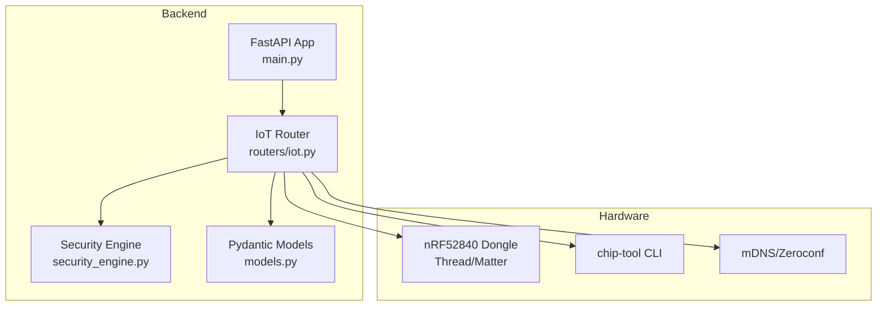
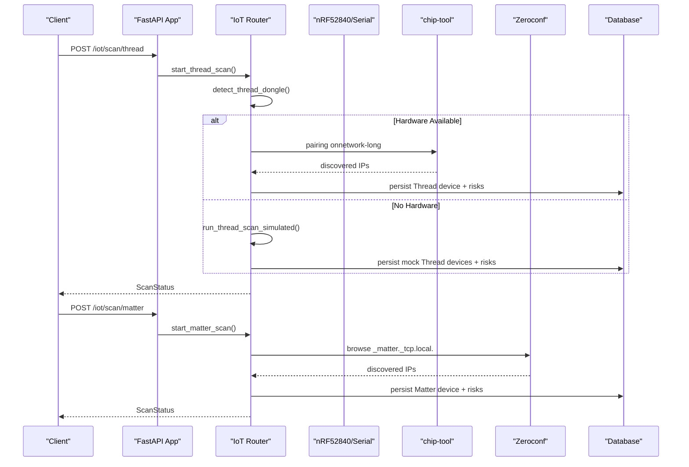
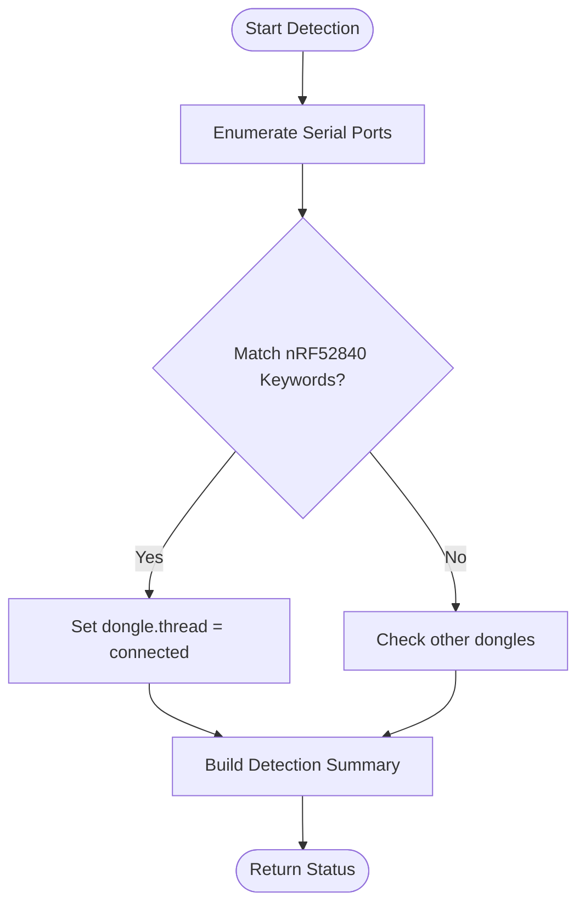
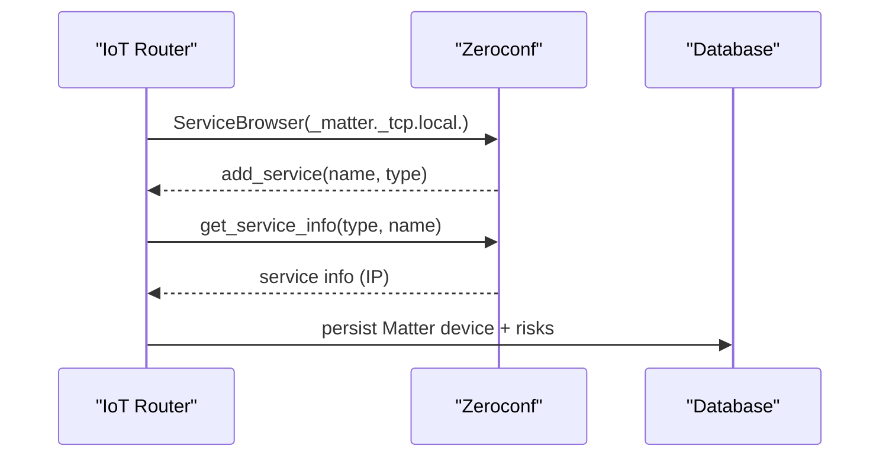
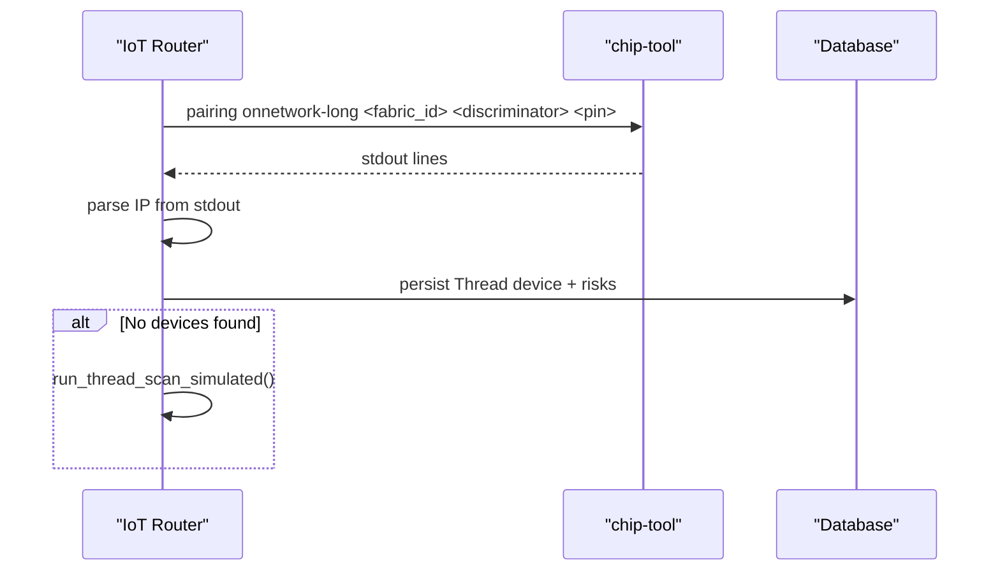
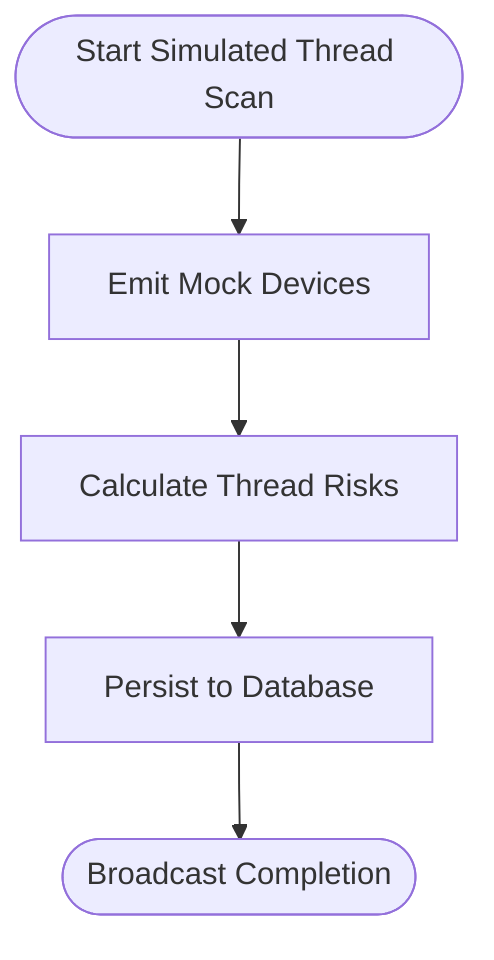
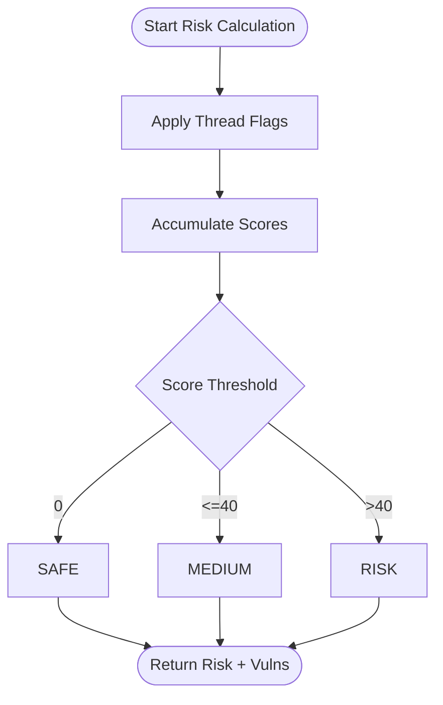
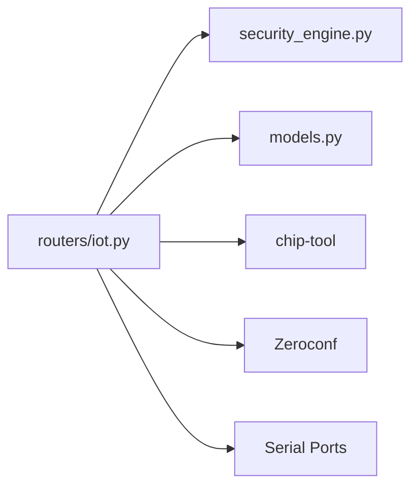

# Thread/Matter Protocol Integration

<cite>
**Referenced Files in This Document**
- [README.md](file://backend/README.md)
- [HARDWARE_GUIDE.md](file://backend/HARDWARE_GUIDE.md)
- [test_dongles.py](file://backend/test_dongles.py)
- [main.py](file://backend/main.py)
- [routers/iot.py](file://backend/routers/iot.py)
- [security_engine.py](file://backend/security_engine.py)
- [models.py](file://backend/models.py)
</cite>

## Table of Contents
1. [Introduction](#introduction)
2. [Project Structure](#project-structure)
3. [Core Components](#core-components)
4. [Architecture Overview](#architecture-overview)
5. [Detailed Component Analysis](#detailed-component-analysis)
6. [Dependency Analysis](#dependency-analysis)
7. [Performance Considerations](#performance-considerations)
8. [Troubleshooting Guide](#troubleshooting-guide)
9. [Conclusion](#conclusion)

## Introduction
This document explains PentexOne’s native Thread/Matter protocol integration. It covers hardware requirements for the nRF52840 dongle, discovery mechanisms using mDNS/Zeroconf and chip-tool, scanning workflows, simulated scanning for environments without hardware, and the Thread/Matter security model used by the platform. It also documents commissioning-related risks and remediation guidance derived from the security engine.

## Project Structure
PentexOne’s backend is a FastAPI application that orchestrates protocol scanning across Wi-Fi, Bluetooth, Zigbee, Thread/Matter, Z-Wave, LoRaWAN, and RFID. The Thread/Matter integration resides primarily in the IoT router module and leverages:
- Hardware detection for the nRF52840 dongle
- mDNS/Zeroconf-based discovery for Matter devices
- chip-tool integration for on-network pairing and discovery
- Simulated scanning fallback when hardware is unavailable

**Diagram sources**
- [main.py:1-106](file://backend/main.py#L1-L106)
- [routers/iot.py:1-880](file://backend/routers/iot.py#L1-L880)
- [security_engine.py:1-425](file://backend/security_engine.py#L1-L425)
- [models.py:1-71](file://backend/models.py#L1-L71)

**Section sources**
- [README.md:22-46](file://backend/README.md#L22-L46)
- [HARDWARE_GUIDE.md:73-92](file://backend/HARDWARE_GUIDE.md#L73-L92)
- [main.py:14-49](file://backend/main.py#L14-L49)

## Core Components
- Hardware detection for Thread/Matter: The system detects the nRF52840 dongle via serial port enumeration and classification logic.
- Discovery mechanisms:
  - mDNS/Zeroconf: Matter device discovery using the _matter._tcp.local. service browse.
  - chip-tool: On-network pairing command used to discover Thread/Matter devices.
- Scanning workflows:
  - Real Thread/Matter scan: Uses the nRF52840 dongle and optionally chip-tool.
  - Simulated Thread/Matter scan: Emulates discovery for environments without hardware.
- Security model: Thread/Matter-specific risks are modeled and scored by the security engine.

**Section sources**
- [routers/iot.py:27-156](file://backend/routers/iot.py#L27-L156)
- [routers/iot.py:424-477](file://backend/routers/iot.py#L424-L477)
- [routers/iot.py:637-721](file://backend/routers/iot.py#L637-L721)
- [security_engine.py:181-187](file://backend/security_engine.py#L181-L187)

## Architecture Overview
The Thread/Matter integration follows a layered approach:
- Presentation: FastAPI routes in the IoT router expose endpoints for scanning and discovery.
- Control: Background tasks orchestrate real vs. simulated scans and broadcast progress via WebSocket.
- Data: Device and vulnerability records are persisted to the database.
- Hardware/External Tools: The nRF52840 dongle and chip-tool are invoked when present; otherwise, simulated scans are used.

**Diagram sources**
- [routers/iot.py:625-634](file://backend/routers/iot.py#L625-L634)
- [routers/iot.py:637-686](file://backend/routers/iot.py#L637-L686)
- [routers/iot.py:689-721](file://backend/routers/iot.py#L689-L721)
- [routers/iot.py:418-421](file://backend/routers/iot.py#L418-L421)
- [routers/iot.py:424-477](file://backend/routers/iot.py#L424-L477)

## Detailed Component Analysis

### Hardware Detection for nRF52840
- Purpose: Identify the presence of a Thread/Matter-capable dongle (nRF52840) via serial port enumeration and description matching.
- Behavior: Returns a structured status indicating whether the dongle is connected and ready for Thread scanning.
- Integration: Used by Thread scanning endpoints to decide between real and simulated scans.

**Diagram sources**
- [routers/iot.py:27-156](file://backend/routers/iot.py#L27-L156)
- [test_dongles.py:14-132](file://backend/test_dongles.py#L14-L132)

**Section sources**
- [routers/iot.py:27-156](file://backend/routers/iot.py#L27-L156)
- [test_dongles.py:14-132](file://backend/test_dongles.py#L14-L132)

### mDNS/Zeroconf-Based Matter Discovery
- Mechanism: Browse the _matter._tcp.local. service domain using Zeroconf to discover Matter devices.
- Behavior: Captures service instances, resolves addresses, and emits device events with risk level UNKNOWN until persisted.
- Persistence: Devices are stored with protocol Matter and associated risks.

**Diagram sources**
- [routers/iot.py:424-477](file://backend/routers/iot.py#L424-L477)

**Section sources**
- [routers/iot.py:418-477](file://backend/routers/iot.py#L418-L477)

### chip-tool Integration for Thread/Matter Discovery
- Mechanism: Executes chip-tool pairing onnetwork-long to discover Thread/Matter devices on the network.
- Behavior: Parses stdout for discovered IP addresses, broadcasts device events, and persists results.
- Fallback: If no devices are discovered, the system falls back to simulated scanning.

**Diagram sources**
- [routers/iot.py:637-686](file://backend/routers/iot.py#L637-L686)

**Section sources**
- [routers/iot.py:637-686](file://backend/routers/iot.py#L637-L686)

### Simulated Thread Scanning Mode
- Purpose: Provide discovery results when no Thread/Matter hardware is present.
- Behavior: Emits mock Thread devices with IPv6-like identifiers and applies Thread-specific risk flags.
- Persistence: Stores mock devices and associated vulnerabilities in the database.

**Diagram sources**
- [routers/iot.py:689-721](file://backend/routers/iot.py#L689-L721)

**Section sources**
- [routers/iot.py:689-721](file://backend/routers/iot.py#L689-L721)

### Thread/Matter Security Model and Risk Scoring
- Thread-specific risks include:
  - No commissioner authentication
  - Active commissioner mode
  - Weak or default network key
  - Border router exposure
- Risk calculation: Scores are accumulated per vulnerability and normalized to a risk level (SAFE/MEDIUM/RISK).

**Diagram sources**
- [security_engine.py:181-187](file://backend/security_engine.py#L181-L187)
- [security_engine.py:291-297](file://backend/security_engine.py#L291-L297)
- [security_engine.py:202-339](file://backend/security_engine.py#L202-L339)

**Section sources**
- [security_engine.py:181-187](file://backend/security_engine.py#L181-L187)
- [security_engine.py:291-297](file://backend/security_engine.py#L291-L297)
- [security_engine.py:202-339](file://backend/security_engine.py#L202-L339)

### Commissioning and Network Key Management
- Active commissioner concept: The Thread/Matter security model flags “active commissioner” mode as a risk, indicating potential unauthorized commissioning.
- Network key management: The Thread model includes “weak or default network key” as a risk, highlighting the importance of unique, securely managed keys.
- Remediation guidance: The security engine provides targeted remediation steps for enabling commissioner authentication and updating network keys.

**Section sources**
- [security_engine.py:181-187](file://backend/security_engine.py#L181-L187)
- [security_engine.py:417](file://backend/security_engine.py#L417)

### Setup Procedures and Network Configuration
- Hardware requirements:
  - nRF52840 USB dongle for Thread/Matter scanning.
  - chip-tool installed and available in PATH for on-network discovery.
- Detection:
  - Use the hardware detection routine to confirm dongle availability.
  - Alternatively, use the standalone detection script to list serial ports and classify dongles.
- Network configuration:
  - Ensure the host can resolve mDNS services and route to Thread devices.
  - For environments without hardware, simulated scanning remains functional.

**Section sources**
- [HARDWARE_GUIDE.md:73-92](file://backend/HARDWARE_GUIDE.md#L73-L92)
- [README.md:42](file://backend/README.md#L42)
- [routers/iot.py:27-156](file://backend/routers/iot.py#L27-L156)
- [test_dongles.py:14-132](file://backend/test_dongles.py#L14-L132)

### Commissioning Workflows and Device Pairing
- On-network pairing: The Thread/Matter discovery workflow invokes chip-tool pairing onnetwork-long to locate devices.
- Post-discovery: Discovered devices are persisted with risk scores and vulnerabilities, enabling downstream analysis and reporting.

**Section sources**
- [routers/iot.py:647-651](file://backend/routers/iot.py#L647-L651)
- [routers/iot.py:668-681](file://backend/routers/iot.py#L668-L681)

## Dependency Analysis
- External dependencies:
  - chip-tool: Executed for Thread/Matter discovery.
  - Zeroconf: Used for mDNS browsing of Matter devices.
  - Serial libraries: Used for dongle detection and real Thread scanning.
- Internal dependencies:
  - IoT router depends on the security engine for risk scoring.
  - WebSocket manager broadcasts scan progress and results.

**Diagram sources**
- [routers/iot.py:1-25](file://backend/routers/iot.py#L1-L25)
- [security_engine.py:1-16](file://backend/security_engine.py#L1-L16)
- [models.py:1-7](file://backend/models.py#L1-L7)

**Section sources**
- [routers/iot.py:1-25](file://backend/routers/iot.py#L1-L25)
- [security_engine.py:1-16](file://backend/security_engine.py#L1-L16)
- [models.py:1-7](file://backend/models.py#L1-L7)

## Performance Considerations
- Real scanning incurs overhead from external tool invocation and serial communication.
- Simulated scanning reduces resource usage and is suitable for development or environments without hardware.
- mDNS browsing duration is bounded to limit scan time.

[No sources needed since this section provides general guidance]

## Troubleshooting Guide
- Hardware not detected:
  - Verify serial port visibility and permissions.
  - Use the hardware detection script to confirm dongle classification.
- chip-tool not found:
  - Ensure chip-tool is installed and accessible in PATH.
  - Confirm the command executes without errors.
- mDNS discovery fails:
  - Check local DNS resolution and firewall rules.
  - Validate that devices advertise _matter._tcp.local. services.
- Simulated scan only:
  - Expected when no Thread/Matter dongle is present.
  - Use simulated results for development and testing.

**Section sources**
- [HARDWARE_GUIDE.md:252-282](file://backend/HARDWARE_GUIDE.md#L252-L282)
- [test_dongles.py:149-152](file://backend/test_dongles.py#L149-L152)
- [routers/iot.py:647-661](file://backend/routers/iot.py#L647-L661)

## Conclusion
PentexOne integrates Thread/Matter scanning through a combination of hardware detection, mDNS/Zeroconf discovery, and chip-tool-based on-network pairing. The system gracefully degrades to simulated scanning when hardware is absent, ensuring usability across diverse environments. The Thread/Matter security model focuses on commissioner authentication, active commissioner mode, network key strength, and border router exposure, with actionable remediation guidance.