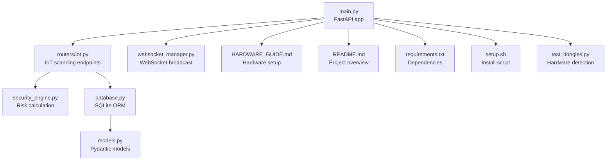
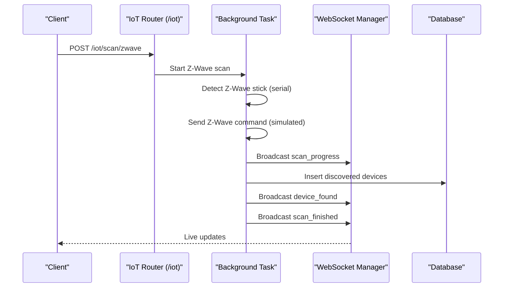
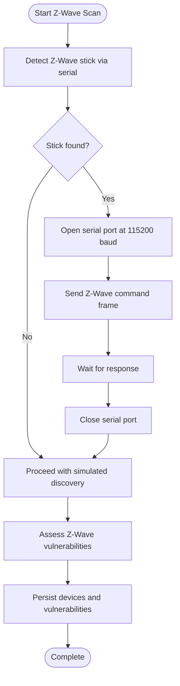
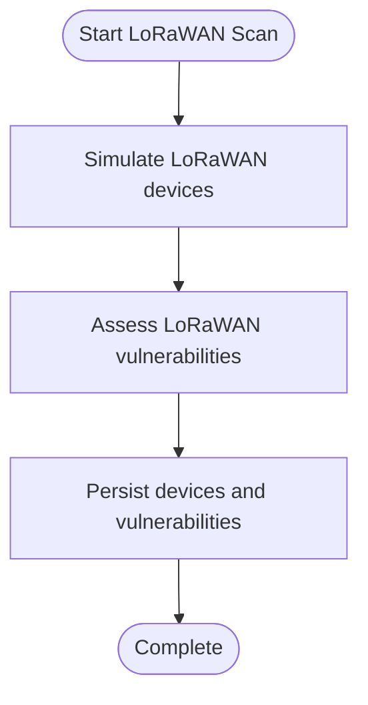
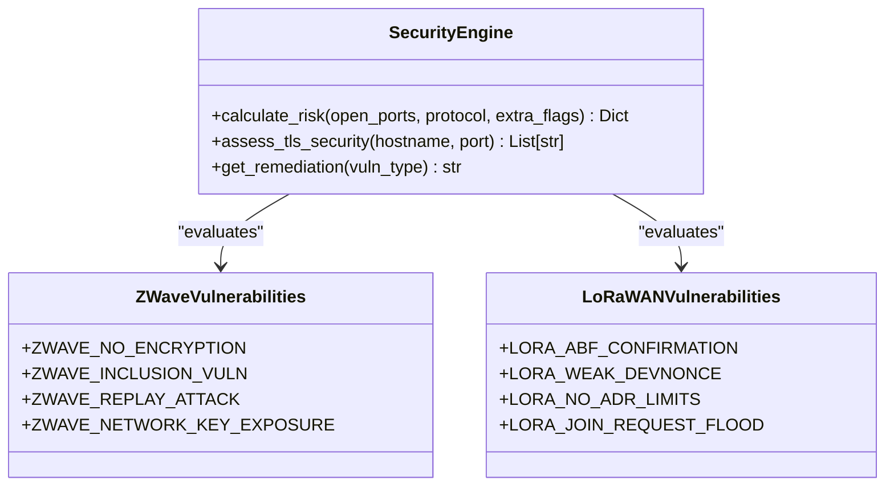
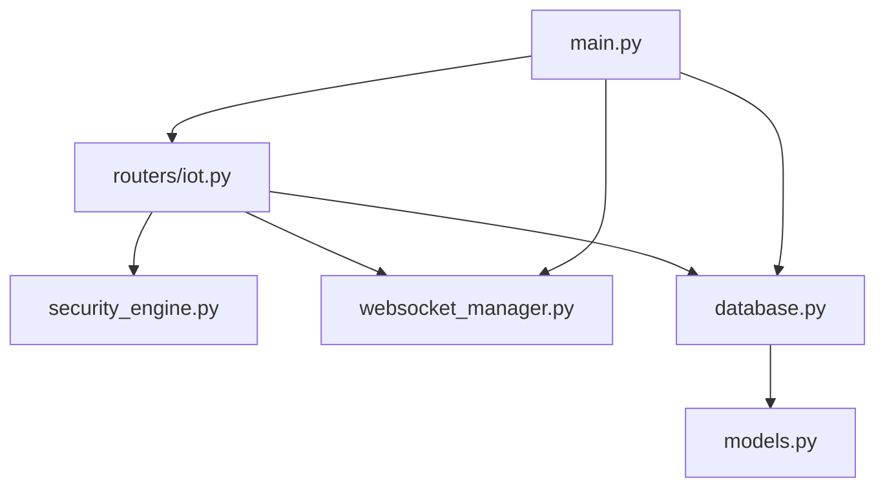

# Z-Wave and LoRaWAN Integration

<cite>
**Referenced Files in This Document**
- [main.py](file://backend/main.py)
- [iot.py](file://backend/routers/iot.py)
- [security_engine.py](file://backend/security_engine.py)
- [websocket_manager.py](file://backend/websocket_manager.py)
- [database.py](file://backend/database.py)
- [models.py](file://backend/models.py)
- [HARDWARE_GUIDE.md](file://backend/HARDWARE_GUIDE.md)
- [README.md](file://backend/README.md)
- [requirements.txt](file://backend/requirements.txt)
- [setup.sh](file://backend/setup.sh)
- [test_dongles.py](file://backend/test_dongles.py)
</cite>

## Table of Contents
1. [Introduction](#introduction)
2. [Project Structure](#project-structure)
3. [Core Components](#core-components)
4. [Architecture Overview](#architecture-overview)
5. [Detailed Component Analysis](#detailed-component-analysis)
6. [Dependency Analysis](#dependency-analysis)
7. [Performance Considerations](#performance-considerations)
8. [Troubleshooting Guide](#troubleshooting-guide)
9. [Conclusion](#conclusion)
10. [Appendices](#appendices)

## Introduction
This document provides comprehensive documentation for Z-Wave and LoRaWAN protocol integrations in PentexOne. It explains how the system detects and interacts with Z-Wave hardware (notably the Aeotec Z-Stick 7), simulates Z-Wave network scanning, and documents LoRaWAN scanning capabilities. It also covers serial communication protocols, network scanning procedures, controller concepts, device inclusion/exclusion processes, and security considerations for both protocols. The document includes setup instructions, driver requirements, simulated scanning modes, and troubleshooting guidance for serial communication and protocol-specific discovery issues.

## Project Structure
PentexOne’s backend is organized around a FastAPI application with modular routers. The IoT router implements protocol-specific scanning endpoints, including Z-Wave and LoRaWAN. Security assessments are performed by the security engine, and WebSocket broadcasting enables real-time updates to the frontend dashboard.

**Diagram sources**
- [main.py:1-106](file://backend/main.py#L1-L106)
- [iot.py:1-880](file://backend/routers/iot.py#L1-L880)
- [security_engine.py:1-425](file://backend/security_engine.py#L1-L425)
- [websocket_manager.py:1-48](file://backend/websocket_manager.py#L1-L48)
- [database.py:1-80](file://backend/database.py#L1-L80)
- [models.py:1-71](file://backend/models.py#L1-L71)
- [HARDWARE_GUIDE.md:1-399](file://backend/HARDWARE_GUIDE.md#L1-L399)
- [README.md:1-449](file://backend/README.md#L1-L449)
- [requirements.txt:1-21](file://backend/requirements.txt#L1-L21)
- [setup.sh:1-142](file://backend/setup.sh#L1-L142)
- [test_dongles.py:1-152](file://backend/test_dongles.py#L1-L152)

**Section sources**
- [main.py:1-106](file://backend/main.py#L1-L106)
- [README.md:1-449](file://backend/README.md#L1-L449)

## Core Components
- Z-Wave scanning endpoint: Initiates a Z-Wave network scan and broadcasts progress and results. It checks for a Z-Wave stick and sends a command to the serial port if present.
- LoRaWAN scanning endpoint: Simulates LoRaWAN device discovery and vulnerability assessment.
- Security engine: Provides vulnerability definitions and risk scoring for Z-Wave and LoRaWAN.
- WebSocket manager: Broadcasts scan progress and results to connected clients.
- Database models: Store discovered devices and associated vulnerabilities.
- Hardware detection utilities: Identify connected dongles and report readiness for each protocol.

**Section sources**
- [iot.py:727-778](file://backend/routers/iot.py#L727-L778)
- [iot.py:789-836](file://backend/routers/iot.py#L789-L836)
- [security_engine.py:165-179](file://backend/security_engine.py#L165-L179)
- [websocket_manager.py:1-48](file://backend/websocket_manager.py#L1-L48)
- [database.py:12-41](file://backend/database.py#L12-L41)
- [test_dongles.py:14-132](file://backend/test_dongles.py#L14-L132)

## Architecture Overview
The Z-Wave and LoRaWAN integration follows a request-response pattern with background tasks and WebSocket broadcasting. The IoT router handles scan initiation, performs protocol-specific discovery (real or simulated), and persists results to the database. The security engine evaluates risks and vulnerabilities, and the WebSocket manager pushes updates to the frontend.

**Diagram sources**
- [iot.py:727-778](file://backend/routers/iot.py#L727-L778)
- [websocket_manager.py:21-45](file://backend/websocket_manager.py#L21-L45)
- [database.py:12-27](file://backend/database.py#L12-L27)

**Section sources**
- [iot.py:727-778](file://backend/routers/iot.py#L727-L778)
- [websocket_manager.py:1-48](file://backend/websocket_manager.py#L1-L48)
- [database.py:12-41](file://backend/database.py#L12-L41)

## Detailed Component Analysis

### Z-Wave Integration
- Hardware compatibility: The system detects Z-Wave sticks by matching descriptions containing “Z-WAVE”, “Z-WAVE”, or “AEOTEC” and typically targets the Aeotec Z-Stick 7.
- Serial communication: The Z-Wave scan attempts to open the detected serial port at 115200 baud and writes a Z-Wave command frame. This simulates a controller command to probe the network.
- Network scanning: The scan proceeds with simulated device discovery and vulnerability assessment. It assigns risk levels and records vulnerabilities related to Z-Wave security weaknesses.
- Controller concept: The application acts as a controller by sending commands to the Z-Wave stick and interpreting responses. In this implementation, the command is sent to the serial port.
- Device inclusion/exclusion: The Z-Wave scan does not perform inclusion or exclusion; it focuses on discovery and vulnerability assessment.

**Diagram sources**
- [iot.py:733-778](file://backend/routers/iot.py#L733-L778)

**Section sources**
- [iot.py:727-778](file://backend/routers/iot.py#L727-L778)
- [HARDWARE_GUIDE.md:95-113](file://backend/HARDWARE_GUIDE.md#L95-L113)
- [requirements.txt:12-15](file://backend/requirements.txt#L12-L15)

### LoRaWAN Integration
- Hardware support: The system recognizes LoRaWAN adapters such as Dragino USB LoRa and simulates scanning across LoRaWAN frequencies.
- Scanning procedure: The LoRaWAN scan simulates device discovery across multiple LoRaWAN devices and applies vulnerability assessments specific to LoRaWAN.
- Vulnerability assessment: The security engine defines LoRaWAN-specific vulnerabilities, including acceptance of unconfirmed downlinks, weak DevNonce values, and potential join-request flooding.

**Diagram sources**
- [iot.py:789-836](file://backend/routers/iot.py#L789-L836)
- [security_engine.py:173-179](file://backend/security_engine.py#L173-L179)

**Section sources**
- [iot.py:783-836](file://backend/routers/iot.py#L783-L836)
- [security_engine.py:173-179](file://backend/security_engine.py#L173-L179)
- [HARDWARE_GUIDE.md:116-122](file://backend/HARDWARE_GUIDE.md#L116-L122)

### Security Considerations and Vulnerability Assessment
- Z-Wave vulnerabilities: The security engine defines critical and high-severity vulnerabilities for Z-Wave, including lack of encryption, inclusion vulnerabilities, replay attacks, and network key exposure.
- LoRaWAN vulnerabilities: The security engine defines vulnerabilities such as accepting unconfirmed downlinks, weak DevNonce values, lack of ADR limits, and susceptibility to join-request flooding.
- Remediation guidance: The security engine provides remediation advice for each vulnerability category, including enabling encryption, requiring confirmed downlinks, and strengthening authentication.

**Diagram sources**
- [security_engine.py:165-179](file://backend/security_engine.py#L165-L179)
- [security_engine.py:275-289](file://backend/security_engine.py#L275-L289)

**Section sources**
- [security_engine.py:165-179](file://backend/security_engine.py#L165-L179)
- [security_engine.py:275-289](file://backend/security_engine.py#L275-L289)

### Setup and Driver Requirements
- Hardware requirements: The project documentation recommends the Aeotec Z-Stick 7 for Z-Wave and Dragino USB LoRa adapter for LoRaWAN. It also provides installation steps for detecting and verifying dongles.
- Serial configuration: The Z-Wave scan uses 115200 baud on the detected serial port. Permissions for serial access are managed via group membership.
- Optional dependencies: The setup script checks for optional libraries such as KillerBee (for Zigbee) and cryptography (for TLS validation). While not required for Z-Wave and LoRaWAN, they are part of the broader ecosystem.

**Section sources**
- [HARDWARE_GUIDE.md:95-122](file://backend/HARDWARE_GUIDE.md#L95-L122)
- [iot.py:749](file://backend/routers/iot.py#L749)
- [setup.sh:84-99](file://backend/setup.sh#L84-L99)
- [requirements.txt:12-16](file://backend/requirements.txt#L12-L16)

### Simulated Scanning Modes
- Z-Wave simulation: When no Z-Wave stick is detected, the system proceeds with simulated discovery and vulnerability assessment.
- LoRaWAN simulation: The LoRaWAN scan simulates multiple devices and applies vulnerability assessments without requiring physical hardware.
- Hardware detection: The test_dongles utility scans serial ports and identifies compatible dongles, reporting readiness for each protocol.

**Section sources**
- [iot.py:733-778](file://backend/routers/iot.py#L733-L778)
- [iot.py:789-836](file://backend/routers/iot.py#L789-L836)
- [test_dongles.py:14-132](file://backend/test_dongles.py#L14-L132)

## Dependency Analysis
The Z-Wave and LoRaWAN integrations rely on the IoT router, security engine, WebSocket manager, and database. The router orchestrates scanning, the security engine evaluates risks, the WebSocket manager broadcasts updates, and the database persists results.

**Diagram sources**
- [iot.py:1-880](file://backend/routers/iot.py#L1-L880)
- [security_engine.py:1-425](file://backend/security_engine.py#L1-L425)
- [websocket_manager.py:1-48](file://backend/websocket_manager.py#L1-L48)
- [database.py:1-80](file://backend/database.py#L1-L80)
- [models.py:1-71](file://backend/models.py#L1-L71)
- [main.py:1-106](file://backend/main.py#L1-L106)

**Section sources**
- [iot.py:1-880](file://backend/routers/iot.py#L1-L880)
- [security_engine.py:1-425](file://backend/security_engine.py#L1-L425)
- [websocket_manager.py:1-48](file://backend/websocket_manager.py#L1-L48)
- [database.py:1-80](file://backend/database.py#L1-L80)
- [models.py:1-71](file://backend/models.py#L1-L71)
- [main.py:1-106](file://backend/main.py#L1-L106)

## Performance Considerations
- Real vs. simulated scanning: Real Z-Wave and LoRaWAN scanning may require hardware and drivers. When unavailable, simulated scans reduce overhead but do not replace hardware-based analysis.
- Background tasks: Scans run as background tasks to keep the API responsive. WebSocket broadcasting ensures real-time updates without blocking the main thread.
- Resource usage: Scanning multiple protocols concurrently increases CPU and memory usage. Optimize by disabling unused services and using a powered USB hub for multiple dongles.

[No sources needed since this section provides general guidance]

## Troubleshooting Guide
- Serial communication issues:
  - Verify USB dongle detection using the hardware detection utility.
  - Check permissions for serial access and ensure the user belongs to the appropriate groups.
  - Confirm the correct serial port is used and that the device is not busy.
- Z-Wave discovery problems:
  - Ensure the Z-Wave stick is plugged in and recognized by the system.
  - Confirm the serial port is accessible and not in use by another process.
  - If no stick is detected, the system falls back to simulated scanning.
- LoRaWAN discovery problems:
  - The LoRaWAN scan is currently experimental and relies on simulated devices.
  - Verify the LoRa adapter is recognized by the system and that permissions are configured correctly.
- General service issues:
  - Check logs for errors and verify the service is running.
  - Ensure the required ports are not blocked by firewalls.

**Section sources**
- [HARDWARE_GUIDE.md:252-309](file://backend/HARDWARE_GUIDE.md#L252-L309)
- [test_dongles.py:14-132](file://backend/test_dongles.py#L14-L132)
- [setup.sh:38-51](file://backend/setup.sh#L38-L51)

## Conclusion
PentexOne integrates Z-Wave and LoRaWAN scanning through dedicated endpoints in the IoT router, leveraging serial communication for Z-Wave and simulated discovery for LoRaWAN. The security engine provides comprehensive vulnerability assessments aligned with protocol-specific weaknesses. While hardware availability influences whether scanning is real or simulated, the system offers robust detection, risk evaluation, and real-time updates via WebSockets. Proper setup, permissions, and troubleshooting practices ensure reliable operation across protocols.

[No sources needed since this section summarizes without analyzing specific files]

## Appendices

### Appendix A: Z-Wave Security Vulnerabilities
- Lack of encryption (S0 legacy or no encryption)
- Forced inclusion attacks
- Replay attacks
- Network key exposure during pairing

**Section sources**
- [security_engine.py:165-171](file://backend/security_engine.py#L165-L171)

### Appendix B: LoRaWAN Security Vulnerabilities
- Acceptance of unconfirmed downlinks (beacon fraud)
- Weak DevNonce values
- No ADR limits (DoS vector)
- Join-request flooding

**Section sources**
- [security_engine.py:173-179](file://backend/security_engine.py#L173-L179)

### Appendix C: Setup Instructions
- Install dependencies and create a virtual environment.
- Configure environment variables and verify optional dependencies.
- Connect hardware dongles and verify detection using the hardware utility.
- Start the service and access the dashboard.

**Section sources**
- [setup.sh:1-142](file://backend/setup.sh#L1-L142)
- [HARDWARE_GUIDE.md:196-238](file://backend/HARDWARE_GUIDE.md#L196-L238)