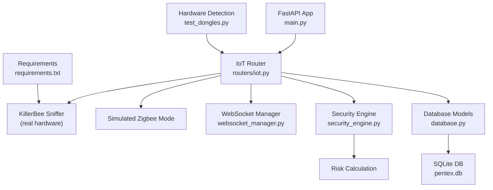
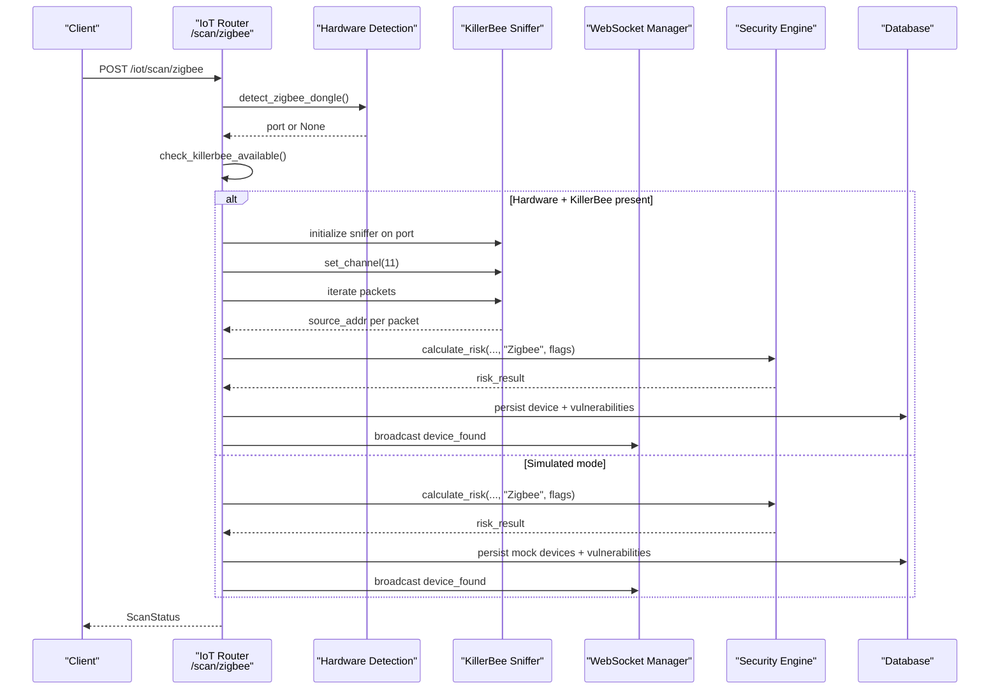
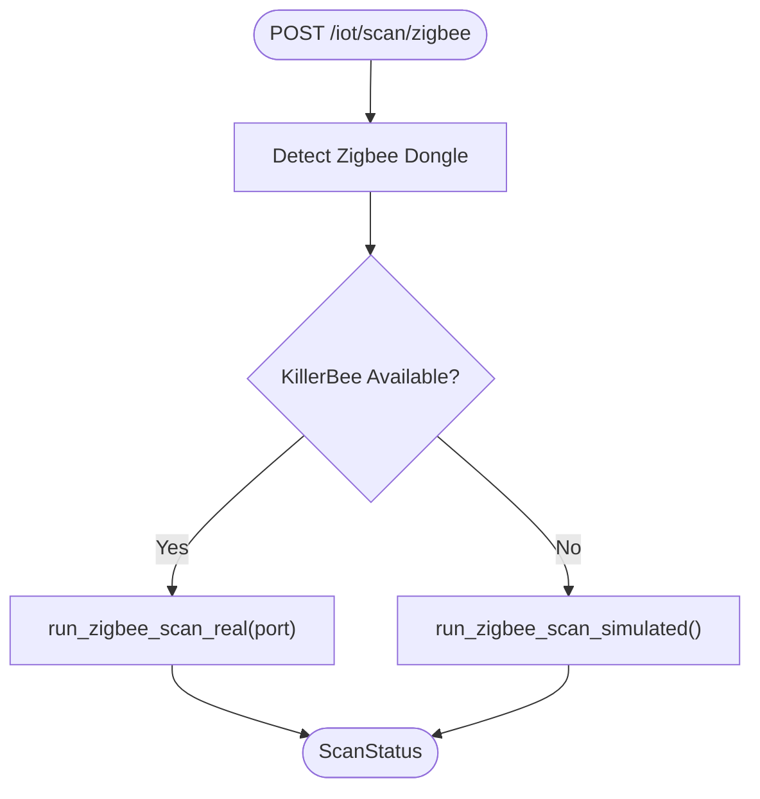
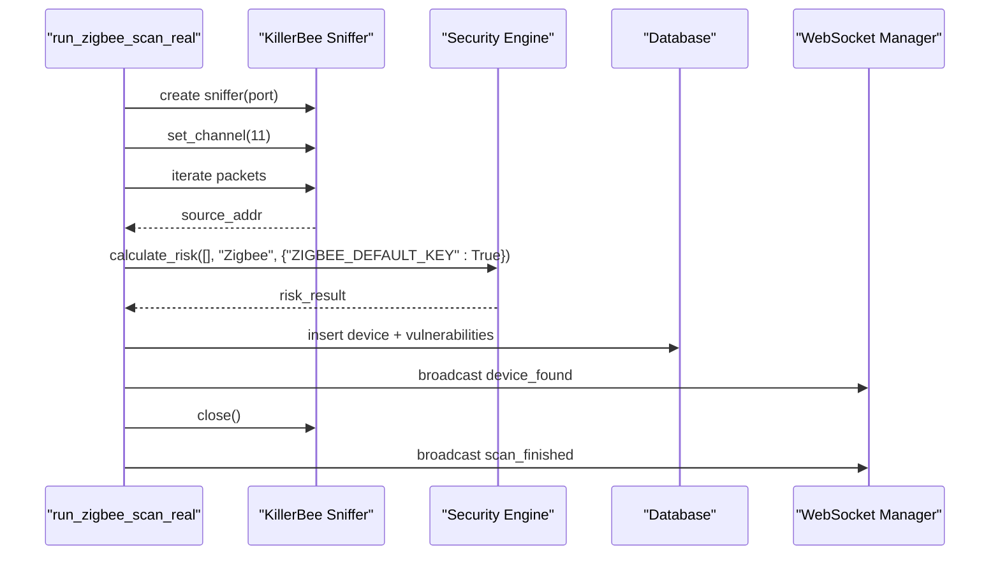
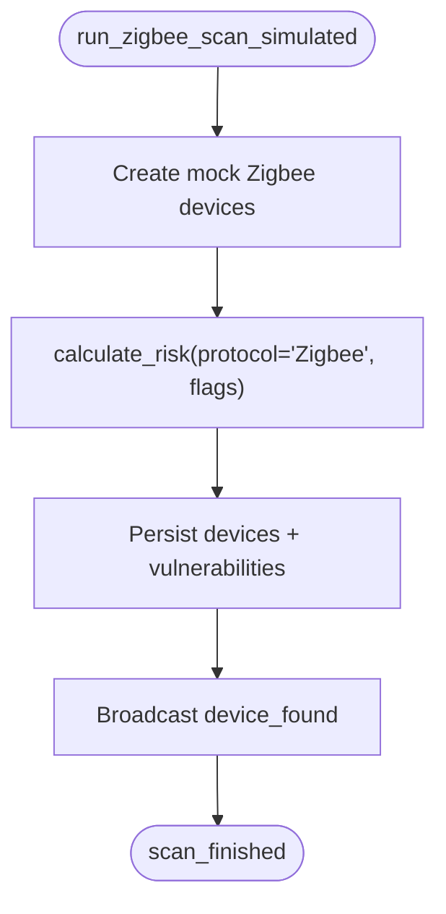
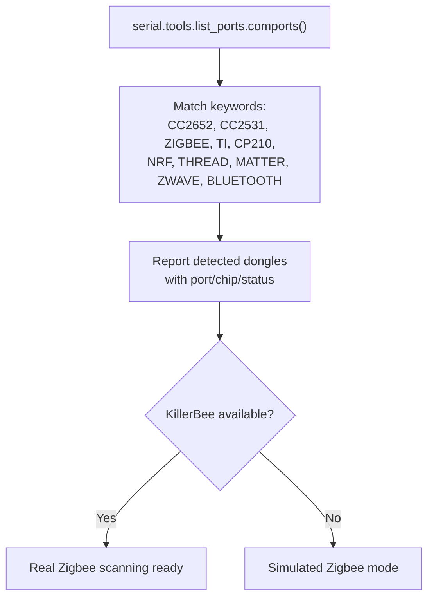
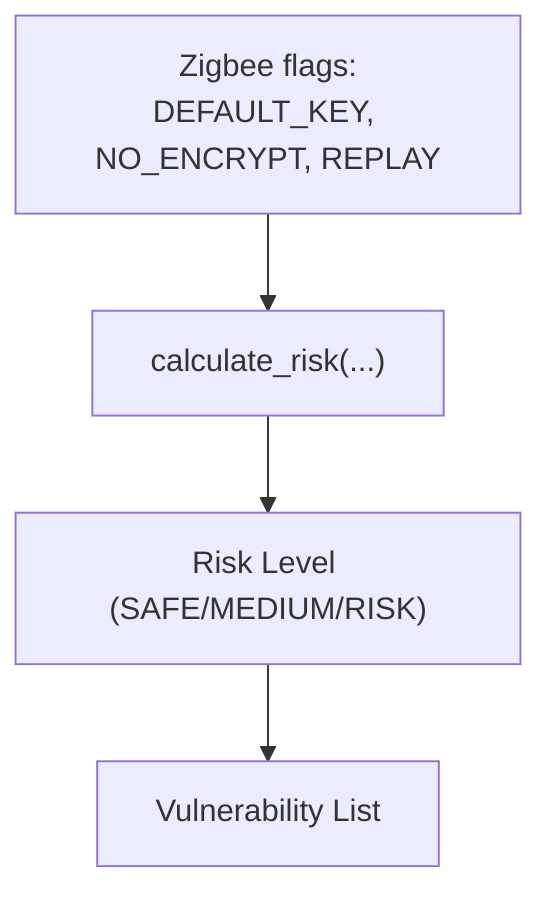
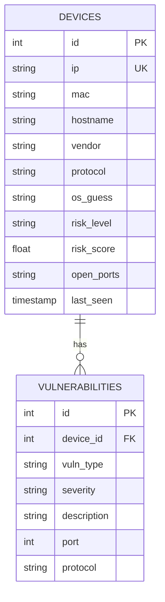
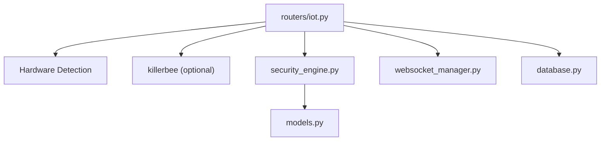

# Zigbee Protocol Integration

<cite>
**Referenced Files in This Document**
- [main.py](file://backend/main.py)
- [iot.py](file://backend/routers/iot.py)
- [security_engine.py](file://backend/security_engine.py)
- [websocket_manager.py](file://backend/websocket_manager.py)
- [database.py](file://backend/database.py)
- [models.py](file://backend/models.py)
- [test_dongles.py](file://backend/test_dongles.py)
- [requirements.txt](file://backend/requirements.txt)
- [HARDWARE_GUIDE.md](file://backend/HARDWARE_GUIDE.md)
- [README.md](file://backend/README.md)
</cite>

## Table of Contents
1. [Introduction](#introduction)
2. [Project Structure](#project-structure)
3. [Core Components](#core-components)
4. [Architecture Overview](#architecture-overview)
5. [Detailed Component Analysis](#detailed-component-analysis)
6. [Dependency Analysis](#dependency-analysis)
7. [Performance Considerations](#performance-considerations)
8. [Troubleshooting Guide](#troubleshooting-guide)
9. [Conclusion](#conclusion)
10. [Appendices](#appendices)

## Introduction
This document explains how PentexOne integrates Zigbee scanning capabilities, including real hardware sniffing using CC2652P/CC2531 dongles via the KillerBee library and a simulated Zigbee mode for environments without hardware. It details channel selection, packet sniffing mechanisms, device discovery, risk factor modeling, and setup/configuration for Zigbee dongles and serial communication. It also compares real hardware scanning versus simulated mode, outlines Zigbee security considerations, and provides guidance on common Zigbee network topologies and mesh concepts.

## Project Structure
The Zigbee integration is implemented within the backend’s FastAPI application. Key components include:
- Zigbee scanning endpoints and orchestration in the IoT router
- Risk scoring and vulnerability mapping in the security engine
- WebSocket broadcasting for live scan updates
- Database models for storing Zigbee devices and vulnerabilities
- Hardware detection utilities and optional KillerBee integration
- Setup and hardware guides for dongle configuration

**Diagram sources**
- [main.py:1-106](file://backend/main.py#L1-L106)
- [iot.py:480-586](file://backend/routers/iot.py#L480-L586)
- [websocket_manager.py:1-48](file://backend/websocket_manager.py#L1-L48)
- [security_engine.py:202-340](file://backend/security_engine.py#L202-L340)
- [database.py:12-41](file://backend/database.py#L12-L41)
- [test_dongles.py:14-152](file://backend/test_dongles.py#L14-L152)
- [requirements.txt:14-15](file://backend/requirements.txt#L14-L15)

**Section sources**
- [main.py:14-48](file://backend/main.py#L14-L48)
- [iot.py:480-586](file://backend/routers/iot.py#L480-L586)
- [websocket_manager.py:7-47](file://backend/websocket_manager.py#L7-L47)
- [database.py:12-41](file://backend/database.py#L12-L41)
- [test_dongles.py:14-152](file://backend/test_dongles.py#L14-L152)
- [requirements.txt:14-15](file://backend/requirements.txt#L14-L15)

## Core Components
- Zigbee scanning endpoint: Orchestrates real vs. simulated scanning based on hardware availability and KillerBee presence.
- KillerBee integration: Uses a Zigbee sniffer to capture packets on a selected channel and extract source MACs for device discovery.
- Simulated Zigbee mode: Emits mock Zigbee devices and applies Zigbee-specific risk flags for demonstration and testing.
- Risk engine: Applies Zigbee-specific vulnerability profiles (default keys, lack of encryption, replay risks) to compute risk scores.
- WebSocket updates: Broadcasts scan progress, discovered devices, and completion events to clients.
- Database persistence: Stores Zigbee devices and associated vulnerabilities with risk metadata.

**Section sources**
- [iot.py:483-493](file://backend/routers/iot.py#L483-L493)
- [iot.py:496-550](file://backend/routers/iot.py#L496-L550)
- [iot.py:552-586](file://backend/routers/iot.py#L552-L586)
- [security_engine.py:129-137](file://backend/security_engine.py#L129-L137)
- [websocket_manager.py:21-45](file://backend/websocket_manager.py#L21-L45)
- [database.py:12-41](file://backend/database.py#L12-L41)

## Architecture Overview
The Zigbee scanning pipeline supports two modes:
- Real hardware mode: Detects Zigbee dongle, verifies KillerBee availability, initializes a sniffer, sets a channel, captures packets, extracts unique source MACs, and persists devices with Zigbee-specific risk flags.
- Simulated mode: Creates mock Zigbee devices, applies Zigbee-specific risk flags, and persists them similarly.

**Diagram sources**
- [iot.py:483-493](file://backend/routers/iot.py#L483-L493)
- [iot.py:496-550](file://backend/routers/iot.py#L496-L550)
- [iot.py:552-586](file://backend/routers/iot.py#L552-L586)
- [security_engine.py:202-340](file://backend/security_engine.py#L202-L340)
- [websocket_manager.py:21-45](file://backend/websocket_manager.py#L21-L45)
- [database.py:12-41](file://backend/database.py#L12-L41)

## Detailed Component Analysis

### Zigbee Endpoint and Mode Selection
- Endpoint: POST /iot/scan/zigbee
- Logic:
  - Detect Zigbee dongle via serial port inspection.
  - Check KillerBee availability.
  - If both present: start real Zigbee scan.
  - Else: start simulated Zigbee scan.

**Diagram sources**
- [iot.py:483-493](file://backend/routers/iot.py#L483-L493)

**Section sources**
- [iot.py:483-493](file://backend/routers/iot.py#L483-L493)

### Real Hardware Zigbee Scanning
- Initialization:
  - Sniffer created using the KillerBee library targeting the detected Zigbee port.
  - Channel set to a common default (e.g., channel 11).
- Packet Sniffing:
  - Captures Zigbee frames and extracts source MAC addresses.
  - Deduplicates devices by MAC address.
- Risk Modeling:
  - Applies Zigbee-specific vulnerability flags (e.g., default key exposure).
- Persistence:
  - Stores discovered devices and vulnerabilities in the database.
- Live Updates:
  - Broadcasts device_found and scan_finished events via WebSocket.

**Diagram sources**
- [iot.py:496-550](file://backend/routers/iot.py#L496-L550)
- [security_engine.py:244-249](file://backend/security_engine.py#L244-L249)
- [websocket_manager.py:21-45](file://backend/websocket_manager.py#L21-L45)
- [database.py:12-41](file://backend/database.py#L12-L41)

**Section sources**
- [iot.py:496-550](file://backend/routers/iot.py#L496-L550)
- [requirements.txt:14-15](file://backend/requirements.txt#L14-L15)

### Simulated Zigbee Scanning
- Behavior:
  - Generates mock Zigbee devices with distinct MAC addresses and vendors.
  - Applies Zigbee-specific risk flags for demonstration.
  - Persists devices and vulnerabilities and emits live updates.
- Use Cases:
  - Development and testing without physical hardware.
  - Demonstrating UI and reporting workflows.

**Diagram sources**
- [iot.py:552-586](file://backend/routers/iot.py#L552-L586)
- [security_engine.py:244-249](file://backend/security_engine.py#L244-L249)
- [websocket_manager.py:21-45](file://backend/websocket_manager.py#L21-L45)
- [database.py:12-41](file://backend/database.py#L12-L41)

**Section sources**
- [iot.py:552-586](file://backend/routers/iot.py#L552-L586)

### Hardware Detection and Serial Communication
- Hardware detection:
  - Scans serial ports and identifies Zigbee, Thread/Matter, Z-Wave, and Bluetooth dongles by description/hwid keywords.
  - Reports detailed status and readiness indicators.
- Serial communication:
  - Real Zigbee scanning uses pyserial to communicate with the dongle.
  - The test utility demonstrates listing serial ports and verifying KillerBee installation.

**Diagram sources**
- [iot.py:27-156](file://backend/routers/iot.py#L27-L156)
- [test_dongles.py:14-152](file://backend/test_dongles.py#L14-L152)

**Section sources**
- [iot.py:27-156](file://backend/routers/iot.py#L27-L156)
- [test_dongles.py:14-152](file://backend/test_dongles.py#L14-L152)

### Risk Factors and Security Considerations
- Zigbee-specific risk factors applied by the security engine include:
  - Default TC Link key usage
  - No network encryption
  - Replay attack susceptibility
- These flags are combined with risk scoring to produce a risk level and vulnerability list for Zigbee devices.

**Diagram sources**
- [security_engine.py:129-137](file://backend/security_engine.py#L129-L137)
- [security_engine.py:244-249](file://backend/security_engine.py#L244-L249)
- [security_engine.py:202-340](file://backend/security_engine.py#L202-L340)

**Section sources**
- [security_engine.py:129-137](file://backend/security_engine.py#L129-L137)
- [security_engine.py:244-249](file://backend/security_engine.py#L244-L249)
- [security_engine.py:202-340](file://backend/security_engine.py#L202-L340)

### Data Model for Zigbee Devices
Zigbee devices are stored alongside other IoT devices with risk metadata and associated vulnerabilities.

**Diagram sources**
- [database.py:12-41](file://backend/database.py#L12-L41)

**Section sources**
- [database.py:12-41](file://backend/database.py#L12-L41)

## Dependency Analysis
- External libraries:
  - KillerBee for real Zigbee sniffing (optional).
  - pyserial for serial communication with dongles.
  - WebSocket support for live updates.
- Internal dependencies:
  - IoT router depends on hardware detection, KillerBee/sniffer, security engine, WebSocket manager, and database models.
  - Risk engine encapsulates Zigbee-specific vulnerability profiles.

**Diagram sources**
- [iot.py:483-493](file://backend/routers/iot.py#L483-L493)
- [security_engine.py:202-340](file://backend/security_engine.py#L202-L340)
- [websocket_manager.py:7-47](file://backend/websocket_manager.py#L7-L47)
- [database.py:12-41](file://backend/database.py#L12-L41)
- [models.py:68-71](file://backend/models.py#L68-L71)

**Section sources**
- [requirements.txt:14-15](file://backend/requirements.txt#L14-L15)
- [iot.py:483-493](file://backend/routers/iot.py#L483-L493)
- [security_engine.py:202-340](file://backend/security_engine.py#L202-L340)
- [websocket_manager.py:7-47](file://backend/websocket_manager.py#L7-L47)
- [database.py:12-41](file://backend/database.py#L12-L41)
- [models.py:68-71](file://backend/models.py#L68-L71)

## Performance Considerations
- Real hardware scanning:
  - Requires USB dongle connectivity and KillerBee installation.
  - Channel selection impacts detection coverage; default channel 11 is used in the implementation.
  - Packet capture duration and channel dwell time influence completeness.
- Simulated mode:
  - Lower overhead, suitable for development and CI.
  - Risk scoring remains consistent for evaluation workflows.
- Accuracy trade-offs:
  - Real scans reflect actual network conditions and device activity.
  - Simulated scans provide deterministic results for reproducibility.

[No sources needed since this section provides general guidance]

## Troubleshooting Guide
- Hardware detection:
  - Use the hardware test utility to list serial ports and verify dongle presence and KillerBee availability.
- Permissions:
  - Ensure user belongs to dialout/tty groups for serial access.
- KillerBee installation:
  - Confirm KillerBee is installed; otherwise, Zigbee scanning falls back to simulated mode.
- Logs and status:
  - Monitor WebSocket broadcasts for scan progress and errors.
  - Check database entries for persisted devices and vulnerabilities.

**Section sources**
- [test_dongles.py:134-152](file://backend/test_dongles.py#L134-L152)
- [HARDWARE_GUIDE.md:252-282](file://backend/HARDWARE_GUIDE.md#L252-L282)
- [websocket_manager.py:21-45](file://backend/websocket_manager.py#L21-L45)
- [database.py:69-80](file://backend/database.py#L69-L80)

## Conclusion
PentexOne’s Zigbee integration provides a robust, dual-mode scanning solution:
- Real hardware scanning leverages KillerBee and serial communication to capture Zigbee traffic, extract device identities, and apply Zigbee-specific risk factors.
- Simulated mode enables development, testing, and demonstrations without dedicated hardware.
The system’s modular design, WebSocket-driven updates, and database-backed persistence support scalable IoT security assessments across Zigbee and other protocols.

[No sources needed since this section summarizes without analyzing specific files]

## Appendices

### Setup Instructions for Zigbee Dongles and Serial Communication
- Recommended Zigbee dongles:
  - Sonoff Zigbee 3.0 USB Dongle Plus (CC2652P) or CC2531-based sticks.
- Installation steps:
  - Plug the dongle into a USB port.
  - Verify detection using ls -la /dev/ttyUSB*.
  - Run the hardware test utility to confirm KillerBee availability.
- Driver requirements:
  - KillerBee is optional; if absent, Zigbee scanning uses simulated mode.
- Serial communication:
  - pyserial is used for port enumeration and communication with dongles.

**Section sources**
- [HARDWARE_GUIDE.md:46-70](file://backend/HARDWARE_GUIDE.md#L46-L70)
- [test_dongles.py:134-152](file://backend/test_dongles.py#L134-L152)
- [requirements.txt:12-15](file://backend/requirements.txt#L12-L15)

### Zigbee Channel Selection and Packet Sniffing Mechanisms
- Channel selection:
  - The implementation sets a default channel for sniffing.
- Packet sniffing:
  - Iterates captured packets and extracts source MAC addresses to deduplicate and identify devices.
- Device discovery:
  - Unique source MACs are treated as discovered Zigbee devices.

**Section sources**
- [iot.py:507-522](file://backend/routers/iot.py#L507-L522)

### Zigbee Security Considerations and Risk Factors
- Default key vulnerabilities:
  - Using default TC Link keys increases exploitability.
- Encryption weaknesses:
  - Unencrypted networks expose traffic to eavesdropping.
- Replay attacks:
  - Lack of anti-replay protections can enable message replay.
- Commissioning issues:
  - While primarily Matter-related, Zigbee networks can exhibit weak commissioning controls if default keys or insecure configurations are used.

**Section sources**
- [security_engine.py:129-137](file://backend/security_engine.py#L129-L137)

### Difference Between Real Hardware Scanning and Simulated Mode
- Real hardware scanning:
  - Requires compatible Zigbee dongle and KillerBee.
  - Provides accurate, real-time device discovery and risk assessment.
- Simulated mode:
  - Operates without hardware, emitting mock devices and applying Zigbee-specific risk flags.
  - Useful for development, testing, and demonstrations.

**Section sources**
- [iot.py:483-493](file://backend/routers/iot.py#L483-L493)
- [iot.py:552-586](file://backend/routers/iot.py#L552-L586)

### Common Zigbee Network Topologies and Mesh Concepts
- Zigbee operates over IEEE 802.15.4 and supports mesh networking with:
  - Coordinator: Central management entity.
  - Routers: Extend network coverage and relay messages.
  - End Devices: Battery-powered sensors/actuators with limited range.
- Mesh benefits:
  - Self-healing paths and multi-hop routing improve reliability.
- Security implications:
  - Weak link keys, lack of encryption, and default credentials compromise entire mesh networks.

[No sources needed since this section provides general guidance]