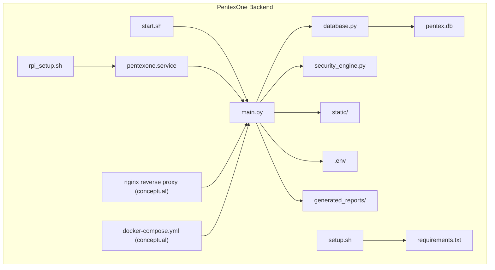
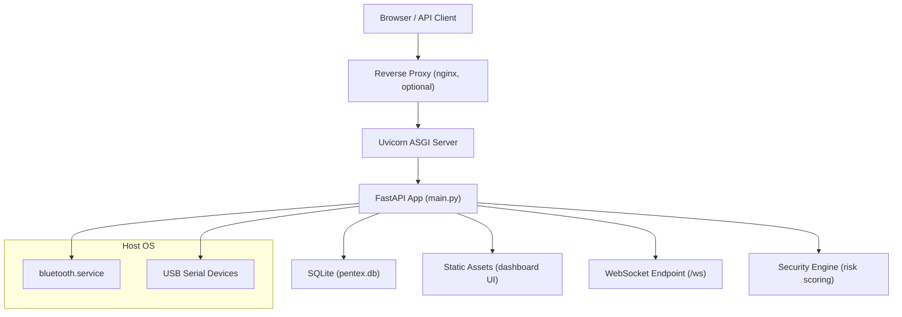
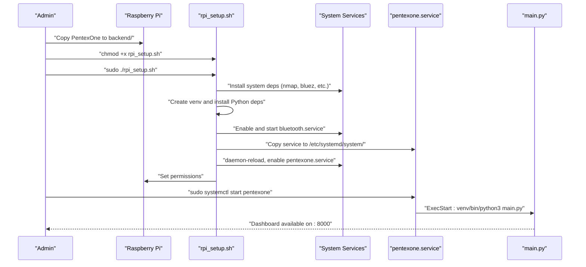
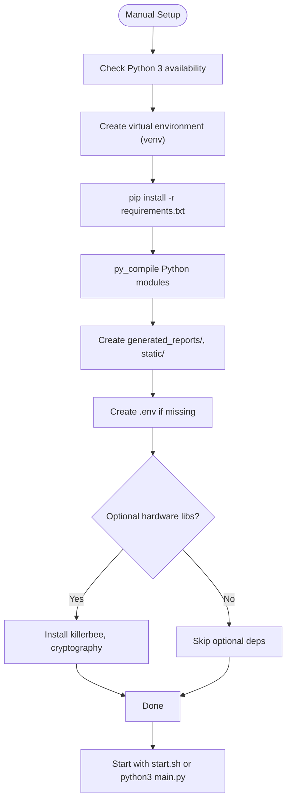
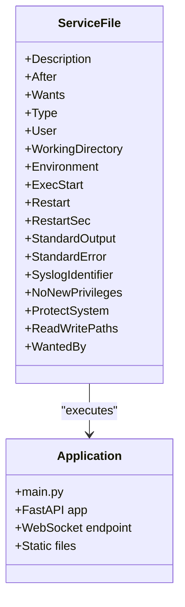
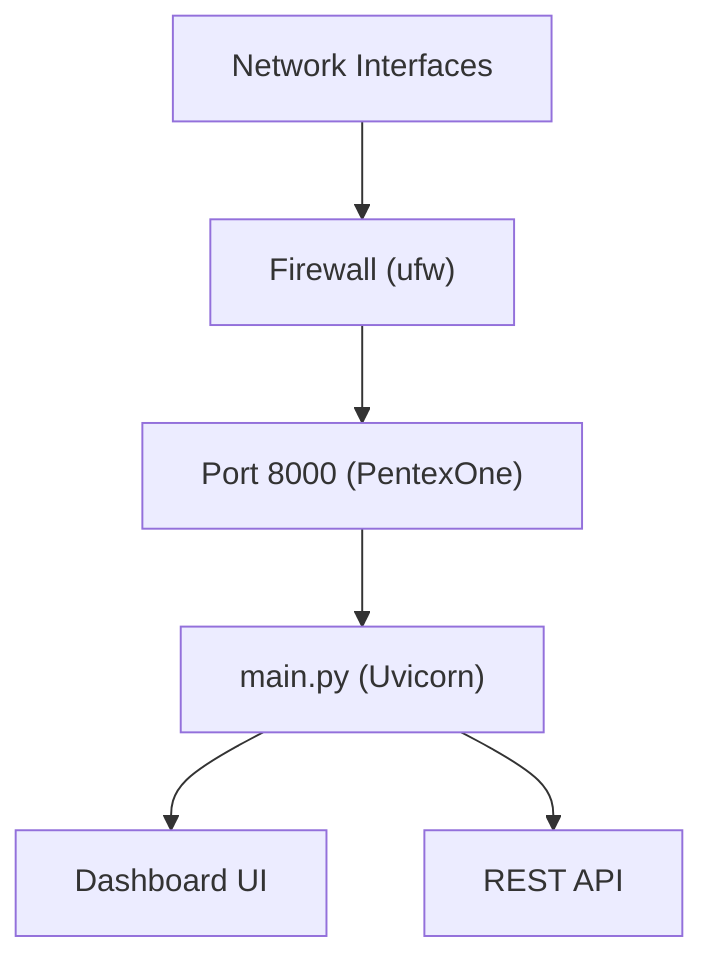
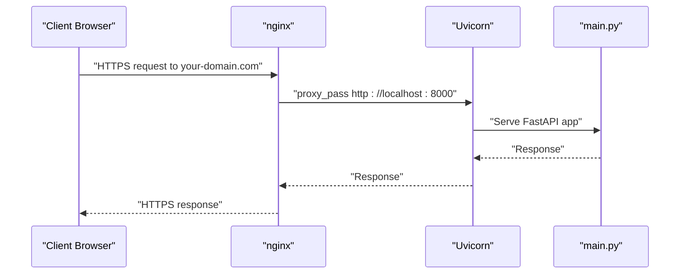
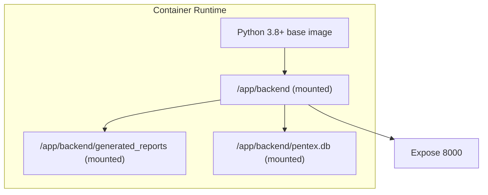
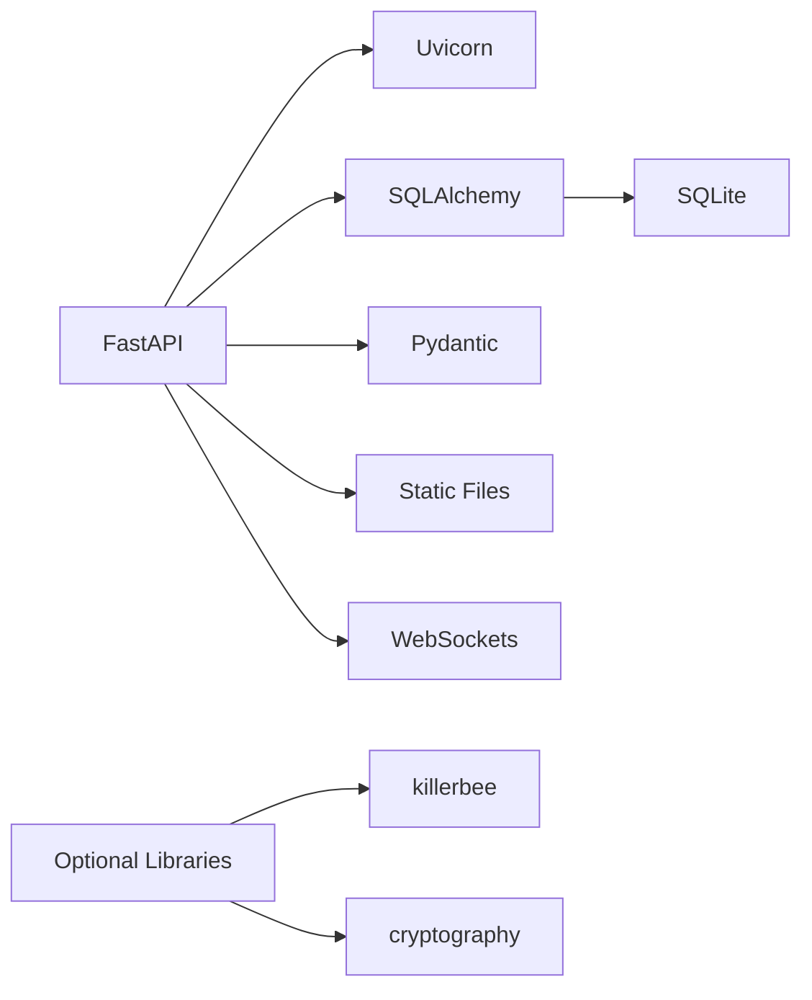

# Deployment Options

<cite>
**Referenced Files in This Document**
- [RASPBERRY_PI_GUIDE.md](file://backend/RASPBERRY_PI_GUIDE.md)
- [DEPLOYMENT_CHECKLIST.md](file://backend/DEPLOYMENT_CHECKLIST.md)
- [HARDWARE_GUIDE.md](file://backend/HARDWARE_GUIDE.md)
- [rpi_setup.sh](file://backend/rpi_setup.sh)
- [pentexone.service](file://backend/pentexone.service)
- [start.sh](file://backend/start.sh)
- [setup.sh](file://backend/setup.sh)
- [requirements.txt](file://backend/requirements.txt)
- [main.py](file://backend/main.py)
- [database.py](file://backend/database.py)
- [security_engine.py](file://backend/security_engine.py)
- [test_dongles.py](file://backend/test_dongles.py)
- [QUICK_REFERENCE.md](file://backend/QUICK_REFERENCE.md)
</cite>

## Table of Contents
1. [Introduction](#introduction)
2. [Project Structure](#project-structure)
3. [Core Components](#core-components)
4. [Architecture Overview](#architecture-overview)
5. [Detailed Component Analysis](#detailed-component-analysis)
6. [Dependency Analysis](#dependency-analysis)
7. [Performance Considerations](#performance-considerations)
8. [Troubleshooting Guide](#troubleshooting-guide)
9. [Conclusion](#conclusion)
10. [Appendices](#appendices)

## Introduction
This document provides comprehensive deployment guidance for PentexOne across multiple environments. It covers:
- Automated Raspberry Pi deployment using the provided installer script and systemd service
- Manual deployment procedures for development and non-Raspberry Pi systems
- Network and security hardening considerations
- Production-grade HTTPS, reverse proxy, and SSL certificate management
- Containerization and cloud deployment options
- Monitoring, logging, and maintenance procedures
- Environment-specific deployment checklists and verification steps

## Project Structure
PentexOne’s backend is a FastAPI application packaged with a SQLite database, static assets, and scripts for deployment and diagnostics. Key deployment-related artifacts include:
- Installer and service files for Raspberry Pi
- Scripts for environment setup and quick start
- Systemd service definition for auto-start
- Requirements and runtime configuration
- Hardware and deployment guides

**Diagram sources**
- [main.py:1-106](file://backend/main.py#L1-L106)
- [database.py:1-80](file://backend/database.py#L1-L80)
- [security_engine.py:1-425](file://backend/security_engine.py#L1-L425)
- [requirements.txt:1-21](file://backend/requirements.txt#L1-L21)
- [setup.sh:1-142](file://backend/setup.sh#L1-L142)
- [rpi_setup.sh:1-139](file://backend/rpi_setup.sh#L1-L139)
- [start.sh:1-38](file://backend/start.sh#L1-L38)
- [pentexone.service:1-25](file://backend/pentexone.service#L1-L25)

**Section sources**
- [main.py:1-106](file://backend/main.py#L1-L106)
- [database.py:1-80](file://backend/database.py#L1-L80)
- [requirements.txt:1-21](file://backend/requirements.txt#L1-L21)

## Core Components
- FastAPI application with routing for IoT scanning, AI analysis, reports, and access control
- SQLite-backed ORM models for devices, vulnerabilities, RFID cards, and settings
- Security engine for risk scoring and remediation
- Static asset serving for the dashboard UI
- Environment-driven credentials and settings
- Systemd service for production auto-start and logging

Key runtime characteristics:
- Default port: 8000
- Authentication via environment variables
- WebSocket endpoint for live updates
- CORS middleware enabled for development

**Section sources**
- [main.py:1-106](file://backend/main.py#L1-L106)
- [database.py:1-80](file://backend/database.py#L1-L80)
- [security_engine.py:1-425](file://backend/security_engine.py#L1-L425)

## Architecture Overview
PentexOne runs as a FastAPI application served by Uvicorn. It integrates with:
- System services for Bluetooth and USB hardware
- Optional hardware dongles for Zigbee, Thread/Matter, Z-Wave
- Database for persistent state and reports
- Static files for the dashboard UI

**Diagram sources**
- [main.py:1-106](file://backend/main.py#L1-L106)
- [pentexone.service:1-25](file://backend/pentexone.service#L1-L25)

## Detailed Component Analysis

### Raspberry Pi Automated Deployment
- Uses a dedicated installer script to provision system and Python dependencies, create a virtual environment, configure environment variables, enable and install the systemd service, and set permissions.
- The systemd service runs under the “pi” user, sets the working directory, activates the virtual environment, and starts the application with Uvicorn.

**Diagram sources**
- [rpi_setup.sh:1-139](file://backend/rpi_setup.sh#L1-L139)
- [pentexone.service:1-25](file://backend/pentexone.service#L1-L25)
- [main.py:103-106](file://backend/main.py#L103-L106)

**Section sources**
- [RASPBERRY_PI_GUIDE.md:44-84](file://backend/RASPBERRY_PI_GUIDE.md#L44-L84)
- [RASPBERRY_PI_GUIDE.md:159-180](file://backend/RASPBERRY_PI_GUIDE.md#L159-L180)
- [rpi_setup.sh:1-139](file://backend/rpi_setup.sh#L1-L139)
- [pentexone.service:1-25](file://backend/pentexone.service#L1-L25)

### Manual Deployment (Development and Non-Raspberry Pi)
- Use the cross-platform setup script to create a virtual environment, install Python dependencies, compile Python files, create required directories, and set environment variables.
- Start the application manually using the quick start script or by activating the virtual environment and running the main module.

**Diagram sources**
- [setup.sh:1-142](file://backend/setup.sh#L1-L142)
- [requirements.txt:1-21](file://backend/requirements.txt#L1-L21)
- [start.sh:1-38](file://backend/start.sh#L1-L38)
- [main.py:103-106](file://backend/main.py#L103-L106)

**Section sources**
- [setup.sh:1-142](file://backend/setup.sh#L1-L142)
- [start.sh:1-38](file://backend/start.sh#L1-L38)
- [QUICK_REFERENCE.md:5-18](file://backend/QUICK_REFERENCE.md#L5-L18)

### Systemd Service Configuration and Management
- The service file defines the user, working directory, environment activation, ExecStart command, restart policy, and logging to journald.
- Management commands include start, stop, restart, status, enable, and disable.

**Diagram sources**
- [pentexone.service:1-25](file://backend/pentexone.service#L1-L25)
- [main.py:1-106](file://backend/main.py#L1-L106)

**Section sources**
- [pentexone.service:1-25](file://backend/pentexone.service#L1-L25)
- [RASPBERRY_PI_GUIDE.md:215-237](file://backend/RASPBERRY_PI_GUIDE.md#L215-L237)

### Network Deployment Considerations
- Default port is 8000; ensure it is reachable on the host network.
- Firewall configuration should allow inbound TCP on port 8000 and SSH as needed.
- For production, route traffic through a reverse proxy (nginx) to terminate TLS and forward to the local port.

**Diagram sources**
- [RASPBERRY_PI_GUIDE.md:550-578](file://backend/RASPBERRY_PI_GUIDE.md#L550-L578)
- [main.py:103-106](file://backend/main.py#L103-L106)

**Section sources**
- [RASPBERRY_PI_GUIDE.md:550-578](file://backend/RASPBERRY_PI_GUIDE.md#L550-L578)
- [RASPBERRY_PI_GUIDE.md:424-439](file://backend/RASPBERRY_PI_GUIDE.md#L424-L439)

### Security Hardening Steps
- Change default credentials in the environment file.
- Enable and configure the firewall to restrict inbound connections.
- Prefer SSH key-based authentication and disable password authentication.
- Keep the system updated and disable unused services.
- Restrict database and environment file permissions.

**Section sources**
- [RASPBERRY_PI_GUIDE.md:115-138](file://backend/RASPBERRY_PI_GUIDE.md#L115-L138)
- [HARDWARE_GUIDE.md:343-376](file://backend/HARDWARE_GUIDE.md#L343-L376)

### Production HTTPS, Reverse Proxy, and SSL Certificate Management
- Install nginx and configure it as a reverse proxy to forward traffic to the local port.
- Obtain an SSL certificate using Certbot for nginx.
- Ensure the reverse proxy preserves Host and client IP headers.

**Diagram sources**
- [RASPBERRY_PI_GUIDE.md:550-578](file://backend/RASPBERRY_PI_GUIDE.md#L550-L578)

**Section sources**
- [RASPBERRY_PI_GUIDE.md:550-578](file://backend/RASPBERRY_PI_GUIDE.md#L550-L578)

### Container Deployment Options
- Build a container image with Python 3.8+ and the application dependencies.
- Expose port 8000 and mount persistent volumes for the database and generated reports.
- Use a reverse proxy (nginx) outside the container for TLS termination.

[No sources needed since this diagram shows conceptual containerization, not actual code structure]

### Cloud Deployment Considerations
- Choose a cloud provider with sufficient CPU and memory for concurrent scanning tasks.
- Use managed databases if you prefer not to manage SQLite persistence.
- Deploy behind a load balancer and reverse proxy for HTTPS and scaling.
- Implement secrets management for credentials and environment variables.

[No sources needed since this section provides general guidance]

### Scaling Strategies
- Horizontal scaling: Run multiple instances behind a load balancer; ensure shared storage for reports and a centralized database.
- Vertical scaling: Increase CPU/memory resources on the host or container.
- Background workers: Offload heavy scanning tasks to background jobs if architecture permits.

[No sources needed since this section provides general guidance]

## Dependency Analysis
PentexOne depends on:
- FastAPI and Uvicorn for the web server and ASGI runtime
- SQLAlchemy for ORM and SQLite persistence
- Pydantic for request/response models
- Optional hardware libraries for Zigbee and TLS validation
- System-level packages for Bluetooth and network scanning

**Diagram sources**
- [requirements.txt:1-21](file://backend/requirements.txt#L1-L21)
- [main.py:1-106](file://backend/main.py#L1-L106)
- [database.py:1-80](file://backend/database.py#L1-L80)

**Section sources**
- [requirements.txt:1-21](file://backend/requirements.txt#L1-L21)

## Performance Considerations
- Resource usage: Monitor CPU, memory, and disk; adjust swap and GPU memory on Raspberry Pi models as needed.
- Network scanning: Ensure Wi-Fi interface is free when performing scans; reduce concurrent scans to avoid interference.
- Hardware: Use a powered USB hub for multiple dongles; ensure adequate cooling.

**Section sources**
- [HARDWARE_GUIDE.md:312-339](file://backend/HARDWARE_GUIDE.md#L312-L339)
- [RASPBERRY_PI_GUIDE.md:507-525](file://backend/RASPBERRY_PI_GUIDE.md#L507-L525)

## Troubleshooting Guide
Common issues and resolutions:
- Service won’t start: Check systemd logs, verify port availability, reinstall dependencies, fix permissions.
- Cannot access dashboard: Confirm service status, firewall rules, and local connectivity.
- USB dongles not detected: Verify permissions, check serial ports, and reboot.
- Bluetooth problems: Restart the Bluetooth service and unblock the interface.
- Wi-Fi scanning issues: Ensure the interface is not busy; toggle Wi-Fi radio via network manager.
- Database issues: Back up the database, reset it if necessary, and reinitialize.

**Section sources**
- [RASPBERRY_PI_GUIDE.md:402-461](file://backend/RASPBERRY_PI_GUIDE.md#L402-L461)
- [RASPBERRY_PI_GUIDE.md:480-505](file://backend/RASPBERRY_PI_GUIDE.md#L480-L505)
- [HARDWARE_GUIDE.md:252-308](file://backend/HARDWARE_GUIDE.md#L252-L308)

## Conclusion
PentexOne offers a robust deployment story across environments:
- Raspberry Pi deployments benefit from the automated installer and systemd service for reliable, auto-start operation.
- Manual deployments are straightforward using the setup and start scripts.
- Production deployments should incorporate HTTPS via a reverse proxy, strict firewall rules, and hardened SSH access.
- Monitoring, backups, and periodic maintenance ensure long-term reliability.

[No sources needed since this section summarizes without analyzing specific files]

## Appendices

### Deployment Checklists

#### Raspberry Pi Deployment Checklist
- Hardware and OS prerequisites met
- Installer executed successfully
- Environment file updated with strong credentials
- Service enabled and started
- Port 8000 listening and accessible
- Dashboard login successful
- Hardware dongles detected and functional
- Reports generation verified

**Section sources**
- [DEPLOYMENT_CHECKLIST.md:7-139](file://backend/DEPLOYMENT_CHECKLIST.md#L7-L139)
- [RASPBERRY_PI_GUIDE.md:44-84](file://backend/RASPBERRY_PI_GUIDE.md#L44-L84)

#### Manual Deployment Checklist
- Virtual environment created and activated
- Dependencies installed without errors
- Python modules compiled successfully
- Required directories present
- Environment variables configured
- Application starts locally on port 8000
- Dashboard and API docs accessible

**Section sources**
- [DEPLOYMENT_CHECKLIST.md:30-112](file://backend/DEPLOYMENT_CHECKLIST.md#L30-L112)
- [setup.sh:1-142](file://backend/setup.sh#L1-L142)

#### Production Readiness Checklist
- All pre-deployment items completed
- Staging testing performed
- Monitoring and alerting configured
- Backup and restore validated
- Update and support plans defined

**Section sources**
- [DEPLOYMENT_CHECKLIST.md:223-250](file://backend/DEPLOYMENT_CHECKLIST.md#L223-L250)

### Verification Steps by Environment

#### Raspberry Pi Verification
- Service status: active and running
- Port 8000 bound to 0.0.0.0
- Local curl to port 8000 returns expected response
- Dashboard loads and login succeeds
- Hardware status shows connected dongles
- Scans complete without errors
- AI features produce scores and recommendations
- Reports export and open correctly

**Section sources**
- [DEPLOYMENT_CHECKLIST.md:55-112](file://backend/DEPLOYMENT_CHECKLIST.md#L55-L112)
- [RASPBERRY_PI_GUIDE.md:215-262](file://backend/RASPBERRY_PI_GUIDE.md#L215-L262)

#### Manual Environment Verification
- Virtual environment active
- Dependencies installed and importable
- Application starts and listens on 8000
- Dashboard and API docs accessible locally
- WebSocket endpoint responds to heartbeats

**Section sources**
- [DEPLOYMENT_CHECKLIST.md:55-112](file://backend/DEPLOYMENT_CHECKLIST.md#L55-L112)
- [start.sh:1-38](file://backend/start.sh#L1-L38)

### Monitoring and Maintenance Procedures
- Logs: Use systemd journalctl to follow and filter logs for the service
- System resources: Monitor CPU, memory, disk, and temperature
- Backups: Schedule regular tar-based backups of the database and generated reports
- Updates: Periodically update system packages and application dependencies
- Maintenance: Establish weekly, monthly, quarterly, and annual maintenance cycles

**Section sources**
- [RASPBERRY_PI_GUIDE.md:265-311](file://backend/RASPBERRY_PI_GUIDE.md#L265-L311)
- [DEPLOYMENT_CHECKLIST.md:242-249](file://backend/DEPLOYMENT_CHECKLIST.md#L242-L249)

### Hardware and Dongle Validation
- Use the hardware detection script to enumerate connected USB serial devices and confirm dongle presence
- Verify permissions for serial devices and group membership
- Test dongles individually and in combination

**Section sources**
- [test_dongles.py:1-152](file://backend/test_dongles.py#L1-L152)
- [HARDWARE_GUIDE.md:252-282](file://backend/HARDWARE_GUIDE.md#L252-L282)