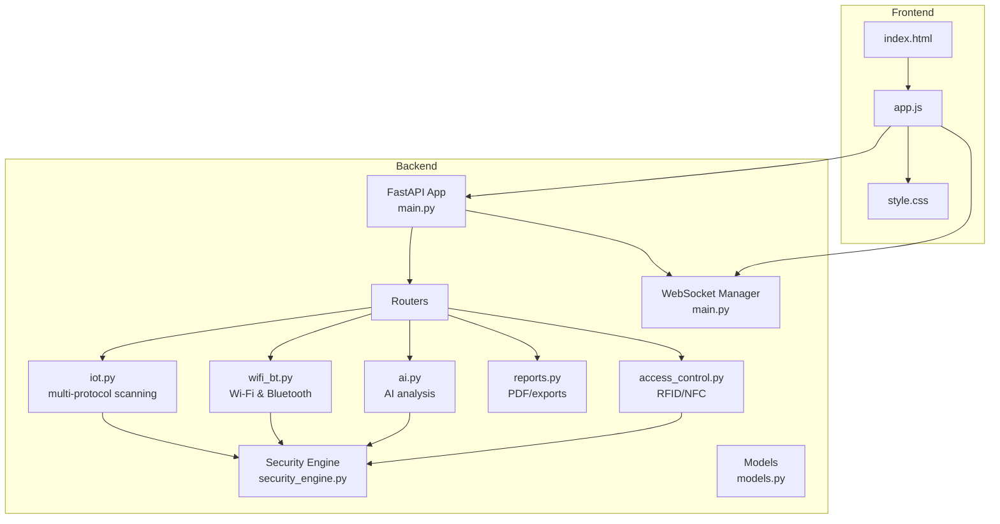
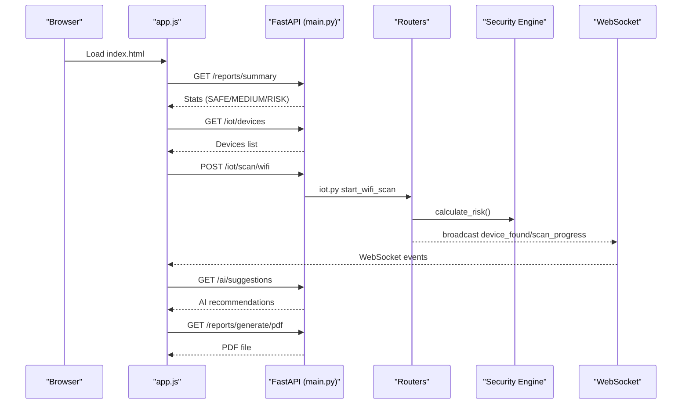
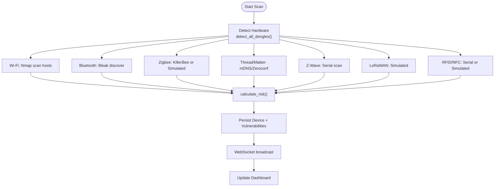
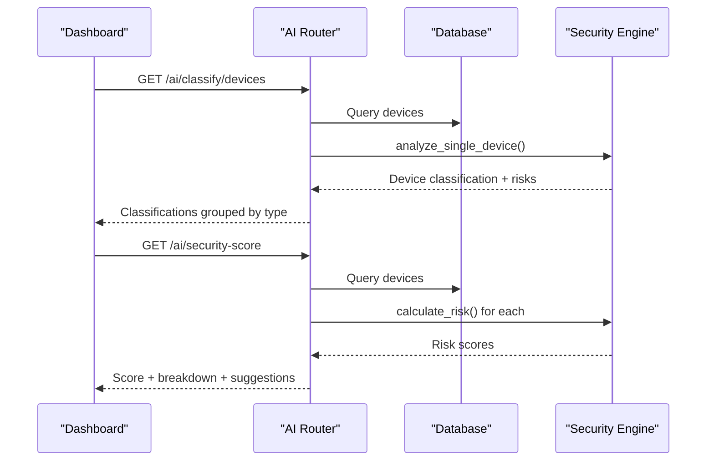
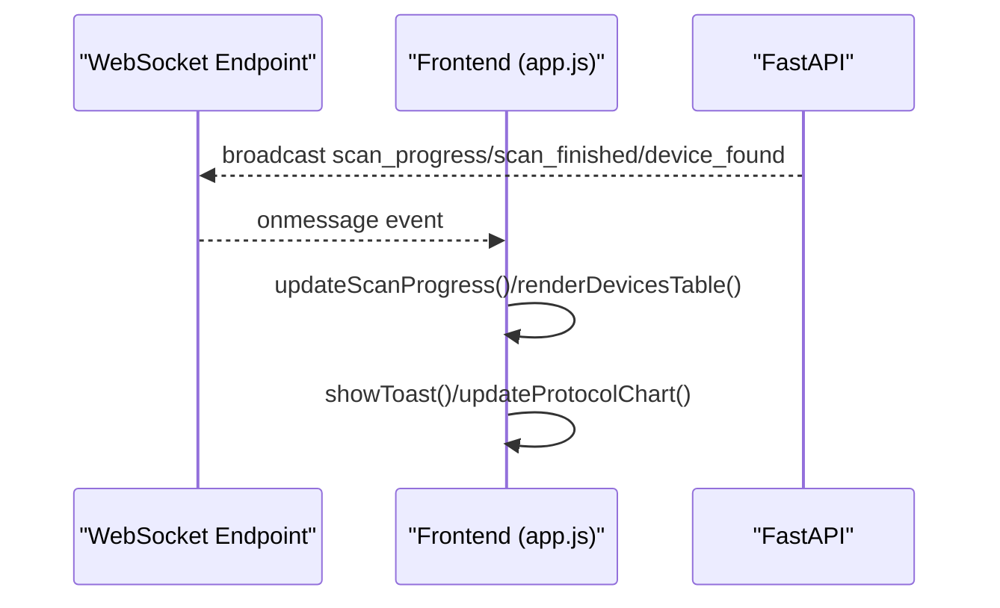
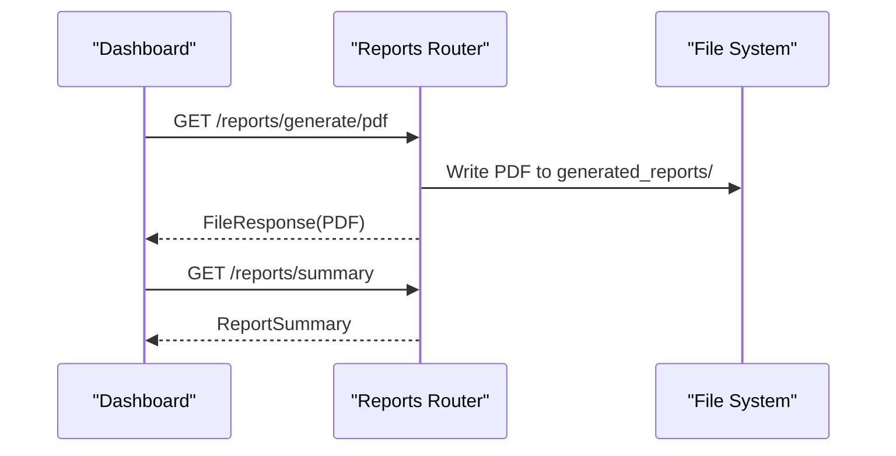
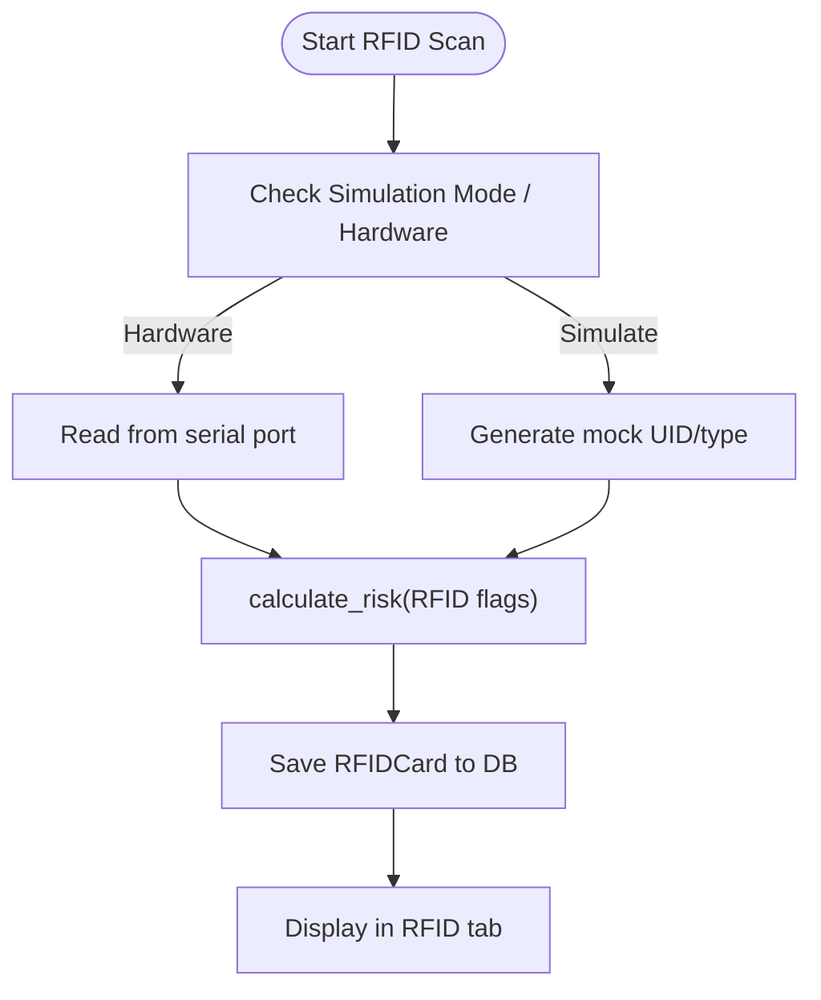
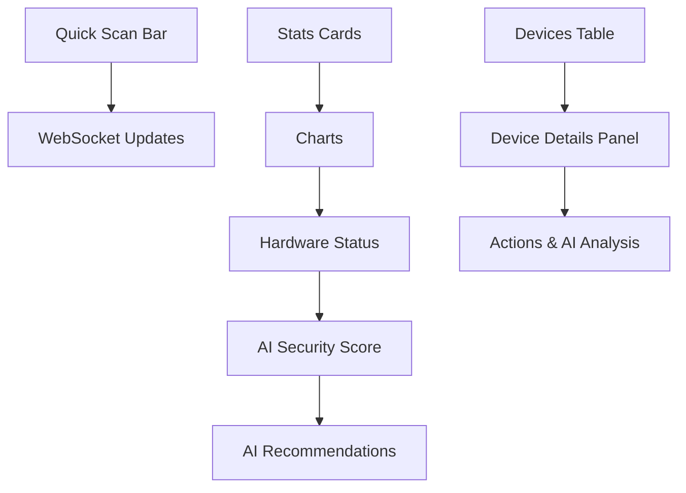
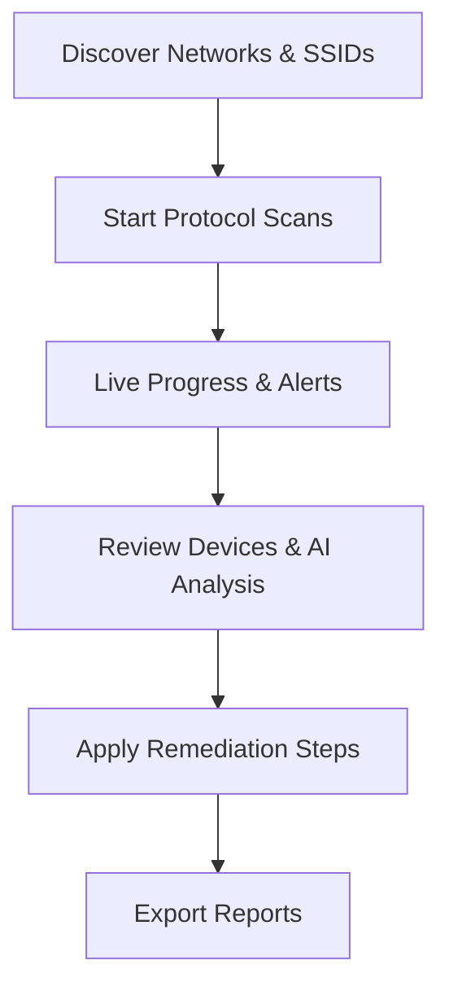
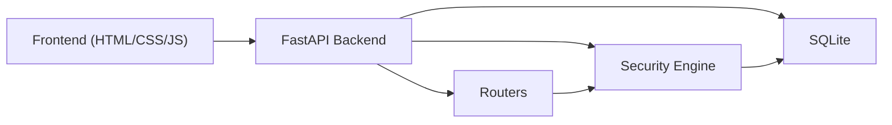

# Feature Overview

<cite>
**Referenced Files in This Document**
- [backend/README.md](file://backend/README.md)
- [backend/HARDWARE_GUIDE.md](file://backend/HARDWARE_GUIDE.md)
- [backend/RASPBERRY_PI_GUIDE.md](file://backend/RASPBERRY_PI_GUIDE.md)
- [backend/QUICK_REFERENCE.md](file://backend/QUICK_REFERENCE.md)
- [backend/main.py](file://backend/main.py)
- [backend/routers/iot.py](file://backend/routers/iot.py)
- [backend/routers/wifi_bt.py](file://backend/routers/wifi_bt.py)
- [backend/routers/ai.py](file://backend/routers/ai.py)
- [backend/routers/reports.py](file://backend/routers/reports.py)
- [backend/routers/access_control.py](file://backend/routers/access_control.py)
- [backend/static/index.html](file://backend/static/index.html)
- [backend/static/app.js](file://backend/static/app.js)
- [backend/static/style.css](file://backend/static/style.css)
- [backend/models.py](file://backend/models.py)
- [backend/security_engine.py](file://backend/security_engine.py)
</cite>

## Table of Contents
1. [Introduction](#introduction)
2. [Project Structure](#project-structure)
3. [Core Components](#core-components)
4. [Architecture Overview](#architecture-overview)
5. [Detailed Component Analysis](#detailed-component-analysis)
6. [Dependency Analysis](#dependency-analysis)
7. [Performance Considerations](#performance-considerations)
8. [Troubleshooting Guide](#troubleshooting-guide)
9. [Conclusion](#conclusion)
10. [Appendices](#appendices)

## Introduction
PentexOne is a professional-grade IoT security auditor that discovers, analyzes, and assesses security vulnerabilities across multiple wireless protocols. It combines a modern web dashboard with AI-powered analysis, real-time updates via WebSocket, and comprehensive reporting. The platform supports Wi‑Fi, Bluetooth, Zigbee, Thread/Matter, Z‑Wave, LoRaWAN, and RFID/NFC scanning, with optional hardware dongles for expanded protocol coverage.

## Project Structure
The backend is a FastAPI application with modular routers for each functional domain, a shared security engine, and a lightweight frontend served statically. The frontend is a single-page application with live updates and interactive charts.

**Diagram sources**
- [backend/main.py:1-106](file://backend/main.py#L1-L106)
- [backend/routers/iot.py:1-800](file://backend/routers/iot.py#L1-L800)
- [backend/routers/wifi_bt.py:1-766](file://backend/routers/wifi_bt.py#L1-L766)
- [backend/routers/ai.py:1-330](file://backend/routers/ai.py#L1-L330)
- [backend/routers/reports.py:1-158](file://backend/routers/reports.py#L1-L158)
- [backend/routers/access_control.py:1-95](file://backend/routers/access_control.py#L1-L95)
- [backend/static/index.html:1-413](file://backend/static/index.html#L1-L413)
- [backend/static/app.js:1-800](file://backend/static/app.js#L1-L800)
- [backend/static/style.css:1-936](file://backend/static/style.css#L1-L936)

**Section sources**
- [backend/README.md:20-449](file://backend/README.md#L20-L449)
- [backend/main.py:14-106](file://backend/main.py#L14-L106)

## Core Components
- Multi-Protocol Scanning: Wi‑Fi (Nmap), Bluetooth/BLE (Bleak), Zigbee (KillerBee or simulated), Thread/Matter (mDNS/Zeroconf), Z‑Wave (serial), LoRaWAN (simulated), and RFID/NFC (serial or simulated).
- AI-Powered Analysis: Risk scoring, vulnerability predictions, device classification, and remediation recommendations.
- Real-Time Dashboard: Live device discovery, progress bars, stats cards, charts, hardware status, and AI suggestions.
- Professional Reporting: PDF export with executive summary, device inventory, vulnerability analysis, and remediation.
- RFID/NFC Security: Dedicated access control module for scanning and risk assessment of contactless credentials.
- Hardware Requirements: Raspberry Pi with optional USB dongles for Zigbee, Thread/Matter, Z‑Wave, and LoRaWAN.

**Section sources**
- [backend/README.md:22-64](file://backend/README.md#L22-L64)
- [backend/HARDWARE_GUIDE.md:26-152](file://backend/HARDWARE_GUIDE.md#L26-L152)
- [backend/routers/iot.py:158-800](file://backend/routers/iot.py#L158-L800)
- [backend/routers/wifi_bt.py:17-766](file://backend/routers/wifi_bt.py#L17-L766)
- [backend/routers/ai.py:23-330](file://backend/routers/ai.py#L23-L330)
- [backend/routers/reports.py:37-158](file://backend/routers/reports.py#L37-L158)
- [backend/routers/access_control.py:15-95](file://backend/routers/access_control.py#L15-L95)

## Architecture Overview
The system uses FastAPI for routing and background tasks, SQLAlchemy for persistence, and WebSocket for real-time updates. The frontend communicates with the backend via REST and WebSocket to render live dashboards and charts.

**Diagram sources**
- [backend/main.py:50-106](file://backend/main.py#L50-L106)
- [backend/routers/iot.py:291-413](file://backend/routers/iot.py#L291-L413)
- [backend/routers/ai.py:106-138](file://backend/routers/ai.py#L106-L138)
- [backend/routers/reports.py:37-158](file://backend/routers/reports.py#L37-L158)
- [backend/static/app.js:113-155](file://backend/static/app.js#L113-L155)

## Detailed Component Analysis

### Multi-Protocol Scanning
- Wi‑Fi: Nmap-based discovery and port scanning with service detection and OS guessing.
- Bluetooth/BLE: Device discovery using Bleak; heuristic risk flags for exposed characteristics and pairing.
- Zigbee: KillerBee-based sniffing with fallback to simulated devices if hardware is unavailable.
- Thread/Matter: mDNS discovery via Zeroconf; simulated fallback if hardware is missing.
- Z‑Wave: Serial-based scanning with simulated coverage; checks for encryption and commissioning exposure.
- LoRaWAN: Simulated scanning for demonstration and educational use.
- RFID/NFC: Serial card reading with simulated mode; risk assessment for default keys and cloning.

**Diagram sources**
- [backend/routers/iot.py:27-156](file://backend/routers/iot.py#L27-L156)
- [backend/routers/iot.py:291-413](file://backend/routers/iot.py#L291-L413)
- [backend/routers/wifi_bt.py:182-240](file://backend/routers/wifi_bt.py#L182-L240)
- [backend/routers/access_control.py:47-84](file://backend/routers/access_control.py#L47-L84)
- [backend/security_engine.py:202-339](file://backend/security_engine.py#L202-L339)

**Section sources**
- [backend/routers/iot.py:158-800](file://backend/routers/iot.py#L158-L800)
- [backend/routers/wifi_bt.py:17-766](file://backend/routers/wifi_bt.py#L17-L766)
- [backend/routers/access_control.py:15-95](file://backend/routers/access_control.py#L15-L95)
- [backend/security_engine.py:16-425](file://backend/security_engine.py#L16-L425)

### AI-Powered Security Analysis
- Device-level analysis: Predicts device type, identifies likely vulnerabilities, and provides confidence metrics.
- Network-level analysis: Aggregates risk across all devices and highlights anomalies.
- Security score: Computes a normalized score with letter grade and actionable suggestions.
- Remediation database: Maps vulnerability types to practical remediation steps.

**Diagram sources**
- [backend/routers/ai.py:26-330](file://backend/routers/ai.py#L26-L330)
- [backend/security_engine.py:202-339](file://backend/security_engine.py#L202-L339)

**Section sources**
- [backend/routers/ai.py:23-330](file://backend/routers/ai.py#L23-L330)
- [backend/security_engine.py:392-425](file://backend/security_engine.py#L392-L425)

### Real-Time Dashboard and WebSocket Updates
- Live progress: Scan progress and completion events.
- Device discovery: Real-time notifications when new devices are found.
- Alerts: Toast notifications for critical risks and scan errors.
- Charts: Doughnut and bar charts updated from live data.

**Diagram sources**
- [backend/main.py:90-102](file://backend/main.py#L90-L102)
- [backend/static/app.js:113-155](file://backend/static/app.js#L113-L155)
- [backend/static/app.js:267-339](file://backend/static/app.js#L267-L339)

**Section sources**
- [backend/main.py:85-102](file://backend/main.py#L85-L102)
- [backend/static/app.js:113-155](file://backend/static/app.js#L113-L155)
- [backend/static/app.js:40-111](file://backend/static/app.js#L40-L111)

### Professional Reporting
- PDF report: Executive summary, device inventory, vulnerability analysis, and remediation guidance.
- Export formats: JSON and CSV for external integrations.

**Diagram sources**
- [backend/routers/reports.py:37-158](file://backend/routers/reports.py#L37-L158)

**Section sources**
- [backend/routers/reports.py:18-158](file://backend/routers/reports.py#L18-L158)

### RFID/NFC Security Features
- Card scanning: Reads UIDs and card types from serial readers or simulates for testing.
- Risk assessment: Flags default keys, cloning susceptibility, and legacy crypto.
- Audit trail: Stores scanned cards with risk levels and timestamps.

**Diagram sources**
- [backend/routers/access_control.py:47-84](file://backend/routers/access_control.py#L47-L84)
- [backend/security_engine.py:156-163](file://backend/security_engine.py#L156-L163)

**Section sources**
- [backend/routers/access_control.py:15-95](file://backend/routers/access_control.py#L15-L95)
- [backend/security_engine.py:156-163](file://backend/security_engine.py#L156-L163)

### User Interface Components
- Quick Scan Bar: One-click scans for Wi‑Fi, Bluetooth, Zigbee, and Thread/Matter; advanced options for network selection and additional protocols.
- Statistics Cards: Total devices, SAFE, MEDIUM, and RISK counts.
- Charts: Risk distribution (pie) and protocol distribution (bar).
- Hardware Status: Connected dongles visibility.
- AI Section: Security score with grade and recommendations.
- Devices Table: Click to view details, open ports, OS guess, and vulnerabilities.
- Device Details Panel: Metrics, actions (Deep Port Scan, Test Default Creds), AI Analysis, and vulnerability list.

**Diagram sources**
- [backend/static/index.html:54-316](file://backend/static/index.html#L54-L316)
- [backend/static/app.js:14-111](file://backend/static/app.js#L14-L111)
- [backend/static/style.css:164-800](file://backend/static/style.css#L164-L800)

**Section sources**
- [backend/static/index.html:54-316](file://backend/static/index.html#L54-L316)
- [backend/static/app.js:14-111](file://backend/static/app.js#L14-L111)
- [backend/static/style.css:164-800](file://backend/static/style.css#L164-L800)

### Security Assessment Workflow
- Network Discovery: Auto-detect networks and nearby SSIDs.
- Scanning: Start protocol-specific scans; monitor progress and receive live updates.
- Analysis: Review device details, vulnerabilities, and AI recommendations.
- Remediation: Apply remediation steps from AI guidance and export reports.

**Diagram sources**
- [backend/routers/wifi_bt.py:245-442](file://backend/routers/wifi_bt.py#L245-L442)
- [backend/routers/iot.py:291-413](file://backend/routers/iot.py#L291-L413)
- [backend/routers/ai.py:106-138](file://backend/routers/ai.py#L106-L138)
- [backend/routers/reports.py:37-158](file://backend/routers/reports.py#L37-L158)

**Section sources**
- [backend/routers/wifi_bt.py:245-442](file://backend/routers/wifi_bt.py#L245-L442)
- [backend/routers/ai.py:106-138](file://backend/routers/ai.py#L106-L138)
- [backend/README.md:215-270](file://backend/README.md#L215-L270)

## Dependency Analysis
- Backend dependencies: FastAPI, SQLAlchemy ORM, Nmap, Bleak, Zeroconf, KillerBee (optional), ReportLab (PDF).
- Frontend dependencies: Chart.js, FontAwesome, local state management, WebSocket client.
- Database: SQLite with Alembic-style initialization.

**Diagram sources**
- [backend/main.py:14-48](file://backend/main.py#L14-L48)
- [backend/routers/iot.py:20-22](file://backend/routers/iot.py#L20-L22)
- [backend/routers/ai.py:10-18](file://backend/routers/ai.py#L10-L18)
- [backend/routers/reports.py:12-13](file://backend/routers/reports.py#L12-L13)

**Section sources**
- [backend/main.py:14-48](file://backend/main.py#L14-L48)
- [backend/routers/iot.py:20-22](file://backend/routers/iot.py#L20-L22)
- [backend/routers/ai.py:10-18](file://backend/routers/ai.py#L10-L18)
- [backend/routers/reports.py:12-13](file://backend/routers/reports.py#L12-L13)

## Performance Considerations
- Resource usage varies by protocol and hardware; scanning increases CPU/memory usage.
- Recommendations: Use Ethernet over Wi‑Fi, disable unused services, add swap for lower-RAM models, and use a powered USB hub for multiple dongles.

**Section sources**
- [backend/README.md:385-401](file://backend/README.md#L385-L401)
- [backend/HARDWARE_GUIDE.md:312-340](file://backend/HARDWARE_GUIDE.md#L312-L340)

## Troubleshooting Guide
- Dashboard not accessible: Check service status, firewall, and port binding.
- USB dongles not detected: Verify permissions, group membership, and device presence.
- Bluetooth issues: Restart Bluetooth service and unblock interfaces.
- Wi‑Fi scanning problems: Ensure interface availability and temporary disconnection from Wi‑Fi during scanning.

**Section sources**
- [backend/README.md:349-382](file://backend/README.md#L349-L382)
- [backend/HARDWARE_GUIDE.md:252-309](file://backend/HARDWARE_GUIDE.md#L252-L309)
- [backend/RASPBERRY_PI_GUIDE.md:402-494](file://backend/RASPBERRY_PI_GUIDE.md#L402-L494)

## Conclusion
PentexOne delivers a comprehensive, real-time IoT security auditing solution with multi-protocol scanning, AI-powered insights, and professional reporting. Its modular backend and modern frontend enable efficient vulnerability discovery, risk scoring, and remediation guidance, suitable for both lab and field deployments.

## Appendices

### Hardware Requirements and Setup
- Minimum: Raspberry Pi 3 B+ with 2GB RAM and Wi‑Fi/Bluetooth built-in.
- Recommended: Raspberry Pi 4 (4GB) with 64GB+ SD card, powered USB hub, and optional dongles for Zigbee, Thread/Matter, Z‑Wave, and LoRaWAN.
- Deployment: One-command Raspberry Pi installer and systemd service for auto-start.

**Section sources**
- [backend/README.md:182-212](file://backend/README.md#L182-L212)
- [backend/HARDWARE_GUIDE.md:8-23](file://backend/HARDWARE_GUIDE.md#L8-L23)
- [backend/HARDWARE_GUIDE.md:128-152](file://backend/HARDWARE_GUIDE.md#L128-L152)
- [backend/RASPBERRY_PI_GUIDE.md:44-84](file://backend/RASPBERRY_PI_GUIDE.md#L44-L84)

### Feature Comparison and Unique Capabilities
- Multi-protocol support across Wi‑Fi, Bluetooth, Zigbee, Thread/Matter, Z‑Wave, LoRaWAN, and RFID/NFC.
- AI-driven risk scoring and remediation recommendations.
- Real-time WebSocket updates and interactive charts.
- Professional PDF reporting with executive summary and remediation guidance.
- Raspberry Pi optimized for cost-effective deployment.

**Section sources**
- [backend/README.md:22-64](file://backend/README.md#L22-L64)
- [backend/README.md:215-270](file://backend/README.md#L215-L270)

### Screenshots and Usage Examples
- Dashboard layout with Quick Scan Bar, Stats Cards, Charts, Hardware Status, AI Score, Devices Table, and Device Details.
- RFID tab for scanning and managing access control cards.
- Reports tab for exporting PDF, JSON, and CSV.

**Section sources**
- [backend/README.md:242-269](file://backend/README.md#L242-L269)
- [backend/static/index.html:54-316](file://backend/static/index.html#L54-L316)