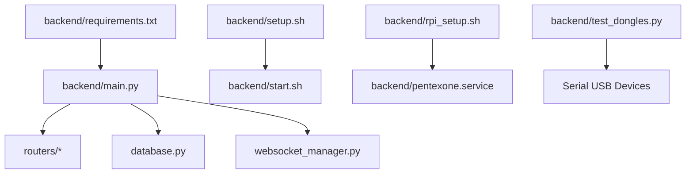
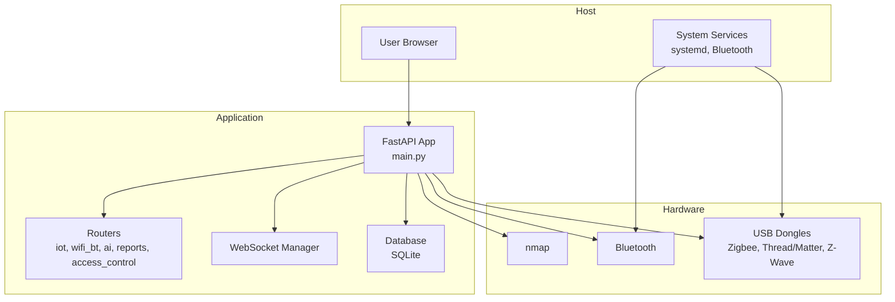
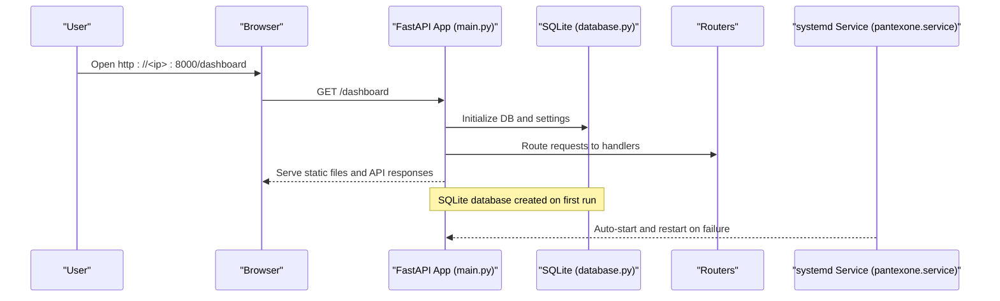
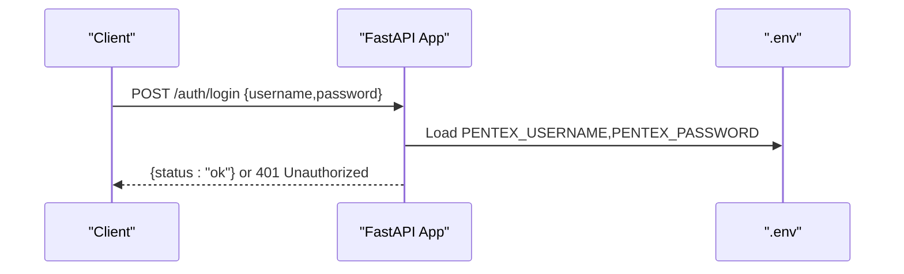
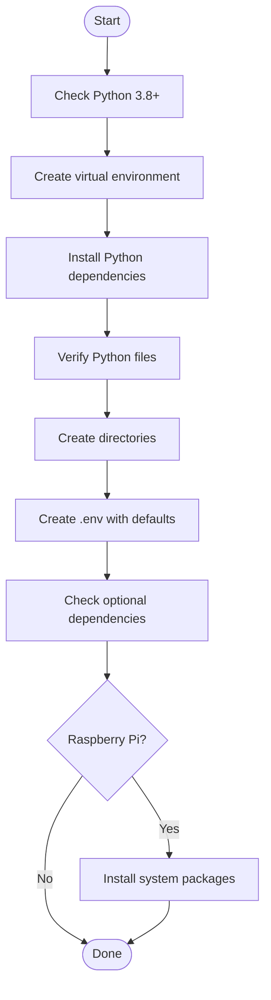
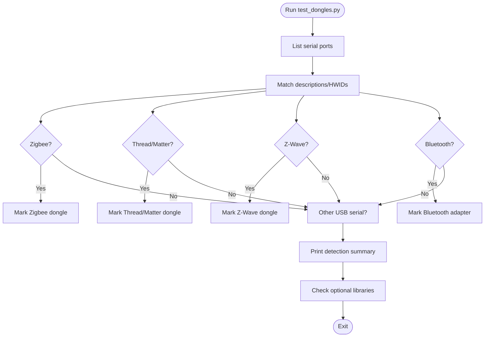
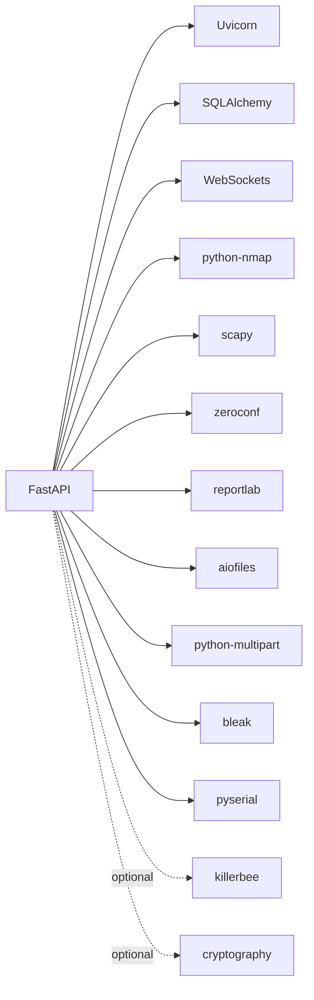

# Getting Started

<cite>
**Referenced Files in This Document**
- [backend/README.md](file://backend/README.md)
- [backend/RASPBERRY_PI_GUIDE.md](file://backend/RASPBERRY_PI_GUIDE.md)
- [backend/HARDWARE_GUIDE.md](file://backend/HARDWARE_GUIDE.md)
- [backend/requirements.txt](file://backend/requirements.txt)
- [backend/setup.sh](file://backend/setup.sh)
- [backend/start.sh](file://backend/start.sh)
- [backend/rpi_setup.sh](file://backend/rpi_setup.sh)
- [backend/main.py](file://backend/main.py)
- [backend/test_dongles.py](file://backend/test_dongles.py)
- [backend/pentexone.service](file://backend/pentexone.service)
- [backend/QUICK_REFERENCE.md](file://backend/QUICK_REFERENCE.md)
- [backend/database.py](file://backend/database.py)
- [backend/models.py](file://backend/models.py)
</cite>

## Table of Contents
1. [Introduction](#introduction)
2. [Project Structure](#project-structure)
3. [Core Components](#core-components)
4. [Architecture Overview](#architecture-overview)
5. [Detailed Component Analysis](#detailed-component-analysis)
6. [Dependency Analysis](#dependency-analysis)
7. [Performance Considerations](#performance-considerations)
8. [Troubleshooting Guide](#troubleshooting-guide)
9. [Conclusion](#conclusion)
10. [Appendices](#appendices)

## Introduction
This guide helps you install and run the PentexOne IoT Security Platform quickly and reliably. It covers prerequisites, step-by-step installation for both manual and Raspberry Pi deployments, environment configuration, accessing the dashboard, first-time setup, and troubleshooting. The content is beginner-friendly while providing sufficient technical depth for experienced users.

## Project Structure
The backend is organized around a FastAPI application with modular routers, a SQLite database, and a set of shell scripts to automate setup and service management. Key elements include:
- Application entrypoint and routing
- Environment configuration and authentication
- Hardware detection utilities
- Systemd service for Raspberry Pi deployments
- Quick reference and hardware guides

**Diagram sources**
- [backend/main.py:1-106](file://backend/main.py#L1-L106)
- [backend/setup.sh:1-142](file://backend/setup.sh#L1-L142)
- [backend/start.sh:1-38](file://backend/start.sh#L1-L38)
- [backend/rpi_setup.sh:1-139](file://backend/rpi_setup.sh#L1-L139)
- [backend/pentexone.service:1-25](file://backend/pentexone.service#L1-L25)
- [backend/test_dongles.py:1-152](file://backend/test_dongles.py#L1-L152)
- [backend/requirements.txt:1-21](file://backend/requirements.txt#L1-L21)

**Section sources**
- [backend/README.md:273-297](file://backend/README.md#L273-L297)

## Core Components
- Application entrypoint and authentication: [backend/main.py:1-106](file://backend/main.py#L1-L106)
- Setup automation: [backend/setup.sh:1-142](file://backend/setup.sh#L1-L142)
- Quick start launcher: [backend/start.sh:1-38](file://backend/start.sh#L1-L38)
- Raspberry Pi installer and service: [backend/rpi_setup.sh:1-139](file://backend/rpi_setup.sh#L1-L139), [backend/pentexone.service:1-25](file://backend/pentexone.service#L1-L25)
- Hardware detection: [backend/test_dongles.py:1-152](file://backend/test_dongles.py#L1-L152)
- Dependencies: [backend/requirements.txt:1-21](file://backend/requirements.txt#L1-L21)
- Database and models: [backend/database.py:1-80](file://backend/database.py#L1-L80), [backend/models.py:1-71](file://backend/models.py#L1-L71)

**Section sources**
- [backend/main.py:14-106](file://backend/main.py#L14-L106)
- [backend/setup.sh:31-82](file://backend/setup.sh#L31-L82)
- [backend/start.sh:10-37](file://backend/start.sh#L10-L37)
- [backend/rpi_setup.sh:68-111](file://backend/rpi_setup.sh#L68-L111)
- [backend/test_dongles.py:14-132](file://backend/test_dongles.py#L14-L132)
- [backend/requirements.txt:1-21](file://backend/requirements.txt#L1-L21)
- [backend/database.py:69-80](file://backend/database.py#L69-L80)
- [backend/models.py:68-71](file://backend/models.py#L68-L71)

## Architecture Overview
PentexOne is a FastAPI application that serves a web dashboard and exposes REST endpoints. It integrates with system-level tools (nmap, Bluetooth) and optional hardware dongles via serial communication. The application initializes a SQLite database and supports a systemd service for Raspberry Pi deployments.

**Diagram sources**
- [backend/main.py:34-106](file://backend/main.py#L34-L106)
- [backend/requirements.txt:4-16](file://backend/requirements.txt#L4-L16)
- [backend/test_dongles.py:14-132](file://backend/test_dongles.py#L14-L132)
- [backend/pentexone.service:6-21](file://backend/pentexone.service#L6-L21)

## Detailed Component Analysis

### Prerequisites
- Python 3.8 or higher
- pip (Python package manager)
- nmap (network scanner)
- Raspberry Pi 3+ (optional, for deployment)

Verification steps:
- Confirm Python version and availability of pip.
- Confirm nmap is installed and accessible.

**Section sources**
- [backend/README.md:69-75](file://backend/README.md#L69-L75)
- [backend/requirements.txt:4](file://backend/requirements.txt#L4)

### Step-by-Step Installation

#### Manual Setup (Linux/macOS)
1. Clone or download the repository and navigate to the backend directory.
2. Make scripts executable and run the setup script to create a virtual environment and install dependencies.
3. Configure environment variables by editing the .env file.
4. Start the application using the quick start script or manually activate the virtual environment and run the main module.

Quick start commands:
- Make scripts executable and run setup:
  - [backend/setup.sh:86-89](file://backend/setup.sh#L86-L89)
- Configure environment variables:
  - [backend/setup.sh:74-81](file://backend/setup.sh#L74-L81)
- Start the application:
  - [backend/start.sh:30-37](file://backend/start.sh#L30-L37)

Verification:
- Access the dashboard at http://localhost:8000/dashboard.
- Access API docs at http://localhost:8000/docs.

**Section sources**
- [backend/README.md:76-116](file://backend/README.md#L76-L116)
- [backend/QUICK_REFERENCE.md:5-18](file://backend/QUICK_REFERENCE.md#L5-L18)
- [backend/start.sh:30-37](file://backend/start.sh#L30-L37)

#### Automated Raspberry Pi Setup
1. Ensure you are on a Raspberry Pi or run the installer with sudo to install system packages.
2. Run the Raspberry Pi installer to update the system, install dependencies, set up a virtual environment, configure Bluetooth, create the .env file, install the systemd service, and set permissions.
3. Start and enable the service for auto-start on boot.

Quick start commands:
- One-command install:
  - [backend/RASPBERRY_PI_GUIDE.md:122-125](file://backend/RASPBERRY_PI_GUIDE.md#L122-L125)
- Service management:
  - [backend/RASPBERRY_PI_GUIDE.md:135-149](file://backend/RASPBERRY_PI_GUIDE.md#L135-L149)
- Access from network:
  - [backend/RASPBERRY_PI_GUIDE.md:151-158](file://backend/RASPBERRY_PI_GUIDE.md#L151-L158)

Verification:
- Check service status and logs:
  - [backend/RASPBERRY_PI_GUIDE.md:267-281](file://backend/RASPBERRY_PI_GUIDE.md#L267-L281)
- Confirm dashboard accessibility via the Pi’s IP on port 8000.

**Section sources**
- [backend/RASPBERRY_PI_GUIDE.md:120-149](file://backend/RASPBERRY_PI_GUIDE.md#L120-L149)
- [backend/rpi_setup.sh:12-28](file://backend/rpi_setup.sh#L12-L28)
- [backend/rpi_setup.sh:68-111](file://backend/rpi_setup.sh#L68-L111)
- [backend/pentexone.service:6-21](file://backend/pentexone.service#L6-L21)

### Initial Access and Default Credentials
- Default credentials:
  - Username: admin
  - Password: pentex2024
- Change immediately in the .env file after first run.

Access URLs:
- Dashboard: http://<ip>:8000/dashboard
- Login page: http://<ip>:8000/login
- API docs: http://<ip>:8000/docs

First-time configuration:
- Edit .env to set PENTEX_USERNAME and PENTEX_PASSWORD.
- Start the service or application and log in.

**Section sources**
- [backend/QUICK_REFERENCE.md:118-123](file://backend/QUICK_REFERENCE.md#L118-L123)
- [backend/README.md:312-317](file://backend/README.md#L312-L317)
- [backend/main.py:25-27](file://backend/main.py#L25-L27)

### Hardware Setup (Optional)
- Built-in protocols: Wi-Fi and Bluetooth (no additional hardware required).
- Optional dongles for Zigbee, Thread/Matter, Z-Wave, and LoRaWAN.
- Use the hardware detection script to verify dongle connectivity.

Verification:
- List USB devices and serial ports:
  - [backend/RASPBERRY_PI_GUIDE.md:441-461](file://backend/RASPBERRY_PI_GUIDE.md#L441-L461)
- Test dongles:
  - [backend/test_dongles.py:134-152](file://backend/test_dongles.py#L134-L152)

**Section sources**
- [backend/HARDWARE_GUIDE.md:28-41](file://backend/HARDWARE_GUIDE.md#L28-L41)
- [backend/HARDWARE_GUIDE.md:44-123](file://backend/HARDWARE_GUIDE.md#L44-L123)
- [backend/test_dongles.py:14-132](file://backend/test_dongles.py#L14-L132)

### Database Initialization
- The application initializes a SQLite database and creates default settings on startup.
- Default settings include simulation mode and nmap timeout.

**Section sources**
- [backend/database.py:69-80](file://backend/database.py#L69-L80)
- [backend/main.py:20-21](file://backend/main.py#L20-L21)

## Architecture Overview

**Diagram sources**
- [backend/main.py:34-106](file://backend/main.py#L34-L106)
- [backend/database.py:69-80](file://backend/database.py#L69-L80)
- [backend/pentexone.service:6-21](file://backend/pentexone.service#L6-L21)

## Detailed Component Analysis

### Authentication Flow
- Credentials are loaded from environment variables.
- Login endpoint validates username and password.

**Diagram sources**
- [backend/main.py:25-27](file://backend/main.py#L25-L27)
- [backend/main.py:70-74](file://backend/main.py#L70-L74)

**Section sources**
- [backend/main.py:25-27](file://backend/main.py#L25-L27)
- [backend/main.py:70-74](file://backend/main.py#L70-L74)

### Setup Scripts
- setup.sh: Creates virtual environment, installs dependencies, verifies Python files, sets up directories, creates .env with defaults, checks optional dependencies, and provides quick start options.
- start.sh: Activates the virtual environment, ensures .env exists, and starts the application.
- rpi_setup.sh: Installs system packages, sets up Python virtual environment, configures Bluetooth, creates .env, installs systemd service, sets permissions, and prints next steps.

**Diagram sources**
- [backend/setup.sh:9-120](file://backend/setup.sh#L9-L120)

**Section sources**
- [backend/setup.sh:9-142](file://backend/setup.sh#L9-L142)
- [backend/start.sh:10-37](file://backend/start.sh#L10-L37)
- [backend/rpi_setup.sh:12-111](file://backend/rpi_setup.sh#L12-L111)

### Hardware Detection
- test_dongles.py scans serial ports and identifies Zigbee, Thread/Matter, Z-Wave, and Bluetooth adapters.
- It also checks for optional libraries (e.g., KillerBee) to indicate real Zigbee scanning capability.

**Diagram sources**
- [backend/test_dongles.py:14-132](file://backend/test_dongles.py#L14-L132)

**Section sources**
- [backend/test_dongles.py:14-152](file://backend/test_dongles.py#L14-L152)

## Dependency Analysis
- Python dependencies are declared in requirements.txt and installed by setup scripts.
- The application relies on FastAPI, Uvicorn, websockets, nmap, scapy, zeroconf, reportlab, aiofiles, SQLAlchemy, multipart, bleak, and pyserial.
- Optional dependencies include killerbee for Zigbee and cryptography for TLS validation.

**Diagram sources**
- [backend/requirements.txt:1-21](file://backend/requirements.txt#L1-L21)

**Section sources**
- [backend/requirements.txt:1-21](file://backend/requirements.txt#L1-L21)
- [backend/setup.sh:45-51](file://backend/setup.sh#L45-L51)

## Performance Considerations
- Use Ethernet for stability during setup.
- Disable unused desktop services for headless operation.
- Add swap space for Raspberry Pi 2GB models.
- Use a powered USB hub for multiple dongles.
- Optimize GPU memory and disable splash for older Pi models.

**Section sources**
- [backend/HARDWARE_GUIDE.md:312-339](file://backend/HARDWARE_GUIDE.md#L312-L339)
- [backend/RASPBERRY_PI_GUIDE.md:507-525](file://backend/RASPBERRY_PI_GUIDE.md#L507-L525)

## Troubleshooting Guide
Common issues and resolutions:
- Cannot access dashboard:
  - Check service status and logs; verify port 8000 is listening.
  - [backend/RASPBERRY_PI_GUIDE.md:424-439](file://backend/RASPBERRY_PI_GUIDE.md#L424-L439)
- USB dongle not detected:
  - List USB devices and serial ports; check permissions; reboot.
  - [backend/RASPBERRY_PI_GUIDE.md:441-461](file://backend/RASPBERRY_PI_GUIDE.md#L441-L461)
- Bluetooth not working:
  - Restart Bluetooth service; unblock Bluetooth; reinstall BlueZ if needed.
  - [backend/RASPBERRY_PI_GUIDE.md:463-478](file://backend/RASPBERRY_PI_GUIDE.md#L463-L478)
- Wi-Fi scanning problems:
  - Ensure permissions; temporarily disable Wi-Fi interface if busy; reconnect after scanning.
  - [backend/RASPBERRY_PI_GUIDE.md:480-493](file://backend/RASPBERRY_PI_GUIDE.md#L480-L493)
- Service won’t start:
  - Check logs; resolve port conflicts; reinstall dependencies; fix permissions.
  - [backend/RASPBERRY_PI_GUIDE.md:404-422](file://backend/RASPBERRY_PI_GUIDE.md#L404-L422)

Additional quick checks:
- Verify service status and logs:
  - [backend/QUICK_REFERENCE.md:39-52](file://backend/QUICK_REFERENCE.md#L39-L52)
- Test hardware detection:
  - [backend/QUICK_REFERENCE.md:84-88](file://backend/QUICK_REFERENCE.md#L84-L88)

**Section sources**
- [backend/RASPBERRY_PI_GUIDE.md:402-525](file://backend/RASPBERRY_PI_GUIDE.md#L402-L525)
- [backend/QUICK_REFERENCE.md:63-88](file://backend/QUICK_REFERENCE.md#L63-L88)

## Conclusion
You now have the essential steps to install, configure, and run PentexOne. Start with the setup script, configure credentials, and access the dashboard. For Raspberry Pi deployments, use the automated installer and systemd service. If issues arise, consult the troubleshooting section and leverage the hardware detection script to validate dongle connectivity.

## Appendices

### Quick Start Commands
- Manual setup:
  - [backend/README.md:78-110](file://backend/README.md#L78-L110)
- Raspberry Pi deployment:
  - [backend/RASPBERRY_PI_GUIDE.md:122-125](file://backend/RASPBERRY_PI_GUIDE.md#L122-L125)
- Service management:
  - [backend/RASPBERRY_PI_GUIDE.md:135-149](file://backend/RASPBERRY_PI_GUIDE.md#L135-L149)

### Verification Checklist
- Python 3.8+ and pip available.
- Virtual environment created and dependencies installed.
- .env configured with custom credentials.
- Application running on port 8000.
- Dashboard accessible at http://<ip>:8000/dashboard.
- Optional dongles detected via test_dongles.py.

**Section sources**
- [backend/README.md:69-116](file://backend/README.md#L69-L116)
- [backend/test_dongles.py:134-152](file://backend/test_dongles.py#L134-L152)