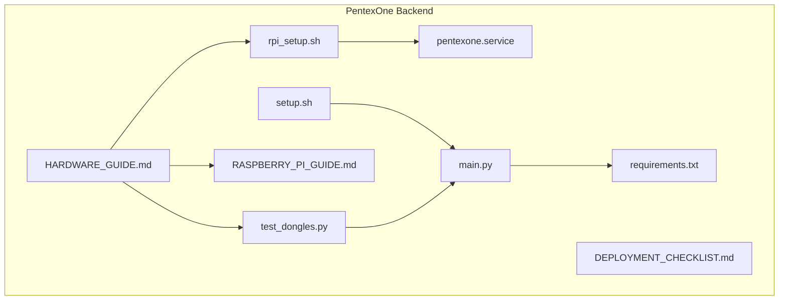
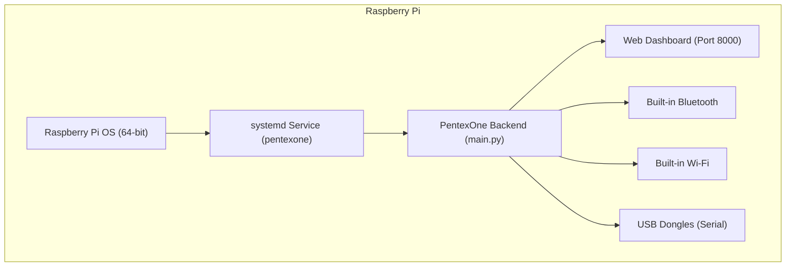

# Hardware Requirements

<cite>
**Referenced Files in This Document**
- [HARDWARE_GUIDE.md](file://backend/HARDWARE_GUIDE.md)
- [RASPBERRY_PI_GUIDE.md](file://backend/RASPBERRY_PI_GUIDE.md)
- [DEPLOYMENT_CHECKLIST.md](file://backend/DEPLOYMENT_CHECKLIST.md)
- [test_dongles.py](file://backend/test_dongles.py)
- [rpi_setup.sh](file://backend/rpi_setup.sh)
- [setup.sh](file://backend/setup.sh)
- [main.py](file://backend/main.py)
- [requirements.txt](file://backend/requirements.txt)
- [pentexone.service](file://backend/pentexone.service)
</cite>

## Table of Contents
1. [Introduction](#introduction)
2. [Project Structure](#project-structure)
3. [Core Components](#core-components)
4. [Architecture Overview](#architecture-overview)
5. [Detailed Component Analysis](#detailed-component-analysis)
6. [Dependency Analysis](#dependency-analysis)
7. [Performance Considerations](#performance-considerations)
8. [Troubleshooting Guide](#troubleshooting-guide)
9. [Conclusion](#conclusion)
10. [Appendices](#appendices)

## Introduction
This document consolidates hardware requirements and setup procedures for deploying PentexOne on a Raspberry Pi. It covers minimum and recommended hardware configurations, protocol-specific dongles, compatibility notes, setup steps, permissions, detection verification, troubleshooting, and cost scenarios. The content is derived from the repository’s hardware and deployment guides, scripts, and service configuration.

## Project Structure
The hardware and deployment guidance is primarily organized in the backend directory:
- Hardware and deployment guides
- Setup and service scripts
- Detection utility for dongles
- Application entrypoint and dependencies

**Diagram sources**
- [HARDWARE_GUIDE.md](file://backend/HARDWARE_GUIDE.md)
- [RASPBERRY_PI_GUIDE.md](file://backend/RASPBERRY_PI_GUIDE.md)
- [DEPLOYMENT_CHECKLIST.md](file://backend/DEPLOYMENT_CHECKLIST.md)
- [test_dongles.py](file://backend/test_dongles.py)
- [rpi_setup.sh](file://backend/rpi_setup.sh)
- [setup.sh](file://backend/setup.sh)
- [main.py](file://backend/main.py)
- [requirements.txt](file://backend/requirements.txt)
- [pentexone.service](file://backend/pentexone.service)

**Section sources**
- [HARDWARE_GUIDE.md](file://backend/HARDWARE_GUIDE.md)
- [RASPBERRY_PI_GUIDE.md](file://backend/RASPBERRY_PI_GUIDE.md)
- [DEPLOYMENT_CHECKLIST.md](file://backend/DEPLOYMENT_CHECKLIST.md)

## Core Components
- Raspberry Pi models and base requirements
- Built-in Wi-Fi and Bluetooth
- Optional USB dongles for Zigbee, Thread/Matter, Z-Wave, and LoRaWAN
- Headless setup, permissions, and service configuration
- Hardware detection and verification utilities

Key takeaways:
- Minimum: Raspberry Pi 3 Model B+ or newer; 2 GB RAM recommended; 32 GB microSD; stable power supply.
- Built-in Wi-Fi and Bluetooth are supported without additional hardware.
- Optional dongles enable Zigbee, Thread/Matter, Z-Wave, and LoRaWAN scanning.

**Section sources**
- [HARDWARE_GUIDE.md](file://backend/HARDWARE_GUIDE.md)
- [RASPBERRY_PI_GUIDE.md](file://backend/RASPBERRY_PI_GUIDE.md)

## Architecture Overview
The hardware architecture centers on the Raspberry Pi hosting the PentexOne backend service. Optional USB dongles connect to the Pi’s USB ports and are accessed via serial interfaces. The service exposes a web dashboard and API, and can be managed as a systemd service.

**Diagram sources**
- [pentexone.service](file://backend/pentexone.service)
- [main.py](file://backend/main.py)
- [HARDWARE_GUIDE.md](file://backend/HARDWARE_GUIDE.md)

## Detailed Component Analysis

### Raspberry Pi Hardware Requirements
- Recommended models:
  - Raspberry Pi 4 (4 GB/8 GB) or Raspberry Pi 5 for best performance.
  - Raspberry Pi 3 Model B+ acceptable but slower (USB 2.0).
- Minimum requirements:
  - Raspberry Pi 3 Model B+ or newer.
  - 2 GB RAM minimum; 4 GB recommended.
  - 32 GB microSD card (Class 10 or better).
  - Stable power supply: 5 V 3 A for Pi 4, 5 V 2.5 A for Pi 3.
- Notes:
  - Use a powered USB hub when connecting multiple dongles.
  - Consider a case with cooling for Pi 4/5.

**Section sources**
- [HARDWARE_GUIDE.md](file://backend/HARDWARE_GUIDE.md)
- [RASPBERRY_PI_GUIDE.md](file://backend/RASPBERRY_PI_GUIDE.md)

### Built-in Wireless Protocols
- Wi-Fi:
  - Built-in on Pi 3/4/5; 802.11 b/g/n/ac.
  - Range ~30 meters indoors.
- Bluetooth/BLE:
  - Built-in Bluetooth 4.2/5.0 on Pi 3/4/5.
  - Range ~10 meters.

No additional hardware required for these protocols.

**Section sources**
- [HARDWARE_GUIDE.md](file://backend/HARDWARE_GUIDE.md)

### Optional USB Dongles and Compatibility

#### Zigbee
- Recommended: Sonoff Zigbee 3.0 USB Dongle Plus (CC2652P).
- Alternative: CC2531 (older, less powerful).
- Setup: Plug and play; verify with serial listing and dongle test.
- Detection: Uses serial ports (/dev/ttyUSB*).

**Section sources**
- [HARDWARE_GUIDE.md](file://backend/HARDWARE_GUIDE.md)
- [test_dongles.py](file://backend/test_dongles.py)

#### Thread/Matter
- Recommended: Nordic nRF52840 Dongle.
- Alternative: Home Assistant SkyConnect (supports Zigbee and Thread).
- Setup: Plug and play; verify with ACM serial listing.
- Detection: Uses ACM serial ports (/dev/ttyACM*).

**Section sources**
- [HARDWARE_GUIDE.md](file://backend/HARDWARE_GUIDE.md)
- [test_dongles.py](file://backend/test_dongles.py)

#### Z-Wave
- Recommended: Aeotec Z-Stick 7 (Gen5+).
- Alternative: Zooz Z-Wave Plus S2 Stick.
- Setup: Plug and play; verify with serial listing.
- Detection: Uses serial ports (/dev/ttyUSB*).

**Section sources**
- [HARDWARE_GUIDE.md](file://backend/HARDWARE_GUIDE.md)
- [test_dongles.py](file://backend/test_dongles.py)

#### LoRaWAN (Advanced/Experimental)
- Recommended: Dragino USB LoRa Adapter.
- Note: Primarily for listening; experimental support.
- Detection: Uses serial ports (/dev/ttyUSB*).

**Section sources**
- [HARDWARE_GUIDE.md](file://backend/HARDWARE_GUIDE.md)
- [test_dongles.py](file://backend/test_dongles.py)

### Hardware Setup Procedures
- Prepare the Pi:
  - Flash Raspberry Pi OS (64-bit) to microSD.
  - Enable SSH and configure Wi-Fi (optional).
  - Boot and connect via SSH.
- System configuration:
  - Enable SSH, SPI, and optional I2C via raspi-config.
  - Set GPU memory to minimum for headless operation.
- Install PentexOne:
  - Transfer files to Pi (Git, SCP, or USB).
  - Run the setup script (rpi_setup.sh or setup.sh).
- Connect USB dongles:
  - Plug in dongles.
  - List USB devices and serial ports.
  - Run the dongle detection script to verify.
- Configure and start:
  - Change default password in .env.
  - Start the service and verify logs.
  - Access the dashboard at http://<pi-ip>:8000.

**Section sources**
- [HARDWARE_GUIDE.md](file://backend/HARDWARE_GUIDE.md)
- [RASPBERRY_PI_GUIDE.md](file://backend/RASPBERRY_PI_GUIDE.md)
- [rpi_setup.sh](file://backend/rpi_setup.sh)
- [setup.sh](file://backend/setup.sh)
- [test_dongles.py](file://backend/test_dongles.py)

### USB Permissions and Device Detection
- Permissions:
  - Add user to dialout and tty groups.
  - Reboot after adding groups.
- Detection:
  - List USB devices: lsusb.
  - List serial ports: ls -la /dev/ttyUSB* and ls -la /dev/ttyACM*.
  - Run the dongle detection script to identify connected protocols.

**Section sources**
- [HARDWARE_GUIDE.md](file://backend/HARDWARE_GUIDE.md)
- [test_dongles.py](file://backend/test_dongles.py)

### Headless Raspberry Pi Setup and Network Configuration
- Headless setup:
  - Enable SSH and Wi-Fi via configuration files on the SD card.
  - Use Ethernet for reliable initial setup.
- Network configuration:
  - Prefer wired Ethernet for Wi-Fi scanning reliability.
  - Keep Wi-Fi interface free during scans when possible.

**Section sources**
- [RASPBERRY_PI_GUIDE.md](file://backend/RASPBERRY_PI_GUIDE.md)
- [HARDWARE_GUIDE.md](file://backend/HARDWARE_GUIDE.md)

### Hardware Testing Procedures
- Verify dongles:
  - Use lsusb and serial port listings.
  - Run the dongle detection script to confirm protocol identification.
- Dashboard verification:
  - Confirm built-in Wi-Fi and Bluetooth are detected.
  - Confirm USB dongles are recognized when present.

**Section sources**
- [HARDWARE_GUIDE.md](file://backend/HARDWARE_GUIDE.md)
- [test_dongles.py](file://backend/test_dongles.py)
- [DEPLOYMENT_CHECKLIST.md](file://backend/DEPLOYMENT_CHECKLIST.md)

### Cost Breakdowns
- Basic scenario (Wi-Fi and Bluetooth only):
  - Raspberry Pi 4, 32 GB microSD, 5 V 3 A power supply, Ethernet cable.
  - Estimated total: ~$55–$75.
- Full scenario (all protocols):
  - Raspberry Pi 4 (4 GB), 64 GB microSD, 5 V 3 A power supply, powered USB hub, Sonoff Zigbee (CC2652P), Nordic nRF52840 dongle, Aeotec Z-Stick 7, case with cooling.
  - Estimated total: ~$200–$250.

Notes:
- Prices are approximate and vary by vendor and region.
- LoRaWAN dongle is experimental and adds cost.

**Section sources**
- [HARDWARE_GUIDE.md](file://backend/HARDWARE_GUIDE.md)

## Dependency Analysis
The application depends on system-level packages and optional hardware libraries. The service configuration and scripts define runtime expectations.

```mermaid
graph TB
subgraph "System Dependencies"
NMAP["nmap"]
BLUEZ["bluez/bluez-tools/libbluetooth-dev"]
PCAP["libpcap-dev"]
USBUTILS["usbutils"]
SSL["libssl-dev"]
FFI["libffi-dev"]
BUILD["build-essential"]
end
subgraph "Python Dependencies"
FASTAPI["fastapi"]
UVICORN["uvicorn"]
SCAPY["scapy"]
SERIAL["pyserial"]
SQL["sqlalchemy"]
REPORT["reportlab"]
BLEAK["bleak"]
ZEROCONF["zeroconf"]
KILLER["killerbee (optional)"]
CRYPTO["cryptography (optional)"]
end
subgraph "Application"
MAIN["main.py"]
SVC["pentexone.service"]
end
NMAP --> MAIN
BLUEZ --> MAIN
PCAP --> MAIN
USBUTILS --> MAIN
SSL --> MAIN
FFI --> MAIN
BUILD --> MAIN
FASTAPI --> MAIN
UVICORN --> MAIN
SCAPY --> MAIN
SERIAL --> MAIN
SQL --> MAIN
REPORT --> MAIN
BLEAK --> MAIN
ZEROCONF --> MAIN
KILLER --> MAIN
CRYPTO --> MAIN
SVC --> MAIN
```

**Diagram sources**
- [requirements.txt](file://backend/requirements.txt)
- [main.py](file://backend/main.py)
- [pentexone.service](file://backend/pentexone.service)

**Section sources**
- [requirements.txt](file://backend/requirements.txt)
- [main.py](file://backend/main.py)
- [pentexone.service](file://backend/pentexone.service)

## Performance Considerations
- Use a powered USB hub when connecting multiple dongles.
- Disable unused services (e.g., cups, avahi-daemon) to reduce overhead.
- Add swap if needed (e.g., for 2 GB models).
- Reduce GPU memory and disable splash for headless Pi 3.
- Keep Wi-Fi interface free during scans for reliable Wi-Fi scanning.

**Section sources**
- [HARDWARE_GUIDE.md](file://backend/HARDWARE_GUIDE.md)
- [RASPBERRY_PI_GUIDE.md](file://backend/RASPBERRY_PI_GUIDE.md)

## Troubleshooting Guide

### Hardware Detection Issues
- Verify USB devices: lsusb.
- Check kernel messages: dmesg | grep -i usb; dmesg | grep -i tty.
- Check permissions: ensure user belongs to dialout and tty groups.
- Reboot after permission changes.

**Section sources**
- [HARDWARE_GUIDE.md](file://backend/HARDWARE_GUIDE.md)
- [RASPBERRY_PI_GUIDE.md](file://backend/RASPBERRY_PI_GUIDE.md)

### Bluetooth Not Working
- Restart Bluetooth service.
- Use bluetoothctl to check status.
- Reinstall BlueZ if necessary.

**Section sources**
- [HARDWARE_GUIDE.md](file://backend/HARDWARE_GUIDE.md)
- [RASPBERRY_PI_GUIDE.md](file://backend/RASPBERRY_PI_GUIDE.md)

### Wi-Fi Scanning Failures
- Ensure permission to scan: sudo iwlist wlan0 scan.
- If interface is busy, toggle Wi-Fi off/on temporarily.

**Section sources**
- [HARDWARE_GUIDE.md](file://backend/HARDWARE_GUIDE.md)
- [RASPBERRY_PI_GUIDE.md](file://backend/RASPBERRY_PI_GUIDE.md)

### Service Won’t Start
- Check logs: journalctl -u pentexone -n 50 --no-pager.
- Check if port 8000 is in use.
- Try manual start within the virtual environment.

**Section sources**
- [HARDWARE_GUIDE.md](file://backend/HARDWARE_GUIDE.md)
- [RASPBERRY_PI_GUIDE.md](file://backend/RASPBERRY_PI_GUIDE.md)

### USB Hub and Power Considerations
- Use a powered USB hub when connecting 3+ dongles.
- Ensure adequate power supply for the Pi and dongles.
- Monitor temperature and consider cooling for Pi 4/5.

**Section sources**
- [HARDWARE_GUIDE.md](file://backend/HARDWARE_GUIDE.md)
- [RASPBERRY_PI_GUIDE.md](file://backend/RASPBERRY_PI_GUIDE.md)

## Conclusion
PentexOne can operate with minimal hardware (built-in Wi-Fi and Bluetooth) or be expanded with optional USB dongles for Zigbee, Thread/Matter, Z-Wave, and LoRaWAN. Proper headless setup, permissions, and service configuration are essential for reliable operation. The included scripts and guides provide a clear path to deployment and ongoing maintenance.

## Appendices

### Deployment Checklist Highlights
- Pre-installation: hardware inventory, optional dongles, OS preparation.
- Installation: transfer files, run setup scripts, configure credentials.
- Post-installation: service status, port listening, web and dashboard access, hardware detection, protocol testing, AI features, and reports.
- Security: change default credentials, enable firewall, keep system updated, use SSH keys.
- Performance: monitor resources, network stability, and scan times.

**Section sources**
- [DEPLOYMENT_CHECKLIST.md](file://backend/DEPLOYMENT_CHECKLIST.md)

### Service and Runtime Details
- Service file defines user, working directory, environment, and restart policy.
- Application listens on port 8000 by default.
- Virtual environment isolation ensures predictable dependencies.

**Section sources**
- [pentexone.service](file://backend/pentexone.service)
- [main.py](file://backend/main.py)