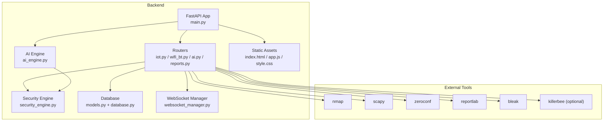
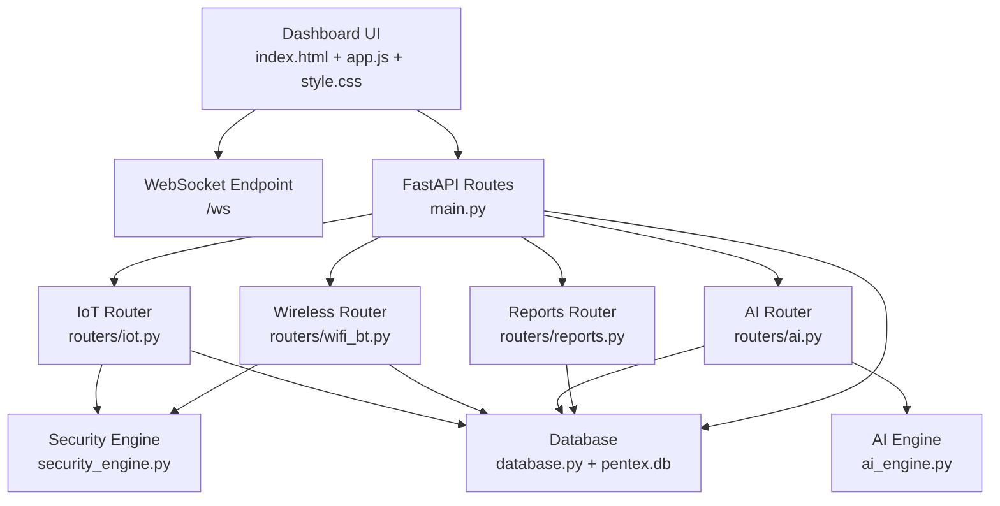
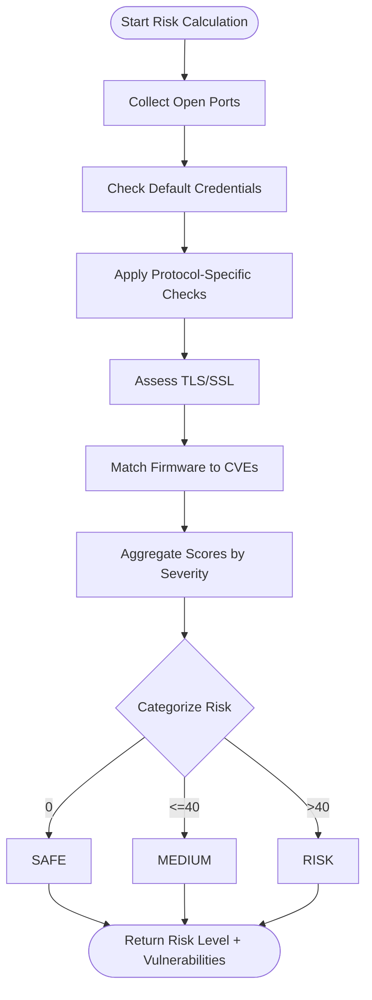
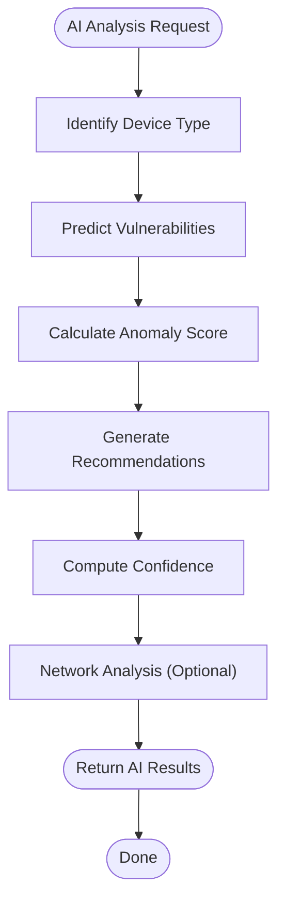
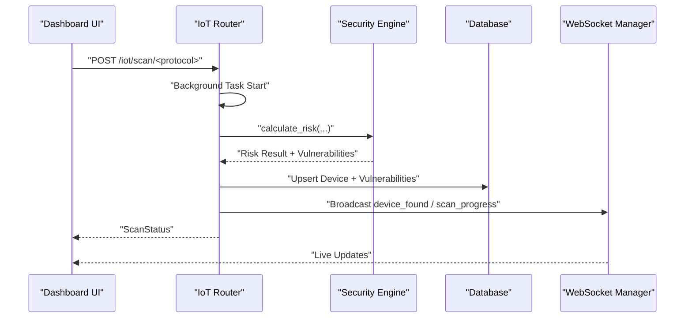
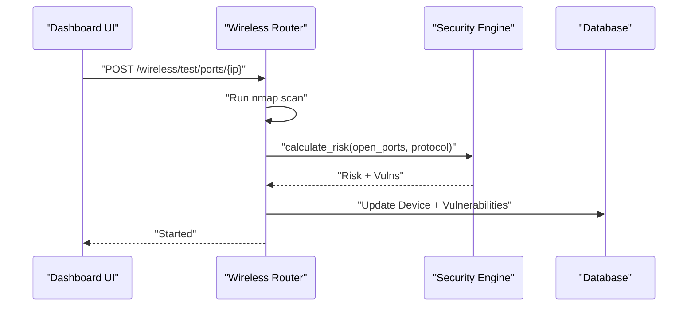
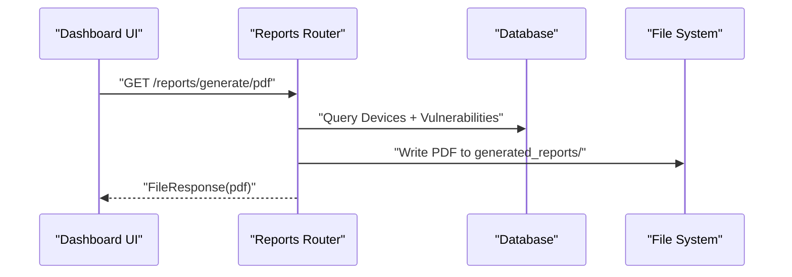
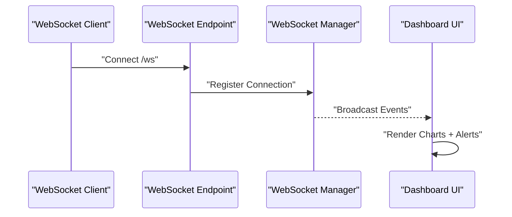
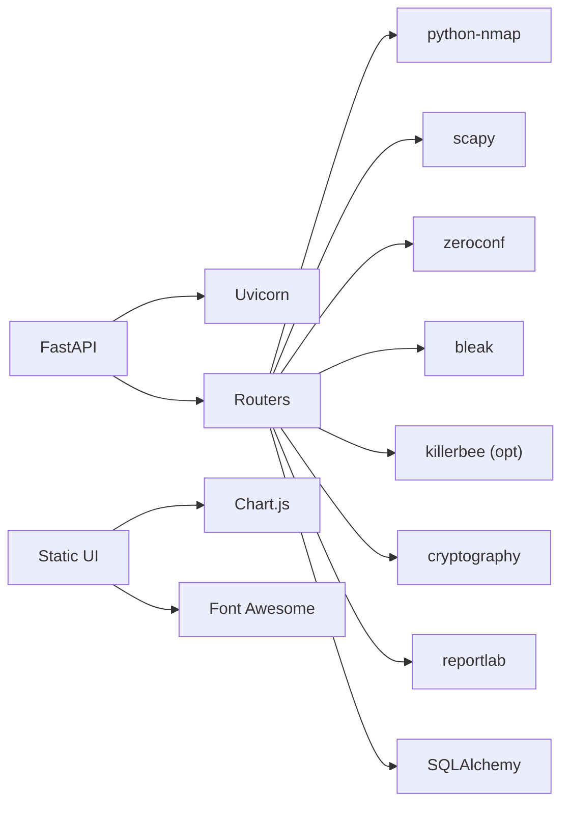

# Project Overview

<cite>
**Referenced Files in This Document**
- [backend/README.md](file://backend/README.md)
- [backend/main.py](file://backend/main.py)
- [backend/models.py](file://backend/models.py)
- [backend/ai_engine.py](file://backend/ai_engine.py)
- [backend/security_engine.py](file://backend/security_engine.py)
- [backend/database.py](file://backend/database.py)
- [backend/websocket_manager.py](file://backend/websocket_manager.py)
- [backend/requirements.txt](file://backend/requirements.txt)
- [backend/static/index.html](file://backend/static/index.html)
- [backend/static/app.js](file://backend/static/app.js)
- [backend/static/style.css](file://backend/static/style.css)
- [backend/routers/iot.py](file://backend/routers/iot.py)
- [backend/routers/wifi_bt.py](file://backend/routers/wifi_bt.py)
- [backend/routers/ai.py](file://backend/routers/ai.py)
- [backend/routers/reports.py](file://backend/routers/reports.py)
</cite>

## Table of Contents
1. [Introduction](#introduction)
2. [Project Structure](#project-structure)
3. [Core Components](#core-components)
4. [Architecture Overview](#architecture-overview)
5. [Detailed Component Analysis](#detailed-component-analysis)
6. [Dependency Analysis](#dependency-analysis)
7. [Performance Considerations](#performance-considerations)
8. [Troubleshooting Guide](#troubleshooting-guide)
9. [Conclusion](#conclusion)

## Introduction
PentexOne is a professional-grade IoT Security Auditor designed to discover, analyze, and assess security vulnerabilities across multiple wireless protocols. It provides a modern web interface powered by AI-driven analysis, enabling security professionals, IoT developers, and smart home enthusiasts to evaluate and improve the security posture of connected environments. Its mission is to simplify multi-protocol vulnerability discovery, deliver actionable insights, and produce professional-grade security reports.

Key value propositions:
- Multi-protocol scanning across Wi-Fi, Bluetooth, Zigbee, Thread/Matter, Z-Wave, LoRaWAN, and RFID/NFC
- AI-powered analysis for device classification, anomaly detection, vulnerability prediction, and remediation recommendations
- Real-time dashboard with live updates via WebSocket and interactive analytics
- Professional reporting in PDF, JSON, and CSV formats
- Raspberry Pi optimized deployment for portable and embedded use

Target audience:
- Security professionals conducting assessments and audits
- IoT developers validating device security during development and post-release
- Smart home enthusiasts securing personal networks and devices

Positioning in the cybersecurity ecosystem:
- Complements traditional network scanners (e.g., nmap) with IoT-specific protocol coverage and AI-driven insights
- Bridges the gap between raw vulnerability data and practical remediation guidance
- Supports continuous monitoring and trend analysis for evolving IoT ecosystems

**Section sources**
- [backend/README.md:18-30](file://backend/README.md#L18-L30)
- [backend/README.md:33-64](file://backend/README.md#L33-L64)
- [backend/README.md:215-241](file://backend/README.md#L215-L241)

## Project Structure
The project follows a modular backend-frontend separation:
- Backend: FastAPI application with modular routers for IoT scanning, Wi-Fi/Bluetooth, AI analysis, and reporting; WebSocket manager for real-time updates; SQLAlchemy models and SQLite storage
- Frontend: Static HTML/CSS/JavaScript dashboard with Chart.js for visualizations and WebSocket integration for live updates

**Diagram sources**
- [backend/main.py:14-48](file://backend/main.py#L14-L48)
- [backend/routers/iot.py:24](file://backend/routers/iot.py#L24)
- [backend/routers/wifi_bt.py:27](file://backend/routers/wifi_bt.py#L27)
- [backend/routers/ai.py:20](file://backend/routers/ai.py#L20)
- [backend/routers/reports.py:15](file://backend/routers/reports.py#L15)
- [backend/ai_engine.py:1](file://backend/ai_engine.py#L1)
- [backend/security_engine.py:1](file://backend/security_engine.py#L1)
- [backend/database.py:12-61](file://backend/database.py#L12-L61)
- [backend/websocket_manager.py:7-47](file://backend/websocket_manager.py#L7-L47)
- [backend/static/index.html:1-413](file://backend/static/index.html#L1-L413)
- [backend/static/app.js:1-200](file://backend/static/app.js#L1-L200)
- [backend/static/style.css:1-200](file://backend/static/style.css#L1-L200)
- [backend/requirements.txt:1-21](file://backend/requirements.txt#L1-L21)

**Section sources**
- [backend/README.md:273-297](file://backend/README.md#L273-L297)
- [backend/main.py:14-48](file://backend/main.py#L14-L48)
- [backend/database.py:12-61](file://backend/database.py#L12-L61)
- [backend/websocket_manager.py:7-47](file://backend/websocket_manager.py#L7-L47)
- [backend/static/index.html:1-413](file://backend/static/index.html#L1-L413)
- [backend/static/app.js:1-200](file://backend/static/app.js#L1-L200)
- [backend/static/style.css:1-200](file://backend/static/style.css#L1-L200)

## Core Components
- FastAPI Application: Central orchestration, routing, authentication, and WebSocket endpoint
- IoT Routers: Protocol-specific scanning and discovery for Wi-Fi, Bluetooth, Zigbee, Thread/Matter, Z-Wave, LoRaWAN, and RFID/NFC
- Security Engine: Risk calculation, vulnerability mapping, and TLS/SSL assessment
- AI Engine: Pattern matching, anomaly detection, vulnerability prediction, and remediation recommendations
- Database: ORM models for devices, vulnerabilities, RFID cards, and settings backed by SQLite
- WebSocket Manager: Broadcasts live scan events to the dashboard
- Frontend Dashboard: Real-time charts, device tables, AI suggestions, and reporting controls

Key capabilities:
- Multi-protocol scanning with hardware detection and fallback simulation modes
- Risk scoring and vulnerability categorization per device and network
- AI-driven device classification, anomaly detection, and security score computation
- Live dashboards with WebSocket updates and interactive visualizations
- Professional report generation in multiple formats

**Section sources**
- [backend/README.md:22-29](file://backend/README.md#L22-L29)
- [backend/README.md:33-64](file://backend/README.md#L33-L64)
- [backend/README.md:215-269](file://backend/README.md#L215-L269)
- [backend/models.py:6-71](file://backend/models.py#L6-L71)
- [backend/database.py:12-61](file://backend/database.py#L12-L61)
- [backend/websocket_manager.py:7-47](file://backend/websocket_manager.py#L7-L47)
- [backend/ai_engine.py:236-766](file://backend/ai_engine.py#L236-L766)
- [backend/security_engine.py:202-340](file://backend/security_engine.py#L202-L340)

## Architecture Overview
PentexOne employs a layered architecture:
- Presentation Layer: Static HTML/CSS/JS dashboard with Chart.js and WebSocket connectivity
- API Layer: FastAPI routes organized by domain (IoT, Wireless, AI, Reports)
- Business Logic Layer: Security and AI engines encapsulating protocol-specific logic and intelligence
- Data Layer: SQLite via SQLAlchemy with models for devices, vulnerabilities, RFID cards, and settings

**Diagram sources**
- [backend/main.py:14-106](file://backend/main.py#L14-L106)
- [backend/routers/iot.py:24](file://backend/routers/iot.py#L24)
- [backend/routers/wifi_bt.py:27](file://backend/routers/wifi_bt.py#L27)
- [backend/routers/ai.py:20](file://backend/routers/ai.py#L20)
- [backend/routers/reports.py:15](file://backend/routers/reports.py#L15)
- [backend/ai_engine.py:236-766](file://backend/ai_engine.py#L236-L766)
- [backend/security_engine.py:202-340](file://backend/security_engine.py#L202-L340)
- [backend/database.py:12-80](file://backend/database.py#L12-L80)
- [backend/static/index.html:1-413](file://backend/static/index.html#L1-L413)
- [backend/static/app.js:1-200](file://backend/static/app.js#L1-L200)
- [backend/static/style.css:1-200](file://backend/static/style.css#L1-L200)

## Detailed Component Analysis

### Security Engine: Risk Calculation and Vulnerability Mapping
The Security Engine evaluates device risk based on:
- Open ports mapped to known vulnerability categories
- Default credential checks
- Protocol-specific vulnerability patterns
- TLS/SSL certificate validation
- Firmware/CVE matching

Processing logic:
- Risk score aggregation weighted by severity
- Categorization into SAFE, MEDIUM, RISK
- Detailed vulnerability records with severity and description

**Diagram sources**
- [backend/security_engine.py:202-340](file://backend/security_engine.py#L202-L340)

**Section sources**
- [backend/security_engine.py:18-187](file://backend/security_engine.py#L18-L187)
- [backend/security_engine.py:202-340](file://backend/security_engine.py#L202-L340)

### AI Engine: Pattern Matching, Anomaly Detection, and Recommendations
The AI Engine performs:
- Device type identification via pattern matching and port heuristics
- Vulnerability prediction with confidence scores
- Anomaly detection and network-wide risk scoring
- Remediation recommendations drawn from a knowledge base
- Trend analysis and dashboard suggestions

**Diagram sources**
- [backend/ai_engine.py:236-766](file://backend/ai_engine.py#L236-L766)

**Section sources**
- [backend/ai_engine.py:236-766](file://backend/ai_engine.py#L236-L766)

### IoT Scanning Pipeline: Wi-Fi, Bluetooth, Zigbee, Thread/Matter, Z-Wave, LoRaWAN
The IoT routers coordinate scanning workflows:
- Wi-Fi: nmap-based discovery and port scanning
- Bluetooth: BLE device discovery and risk flags
- Zigbee/Thread/Z-Wave/LoRaWAN: hardware detection with simulated fallbacks
- Real-time updates via WebSocket broadcasts

**Diagram sources**
- [backend/routers/iot.py:291-413](file://backend/routers/iot.py#L291-L413)
- [backend/security_engine.py:202-340](file://backend/security_engine.py#L202-L340)
- [backend/websocket_manager.py:21-45](file://backend/websocket_manager.py#L21-L45)

**Section sources**
- [backend/routers/iot.py:291-413](file://backend/routers/iot.py#L291-L413)
- [backend/routers/iot.py:483-586](file://backend/routers/iot.py#L483-L586)
- [backend/routers/iot.py:625-722](file://backend/routers/iot.py#L625-L722)
- [backend/routers/iot.py:783-800](file://backend/routers/iot.py#L783-L800)

### Wireless and TLS Utilities: Port Scanning, Credential Testing, TLS Validation
The Wireless router supports:
- Deep port scanning per device
- Default credential testing across HTTP and Telnet
- TLS/SSL certificate validation and risk updates
- Wi-Fi SSID discovery and network quick discovery

**Diagram sources**
- [backend/routers/wifi_bt.py:59-96](file://backend/routers/wifi_bt.py#L59-L96)
- [backend/security_engine.py:202-340](file://backend/security_engine.py#L202-L340)

**Section sources**
- [backend/routers/wifi_bt.py:59-96](file://backend/routers/wifi_bt.py#L59-L96)
- [backend/routers/wifi_bt.py:101-167](file://backend/routers/wifi_bt.py#L101-L167)
- [backend/routers/wifi_bt.py:447-549](file://backend/routers/wifi_bt.py#L447-L549)
- [backend/routers/wifi_bt.py:636-766](file://backend/routers/wifi_bt.py#L636-L766)

### Reporting: PDF, JSON, CSV Exports
The Reports router generates comprehensive security reports:
- Executive summary and device inventory
- Vulnerability listings with remediation guidance
- Optional RFID/NFC audit section

**Diagram sources**
- [backend/routers/reports.py:37-158](file://backend/routers/reports.py#L37-L158)

**Section sources**
- [backend/routers/reports.py:18-34](file://backend/routers/reports.py#L18-L34)
- [backend/routers/reports.py:37-158](file://backend/routers/reports.py#L37-L158)

### Real-Time Dashboard and WebSocket Integration
The dashboard provides:
- Live scan progress and device discovery notifications
- Interactive charts for risk and protocol distributions
- AI security score and recommendations
- Device selection for detailed analysis and AI insights

**Diagram sources**
- [backend/main.py:90-102](file://backend/main.py#L90-L102)
- [backend/websocket_manager.py:7-47](file://backend/websocket_manager.py#L7-L47)
- [backend/static/app.js:113-155](file://backend/static/app.js#L113-L155)

**Section sources**
- [backend/main.py:90-102](file://backend/main.py#L90-L102)
- [backend/websocket_manager.py:7-47](file://backend/websocket_manager.py#L7-L47)
- [backend/static/app.js:113-155](file://backend/static/app.js#L113-L155)
- [backend/static/index.html:52-316](file://backend/static/index.html#L52-L316)

## Dependency Analysis
Technology stack and integration:
- Web framework: FastAPI with Uvicorn ASGI server
- Networking and scanning: python-nmap, scapy, zeroconf
- Bluetooth: bleak
- Hardware sniffing: killerbee (optional)
- TLS validation: cryptography
- Reporting: ReportLab
- Database: SQLAlchemy with SQLite
- Frontend: Chart.js for analytics, Font Awesome for icons

**Diagram sources**
- [backend/requirements.txt:1-21](file://backend/requirements.txt#L1-L21)
- [backend/main.py:1-106](file://backend/main.py#L1-L106)
- [backend/routers/iot.py:1-16](file://backend/routers/iot.py#L1-L16)
- [backend/routers/wifi_bt.py:1-12](file://backend/routers/wifi_bt.py#L1-L12)
- [backend/routers/ai.py:1-18](file://backend/routers/ai.py#L1-L18)
- [backend/routers/reports.py:1-15](file://backend/routers/reports.py#L1-L15)
- [backend/static/index.html:8-14](file://backend/static/index.html#L8-L14)
- [backend/static/style.css:1-200](file://backend/static/style.css#L1-L200)

**Section sources**
- [backend/requirements.txt:1-21](file://backend/requirements.txt#L1-L21)

## Performance Considerations
- Resource usage varies by scanning intensity; idle vs. scanning vs. AI analysis states impact CPU and memory
- Recommendations include using wired Ethernet, headless operation, and powered USB hubs for multiple dongles
- Background tasks ensure non-blocking UI interactions; WebSocket broadcasting is thread-safe

[No sources needed since this section provides general guidance]

## Troubleshooting Guide
Common operational issues and resolutions:
- Dashboard accessibility: verify service status, logs, and port binding
- Hardware detection: confirm USB dongle presence, permissions, and driver availability
- Bluetooth connectivity: restart services and unblock interfaces
- Protocol-specific errors: validate optional dependencies (killerbee, bleak) and system capabilities

**Section sources**
- [backend/README.md:349-382](file://backend/README.md#L349-L382)

## Conclusion
PentexOne delivers a comprehensive, professional-grade solution for IoT security auditing. Its multi-protocol scanning, AI-powered insights, real-time dashboard, and professional reporting capabilities position it as a practical tool for security teams and IoT developers alike. Built with modularity, extensibility, and usability in mind, it supports both hands-on assessments and continuous monitoring of evolving IoT environments.

[No sources needed since this section summarizes without analyzing specific files]