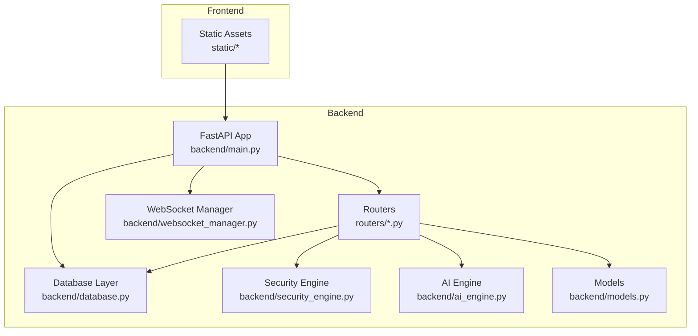
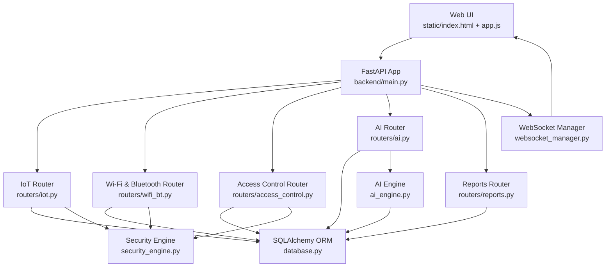
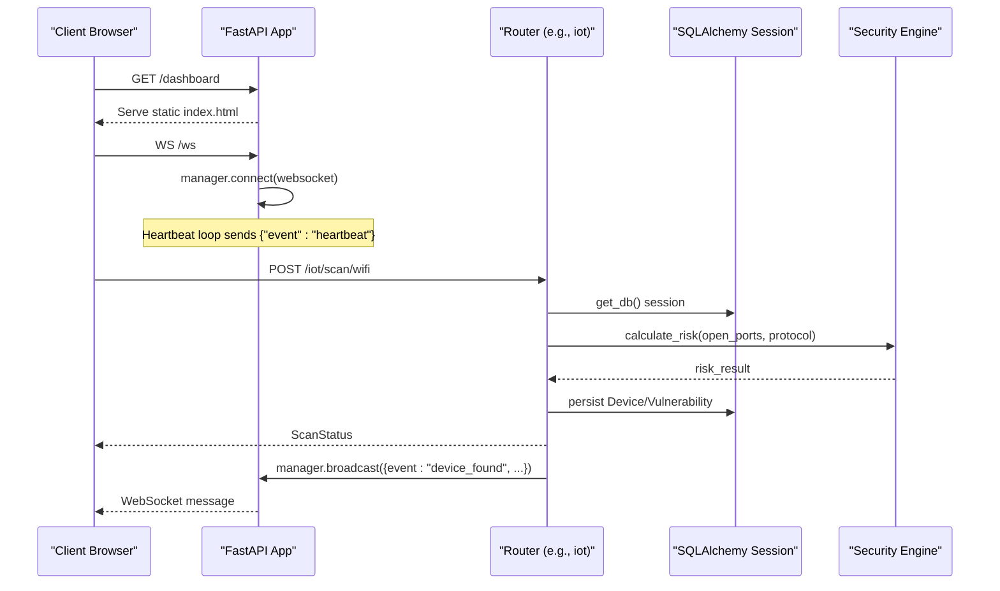
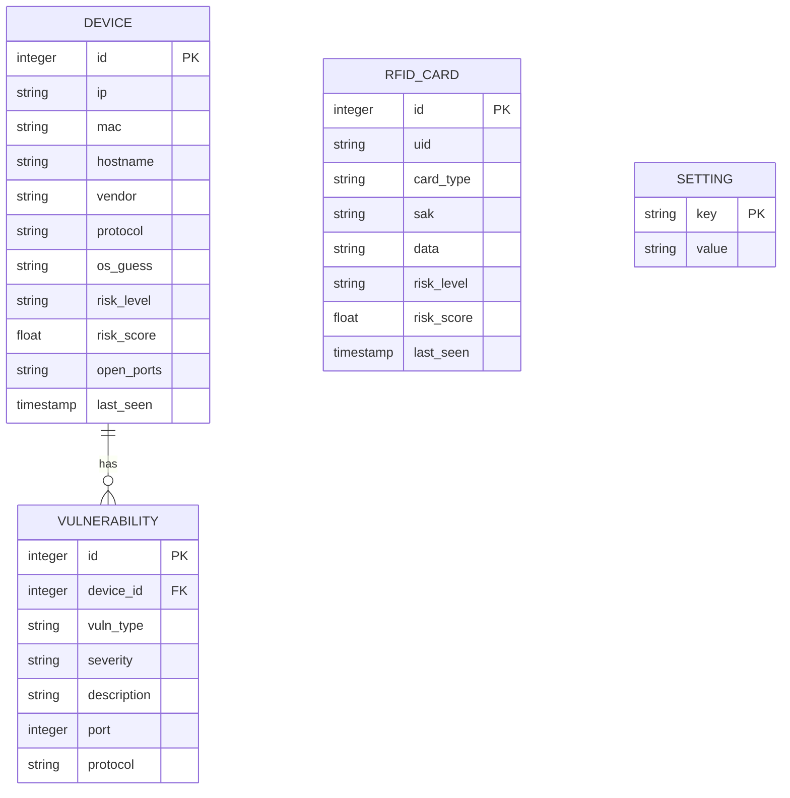
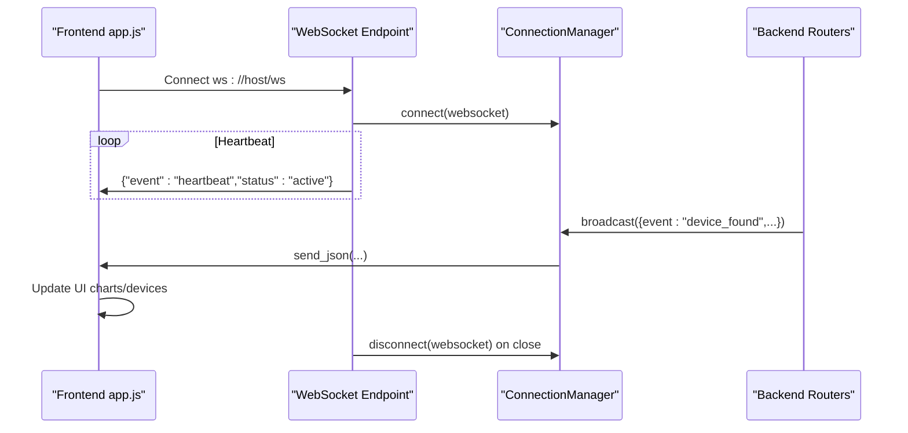
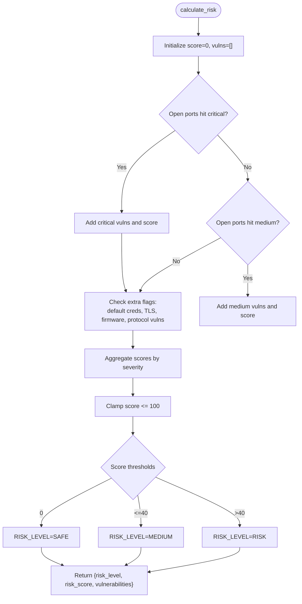
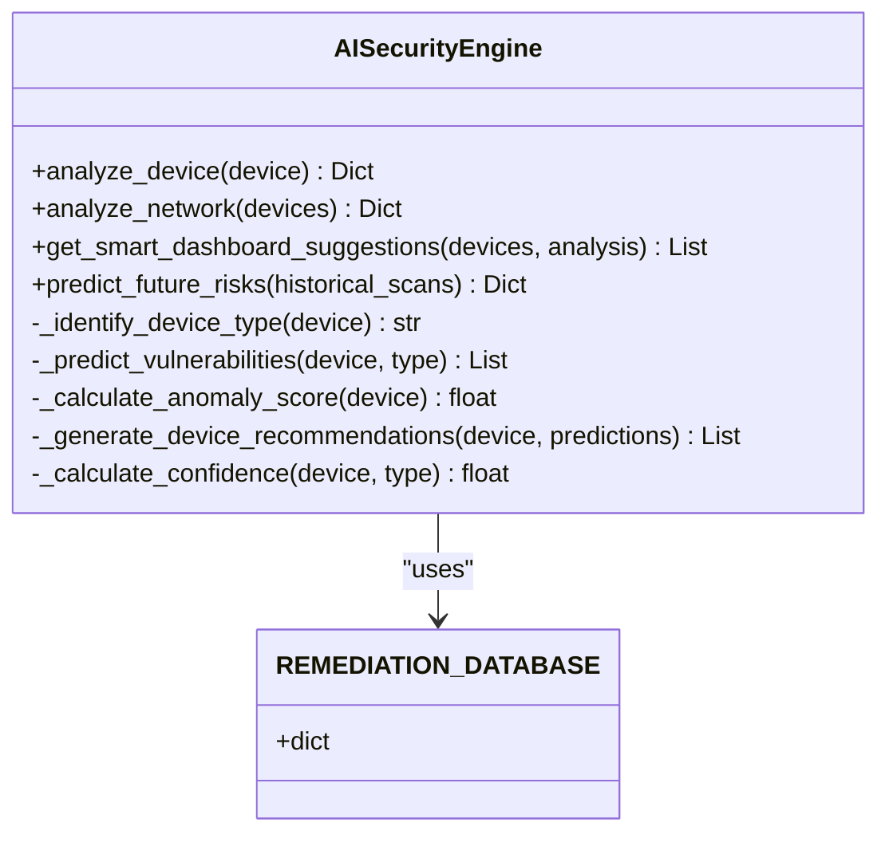
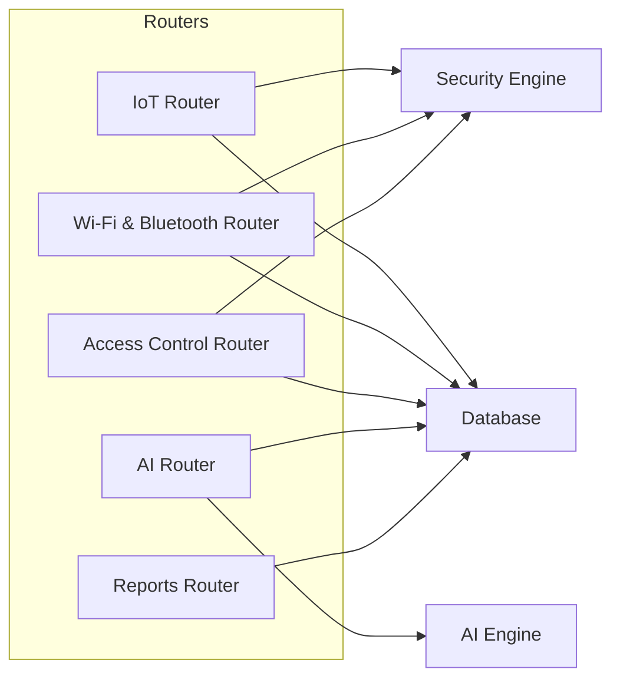
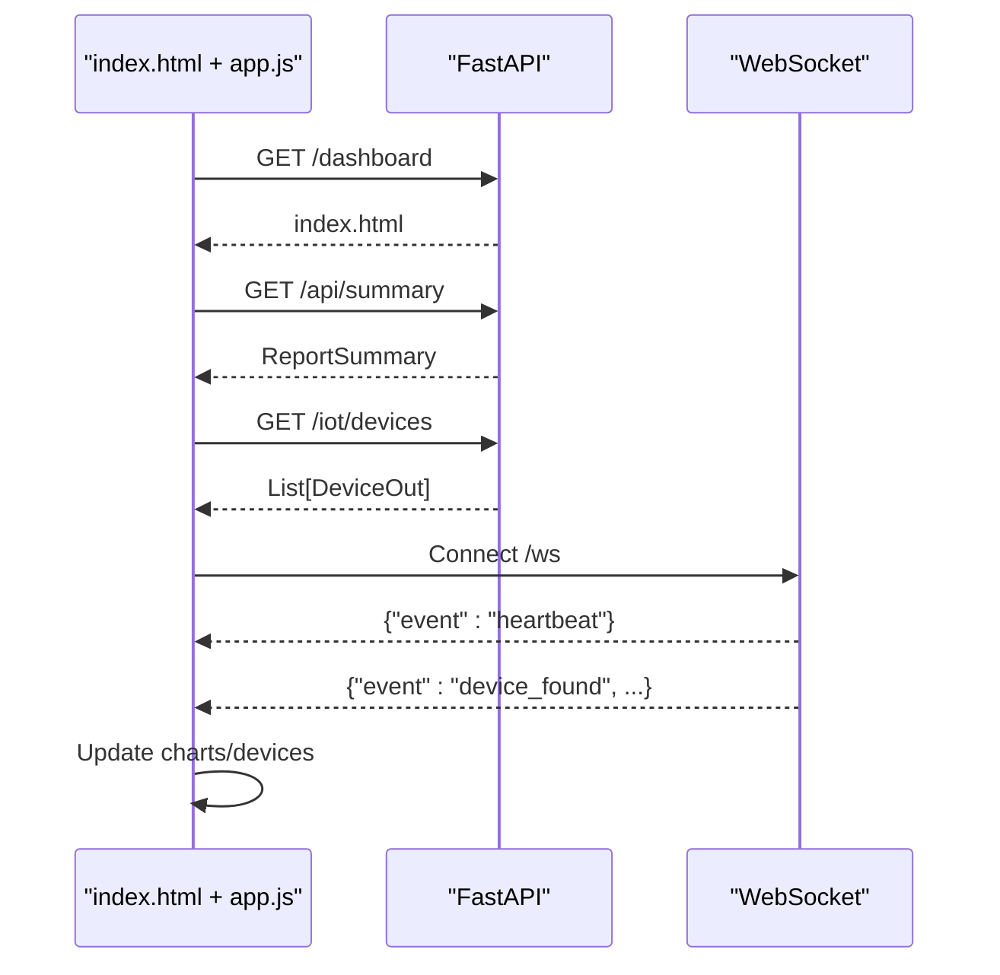
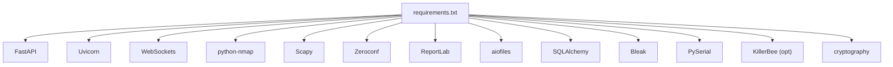

# System Architecture

<cite>
**Referenced Files in This Document**
- [backend/main.py](file://backend/main.py)
- [backend/database.py](file://backend/database.py)
- [backend/models.py](file://backend/models.py)
- [backend/websocket_manager.py](file://backend/websocket_manager.py)
- [backend/security_engine.py](file://backend/security_engine.py)
- [backend/ai_engine.py](file://backend/ai_engine.py)
- [backend/routers/iot.py](file://backend/routers/iot.py)
- [backend/routers/wifi_bt.py](file://backend/routers/wifi_bt.py)
- [backend/routers/access_control.py](file://backend/routers/access_control.py)
- [backend/routers/reports.py](file://backend/routers/reports.py)
- [backend/routers/ai.py](file://backend/routers/ai.py)
- [backend/requirements.txt](file://backend/requirements.txt)
- [backend/static/app.js](file://backend/static/app.js)
- [backend/static/index.html](file://backend/static/index.html)
</cite>

## Table of Contents
1. [Introduction](#introduction)
2. [Project Structure](#project-structure)
3. [Core Components](#core-components)
4. [Architecture Overview](#architecture-overview)
5. [Detailed Component Analysis](#detailed-component-analysis)
6. [Dependency Analysis](#dependency-analysis)
7. [Performance Considerations](#performance-considerations)
8. [Troubleshooting Guide](#troubleshooting-guide)
9. [Conclusion](#conclusion)
10. [Appendices](#appendices)

## Introduction
PentexOne is a comprehensive IoT security auditing platform that combines a FastAPI backend, a modular router pattern, a real-time WebSocket communication layer, and an integrated AI engine. It supports multi-protocol scanning (Wi-Fi, Bluetooth, Zigbee, Thread/Matter, Z-Wave, LoRaWAN), hardware integration via serial dongles, and a modern web dashboard with live updates. The system emphasizes separation of concerns across API, business logic, data access, and presentation layers, while enabling scalable deployment on Raspberry Pi and traditional servers.

## Project Structure
The backend follows a layered architecture with a FastAPI application entry point, modular routers for distinct functional domains, a shared database layer, and a WebSocket manager for real-time updates. The frontend is a static SPA served by FastAPI that communicates with the backend via REST and WebSocket.

**Diagram sources**
- [backend/main.py:1-106](file://backend/main.py#L1-L106)
- [backend/routers/iot.py:1-880](file://backend/routers/iot.py#L1-L880)
- [backend/database.py:1-80](file://backend/database.py#L1-L80)
- [backend/websocket_manager.py:1-48](file://backend/websocket_manager.py#L1-L48)
- [backend/security_engine.py:1-425](file://backend/security_engine.py#L1-L425)
- [backend/ai_engine.py:1-766](file://backend/ai_engine.py#L1-L766)
- [backend/models.py:1-71](file://backend/models.py#L1-L71)
- [backend/static/app.js:1-200](file://backend/static/app.js#L1-L200)

**Section sources**
- [backend/main.py:1-106](file://backend/main.py#L1-L106)
- [backend/README.md:275-297](file://backend/README.md#L275-L297)

## Core Components
- FastAPI Application: Central orchestration point that mounts routers, configures middleware, serves static assets, and exposes REST endpoints and a WebSocket endpoint.
- Modular Routers: Feature-based routing modules for IoT scanning, Wi-Fi/Bluetooth, access control (RFID), AI analysis, and reporting.
- Database Layer: SQLAlchemy ORM models and session management for persistent storage of devices, vulnerabilities, RFID cards, and settings.
- WebSocket Manager: Connection lifecycle management and broadcast mechanism for real-time updates.
- Security Engine: Risk calculation and vulnerability mapping across protocols and services.
- AI Engine: Pattern recognition, anomaly detection, predictive analytics, and remediation suggestions.
- Frontend: Static SPA with Chart.js for dashboards, WebSocket client for live updates, and REST client for API interactions.

**Section sources**
- [backend/main.py:14-48](file://backend/main.py#L14-L48)
- [backend/database.py:12-80](file://backend/database.py#L12-L80)
- [backend/websocket_manager.py:7-48](file://backend/websocket_manager.py#L7-L48)
- [backend/security_engine.py:202-340](file://backend/security_engine.py#L202-L340)
- [backend/ai_engine.py:236-766](file://backend/ai_engine.py#L236-L766)
- [backend/routers/iot.py:24-24](file://backend/routers/iot.py#L24-L24)
- [backend/routers/wifi_bt.py:27-27](file://backend/routers/wifi_bt.py#L27-L27)
- [backend/routers/access_control.py:13-13](file://backend/routers/access_control.py#L13-L13)
- [backend/routers/ai.py:20-20](file://backend/routers/ai.py#L20-L20)
- [backend/routers/reports.py:15-15](file://backend/routers/reports.py#L15-L15)

## Architecture Overview
The system architecture separates concerns into four layers:
- Presentation Layer: Static SPA served by FastAPI, consuming REST APIs and WebSocket events.
- API Layer: FastAPI application with modular routers exposing endpoints for scanning, analysis, reporting, and settings.
- Business Logic Layer: Security engine for risk scoring and AI engine for intelligent analysis.
- Data Access Layer: SQLAlchemy ORM with SQLite persistence and dependency injection for sessions.

**Diagram sources**
- [backend/main.py:34-106](file://backend/main.py#L34-L106)
- [backend/routers/iot.py:24-621](file://backend/routers/iot.py#L24-L621)
- [backend/routers/wifi_bt.py:27-766](file://backend/routers/wifi_bt.py#L27-L766)
- [backend/routers/access_control.py:13-95](file://backend/routers/access_control.py#L13-L95)
- [backend/routers/ai.py:20-330](file://backend/routers/ai.py#L20-L330)
- [backend/routers/reports.py:15-158](file://backend/routers/reports.py#L15-L158)
- [backend/websocket_manager.py:7-48](file://backend/websocket_manager.py#L7-L48)
- [backend/security_engine.py:202-340](file://backend/security_engine.py#L202-L340)
- [backend/ai_engine.py:236-766](file://backend/ai_engine.py#L236-L766)
- [backend/database.py:62-80](file://backend/database.py#L62-L80)
- [backend/static/app.js:113-155](file://backend/static/app.js#L113-L155)

## Detailed Component Analysis

### FastAPI Application and Routing
- Application initialization sets up CORS, static file serving, authentication endpoints, settings endpoints, and WebSocket endpoint.
- Modular routers are included to organize endpoints by domain (IoT, Wi-Fi/Bluetooth, RFID, AI, Reports).
- Dependency injection for database sessions ensures clean resource management.

**Diagram sources**
- [backend/main.py:34-106](file://backend/main.py#L34-L106)
- [backend/routers/iot.py:291-413](file://backend/routers/iot.py#L291-L413)
- [backend/security_engine.py:202-340](file://backend/security_engine.py#L202-L340)
- [backend/websocket_manager.py:21-46](file://backend/websocket_manager.py#L21-L46)

**Section sources**
- [backend/main.py:14-48](file://backend/main.py#L14-L48)
- [backend/main.py:50-64](file://backend/main.py#L50-L64)
- [backend/main.py:70-82](file://backend/main.py#L70-L82)
- [backend/main.py:90-102](file://backend/main.py#L90-L102)

### Database Layer and Data Models
- Models define tables for devices, vulnerabilities, RFID cards, and settings.
- Relationships link devices to their vulnerabilities.
- Session management via dependency injection ensures proper lifecycle and cleanup.

**Diagram sources**
- [backend/database.py:12-61](file://backend/database.py#L12-L61)

**Section sources**
- [backend/database.py:62-80](file://backend/database.py#L62-L80)
- [backend/models.py:6-71](file://backend/models.py#L6-L71)

### WebSocket Real-Time Communication
- ConnectionManager maintains active connections and broadcasts messages to all clients.
- Backend emits events for scan progress, device discovery, and completion.
- Frontend establishes a WebSocket connection and reacts to incoming events to update UI and show notifications.

**Diagram sources**
- [backend/websocket_manager.py:7-48](file://backend/websocket_manager.py#L7-L48)
- [backend/main.py:90-102](file://backend/main.py#L90-L102)
- [backend/static/app.js:113-155](file://backend/static/app.js#L113-L155)

**Section sources**
- [backend/websocket_manager.py:21-46](file://backend/websocket_manager.py#L21-L46)
- [backend/static/app.js:113-155](file://backend/static/app.js#L113-L155)

### Security Engine: Risk Calculation and Vulnerability Mapping
- Risk scoring aggregates critical and medium ports, default credentials, protocol-specific weaknesses, TLS/SSL issues, and firmware CVE matches.
- Returns risk level, score, and detailed vulnerability records for downstream use.

**Diagram sources**
- [backend/security_engine.py:202-340](file://backend/security_engine.py#L202-L340)

**Section sources**
- [backend/security_engine.py:202-340](file://backend/security_engine.py#L202-L340)

### AI Engine: Pattern Recognition and Predictive Analysis
- Identifies device types via pattern matching and port signatures.
- Predicts vulnerabilities, calculates anomaly scores, and generates remediation recommendations.
- Provides network-wide analysis, security score, and dashboard suggestions.

**Diagram sources**
- [backend/ai_engine.py:236-766](file://backend/ai_engine.py#L236-L766)

**Section sources**
- [backend/ai_engine.py:236-766](file://backend/ai_engine.py#L236-L766)

### Modular Router Pattern: IoT, Wi-Fi/Bluetooth, RFID, AI, Reports
- IoT Router: Multi-protocol scanning (Wi-Fi via nmap, BLE via Bleak, Zigbee/Z-Wave/Thread/Matter with hardware detection and simulated fallbacks), device discovery, and vulnerability persistence.
- Wi-Fi/Bluetooth Router: Port scanning, credential testing, SSID discovery, TLS validation, deauthentication detection, and network-wide discovery.
- Access Control Router: RFID/NFC scanning with hardware detection and simulation, risk evaluation, and persistence.
- AI Router: Device and network analysis, remediation guides, security score, and suggestions.
- Reports Router: Dashboard summary and PDF report generation.

**Diagram sources**
- [backend/routers/iot.py:24-880](file://backend/routers/iot.py#L24-L880)
- [backend/routers/wifi_bt.py:27-766](file://backend/routers/wifi_bt.py#L27-L766)
- [backend/routers/access_control.py:13-95](file://backend/routers/access_control.py#L13-L95)
- [backend/routers/ai.py:20-330](file://backend/routers/ai.py#L20-L330)
- [backend/routers/reports.py:15-158](file://backend/routers/reports.py#L15-L158)
- [backend/security_engine.py:202-340](file://backend/security_engine.py#L202-L340)
- [backend/ai_engine.py:236-766](file://backend/ai_engine.py#L236-L766)
- [backend/database.py:62-80](file://backend/database.py#L62-L80)

**Section sources**
- [backend/routers/iot.py:286-413](file://backend/routers/iot.py#L286-L413)
- [backend/routers/wifi_bt.py:39-96](file://backend/routers/wifi_bt.py#L39-L96)
- [backend/routers/access_control.py:47-84](file://backend/routers/access_control.py#L47-L84)
- [backend/routers/ai.py:26-138](file://backend/routers/ai.py#L26-L138)
- [backend/routers/reports.py:18-34](file://backend/routers/reports.py#L18-L34)

### Frontend Integration: Real-Time Dashboards and Live Updates
- The SPA initializes charts, fetches summaries and device lists, discovers networks, and subscribes to WebSocket events.
- WebSocket messages trigger UI updates for device discovery, scan progress, and completion.

**Diagram sources**
- [backend/static/index.html:1-200](file://backend/static/index.html#L1-L200)
- [backend/static/app.js:14-25](file://backend/static/app.js#L14-L25)
- [backend/static/app.js:113-155](file://backend/static/app.js#L113-L155)
- [backend/main.py:68-82](file://backend/main.py#L68-L82)

**Section sources**
- [backend/static/index.html:1-200](file://backend/static/index.html#L1-L200)
- [backend/static/app.js:113-155](file://backend/static/app.js#L113-L155)

## Dependency Analysis
External dependencies include FastAPI, Uvicorn, WebSockets, python-nmap, Scapy, Zeroconf, ReportLab, aiofiles, SQLAlchemy, Bleak, PySerial, KillerBee (optional), and cryptography. These enable scanning, hardware communication, protocol discovery, report generation, and TLS validation.

**Diagram sources**
- [backend/requirements.txt:1-21](file://backend/requirements.txt#L1-L21)

**Section sources**
- [backend/requirements.txt:1-21](file://backend/requirements.txt#L1-L21)

## Performance Considerations
- Background scanning tasks offload heavy work (nmap, BLE discovery, hardware sniffing) from request threads to avoid blocking.
- WebSocket broadcasting uses thread-safe coroutine scheduling to prevent race conditions.
- SQLite is lightweight and suitable for embedded deployments; consider migration to PostgreSQL for high concurrency and scale.
- Frontend charts update incrementally; minimize unnecessary re-renders by batching updates.
- Hardware-dependent scans (Zigbee/Z-Wave/Thread) may block or fail gracefully with simulated fallbacks.

[No sources needed since this section provides general guidance]

## Troubleshooting Guide
Common issues and resolutions:
- Cannot access dashboard: verify service status, check logs, and confirm port 8000 is listening.
- USB dongle not detected: list USB devices, adjust permissions, and ensure proper drivers.
- Bluetooth not working: restart Bluetooth service and unblock rfkill.
- WebSocket disconnections: frontend reconnects automatically; inspect browser console for errors.

**Section sources**
- [backend/README.md:349-449](file://backend/README.md#L349-L449)

## Conclusion
PentexOne demonstrates a well-structured, modular architecture that cleanly separates presentation, API, business logic, and data access layers. Its real-time WebSocket integration, robust security engine, and AI-driven analysis provide a powerful foundation for IoT security auditing. The system is optimized for Raspberry Pi deployment while remaining extensible for larger environments.

[No sources needed since this section summarizes without analyzing specific files]

## Appendices

### System Boundaries and Integration Points
- Internal: FastAPI app, routers, engines, database, WebSocket manager.
- External: Hardware dongles (Zigbee, Thread/Matter, Z-Wave), BLE scanners, TLS endpoints, PDF generation dependencies.
- Integration: REST APIs for frontend consumption, WebSocket for live updates, hardware serial interfaces for scanning.

**Section sources**
- [backend/README.md:182-212](file://backend/README.md#L182-L212)
- [backend/requirements.txt:1-21](file://backend/requirements.txt#L1-L21)