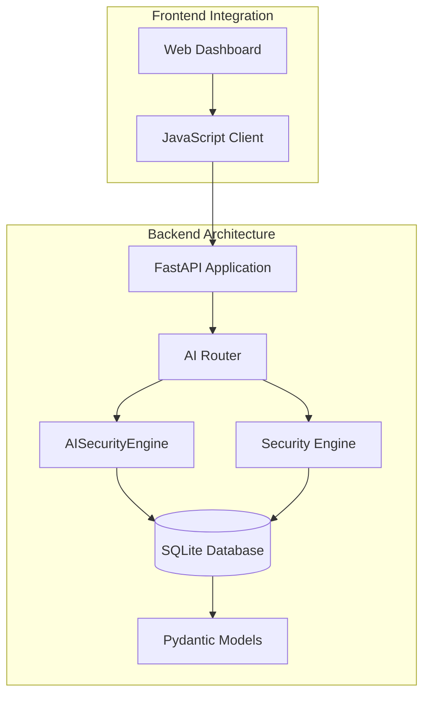
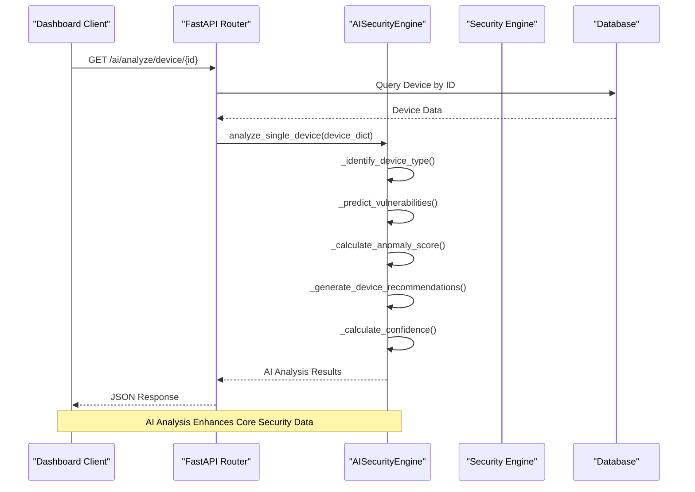
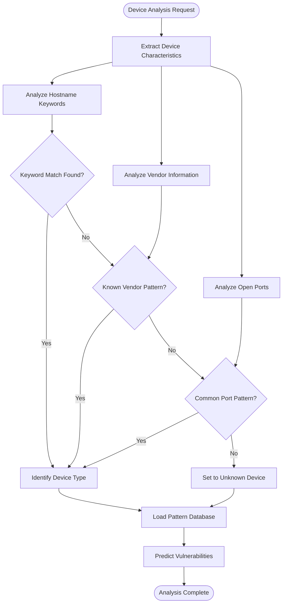
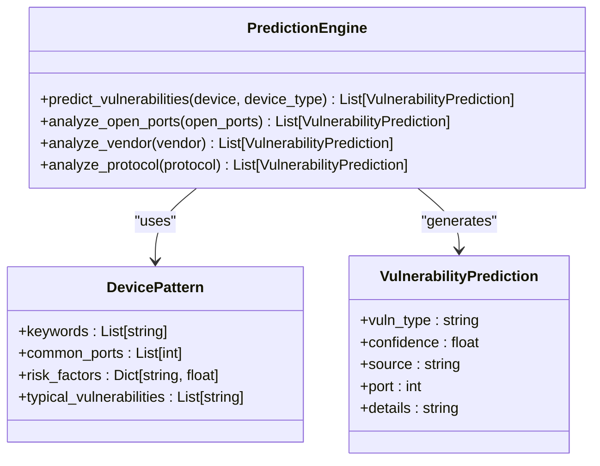
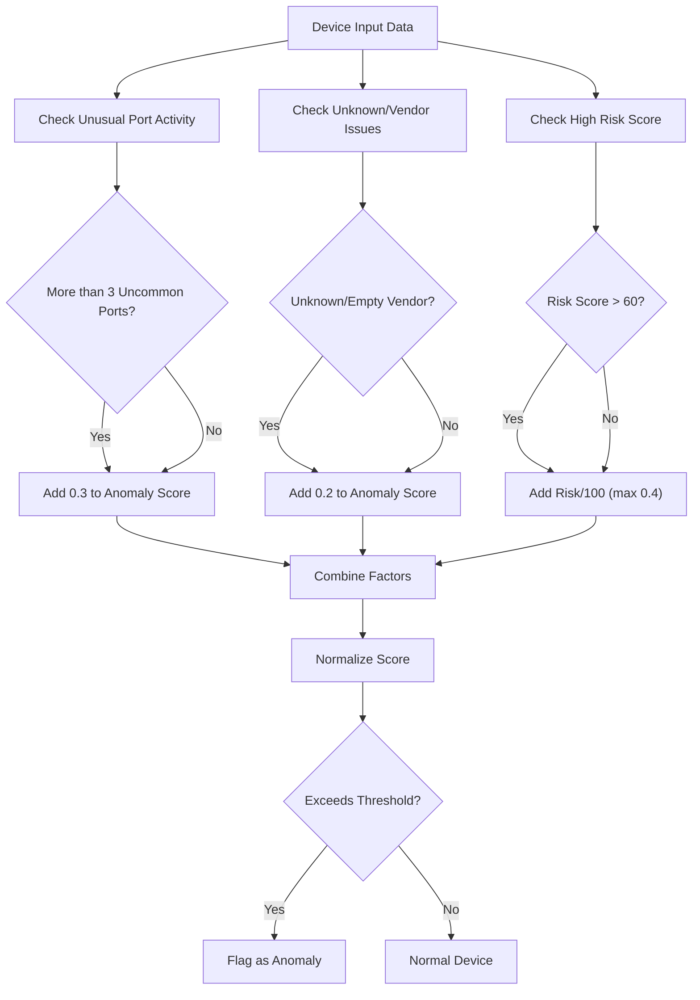
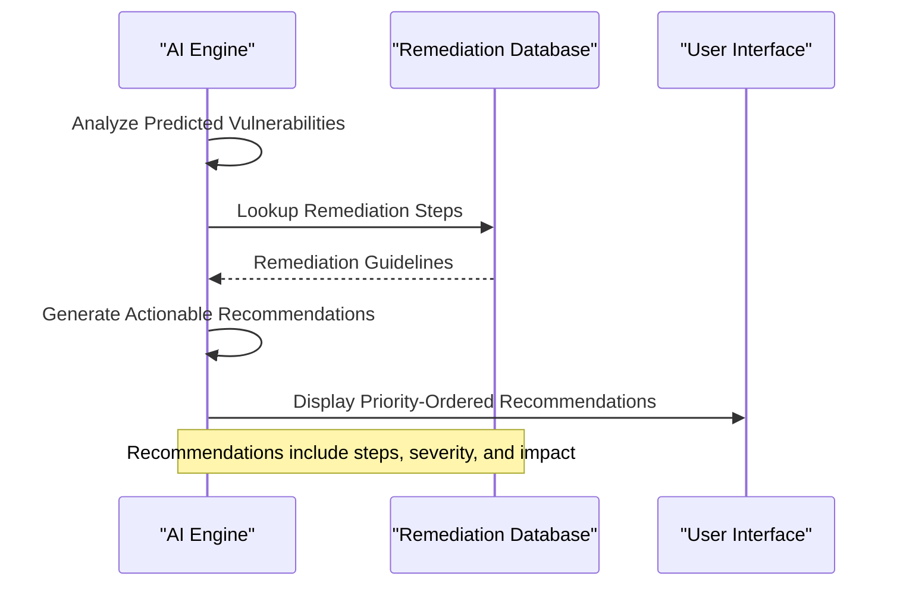
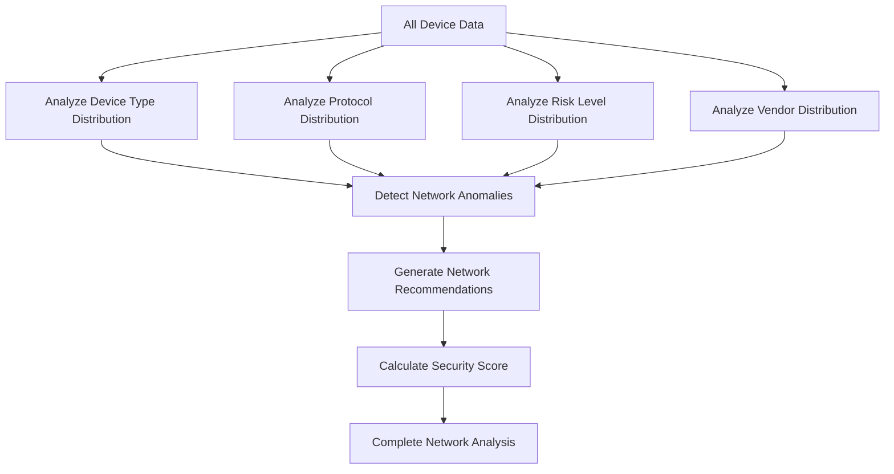
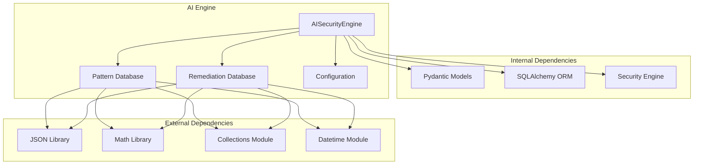

# AI Security Engine Integration

<cite>
**Referenced Files in This Document**
- [ai_engine.py](file://backend/ai_engine.py)
- [security_engine.py](file://backend/security_engine.py)
- [main.py](file://backend/main.py)
- [routers/ai.py](file://backend/routers/ai.py)
- [models.py](file://backend/models.py)
- [database.py](file://backend/database.py)
- [app.js](file://backend/static/app.js)
</cite>

## Table of Contents
1. [Introduction](#introduction)
2. [Project Structure](#project-structure)
3. [Core Components](#core-components)
4. [Architecture Overview](#architecture-overview)
5. [Detailed Component Analysis](#detailed-component-analysis)
6. [Dependency Analysis](#dependency-analysis)
7. [Performance Considerations](#performance-considerations)
8. [Troubleshooting Guide](#troubleshooting-guide)
9. [Conclusion](#conclusion)

## Introduction
This document provides comprehensive technical documentation for the AI security engine integration in the PentexOne IoT security auditing platform. The AI engine enhances traditional security analysis by applying pattern recognition, anomaly detection, and predictive analytics to generate intelligent recommendations and threat predictions. It integrates seamlessly with the core security analysis workflow to complement vulnerability scanning with intelligent analysis.

The AI engine operates as a rule-based system that doesn't require external machine learning libraries, using statistical analysis and pattern matching to identify device types, predict vulnerabilities, detect anomalies, and provide actionable remediation recommendations.

## Project Structure
The AI security engine is integrated into the backend architecture through a modular design that separates concerns between the core security analysis engine and the AI enhancement layer.

**Diagram sources**
- [main.py:34-48](file://backend/main.py#L34-L48)
- [routers/ai.py:20-21](file://backend/routers/ai.py#L20-L21)
- [ai_engine.py:236-246](file://backend/ai_engine.py#L236-L246)

**Section sources**
- [main.py:14-48](file://backend/main.py#L14-L48)
- [routers/ai.py:10-18](file://backend/routers/ai.py#L10-L18)

## Core Components
The AI security engine consists of several key components that work together to provide intelligent security analysis:

### AISecurityEngine Class
The central AI engine that performs comprehensive security analysis on IoT devices and networks. It maintains device history, scan patterns, and learned behavioral models to enhance analysis accuracy over time.

### Pattern Recognition Database
A comprehensive vulnerability pattern database containing device type patterns, risk factors, and typical vulnerabilities for various IoT device categories including cameras, routers, smart home devices, industrial equipment, and medical devices.

### Remediation Knowledge Base
Structured remediation guidelines for common security vulnerabilities, organized by severity level and providing step-by-step mitigation procedures.

### Configuration System
Flexible configuration parameters controlling anomaly thresholds, risk prediction weights, minimum device counts for pattern analysis, and recommendation confidence levels.

**Section sources**
- [ai_engine.py:236-246](file://backend/ai_engine.py#L236-L246)
- [ai_engine.py:34-86](file://backend/ai_engine.py#L34-L86)
- [ai_engine.py:99-233](file://backend/ai_engine.py#L99-L233)
- [ai_engine.py:24-29](file://backend/ai_engine.py#L24-L29)

## Architecture Overview
The AI security engine integrates with the existing security analysis workflow through a layered architecture that preserves the core security engine's functionality while adding intelligent analysis capabilities.

**Diagram sources**
- [routers/ai.py:26-64](file://backend/routers/ai.py#L26-L64)
- [ai_engine.py:247-275](file://backend/ai_engine.py#L247-L275)

The integration follows a non-invasive approach where the AI engine augments existing security analysis rather than replacing it. The AI engine receives processed security data from the core security engine and applies additional intelligent analysis to generate enhanced insights.

**Section sources**
- [routers/ai.py:27-56](file://backend/routers/ai.py#L27-L56)
- [ai_engine.py:247-275](file://backend/ai_engine.py#L247-L275)

## Detailed Component Analysis

### Device Pattern Recognition System
The AI engine employs sophisticated pattern recognition to identify device types based on multiple characteristics including hostname analysis, vendor information, and port configurations.

**Diagram sources**
- [ai_engine.py:277-298](file://backend/ai_engine.py#L277-L298)
- [ai_engine.py:300-371](file://backend/ai_engine.py#L300-L371)

The pattern recognition system uses a multi-layered approach:
1. **Keyword-based identification** using device type keywords in hostnames and vendor names
2. **Port-based classification** analyzing common port combinations for specific device types
3. **Fallback mechanisms** for unknown devices using vendor-specific patterns and port analysis

**Section sources**
- [ai_engine.py:277-298](file://backend/ai_engine.py#L277-L298)
- [ai_engine.py:300-371](file://backend/ai_engine.py#L300-L371)

### Vulnerability Prediction Engine
The vulnerability prediction engine generates risk assessments based on device characteristics and established security patterns.

**Diagram sources**
- [ai_engine.py:300-371](file://backend/ai_engine.py#L300-L371)
- [ai_engine.py:34-86](file://backend/ai_engine.py#L34-L86)

The prediction engine combines multiple analysis techniques:
- **Port-based predictions** for well-known risky port combinations
- **Vendor-specific patterns** for devices with known security weaknesses
- **Protocol-based analysis** for protocol-specific vulnerabilities
- **Pattern-based matching** using established device type patterns

**Section sources**
- [ai_engine.py:300-371](file://backend/ai_engine.py#L300-L371)

### Anomaly Detection System
The anomaly detection system identifies unusual device behavior that may indicate security threats or misconfigurations.

**Diagram sources**
- [ai_engine.py:373-405](file://backend/ai_engine.py#L373-L405)

The anomaly detection considers multiple factors:
- **Port activity analysis** identifying excessive or unusual port exposure
- **Vendor reputation** flagging devices from unknown or problematic vendors
- **Risk score correlation** amplifying anomalies in high-risk contexts

**Section sources**
- [ai_engine.py:373-405](file://backend/ai_engine.py#L373-L405)

### Recommendation Generation System
The recommendation system provides actionable security improvements based on predicted vulnerabilities and device characteristics.

**Diagram sources**
- [ai_engine.py:407-438](file://backend/ai_engine.py#L407-L438)
- [ai_engine.py:99-233](file://backend/ai_engine.py#L99-L233)

Recommendations are prioritized based on:
- **Severity levels** (CRITICAL, HIGH, MEDIUM)
- **Priority ratings** (1-3 scale)
- **Estimated time requirements**
- **Potential impact** on security posture

**Section sources**
- [ai_engine.py:407-438](file://backend/ai_engine.py#L407-L438)
- [ai_engine.py:99-233](file://backend/ai_engine.py#L99-L233)

### Network-Level Analysis
The AI engine provides comprehensive network-wide analysis capabilities for understanding security posture across multiple devices.

**Diagram sources**
- [ai_engine.py:464-513](file://backend/ai_engine.py#L464-L513)
- [ai_engine.py:515-553](file://backend/ai_engine.py#L515-L553)

Network analysis includes:
- **Distribution analysis** of device types, protocols, and risk levels
- **Anomaly detection** for unusual network configurations
- **Security scoring** with letter grades and detailed breakdowns
- **Contextual recommendations** based on network characteristics

**Section sources**
- [ai_engine.py:464-513](file://backend/ai_engine.py#L464-L513)
- [ai_engine.py:515-553](file://backend/ai_engine.py#L515-L553)

## Dependency Analysis
The AI security engine maintains loose coupling with other system components while providing essential integration points.

**Diagram sources**
- [ai_engine.py:15-21](file://backend/ai_engine.py#L15-L21)
- [ai_engine.py:34-86](file://backend/ai_engine.py#L34-L86)
- [ai_engine.py:99-233](file://backend/ai_engine.py#L99-L233)

The dependency structure ensures:
- **Minimal external dependencies** for portability and reliability
- **Clear separation of concerns** between AI logic and data structures
- **Flexible configuration** through centralized parameter management
- **Robust data handling** through standardized model definitions

**Section sources**
- [ai_engine.py:15-21](file://backend/ai_engine.py#L15-L21)
- [models.py:6-33](file://backend/models.py#L6-L33)

## Performance Considerations
The AI security engine is designed for efficient operation in resource-constrained environments while maintaining analytical accuracy.

### Computational Efficiency
- **Rule-based processing** eliminates expensive machine learning computations
- **Early termination** in pattern matching reduces unnecessary processing
- **Efficient data structures** using dictionaries and sets for fast lookups
- **Batch processing** capabilities for network-wide analysis

### Memory Optimization
- **Lazy loading** of pattern databases only when needed
- **Streaming analysis** for large datasets without full memory copies
- **Compact data representation** using integer codes instead of strings
- **Garbage collection** friendly designs avoiding circular references

### Scalability Features
- **Modular architecture** allowing selective feature activation
- **Configurable thresholds** adapting to different network sizes
- **Asynchronous processing** support for concurrent analysis requests
- **Caching mechanisms** for frequently accessed pattern data

## Troubleshooting Guide

### Common Integration Issues
**Issue**: AI analysis returns "unknown_device" for all devices
**Solution**: Verify device data includes hostname, vendor, and open_ports fields. Check pattern database configuration and ensure device characteristics match expected formats.

**Issue**: Recommendations appear generic instead of specific
**Solution**: Ensure device_type identification is working correctly. Verify pattern databases contain entries for the detected device types.

**Issue**: Anomaly detection flags false positives
**Solution**: Adjust anomaly threshold in AI_CONFIG. Consider network-specific tuning for legitimate device configurations.

### API Integration Problems
**Issue**: /ai/analyze/device endpoint returns errors
**Solution**: Verify device exists in database and has proper risk_level and risk_score values. Check database connectivity and ensure device records are properly formatted.

**Issue**: Network analysis fails with insufficient data
**Solution**: Ensure minimum device count (configured in AI_CONFIG) is met. Network analysis requires at least the configured minimum number of devices for meaningful pattern analysis.

### Frontend Integration Issues
**Issue**: AI recommendations don't display in dashboard
**Solution**: Verify WebSocket connections are active and API endpoints are reachable. Check browser console for JavaScript errors in the AI analysis functions.

**Section sources**
- [ai_engine.py:24-29](file://backend/ai_engine.py#L24-L29)
- [routers/ai.py:32-34](file://backend/routers/ai.py#L32-L34)
- [app.js:1025-1079](file://backend/static/app.js#L1025-L1079)

## Conclusion
The AI security engine integration in PentexOne provides a robust, rule-based intelligent analysis system that enhances traditional security analysis without requiring external machine learning dependencies. Through sophisticated pattern recognition, anomaly detection, and predictive analytics, the AI engine transforms raw security data into actionable intelligence.

Key strengths of the integration include:
- **Non-invasive enhancement** that preserves core security engine functionality
- **Rule-based reliability** eliminating dependency on external ML libraries
- **Comprehensive coverage** spanning device-level analysis, network-wide insights, and predictive capabilities
- **Actionable recommendations** providing clear remediation steps with priority and impact assessment

The modular architecture ensures maintainability and extensibility, while the configuration system allows adaptation to different network environments and security requirements. This integration demonstrates how intelligent analysis can complement traditional vulnerability scanning to provide comprehensive IoT security assessment capabilities.