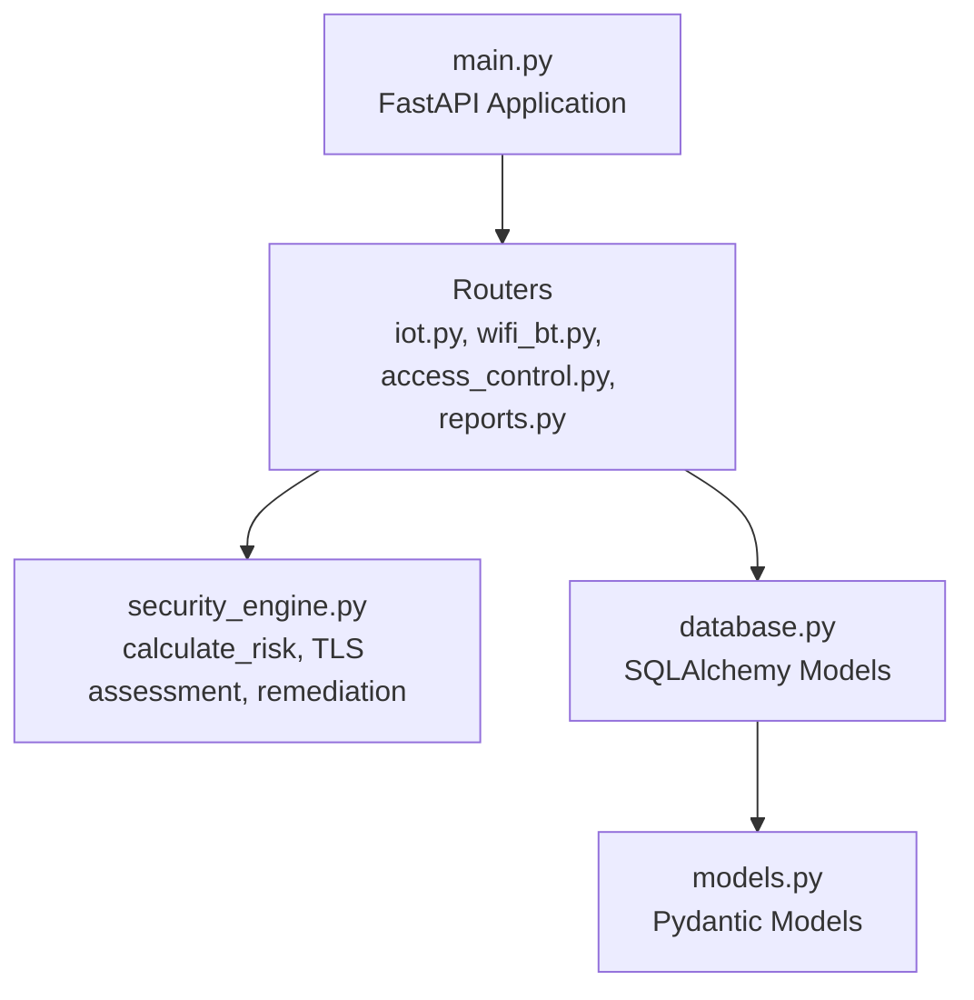
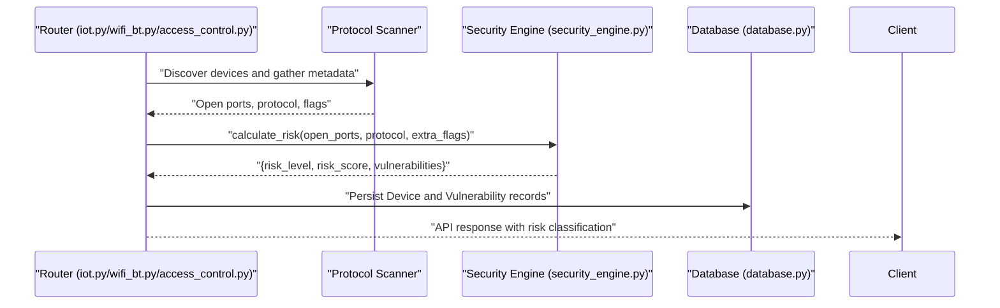
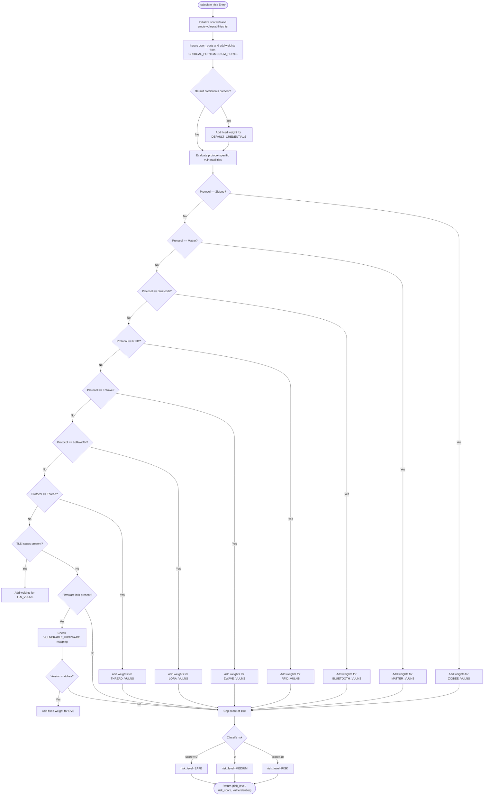
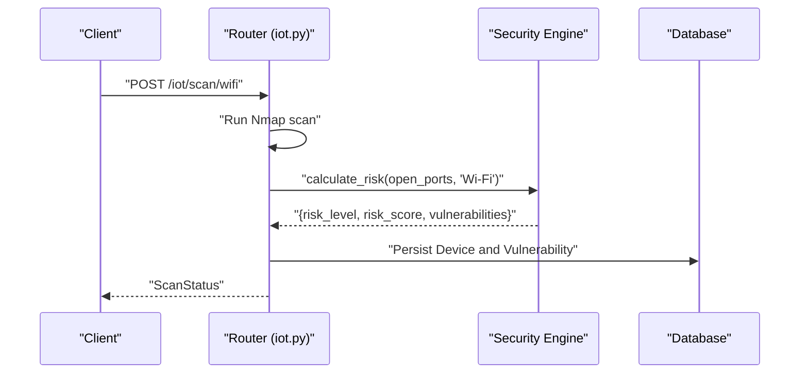
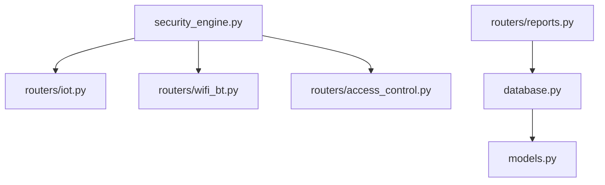

# Core Security Analysis Engine

<cite>
**Referenced Files in This Document**
- [security_engine.py](file://backend/security_engine.py)
- [iot.py](file://backend/routers/iot.py)
- [wifi_bt.py](file://backend/routers/wifi_bt.py)
- [access_control.py](file://backend/routers/access_control.py)
- [reports.py](file://backend/routers/reports.py)
- [main.py](file://backend/main.py)
- [models.py](file://backend/models.py)
- [database.py](file://backend/database.py)
</cite>

## Table of Contents
1. [Introduction](#introduction)
2. [Project Structure](#project-structure)
3. [Core Components](#core-components)
4. [Architecture Overview](#architecture-overview)
5. [Detailed Component Analysis](#detailed-component-analysis)
6. [Dependency Analysis](#dependency-analysis)
7. [Performance Considerations](#performance-considerations)
8. [Troubleshooting Guide](#troubleshooting-guide)
9. [Conclusion](#conclusion)
10. [Appendices](#appendices)

## Introduction
This document provides comprehensive documentation for the core security analysis engine implemented in the security_engine.py module. It explains the calculate_risk function, the vulnerability scoring algorithms, protocol-specific security assessments across eight IoT protocols (Wi-Fi, Bluetooth, Zigbee, Thread, Matter, Z-Wave, LoRaWAN, RFID), and the integration patterns with the main application. It also covers TLS/SSL security assessment functions, remediation advice generation, and practical examples of security assessment workflows and vulnerability scoring calculations.

## Project Structure
The security analysis engine is a standalone module that is integrated into the backend routers to evaluate IoT devices and wireless endpoints. The main application initializes the database and routes requests to protocol-specific scanners, which then invoke the security engine to compute risk scores and classify devices.

**Diagram sources**
- [main.py:1-106](file://backend/main.py#L1-L106)
- [iot.py:1-880](file://backend/routers/iot.py#L1-L880)
- [wifi_bt.py:1-766](file://backend/routers/wifi_bt.py#L1-L766)
- [access_control.py:1-95](file://backend/routers/access_control.py#L1-L95)
- [reports.py:1-158](file://backend/routers/reports.py#L1-L158)
- [security_engine.py:1-425](file://backend/security_engine.py#L1-L425)
- [database.py:1-80](file://backend/database.py#L1-L80)
- [models.py:1-71](file://backend/models.py#L1-L71)

**Section sources**
- [main.py:1-106](file://backend/main.py#L1-L106)
- [security_engine.py:1-425](file://backend/security_engine.py#L1-L425)

## Core Components
- Vulnerability databases and mappings:
  - TCP port risk mappings: CRITICAL_PORTS and MEDIUM_PORTS define risk weights for open ports.
  - Default credentials: DEFAULT_CREDENTIALS enumerates common default username/password pairs.
  - Firmware vulnerability database: VULNERABLE_FIRMWARE maps device types to known vulnerable firmware versions and associated CVEs.
  - Protocol-specific vulnerability mappings:
    - ZIGBEE_VULNS
    - MATTER_VULNS
    - BLUETOOTH_VULNS
    - RFID_VULNS
    - ZWAVE_VULNS
    - LORA_VULNS
    - THREAD_VULNS
    - TLS_VULNS
- Risk calculation function:
  - calculate_risk(open_ports, protocol, extra_flags) computes a normalized risk score and classifies the device as SAFE, MEDIUM, or RISK.
- TLS/SSL assessment:
  - assess_tls_security(hostname, port) validates TLS/SSL configuration and returns a list of identified issues.
- Remediation advice:
  - get_remediation(vuln_type) provides actionable remediation guidance for each vulnerability type.

**Section sources**
- [security_engine.py:18-425](file://backend/security_engine.py#L18-L425)

## Architecture Overview
The security engine is invoked by protocol-specific routers to evaluate discovered devices. The routers collect open ports, protocol metadata, and protocol-specific flags, then call calculate_risk to produce risk scores and vulnerability records. These results are persisted to the database and exposed via the API.

**Diagram sources**
- [iot.py:300-413](file://backend/routers/iot.py#L300-L413)
- [wifi_bt.py:65-167](file://backend/routers/wifi_bt.py#L65-L167)
- [access_control.py:47-84](file://backend/routers/access_control.py#L47-L84)
- [security_engine.py:202-339](file://backend/security_engine.py#L202-L339)
- [database.py:12-55](file://backend/database.py#L12-L55)

## Detailed Component Analysis

### Risk Calculation Algorithm
The calculate_risk function aggregates risk contributions from:
- Open TCP ports mapped to CRITICAL_PORTS and MEDIUM_PORTS with severity-based weights.
- Default credentials if present.
- Protocol-specific vulnerabilities (Zigbee, Matter, Bluetooth, RFID, Z-Wave, LoRaWAN, Thread).
- TLS/SSL issues if present.
- Firmware CVE matches if firmware_info is provided.

Scoring and classification:
- The score is capped at 100.
- Thresholds:
  - SAFE: score equals 0
  - MEDIUM: score greater than 0 and less than or equal to 40
  - RISK: score greater than 40

**Diagram sources**
- [security_engine.py:202-339](file://backend/security_engine.py#L202-L339)

**Section sources**
- [security_engine.py:202-339](file://backend/security_engine.py#L202-L339)

### Vulnerability Databases and Mappings
- CRITICAL_PORTS and MEDIUM_PORTS:
  - Define risk weights for open TCP ports categorized as CRITICAL, HIGH, MEDIUM, or LOW.
- DEFAULT_CREDENTIALS:
  - Enumerates common default username/password pairs used for credential testing.
- VULNERABLE_FIRMWARE:
  - Maps device types to known vulnerable firmware versions and associated CVEs.
- Protocol-specific mappings:
  - ZIGBEE_VULNS, MATTER_VULNS, BLUETOOTH_VULNS, RFID_VULNS, ZWAVE_VULNS, LORA_VULNS, THREAD_VULNS.
- TLS_VULNS:
  - Maps TLS/SSL issues to severity and descriptions.

These mappings are used by calculate_risk to add weighted vulnerability contributions based on protocol and flags.

**Section sources**
- [security_engine.py:18-199](file://backend/security_engine.py#L18-L199)

### TLS/SSL Security Assessment
The assess_tls_security function performs live TLS/SSL checks against a host:
- Validates protocol version (disables SSLv3, TLS 1.0, and TLS 1.1).
- Checks certificate expiration and self-signed certificates.
- Returns a list of TLS vulnerability identifiers used by calculate_risk.

Integration points:
- The wireless router’s TLS checker endpoint invokes calculate_risk with tls_issues to update device risk.

**Section sources**
- [security_engine.py:342-389](file://backend/security_engine.py#L342-L389)
- [wifi_bt.py:447-549](file://backend/routers/wifi_bt.py#L447-L549)

### Remediation Advice Generation
The get_remediation function provides protocol-agnostic remediation guidance for each vulnerability type, covering:
- Network services (Telnet, FTP, TFTP, SMB, RDP, VNC, HTTP, RTSP, MQTT, CoAP).
- Protocol-specific issues (Zigbee, Matter, Bluetooth, RFID, Z-Wave, LoRaWAN, Thread).
- TLS/SSL weaknesses (SSLv3, TLS 1.0, expired certificates, self-signed certificates).

**Section sources**
- [security_engine.py:392-424](file://backend/security_engine.py#L392-L424)

### Integration Patterns with the Main Application
- Wi-Fi scanning:
  - The IoT router runs an Nmap scan, collects open ports, and calls calculate_risk to classify devices.
- Matter/Zigbee/Thread/Z-Wave/LoRaWAN scanning:
  - Routers simulate or perform hardware-based discovery and call calculate_risk with protocol-specific flags.
- Wireless credential testing:
  - The wireless router tests default credentials and updates risk accordingly.
- TLS/SSL validation:
  - The wireless router validates TLS/SSL and updates risk with tls_issues.
- RFID access control:
  - The access control router simulates or reads RFID cards and evaluates risk for RFID-specific vulnerabilities.
- Reporting:
  - The reports router generates summaries and detailed vulnerability reports using risk classifications and remediation guidance.

**Diagram sources**
- [iot.py:291-413](file://backend/routers/iot.py#L291-L413)
- [security_engine.py:202-339](file://backend/security_engine.py#L202-L339)
- [database.py:12-55](file://backend/database.py#L12-L55)

**Section sources**
- [iot.py:291-413](file://backend/routers/iot.py#L291-L413)
- [wifi_bt.py:59-176](file://backend/routers/wifi_bt.py#L59-L176)
- [access_control.py:47-84](file://backend/routers/access_control.py#L47-L84)
- [reports.py:18-157](file://backend/routers/reports.py#L18-L157)

## Dependency Analysis
The security engine is a pure Python module with no external dependencies beyond standard libraries. It is imported and used by routers to evaluate risk and by the reporting module to generate insights.

**Diagram sources**
- [security_engine.py:20-25](file://backend/security_engine.py#L20-L25)
- [iot.py:20-25](file://backend/routers/iot.py#L20-L25)
- [wifi_bt.py:23-26](file://backend/routers/wifi_bt.py#L23-L26)
- [access_control.py:9-12](file://backend/routers/access_control.py#L9-L12)
- [reports.py:12-14](file://backend/routers/reports.py#L12-L14)
- [database.py:12-55](file://backend/database.py#L12-L55)
- [models.py:6-34](file://backend/models.py#L6-L34)

**Section sources**
- [security_engine.py:12-14](file://backend/security_engine.py#L12-L14)
- [iot.py:20-25](file://backend/routers/iot.py#L20-L25)
- [wifi_bt.py:23-26](file://backend/routers/wifi_bt.py#L23-L26)
- [access_control.py:9-12](file://backend/routers/access_control.py#L9-L12)
- [reports.py:12-14](file://backend/routers/reports.py#L12-L14)
- [database.py:12-55](file://backend/database.py#L12-L55)
- [models.py:6-34](file://backend/models.py#L6-L34)

## Performance Considerations
- Risk calculation complexity:
  - Linear in the number of open ports and protocol-specific flags.
  - Vulnerability mapping lookups are constant-time dictionary operations.
- Scoring normalization:
  - The score is capped at 100 to prevent unbounded growth.
- Database writes:
  - Risk updates and vulnerability inserts occur per device; batching could reduce overhead in bulk operations.
- TLS assessment:
  - Live certificate validation adds latency; consider caching results for repeated checks.

[No sources needed since this section provides general guidance]

## Troubleshooting Guide
Common issues and resolutions:
- Missing hardware support:
  - Zigbee/Thread scanning requires specific dongles and libraries; fallback to simulated scans is handled by routers.
- TLS validation failures:
  - Network connectivity or certificate errors are caught and logged; verify host reachability and certificate chain.
- Credential testing timeouts:
  - Default credential tests use short timeouts; adjust router timeouts or retry logic if needed.
- Risk classification anomalies:
  - Review extra_flags passed to calculate_risk and ensure protocol-specific mappings align with device behavior.

**Section sources**
- [iot.py:483-586](file://backend/routers/iot.py#L483-L586)
- [wifi_bt.py:65-167](file://backend/routers/wifi_bt.py#L65-L167)
- [security_engine.py:342-389](file://backend/security_engine.py#L342-L389)

## Conclusion
The security engine provides a robust, extensible risk evaluation framework tailored for IoT environments. Its modular design enables protocol-specific assessments, live TLS validation, and actionable remediation guidance. Integration with routers ensures comprehensive coverage across Wi-Fi, Bluetooth, Zigbee, Thread, Matter, Z-Wave, LoRaWAN, and RFID domains, while database persistence and reporting facilitate operational visibility and remediation tracking.

[No sources needed since this section summarizes without analyzing specific files]

## Appendices

### Example Security Assessment Workflows
- Wi-Fi device scan:
  - Run Nmap scan to discover open ports.
  - Call calculate_risk with open_ports and protocol "Wi-Fi".
  - Persist Device and Vulnerability records.
- Matter device discovery:
  - Use mDNS discovery to find devices.
  - Call calculate_risk with protocol "Matter" and open commissioning flag.
- Bluetooth device scan:
  - Discover nearby BLE devices.
  - Evaluate risk flags (e.g., exposed characteristics, no pairing).
- RFID card scan:
  - Simulate or read RFID card UID.
  - Evaluate RFID-specific risk flags.
- TLS/SSL validation:
  - Perform live TLS checks and pass tls_issues to calculate_risk.

**Section sources**
- [iot.py:291-413](file://backend/routers/iot.py#L291-L413)
- [wifi_bt.py:59-176](file://backend/routers/wifi_bt.py#L59-L176)
- [access_control.py:47-84](file://backend/routers/access_control.py#L47-L84)

### Vulnerability Scoring Calculations
- Port-based risk:
  - CRITICAL_PORTS entries contribute higher weights than MEDIUM_PORTS entries.
- Default credentials:
  - Adds a fixed weight indicating high-risk exposure.
- Protocol-specific risks:
  - Flags for each protocol contribute weights based on severity.
- TLS/SSL issues:
  - Issues are mapped to severity and contribute weights accordingly.
- Firmware CVE:
  - Matching firmware versions add a fixed weight and include CVE metadata.

**Section sources**
- [security_engine.py:202-339](file://backend/security_engine.py#L202-L339)