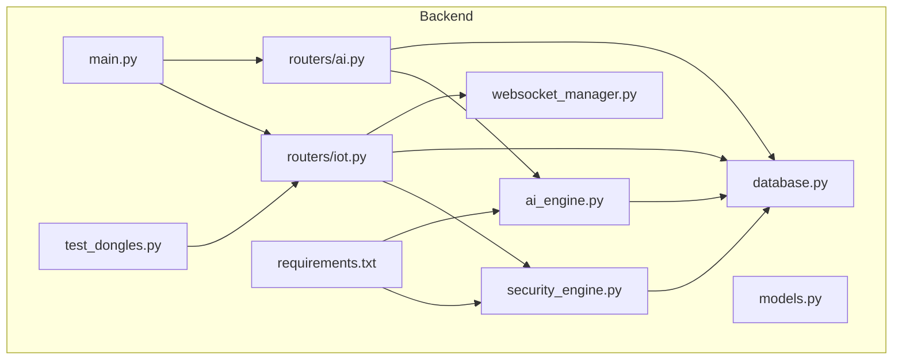
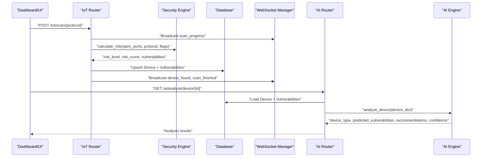
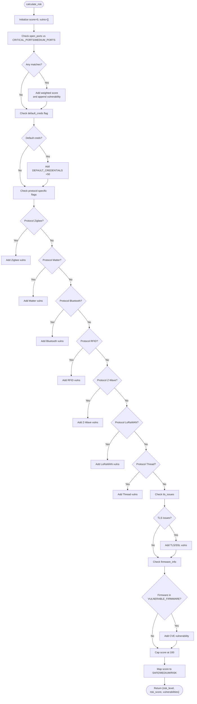
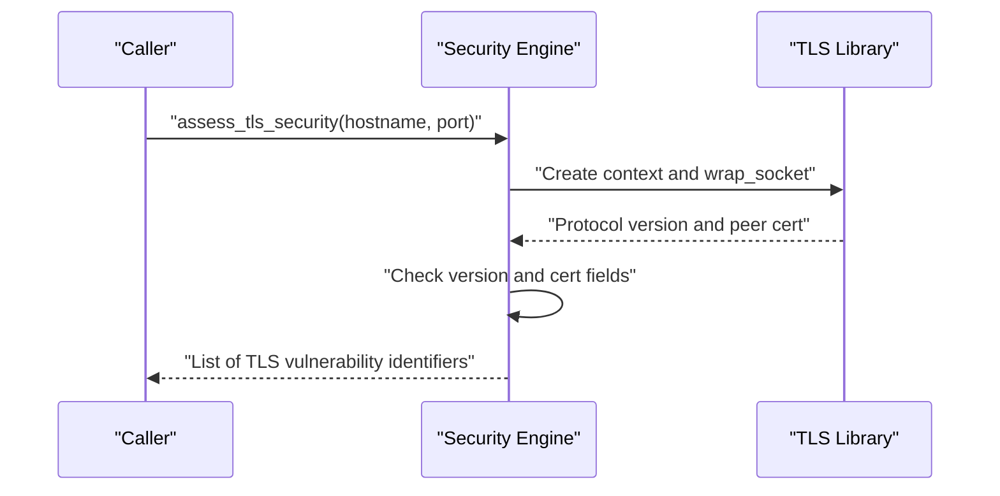
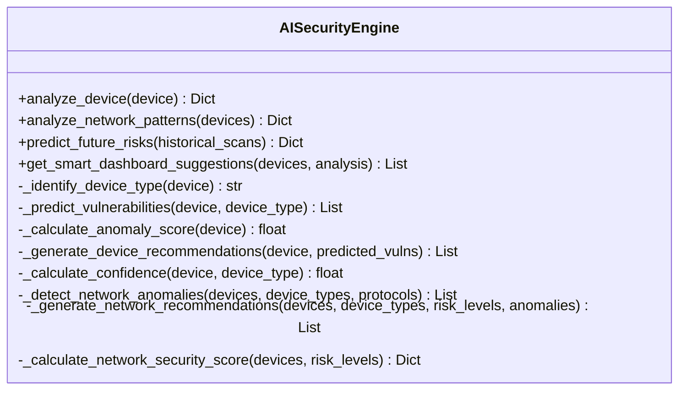
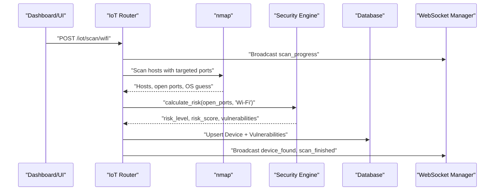
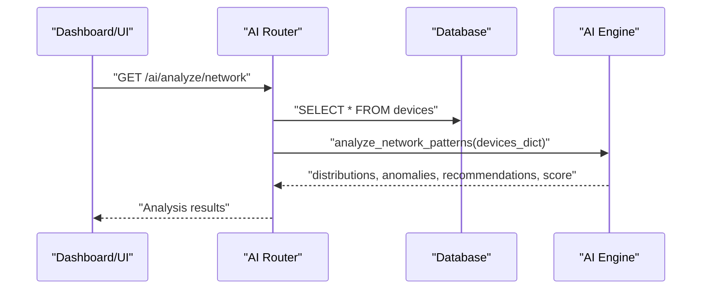
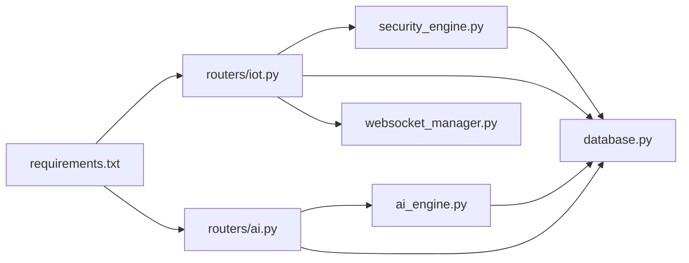

# Security Engine

<cite>
**Referenced Files in This Document**
- [security_engine.py](file://backend/security_engine.py)
- [ai_engine.py](file://backend/ai_engine.py)
- [database.py](file://backend/database.py)
- [models.py](file://backend/models.py)
- [main.py](file://backend/main.py)
- [routers/iot.py](file://backend/routers/iot.py)
- [routers/ai.py](file://backend/routers/ai.py)
- [websocket_manager.py](file://backend/websocket_manager.py)
- [test_dongles.py](file://backend/test_dongles.py)
- [requirements.txt](file://backend/requirements.txt)
</cite>

## Table of Contents
1. [Introduction](#introduction)
2. [Project Structure](#project-structure)
3. [Core Components](#core-components)
4. [Architecture Overview](#architecture-overview)
5. [Detailed Component Analysis](#detailed-component-analysis)
6. [Dependency Analysis](#dependency-analysis)
7. [Performance Considerations](#performance-considerations)
8. [Troubleshooting Guide](#troubleshooting-guide)
9. [Conclusion](#conclusion)
10. [Appendices](#appendices)

## Introduction
This document explains PentexOne’s security analysis engines, focusing on:
- The security_engine.py implementation: risk calculation algorithms, vulnerability mapping across 8+ IoT protocols, and protocol-specific security assessment logic
- The AI security engine in ai_engine.py: pattern recognition, anomaly detection, predictive analysis, and recommendation generation
- Integration between security analysis and AI-powered insights
- Vulnerability database integration, default credential testing mechanisms, TLS/SSL validation processes, and firmware vulnerability checking
- Performance considerations, accuracy metrics, and confidence scoring
- Examples of security assessment workflows and threat modeling integration

## Project Structure
The backend is organized around modular routers and engines:
- Security engine: risk scoring and protocol-specific vulnerability mapping
- AI engine: pattern recognition, anomaly detection, and recommendations
- Database models and SQLAlchemy ORM for persistence
- Routers for IoT scanning, AI analysis, and reporting
- WebSocket manager for real-time progress and events
- Hardware detection utilities for dongle verification

**Diagram sources**
- [main.py:14-48](file://backend/main.py#L14-L48)
- [routers/iot.py:20-24](file://backend/routers/iot.py#L20-L24)
- [routers/ai.py:10-18](file://backend/routers/ai.py#L10-L18)
- [security_engine.py:12-15](file://backend/security_engine.py#L12-L15)
- [ai_engine.py:15-21](file://backend/ai_engine.py#L15-L21)
- [database.py:1-9](file://backend/database.py#L1-L9)
- [websocket_manager.py:7-47](file://backend/websocket_manager.py#L7-L47)
- [test_dongles.py:14-132](file://backend/test_dongles.py#L14-L132)
- [requirements.txt:1-21](file://backend/requirements.txt#L1-L21)

**Section sources**
- [main.py:14-48](file://backend/main.py#L14-L48)
- [requirements.txt:1-21](file://backend/requirements.txt#L1-L21)

## Core Components
- Security Engine (security_engine.py)
  - Risk calculation from open ports, default credentials, firmware CVEs, TLS/SSL issues, and protocol-specific vulnerabilities
  - Protocol-specific vulnerability sets for Zigbee, Matter, Bluetooth, RFID, Z-Wave, LoRaWAN, and Thread
  - TLS/SSL validation logic for protocol version, certificate expiration, self-signed certs, and cipher suite checks
  - Remediation mapping for actionable fixes
- AI Engine (ai_engine.py)
  - Device pattern recognition across IoT categories (cameras, routers, smart home, industrial, medical)
  - Anomaly detection and confidence scoring
  - Network-wide analysis, risk trend prediction, and dashboard suggestions
  - Remediation knowledge base with prioritized steps
- Database and Models (database.py, models.py)
  - ORM models for devices, vulnerabilities, RFID cards, and settings
  - SQLite-backed persistence with initialization and default settings
- Routers (routers/iot.py, routers/ai.py)
  - IoT scanning across Wi-Fi, Matter, Zigbee, Thread, Z-Wave, LoRaWAN with real/hardware fallback
  - AI analysis endpoints for single device, network-wide analysis, remediation guides, and security score
  - WebSocket broadcasting for scan progress and events
- Websocket Manager (websocket_manager.py)
  - Thread-safe broadcast for real-time UI updates
- Hardware Detection (test_dongles.py)
  - Utility to detect and report connected dongles for Zigbee, Thread/Matter, Z-Wave, and Bluetooth

**Section sources**
- [security_engine.py:16-424](file://backend/security_engine.py#L16-L424)
- [ai_engine.py:236-766](file://backend/ai_engine.py#L236-L766)
- [database.py:12-79](file://backend/database.py#L12-L79)
- [models.py:6-71](file://backend/models.py#L6-L71)
- [routers/iot.py:20-880](file://backend/routers/iot.py#L20-L880)
- [routers/ai.py:10-330](file://backend/routers/ai.py#L10-L330)
- [websocket_manager.py:7-47](file://backend/websocket_manager.py#L7-L47)
- [test_dongles.py:14-132](file://backend/test_dongles.py#L14-L132)

## Architecture Overview
The system integrates passive and active scanning with AI-driven insights:
- IoT routers orchestrate scans across protocols, persist results, and trigger security engine calculations
- AI router consumes persisted device data to classify, predict, and recommend remediation
- WebSocket manager broadcasts live scan progress and device discoveries
- Database stores devices, vulnerabilities, RFID cards, and settings

**Diagram sources**
- [routers/iot.py:291-413](file://backend/routers/iot.py#L291-L413)
- [security_engine.py:202-339](file://backend/security_engine.py#L202-L339)
- [database.py:12-42](file://backend/database.py#L12-L42)
- [websocket_manager.py:21-45](file://backend/websocket_manager.py#L21-L45)
- [routers/ai.py:26-64](file://backend/routers/ai.py#L26-L64)
- [ai_engine.py:247-275](file://backend/ai_engine.py#L247-L275)

## Detailed Component Analysis

### Security Engine: Risk Calculation and Protocol Mapping
- Risk calculation algorithm
  - Aggregates weighted scores from critical/medium ports, default credentials, protocol-specific vulnerabilities, TLS/SSL issues, and firmware CVEs
  - Caps risk score at 100 and maps to SAFE/MEDIUM/RISK
- Vulnerability mapping across 8+ IoT protocols
  - TCP port mappings for critical/medium/high severity
  - Default credentials list for common IoT vendors and device families
  - Protocol-specific vulnerability sets:
    - Zigbee: default keys, no encryption, replay attacks
    - Matter: open commissioning, expired DAC, missing passcode
    - Bluetooth: no pairing, weak auth, exposed characteristics
    - RFID: default keys, cloneability, legacy crypto, no mutual auth, Desweet attack
    - Z-Wave: no encryption, inclusion vulnerability, replay, network key exposure
    - LoRaWAN: ABF confirmation, weak DevNonce, no ADR limits, join-request flood
    - Thread: no commissioner auth, active commissioner, weak network key, border router exposure
- TLS/SSL validation
  - Protocol version checks (SSLv3, TLS 1.0, TLS 1.1)
  - Certificate checks (expiration, self-signed)
  - Remediation mapping for each vulnerability type
- Firmware vulnerability checking
  - Device-type-to-version mapping with associated CVEs and severities
- Remediation mapping
  - Actionable steps for each vulnerability type

**Diagram sources**
- [security_engine.py:202-339](file://backend/security_engine.py#L202-L339)

**Section sources**
- [security_engine.py:16-424](file://backend/security_engine.py#L16-L424)

### TLS/SSL Validation Logic
- Validates protocol versions and certificates
- Detects SSLv3, TLS 1.0, TLS 1.1 deprecations
- Identifies expired or self-signed certificates
- Returns a list of vulnerability identifiers for downstream risk calculation

**Diagram sources**
- [security_engine.py:342-389](file://backend/security_engine.py#L342-L389)

**Section sources**
- [security_engine.py:342-389](file://backend/security_engine.py#L342-L389)

### AI Engine: Pattern Recognition, Anomaly Detection, Predictive Analysis
- Device classification
  - Keyword-based and port-based pattern matching for cameras, routers, smart home, industrial, and medical devices
  - Risk factor weights per pattern guide predictions
- Anomaly detection
  - Scores deviations from normal patterns (unusual ports, unknown vendor, high risk score)
- Predictive analysis
  - Trend analysis of risk counts across recent scans to predict escalations
- Recommendations
  - Prioritized remediation steps mapped to vulnerability types
- Network-wide analysis
  - Distribution of device types, protocols, risk levels, and vendor composition
  - Anomaly detection at the network level (high-risk ratio, unencrypted protocols, unknown devices)
  - Security score calculation (weighted average of risk levels)
- Confidence scoring
  - Adjusts confidence based on known device type, vendor, open ports, and protocol presence

**Diagram sources**
- [ai_engine.py:236-740](file://backend/ai_engine.py#L236-L740)

**Section sources**
- [ai_engine.py:236-766](file://backend/ai_engine.py#L236-L766)

### IoT Scanning and Integration with Security Engine
- Wi-Fi scanning with nmap
  - Discovers hosts, open ports, OS guess, and persists results
  - Calls security engine to compute risk and vulnerabilities
- Protocol-specific scans
  - Matter: mDNS discovery via Zeroconf
  - Zigbee: real sniffing with KillerBee or simulated discovery
  - Thread/Matter: real hardware via nRF52840 or simulated discovery
  - Z-Wave: simulated discovery with serial probing
  - LoRaWAN: simulated discovery with protocol-specific flags
- Real-time updates
  - WebSocket broadcasts device_found and scan_progress events
- Hardware detection
  - Utility to detect dongles and verify KillerBee availability

**Diagram sources**
- [routers/iot.py:291-413](file://backend/routers/iot.py#L291-L413)
- [security_engine.py:202-339](file://backend/security_engine.py#L202-L339)
- [websocket_manager.py:21-45](file://backend/websocket_manager.py#L21-L45)

**Section sources**
- [routers/iot.py:291-880](file://backend/routers/iot.py#L291-L880)
- [test_dongles.py:14-132](file://backend/test_dongles.py#L14-L132)

### AI Analysis Endpoints and Integration
- Single device analysis
  - Loads device and vulnerabilities from DB, runs AI analysis, returns predictions and recommendations
- Network-wide analysis
  - Counts distributions, detects anomalies, generates recommendations, and computes network security score
- Remediation guides
  - Returns detailed steps for a specific vulnerability type
- Security score endpoint
  - Computes weighted score across risk levels and suggests improvements

**Diagram sources**
- [routers/ai.py:70-100](file://backend/routers/ai.py#L70-L100)
- [ai_engine.py:464-513](file://backend/ai_engine.py#L464-L513)

**Section sources**
- [routers/ai.py:26-330](file://backend/routers/ai.py#L26-L330)
- [ai_engine.py:236-766](file://backend/ai_engine.py#L236-L766)

## Dependency Analysis
- External libraries
  - FastAPI, Uvicorn, WebSockets for API and real-time
  - python-nmap for Wi-Fi scanning
  - zeroconf for Matter discovery
  - bleak for Bluetooth scanning
  - pyserial for dongle communication
  - cryptography for TLS certificate parsing
  - SQLAlchemy for ORM and SQLite
  - Optional KillerBee for Zigbee sniffing
- Internal dependencies
  - IoT router depends on security_engine.calculate_risk
  - AI router depends on ai_engine.AISecurityEngine and database models
  - WebSocket manager is shared across routers for broadcast events

**Diagram sources**
- [requirements.txt:1-21](file://backend/requirements.txt#L1-L21)
- [routers/iot.py:20-24](file://backend/routers/iot.py#L20-L24)
- [routers/ai.py:10-18](file://backend/routers/ai.py#L10-L18)
- [security_engine.py:12-15](file://backend/security_engine.py#L12-L15)
- [ai_engine.py:15-21](file://backend/ai_engine.py#L15-L21)

**Section sources**
- [requirements.txt:1-21](file://backend/requirements.txt#L1-L21)
- [routers/iot.py:20-24](file://backend/routers/iot.py#L20-L24)
- [routers/ai.py:10-18](file://backend/routers/ai.py#L10-L18)

## Performance Considerations
- Scanning performance
  - Wi-Fi scan uses targeted ports (-p) and service version detection (-sV) to balance speed and insight
  - Background tasks prevent blocking the main event loop; WebSocket broadcasts provide progress updates
- Risk calculation
  - O(n) over open ports and protocol-specific checks; bounded by small fixed-size maps
  - Early exits for missing flags reduce overhead
- AI analysis
  - Pattern matching and anomaly detection are lightweight dictionary lookups and arithmetic
  - Network-wide analysis scales linearly with device count
- Database writes
  - Batched upserts and deletions of vulnerabilities per device minimize transaction overhead
- TLS validation
  - Short timeouts and minimal socket operations; exceptions are handled gracefully

[No sources needed since this section provides general guidance]

## Troubleshooting Guide
- Hardware detection
  - Use the dongle test utility to verify connected dongles and KillerBee availability
- Scanning issues
  - Ensure nmap and protocol-specific tools are installed; verify permissions for serial/dongle access
  - Check WebSocket connectivity for real-time progress
- TLS validation failures
  - Confirm target host exposes a TLS endpoint; verify DNS resolution and firewall rules
- Database initialization
  - On startup, tables are created and default settings initialized if missing

**Section sources**
- [test_dongles.py:134-152](file://backend/test_dongles.py#L134-L152)
- [routers/iot.py:291-413](file://backend/routers/iot.py#L291-L413)
- [websocket_manager.py:21-45](file://backend/websocket_manager.py#L21-L45)
- [security_engine.py:342-389](file://backend/security_engine.py#L342-L389)
- [database.py:69-80](file://backend/database.py#L69-L80)

## Conclusion
PentexOne’s security engines combine deterministic risk scoring with AI-driven pattern recognition and anomaly detection. The security engine provides robust protocol-specific assessments and remediation guidance, while the AI engine offers scalable classification, prediction, and recommendations. Together with real-time scanning and database persistence, the system delivers actionable insights for IoT security postures.

[No sources needed since this section summarizes without analyzing specific files]

## Appendices

### Example Workflows and Threat Modeling Integration
- Wi-Fi security assessment
  - Start Wi-Fi scan; receive device discoveries and vulnerabilities; review remediation steps; monitor with AI predictions
- Protocol-specific assessment
  - Run Zigbee/Thread/Z-Wave/LoRaWAN scans; address protocol-specific vulnerabilities; validate TLS for exposed services
- Threat modeling integration
  - Use AI-generated device classifications to model attack surfaces; leverage anomaly detection to identify outliers; apply remediation priorities aligned with risk trends

[No sources needed since this section provides general guidance]