# Backend Architecture

<cite>
**Referenced Files in This Document**
- [main.py](file://backend/main.py)
- [models.py](file://backend/models.py)
- [database.py](file://backend/database.py)
- [websocket_manager.py](file://backend/websocket_manager.py)
- [security_engine.py](file://backend/security_engine.py)
- [ai_engine.py](file://backend/ai_engine.py)
- [routers/iot.py](file://backend/routers/iot.py)
- [routers/wifi_bt.py](file://backend/routers/wifi_bt.py)
- [routers/access_control.py](file://backend/routers/access_control.py)
- [routers/reports.py](file://backend/routers/reports.py)
- [routers/ai.py](file://backend/routers/ai.py)
- [requirements.txt](file://backend/requirements.txt)
- [README.md](file://backend/README.md)
</cite>

## Table of Contents
1. [Introduction](#introduction)
2. [Project Structure](#project-structure)
3. [Core Components](#core-components)
4. [Architecture Overview](#architecture-overview)
5. [Detailed Component Analysis](#detailed-component-analysis)
6. [Dependency Analysis](#dependency-analysis)
7. [Performance Considerations](#performance-considerations)
8. [Troubleshooting Guide](#troubleshooting-guide)
9. [Conclusion](#conclusion)
10. [Appendices](#appendices)

## Introduction
This document describes the backend architecture of PentexOne, a FastAPI-based IoT security auditing platform. It covers the application initialization, middleware configuration, modular router architecture, dependency injection, authentication and session management, routing patterns, WebSocket integration, settings management, and security considerations. The system integrates hardware scanning capabilities for Wi-Fi, Bluetooth, Zigbee, Thread/Matter, Z-Wave, LoRaWAN, and RFID/NFC, with AI-powered analysis and real-time dashboards.

## Project Structure
The backend follows a modular FastAPI structure with dedicated routers for each functional area, a central database module, a WebSocket manager, and shared models and engines for security and AI analysis.

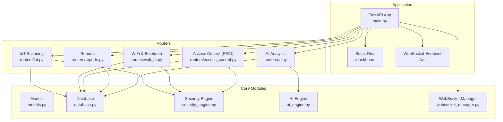

**Diagram sources**
- [main.py:34-106](file://backend/main.py#L34-L106)
- [routers/iot.py:24-880](file://backend/routers/iot.py#L24-L880)
- [routers/wifi_bt.py:27-766](file://backend/routers/wifi_bt.py#L27-L766)
- [routers/access_control.py:13-95](file://backend/routers/access_control.py#L13-L95)
- [routers/reports.py:15-158](file://backend/routers/reports.py#L15-L158)
- [routers/ai.py:20-330](file://backend/routers/ai.py#L20-L330)
- [database.py:1-80](file://backend/database.py#L1-L80)
- [websocket_manager.py:7-48](file://backend/websocket_manager.py#L7-L48)
- [models.py:1-71](file://backend/models.py#L1-L71)
- [security_engine.py:1-425](file://backend/security_engine.py#L1-L425)
- [ai_engine.py:236-766](file://backend/ai_engine.py#L236-L766)

**Section sources**
- [README.md:275-297](file://backend/README.md#L275-L297)
- [main.py:14-48](file://backend/main.py#L14-L48)

## Core Components
- FastAPI Application: Central entry point with CORS, static file mounting, authentication, settings endpoints, and WebSocket endpoint.
- Database Layer: SQLAlchemy ORM with SQLite, including models for devices, vulnerabilities, RFID cards, and settings.
- Security Engine: Risk calculation and vulnerability assessment across protocols.
- AI Engine: Pattern-based AI analysis, anomaly detection, and remediation recommendations.
- WebSocket Manager: Connection lifecycle management and broadcast to clients.
- Modular Routers: Feature-specific endpoints for IoT scanning, Wi-Fi/Bluetooth, access control, reporting, and AI analysis.

**Section sources**
- [main.py:34-106](file://backend/main.py#L34-L106)
- [database.py:12-80](file://backend/database.py#L12-L80)
- [security_engine.py:202-340](file://backend/security_engine.py#L202-L340)
- [ai_engine.py:236-766](file://backend/ai_engine.py#L236-L766)
- [websocket_manager.py:7-48](file://backend/websocket_manager.py#L7-L48)

## Architecture Overview
The system initializes the database, mounts static assets, registers routers, sets up CORS, and exposes endpoints for authentication, settings, device management, and real-time updates via WebSocket. Background tasks coordinate hardware scans and asynchronous operations, while dependency injection ensures consistent database sessions.

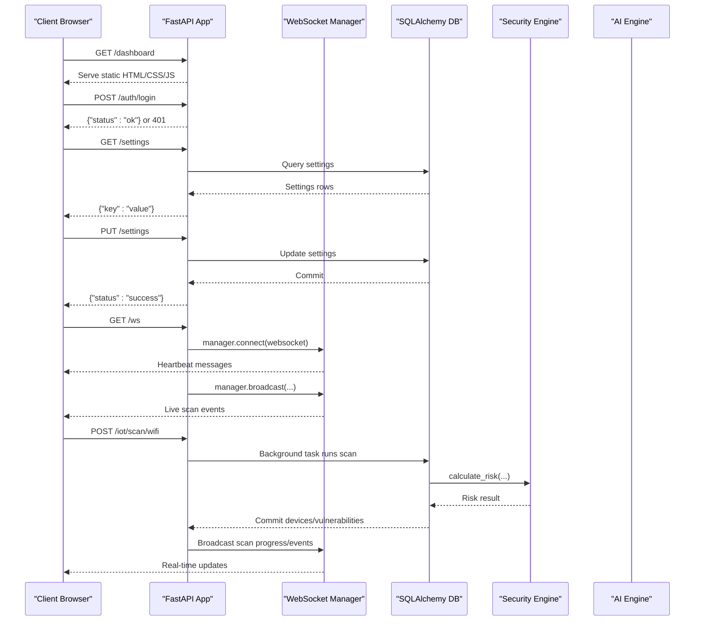

**Diagram sources**
- [main.py:66-102](file://backend/main.py#L66-L102)
- [main.py:50-64](file://backend/main.py#L50-L64)
- [main.py:70-79](file://backend/main.py#L70-L79)
- [routers/iot.py:291-413](file://backend/routers/iot.py#L291-L413)
- [websocket_manager.py:11-45](file://backend/websocket_manager.py#L11-L45)
- [security_engine.py:202-340](file://backend/security_engine.py#L202-L340)

## Detailed Component Analysis

### FastAPI Application Initialization and Middleware
- CORS: Enabled for development with broad allowances.
- Static Files: Mounted under /dashboard to serve the frontend.
- Authentication: Username/password validation with environment-controlled credentials.
- Settings: CRUD endpoints for simulation mode and nmap timeout.
- WebSocket: Heartbeat endpoint with connection management.

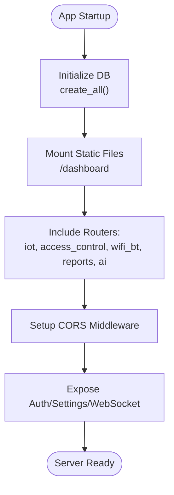

**Diagram sources**
- [main.py:20-21](file://backend/main.py#L20-L21)
- [main.py:66-68](file://backend/main.py#L66-L68)
- [main.py:44-48](file://backend/main.py#L44-L48)
- [main.py:36-42](file://backend/main.py#L36-L42)
- [main.py:70-102](file://backend/main.py#L70-L102)

**Section sources**
- [main.py:10-12](file://backend/main.py#L10-L12)
- [main.py:23-32](file://backend/main.py#L23-L32)
- [main.py:50-64](file://backend/main.py#L50-L64)
- [main.py:66-68](file://backend/main.py#L66-L68)
- [main.py:70-79](file://backend/main.py#L70-L79)
- [main.py:90-102](file://backend/main.py#L90-L102)

### Authentication and Session Management
- Login endpoint validates credentials against environment variables.
- No persistent session storage; authentication is stateless for this endpoint.
- Consider adding JWT or session cookies for production deployments.

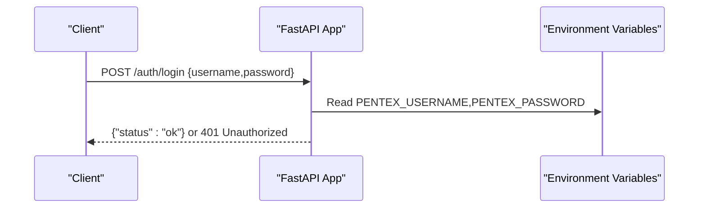

**Diagram sources**
- [main.py:25-27](file://backend/main.py#L25-L27)
- [main.py:70-74](file://backend/main.py#L70-L74)

**Section sources**
- [main.py:25-27](file://backend/main.py#L25-L27)
- [main.py:29-31](file://backend/main.py#L29-L31)
- [main.py:70-74](file://backend/main.py#L70-L74)

### Settings Management and Configuration Persistence
- Settings stored in SQLite table with key/value pairs.
- Initialization ensures default values for simulation mode and nmap timeout.
- Runtime updates via PUT endpoint.

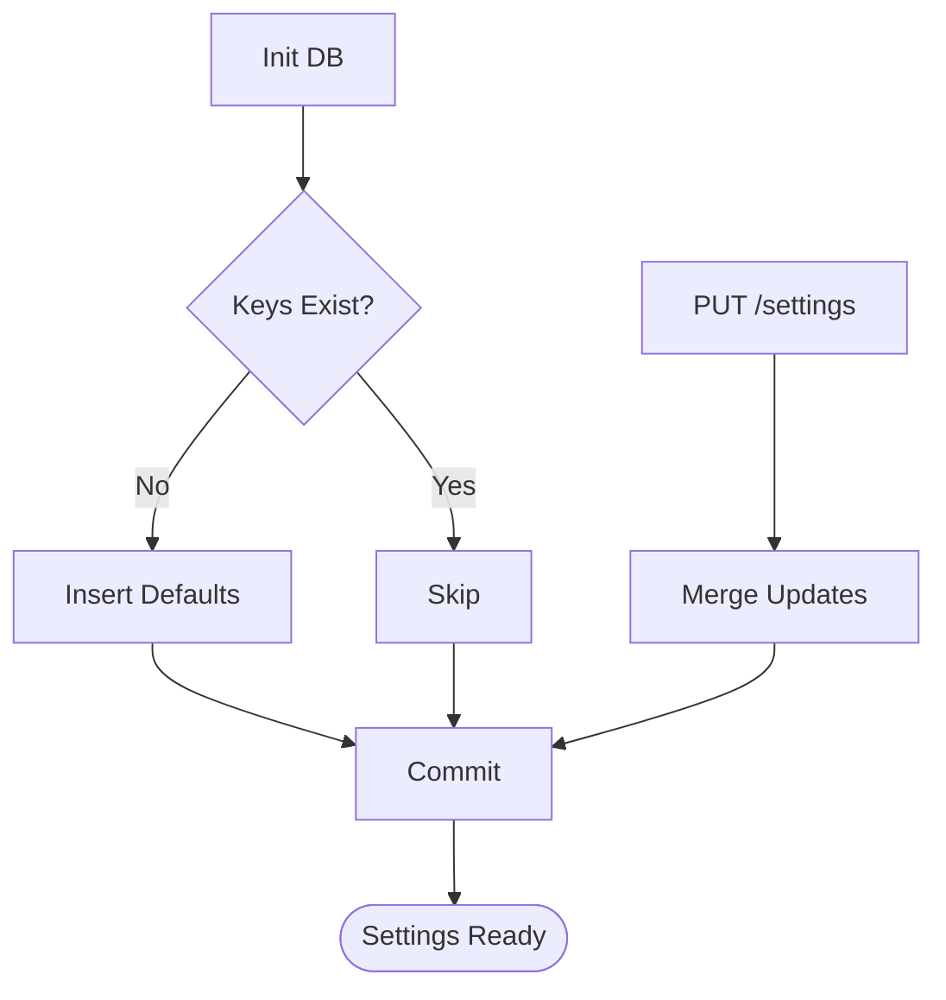

**Diagram sources**
- [database.py:69-80](file://backend/database.py#L69-L80)
- [main.py:50-64](file://backend/main.py#L50-L64)

**Section sources**
- [database.py:56-80](file://backend/database.py#L56-L80)
- [main.py:50-64](file://backend/main.py#L50-L64)

### Database Schema and Models
- Entities: Device, Vulnerability, RFIDCard, Setting.
- Relationships: Device has many Vulnerabilities; foreign key links.
- Pydantic models define request/response shapes for API contracts.

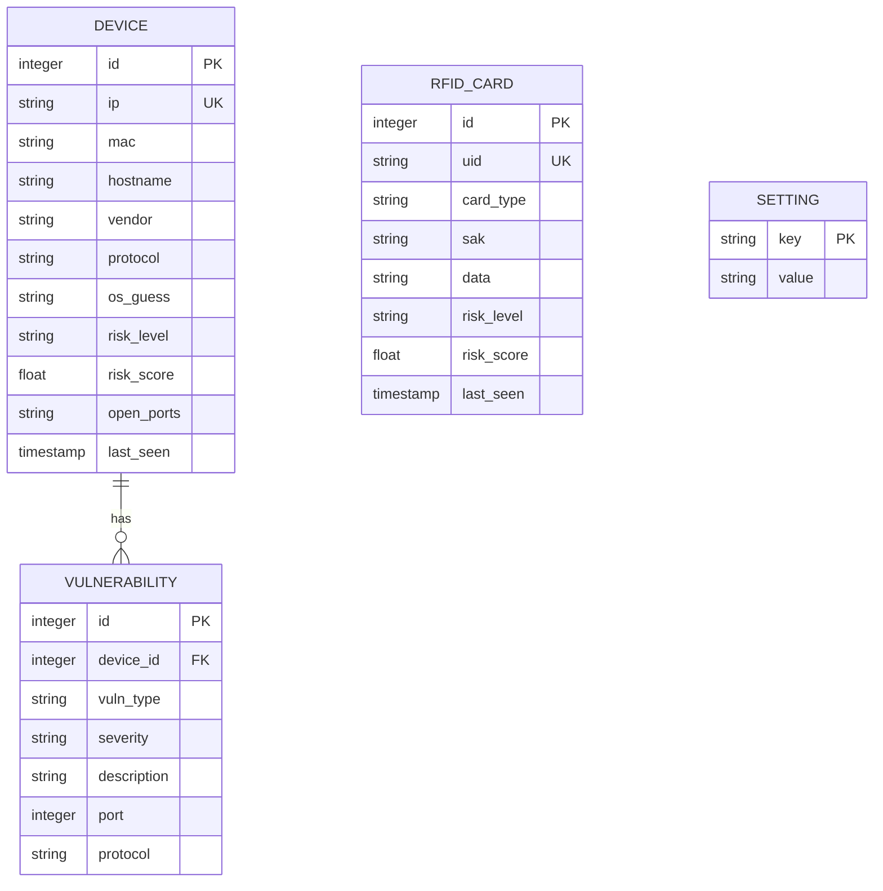

**Diagram sources**
- [database.py:12-61](file://backend/database.py#L12-L61)
- [models.py:6-66](file://backend/models.py#L6-L66)

**Section sources**
- [database.py:12-61](file://backend/database.py#L12-L61)
- [models.py:6-66](file://backend/models.py#L6-L66)

### IoT Scanning Router
- Network discovery across platforms.
- Wi-Fi scanning with Nmap and risk evaluation.
- Matter discovery via mDNS (Zeroconf).
- Zigbee scanning with hardware detection and KillerBee support, fallback to simulated scans.
- Thread/Matter scanning with hardware or simulated paths.
- Z-Wave scanning with serial-based discovery.
- LoRaWAN scanning with simulated devices.
- Device listing, retrieval, and cleanup endpoints.
- Real-time progress via WebSocket broadcasts.

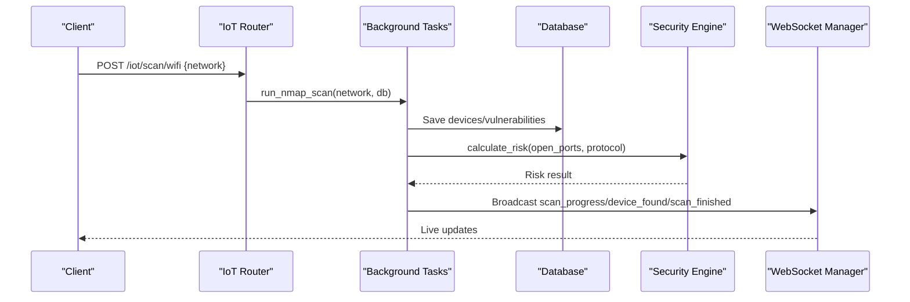

**Diagram sources**
- [routers/iot.py:291-413](file://backend/routers/iot.py#L291-L413)
- [routers/iot.py:483-586](file://backend/routers/iot.py#L483-L586)
- [routers/iot.py:625-722](file://backend/routers/iot.py#L625-L722)
- [routers/iot.py:727-778](file://backend/routers/iot.py#L727-L778)
- [routers/iot.py:783-880](file://backend/routers/iot.py#L783-L880)
- [security_engine.py:202-340](file://backend/security_engine.py#L202-L340)
- [websocket_manager.py:21-45](file://backend/websocket_manager.py#L21-L45)

**Section sources**
- [routers/iot.py:194-284](file://backend/routers/iot.py#L194-L284)
- [routers/iot.py:291-413](file://backend/routers/iot.py#L291-L413)
- [routers/iot.py:418-478](file://backend/routers/iot.py#L418-L478)
- [routers/iot.py:483-586](file://backend/routers/iot.py#L483-L586)
- [routers/iot.py:625-722](file://backend/routers/iot.py#L625-L722)
- [routers/iot.py:727-778](file://backend/routers/iot.py#L727-L778)
- [routers/iot.py:783-880](file://backend/routers/iot.py#L783-L880)

### WiFi & Bluetooth Router
- Interfaces enumeration.
- Port scanning for a target IP.
- Default credential testing via HTTP Basic Auth and Telnet.
- Full device scan combining port and credential checks.
- BLE scanning with optional bleak library.
- SSID discovery across macOS and Linux.
- TLS/SSL certificate validation.
- Deauthentication attack detection with scapy or tcpdump.
- One-click network device discovery.

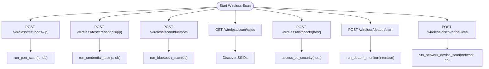

**Diagram sources**
- [routers/wifi_bt.py:59-96](file://backend/routers/wifi_bt.py#L59-L96)
- [routers/wifi_bt.py:101-167](file://backend/routers/wifi_bt.py#L101-L167)
- [routers/wifi_bt.py:182-240](file://backend/routers/wifi_bt.py#L182-L240)
- [routers/wifi_bt.py:245-442](file://backend/routers/wifi_bt.py#L245-L442)
- [routers/wifi_bt.py:447-549](file://backend/routers/wifi_bt.py#L447-L549)
- [routers/wifi_bt.py:555-631](file://backend/routers/wifi_bt.py#L555-L631)
- [routers/wifi_bt.py:636-766](file://backend/routers/wifi_bt.py#L636-L766)
- [security_engine.py:342-389](file://backend/security_engine.py#L342-L389)

**Section sources**
- [routers/wifi_bt.py:39-54](file://backend/routers/wifi_bt.py#L39-L54)
- [routers/wifi_bt.py:59-96](file://backend/routers/wifi_bt.py#L59-L96)
- [routers/wifi_bt.py:101-167](file://backend/routers/wifi_bt.py#L101-L167)
- [routers/wifi_bt.py:182-240](file://backend/routers/wifi_bt.py#L182-L240)
- [routers/wifi_bt.py:245-442](file://backend/routers/wifi_bt.py#L245-L442)
- [routers/wifi_bt.py:447-549](file://backend/routers/wifi_bt.py#L447-L549)
- [routers/wifi_bt.py:555-631](file://backend/routers/wifi_bt.py#L555-L631)
- [routers/wifi_bt.py:636-766](file://backend/routers/wifi_bt.py#L636-L766)

### Access Control (RFID/NFC) Router
- RFID scanning with hardware detection or simulated data.
- Risk calculation based on card type and flags.
- Listing and clearing RFID cards.

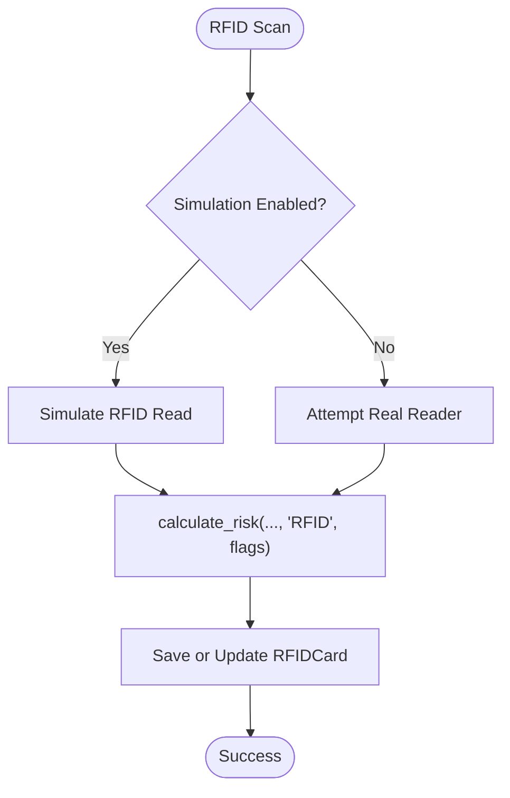

**Diagram sources**
- [routers/access_control.py:47-84](file://backend/routers/access_control.py#L47-L84)
- [security_engine.py:202-340](file://backend/security_engine.py#L202-L340)

**Section sources**
- [routers/access_control.py:15-27](file://backend/routers/access_control.py#L15-L27)
- [routers/access_control.py:29-45](file://backend/routers/access_control.py#L29-L45)
- [routers/access_control.py:47-84](file://backend/routers/access_control.py#L47-L84)

### Reports Router
- Dashboard summary statistics.
- PDF report generation with devices, vulnerabilities, and RFID cards.

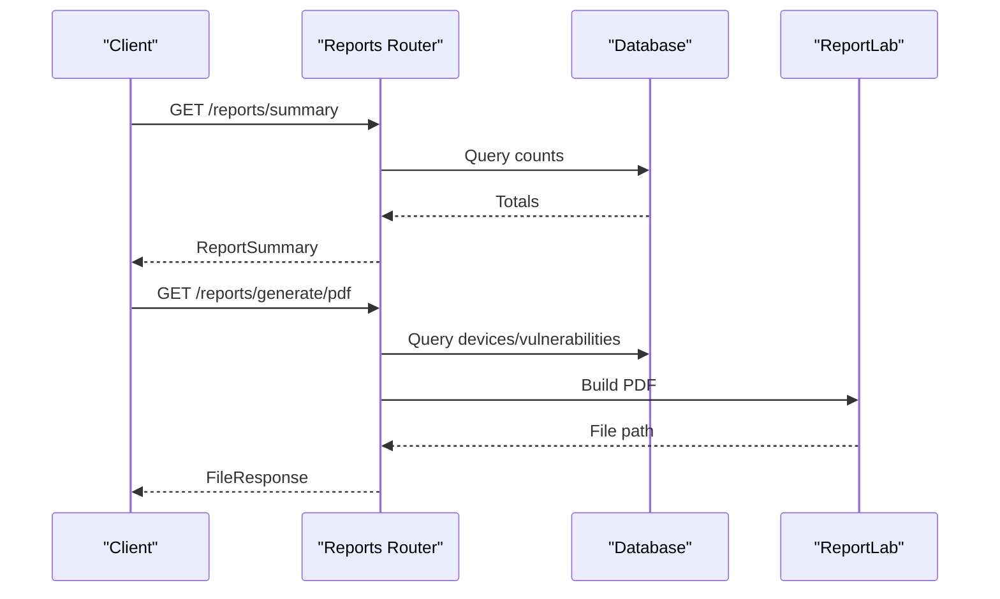

**Diagram sources**
- [routers/reports.py:18-34](file://backend/routers/reports.py#L18-L34)
- [routers/reports.py:37-158](file://backend/routers/reports.py#L37-L158)

**Section sources**
- [routers/reports.py:18-34](file://backend/routers/reports.py#L18-L34)
- [routers/reports.py:37-158](file://backend/routers/reports.py#L37-L158)

### AI Analysis Router
- Single device analysis with pattern matching and predicted vulnerabilities.
- Network-wide analysis and security score calculation.
- Dashboard suggestions and remediation retrieval.

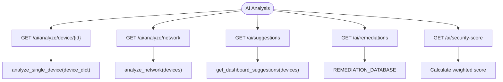

**Diagram sources**
- [routers/ai.py:26-64](file://backend/routers/ai.py#L26-L64)
- [routers/ai.py:70-100](file://backend/routers/ai.py#L70-L100)
- [routers/ai.py:106-138](file://backend/routers/ai.py#L106-L138)
- [routers/ai.py:161-169](file://backend/routers/ai.py#L161-L169)
- [routers/ai.py:270-330](file://backend/routers/ai.py#L270-L330)
- [ai_engine.py:748-766](file://backend/ai_engine.py#L748-L766)

**Section sources**
- [routers/ai.py:26-64](file://backend/routers/ai.py#L26-L64)
- [routers/ai.py:70-100](file://backend/routers/ai.py#L70-L100)
- [routers/ai.py:106-138](file://backend/routers/ai.py#L106-L138)
- [routers/ai.py:161-169](file://backend/routers/ai.py#L161-L169)
- [routers/ai.py:270-330](file://backend/routers/ai.py#L270-L330)
- [ai_engine.py:236-766](file://backend/ai_engine.py#L236-L766)

### WebSocket Manager and Real-Time Communication
- Connection lifecycle: accept, track, broadcast, disconnect.
- Thread-safe broadcasting from background tasks.
- Heartbeat mechanism to keep connections alive.

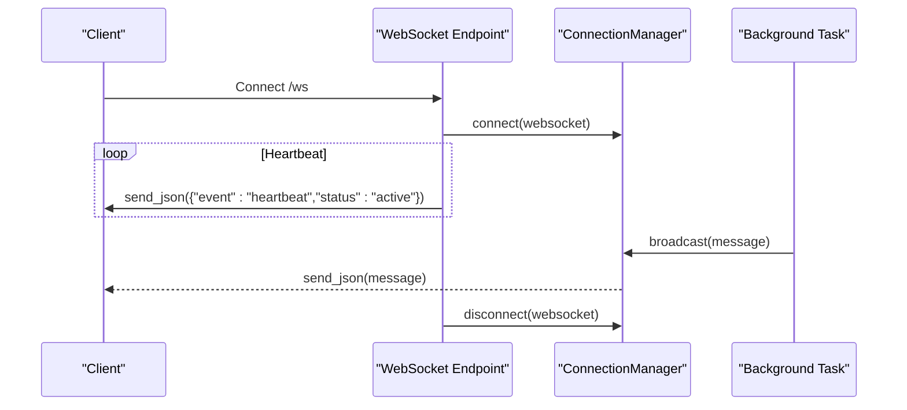

**Diagram sources**
- [main.py:90-102](file://backend/main.py#L90-L102)
- [websocket_manager.py:11-45](file://backend/websocket_manager.py#L11-L45)

**Section sources**
- [websocket_manager.py:7-48](file://backend/websocket_manager.py#L7-L48)
- [main.py:85-102](file://backend/main.py#L85-L102)

### Dependency Injection Patterns
- Database session provider yields a scoped session per request.
- Routers depend on get_db for SQLAlchemy operations.
- Background tasks receive db session to persist results.

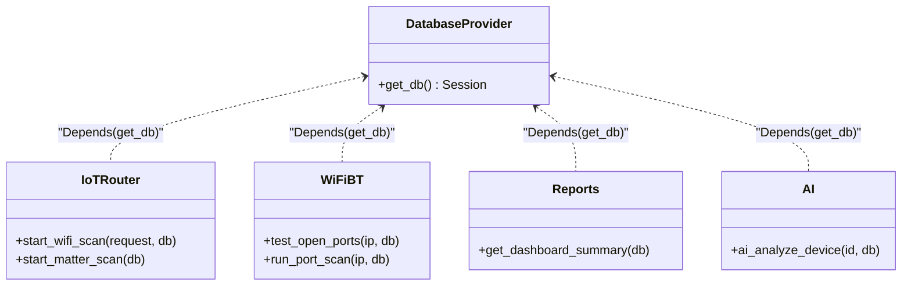

**Diagram sources**
- [database.py:62-67](file://backend/database.py#L62-L67)
- [routers/iot.py:292](file://backend/routers/iot.py#L292)
- [routers/wifi_bt.py:60](file://backend/routers/wifi_bt.py#L60)
- [routers/reports.py:19](file://backend/routers/reports.py#L19)
- [routers/ai.py:27](file://backend/routers/ai.py#L27)

**Section sources**
- [database.py:62-67](file://backend/database.py#L62-L67)
- [routers/iot.py:292](file://backend/routers/iot.py#L292)
- [routers/wifi_bt.py:60](file://backend/routers/wifi_bt.py#L60)
- [routers/reports.py:19](file://backend/routers/reports.py#L19)
- [routers/ai.py:27](file://backend/routers/ai.py#L27)

## Dependency Analysis
External dependencies include FastAPI, Uvicorn, WebSockets, Nmap, Scapy, Zeroconf, ReportLab, SQLAlchemy, BLEAK, PySerial, KillerBee, and cryptography. These enable scanning, protocol support, reporting, and security analysis.

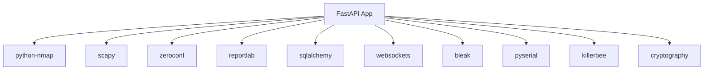

**Diagram sources**
- [requirements.txt:1-21](file://backend/requirements.txt#L1-L21)

**Section sources**
- [requirements.txt:1-21](file://backend/requirements.txt#L1-L21)

## Performance Considerations
- Background tasks offload heavy scanning to prevent blocking requests.
- SQLite is lightweight but may require optimization for large datasets.
- Broadcasting to many WebSocket clients can be resource-intensive; consider rate limiting.
- Hardware scanning depends on external tools and dongles; ensure adequate permissions and timeouts.

[No sources needed since this section provides general guidance]

## Troubleshooting Guide
Common issues and resolutions:
- Cannot access dashboard: verify service status, logs, and port binding.
- USB dongle not detected: check permissions and reboot after adding user to dialout group.
- Bluetooth not working: restart Bluetooth service and unblock devices.

**Section sources**
- [README.md:353-381](file://backend/README.md#L353-L381)

## Conclusion
PentexOne’s backend is a modular, FastAPI-based system integrating hardware scanning, security analysis, AI insights, and real-time dashboards. The architecture emphasizes separation of concerns through routers, robust dependency injection, and a centralized WebSocket manager for live updates. While suitable for development and small deployments, production readiness requires stronger authentication/session management, HTTPS termination, and hardened deployment practices.

[No sources needed since this section summarizes without analyzing specific files]

## Appendices

### Routing Patterns and Request/Response Handling
- Routers use FastAPI decorators to define endpoints with typed request/response models.
- Background tasks coordinate long-running operations and update clients via WebSocket.

**Section sources**
- [routers/iot.py:291-413](file://backend/routers/iot.py#L291-L413)
- [routers/wifi_bt.py:59-96](file://backend/routers/wifi_bt.py#L59-L96)
- [routers/ai.py:26-64](file://backend/routers/ai.py#L26-L64)

### Security Considerations
- Default credentials should be changed; environment variables control login.
- Enable firewall and consider HTTPS in production.
- Limit CORS and headers in production environments.

**Section sources**
- [main.py:25-27](file://backend/main.py#L25-L27)
- [README.md:308-335](file://backend/README.md#L308-L335)