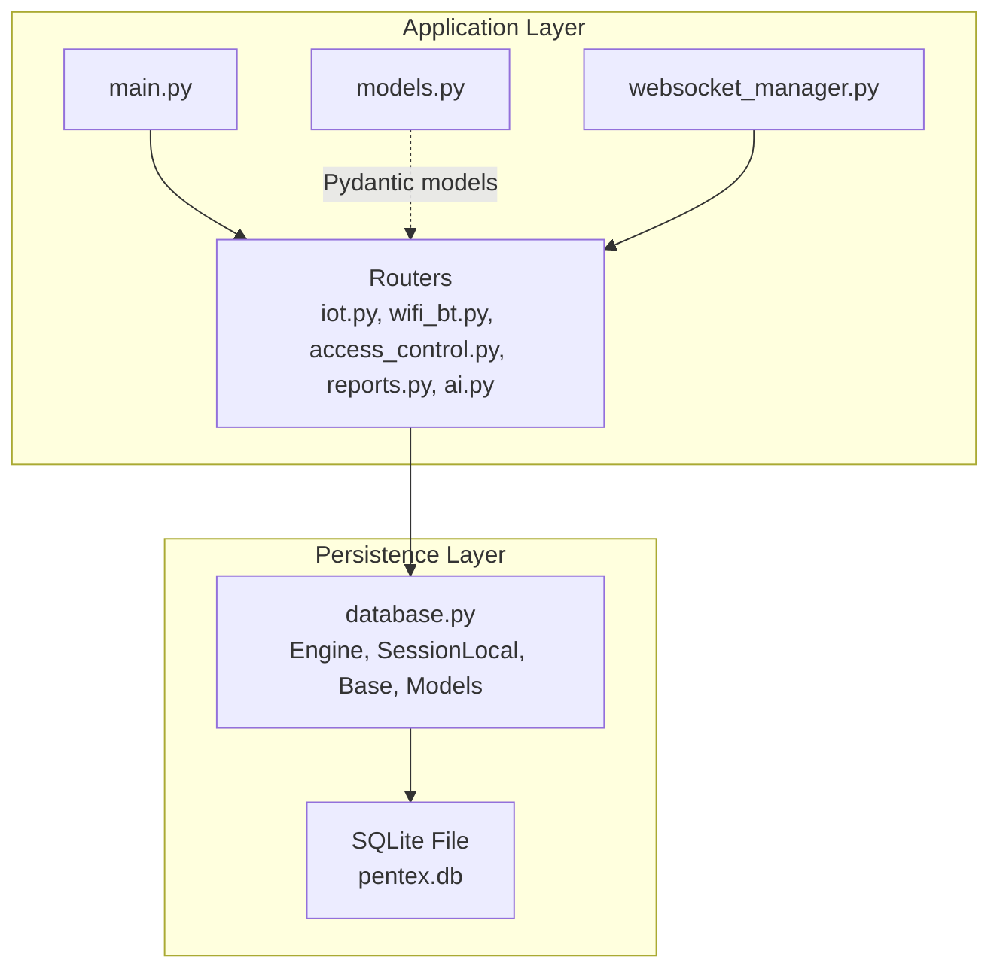
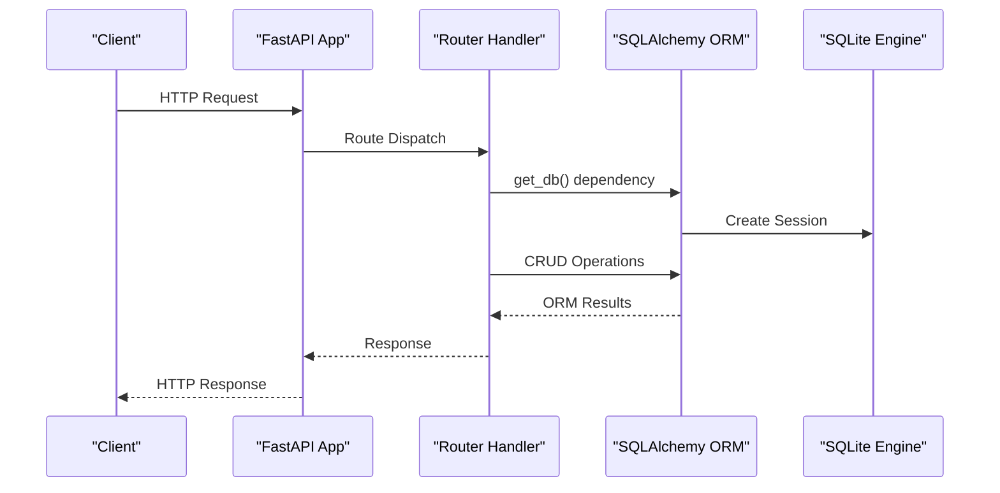
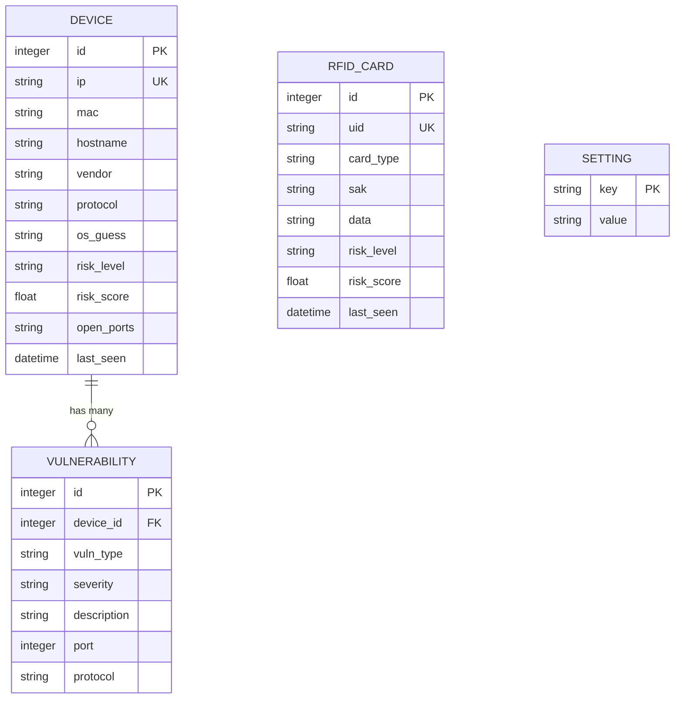
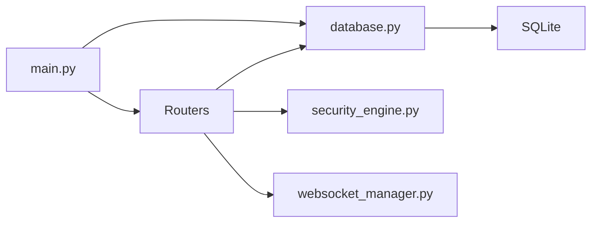

# Database Architecture

<cite>
**Referenced Files in This Document**
- [database.py](file://backend/database.py)
- [models.py](file://backend/models.py)
- [main.py](file://backend/main.py)
- [requirements.txt](file://backend/requirements.txt)
- [iot.py](file://backend/routers/iot.py)
- [wifi_bt.py](file://backend/routers/wifi_bt.py)
- [access_control.py](file://backend/routers/access_control.py)
- [reports.py](file://backend/routers/reports.py)
- [ai.py](file://backend/routers/ai.py)
- [websocket_manager.py](file://backend/websocket_manager.py)
- [security_engine.py](file://backend/security_engine.py)
</cite>

## Table of Contents
1. [Introduction](#introduction)
2. [Project Structure](#project-structure)
3. [Core Components](#core-components)
4. [Architecture Overview](#architecture-overview)
5. [Detailed Component Analysis](#detailed-component-analysis)
6. [Dependency Analysis](#dependency-analysis)
7. [Performance Considerations](#performance-considerations)
8. [Troubleshooting Guide](#troubleshooting-guide)
9. [Conclusion](#conclusion)

## Introduction
This document describes the database architecture of the PentexOne system, focusing on the SQLite-based persistence layer implemented with SQLAlchemy ORM. It covers the database schema design, ORM model definitions, relationships, data validation rules, initialization and migration strategies, session management patterns, transaction handling, concurrent access considerations, settings management, data integrity constraints, indexing strategies, query optimization patterns, and integration with FastAPI dependency injection and database connection pooling.

## Project Structure
The database layer is centered around a small set of modules:
- A central database module that defines the engine, session factory, declarative base, and ORM models.
- A models module that defines Pydantic models for API serialization.
- Application entrypoint that initializes the database and wires up FastAPI routes.
- Router modules that perform database operations and integrate with the security engine.
- A WebSocket manager for broadcasting scan events to clients.

**Diagram sources**
- [main.py:1-106](file://backend/main.py#L1-L106)
- [database.py:1-80](file://backend/database.py#L1-L80)
- [iot.py:1-880](file://backend/routers/iot.py#L1-L880)
- [wifi_bt.py:1-766](file://backend/routers/wifi_bt.py#L1-L766)
- [access_control.py:1-95](file://backend/routers/access_control.py#L1-L95)
- [reports.py:1-158](file://backend/routers/reports.py#L1-L158)
- [ai.py:1-330](file://backend/routers/ai.py#L1-L330)
- [websocket_manager.py:1-48](file://backend/websocket_manager.py#L1-L48)

**Section sources**
- [main.py:1-106](file://backend/main.py#L1-L106)
- [database.py:1-80](file://backend/database.py#L1-L80)

## Core Components
- Database engine and session factory: configured for SQLite with threading disabled for cross-thread access.
- Declarative base for ORM models.
- ORM models: Device, Vulnerability, RFIDCard, Setting.
- Dependency provider for database sessions.
- Initialization routine that creates tables and seeds default settings.

Key characteristics:
- SQLite file path is defined locally.
- Sessions are created per request via a generator dependency.
- No explicit connection pool is configured; sessions are short-lived per request.

**Section sources**
- [database.py:1-80](file://backend/database.py#L1-L80)
- [main.py:20-22](file://backend/main.py#L20-L22)

## Architecture Overview
The database architecture follows a straightforward ORM pattern:
- Models define the schema and relationships.
- Routers depend on a database session via FastAPI dependency injection.
- Security engine computes risk and vulnerability metadata, which is persisted to the database.
- Reports and AI routers query the database to generate summaries and insights.
- WebSocket manager broadcasts scan progress and results to clients.

**Diagram sources**
- [main.py:14-48](file://backend/main.py#L14-L48)
- [database.py:62-67](file://backend/database.py#L62-L67)
- [iot.py:292-413](file://backend/routers/iot.py#L292-L413)
- [wifi_bt.py:65-96](file://backend/routers/wifi_bt.py#L65-L96)

## Detailed Component Analysis

### Database Schema Design
The schema consists of four tables:
- devices: stores discovered IoT devices with risk metrics and open ports.
- vulnerabilities: stores vulnerability entries linked to devices.
- rfid_cards: stores RFID/NFC card data with risk metrics.
- settings: stores system configuration key-value pairs.

**Diagram sources**
- [database.py:12-61](file://backend/database.py#L12-L61)

**Section sources**
- [database.py:12-61](file://backend/database.py#L12-L61)

### ORM Model Definitions and Relationships
- Device and Vulnerability use a one-to-many relationship with back-population.
- Unique constraints are enforced at the ORM level for ip and uid.
- Indexes are declared on frequently queried columns (primary keys and foreign keys implicitly indexed; explicit index declarations are present in the model definitions).

Validation and defaults:
- String fields have default values where applicable.
- Numeric fields use appropriate types (Integer, Float).
- DateTime fields default to UTC now.

**Section sources**
- [database.py:12-61](file://backend/database.py#L12-L61)

### Data Validation Rules
- Unique constraints: devices.ip, rfid_cards.uid.
- Foreign key constraint: vulnerabilities.device_id references devices.id.
- Nullable fields: port and protocol in vulnerabilities; protocol and port in vulnerabilities are nullable.
- Risk level and severity are constrained to predefined categories via application logic and security engine.

**Section sources**
- [database.py:12-61](file://backend/database.py#L12-L61)
- [security_engine.py:202-339](file://backend/security_engine.py#L202-L339)

### Database Initialization and Migration Strategies
- Initialization: create_all binds the declarative base to the engine and creates tables.
- Default settings seeding: after table creation, default values are inserted for simulation_mode and nmap_timeout if missing.
- Migration strategy: no explicit Alembic migrations are present; schema changes would require manual adjustments to the models and re-running initialization.

Operational notes:
- The initialization runs once at application startup.
- Settings are stored as key-value pairs with string values.

**Section sources**
- [database.py:69-80](file://backend/database.py#L69-L80)
- [main.py:20-22](file://backend/main.py#L20-L22)

### Session Management Patterns and Transactions
- Session provider: a generator yields a local session and ensures closure in a finally block.
- Transaction handling: routers commit after successful operations; exceptions can abort transactions.
- Concurrency: sessions are short-lived per request; no explicit connection pooling is configured.

Best practices observed:
- Commit after bulk inserts or updates.
- Use flush when needed to synchronize identity and primary key before subsequent operations.

**Section sources**
- [database.py:62-67](file://backend/database.py#L62-L67)
- [iot.py:346-383](file://backend/routers/iot.py#L346-L383)
- [wifi_bt.py:76-93](file://backend/routers/wifi_bt.py#L76-L93)
- [access_control.py:69-84](file://backend/routers/access_control.py#L69-L84)

### Concurrent Access Considerations
- SQLite is used with cross-thread access disabled; sessions are created per request.
- The application does not configure a connection pool; each request gets a fresh session.
- WebSocket background tasks broadcast progress; they operate outside the request-scoped session lifecycle.

Implications:
- Suitable for single-instance deployments.
- Not optimized for high-concurrency write loads.

**Section sources**
- [database.py:7](file://backend/database.py#L7)
- [websocket_manager.py:21-45](file://backend/websocket_manager.py#L21-L45)

### Settings Management System
- Settings are stored in a dedicated settings table with a primary key on key.
- API endpoints:
  - GET /settings returns all settings as a dictionary.
  - PUT /settings updates specific settings by key.
- Default values are seeded during initialization.

**Section sources**
- [database.py:56-61](file://backend/database.py#L56-L61)
- [main.py:50-64](file://backend/main.py#L50-L64)

### Data Lifecycle Management
- Devices: created or updated on scans; last_seen timestamps are refreshed.
- Vulnerabilities: replaced per device during scans to reflect current risk assessment.
- RFID cards: created or updated on scans; last_seen refreshed.
- Reports: generated from current database state.

**Section sources**
- [iot.py:346-383](file://backend/routers/iot.py#L346-L383)
- [wifi_bt.py:76-93](file://backend/routers/wifi_bt.py#L76-L93)
- [access_control.py:69-84](file://backend/routers/access_control.py#L69-L84)
- [reports.py:18-34](file://backend/routers/reports.py#L18-L34)

### Integration with FastAPI Dependency Injection and Connection Pooling
- Dependency: get_db() provides a session per request.
- No explicit connection pool is configured; sessions are created per request.
- Routers depend on Session type to receive the database session.

**Section sources**
- [database.py:62-67](file://backend/database.py#L62-L67)
- [main.py:14-18](file://backend/main.py#L14-L18)

### Security Assessment Integration
- Risk calculation is performed by the security engine and persisted as vulnerabilities linked to devices.
- TLS checks and credential tests update device risk and vulnerability records.

**Section sources**
- [security_engine.py:202-339](file://backend/security_engine.py#L202-L339)
- [wifi_bt.py:447-549](file://backend/routers/wifi_bt.py#L447-L549)
- [wifi_bt.py:107-166](file://backend/routers/wifi_bt.py#L107-L166)

## Dependency Analysis
The routers depend on the database module for models and the session provider. The main application initializes the database and registers routers. The WebSocket manager is used by routers to broadcast scan progress.

**Diagram sources**
- [main.py:14-48](file://backend/main.py#L14-L48)
- [database.py:12-61](file://backend/database.py#L12-L61)
- [iot.py:20-22](file://backend/routers/iot.py#L20-L22)
- [wifi_bt.py:23-25](file://backend/routers/wifi_bt.py#L23-L25)
- [access_control.py:9](file://backend/routers/access_control.py#L9)
- [reports.py:12](file://backend/routers/reports.py#L12)
- [ai.py:10](file://backend/routers/ai.py#L10)
- [websocket_manager.py:1-48](file://backend/websocket_manager.py#L1-L48)

**Section sources**
- [main.py:14-48](file://backend/main.py#L14-L48)
- [database.py:12-61](file://backend/database.py#L12-L61)

## Performance Considerations
- Indexing: primary keys and foreign keys are implicitly indexed; explicit index declarations are present in the model definitions. Consider adding composite indexes for frequent queries (e.g., devices.risk_level, devices.protocol).
- Query patterns: routers commonly order devices by risk_score and filter by risk_level. Ensure appropriate indexes exist for these columns.
- Bulk operations: routers commit after batch updates; consider batching commits for large datasets.
- SQLite limitations: for high-concurrency writes, consider migrating to a client-server database with connection pooling.

[No sources needed since this section provides general guidance]

## Troubleshooting Guide
Common issues and resolutions:
- Database initialization failures: ensure the SQLite file path is writable and the application has permissions to create the file.
- Session errors: verify that get_db() is used as a FastAPI dependency and that db.close() is reached in a finally block.
- Missing settings: confirm that default settings are seeded during initialization.
- Transaction conflicts: ensure that long-running operations commit or rollback appropriately; avoid holding sessions across unrelated operations.

**Section sources**
- [database.py:69-80](file://backend/database.py#L69-L80)
- [database.py:62-67](file://backend/database.py#L62-L67)
- [main.py:20-22](file://backend/main.py#L20-L22)

## Conclusion
The PentexOne database architecture employs a straightforward SQLite + SQLAlchemy ORM design suitable for embedded or single-instance deployments. The schema and relationships cleanly represent devices, vulnerabilities, RFID cards, and settings. Session management follows FastAPI dependency injection patterns, and the application integrates risk assessment logic to populate the database dynamically. For production environments requiring high concurrency or advanced migrations, consider adopting a client-server database and a formal migration toolchain.