# Frontend Architecture

<cite>
**Referenced Files in This Document**
- [index.html](file://backend/static/index.html)
- [login.html](file://backend/static/login.html)
- [style.css](file://backend/static/style.css)
- [app.js](file://backend/static/app.js)
- [main.py](file://backend/main.py)
- [websocket_manager.py](file://backend/websocket_manager.py)
- [iot.py](file://backend/routers/iot.py)
- [access_control.py](file://backend/routers/access_control.py)
- [ai.py](file://backend/routers/ai.py)
- [models.py](file://backend/models.py)
- [security_engine.py](file://backend/security_engine.py)
</cite>

## Update Summary
**Changes Made**
- Updated responsive design section to reflect comprehensive mobile-first architecture
- Added new lightweight mode detection system for low-power devices
- Enhanced touch screen optimizations with touch-friendly sizing variables
- Documented new mobile menu system with off-canvas drawer functionality
- Added performance adaptations for Raspberry Pi and other low-power devices
- Updated CSS architecture to include touch device specific styles and animations

## Table of Contents
1. [Introduction](#introduction)
2. [Project Structure](#project-structure)
3. [Core Components](#core-components)
4. [Architecture Overview](#architecture-overview)
5. [Detailed Component Analysis](#detailed-component-analysis)
6. [Dependency Analysis](#dependency-analysis)
7. [Performance Considerations](#performance-considerations)
8. [Troubleshooting Guide](#troubleshooting-guide)
9. [Conclusion](#conclusion)
10. [Appendices](#appendices)

## Introduction
This document describes the frontend architecture of the PentexOne dashboard system. It covers the HTML/CSS/JavaScript implementation of the main dashboard interface, login page, and real-time monitoring components. It explains client-side JavaScript behavior including WebSocket connections, real-time data updates, and Chart.js-based visualizations. It documents static file serving via FastAPI, asset management, and comprehensive responsive design patterns with mobile-first architecture. It also details user interface components, navigation, interactive elements, WebSocket communication protocols, heartbeat mechanisms, real-time synchronization, styling architecture with CSS organization and theme management, browser compatibility, performance optimization, and user experience considerations.

## Project Structure
The frontend assets are served statically from the backend's static directory and mounted under the /dashboard route. The main pages are:
- Login page: /login
- Dashboard: /dashboard/index.html
- Static assets: CSS, JS, and HTML files under backend/static/

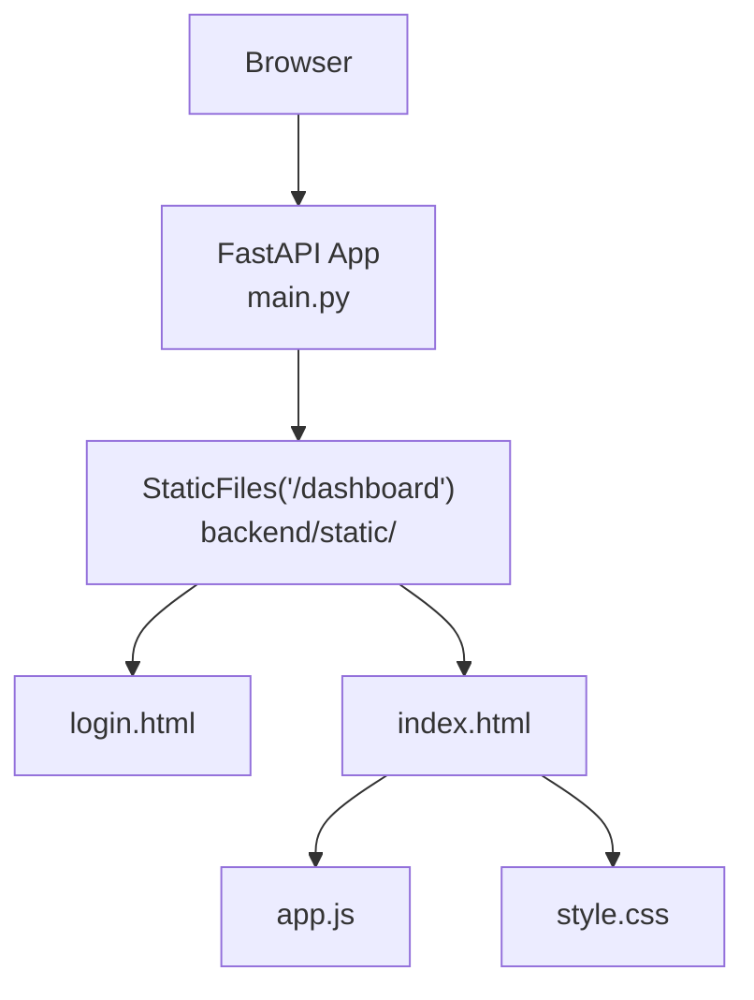

**Diagram sources**
- [main.py:66-82](file://backend/main.py#L66-L82)
- [index.html:1-505](file://backend/static/index.html#L1-L505)
- [login.html:1-232](file://backend/static/login.html#L1-L232)

**Section sources**
- [main.py:66-82](file://backend/main.py#L66-L82)
- [index.html:1-505](file://backend/static/index.html#L1-L505)
- [login.html:1-232](file://backend/static/login.html#L1-L232)

## Core Components
- HTML pages:
  - Login page: handles authentication and redirects to dashboard upon success.
  - Dashboard page: main UI with navigation, quick actions, charts, device tables, and AI panels.
- CSS:
  - Theme variables in :root define dark theme, glass panels, and status colors.
  - Comprehensive responsive breakpoints for desktop, tablet, and mobile layouts.
  - Touch-friendly sizing variables (--touch-min: 44px) for optimal mobile interaction.
  - Lightweight mode detection system for low-power device optimization.
  - Mobile menu system with off-canvas drawer functionality.
- JavaScript:
  - Application controller (app.js) orchestrates UI, API calls, WebSocket, charts, and notifications.
  - Real-time updates via WebSocket with heartbeat and event-driven UI refresh.
  - Chart.js renders risk distribution and protocol distribution.
  - Lightweight mode detection for Raspberry Pi and other low-power devices.
  - Touch screen optimizations with improved gesture handling.
- Backend static serving:
  - FastAPI mounts static directory and serves index.html as HTML for SPA-like behavior.

Key responsibilities:
- Authentication and session management (login.html + main.py).
- Real-time monitoring and live updates (app.js + websocket_manager.py + routers).
- Data visualization (Chart.js in app.js).
- Asset delivery and routing (/dashboard, /login, /ws).
- Responsive design and mobile optimization (CSS + JavaScript).

**Section sources**
- [login.html:1-232](file://backend/static/login.html#L1-L232)
- [index.html:1-505](file://backend/static/index.html#L1-L505)
- [style.css:1-1442](file://backend/static/style.css#L1-L1442)
- [app.js:1-1163](file://backend/static/app.js#L1-L1163)
- [main.py:66-102](file://backend/main.py#L66-L102)

## Architecture Overview
The frontend architecture follows a thin client model with comprehensive responsive design:
- The browser loads index.html and app.js.
- app.js initializes UI, charts, and WebSocket with lightweight mode detection.
- On user actions (scan, view switch, settings), app.js calls FastAPI endpoints.
- Backend routes (routers) process requests, update state, and broadcast events via WebSocket.
- app.js receives events and updates UI in real time with responsive adaptations.
- Mobile menu system provides seamless navigation on touch devices.

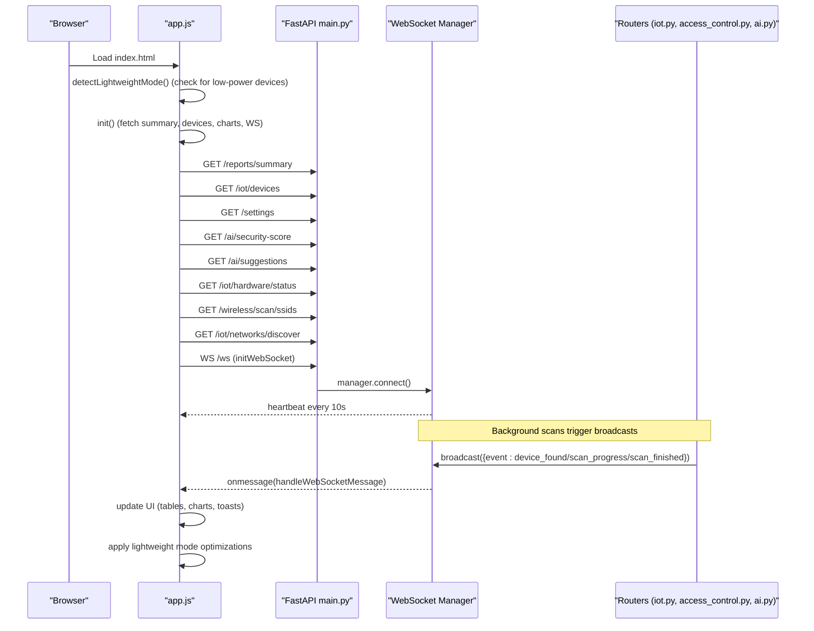

**Diagram sources**
- [app.js:14-25](file://backend/static/app.js#L14-L25)
- [app.js:113-126](file://backend/static/app.js#L113-L126)
- [app.js:128-155](file://backend/static/app.js#L128-L155)
- [main.py:90-101](file://backend/main.py#L90-L101)
- [websocket_manager.py:7-47](file://backend/websocket_manager.py#L7-L47)
- [iot.py:300-413](file://backend/routers/iot.py#L300-L413)

**Section sources**
- [app.js:14-25](file://backend/static/app.js#L14-L25)
- [app.js:113-155](file://backend/static/app.js#L113-L155)
- [main.py:90-101](file://backend/main.py#L90-L101)
- [websocket_manager.py:7-47](file://backend/websocket_manager.py#L7-L47)
- [iot.py:300-413](file://backend/routers/iot.py#L300-L413)

## Detailed Component Analysis

### HTML Pages and Routing
- Login page:
  - Validates credentials via POST /auth/login.
  - Stores session flag in sessionStorage and redirects to /dashboard/.
- Dashboard page:
  - Loads CSS and app.js.
  - Contains navigation, quick actions, charts, device tables, and AI panels.
  - Performs initial auth check and redirects to login if not authenticated.
  - Implements mobile menu system with off-canvas drawer functionality.
  - Includes lightweight mode detection for low-power devices.

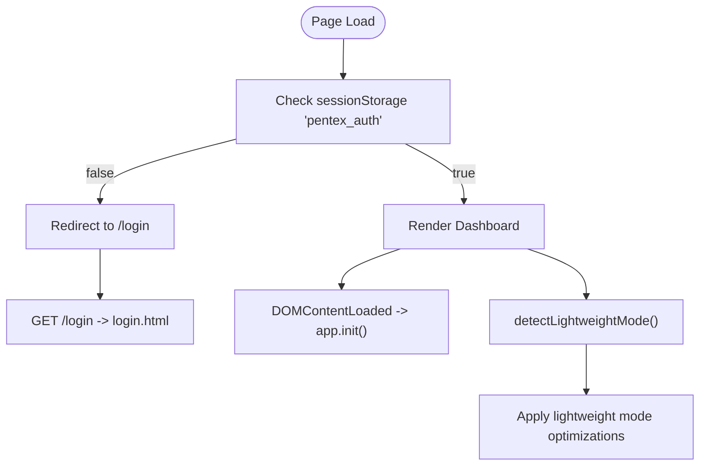

**Diagram sources**
- [index.html:416-420](file://backend/static/index.html#L416-L420)
- [login.html:203-206](file://backend/static/login.html#L203-L206)

**Section sources**
- [index.html:1-505](file://backend/static/index.html#L1-L505)
- [login.html:1-232](file://backend/static/login.html#L1-L232)

### Client-Side JavaScript (app.js)
Responsibilities:
- Initialize UI, charts, WebSocket, and periodic data fetches.
- Handle view switching, scan controls, and device selection.
- Manage toast notifications and progress bars.
- Poll scan status and update UI accordingly.
- Integrate with AI endpoints for suggestions and security score.
- Lightweight mode detection and performance optimizations.

WebSocket handling:
- Establishes WS connection using wss:// or ws:// depending on protocol.
- Receives heartbeat messages and ignores them.
- Handles device_found, vulnerability_found, scan_progress, scan_finished, and scan_error events.
- Automatically reconnects on close.

Charts:
- Doughnut chart for risk distribution.
- Bar chart for protocol distribution.
- Responsive chart configurations based on lightweight mode.

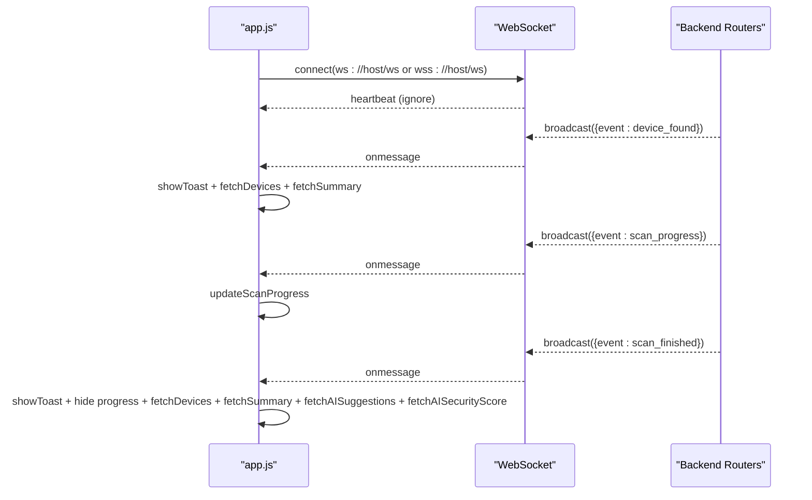

**Diagram sources**
- [app.js:113-155](file://backend/static/app.js#L113-L155)
- [main.py:90-101](file://backend/main.py#L90-L101)
- [websocket_manager.py:21-45](file://backend/websocket_manager.py#L21-L45)

**Section sources**
- [app.js:1-1163](file://backend/static/app.js#L1-L1163)
- [main.py:90-101](file://backend/main.py#L90-L101)
- [websocket_manager.py:7-47](file://backend/websocket_manager.py#L7-L47)

### Real-Time Monitoring and WebSocket Communication
- Heartbeat mechanism:
  - Backend sends periodic heartbeat messages every 10 seconds to keep the connection alive.
- Event-driven UI updates:
  - device_found: adds device to UI and triggers analytics refresh.
  - vulnerability_found: shows risk toast and refreshes devices.
  - scan_progress: updates progress bar and status text.
  - scan_finished: finalizes progress, hides progress UI, and refreshes data.
  - scan_error: displays error toast and resets progress.

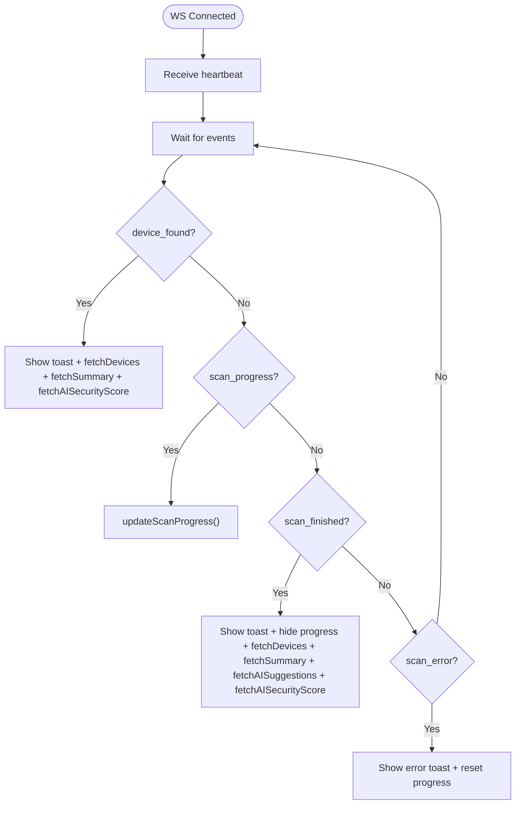

**Diagram sources**
- [main.py:90-101](file://backend/main.py#L90-L101)
- [app.js:128-155](file://backend/static/app.js#L128-L155)

**Section sources**
- [main.py:90-101](file://backend/main.py#L90-L101)
- [app.js:128-155](file://backend/static/app.js#L128-L155)

### Charts and Data Visualization (Chart.js)
- Risk distribution chart:
  - Doughnut chart showing SAFE, MEDIUM, RISK counts.
  - Updated whenever summary data changes.
  - Responsive configuration with lightweight mode support.
- Protocol distribution chart:
  - Bar chart showing counts per protocol.
  - Matter merged into Thread for display.
  - Updated whenever devices change.
  - Animation disabled in lightweight mode for performance.

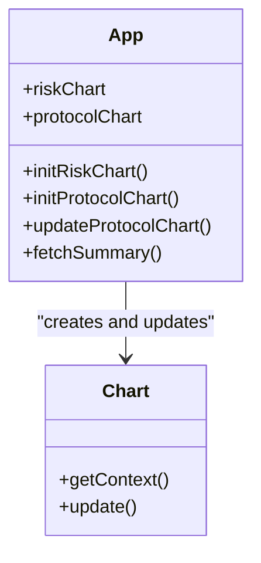

**Diagram sources**
- [app.js:40-111](file://backend/static/app.js#L40-L111)
- [app.js:296-329](file://backend/static/app.js#L296-L329)

**Section sources**
- [app.js:40-111](file://backend/static/app.js#L40-L111)
- [app.js:296-329](file://backend/static/app.js#L296-L329)

### UI Components, Navigation, and Interactions
- Navigation:
  - Sidebar with links to Dashboard, RFID, Reports, and Settings.
  - Active state managed by app.switchView().
  - Mobile menu system with off-canvas drawer for touch devices.
- Dashboard:
  - Quick scan buttons for Wi-Fi, Bluetooth, Zigbee, Thread, Z-Wave, LoRaWAN.
  - Advanced options with network discovery and nearby SSIDs.
  - Progress bar for ongoing scans.
  - Stats grid for total, safe, medium, risk counts.
  - Charts for risk and protocol distribution.
  - Hardware status panel.
  - AI security score and suggestions panels.
  - Device table with details panel.
- RFID:
  - Scan, clear cards, and table of scanned cards.
- Reports:
  - Export to PDF, JSON, CSV.
- Settings:
  - Toggle simulation mode and adjust Nmap timeout.

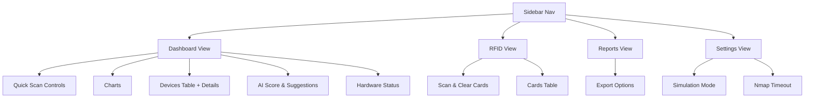

**Diagram sources**
- [index.html:18-398](file://backend/static/index.html#L18-L398)
- [app.js:215-238](file://backend/static/app.js#L215-L238)

**Section sources**
- [index.html:18-398](file://backend/static/index.html#L18-L398)
- [app.js:215-238](file://backend/static/app.js#L215-L238)

### Authentication and Authorization
- Login page posts credentials to /auth/login.
- On success, sets sessionStorage flag and redirects to /dashboard/.
- Dashboard checks sessionStorage and redirects to login if missing.

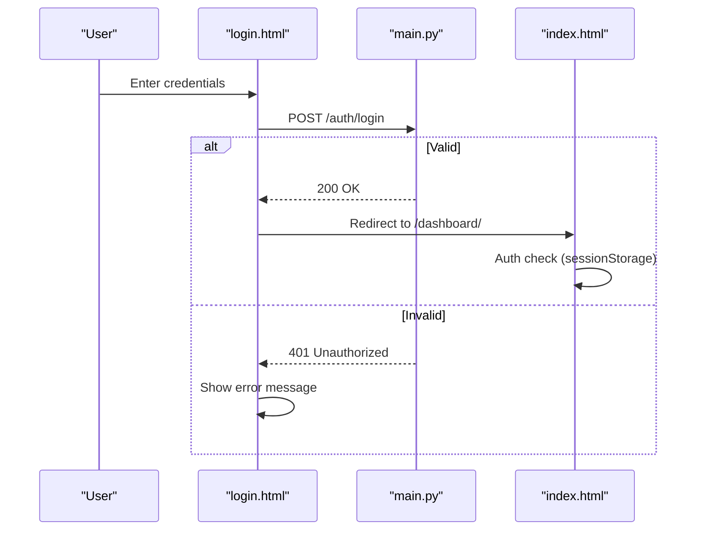

**Diagram sources**
- [login.html:212-228](file://backend/static/login.html#L212-L228)
- [main.py:70-74](file://backend/main.py#L70-L74)
- [index.html:416-420](file://backend/static/index.html#L416-L420)

**Section sources**
- [login.html:212-228](file://backend/static/login.html#L212-L228)
- [main.py:70-74](file://backend/main.py#L70-L74)
- [index.html:416-420](file://backend/static/index.html#L416-L420)

### Static File Serving and Asset Management
- FastAPI mounts the static directory under /dashboard with HTML=True so index.html is served as HTML.
- Assets referenced in index.html and login.html include:
  - Chart.js CDN for charts.
  - Font Awesome CDN for icons.
  - Local style.css and app.js.

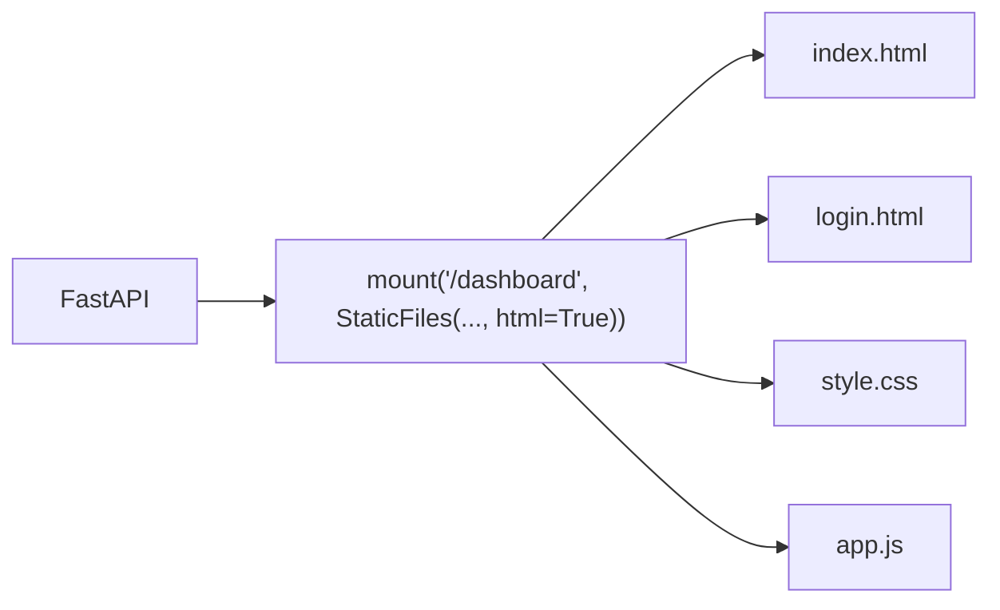

**Diagram sources**
- [main.py:66-68](file://backend/main.py#L66-L68)
- [index.html:12-14](file://backend/static/index.html#L12-L14)

**Section sources**
- [main.py:66-68](file://backend/main.py#L66-L68)
- [index.html:12-14](file://backend/static/index.html#L12-L14)

### Responsive Design Patterns and Mobile-First Architecture
**Updated** Comprehensive responsive design implementation with mobile-first approach:

- Touch-friendly sizing variables:
  - --touch-min: 44px minimum touch target size for optimal mobile interaction.
  - Consistent touch targets across all interactive elements.
- Mobile menu system:
  - Off-canvas drawer with hamburger menu button.
  - Sidebar transforms to fixed position on mobile devices.
  - Overlay background for improved user experience.
- Lightweight mode detection:
  - Automatic detection of low-power devices (Raspberry Pi, embedded systems).
  - Reduced animations and visual effects for better performance.
  - Disabled expensive background effects and backdrop filters.
- Multi-tier responsive breakpoints:
  - Desktop: 1400px+ with full dashboard layout.
  - Tablet: 1024px-1400px with stacked components.
  - Mobile: 768px-1024px with off-canvas navigation.
  - Phone landscape: 480px-768px with optimized layout.
  - Very small screens: 360px-480px with single-column stats.

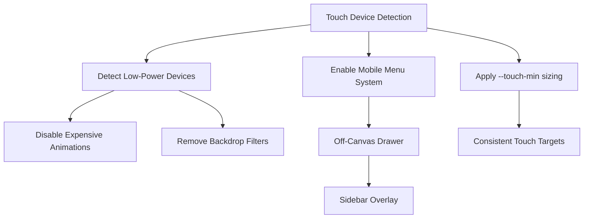

**Diagram sources**
- [style.css:20-27](file://backend/static/style.css#L20-L27)
- [style.css:62-100](file://backend/static/style.css#L62-L100)
- [style.css:1272-1312](file://backend/static/style.css#L1272-L1312)
- [index.html:463-490](file://backend/static/index.html#L463-L490)

**Section sources**
- [style.css:20-27](file://backend/static/style.css#L20-L27)
- [style.css:62-100](file://backend/static/style.css#L62-L100)
- [style.css:1272-1312](file://backend/static/style.css#L1272-L1312)
- [index.html:463-490](file://backend/static/index.html#L463-L490)

### Styling Architecture and Theme Management
**Updated** Enhanced styling architecture with responsive design:

- CSS custom properties in :root define:
  - Backgrounds, borders, and text colors.
  - Accent colors for blue, purple, orange.
  - Status colors for safe, medium, risk.
  - Glass panel backdrop blur and Inter font family.
  - Touch-friendly sizing variables (--touch-min: 44px).
- Component styles:
  - Glass panels with backdrop-filter and border.
  - Buttons with multiple variants (primary, outline, danger, etc.).
  - Charts with custom legends and responsive containers.
  - Toast notifications with animations.
  - Device badges and vulnerability items.
  - Mobile menu system with off-canvas drawer.
  - Lightweight mode optimizations for low-power devices.

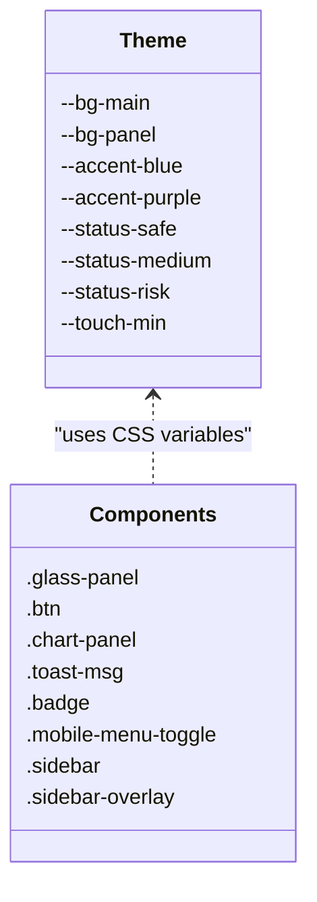

**Diagram sources**
- [style.css:1-19](file://backend/static/style.css#L1-L19)
- [style.css:20-27](file://backend/static/style.css#L20-L27)
- [style.css:164-171](file://backend/static/style.css#L164-L171)
- [style.css:296-357](file://backend/static/style.css#L296-L357)
- [style.css:359-429](file://backend/static/style.css#L359-L429)
- [style.css:933-936](file://backend/static/style.css#L933-L936)

**Section sources**
- [style.css:1-19](file://backend/static/style.css#L1-L19)
- [style.css:20-27](file://backend/static/style.css#L20-L27)
- [style.css:164-171](file://backend/static/style.css#L164-L171)
- [style.css:296-357](file://backend/static/style.css#L296-L357)
- [style.css:359-429](file://backend/static/style.css#L359-L429)
- [style.css:933-936](file://backend/static/style.css#L933-L936)

### WebSocket Communication Protocols and Heartbeat
- Connection:
  - Uses ws:// or wss:// based on page protocol.
  - On close, attempts to reconnect after 5 seconds.
- Heartbeat:
  - Backend sends periodic heartbeat messages to keep the connection alive.
- Events:
  - device_found: new device discovered.
  - vulnerability_found: new vulnerability detected.
  - scan_progress: progress updates.
  - scan_finished: scan completion.
  - scan_error: error conditions.

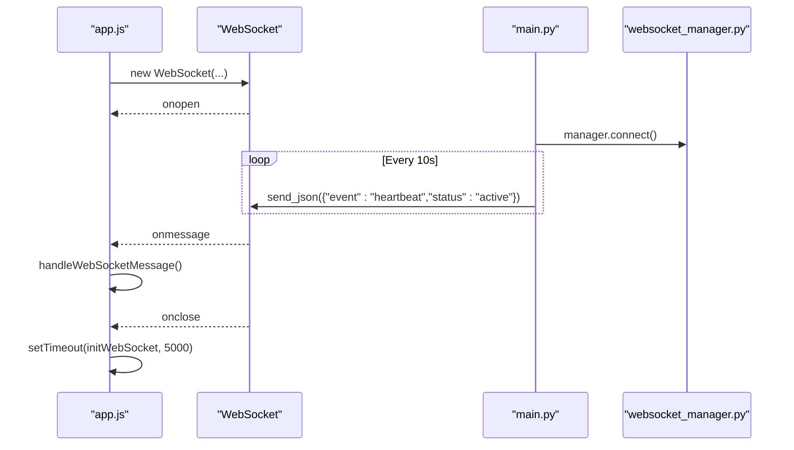

**Diagram sources**
- [app.js:113-126](file://backend/static/app.js#L113-L126)
- [main.py:90-101](file://backend/main.py#L90-L101)
- [websocket_manager.py:11-19](file://backend/websocket_manager.py#L11-L19)

**Section sources**
- [app.js:113-126](file://backend/static/app.js#L113-L126)
- [main.py:90-101](file://backend/main.py#L90-L101)
- [websocket_manager.py:11-19](file://backend/websocket_manager.py#L11-L19)

### Real-Time Data Synchronization
- Background scans:
  - Wi-Fi scan via nmap, Matter via Zeroconf, Zigbee/Thread/Z-Wave/LoRaWAN via hardware or simulation.
  - Broadcast events for device_found, scan_progress, scan_finished, scan_error.
- Client updates:
  - app.js polls scan status until completion, then refreshes devices and summaries.
  - On WS events, app.js updates UI immediately.
  - Lightweight mode adjusts refresh intervals for better performance.

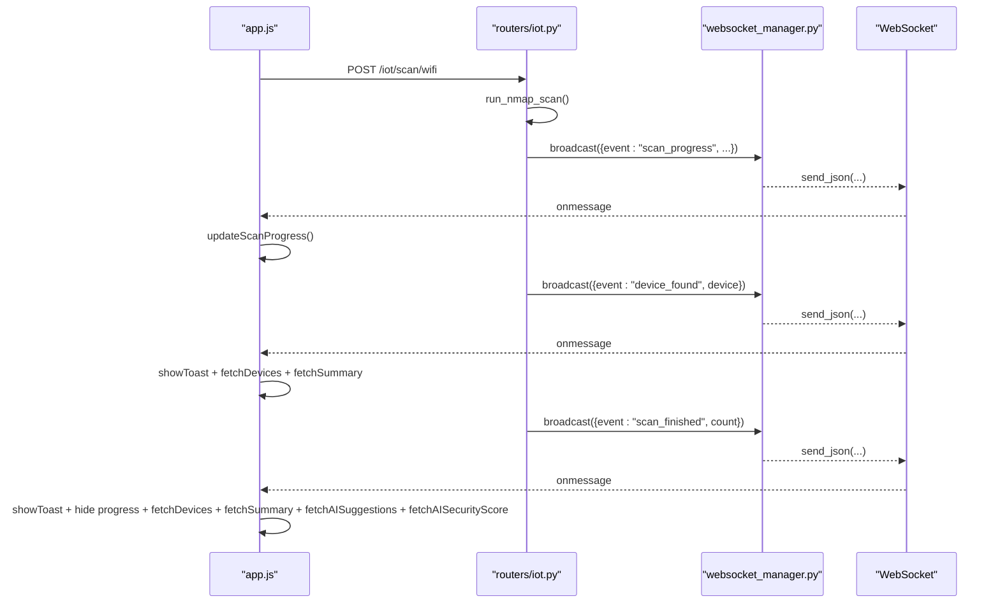

**Diagram sources**
- [app.js:568-653](file://backend/static/app.js#L568-L653)
- [iot.py:291-413](file://backend/routers/iot.py#L291-L413)
- [websocket_manager.py:21-45](file://backend/websocket_manager.py#L21-L45)

**Section sources**
- [app.js:568-653](file://backend/static/app.js#L568-L653)
- [iot.py:291-413](file://backend/routers/iot.py#L291-L413)
- [websocket_manager.py:21-45](file://backend/websocket_manager.py#L21-L45)

### Lightweight Mode Detection and Performance Optimizations
**New** Comprehensive performance adaptations for low-power devices:

- Automatic detection criteria:
  - hardwareConcurrency <= 4 (Raspberry Pi typical)
  - ARM architecture detection
  - deviceMemory <= 4GB
  - prefers-reduced-motion user preference
  - Small kiosk mode detection (<=1024x768 Linux)
- Performance optimizations:
  - Disabled expensive animations and transitions.
  - Removed backdrop-filter effects for glass panels.
  - Reduced chart animations and visual effects.
  - Adjusted auto-refresh intervals (10s vs 5s).
  - Simplified background effects and gradients.
- Manual override capability:
  - URL parameter ?lightweight for forced activation.
  - Settings-based toggling for user control.

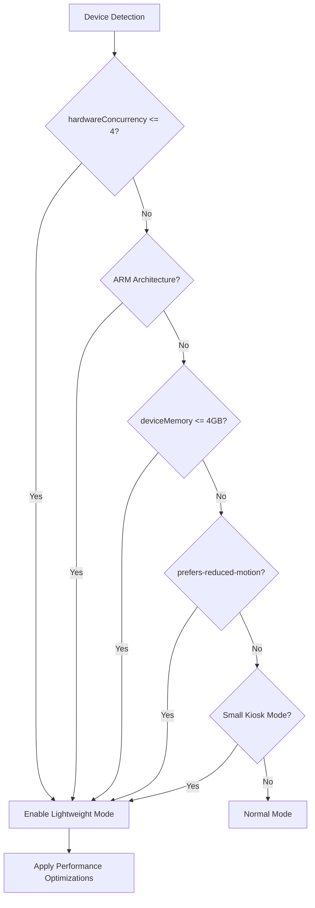

**Diagram sources**
- [index.html:463-490](file://backend/static/index.html#L463-L490)
- [app.js:31-43](file://backend/static/app.js#L31-L43)
- [style.css:1264-1312](file://backend/static/style.css#L1264-L1312)

**Section sources**
- [index.html:463-490](file://backend/static/index.html#L463-L490)
- [app.js:31-43](file://backend/static/app.js#L31-L43)
- [style.css:1264-1312](file://backend/static/style.css#L1264-L1312)

### Touch Screen Optimizations and Mobile Menu System
**New** Enhanced touch interaction and navigation:

- Touch-friendly interface:
  - Minimum 44px touch targets for all interactive elements.
  - Improved tap highlighting and active states.
  - Gesture-friendly button sizing and spacing.
- Mobile menu system:
  - Hamburger menu button with fixed positioning.
  - Off-canvas sidebar with smooth transitions.
  - Overlay background for improved user experience.
  - Auto-close on navigation item click.
  - Responsive sidebar positioning and sizing.
- Touch device specific styles:
  - Coarse pointer detection for mobile optimization.
  - Enlarged form controls and inputs.
  - Custom scrollbar styling for touch devices.
  - Hover effects disabled for touch devices.

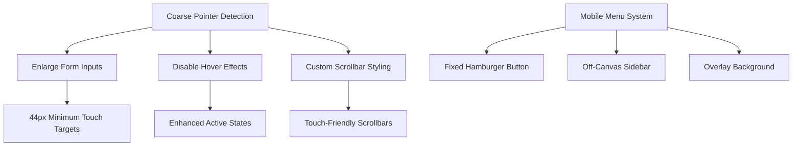

**Diagram sources**
- [style.css:1317-1374](file://backend/static/style.css#L1317-L1374)
- [style.css:62-100](file://backend/static/style.css#L62-L100)
- [index.html:421-461](file://backend/static/index.html#L421-L461)

**Section sources**
- [style.css:1317-1374](file://backend/static/style.css#L1317-L1374)
- [style.css:62-100](file://backend/static/style.css#L62-L100)
- [index.html:421-461](file://backend/static/index.html#L421-L461)

### Browser Compatibility and User Experience
- Compatibility:
  - Uses modern APIs (fetch, WebSocket, Chart.js, CSS variables).
  - Comprehensive responsive design ensures usability across screen sizes.
  - Lightweight mode provides fallback for older devices.
  - Touch device optimizations for mobile Safari and Android browsers.
- UX:
  - Toast notifications for scan progress, errors, and critical alerts.
  - Animated progress bars and smooth transitions.
  - Immediate feedback on user actions (scans, settings, exports).
  - Dark theme with glass panels enhances readability and reduces eye strain.
  - Mobile-first design ensures optimal experience on all devices.

[No sources needed since this section provides general guidance]

## Dependency Analysis
High-level dependencies:
- index.html depends on app.js and style.css.
- app.js depends on Chart.js (CDN), FastAPI endpoints, and WebSocket.
- main.py mounts static files and exposes routes and WebSocket endpoint.
- Routers depend on database sessions and security_engine for risk calculations.

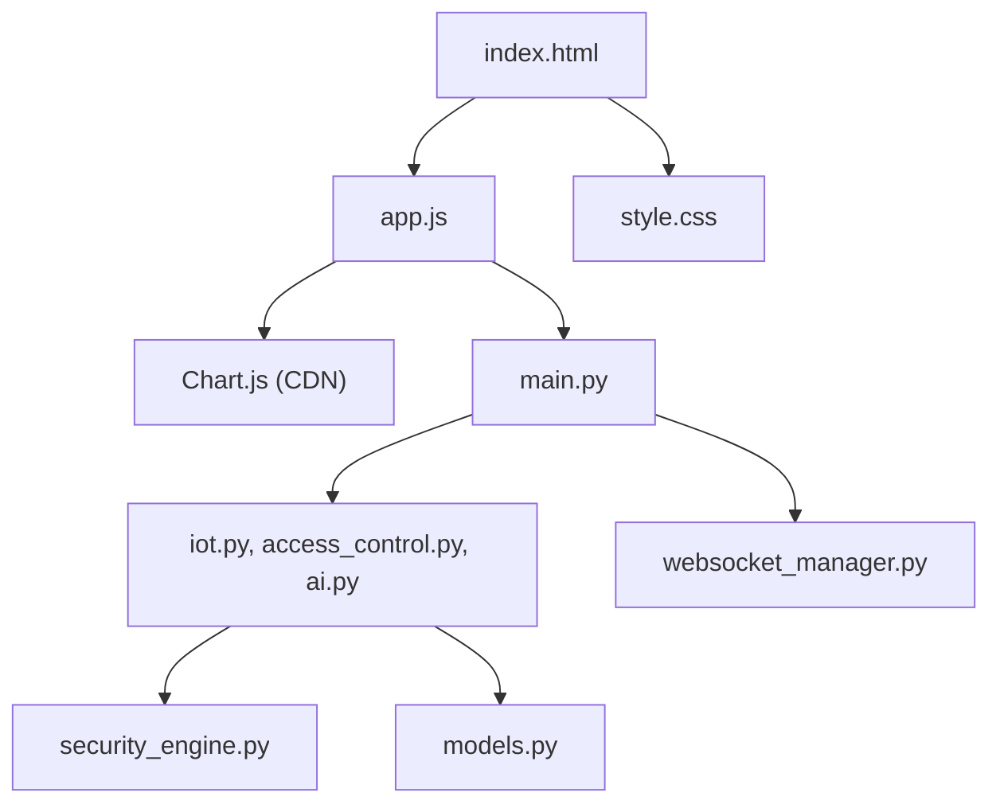

**Diagram sources**
- [index.html:1-505](file://backend/static/index.html#L1-L505)
- [app.js:1-1163](file://backend/static/app.js#L1-L1163)
- [main.py:1-106](file://backend/main.py#L1-L106)
- [iot.py:1-880](file://backend/routers/iot.py#L1-L880)
- [access_control.py:1-95](file://backend/routers/access_control.py#L1-L95)
- [ai.py:1-330](file://backend/routers/ai.py#L1-L330)
- [security_engine.py:1-425](file://backend/security_engine.py#L1-L425)
- [models.py:1-71](file://backend/models.py#L1-L71)

**Section sources**
- [index.html:1-505](file://backend/static/index.html#L1-L505)
- [app.js:1-1163](file://backend/static/app.js#L1-L1163)
- [main.py:1-106](file://backend/main.py#L1-L106)
- [iot.py:1-880](file://backend/routers/iot.py#L1-L880)
- [access_control.py:1-95](file://backend/routers/access_control.py#L1-L95)
- [ai.py:1-330](file://backend/routers/ai.py#L1-L330)
- [security_engine.py:1-425](file://backend/security_engine.py#L1-L425)
- [models.py:1-71](file://backend/models.py#L1-L71)

## Performance Considerations
**Updated** Enhanced performance optimizations:

- Lightweight mode detection:
  - Automatic detection of low-power devices (Raspberry Pi, embedded systems).
  - Reduced animations and visual effects for better performance.
  - Adjusted auto-refresh intervals (10s vs 5s) for resource-constrained devices.
- Minimize DOM updates:
  - Batch UI updates after WebSocket events.
  - Use requestAnimationFrame for smoother animations.
- Efficient chart updates:
  - Update chart datasets instead of recreating charts.
  - Debounce frequent updates (e.g., scan progress).
  - Disable chart animations in lightweight mode.
- Network efficiency:
  - Use polling only when necessary; rely on WebSocket events.
  - Cache frequently accessed data (e.g., settings).
- Rendering optimizations:
  - Use CSS transforms for animations.
  - Avoid layout thrashing by batching DOM reads/writes.
  - Remove expensive backdrop-filter effects in lightweight mode.
- Touch device optimizations:
  - Larger touch targets (44px minimum) improve usability.
  - Gesture-friendly button sizing and spacing.
  - Custom scrollbar styling for touch devices.
- Asset delivery:
  - Serve static assets via CDN or compressed bundles.
  - Lazy-load non-critical resources.
  - Optimize images and fonts for mobile networks.

[No sources needed since this section provides general guidance]

## Troubleshooting Guide
Common issues and resolutions:
- Authentication failures:
  - Ensure credentials match configured admin/admin.
  - Check CORS middleware configuration.
- WebSocket disconnections:
  - Verify backend heartbeat loop is running.
  - Confirm browser supports WebSocket; check for mixed content warnings.
- Charts not rendering:
  - Ensure Chart.js CDN is accessible.
  - Check canvas element availability and container sizing.
  - Verify lightweight mode isn't disabling chart animations.
- Scan progress stuck:
  - Verify router endpoints are reachable.
  - Confirm background tasks are running and broadcasting events.
- Hardware detection:
  - Confirm dongle drivers are installed and accessible.
  - Check permissions for serial devices.
- Mobile menu not working:
  - Verify JavaScript is enabled.
  - Check CSS media queries for mobile breakpoints.
  - Ensure touch device detection is functioning.
- Lightweight mode issues:
  - Check device detection criteria.
  - Verify CSS classes are being applied correctly.
  - Test manual lightweight mode activation via URL parameter.

**Section sources**
- [main.py:23-32](file://backend/main.py#L23-L32)
- [main.py:90-101](file://backend/main.py#L90-L101)
- [app.js:113-126](file://backend/static/app.js#L113-L126)
- [iot.py:291-413](file://backend/routers/iot.py#L291-L413)
- [index.html:463-490](file://backend/static/index.html#L463-L490)

## Conclusion
The PentexOne frontend employs a clean separation of concerns with comprehensive responsive design: FastAPI serves static assets and exposes REST endpoints, while app.js manages the UI, WebSocket, and real-time updates with mobile-first architecture. The architecture emphasizes responsive design, real-time monitoring, lightweight mode optimization for low-power devices, and a cohesive dark theme with glass panels. Robust WebSocket heartbeats and event-driven UI updates provide a smooth user experience across desktop, tablet, and mobile devices. With careful attention to performance and accessibility, the system delivers a powerful, real-time dashboard for IoT security auditing with optimal user experience on all device types.

[No sources needed since this section summarizes without analyzing specific files]

## Appendices

### API Surface Used by app.js
- GET /reports/summary
- GET /iot/devices
- GET /settings
- PUT /settings
- GET /ai/security-score
- GET /ai/suggestions
- GET /iot/hardware/status
- GET /wireless/scan/ssids
- GET /iot/networks/discover
- POST /iot/scan/wifi
- POST /iot/scan/matter
- POST /iot/scan/zigbee
- POST /wireless/scan/bluetooth
- POST /iot/scan/thread
- POST /iot/scan/zwave
- POST /iot/scan/lora
- GET /iot/scan/status
- DELETE /iot/devices
- POST /wireless/test/ports/{ip}
- POST /wireless/test/credentials/{ip}
- POST /rfid/scan
- GET /rfid/cards
- DELETE /rfid/cards
- GET /reports/generate/pdf
- POST /auth/login

**Section sources**
- [app.js:240-265](file://backend/static/app.js#L240-L265)
- [app.js:267-294](file://backend/static/app.js#L267-L294)
- [app.js:331-342](file://backend/static/app.js#L331-L342)
- [app.js:454-497](file://backend/static/app.js#L454-L497)
- [app.js:568-653](file://backend/static/app.js#L568-L653)
- [app.js:727-750](file://backend/static/app.js#L727-L750)
- [app.js:753-756](file://backend/static/app.js#L753-L756)
- [app.js:758-796](file://backend/static/app.js#L758-L796)
- [app.js:908-928](file://backend/static/app.js#L908-L928)
- [app.js:931-941](file://backend/static/app.js#L931-L941)
- [app.js:992-1023](file://backend/static/app.js#L992-L1023)
- [app.js:1025-1079](file://backend/static/app.js#L1025-L1079)