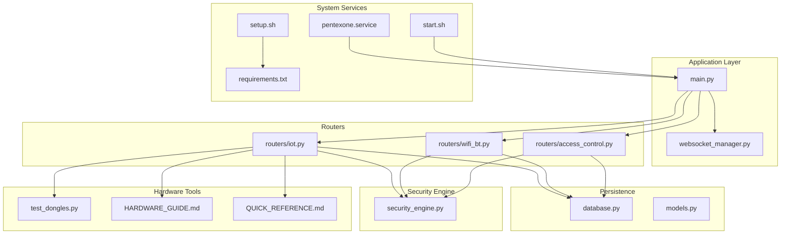
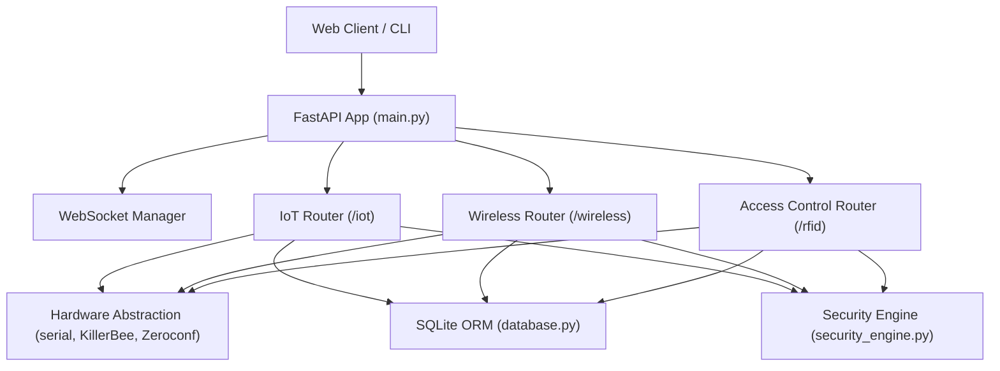
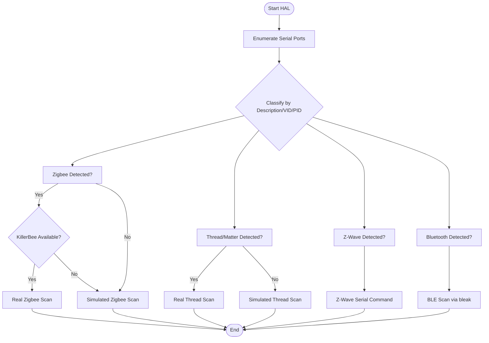
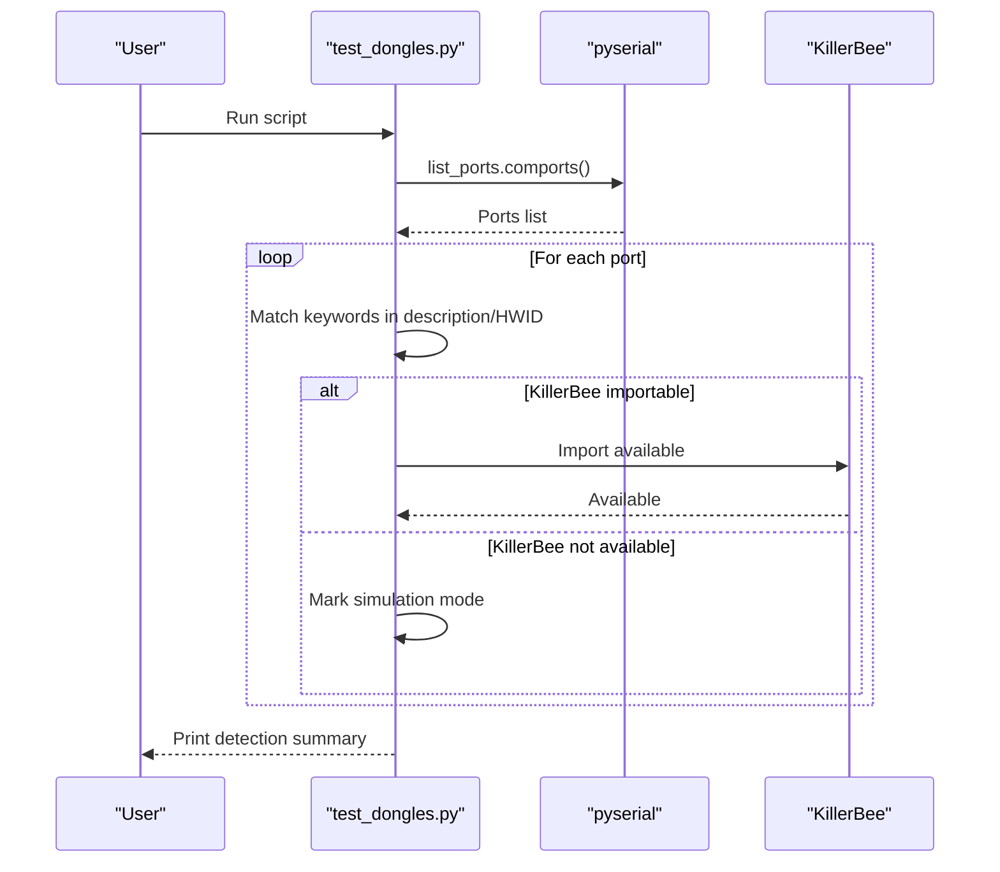
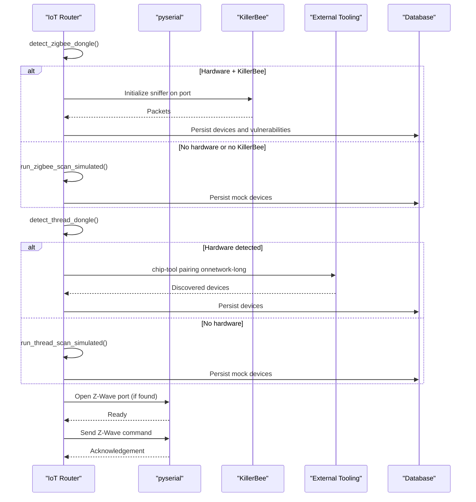
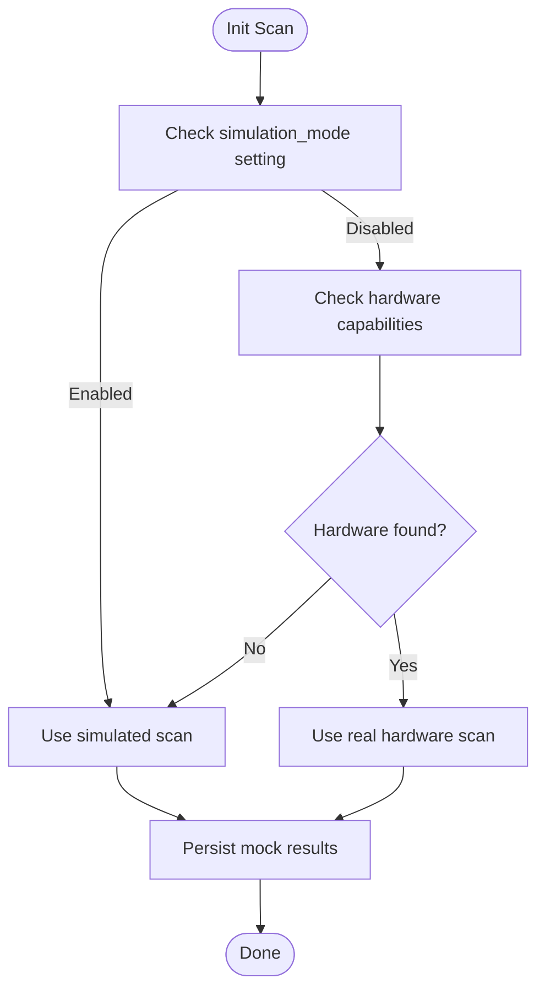
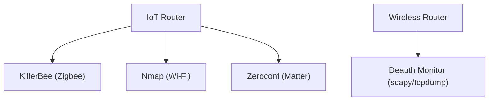
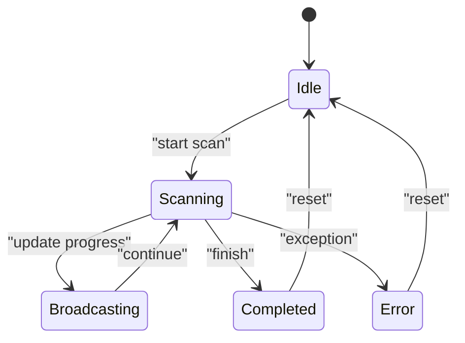
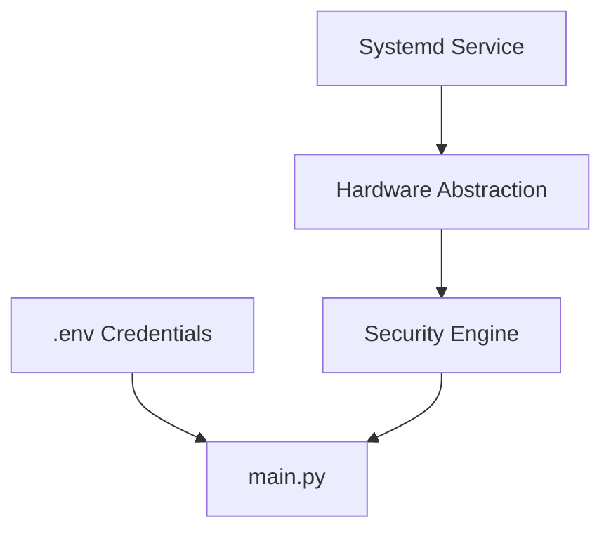
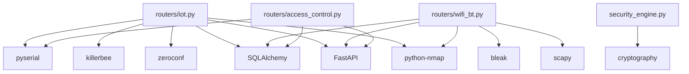

# Hardware Integration Architecture

<cite>
**Referenced Files in This Document**
- [main.py](file://backend/main.py)
- [iot.py](file://backend/routers/iot.py)
- [wifi_bt.py](file://backend/routers/wifi_bt.py)
- [access_control.py](file://backend/routers/access_control.py)
- [websocket_manager.py](file://backend/websocket_manager.py)
- [database.py](file://backend/database.py)
- [models.py](file://backend/models.py)
- [security_engine.py](file://backend/security_engine.py)
- [test_dongles.py](file://backend/test_dongles.py)
- [HARDWARE_GUIDE.md](file://backend/HARDWARE_GUIDE.md)
- [QUICK_REFERENCE.md](file://backend/QUICK_REFERENCE.md)
- [pentexone.service](file://backend/pentexone.service)
- [setup.sh](file://backend/setup.sh)
- [start.sh](file://backend/start.sh)
- [requirements.txt](file://backend/requirements.txt)
</cite>

## Table of Contents
1. [Introduction](#introduction)
2. [Project Structure](#project-structure)
3. [Core Components](#core-components)
4. [Architecture Overview](#architecture-overview)
5. [Detailed Component Analysis](#detailed-component-analysis)
6. [Dependency Analysis](#dependency-analysis)
7. [Performance Considerations](#performance-considerations)
8. [Troubleshooting Guide](#troubleshooting-guide)
9. [Conclusion](#conclusion)
10. [Appendices](#appendices)

## Introduction
This document describes the hardware integration architecture for PentexOne, focusing on the hardware abstraction layer for IoT protocol dongles, USB device detection, serial communication protocols, hardware state management, and the dongle testing framework. It also documents integration patterns with external tools (KillerBee for Zigbee analysis and Nmap for network scanning), hardware simulation mode, hardware capability detection, health monitoring, error handling, fallback mechanisms, and security implications.

## Project Structure
The hardware integration spans the backend FastAPI application, router modules for IoT protocols, a WebSocket manager for live updates, a SQLite-backed ORM for persistence, and supporting scripts and guides for deployment and hardware setup.

**Diagram sources**
- [main.py:1-106](file://backend/main.py#L1-L106)
- [iot.py:1-880](file://backend/routers/iot.py#L1-L880)
- [wifi_bt.py:1-766](file://backend/routers/wifi_bt.py#L1-L766)
- [access_control.py:1-95](file://backend/routers/access_control.py#L1-L95)
- [websocket_manager.py:1-48](file://backend/websocket_manager.py#L1-L48)
- [database.py:1-80](file://backend/database.py#L1-L80)
- [models.py:1-71](file://backend/models.py#L1-L71)
- [security_engine.py:1-425](file://backend/security_engine.py#L1-L425)
- [test_dongles.py:1-152](file://backend/test_dongles.py#L1-L152)
- [HARDWARE_GUIDE.md:1-399](file://backend/HARDWARE_GUIDE.md#L1-L399)
- [QUICK_REFERENCE.md:1-180](file://backend/QUICK_REFERENCE.md#L1-L180)
- [pentexone.service:1-25](file://backend/pentexone.service#L1-L25)
- [setup.sh:1-142](file://backend/setup.sh#L1-L142)
- [start.sh:1-38](file://backend/start.sh#L1-L38)
- [requirements.txt:1-21](file://backend/requirements.txt#L1-L21)

**Section sources**
- [main.py:1-106](file://backend/main.py#L1-L106)
- [iot.py:1-880](file://backend/routers/iot.py#L1-L880)
- [wifi_bt.py:1-766](file://backend/routers/wifi_bt.py#L1-L766)
- [access_control.py:1-95](file://backend/routers/access_control.py#L1-L95)
- [websocket_manager.py:1-48](file://backend/websocket_manager.py#L1-L48)
- [database.py:1-80](file://backend/database.py#L1-L80)
- [models.py:1-71](file://backend/models.py#L1-L71)
- [security_engine.py:1-425](file://backend/security_engine.py#L1-L425)
- [test_dongles.py:1-152](file://backend/test_dongles.py#L1-L152)
- [HARDWARE_GUIDE.md:1-399](file://backend/HARDWARE_GUIDE.md#L1-L399)
- [QUICK_REFERENCE.md:1-180](file://backend/QUICK_REFERENCE.md#L1-L180)
- [pentexone.service:1-25](file://backend/pentexone.service#L1-L25)
- [setup.sh:1-142](file://backend/setup.sh#L1-L142)
- [start.sh:1-38](file://backend/start.sh#L1-L38)
- [requirements.txt:1-21](file://backend/requirements.txt#L1-L21)

## Core Components
- Hardware Abstraction Layer (HAL) for IoT protocols:
  - USB device detection via serial port enumeration and manufacturer/description matching.
  - Protocol-specific detection logic for Zigbee, Thread/Matter, Z-Wave, and Bluetooth.
  - Optional KillerBee integration for real Zigbee scanning; otherwise simulated.
- Serial Communication Protocols:
  - UART-based communication with dongles using pyserial for Z-Wave and generic serial devices.
  - BLE scanning via bleak on supported systems.
- Hardware State Management:
  - Global scan state maintained per protocol with progress, messages, and device counts.
  - WebSocket broadcasting for live UI updates during scans.
- Dongle Testing Framework:
  - Standalone script to enumerate and classify connected USB serial devices.
  - Capability checks for KillerBee availability and hardware presence.
- Integration Patterns:
  - Nmap integration for Wi-Fi network scanning and device discovery.
  - Zeroconf/Avahi for Matter discovery.
  - Optional system-level tools for deauthentication frame detection.
- Simulation Mode:
  - Database-backed toggle to switch between real hardware and simulated scans.
- Security and Isolation:
  - Systemd service with restricted privileges and strict protections.
  - Environment-based credential management and optional cryptography for TLS validation.

**Section sources**
- [iot.py:27-156](file://backend/routers/iot.py#L27-L156)
- [iot.py:158-180](file://backend/routers/iot.py#L158-L180)
- [iot.py:182-188](file://backend/routers/iot.py#L182-L188)
- [iot.py:483-550](file://backend/routers/iot.py#L483-L550)
- [iot.py:552-586](file://backend/routers/iot.py#L552-L586)
- [iot.py:625-722](file://backend/routers/iot.py#L625-L722)
- [iot.py:727-778](file://backend/routers/iot.py#L727-L778)
- [iot.py:789-800](file://backend/routers/iot.py#L789-L800)
- [test_dongles.py:14-132](file://backend/test_dongles.py#L14-L132)
- [wifi_bt.py:555-631](file://backend/routers/wifi_bt.py#L555-L631)
- [database.py:69-80](file://backend/database.py#L69-L80)
- [pentexone.service:1-25](file://backend/pentexone.service#L1-L25)

## Architecture Overview
The hardware integration architecture centers around a FastAPI backend exposing protocol-specific routers. Each router encapsulates detection, scanning, and reporting logic, with shared components for persistence, risk scoring, and live updates.

**Diagram sources**
- [main.py:1-106](file://backend/main.py#L1-L106)
- [iot.py:1-880](file://backend/routers/iot.py#L1-L880)
- [wifi_bt.py:1-766](file://backend/routers/wifi_bt.py#L1-L766)
- [access_control.py:1-95](file://backend/routers/access_control.py#L1-L95)
- [websocket_manager.py:1-48](file://backend/websocket_manager.py#L1-L48)
- [database.py:1-80](file://backend/database.py#L1-L80)
- [security_engine.py:1-425](file://backend/security_engine.py#L1-L425)

## Detailed Component Analysis

### Hardware Abstraction Layer (HAL)
The HAL performs USB device detection and classification for Zigbee, Thread/Matter, Z-Wave, and Bluetooth. It leverages pyserial’s port enumeration and manufacturer/description heuristics to identify dongles. For Zigbee, it checks for KillerBee availability to enable real scanning; otherwise, it falls back to simulated scans.

**Diagram sources**
- [iot.py:27-156](file://backend/routers/iot.py#L27-L156)
- [iot.py:158-180](file://backend/routers/iot.py#L158-L180)
- [iot.py:483-550](file://backend/routers/iot.py#L483-L550)
- [iot.py:552-586](file://backend/routers/iot.py#L552-L586)
- [iot.py:625-722](file://backend/routers/iot.py#L625-L722)
- [iot.py:727-778](file://backend/routers/iot.py#L727-L778)
- [iot.py:789-800](file://backend/routers/iot.py#L789-L800)

**Section sources**
- [iot.py:27-180](file://backend/routers/iot.py#L27-L180)
- [test_dongles.py:14-132](file://backend/test_dongles.py#L14-L132)

### Dongle Testing Framework
The standalone test script enumerates serial ports, prints detailed device information, and classifies dongles by keyword matching. It also checks for KillerBee availability and prints installation hints.

**Diagram sources**
- [test_dongles.py:14-132](file://backend/test_dongles.py#L14-L132)

**Section sources**
- [test_dongles.py:1-152](file://backend/test_dongles.py#L1-L152)

### Serial Communication Protocols and Drivers
- Zigbee:
  - Real scanning uses KillerBee’s sniffer with channel selection and packet iteration.
  - Simulated scanning generates mock devices with risk flags.
- Thread/Matter:
  - Real scanning attempts external tooling (e.g., chip-tool) for on-network pairing discovery; falls back to simulation if no hardware found.
- Z-Wave:
  - Uses pyserial to send a predefined command to a Z-Wave stick if detected.
- BLE:
  - Uses bleak for discovery on supported platforms.

**Diagram sources**
- [iot.py:483-550](file://backend/routers/iot.py#L483-L550)
- [iot.py:552-586](file://backend/routers/iot.py#L552-L586)
- [iot.py:625-722](file://backend/routers/iot.py#L625-L722)
- [iot.py:727-778](file://backend/routers/iot.py#L727-L778)

**Section sources**
- [iot.py:483-778](file://backend/routers/iot.py#L483-L778)

### Hardware Capability Detection and Simulation Mode
- Capability detection:
  - Zigbee: port enumeration + KillerBee availability check.
  - Thread/Matter: port enumeration + external tooling presence.
  - Z-Wave: port enumeration + serial command attempt.
- Simulation mode:
  - Controlled by a database-backed setting toggled via API.
  - RFID router demonstrates a similar pattern with a dedicated endpoint to enable/disable real hardware reads.

**Diagram sources**
- [database.py:69-80](file://backend/database.py#L69-L80)
- [iot.py:483-550](file://backend/routers/iot.py#L483-L550)
- [iot.py:625-722](file://backend/routers/iot.py#L625-L722)
- [access_control.py:47-84](file://backend/routers/access_control.py#L47-L84)

**Section sources**
- [database.py:69-80](file://backend/database.py#L69-L80)
- [access_control.py:47-84](file://backend/routers/access_control.py#L47-L84)

### Integration Patterns with External Tools
- KillerBee:
  - Imported conditionally; enables real Zigbee sniffing with channel configuration and packet iteration.
- Nmap:
  - Used for Wi-Fi network discovery and vulnerability-rich scans with port enumeration and OS fingerprinting.
- Zeroconf:
  - Used for Matter device discovery via mDNS browsing.
- Deauthentication Detection:
  - Optional monitoring using scapy or tcpdump on a wireless monitor interface.

**Diagram sources**
- [iot.py:505-524](file://backend/routers/iot.py#L505-L524)
- [iot.py:310-412](file://backend/routers/iot.py#L310-L412)
- [iot.py:444-477](file://backend/routers/iot.py#L444-L477)
- [wifi_bt.py:582-631](file://backend/routers/wifi_bt.py#L582-L631)

**Section sources**
- [iot.py:300-477](file://backend/routers/iot.py#L300-L477)
- [wifi_bt.py:555-631](file://backend/routers/wifi_bt.py#L555-L631)

### Hardware Health Monitoring and Error Handling
- Global scan state tracks running status, progress percentage, message, and device count.
- WebSocket broadcasts keep clients informed of scan progress and completion.
- Error handling wraps background tasks to set terminal messages and broadcast errors.
- BLE scanning and TLS checks include explicit exception handling and fallbacks.

**Diagram sources**
- [iot.py:182-188](file://backend/routers/iot.py#L182-L188)
- [iot.py:300-412](file://backend/routers/iot.py#L300-L412)
- [wifi_bt.py:582-631](file://backend/routers/wifi_bt.py#L582-L631)
- [websocket_manager.py:21-45](file://backend/websocket_manager.py#L21-L45)

**Section sources**
- [iot.py:182-188](file://backend/routers/iot.py#L182-L188)
- [iot.py:300-412](file://backend/routers/iot.py#L300-L412)
- [websocket_manager.py:1-48](file://backend/websocket_manager.py#L1-L48)

### Security Implications and Isolation Patterns
- Systemd service enforces privilege separation and restricts filesystem access.
- Environment variables manage credentials; default credentials are overridden by .env.
- Optional cryptography dependency enables robust TLS certificate validation.
- Hardware access is gated behind capability checks and simulation mode to prevent unsafe operations.

**Diagram sources**
- [pentexone.service:1-25](file://backend/pentexone.service#L1-L25)
- [main.py:24-27](file://backend/main.py#L24-L27)
- [security_engine.py:1-425](file://backend/security_engine.py#L1-L425)
- [iot.py:174-180](file://backend/routers/iot.py#L174-L180)

**Section sources**
- [pentexone.service:1-25](file://backend/pentexone.service#L1-L25)
- [main.py:24-27](file://backend/main.py#L24-L27)
- [security_engine.py:342-389](file://backend/security_engine.py#L342-L389)

## Dependency Analysis
The backend depends on FastAPI for routing, SQLAlchemy for persistence, and optional libraries for hardware and security features. The IoT router orchestrates hardware detection and scanning, while the Wireless router integrates Wi-Fi and BLE capabilities.

**Diagram sources**
- [requirements.txt:1-21](file://backend/requirements.txt#L1-L21)
- [iot.py:1-24](file://backend/routers/iot.py#L1-L24)
- [wifi_bt.py:1-27](file://backend/routers/wifi_bt.py#L1-L27)
- [access_control.py:1-11](file://backend/routers/access_control.py#L1-L11)
- [security_engine.py:1-15](file://backend/security_engine.py#L1-L15)

**Section sources**
- [requirements.txt:1-21](file://backend/requirements.txt#L1-L21)
- [iot.py:1-24](file://backend/routers/iot.py#L1-L24)
- [wifi_bt.py:1-27](file://backend/routers/wifi_bt.py#L1-L27)
- [access_control.py:1-11](file://backend/routers/access_control.py#L1-L11)
- [security_engine.py:1-15](file://backend/security_engine.py#L1-L15)

## Performance Considerations
- Asynchronous scanning and background tasks prevent blocking the main event loop.
- WebSocket broadcasting uses a thread-safe coroutine to avoid race conditions.
- KillerBee and external tools introduce latency; simulations reduce overhead for development and environments without hardware.
- SQLite is lightweight but may require optimization for large datasets (e.g., indexing, pagination).

## Troubleshooting Guide
- Hardware not detected:
  - Use the dongle test script to enumerate ports and verify KillerBee availability.
  - Confirm permissions and serial device visibility.
- BLE scanning unavailable:
  - Install bleak and ensure platform support.
- TLS validation limited:
  - Install cryptography for enhanced certificate parsing.
- Service startup issues:
  - Review systemd logs and ensure environment variables and virtual environment paths are correct.

**Section sources**
- [test_dongles.py:134-151](file://backend/test_dongles.py#L134-L151)
- [HARDWARE_GUIDE.md:252-308](file://backend/HARDWARE_GUIDE.md#L252-L308)
- [QUICK_REFERENCE.md:63-90](file://backend/QUICK_REFERENCE.md#L63-L90)
- [pentexone.service:1-25](file://backend/pentexone.service#L1-L25)
- [setup.sh:84-98](file://backend/setup.sh#L84-L98)

## Conclusion
PentexOne’s hardware integration architecture provides a modular, extensible HAL for IoT protocol dongles, robust detection and scanning workflows, and resilient fallbacks to simulation mode. Integration with external tools like KillerBee and Nmap, combined with WebSocket-driven health monitoring and strict system isolation, delivers a secure and maintainable foundation for hardware-assisted security auditing.

## Appendices
- Hardware Setup Guides:
  - [HARDWARE_GUIDE.md:1-399](file://backend/HARDWARE_GUIDE.md#L1-L399)
  - [QUICK_REFERENCE.md:1-180](file://backend/QUICK_REFERENCE.md#L1-L180)
- Deployment Scripts:
  - [setup.sh:1-142](file://backend/setup.sh#L1-L142)
  - [start.sh:1-38](file://backend/start.sh#L1-L38)
  - [pentexone.service:1-25](file://backend/pentexone.service#L1-L25)
- Requirements:
  - [requirements.txt:1-21](file://backend/requirements.txt#L1-L21)