# Security Architecture Patterns

<cite>
**Referenced Files in This Document**
- [main.py](file://backend/main.py)
- [security_engine.py](file://backend/security_engine.py)
- [ai_engine.py](file://backend/ai_engine.py)
- [database.py](file://backend/database.py)
- [models.py](file://backend/models.py)
- [websocket_manager.py](file://backend/websocket_manager.py)
- [routers/iot.py](file://backend/routers/iot.py)
- [routers/wifi_bt.py](file://backend/routers/wifi_bt.py)
- [routers/access_control.py](file://backend/routers/access_control.py)
- [routers/reports.py](file://backend/routers/reports.py)
- [routers/ai.py](file://backend/routers/ai.py)
- [requirements.txt](file://backend/requirements.txt)
- [README.md](file://backend/README.md)
- [HARDWARE_GUIDE.md](file://backend/HARDWARE_GUIDE.md)
- [RASPBERRY_PI_GUIDE.md](file://backend/RASPBERRY_PI_GUIDE.md)
- [test_dongles.py](file://backend/test_dongles.py)
</cite>

## Table of Contents
1. [Introduction](#introduction)
2. [Project Structure](#project-structure)
3. [Core Components](#core-components)
4. [Architecture Overview](#architecture-overview)
5. [Detailed Component Analysis](#detailed-component-analysis)
6. [Dependency Analysis](#dependency-analysis)
7. [Performance Considerations](#performance-considerations)
8. [Troubleshooting Guide](#troubleshooting-guide)
9. [Conclusion](#conclusion)
10. [Appendices](#appendices)

## Introduction
This document describes the security-focused architecture patterns of PentexOne, a multi-protocol IoT security auditor. It explains the layered security architecture composed of:
- A security engine for deterministic risk assessment and vulnerability mapping
- An AI engine for intelligent analysis, anomaly detection, and predictive modeling
- Access control subsystems for RFID/NFC scanning and risk evaluation
- Authentication and authorization controls
- Security monitoring, alerting, and reporting pipelines
- Compliance and operational considerations for multi-protocol scanning and hardware interaction

The goal is to provide a clear understanding of how security data flows through the system, how risk scores are calculated, and how AI augments traditional security assessments.

## Project Structure
PentexOne follows a modular FastAPI backend with protocol-specific routers, a shared security engine, an AI engine, a relational database, and a WebSocket manager for live updates. The frontend assets are served statically.

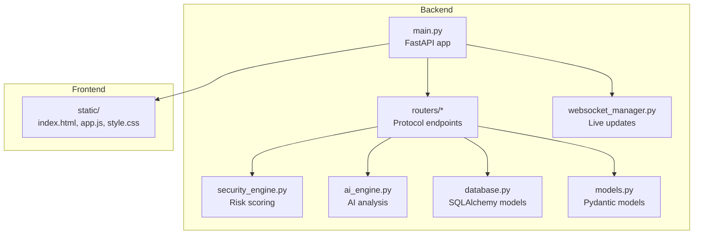

**Diagram sources**
- [main.py:1-106](file://backend/main.py#L1-L106)
- [routers/iot.py:1-880](file://backend/routers/iot.py#L1-L880)
- [security_engine.py:1-425](file://backend/security_engine.py#L1-L425)
- [ai_engine.py:1-766](file://backend/ai_engine.py#L1-L766)
- [database.py:1-80](file://backend/database.py#L1-L80)
- [websocket_manager.py:1-48](file://backend/websocket_manager.py#L1-L48)
- [models.py:1-71](file://backend/models.py#L1-L71)

**Section sources**
- [README.md:273-297](file://backend/README.md#L273-L297)
- [main.py:14-48](file://backend/main.py#L14-L48)

## Core Components
- Security Engine: Centralized risk calculation, vulnerability mapping, and remediation guidance across TCP/UDP ports, TLS/SSL, default credentials, and protocol-specific weaknesses.
- AI Engine: Pattern-based classification, anomaly detection, network-wide analysis, and predictive risk modeling.
- Access Control Router: RFID/NFC scanning, risk evaluation, and persistence.
- Wireless Router: Wi-Fi and Bluetooth scanning, TLS validation, deauthentication detection, and device discovery.
- IoT Router: Multi-protocol scanning (Zigbee, Thread/Matter, Z-Wave, LoRaWAN) with hardware detection and fallbacks.
- Reporting Router: Dashboard summary and PDF report generation.
- Database: ORM models for devices, vulnerabilities, RFID cards, and settings.
- WebSocket Manager: Broadcasts live scan events and device updates.

**Section sources**
- [security_engine.py:202-339](file://backend/security_engine.py#L202-L339)
- [ai_engine.py:236-740](file://backend/ai_engine.py#L236-L740)
- [routers/access_control.py:47-84](file://backend/routers/access_control.py#L47-L84)
- [routers/wifi_bt.py:65-96](file://backend/routers/wifi_bt.py#L65-L96)
- [routers/iot.py:158-181](file://backend/routers/iot.py#L158-L181)
- [routers/reports.py:18-34](file://backend/routers/reports.py#L18-L34)
- [database.py:12-61](file://backend/database.py#L12-L61)
- [websocket_manager.py:7-47](file://backend/websocket_manager.py#L7-L47)

## Architecture Overview
The system is a layered security architecture:
- Presentation Layer: FastAPI routes and static frontend
- Application Layer: Routers orchestrate scanning, risk assessment, AI analysis, and reporting
- Domain Layer: Security engine and AI engine encapsulate assessment logic
- Persistence Layer: SQLite via SQLAlchemy
- Communication Layer: WebSocket broadcasts for live updates

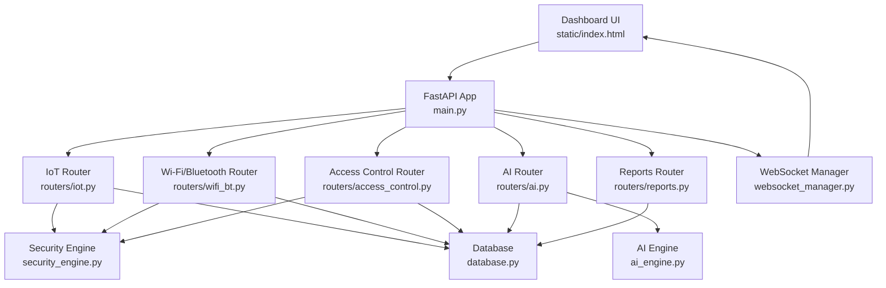

**Diagram sources**
- [main.py:14-48](file://backend/main.py#L14-L48)
- [routers/iot.py:24-48](file://backend/routers/iot.py#L24-L48)
- [routers/wifi_bt.py:27-27](file://backend/routers/wifi_bt.py#L27-L27)
- [routers/access_control.py:13-13](file://backend/routers/access_control.py#L13-L13)
- [routers/ai.py:20-20](file://backend/routers/ai.py#L20-L20)
- [routers/reports.py:15-15](file://backend/routers/reports.py#L15-L15)
- [security_engine.py:1-10](file://backend/security_engine.py#L1-L10)
- [ai_engine.py:1-13](file://backend/ai_engine.py#L1-L13)
- [database.py:1-10](file://backend/database.py#L1-L10)
- [websocket_manager.py:1-6](file://backend/websocket_manager.py#L1-L6)

## Detailed Component Analysis

### Security Engine: Risk Assessment and Vulnerability Mapping
The security engine computes risk scores from:
- Port-based risk (critical, high, medium)
- Default credentials checks
- Protocol-specific weaknesses (Zigbee, Matter, Bluetooth, RFID, Z-Wave, LoRaWAN)
- TLS/SSL issues
- Firmware/CVE matching

Risk calculation aggregates weighted contributions per vulnerability type and caps the score at 100. It also provides remediation guidance per vulnerability type.

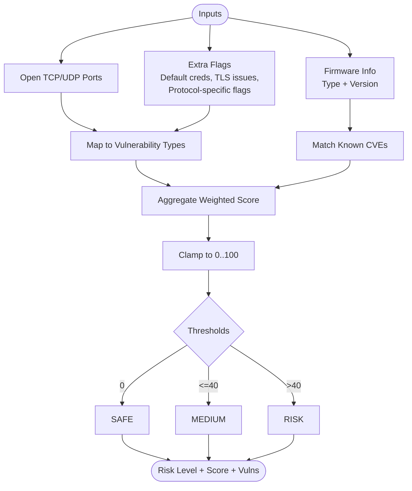

**Diagram sources**
- [security_engine.py:202-339](file://backend/security_engine.py#L202-L339)

**Section sources**
- [security_engine.py:16-188](file://backend/security_engine.py#L16-L188)
- [security_engine.py:202-339](file://backend/security_engine.py#L202-L339)
- [security_engine.py:342-389](file://backend/security_engine.py#L342-L389)
- [security_engine.py:392-424](file://backend/security_engine.py#L392-L424)

### AI Engine: Intelligent Analysis, Anomaly Detection, and Predictions
The AI engine performs:
- Device classification via keyword/port heuristics
- Predictive vulnerability scoring per device
- Network-wide pattern analysis and anomaly detection
- Confidence scoring for AI outputs
- Security score aggregation and trend prediction
- Smart dashboard suggestions

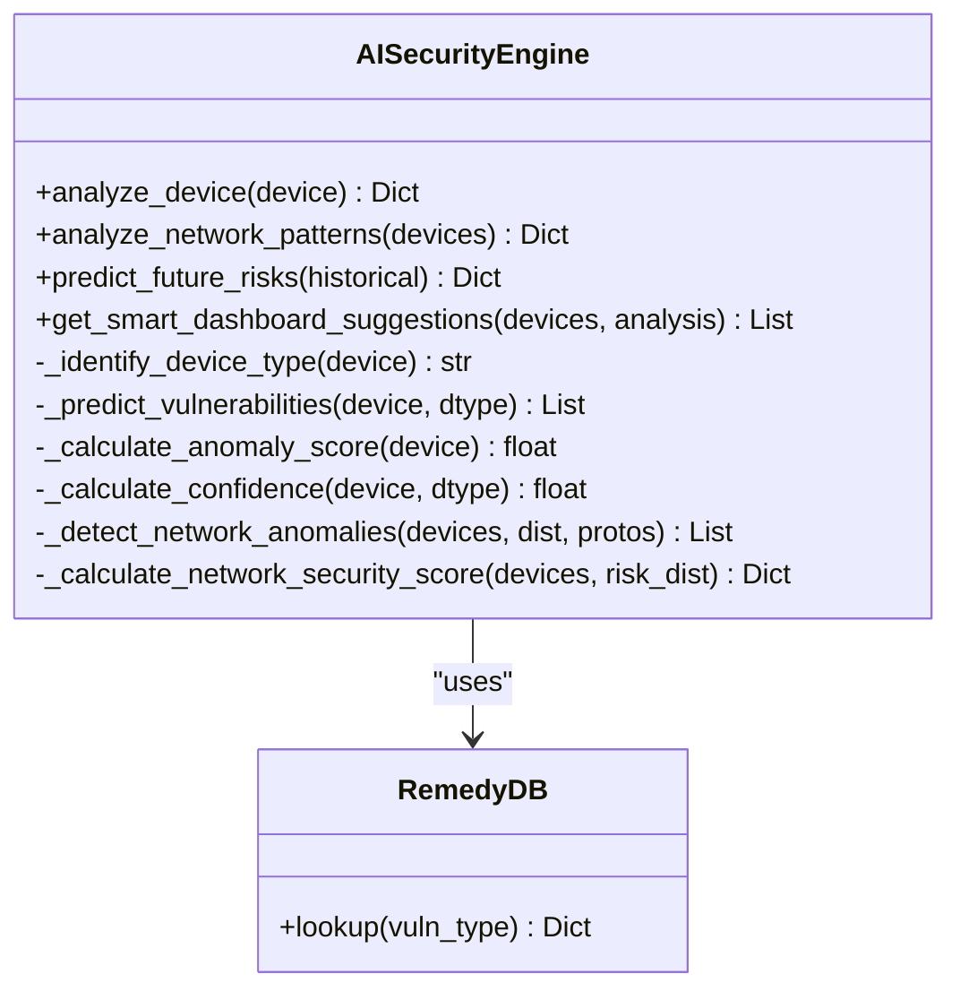

**Diagram sources**
- [ai_engine.py:236-740](file://backend/ai_engine.py#L236-L740)

**Section sources**
- [ai_engine.py:236-740](file://backend/ai_engine.py#L236-L740)
- [ai_engine.py:742-766](file://backend/ai_engine.py#L742-L766)

### Access Control Router: RFID/NFC Scanning and Risk Evaluation
The access control router integrates with serial RFID readers (or simulation) to:
- Read card identifiers and types
- Compute risk flags based on known weaknesses
- Persist card metadata and risk metrics
- Provide listing and cleanup endpoints

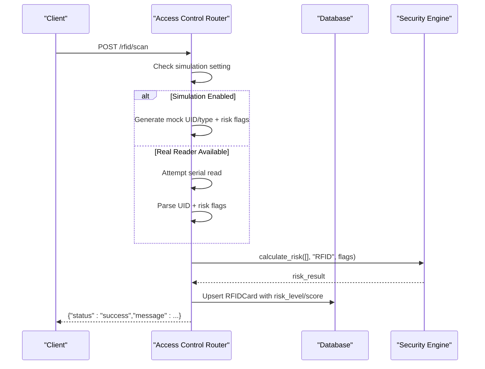

**Diagram sources**
- [routers/access_control.py:47-84](file://backend/routers/access_control.py#L47-L84)
- [security_engine.py:202-339](file://backend/security_engine.py#L202-L339)
- [database.py:44-55](file://backend/database.py#L44-L55)

**Section sources**
- [routers/access_control.py:15-84](file://backend/routers/access_control.py#L15-L84)
- [database.py:44-55](file://backend/database.py#L44-L55)

### Wireless Router: Wi-Fi, Bluetooth, TLS Validation, and Deauthentication Monitoring
Key capabilities:
- Port scanning and vulnerability enumeration
- Default credential testing
- TLS/SSL certificate validation and risk updates
- BLE device discovery and risk tagging
- Wi-Fi SSID discovery across platforms
- Deauthentication attack detection (requires optional tools)

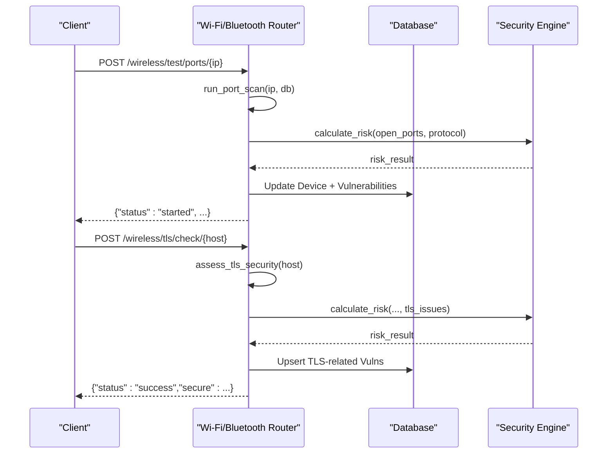

**Diagram sources**
- [routers/wifi_bt.py:65-96](file://backend/routers/wifi_bt.py#L65-L96)
- [routers/wifi_bt.py:447-549](file://backend/routers/wifi_bt.py#L447-L549)
- [security_engine.py:202-339](file://backend/security_engine.py#L202-L339)
- [database.py:12-41](file://backend/database.py#L12-L41)

**Section sources**
- [routers/wifi_bt.py:65-96](file://backend/routers/wifi_bt.py#L65-L96)
- [routers/wifi_bt.py:107-167](file://backend/routers/wifi_bt.py#L107-L167)
- [routers/wifi_bt.py:447-549](file://backend/routers/wifi_bt.py#L447-L549)
- [routers/wifi_bt.py:582-631](file://backend/routers/wifi_bt.py#L582-L631)

### IoT Router: Multi-Protocol Scanning and Hardware Interaction
The IoT router orchestrates:
- Wi-Fi network discovery and scanning
- mDNS-based Matter discovery
- Zigbee, Thread/Matter, Z-Wave, and LoRaWAN scanning with real hardware or simulations
- Hardware detection and dongle validation
- Live scan progress broadcasting via WebSocket

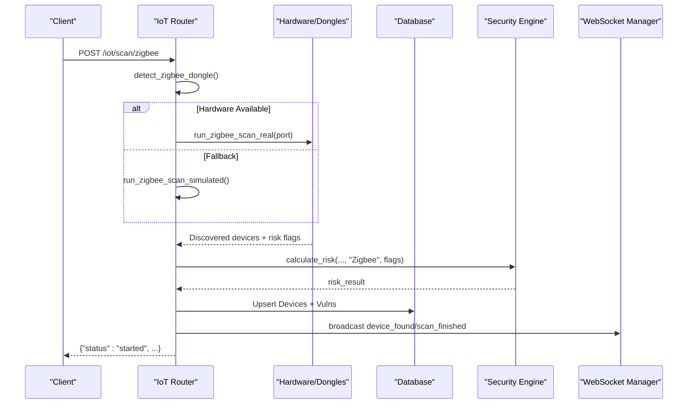

**Diagram sources**
- [routers/iot.py:483-550](file://backend/routers/iot.py#L483-L550)
- [routers/iot.py:552-586](file://backend/routers/iot.py#L552-L586)
- [routers/iot.py:625-722](file://backend/routers/iot.py#L625-L722)
- [routers/iot.py:158-181](file://backend/routers/iot.py#L158-L181)
- [security_engine.py:202-339](file://backend/security_engine.py#L202-L339)
- [websocket_manager.py:21-46](file://backend/websocket_manager.py#L21-L46)

**Section sources**
- [routers/iot.py:483-550](file://backend/routers/iot.py#L483-L550)
- [routers/iot.py:552-586](file://backend/routers/iot.py#L552-L586)
- [routers/iot.py:625-722](file://backend/routers/iot.py#L625-L722)
- [routers/iot.py:158-181](file://backend/routers/iot.py#L158-L181)
- [test_dongles.py:14-132](file://backend/test_dongles.py#L14-L132)

### Authentication and Authorization
- Basic login endpoint validates credentials loaded from environment variables.
- CORS middleware configured broadly for development; production deployments should tighten origins.
- No session management or token refresh is implemented; credentials are checked per request.

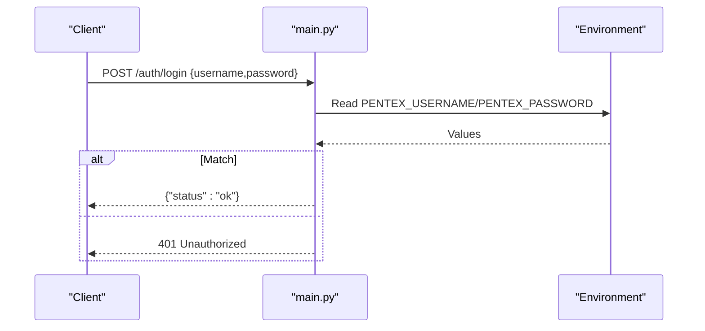

**Diagram sources**
- [main.py:29-74](file://backend/main.py#L29-L74)

**Section sources**
- [main.py:23-32](file://backend/main.py#L23-L32)
- [main.py:70-74](file://backend/main.py#L70-L74)

### Security Monitoring, Alerting, and Live Updates
- WebSocket endpoint maintains persistent connections and sends periodic heartbeats.
- Background tasks broadcast scan progress, discovered devices, and completion events.
- Deauthentication detection monitors for specific frames and tracks alerts.

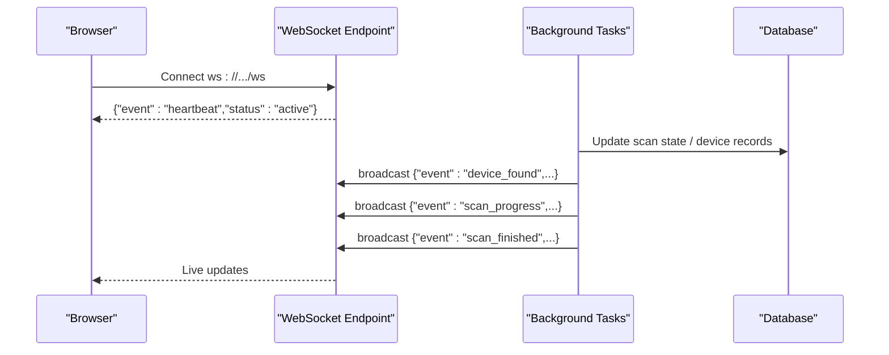

**Diagram sources**
- [main.py:90-102](file://backend/main.py#L90-L102)
- [websocket_manager.py:7-47](file://backend/websocket_manager.py#L7-L47)
- [routers/wifi_bt.py:691-765](file://backend/routers/wifi_bt.py#L691-L765)
- [routers/iot.py:300-413](file://backend/routers/iot.py#L300-L413)

**Section sources**
- [main.py:90-102](file://backend/main.py#L90-L102)
- [websocket_manager.py:7-47](file://backend/websocket_manager.py#L7-L47)
- [routers/wifi_bt.py:582-631](file://backend/routers/wifi_bt.py#L582-L631)

### Reporting and Compliance
- Dashboard summary endpoint aggregates counts by risk level.
- PDF report generator compiles device inventory, vulnerability details, and remediation guidance.
- Compliance considerations emphasize changing default credentials, enabling firewalls, and using HTTPS in production.

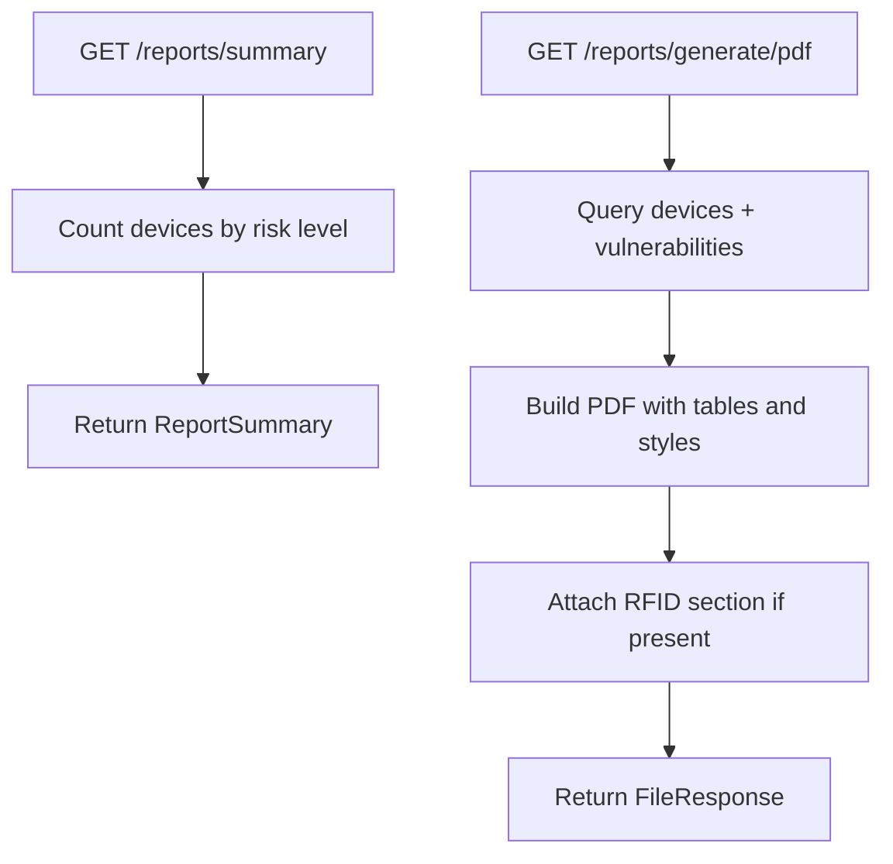

**Diagram sources**
- [routers/reports.py:18-34](file://backend/routers/reports.py#L18-L34)
- [routers/reports.py:37-157](file://backend/routers/reports.py#L37-L157)

**Section sources**
- [routers/reports.py:18-34](file://backend/routers/reports.py#L18-L34)
- [routers/reports.py:37-157](file://backend/routers/reports.py#L37-L157)
- [README.md:308-346](file://backend/README.md#L308-L346)

## Dependency Analysis
External dependencies include FastAPI, Nmap, Scapy, Zeroconf, ReportLab, BLEAK, PySerial, optional KillerBee for Zigbee, and cryptography for TLS parsing.

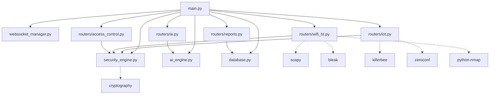

**Diagram sources**
- [requirements.txt:1-21](file://backend/requirements.txt#L1-L21)
- [main.py:14-48](file://backend/main.py#L14-L48)
- [routers/iot.py:7-24](file://backend/routers/iot.py#L7-L24)
- [routers/wifi_bt.py:17-27](file://backend/routers/wifi_bt.py#L17-L27)
- [security_engine.py:342-389](file://backend/security_engine.py#L342-L389)

**Section sources**
- [requirements.txt:1-21](file://backend/requirements.txt#L1-L21)

## Performance Considerations
- Scanning tasks run in background threads; ensure adequate CPU/memory for concurrent scans.
- WebSocket broadcasting uses a thread-safe coroutine path; avoid excessive event volume.
- Real hardware scanning (Zigbee, Thread/Matter, Z-Wave) benefits from powered USB hubs and proper permissions.
- On Raspberry Pi, reduce GPU memory and disable unused services to optimize headless operation.

[No sources needed since this section provides general guidance]

## Troubleshooting Guide
Common issues and resolutions:
- Dashboard not accessible: verify service status, firewall rules, and port binding.
- USB dongle not detected: check permissions, serial device presence, and kernel messages.
- Bluetooth scanning failures: restart Bluetooth service and unblock interfaces.
- Wi-Fi scanning problems: ensure interface availability and temporarily disable conflicting radios.
- Service startup failures: review logs and check for port conflicts.

**Section sources**
- [RASPBERRY_PI_GUIDE.md:402-526](file://backend/RASPBERRY_PI_GUIDE.md#L402-L526)
- [HARDWARE_GUIDE.md:252-309](file://backend/HARDWARE_GUIDE.md#L252-L309)

## Conclusion
PentexOne’s architecture combines deterministic security assessment with AI-driven insights, real-time monitoring, and practical remediation guidance. Its layered design—security engine, AI engine, routers, database, and WebSocket—enables robust multi-protocol scanning and hardware interaction while maintaining a clear separation of concerns. For production, enforce strong authentication, tighten CORS, enable HTTPS, and regularly update dependencies.

[No sources needed since this section summarizes without analyzing specific files]

## Appendices

### Security Data Model
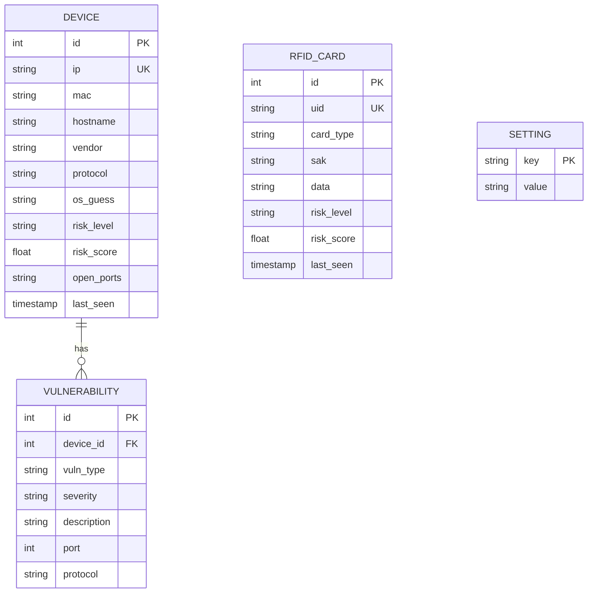

**Diagram sources**
- [database.py:12-61](file://backend/database.py#L12-L61)

### Multi-Protocol Scanning Implications
- Wi-Fi: Requires elevated privileges for raw scanning; ensure legal authorization.
- Bluetooth: BLE scanning depends on platform support and permissions.
- Zigbee/Thread/Z-Wave: Hardware dongles required; permissions and drivers critical.
- LoRaWAN: Experimental support; limited by radio hardware and regulatory constraints.

**Section sources**
- [README.md:37-46](file://backend/README.md#L37-L46)
- [HARDWARE_GUIDE.md:46-123](file://backend/HARDWARE_GUIDE.md#L46-L123)
- [routers/iot.py:483-550](file://backend/routers/iot.py#L483-L550)