# System Architecture

<cite>
**Referenced Files in This Document**
- [backend/main.py](file://backend/main.py)
- [backend/database.py](file://backend/database.py)
- [backend/models.py](file://backend/models.py)
- [backend/websocket_manager.py](file://backend/websocket_manager.py)
- [backend/security_engine.py](file://backend/security_engine.py)
- [backend/routers/iot.py](file://backend/routers/iot.py)
- [backend/routers/wifi_bt.py](file://backend/routers/wifi_bt.py)
- [backend/routers/access_control.py](file://backend/routers/access_control.py)
- [backend/routers/reports.py](file://backend/routers/reports.py)
- [backend/routers/ai.py](file://backend/routers/ai.py)
- [backend/requirements.txt](file://backend/requirements.txt)
- [backend/HARDWARE_GUIDE.md](file://backend/HARDWARE_GUIDE.md)
- [backend/RASPBERRY_PI_GUIDE.md](file://backend/RASPBERRY_PI_GUIDE.md)
- [backend/README.md](file://backend/README.md)
</cite>

## Table of Contents
1. [Introduction](#introduction)
2. [Project Structure](#project-structure)
3. [Core Components](#core-components)
4. [Architecture Overview](#architecture-overview)
5. [Detailed Component Analysis](#detailed-component-analysis)
6. [Dependency Analysis](#dependency-analysis)
7. [Performance Considerations](#performance-considerations)
8. [Troubleshooting Guide](#troubleshooting-guide)
9. [Conclusion](#conclusion)
10. [Appendices](#appendices)

## Introduction
PentexOne is an IoT security platform that combines a FastAPI backend, a real-time web dashboard, and a modular router architecture to scan, analyze, and report on IoT devices across Wi‑Fi, Bluetooth, Zigbee, Thread/Matter, Z‑Wave, LoRaWAN, and RFID/NFC domains. It integrates security engines for risk scoring and AI-powered analysis, with optional hardware dongles and native Raspberry Pi deployment. The system emphasizes real-time updates via WebSockets, a SQLite-backed ORM, and extensible protocol support.

## Project Structure
The backend follows a FastAPI modular design with clearly separated routers for distinct functional domains. Supporting components include a database layer, a WebSocket manager, and a security engine. The frontend assets are served statically from the backend.

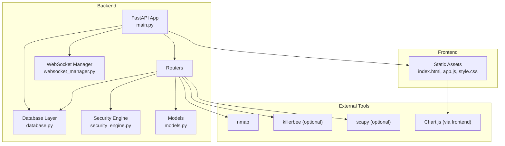

**Diagram sources**
- [backend/main.py:1-106](file://backend/main.py#L1-L106)
- [backend/database.py:1-80](file://backend/database.py#L1-L80)
- [backend/websocket_manager.py:1-48](file://backend/websocket_manager.py#L1-L48)
- [backend/security_engine.py:1-425](file://backend/security_engine.py#L1-L425)
- [backend/models.py:1-71](file://backend/models.py#L1-L71)

**Section sources**
- [backend/README.md:273-297](file://backend/README.md#L273-L297)

## Core Components
- FastAPI Application: Central entrypoint with CORS middleware, static file mounting, authentication, and WebSocket endpoint. It wires modular routers and exposes settings endpoints.
- Modular Routers: Feature-specific routers for IoT scanning, Wi‑Fi/Bluetooth, access control (RFID/NFC), AI analysis, and reporting.
- Database Layer: SQLAlchemy ORM with SQLite, modeling devices, vulnerabilities, RFID cards, and settings.
- WebSocket Manager: Connection lifecycle management and broadcast to clients for live updates.
- Security Engine: Risk calculation, vulnerability mapping, and remediation guidance across protocols.
- AI Engine: AI-powered analysis, security scoring, and recommendations (exposed via AI router).
- Frontend Dashboard: Static HTML/CSS/JS served by FastAPI, integrating Chart.js for analytics.

**Section sources**
- [backend/main.py:14-48](file://backend/main.py#L14-L48)
- [backend/main.py:66-82](file://backend/main.py#L66-L82)
- [backend/database.py:12-61](file://backend/database.py#L12-L61)
- [backend/websocket_manager.py:7-47](file://backend/websocket_manager.py#L7-L47)
- [backend/security_engine.py:202-339](file://backend/security_engine.py#L202-L339)
- [backend/routers/ai.py:20](file://backend/routers/ai.py#L20)

## Architecture Overview
The system is organized around a central FastAPI application that orchestrates:
- Authentication and settings management
- Modular scanning routes per protocol
- Real-time updates via WebSocket
- Persistent storage via SQLAlchemy
- AI-driven insights and reporting

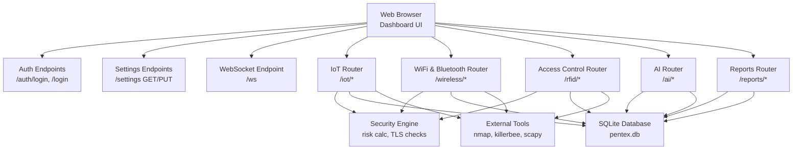

**Diagram sources**
- [backend/main.py:70-101](file://backend/main.py#L70-L101)
- [backend/routers/iot.py:24-48](file://backend/routers/iot.py#L24-L48)
- [backend/routers/wifi_bt.py:27-27](file://backend/routers/wifi_bt.py#L27-L27)
- [backend/routers/access_control.py:13-13](file://backend/routers/access_control.py#L13-L13)
- [backend/routers/ai.py:20-20](file://backend/routers/ai.py#L20-L20)
- [backend/routers/reports.py:15-15](file://backend/routers/reports.py#L15-L15)
- [backend/database.py:69-80](file://backend/database.py#L69-L80)

## Detailed Component Analysis

### FastAPI Application and Routing
- Registers CORS, mounts static files for the dashboard, defines authentication, and exposes settings endpoints.
- Includes modular routers for IoT, access control, Wi‑Fi/Bluetooth, AI, and reports.
- Provides a heartbeat WebSocket endpoint for client connectivity.

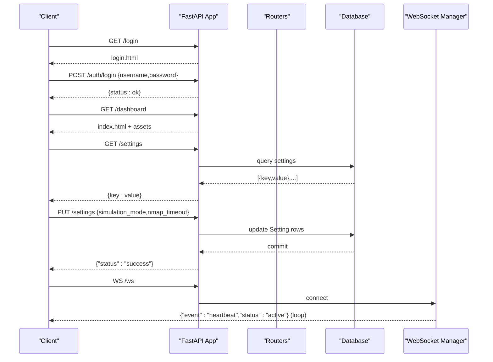

**Diagram sources**
- [backend/main.py:70-101](file://backend/main.py#L70-L101)
- [backend/main.py:50-64](file://backend/main.py#L50-L64)
- [backend/main.py:66-82](file://backend/main.py#L66-L82)

**Section sources**
- [backend/main.py:14-48](file://backend/main.py#L14-L48)
- [backend/main.py:50-64](file://backend/main.py#L50-L64)
- [backend/main.py:70-101](file://backend/main.py#L70-L101)

### Database Design and Models
- Core entities: Device, Vulnerability, RFIDCard, Setting.
- Relationships: Device has many Vulnerabilities; Device and RFIDCard are independent.
- Initialization ensures tables and default settings are created on startup.

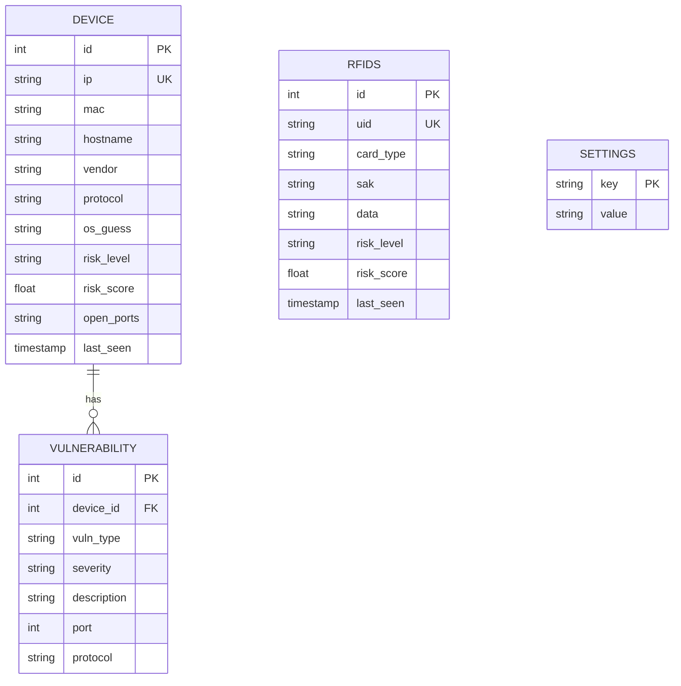

**Diagram sources**
- [backend/database.py:12-61](file://backend/database.py#L12-L61)

**Section sources**
- [backend/database.py:69-80](file://backend/database.py#L69-L80)
- [backend/models.py:6-71](file://backend/models.py#L6-L71)

### Security Engine
- Computes risk scores from open ports, protocol-specific flags, default credentials, firmware CVE matches, and TLS issues.
- Provides remediation guidance per vulnerability type.

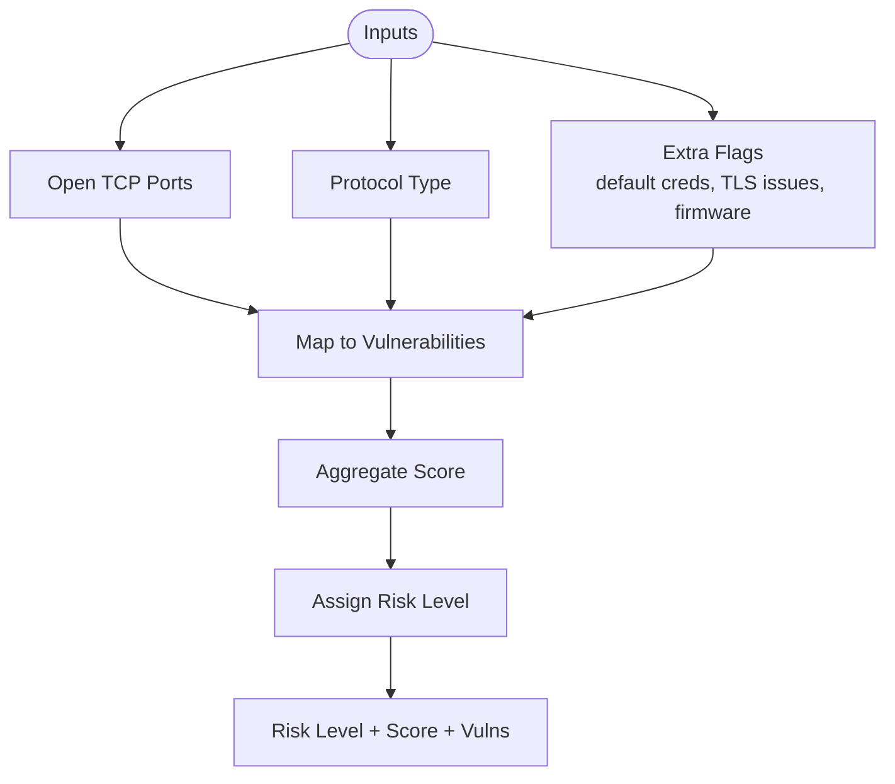

**Diagram sources**
- [backend/security_engine.py:202-339](file://backend/security_engine.py#L202-L339)

**Section sources**
- [backend/security_engine.py:202-339](file://backend/security_engine.py#L202-L339)

### IoT Scanning Pipeline (Wi‑Fi, Zigbee, Thread/Matter, Z‑Wave, LoRaWAN)
- Wi‑Fi: Uses nmap to discover hosts and services; calculates risk and persists results.
- Zigbee/Thread/Z‑Wave/LoRaWAN: Supports real hardware via KillerBee, nRF52840, serial ports; falls back to simulated scans when hardware is unavailable.
- Real-time updates: Broadcasts scan progress and discovered devices via WebSocket.

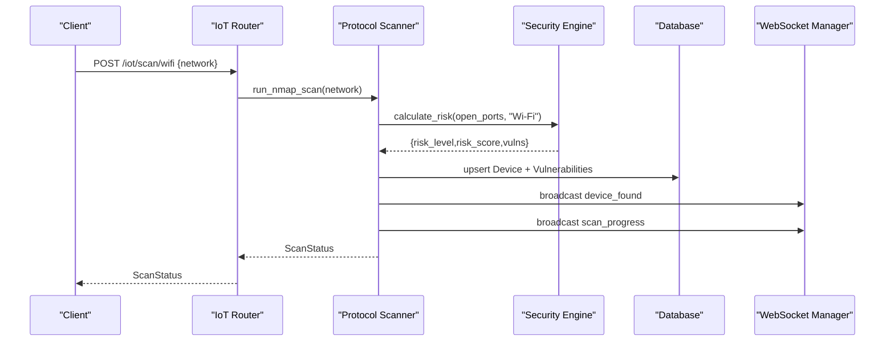

**Diagram sources**
- [backend/routers/iot.py:291-413](file://backend/routers/iot.py#L291-L413)
- [backend/security_engine.py:202-339](file://backend/security_engine.py#L202-L339)
- [backend/websocket_manager.py:21-46](file://backend/websocket_manager.py#L21-L46)

**Section sources**
- [backend/routers/iot.py:291-413](file://backend/routers/iot.py#L291-L413)
- [backend/routers/iot.py:483-586](file://backend/routers/iot.py#L483-L586)
- [backend/routers/iot.py:625-722](file://backend/routers/iot.py#L625-L722)
- [backend/routers/iot.py:727-778](file://backend/routers/iot.py#L727-L778)
- [backend/routers/iot.py:783-800](file://backend/routers/iot.py#L783-L800)

### Wi‑Fi and Bluetooth Deep Analysis
- Port scanning, default credential testing, TLS certificate validation, BLE device discovery, SSID enumeration, and deauthentication attack monitoring (with scapy/tcpdump).

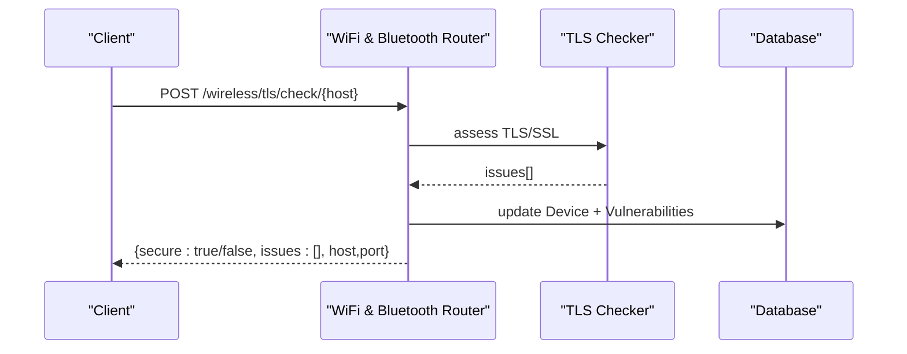

**Diagram sources**
- [backend/routers/wifi_bt.py:447-549](file://backend/routers/wifi_bt.py#L447-L549)

**Section sources**
- [backend/routers/wifi_bt.py:59-176](file://backend/routers/wifi_bt.py#L59-L176)
- [backend/routers/wifi_bt.py:182-240](file://backend/routers/wifi_bt.py#L182-L240)
- [backend/routers/wifi_bt.py:245-442](file://backend/routers/wifi_bt.py#L245-L442)
- [backend/routers/wifi_bt.py:447-549](file://backend/routers/wifi_bt.py#L447-L549)
- [backend/routers/wifi_bt.py:555-631](file://backend/routers/wifi_bt.py#L555-L631)
- [backend/routers/wifi_bt.py:636-766](file://backend/routers/wifi_bt.py#L636-L766)

### Access Control (RFID/NFC)
- Reads RFID cards via serial or simulation, computes risk, and persists results.

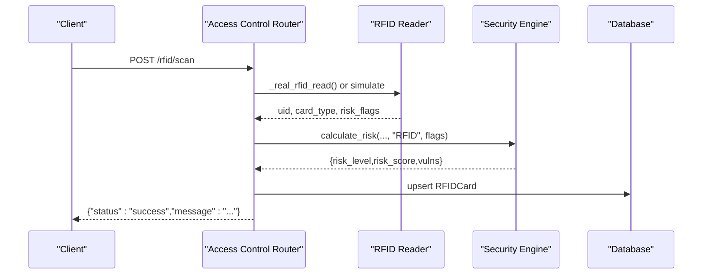

**Diagram sources**
- [backend/routers/access_control.py:47-84](file://backend/routers/access_control.py#L47-L84)

**Section sources**
- [backend/routers/access_control.py:15-84](file://backend/routers/access_control.py#L15-L84)

### AI Analysis and Recommendations
- Provides device-level and network-level analysis, security scoring, suggestions, and remediation guides.

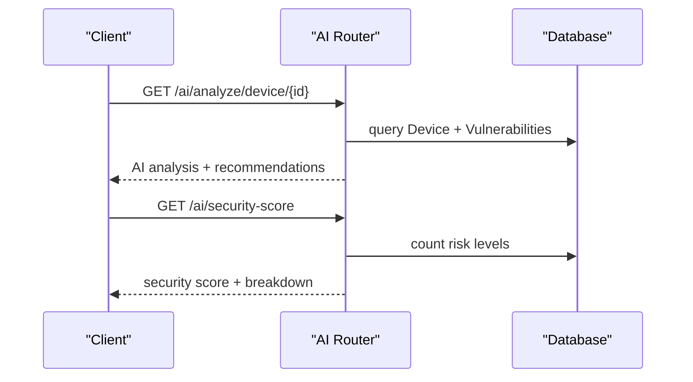

**Diagram sources**
- [backend/routers/ai.py:26-100](file://backend/routers/ai.py#L26-L100)
- [backend/routers/ai.py:270-330](file://backend/routers/ai.py#L270-L330)

**Section sources**
- [backend/routers/ai.py:26-100](file://backend/routers/ai.py#L26-L100)
- [backend/routers/ai.py:175-221](file://backend/routers/ai.py#L175-L221)
- [backend/routers/ai.py:270-330](file://backend/routers/ai.py#L270-L330)

### Reporting and Export
- Generates PDF reports with device inventory, vulnerability analysis, and remediation guidance.

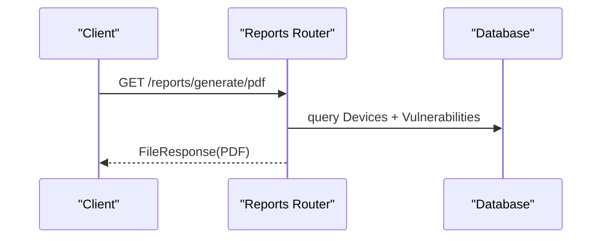

**Diagram sources**
- [backend/routers/reports.py:37-158](file://backend/routers/reports.py#L37-L158)

**Section sources**
- [backend/routers/reports.py:18-34](file://backend/routers/reports.py#L18-L34)
- [backend/routers/reports.py:37-158](file://backend/routers/reports.py#L37-L158)

### Hardware Abstraction and Integration
- Hardware detection helpers identify Zigbee, Thread/Matter, Z‑Wave, and Bluetooth adapters.
- Optional tools: KillerBee for Zigbee, scapy/tcpdump for packet capture, nmap for scanning.
- Raspberry Pi deployment guide and hardware compatibility are documented.

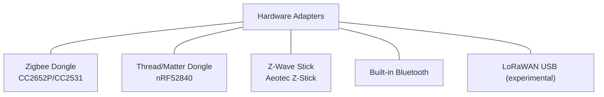

**Diagram sources**
- [backend/routers/iot.py:27-156](file://backend/routers/iot.py#L27-L156)
- [backend/HARDWARE_GUIDE.md:46-123](file://backend/HARDWARE_GUIDE.md#L46-L123)

**Section sources**
- [backend/routers/iot.py:27-156](file://backend/routers/iot.py#L27-L156)
- [backend/HARDWARE_GUIDE.md:46-123](file://backend/HARDWARE_GUIDE.md#L46-L123)
- [backend/RASPBERRY_PI_GUIDE.md:194-211](file://backend/RASPBERRY_PI_GUIDE.md#L194-L211)

## Dependency Analysis
External dependencies include FastAPI, Uvicorn, websockets, nmap, scapy, zeroconf, reportlab, aiofiles, SQLAlchemy, bleach, pyserial, killerbee, cryptography, and optional protocol libraries.

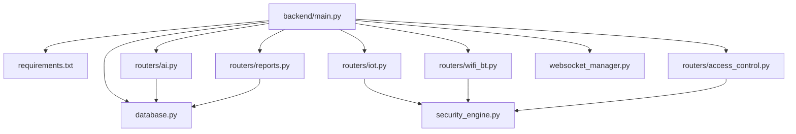

**Diagram sources**
- [backend/requirements.txt:1-21](file://backend/requirements.txt#L1-L21)
- [backend/main.py:14-48](file://backend/main.py#L14-L48)

**Section sources**
- [backend/requirements.txt:1-21](file://backend/requirements.txt#L1-L21)

## Performance Considerations
- Scanning intensity: Wi‑Fi scans with nmap can be CPU-intensive; consider prioritizing scans and batching updates.
- WebSocket broadcasting: Ensure efficient broadcast scheduling to avoid overload during mass device discovery.
- Database writes: Batch commits and use upsert patterns to reduce overhead.
- Hardware constraints: On Raspberry Pi, prefer Ethernet over Wi‑Fi for stability; use powered USB hubs; monitor CPU/memory during concurrent protocol scans.
- TLS checks: Limit frequency of certificate validations to reduce network overhead.

[No sources needed since this section provides general guidance]

## Troubleshooting Guide
Common issues and resolutions:
- Cannot access dashboard: verify service status, firewall rules, and port binding.
- USB dongle not detected: check permissions, kernel messages, and serial device presence.
- Bluetooth not working: restart Bluetooth service and unblock devices.
- Wi‑Fi scanning problems: ensure interface availability and temporary disconnection from Wi‑Fi during passive scans.
- Service startup failures: review logs and dependency installation.

**Section sources**
- [backend/RASPBERRY_PI_GUIDE.md:402-526](file://backend/RASPBERRY_PI_GUIDE.md#L402-L526)
- [backend/HARDWARE_GUIDE.md:252-310](file://backend/HARDWARE_GUIDE.md#L252-L310)

## Conclusion
PentexOne provides a modular, extensible IoT security platform with real-time visibility, robust risk scoring, and actionable AI insights. Its FastAPI-based backend, SQLite-backed persistence, and WebSocket-driven dashboard enable practical deployments—especially on Raspberry Pi—with optional hardware support for multiple protocols.

## Appendices

### System Boundaries and Integration Points
- Internal: FastAPI app, routers, database, WebSocket manager, security engine, AI engine.
- External: nmap, killerbee, scapy, Chart.js (frontend), hardware dongles.

**Section sources**
- [backend/README.md:182-212](file://backend/README.md#L182-L212)
- [backend/requirements.txt:1-21](file://backend/requirements.txt#L1-L21)