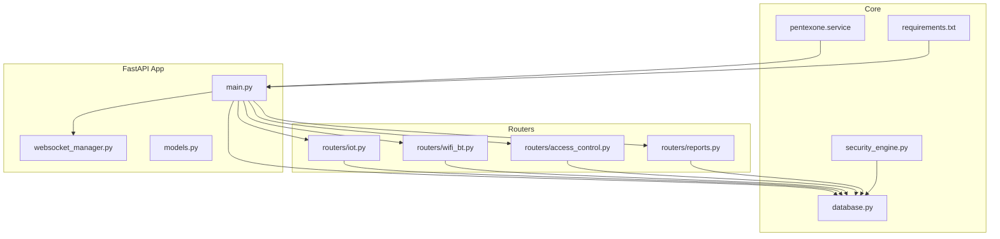
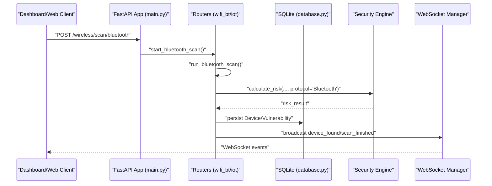
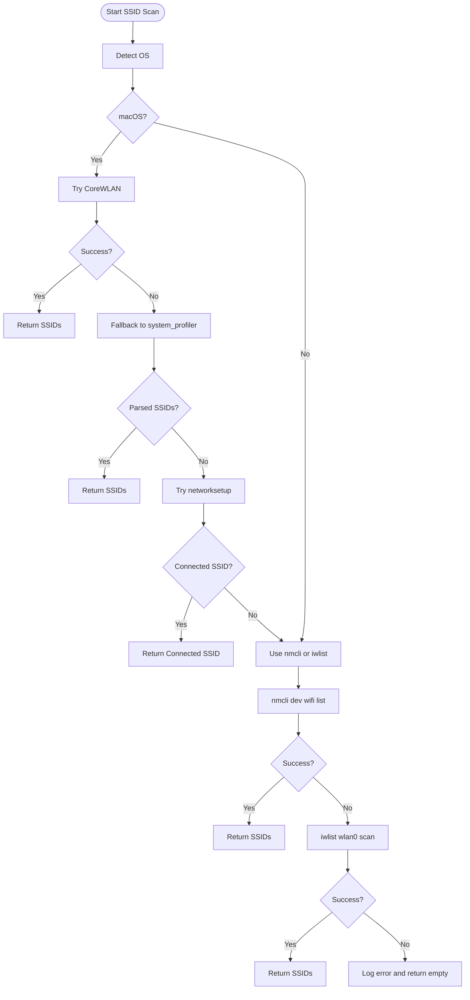
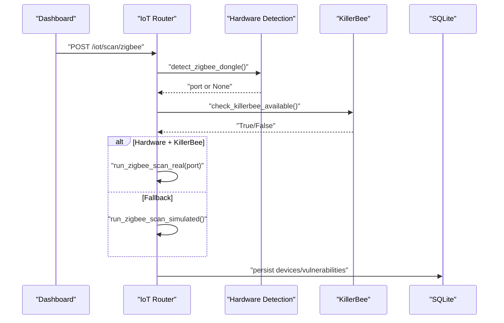
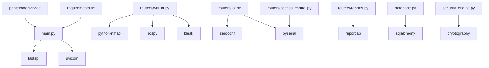

# Troubleshooting Guide

<cite>
**Referenced Files in This Document**
- [backend/main.py](file://backend/main.py)
- [backend/database.py](file://backend/database.py)
- [backend/websocket_manager.py](file://backend/websocket_manager.py)
- [backend/security_engine.py](file://backend/security_engine.py)
- [backend/routers/wifi_bt.py](file://backend/routers/wifi_bt.py)
- [backend/routers/iot.py](file://backend/routers/iot.py)
- [backend/routers/access_control.py](file://backend/routers/access_control.py)
- [backend/routers/reports.py](file://backend/routers/reports.py)
- [backend/models.py](file://backend/models.py)
- [backend/requirements.txt](file://backend/requirements.txt)
- [backend/pentexone.service](file://backend/pentexone.service)
- [backend/HARDWARE_GUIDE.md](file://backend/HARDWARE_GUIDE.md)
- [backend/RASPBERRY_PI_GUIDE.md](file://backend/RASPBERRY_PI_GUIDE.md)
- [backend/DEPLOYMENT_CHECKLIST.md](file://backend/DEPLOYMENT_CHECKLIST.md)
- [backend/test_dongles.py](file://backend/test_dongles.py)
</cite>

## Table of Contents
1. [Introduction](#introduction)
2. [Project Structure](#project-structure)
3. [Core Components](#core-components)
4. [Architecture Overview](#architecture-overview)
5. [Detailed Component Analysis](#detailed-component-analysis)
6. [Dependency Analysis](#dependency-analysis)
7. [Performance Considerations](#performance-considerations)
8. [Troubleshooting Guide](#troubleshooting-guide)
9. [Recovery Procedures](#recovery-procedures)
10. [Escalation and Support](#escalation-and-support)
11. [Conclusion](#conclusion)

## Introduction
This Troubleshooting Guide provides practical diagnostics and resolutions for the PentexOne IoT Security Platform. It focuses on hardware detection, Bluetooth connectivity, USB permission errors, network scanning failures, performance tuning, firewall and service startup issues, and recovery procedures for corrupted databases and failed updates. The guide includes systematic diagnostic steps, log analysis techniques, and debugging methodologies tailored to the platform’s FastAPI backend, SQLite database, and protocol-specific routers.

## Project Structure
The backend is organized around a FastAPI application with modular routers for Wi-Fi/Bluetooth, IoT protocols (Zigbee, Thread/Matter, Z-Wave, LoRaWAN), RFID access control, and reporting. A central WebSocket manager broadcasts scan progress and results. The security engine evaluates risks and vulnerabilities, while the database module defines models and initializes the SQLite database.

**Diagram sources**
- [backend/main.py:1-106](file://backend/main.py#L1-L106)
- [backend/websocket_manager.py:1-48](file://backend/websocket_manager.py#L1-L48)
- [backend/routers/wifi_bt.py:1-766](file://backend/routers/wifi_bt.py#L1-L766)
- [backend/routers/iot.py:1-880](file://backend/routers/iot.py#L1-L880)
- [backend/routers/access_control.py:1-95](file://backend/routers/access_control.py#L1-L95)
- [backend/routers/reports.py:1-158](file://backend/routers/reports.py#L1-L158)
- [backend/database.py:1-80](file://backend/database.py#L1-L80)
- [backend/security_engine.py:1-425](file://backend/security_engine.py#L1-L425)
- [backend/requirements.txt:1-21](file://backend/requirements.txt#L1-L21)
- [backend/pentexone.service:1-25](file://backend/pentexone.service#L1-L25)

**Section sources**
- [backend/main.py:1-106](file://backend/main.py#L1-L106)
- [backend/database.py:1-80](file://backend/database.py#L1-L80)

## Core Components
- FastAPI application with CORS middleware, static file mounting, authentication endpoint, and WebSocket heartbeat.
- Database initialization and models for devices, vulnerabilities, RFID cards, and settings.
- WebSocket manager for broadcasting scan progress and events.
- Security engine for risk calculation, vulnerability mapping, and TLS assessment.
- Routers for Wi-Fi/Bluetooth scanning, IoT protocol discovery, RFID access control, and report generation.

Key implementation references:
- Application lifecycle and routes: [backend/main.py:1-106](file://backend/main.py#L1-L106)
- Database models and initialization: [backend/database.py:1-80](file://backend/database.py#L1-L80)
- WebSocket manager: [backend/websocket_manager.py:1-48](file://backend/websocket_manager.py#L1-L48)
- Security engine: [backend/security_engine.py:1-425](file://backend/security_engine.py#L1-L425)
- Wi-Fi/Bluetooth router: [backend/routers/wifi_bt.py:1-766](file://backend/routers/wifi_bt.py#L1-L766)
- IoT router: [backend/routers/iot.py:1-880](file://backend/routers/iot.py#L1-L880)
- Access control router: [backend/routers/access_control.py:1-95](file://backend/routers/access_control.py#L1-L95)
- Reports router: [backend/routers/reports.py:1-158](file://backend/routers/reports.py#L1-L158)
- Models: [backend/models.py:1-71](file://backend/models.py#L1-L71)

**Section sources**
- [backend/main.py:1-106](file://backend/main.py#L1-L106)
- [backend/database.py:1-80](file://backend/database.py#L1-L80)
- [backend/websocket_manager.py:1-48](file://backend/websocket_manager.py#L1-L48)
- [backend/security_engine.py:1-425](file://backend/security_engine.py#L1-L425)
- [backend/routers/wifi_bt.py:1-766](file://backend/routers/wifi_bt.py#L1-L766)
- [backend/routers/iot.py:1-880](file://backend/routers/iot.py#L1-L880)
- [backend/routers/access_control.py:1-95](file://backend/routers/access_control.py#L1-L95)
- [backend/routers/reports.py:1-158](file://backend/routers/reports.py#L1-L158)
- [backend/models.py:1-71](file://backend/models.py#L1-L71)

## Architecture Overview
The system architecture centers on a FastAPI application exposing REST endpoints and a WebSocket endpoint for live scan updates. Background tasks trigger protocol-specific scans, which update the SQLite database and broadcast progress via WebSocket. The security engine computes risk scores and vulnerability listings.

**Diagram sources**
- [backend/main.py:1-106](file://backend/main.py#L1-L106)
- [backend/routers/wifi_bt.py:180-240](file://backend/routers/wifi_bt.py#L180-L240)
- [backend/database.py:12-67](file://backend/database.py#L12-L67)
- [backend/security_engine.py:202-339](file://backend/security_engine.py#L202-L339)
- [backend/websocket_manager.py:21-46](file://backend/websocket_manager.py#L21-L46)

**Section sources**
- [backend/main.py:85-102](file://backend/main.py#L85-L102)
- [backend/routers/wifi_bt.py:180-240](file://backend/routers/wifi_bt.py#L180-L240)
- [backend/database.py:12-67](file://backend/database.py#L12-L67)
- [backend/security_engine.py:202-339](file://backend/security_engine.py#L202-L339)
- [backend/websocket_manager.py:21-46](file://backend/websocket_manager.py#L21-L46)

## Detailed Component Analysis

### Wi-Fi and Bluetooth Router (Networking and BLE)
Common issues:
- SSID scanning failures on macOS due to privacy redactions.
- Wi-Fi scanning requiring exclusive interface access.
- BLE scanner availability and timeouts.
- TLS certificate checks failing due to network conditions.

Diagnostic steps:
- Verify SSID scan fallbacks and error logging paths.
- Confirm Wi-Fi interface state and permissions before scanning.
- Validate BLE library presence and permissions.
- Inspect TLS certificate parsing and connection timeouts.

**Diagram sources**
- [backend/routers/wifi_bt.py:245-442](file://backend/routers/wifi_bt.py#L245-L442)

**Section sources**
- [backend/routers/wifi_bt.py:245-442](file://backend/routers/wifi_bt.py#L245-L442)

### IoT Protocol Router (Zigbee, Thread/Matter, Z-Wave, LoRaWAN)
Common issues:
- Missing hardware dongles or permissions.
- KillerBee library absence for real Zigbee scanning.
- Thread discovery relying on external tools availability.
- Z-Wave serial communication timing.

Diagnostic steps:
- Use hardware detection helpers to confirm dongle presence.
- Check for KillerBee availability and fallback to simulated scans.
- Validate serial port permissions and device enumeration.
- Ensure external tools (e.g., chip-tool) are installed for Thread.

**Diagram sources**
- [backend/routers/iot.py:483-550](file://backend/routers/iot.py#L483-L550)
- [backend/routers/iot.py:552-586](file://backend/routers/iot.py#L552-L586)

**Section sources**
- [backend/routers/iot.py:26-157](file://backend/routers/iot.py#L26-L157)
- [backend/routers/iot.py:483-550](file://backend/routers/iot.py#L483-L550)
- [backend/routers/iot.py:552-586](file://backend/routers/iot.py#L552-L586)

### Access Control Router (RFID)
Common issues:
- No real RFID hardware detected.
- Simulation mode misconfiguration.
- Serial communication errors.

Diagnostic steps:
- Toggle simulation mode via settings and verify behavior.
- Attempt real RFID read and inspect serial port enumeration.
- Validate risk flags mapped to RFID vulnerabilities.

**Section sources**
- [backend/routers/access_control.py:15-84](file://backend/routers/access_control.py#L15-L84)

### Reports Router
Common issues:
- Missing generated reports directory.
- File permission errors for PDF generation.
- Large report generation impacting performance.

Diagnostic steps:
- Ensure generated_reports directory exists and is writable.
- Validate ReportLab dependencies and permissions.
- Monitor memory usage during large report generation.

**Section sources**
- [backend/routers/reports.py:37-158](file://backend/routers/reports.py#L37-L158)

## Dependency Analysis
External dependencies include FastAPI, Uvicorn, nmap, scapy, zeroconf, reportlab, SQLAlchemy, bleak, and optional KillerBee and cryptography. These influence scanning capabilities, protocol support, and TLS validation.

**Diagram sources**
- [backend/requirements.txt:1-21](file://backend/requirements.txt#L1-L21)
- [backend/main.py:1-106](file://backend/main.py#L1-L106)
- [backend/routers/wifi_bt.py:1-27](file://backend/routers/wifi_bt.py#L1-L27)
- [backend/routers/iot.py:1-24](file://backend/routers/iot.py#L1-L24)
- [backend/routers/access_control.py:1-11](file://backend/routers/access_control.py#L1-L11)
- [backend/routers/reports.py:1-15](file://backend/routers/reports.py#L1-L15)
- [backend/database.py:1-9](file://backend/database.py#L1-L9)
- [backend/security_engine.py:342-389](file://backend/security_engine.py#L342-L389)
- [backend/pentexone.service:1-25](file://backend/pentexone.service#L1-L25)

**Section sources**
- [backend/requirements.txt:1-21](file://backend/requirements.txt#L1-L21)
- [backend/main.py:1-106](file://backend/main.py#L1-L106)

## Performance Considerations
- Resource-intensive scans: Use background tasks and limit scan scope (e.g., targeted ports).
- Memory optimization: Avoid loading large datasets into memory; stream or paginate.
- CPU usage management: Reduce scan intensity, throttle WebSocket broadcasts, and avoid synchronous blocking operations.
- Database writes: Batch commits and minimize redundant writes.

[No sources needed since this section provides general guidance]

## Troubleshooting Guide

### Hardware Detection Problems
Symptoms:
- Dongles not detected by the system or application.

Diagnosis:
- Use the hardware detection script to enumerate serial ports and dongle types.
- Check kernel messages for USB/tty errors.
- Verify user permissions for serial devices.

Resolution:
- Add user to dialout and tty groups.
- Reboot after permission changes.
- Ensure powered USB hub if multiple dongles are used.

**Section sources**
- [backend/test_dongles.py:14-132](file://backend/test_dongles.py#L14-L132)
- [backend/HARDWARE_GUIDE.md:252-282](file://backend/HARDWARE_GUIDE.md#L252-L282)
- [backend/RASPBERRY_PI_GUIDE.md:441-461](file://backend/RASPBERRY_PI_GUIDE.md#L441-L461)

### Bluetooth Connectivity Issues
Symptoms:
- BLE scan returns no devices or errors.

Diagnosis:
- Confirm bleak library availability.
- Check Bluetooth service status and permissions.
- Validate BLE adapter presence and driver support.

Resolution:
- Install/enable required Bluetooth libraries and services.
- Restart Bluetooth service and unblock devices.
- Use built-in Bluetooth if external adapters fail.

**Section sources**
- [backend/routers/wifi_bt.py:176-187](file://backend/routers/wifi_bt.py#L176-L187)
- [backend/HARDWARE_GUIDE.md:271-282](file://backend/HARDWARE_GUIDE.md#L271-L282)
- [backend/RASPBERRY_PI_GUIDE.md:463-478](file://backend/RASPBERRY_PI_GUIDE.md#L463-L478)

### USB Permission Errors
Symptoms:
- Serial port enumeration fails or permission denied.

Diagnosis:
- List USB devices and serial ports.
- Check dmesg for tty/USB errors.
- Verify group membership for dialout and tty.

Resolution:
- Add user to dialout and tty groups.
- Reboot to apply changes.
- Use udev rules if persistent issues remain.

**Section sources**
- [backend/HARDWARE_GUIDE.md:254-269](file://backend/HARDWARE_GUIDE.md#L254-L269)
- [backend/RASPBERRY_PI_GUIDE.md:441-461](file://backend/RASPBERRY_PI_GUIDE.md#L441-L461)

### Network Scanning Failures
Symptoms:
- SSID scan returns partial results or empty list.
- Wi-Fi scan fails due to interface conflicts.

Diagnosis:
- Check OS-specific scanning methods and fallbacks.
- Verify Wi-Fi interface state and exclusive access.
- Inspect nmcli/iwlist availability and permissions.

Resolution:
- Use fallback methods when primary scanners fail.
- Temporarily disable Wi-Fi interface during scans if busy.
- Ensure required tools are installed and accessible.

**Section sources**
- [backend/routers/wifi_bt.py:245-442](file://backend/routers/wifi_bt.py#L245-L442)
- [backend/HARDWARE_GUIDE.md:284-294](file://backend/HARDWARE_GUIDE.md#L284-L294)
- [backend/RASPBERRY_PI_GUIDE.md:480-493](file://backend/RASPBERRY_PI_GUIDE.md#L480-L493)

### TLS/SSL Certificate Validation Issues
Symptoms:
- TLS checks fail with certificate errors or timeouts.

Diagnosis:
- Validate certificate chain and expiration.
- Check protocol support and cipher strength.
- Inspect connection timeouts and network restrictions.

Resolution:
- Renew or replace expired certificates.
- Use trusted CA-signed certificates.
- Adjust client settings to support modern TLS versions.

**Section sources**
- [backend/routers/wifi_bt.py:447-550](file://backend/routers/wifi_bt.py#L447-L550)
- [backend/security_engine.py:342-389](file://backend/security_engine.py#L342-L389)

### Wi-Fi Deauthentication Attack Detection
Symptoms:
- Deauth monitoring not detecting packets.

Diagnosis:
- Verify scapy or tcpdump availability.
- Confirm monitor interface and permissions.
- Check background task state and error logs.

Resolution:
- Install scapy or tcpdump for packet capture.
- Ensure monitor mode is enabled and interface is free.
- Restart monitoring task if inactive.

**Section sources**
- [backend/routers/wifi_bt.py:555-631](file://backend/routers/wifi_bt.py#L555-L631)

### Service Startup Failures
Symptoms:
- Service fails to start or is unreachable.

Diagnosis:
- Check systemd logs for the service.
- Verify port binding and firewall rules.
- Confirm virtual environment and dependencies.

Resolution:
- Review journalctl logs for startup errors.
- Kill conflicting processes using the port.
- Reinstall dependencies in the virtual environment.
- Ensure service file paths and user/group are correct.

**Section sources**
- [backend/pentexone.service:1-25](file://backend/pentexone.service#L1-L25)
- [backend/RASPBERRY_PI_GUIDE.md:402-423](file://backend/RASPBERRY_PI_GUIDE.md#L402-L423)

### Authentication and Authorization
Symptoms:
- Login fails or unauthorized access attempts.

Diagnosis:
- Verify credentials and environment variables.
- Check authentication endpoint and error responses.

Resolution:
- Update credentials via environment variables.
- Ensure secure credential storage and rotation.

**Section sources**
- [backend/main.py:70-79](file://backend/main.py#L70-L79)
- [backend/main.py:24-28](file://backend/main.py#L24-L28)

### WebSocket and Real-Time Updates
Symptoms:
- Clients not receiving scan updates.

Diagnosis:
- Inspect WebSocket connection lifecycle and heartbeat.
- Validate broadcast mechanism and active connections.

Resolution:
- Ensure WebSocket endpoint is reachable.
- Check for exceptions and disconnections.
- Verify event loop availability for broadcasts.

**Section sources**
- [backend/main.py:90-102](file://backend/main.py#L90-L102)
- [backend/websocket_manager.py:7-47](file://backend/websocket_manager.py#L7-L47)

## Recovery Procedures

### Corrupted or Missing Database
Symptoms:
- Application errors related to database schema or missing tables.

Recovery:
- Backup current database before changes.
- Recreate database schema using initialization routine.
- Restore from a known-good backup if available.

**Section sources**
- [backend/database.py:69-80](file://backend/database.py#L69-L80)
- [backend/RASPBERRY_PI_GUIDE.md:495-505](file://backend/RASPBERRY_PI_GUIDE.md#L495-L505)

### Failed Updates
Symptoms:
- Service instability after updates.

Recovery:
- Roll back to previous installation.
- Reinstall dependencies from requirements.
- Restart service and verify functionality.

**Section sources**
- [backend/RASPBERRY_PI_GUIDE.md:314-356](file://backend/RASPBERRY_PI_GUIDE.md#L314-L356)

### Configuration Corruption
Symptoms:
- Unexpected behavior after configuration changes.

Recovery:
- Reset settings to defaults using provided endpoints.
- Re-apply configuration carefully and validate.

**Section sources**
- [backend/main.py:50-64](file://backend/main.py#L50-L64)
- [backend/database.py:69-80](file://backend/database.py#L69-L80)

## Escalation and Support
- Collect diagnostic information: system info, Python version, logs, USB devices, and network interfaces.
- Use the deployment checklist to verify environment readiness.
- Consult hardware and deployment guides for environment-specific troubleshooting.

**Section sources**
- [backend/RASPBERRY_PI_GUIDE.md:604-631](file://backend/RASPBERRY_PI_GUIDE.md#L604-L631)
- [backend/DEPLOYMENT_CHECKLIST.md:1-312](file://backend/DEPLOYMENT_CHECKLIST.md#L1-L312)

## Conclusion
This guide consolidates actionable diagnostics and resolutions for PentexOne’s most common operational issues. By following the structured troubleshooting procedures, leveraging logs and system tools, and applying the recovery steps, operators can maintain a stable and effective IoT security auditing platform.